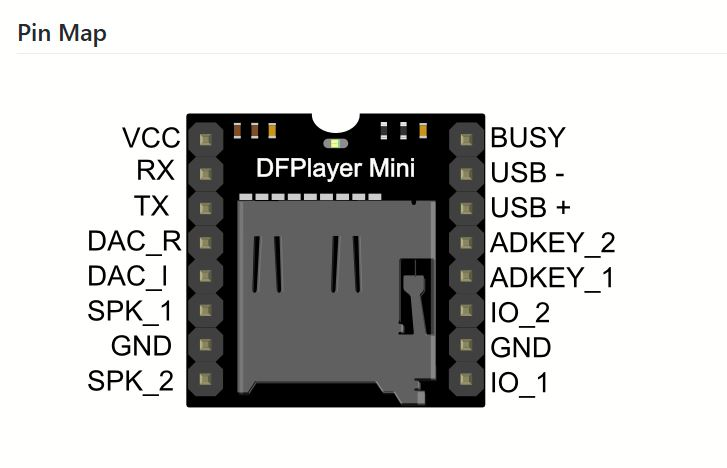

# sesion-09a
## taller clase 7 de octubre


### comienzo de la clase

- este día en clases me sentí muy mal mentalmente, me costó muchísimo ir a la universidad pero fui de todas formas, fue una mañana durísima la verdad
- siento que el grupo está un poco dividido y que falta comunicación, de momento cada persona se está enfocando en un sensor distinto, como investigación a la par por así decirlo para ver qué descubrimos y a qué llegamos
- en mi caso estoy investigando el dfplayer mini, módulo de mp3
- misaaa se acercó para preguntarnos cómo íbamos y también entender más el proyecto porque no lo tenía tan claro
- bernardita y yo le contamos que estábamos viendo la aleatoriedad y funcionamiento del módulo mp3 pero que aún desconocemos como llegar a lo que necesitamos
- misaaa nos recomendó hacer una serie de ejercicios antes porque igual nos sentíamos bastante perdidos, utilizando un botón como un estilo dado, es decir, al presionar el botón se obtiene un dato/número aleatorio
- nos enseñó el pinout para conectar el botón el arduino (subir imagen pendiente)
- la idea de este ejercicio al final sería que al presionar el botón se obtenga un sonido aleatorio, el botón es una especie reemplazo a la persona que se sitúa frente al sensor ultrasónico, que da un dato aleatorio en este caso sería una palabra. El botón es una especie de actuador o causa para obtener un resultado aleatorio
- abrimos un ejemplo de código de botón en arduino que está en la pestaña ejemplos del mismo programa
```cpp
/*
  Button

  Turns on and off a light emitting diode(LED) connected to digital pin 13,
  when pressing a pushbutton attached to pin 2.

  The circuit:
  - LED attached from pin 13 to ground through 220 ohm resistor
  - pushbutton attached to pin 2 from +5V
  - 10K resistor attached to pin 2 from ground

  - Note: on most Arduinos there is already an LED on the board
    attached to pin 13.

  created 2005
  by DojoDave <http://www.0j0.org>
  modified 30 Aug 2011
  by Tom Igoe

  This example code is in the public domain.

  https://www.arduino.cc/en/Tutorial/BuiltInExamples/Button
*/

// constants won't change. They're used here to set pin numbers:
const int buttonPin = 2;  // the number of the pushbutton pin
const int ledPin = 13;    // the number of the LED pin

// variables will change:
int buttonState = 0;  // variable for reading the pushbutton status

void setup() {
  // initialize the LED pin as an output:
  pinMode(ledPin, OUTPUT);
  // initialize the pushbutton pin as an input:
  pinMode(buttonPin, INPUT);
}

void loop() {
  // read the state of the pushbutton value:
  buttonState = digitalRead(buttonPin);

  // check if the pushbutton is pressed. If it is, the buttonState is HIGH:
  if (buttonState == HIGH) {
    // turn LED on:
    digitalWrite(ledPin, HIGH);
  } else {
    // turn LED off:
    digitalWrite(ledPin, LOW);
  }
}
```
- aún debo aprender más sobre este código y el uso del botón
 
### dudas apuntes 1

- documentación investigación de dfplayer mini, módulo mp3
- 
- generar alguna especie de índice en la que aparezcan los audios que quiero reproducir
- lograr detectar cuando la persona se acerca, si está cerca, tira un dado, elige un sonido aleatorio
- switch case, una especie de if más estructurado, switch case, if pasa algo, hay un case (caso) para eso

### dudas, apuntes 2

- debemos lograr la "aleatoriedad" en la lista de reproducción del mp3, por ejemplo, sonido 1, sonido 2, sonido 3
- la aleatoriedad quizá no existe como tal en el sentido de que las palabras que utilizaremos no tienen conexión entre sí, pero de igual manera debemos intercalar las cosas para que no sea tan repetitivo, ej: 1,3,2,5,3,1,4

- del código que reproduce la lista de sonidos, cómo veo cuál sonido está reproduciendo dentro del código? cuál es el parámetro que me indica la lista de sonidos? veo la lista de sonidos?

- vamos a establecer que a cierta distancia sea cierto sonido? o sea habrán distancias a las que se activen ciertas cosas y otras no?


códigos de dfplayer mini que he estado investigando y viendo qué puedo sacar de cada uno de ellos:

```cpp
/***************************************************
 DFPlayer - A Mini MP3 Player For Arduino
 <https://www.dfrobot.com/product-1121.html>
 
 ***************************************************
 This example shows the all the function of library for DFPlayer.
 
 Created 2016-12-07
 By [Angelo qiao](Angelo.qiao@dfrobot.com)
 
 GNU Lesser General Public License.
 See <http://www.gnu.org/licenses/> for details.
 All above must be included in any redistribution
 ****************************************************/

/***********Notice and Trouble shooting***************
 1.Connection and Diagram can be found here
<https://www.dfrobot.com/wiki/index.php/DFPlayer_Mini_SKU:DFR0299#Connection_Diagram>
 2.This code is tested on Arduino Uno, Leonardo, Mega boards.
 ****************************************************/

#include "Arduino.h"
#include "DFRobotDFPlayerMini.h"

#if (defined(ARDUINO_AVR_UNO) || defined(ESP8266))   // Using a soft serial port
#include <SoftwareSerial.h>
SoftwareSerial softSerial(/*rx =*/10, /*tx =*/11);
#define FPSerial softSerial
#else
#define FPSerial Serial1
#endif

DFRobotDFPlayerMini myDFPlayer;
void printDetail(uint8_t type, int value);

void setup()
{
#if (defined ESP32)
  FPSerial.begin(9600, SERIAL_8N1, /*rx =*/D3, /*tx =*/D2);
#else
  FPSerial.begin(9600);
#endif

  Serial.begin(115200);

  Serial.println();
  Serial.println(F("DFRobot DFPlayer Mini Demo"));
  Serial.println(F("Initializing DFPlayer ... (May take 3~5 seconds)"));
  
  if (!myDFPlayer.begin(FPSerial, /*isACK = */true, /*doReset = */true)) {  //Use serial to communicate with mp3.
    Serial.println(F("Unable to begin:"));
    Serial.println(F("1.Please recheck the connection!"));
    Serial.println(F("2.Please insert the SD card!"));
    while(true);
  }
  Serial.println(F("DFPlayer Mini online."));
  
  myDFPlayer.setTimeOut(500); //Set serial communictaion time out 500ms
  
  //----Set volume----
  myDFPlayer.volume(10);  //Set volume value (0~30).
  myDFPlayer.volumeUp(); //Volume Up
  myDFPlayer.volumeDown(); //Volume Down
  
  //----Set different EQ----
  myDFPlayer.EQ(DFPLAYER_EQ_NORMAL);
//  myDFPlayer.EQ(DFPLAYER_EQ_POP);
//  myDFPlayer.EQ(DFPLAYER_EQ_ROCK);
//  myDFPlayer.EQ(DFPLAYER_EQ_JAZZ);
//  myDFPlayer.EQ(DFPLAYER_EQ_CLASSIC);
//  myDFPlayer.EQ(DFPLAYER_EQ_BASS);
  
  //----Set device we use SD as default----
//  myDFPlayer.outputDevice(DFPLAYER_DEVICE_U_DISK);
  myDFPlayer.outputDevice(DFPLAYER_DEVICE_SD);
//  myDFPlayer.outputDevice(DFPLAYER_DEVICE_AUX);
//  myDFPlayer.outputDevice(DFPLAYER_DEVICE_SLEEP);
//  myDFPlayer.outputDevice(DFPLAYER_DEVICE_FLASH);
  
  //----Mp3 control----
//  myDFPlayer.sleep();     //sleep
//  myDFPlayer.reset();     //Reset the module
//  myDFPlayer.enableDAC();  //Enable On-chip DAC
//  myDFPlayer.disableDAC();  //Disable On-chip DAC
//  myDFPlayer.outputSetting(true, 15); //output setting, enable the output and set the gain to 15
  
  //----Mp3 play----
  myDFPlayer.next();  //Play next mp3
  delay(1000);
  myDFPlayer.previous();  //Play previous mp3
  delay(1000);
  myDFPlayer.play(1);  //Play the first mp3
  delay(1000);
  myDFPlayer.loop(1);  //Loop the first mp3
  delay(1000);
  myDFPlayer.pause();  //pause the mp3
  delay(1000);
  myDFPlayer.start();  //start the mp3 from the pause
  delay(1000);
  myDFPlayer.playFolder(15, 4);  //play specific mp3 in SD:/15/004.mp3; Folder Name(1~99); File Name(1~255)
  delay(1000);
  myDFPlayer.enableLoopAll(); //loop all mp3 files.
  delay(1000);
  myDFPlayer.disableLoopAll(); //stop loop all mp3 files.
  delay(1000);
  myDFPlayer.playMp3Folder(4); //play specific mp3 in SD:/MP3/0004.mp3; File Name(0~65535)
  delay(1000);
  myDFPlayer.advertise(3); //advertise specific mp3 in SD:/ADVERT/0003.mp3; File Name(0~65535)
  delay(1000);
  myDFPlayer.stopAdvertise(); //stop advertise
  delay(1000);
  myDFPlayer.playLargeFolder(2, 999); //play specific mp3 in SD:/02/004.mp3; Folder Name(1~10); File Name(1~1000)
  delay(1000);
  myDFPlayer.loopFolder(5); //loop all mp3 files in folder SD:/05.
  delay(1000);
  myDFPlayer.randomAll(); //Random play all the mp3.
  delay(1000);
  myDFPlayer.enableLoop(); //enable loop.
  delay(1000);
  myDFPlayer.disableLoop(); //disable loop.
  delay(1000);

  //----Read imformation----
  Serial.println(myDFPlayer.readState()); //read mp3 state
  Serial.println(myDFPlayer.readVolume()); //read current volume
  Serial.println(myDFPlayer.readEQ()); //read EQ setting
  Serial.println(myDFPlayer.readFileCounts()); //read all file counts in SD card
  Serial.println(myDFPlayer.readCurrentFileNumber()); //read current play file number
  Serial.println(myDFPlayer.readFileCountsInFolder(3)); //read file counts in folder SD:/03
}

void loop()
{
  static unsigned long timer = millis();
  
  if (millis() - timer > 3000) {
    timer = millis();
    myDFPlayer.next();  //Play next mp3 every 3 second.
  }
  
  if (myDFPlayer.available()) {
    printDetail(myDFPlayer.readType(), myDFPlayer.read()); //Print the detail message from DFPlayer to handle different errors and states.
  }
}

void printDetail(uint8_t type, int value){
  switch (type) {
    case TimeOut:
      Serial.println(F("Time Out!"));
      break;
    case WrongStack:
      Serial.println(F("Stack Wrong!"));
      break;
    case DFPlayerCardInserted:
      Serial.println(F("Card Inserted!"));
      break;
    case DFPlayerCardRemoved:
      Serial.println(F("Card Removed!"));
      break;
    case DFPlayerCardOnline:
      Serial.println(F("Card Online!"));
      break;
    case DFPlayerUSBInserted:
      Serial.println("USB Inserted!");
      break;
    case DFPlayerUSBRemoved:
      Serial.println("USB Removed!");
      break;
    case DFPlayerPlayFinished:
      Serial.print(F("Number:"));
      Serial.print(value);
      Serial.println(F(" Play Finished!"));
      break;
    case DFPlayerError:
      Serial.print(F("DFPlayerError:"));
      switch (value) {
        case Busy:
          Serial.println(F("Card not found"));
          break;
        case Sleeping:
          Serial.println(F("Sleeping"));
          break;
        case SerialWrongStack:
          Serial.println(F("Get Wrong Stack"));
          break;
        case CheckSumNotMatch:
          Serial.println(F("Check Sum Not Match"));
          break;
        case FileIndexOut:
          Serial.println(F("File Index Out of Bound"));
          break;
        case FileMismatch:
          Serial.println(F("Cannot Find File"));
          break;
        case Advertise:
          Serial.println(F("In Advertise"));
          break;
        default:
          break;
      }
      break;
    default:
      break;
  }
  
}
```

- este código lo envió janis y mateo para otro grupo que estaba trabajando con un módulo dfplayer mini, fue sacado de [dfrobot](https://wiki.dfrobot.com/DFPlayer_Mini_SKU_DFR0299)
- aún estoy intentando entenderlo, tuve un error algunas veces que compilé el cuál olvidé documentar, creo que tenía que ver con las bibliotecas porque era la única línea del código que daba error
- el error aún aparece pero no es un impedimento para compilar y hacer funcionar el código, no sé si debería arreglarlo o si tendrá una mayor importancia en la parte final del proyecto
- C:\Users\winil\AppData\Local\Arduino15\packages\arduino\hardware\renesas_uno\1.5.0\cores\arduino/api/Binary.h:37:1: error: expected constructor, destructor, or type conversion before 'enum' 
-Usando librería DFRobotDFPlayerMini con versión 1.0.6 en la carpeta: --C:\Users\winil\OneDrive\Documentos\Arduino\libraries\DFRobotDFPlayerMini 
-exit status 1
- este es el error que tiró al compilar, desconozco aún por qué es, hay veces que aparece y otras que no
- lo que he logrado con este código de momento fue reproducir 2 pistas de audio diferentes, de 2 segundos cada una aproximadamente. Eran audios de maullidos de gato solo para probar el funcionamiento, las saqué de youtube (adjuntar link)
- tuve que subir los archivos a la tarjeta SD la cuál debía estar previamente formateada, en este caso los archivos se deben guardan en un orden específico, el reproductor los leerá según el orden que los subimos
- se deben numerar 0001, 0002, 0003, etc para que siga este orden de reproducción
- no entiendo qué hace "case" dentro de este código, se repite muchas veces y está en rosado

### código 2

- estuve investigando otro código pero aún no lo he podido compilar porque me había dado otro error el cuál tampoco registré, (pendiente compilar y registrar todos los errores)
```cpp
#include "Arduino.h"  // Incluye la biblioteca base de Arduino.
#include "DFRobotDFPlayerMini.h"  // Incluye la biblioteca para el módulo DFPlayer Mini.
#include <SoftwareSerial.h>  // Incluye la biblioteca para crear puertos seriales software.

SoftwareSerial Serial1(4,5);  // Crea un puerto serial usando los pines 4 (RX) y 5 (TX).
DFRobotDFPlayerMini myDFPlayer;  // Crea un objeto para controlar el DFPlayer Mini.

void setup() {
  Serial1.begin(9600);  // Inicia la comunicación serial en el puerto Serial1 a 9600 bps.
  Serial.begin(9600);  // Inicia la comunicación serial en el puerto USB a 9600 bps.
  
  myDFPlayer.begin(Serial1);  // Inicia el DFPlayer Mini en el puerto Serial1.
  delay(2000);  // Espera 2 segundos para que el módulo esté listo.
  myDFPlayer.volume(20);  // Establece el volumen a 20.
  myDFPlayer.EQ(DFPLAYER_EQ_NORMAL);  // Establece el ecualizador a normal.
  myDFPlayer.outputDevice(DFPLAYER_DEVICE_SD);  // Selecciona la tarjeta SD como dispositivo de salida.
}


 

void loop() {
  myDFPlayer.playFolder(1, 1);  // Reproduce el primer archivo en el primer folder.
  Serial.println("Reproduciendo pista 1");  // Imprime un mensaje en el monitor serial.
  delay(10000);  // Espera 10 segundos.

  myDFPlayer.playFolder(1, 2);  // Reproduce el segundo archivo en el primer folder.
  Serial.println("Reproduciendo pista 2");  // Imprime un mensaje en el monitor serial.
  delay(10000);  // Espera 10 segundos.

  myDFPlayer.playFolder(1, 3);  // Reproduce el tercer archivo en el primer folder.
  Serial.println("Reproduciendo pista 3");  // Imprime un mensaje en el monitor serial.
  delay(10000);  // Espera 10 segundos.
}
```
- estuve viendo que este código a diferencia del anterior, tiene una manera distinta de almacenar los archivos en la SD
- en el primer código, la línea que establece la pista a reproducir se denomina myDFPlayer.play(1) que significa que reproducirá la primera pista que encuentre en base a la numeración 0001, 0002
- en el segundo código establce myDFPlayer.playfolder(1,2), a diferencia del almacenamiento de audio del código anterior, este código funciona con carpetas por lo que entendí, que serían las folder, en este caso playfolder(1,2) significa: en la carpeta 1, reproduce el archivo 2. El primer número corresponde a la carpeta (folder) y el segundo corresponde al número del archivo dentro de esa carpeta
- otra diferencia que noté es que en este tutorial de DFPlayer [tutorialtecneu](https://www.tecneu.com/blogs/tutoriales-de-electronica/como-utilizar-el-dfplayer-mini-con-arduino-para-proyectos-de-audio) es que utilizan el pin tx del dfplayer al pin 4 del arduino y el pin rx al pin 5 del arduino
- en el caso anterior se conectaba rx del dfplayer al tx del arduino y el rx del arduino al tx del dfplayer, de forma inversa por así decirlo
- desconozco la diferencia aún entre conectar de esta manera los pines


preguntas a chatgpt que pudieran servir

- qué función cumple el "playfolder"
- La función playFolder() es parte de la librería DFRobotDFPlayerMini y sirve para reproducir un archivo MP3 específico dentro de una carpeta concreta de la tarjeta SD del DFPlayer Mini.
- ¿hay que crear distintas carpetas que contengan distintas pistas de audio?
- ejemplo: carpeta 1: tiene sonido 1 y sonido 2, carpeta 2: tiene sonido 3 y 4
- estoy haciendo una comparación entre: myDFPlayer.play(1); // play the first mp3 y myDFPlayer.playfolder(1,2) para ver cuál puede servir para establecer una lista aleatoria
- según lo que entendí con mis palabras: myDFPlayer.play(1) reproduce el primer archivo que encuentre dentro de la SD según el orden en que lo subí, por ejemplo si subo 0001, 0002, 0003 irá reproduciendo en orden como tal según lo encuentre
- según lo que entendí con mis palabras: myDFPLayer.playfolder(1,2) significa que reproducirá de la carpeta 1 el segundo audio, si pongo playfolder(1,1) reproduce el primer audio de la carpeta 1

### documentación jueves 9 de octubre, 17:20 hrs

preguntas para el módulo mp3
- ¿cuánto almacenamiento tiene?
- ¿cuántas pistas de audio utilizaremos?
- ¿qué dirán las pistas de audio? está pendiente definir las cosas que dice la máquina, evaluar qué tan absurdo es
- cómo establecer que pueda reproducir la lista de forma aleatoria en un loop, ejemplo: audio1, audio 3, audio 5, audio 2, audio 3, audio 5
- para qué sirve case
- ¿qué es la aleatoriedad? dentro de estos números que se puedan dar, se podrán repetir en verdad porque el azar no establece que algo no se pueda repetir
- ¿por qué queremos que sea aleatorio? porque queremos que cause sorpresa/desconcierto en el usuario
-  1 3 9 8 7 5
- 1 9 2 0 1 9 4
-  2 9 3 1 0
-  3 9 2 1 8 4
-  esta secuencia se podría repetir en algún momento o cierta parte, si yo lo manipulo deja de ser aleatorio porque ya no lo estoy dejando al azar, tengo cierto control sobre esto
-  según [wikipedia](https://es.wikipedia.org/wiki/Azar#:~:text=El%20azar%20es%20una%20casualidad,Azar%20en%20matem%C3%A1ticas) el azar es: El azar es una casualidad,[1]​ presente, teóricamente, en diversos fenómenos que se caracterizan por causas complejas, no lineales y sobre todo que no parecen ser predecibles en todos sus detalles. Dependiendo del ámbito al que se aplique, se pueden distinguir cuatro tipos de azar:

### errores

- hoy ha sido una jornada de errores en los cuáles retrocedí en cuánto a lo que quería lograr, no logré que el primer código que utilicé el martes funcionara, no sé bien por qué no funcionó, me siento muy frustrado ya que quería avanzar harto en el lab en las 3 horas que estuve y no he podido
- este es el error que arrojó
-  C:\Users\winil\AppData\Local\Arduino15\packages\arduino\hardware\renesas_uno\1.5.0\cores\arduino/api/Binary.h:37:1: error: expected constructor, destructor, or type conversion before 'enum' 
-Usando librería DFRobotDFPlayerMini con versión 1.0.6 en la carpeta: --C:\Users\winil\OneDrive\Documentos\Arduino\libraries\DFRobotDFPlayerMini 
-exit status 1
- llegar a conectar el arduino mediante resistencias con el ejemplo de [tecneu](https://www.tecneu.com/blogs/tutoriales-de-electronica/como-utilizar-el-dfplayer-mini-con-arduino-para-proyectos-de-audio) para ver cuál es la diferencia de conectarlo mediante resistencias y no conectarlo con resistencias

### llegué a la casa

- ahora pude hacer funcionar el código, el error de la librería igual apareció pero compiló de todas formas
- metí 5 pistas de audio distintas enumeradas como 0001,0002,0003,0004 y 0005, se reproducieron en orden


- saqué los sonidos de [orangefreesounds](https://orangefreesounds.com/sound-effects/animal-sounds/cat-meow-sound/) y [myinstants](https://www.myinstants.com/en/search/?name=cat%20meow)
- logré reproducir las 5 pistas de forma random y en loop mediante una línea de código que aparecía en la página de [dfrobot](https://wiki.dfrobot.com/DFPlayer_Mini_SKU_DFR0299#Sample%20Code)
- grabé 5 pistas distintas y todas son diferentes entre sí, (subir videos)
- el código quedó de la siguiente manera
```cpp
 
 
 

 


/***********Notice and Trouble shooting***************
 1.Connection and Diagram can be found here
 <https://www.dfrobot.com/wiki/index.php/DFPlayer_Mini_SKU:DFR0299#Connection_Diagram>
 2.This code is tested on Arduino Uno, Leonardo, Mega boards.
 ****************************************************/

#include "Arduino.h"
#include "DFRobotDFPlayerMini.h"

#if (defined(ARDUINO_AVR_UNO) || defined(ESP8266))   // Using a soft serial port
#include <SoftwareSerial.h>
SoftwareSerial softSerial(/*rx =*/4, /*tx =*/5);
#define FPSerial softSerial
#else
#define FPSerial Serial1
#endif

DFRobotDFPlayerMini myDFPlayer;
void printDetail(uint8_t type, int value);

void setup()
{
#if (defined ESP32)
  FPSerial.begin(9600, SERIAL_8N1, /*rx =*/A3, /*tx =*/A2);
#else
  FPSerial.begin(9600);
#endif

  Serial.begin(115200);

  Serial.println();
  Serial.println(F("DFRobot DFPlayer Mini Demo"));
  Serial.println(F("Initializing DFPlayer ... (May take 3~5 seconds)"));
  
  if (!myDFPlayer.begin(FPSerial, /*isACK = */true, /*doReset = */true)) {  //Use serial to communicate with mp3.
    Serial.println(F("Unable to begin:"));
    Serial.println(F("1.Please recheck the connection!"));
    Serial.println(F("2.Please insert the SD card!"));
    while(true){
      delay(0); // Code to compatible with ESP8266 watch dog.
    }
  }
  Serial.println(F("DFPlayer Mini online."));
  
  myDFPlayer.volume(10);  //establecer volumen, entre 0 y 30, he probado con 100 y no se si es distinto a 30
  myDFPlayer.play(1);  // reproduce el primer archivo mp3
  myDFPlayer.randomAll(); //me permite reproducir de manera aleatoria los archivos del mp3
  delay(2000);
}

void loop()
{
  static unsigned long timer = millis();
  
  if (millis() - timer > 3000) {
    timer = millis();
    myDFPlayer.next();  //Play next mp3 every 3 second.
  }
  
  if (myDFPlayer.available()) {
    printDetail(myDFPlayer.readType(), myDFPlayer.read()); //Print the detail message from DFPlayer to handle different errors and states.
  }
}

void printDetail(uint8_t type, int value){
  switch (type) {
    case TimeOut:
      Serial.println(F("Time Out!"));
      break;
    case WrongStack:
      Serial.println(F("Stack Wrong!"));
      break;
    case DFPlayerCardInserted:
      Serial.println(F("Card Inserted!"));
      break;
    case DFPlayerCardRemoved:
      Serial.println(F("Card Removed!"));
      break;
    case DFPlayerCardOnline:
      Serial.println(F("Card Online!"));
      break;
    case DFPlayerUSBInserted:
      Serial.println("USB Inserted!");
      break;
    case DFPlayerUSBRemoved:
      Serial.println("USB Removed!");
      break;
    case DFPlayerPlayFinished:
      Serial.print(F("Number:"));
      Serial.print(value);
      Serial.println(F(" Play Finished!"));
      break;
    case DFPlayerError:
      Serial.print(F("DFPlayerError:"));
      switch (value) {
        case Busy:
          Serial.println(F("Card not found"));
          break;
        case Sleeping:
          Serial.println(F("Sleeping"));
          break;
        case SerialWrongStack:
          Serial.println(F("Get Wrong Stack"));
          break;
        case CheckSumNotMatch:
          Serial.println(F("Check Sum Not Match"));
          break;
        case FileIndexOut:
          Serial.println(F("File Index Out of Bound"));
          break;
        case FileMismatch:
          Serial.println(F("Cannot Find File"));
          break;
        case Advertise:
          Serial.println(F("In Advertise"));
          break;
        default:
          break;
      }
      break;
    default:
      break;
  }
  
}
```
- la única sección que fue modificada fue
```cpp
myDFPlayer.volume(10);  //establecer volumen, entre 0 y 30, he probado con 100 y no se si es distinto a 30
  myDFPlayer.play(1);  // reproduce el primer archivo mp3
  myDFPlayer.randomAll(); //me permite reproducir de manera aleatoria los archivos del mp3
  delay(2000);
```
- se añadió la linea myDFPlayer.randomAll la cuál me permite reproducir de forma aleatoria las pistas de audio
- una observación es que algunos audios se interrumpen para comenzar otro de forma instantánea, esto generaría un problema si queremos que todas las palabras se escuchen completas, intenté ajustando el delay, bajando y subiendo el valor pero no comprendo aún como hacer que no se corten


