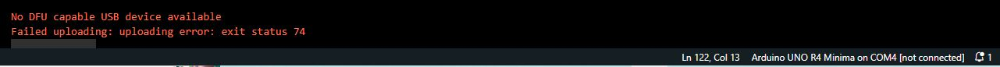
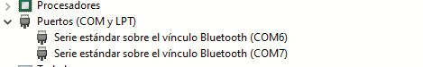
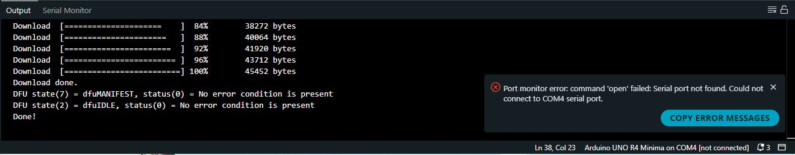
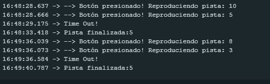

# sesion-09b
## taller clase 10 de octubre

muy desanimado hoy pero hay que seguir

### aprendizajes y dudas

- misaaa nos explicó el concepto de la función millis para poder aplicarla en el código del dfplayer mini mp3
- la función delay no es buena para estos proyectos porque delay hace que nuestro arduino entre en un estado de pausa, esto lo "desactiva" por un momento lo cuál hace que los sensores que estemos utilizando dejen de funcionar, es por ello que debemos trabajar con la función millis
- entendí más o menos, debo repasar

### definición de la carcasa y apuntes

- actualizar bitácora pendiente
- resolver si o si el módulo mp3 y la aleatoriedad, lograr el ejercicio del botón dado y repasar el concepto de millis para aprender y usar lo menos posible delay, estoy muy confundido
- redefinimos el proyecto en cuánto a carcasa ya que no teníamos una idea muy clara y lo entendíamos de forma distinta entre los integrantes del grupo
- la idea que se tenía en un principio era poner los módulos en la pared, por una parte los ojos y por otra parte la oreja, creando una experiencia museográfica, una especie de recorrido en la que los módulos estuvieran separados. El problema es que no teníamos definida la forma de la carcasa más a detalle sino que era a nivel general
- es por ello que reformulamos la carcasa pero la base sigue siendo la misma: entra persona, es detectada por el ultrasónico, se mueve y sigue a la persona, en base a la distancia reproducirá un sonido aleatorio. Las ideas que se dieron durante la clase fueron:

- crear una especie de cuadro de Vincent Van Gogh en la cuál los ojos te siguen y la oreja es la que te hable (por el guiño a la pérdida de la oreja de Vincent), se lo comentamos a Aarón pero nos dijo que era un tema delicado de tratar, primero por plagio y segundo porque no es una situación que deba ser tomada a la ligera porque Vincent sufrió muchísimo. Por estos motivos decidimos reformularlo
- pensamos en cuando uno va a la playa y se pone una concha marina en el oído y te da esa sensación de que se "escucha" el mar, entonces lo atribuimos a una especie de concha que generaba sonidos de la playa, ya sean de naturaleza tanto como de personas y situaciones que sucedan en la playa, ejemplo: un vendedor de palmeras
- sigue manteniendo el concepto de aleatoriedad ya que lo que se busca es sorprender al usuario jugando con el sin sentido de las palabras/frases
- también se pensó en la idea de que los ojos ahora fueran los ojos de un cangrejo ermitaño y que la concha del cangrejo sea la que emite los sonidos de la playa

### avances y comentarios del fin de semana
-  anteriormente habíamos logrado reproducir sonidos de forma aleatoria pero no había un control sobre el cómo se reproducían. Estos sonidos se reproducían en un loop infinito de forma aleatoria, por ende, necesitábamos un orden y que funcionasen en base a "si ocurre esto, pasa esto" la idea era que el botón funcionara como una especie de dado
-   jota morales pudo resolver el paso que nos faltaba el cuál era poder reproducir de forma aleatoria un sonido mediante la pulsación de un botón, funcionó en un momento pero luego dejó de funcionar y dió el siguiente error a jota y a mi
-   este es el código que realizó jota morales

  
- error que arrojó al probar el código que realizó jota morales en su sesión [9b](https://github.com/brauliofigueroa2001/dis8645-2025-02-procesos/tree/main/17-jotamorales-romulus/sesion-09b) el cuál permite reproducir un sonido aleatorio por medio de la pulsación de un botón
- No DFU capable USB device available, Failed uploading: uploading error: exit status 74
- me aparece en notificaciones de windows que no se reconoce el dispositivo usb, es extraño porque el cable está bueno y había funcionado con códigos anteriores, estamos intentando resolver el error
- estoy intentando resolver preguntándole a chatgpt la causa del error porque la desconozco, seguí las siguientes instrucciones

- cerrar y reabrir el ide
- desconectar la placa
- mantener presionado el botón RESET en la placa
- mientras lo mantienes presionado, conéctala al USB
- espera 1–2 segundos y suelta el botón RESET
- intenta subir el sketch nuevamente
- no funcionó
- utilicé el código anterior de la clase del viernes, que generaba sonidos aleatorios, para ver si con este código lanzaba el error y así fue

```cpp

***********Notice and Trouble shooting***************
 1.Connection and Diagram can be found here
 <https://www.dfrobot.com/wiki/index.php/DFPlayer_Mini_SKU:DFR0299#Connection_Diagram>
 2.This code is tested on Arduino Uno, Leonardo, Mega boards.
 ****************************************************/

#include "Arduino.h"
#include "DFRobotDFPlayerMini.h"

#if (defined(ARDUINO_AVR_UNO) || defined(ESP8266))   // Using a soft serial port
#include <SoftwareSerial.h>
SoftwareSerial softSerial(/*rx =*/4, /*tx =*/5);
#define FPSerial softSerial
#else
#define FPSerial Serial1
#endif

DFRobotDFPlayerMini myDFPlayer;
void printDetail(uint8_t type, int value);

void setup()
{
#if (defined ESP32)
  FPSerial.begin(9600, SERIAL_8N1, /*rx =*/A3, /*tx =*/A2);
#else
  FPSerial.begin(9600);
#endif

  Serial.begin(115200);

  Serial.println();
  Serial.println(F("DFRobot DFPlayer Mini Demo"));
  Serial.println(F("Initializing DFPlayer ... (May take 3~5 seconds)"));
  
  if (!myDFPlayer.begin(FPSerial, /*isACK = */true, /*doReset = */true)) {  //Use serial to communicate with mp3.
    Serial.println(F("Unable to begin:"));
    Serial.println(F("1.Please recheck the connection!"));
    Serial.println(F("2.Please insert the SD card!"));
    while(true){
      delay(0); // Code to compatible with ESP8266 watch dog.
    }
  }
  Serial.println(F("DFPlayer Mini online."));
  
  myDFPlayer.volume(10);  //establecer volumen, entre 0 y 30, he probado con 100 y no se si es distinto a 30
  myDFPlayer.play(1);  // reproduce el primer archivo mp3
  myDFPlayer.randomAll(); //me permite reproducir de manera aleatoria los archivos del mp3
  delay(2000);
}

void loop()
{
  static unsigned long timer = millis();
  
  if (millis() - timer > 3000) {
    timer = millis();
    myDFPlayer.next();  //Play next mp3 every 3 second.
  }
  
  if (myDFPlayer.available()) {
    printDetail(myDFPlayer.readType(), myDFPlayer.read()); //Print the detail message from DFPlayer to handle different errors and states.
  }
}

void printDetail(uint8_t type, int value){
  switch (type) {
    case TimeOut:
      Serial.println(F("Time Out!"));
      break;
    case WrongStack:
      Serial.println(F("Stack Wrong!"));
      break;
    case DFPlayerCardInserted:
      Serial.println(F("Card Inserted!"));
      break;
    case DFPlayerCardRemoved:
      Serial.println(F("Card Removed!"));
      break;
    case DFPlayerCardOnline:
      Serial.println(F("Card Online!"));
      break;
    case DFPlayerUSBInserted:
      Serial.println("USB Inserted!");
      break;
    case DFPlayerUSBRemoved:
      Serial.println("USB Removed!");
      break;
    case DFPlayerPlayFinished:
      Serial.print(F("Number:"));
      Serial.print(value);
      Serial.println(F(" Play Finished!"));
      break;
    case DFPlayerError:
      Serial.print(F("DFPlayerError:"));
      switch (value) {
        case Busy:
          Serial.println(F("Card not found"));
          break;
        case Sleeping:
          Serial.println(F("Sleeping"));
          break;
        case SerialWrongStack:
          Serial.println(F("Get Wrong Stack"));
          break;
        case CheckSumNotMatch:
          Serial.println(F("Check Sum Not Match"));
          break;
        case FileIndexOut:
          Serial.println(F("File Index Out of Bound"));
          break;
        case FileMismatch:
          Serial.println(F("Cannot Find File"));
          break;
        case Advertise:
          Serial.println(F("In Advertise"));
          break;
        default:
          break;
      }
      break;
    default:
      break;
  }
  
}
```

- pese a ser otro código, este error sigue apareciendo




- por recomendación de chatgpt me sugirió buscar en el administrador de dispositivos para ver si estaba reconociendo el COM4 pero no aparece en la lista de puertos




### avances 13 de octubre en la tarde

- definir los tipos de audio que utilizaremos, se basará en sonidos de la playa los cuáles incluyen naturaleza y entorno
- ideas de sonidos: olas, gente vendiendo cosas, sonidos de puerto

### el error

- documentar el error que ocurría, arduino dejó de reconocer com4,

- código funcionando, lo raro es que en el monitor serial muestra que se reproducen 2 pistas de audios cuando se apreta 1 vez el botón y se reproduce una

```cpp
#include "Arduino.h"
#include "DFRobotDFPlayerMini.h"

#if (defined(ARDUINO_AVR_UNO) || defined(ESP8266))  // Using a soft serial port
#include <SoftwareSerial.h>
SoftwareSerial softSerial(/*rx =*/4, /*tx =*/5);
#define FPSerial softSerial
#else
#define FPSerial Serial1
#endif

DFRobotDFPlayerMini myDFPlayer;
void printDetail(uint8_t type, int value);

// --- Constantes del Proyecto ---
const int botonPin = 2;
const int totalTracks = 10;                     // Número total de archivos mp3 en la SD

// --- Variables de estado ---
unsigned long ultimoDebounceTiempo = 0; // Para el antirrebote del botón
const unsigned long debounceDelay = 50; // Tiempo de espera del antirrebote (50 ms)

void setup()
{
  FPSerial.begin(9600);
  Serial.begin(115200);

  Serial.println(F("DFPlayer Mini - Reproductor por Botón"));
  Serial.println(F("Inicializando..."));

  if (!myDFPlayer.begin(FPSerial)) {
    Serial.println(F("Error de comunicación con DFPlayer."));
    Serial.println(F("Verifica conexiones y tarjeta SD."));
    while (true);
  }
  Serial.println(F("DFPlayer en línea. Listo para usar."));

  myDFPlayer.volume(20); // Ajusta el volumen (0 a 30)

  randomSeed(analogRead(0));
  pinMode(botonPin, INPUT_PULLUP);
}

void loop() {
  // --- 1. LÓGICA DEL BOTÓN (ÚNICA FORMA DE REPRODUCIR) ---
  // Revisa si el botón se ha presionado y si ha pasado el tiempo de antirrebote
  if (digitalRead(botonPin) == LOW && (millis() - ultimoDebounceTiempo) > debounceDelay) {
    
    // Elige un número al azar y lo reproduce
    int track = random(1, totalTracks + 1);
    Serial.print(F("--> Botón presionado! Reproduciendo pista: "));
    Serial.println(track);
    myDFPlayer.play(track);

    // Actualiza el tiempo del antirrebote para evitar lecturas falsas
    ultimoDebounceTiempo = millis();
  }

  // --- 2. REVISAR MENSAJES DEL DFPLAYER ---
  // Tarea de fondo: revisa si el módulo ha enviado información (ej: "pista terminada")
  if (myDFPlayer.available()) {
    printDetail(myDFPlayer.readType(), myDFPlayer.read());
  }
}


// La función printDetail sigue siendo la misma...
void printDetail(uint8_t type, int value){
  switch (type) {
    case TimeOut:
      Serial.println(F("Time Out!"));
      break;
    case WrongStack:
      Serial.println(F("Stack Wrong!"));
      break;
    case DFPlayerCardInserted:
      Serial.println(F("Card Inserted!"));
      break;
    case DFPlayerCardRemoved:
      Serial.println(F("Card Removed!"));
      break;
    case DFPlayerCardOnline:
      Serial.println(F("Card Online!"));
      break;
    case DFPlayerPlayFinished:
      Serial.print(F("Pista finalizada:"));
      Serial.println(value);
      break;
    case DFPlayerError:
      Serial.print(F("DFPlayerError:"));
      switch (value) {
        case Busy:
          Serial.println(F("Ocupado"));
          break;
        case Sleeping:
          Serial.println(F("Durmiendo"));
          break;
        case SerialWrongStack:
          Serial.println(F("Error de Stack Serial"));
          break;
        case CheckSumNotMatch:
          Serial.println(F("Error de Checksum"));
          break;
        case FileIndexOut:
          Serial.println(F("Índice de archivo fuera de rango"));
          break;
        case FileMismatch:
          Serial.println(F("No se encuentra el archivo"));
          break;
        case Advertise:
          Serial.println(F("En modo Advertise"));
          break;
        default:
          break;
      }
      break;
    default:
      break;
  }
}
```
- este error muestra que dejó de reconocer el puerto com 4 de arduino
  




- muestra en el monitor serial que al apretar un botón muestra que se reproducen 2 pistas de audio en vez de uno

16 de octubre

- reflexión individual sobre el proyecto: creo que la mayor dificultad que enfrentamos en el proyecto fue la comunicación y el entender las distintas capacidades de los demás para poder llegar a ser un grupo que tuviera una mayor cohesión. En diversas ocasiones sentí que nos separábamos mucho como grupo y sentía que nos queríamos decir más cosas como equipo pero al final no lo hacíamos, no sé si por verguenza o por incomodidad. No sé si seré la única persona del grupo que se sintió así

- Creo que no me pude terminar de sentir en un ambiente cómodo en el grupo, pero creo que también es porque siento que me cuesta adaptarme en cualquier lugar que esté, entonces no sé si es más algo de las personas con las que trabajo o algo mío más personal. Pienso que debería ser más claro cuando necesito ayuda con algo o saber expresarlo mejor para no sentirme tan encerrado en cómo me siento en cuanto a la frustración que conlleva un proyecto y de esta manera poder trabajar mejor en un futuro, a modo de autocrítica creo que me falta estudiar muchísimo más

- En cuanto al proyecto en sí, creo que me gustaría implementar más cosas para hacerlo más parecido a una especie de juguete que huya de las personas cuando las detecte, estilo cangrejo que camina de lado y que al mismo tiempo pueda tener algún tipo de detección de obstáculos para hacerlo más dinámico e interactivo con un potencial público

