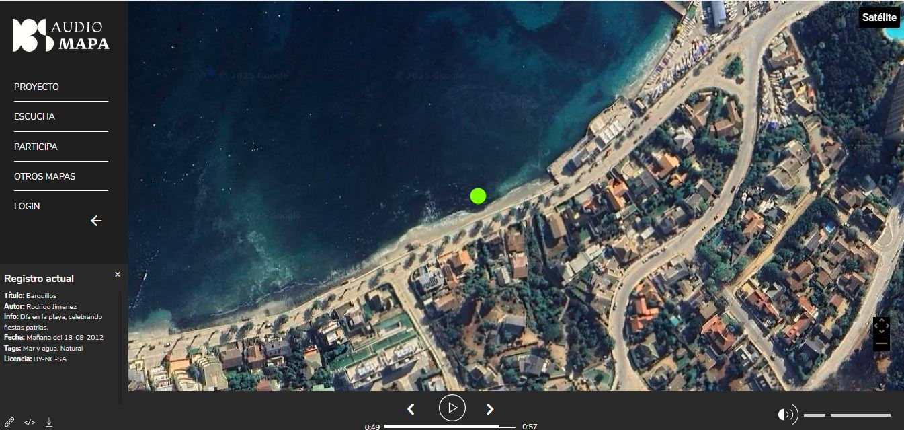
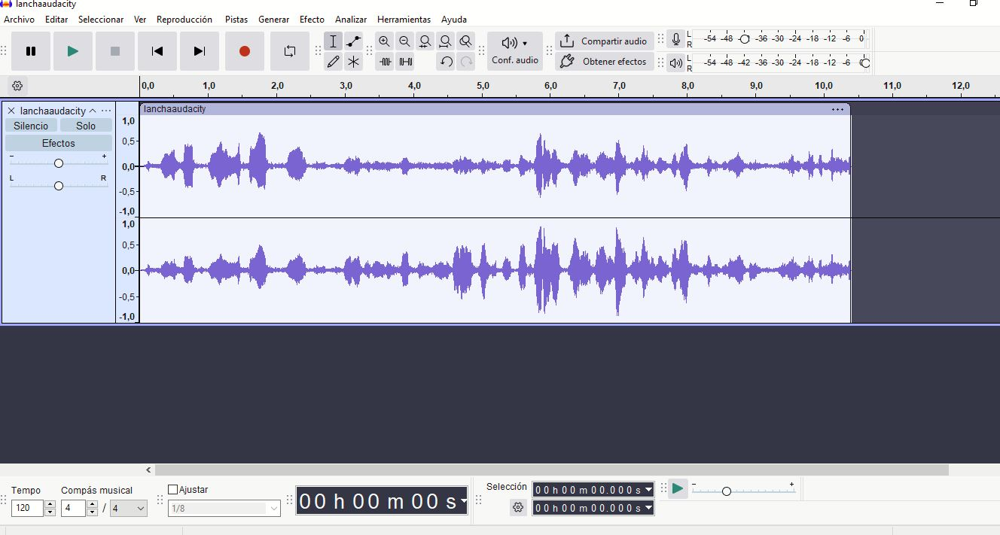

# sesion-10a
## taller día martes 14 de octubre

último día de trabajo en clases antes de la presentación

- por hacer, seleccionar los 10 archivos mp3 de sonidos de playas

- recopilé los audios que envió bernardita de parte de felix blume de su albúm sonidos de valparaíso
- en un comienzo los corté con recortadores de audio online pero misaaa me dijo que evitara utilizarlos porque podían hacer perder la calidad de los audios por lo cuál me recomendó usar el software Audacity
- pasé todos los audios por Audacity y los recorté en duraciones entre 9 y 10 segundos
- aparte de los registros de valparaiso de felix blume, misaaa me recomendó una página llamada [audiomapa](https://audiomapa.org/) en la cuál hay registros sonoros que suben las personas y son de libre acceso. En base a esto busqué sonidos en las costas chilenas y encontré bastantes que servían para el proyecto. Creo que lo bueno de haber utilizado registros de Chile hace que el trabajo sea más natural por así decirlo y no con algún sonido .mp4 sacado de alguna página de sonidos, lo hace más auténtico



- aquí hay un ejemplo de cómo se buscaban los audios en la página, movías el mapa y aparecía un punto verde el cuál contenía un sonido el cuál lo podías descargar y utilizar. Este mismo audio lo puse dentro de los archivos mp3 que quería que se reproducieran en la lista de los 10 archivos que utilizaremos

- luego de haber seleccionado los audios aquí dejo un registro utilizando Audacity para cortarlos y exportarlos de manera que no perdieran mucha calidad



- mientras hacía esto le pregunté a misaaa por unas opciones que daba el módulo dfplayer las cuáles eran
- myDFPlayer.EQ(DFPLAYER_EQ_NORMAL);
-  myDFPlayer.EQ(DFPLAYER_EQ_POP);
-  myDFPlayer.EQ(DFPLAYER_EQ_ROCK);
-  myDFPlayer.EQ(DFPLAYER_EQ_JAZZ);
-  myDFPlayer.EQ(DFPLAYER_EQ_CLASSIC);
-  myDFPlayer.EQ(DFPLAYER_EQ_BASS);

-  según la página de [wikidfrobot](https://wiki.dfrobot.com/dfplayer_mini_sku_dfr0299) estas opciones permiten ecualizar nuestro módulo mp3 según el tipo de sonido que queramos escuchar, es decir, para un sonido en que queremos que se escuchen los bajos o los agudos, utilizaremos cierto tipo de ecualización
-  en este caso misaaa me dijo que no era necesario poner una línea de código para ecualizar porque el parlante que usaremos es tan pequeño que un cambio en cómo se escucha el sonido en verdad sería imperceptible y poco relevante por lo cuál no lo utilicé
-  dejé los 10 audios listos y los puse en una carpeta dentro de proyecto 02 grupo 04

- por otra parte en cuanto a código, el código que nos daba error el día anterior logró funcionar con el botón y dar sonidos de forma aleatoria

````cpp
#include "Arduino.h"
#include "DFRobotDFPlayerMini.h"

#if (defined(ARDUINO_AVR_UNO) || defined(ESP8266))  // Using a soft serial port
#include <SoftwareSerial.h>
SoftwareSerial softSerial(/*rx =*/4, /*tx =*/5);
#define FPSerial softSerial
#else
#define FPSerial Serial1
#endif

DFRobotDFPlayerMini myDFPlayer;
void printDetail(uint8_t type, int value);

// --- Constantes del Proyecto ---
const int botonPin = 2;
const int totalTracks = 10;                     // Número total de archivos mp3 en la SD

// --- Variables de estado ---
unsigned long ultimoDebounceTiempo = 0; // Para el antirrebote del botón
const unsigned long debounceDelay = 50; // Tiempo de espera del antirrebote (50 ms)

void setup()
{
  FPSerial.begin(9600);
  Serial.begin(115200);

  Serial.println(F("DFPlayer Mini - Reproductor por Botón"));
  Serial.println(F("Inicializando..."));

  if (!myDFPlayer.begin(FPSerial)) {
    Serial.println(F("Error de comunicación con DFPlayer."));
    Serial.println(F("Verifica conexiones y tarjeta SD."));
    while (true);
  }
  Serial.println(F("DFPlayer en línea. Listo para usar."));

  myDFPlayer.volume(15); // Ajusta el volumen (0 a 30)

  randomSeed(analogRead(0));
  pinMode(botonPin, INPUT_PULLUP);
}

void loop() {
  // --- 1. LÓGICA DEL BOTÓN (ÚNICA FORMA DE REPRODUCIR) ---
  // Revisa si el botón se ha presionado y si ha pasado el tiempo de antirrebote
  if (digitalRead(botonPin) == LOW && (millis() - ultimoDebounceTiempo) > debounceDelay) { 
    
    // Elige un número al azar y lo reproduce
    int track = random(1, totalTracks + 1);
    Serial.print(F("--> Botón presionado! Reproduciendo pista: "));
    Serial.println(track);
    myDFPlayer.play(track);

    // Actualiza el tiempo del antirrebote para evitar lecturas falsas
    ultimoDebounceTiempo = millis();
  }

  // --- 2. REVISAR MENSAJES DEL DFPLAYER ---
  // Tarea de fondo: revisa si el módulo ha enviado información (ej: "pista terminada")
  if (myDFPlayer.available()) {
    printDetail(myDFPlayer.readType(), myDFPlayer.read());
  }
}


// La función printDetail sigue siendo la misma...
void printDetail(uint8_t type, int value){
  switch (type) {
    case TimeOut:
      Serial.println(F("Time Out!"));
      break;
    case WrongStack:
      Serial.println(F("Stack Wrong!"));
      break;
    case DFPlayerCardInserted:
      Serial.println(F("Card Inserted!"));
      break;
    case DFPlayerCardRemoved:
      Serial.println(F("Card Removed!"));
      break;
    case DFPlayerCardOnline:
      Serial.println(F("Card Online!"));
      break;
    case DFPlayerPlayFinished:
      Serial.print(F("Pista finalizada:"));
      Serial.println(value);
      break;
    case DFPlayerError:
      Serial.print(F("DFPlayerError:"));
      switch (value) {
        case Busy:
          Serial.println(F("Ocupado"));
          break;
        case Sleeping:
          Serial.println(F("Durmiendo"));
          break;
        case SerialWrongStack:
          Serial.println(F("Error de Stack Serial"));
          break;
        case CheckSumNotMatch:
          Serial.println(F("Error de Checksum"));
          break;
        case FileIndexOut:
          Serial.println(F("Índice de archivo fuera de rango"));
          break;
        case FileMismatch:
          Serial.println(F("No se encuentra el archivo"));
          break;
        case Advertise:
          Serial.println(F("En modo Advertise"));
          break;
        default:
          break;
      }
      break;
    default:
      break;
  }
}
```


- no supimos cómo mezclar este código en conjunto con el del ultrasónico por lo cuál lo metimos a la IA gemini pero nos dió muchos errores por lo cuál se le pidió ayuda a Aarón para que nos pudiera guiar mejor


- si la distancia actual es menor o igual a la distancia que necesita el mp3 para reproducirse y activarlo


