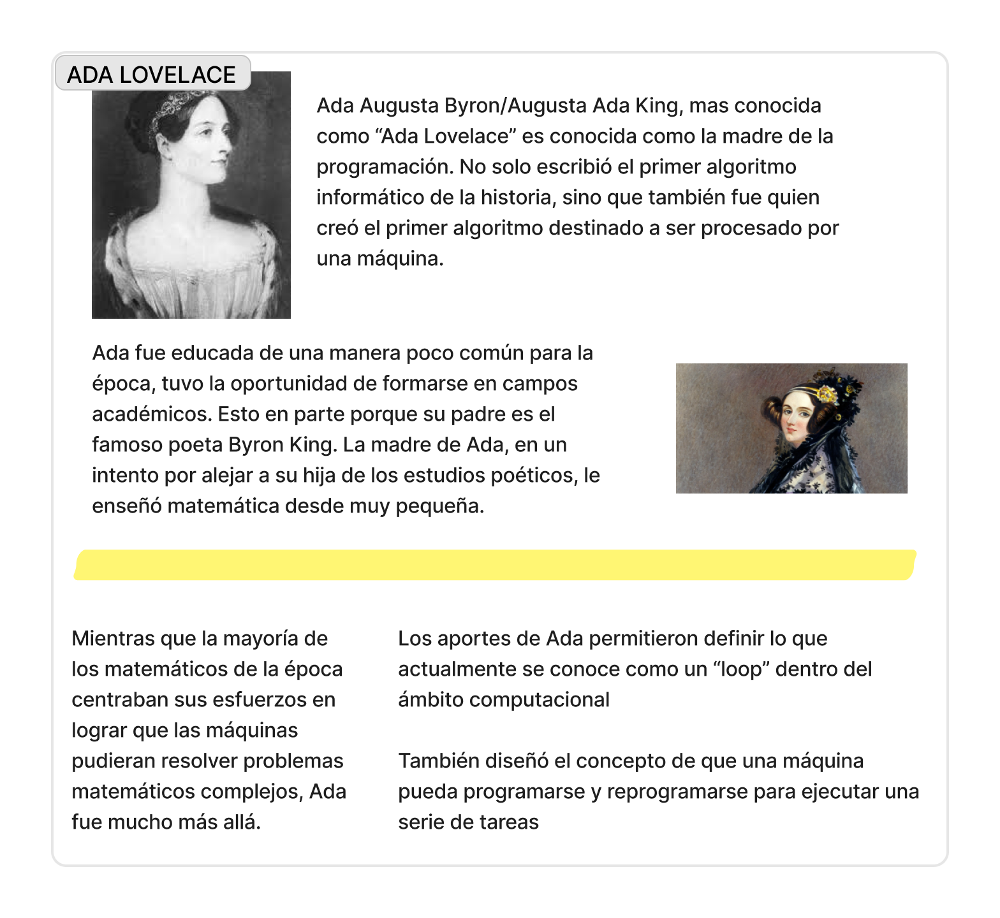

# sesion-01a

## 05-agosto-2025 - clase 1

### ¿qué es una máquina?

objeto físico, capacidad de ejecutar procesos, tiene in & out, requiere energía, tiene un objetivo específico, facilita una tarea.

no se puede definir un sujeto por su predicado. Un auto no es "un objeto que transporta cosas", es un auto. Y tiene capacidad de transportar cosas.

según gemini, viene del latín "machina" y este viene del griego "mekhane" que refiere a medio, ingenio o artificio.

tecnología viene del griego tekhné. Refiere a arte, oficio o destreza.

computación viene del latín "compútare" que significa contar o calcular.

algo estático no es una máquina.

### conexiones entre estos conceptos y las definiciones dadas

medio: tiempo, energía

medio tiene 37 asepciones(37 significados distintos para la misma palabra).

ingenio: invención

artificio: piezas, objeto físico, intención

## Diseño de Máquinas Computacionales

- objeto físico

- lenguaje{signos, símbolos}

- orden lógico{combinacional, secuencial}

- cómputo{número}

- datos/información

- HCI: interfaz humano-computador

## energía

pensar en energía es pensar en tranformación.

Para que ocurra una transformació, debe haber una intervención en el tiempo.

El tiempo es el sutrato de la energpia, no pueden haber transformaciones si el tiempo no avanza.

una máquina requiere energía, para que la energáa circule necesita tiempo.

Una máquina implica tiempo. Algo estático no es una máquina.

### encargo

Investigar:

- Ada Lovelace

- Alan Turig

## información relevante

- [ASISTENCIA Y NOTAS](https://docs.google.com/spreadsheets/d/e/2PACX-1vRnFAEnt5oLCFWewvBVA58Pi46nAygd1loPPLg1okp0Uxrve20pwYoe92ZW1s2e01EFvVJ3CpKFXwVx/pubhtml)

### equipo

#### github

- [Aarón](https://github.com/montoyamoraga)

- [Misa](https://github.com/misaaaaaa)

- [Mateo](https://github.com/matbutom)

- [Janis](https://github.com/janisepulveda)

#### instagram

- [Instagram Laboratorio de Interacción Digital.](https://www.instagram.com/lid.udp)

- [Instagram Taller Dis Máquinas Electrónicas/Computacionales](https://www.instagram.com/teee.udp)

- [Instagram Aarón](https://www.instagram.com/montoyamoraga)

- [Instagram Misa](https://www.instagram.com/misaa.cc)

- [Instagram Mateo](https://www.instagram.com/matbutom)

- [Instagram Janis](https://www.instagram.com/jnsplv)

## personas

- Lidia Casas

- Raúl Zurita

- Alejandra Matus

- Muriel Cooper

- John Maeda

- Casey Reas

- Ben Fry

- Hernando Barragán

- [Christian Oyarzún](https://error404.cl)

- Tom Igoe

- Ada Lovelace: inventora de la computación

- Alan Turing

- [Mar Hicks](https://marhicks.com) destaca la importancia de las mujeres en la computación.

## conjuntos

- [The Aesthetics + Computations Group](https://acg.media.mit.edu)}

- [Núcleo de Artes Sonoras](https://nucleoartessonoras.bandcamp.com)

## libros

- Design By Numers - John Maeda

## conceptos

- STS: science, tecnology and society. Se esta cultivando esta área que se centra en la UX.

- HCI: interfaz humano computador

- THT: Trough Hole Technology

- SMD: Surface Mount Device

- [Pick and Place Machine](https://www.youtube.com/watch?v=8sKMdP88KUw)

- PCB: Circuit Printed Board

- PCBA: Printed Circuit Board Assembly

- [Microcontrolador:](https://es.wikipedia.org/wiki/Microcontrolador) Circuito integrado programable

- [ATmega328](https://en.wikipedia.org/wiki/ATmega328): un chip programable, el arduino se creó en base a este chip

## proyectos

- [Arduino:](https://www.arduino.cc) es una placa con un microcontrolador integrado

- [Processing](https://processing.org): herramienta/entorno de programación encofado a la parte visual.

- [Wiring](https://en.wikipedia.org/wiki/Wiring_(software)) - Fernando Baragán

## encargos

### Ada Lovelace

Esta es una pequeña investigación que hice en el marco del curso de profundización Programación Creativa Multimedia.

## Alan Turing

Alan Turing fue un matemático, criptógrafo, entre otros. Nacido en 1912 en Londres, falleció en 1954. Se dice que se suicidó debido a las grandes prresiones y ostigamientos que recibió debido a su orientación sexual.

Alan Turing entre otras cosas, es recordado  por sus aportes tecnológicos durante la 2da guerra mundial, su creación ["Bombe"](https://www.codesandciphers.org.uk/virtualbp/tbombe/bombesc.htm) se estima acortó la guerra entre 2 y 4 años. Además se le considera el padre teóirico de la IA, debido a su invención el ["test de Turing"](https://turingtest.live). Este test se puede considerar como "el referente" usado para crear los CAPTCHA.

A pesar de sus múltples e influyentes aportes a la ciencia y el mundo, Turing fue perseguido e incluso encarcelado en 1952 por ser homosexual. Han habido ciertos de intentos de reparación y conmemoración por parte del reino británico, incluyendo un indulto póstumo otorgado por la Reina Isabel II, y el uso del término [Ley Alan Turing](https://es.wikipedia.org/wiki/Ley_Alan_Turing) para referir a la ley que perdona y conmemora la amonestación y condena de la homosexualidad.
