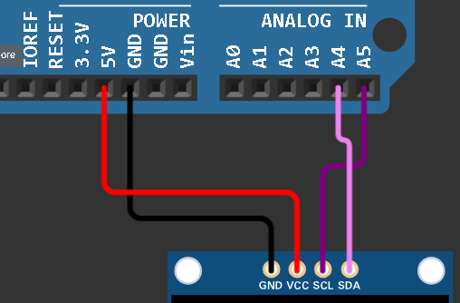

# sesion-03b

## 22-agosto-2025 - clase 6

### clase online

#### pantallas

por lo general, hay 3 criterios que importan al elegir una pantalla

resolución: cantidad y densidad de pixeles

es el número de pixeles individuales que puede mostrarse en una dimensión.

[Número UNO](https://www.dandolahora.cl/products/prototipo-el-numero-uno-el-primer-reloj-digital-en-la-historia-de-chile) el primer reloj digital diseñado y fabricado en chile


este es el display que usaremos. utiliza un chip 1306

- [referencia del display](https://docs.wokwi.com/parts/board-ssd1306)

pines:

VCC: carga postivia

GND: carga negativa

SCL: signal clock, determina el pulso de tiempo

SDA: signal data.



## codigos clase

```cpp
#include <Wire.h>
#include <Adafruit_GFX.h>
#include <Adafruit_SSD1306.h>

#define SCREEN_WIDTH 128
#define SCREEN_HEIGHT 64
#define OLED_RESET -1
Adafruit_SSD1306 pantallita(SCREEN_WIDTH, SCREEN_HEIGHT, &Wire, OLED_RESET);

int contador = 0;

void setup() {
  if(!pantallita.begin(SSD1306_SWITCHCAPVCC, 0x3C)) {
    Serial.println(F("No se encontró la pantalla SSD1306"));
    for(;;);
  }
  pantallita.clearDisplay();
  pantallita.setTextColor(SSD1306_WHITE);
}

void loop() {
  pantallita.clearDisplay(); // Limpiamos toda la pantalla
  pantallita.setTextSize(1); // Tamaño de texto más grande
  String mensaje = "contadorContador ahahahhaha:";
  // entero de 16 bits
  int16_t x1, y1;
  // unsigned entero de 16 bits
  uint16_t w, h;
  
  // Medimos el ancho del texto para centrarlo horizontalmente
  pantallita.getTextBounds(mensaje, 0, 0, &x1, &y1, &w, &h);
  pantallita.setCursor((SCREEN_WIDTH - w)/2, 0);
  pantallita.println(mensaje);

  // Mostramos el número centrado
  String numero = String(contador);
  pantallita.getTextBounds(numero, 0, 0, &x1, &y1, &w, &h);
  pantallita.setCursor((SCREEN_WIDTH - w)/2, 30); // 30 píxeles hacia abajo
  pantallita.println(numero);

  pantallita.display(); // Actualiza la pantalla
  contador++;
  delay(1000);
}
```

```cpp
#include <Wire.h>
#include <Adafruit_GFX.h>
#include <Adafruit_SSD1306.h>

#define SCREEN_WIDTH 128
#define SCREEN_HEIGHT 64
#define OLED_RESET -1
Adafruit_SSD1306 pantallita(SCREEN_WIDTH, SCREEN_HEIGHT, &Wire, OLED_RESET);

int contador = 0;

const unsigned  char rafita [] PROGMEM = {

  // 'rafita_2025', 128x64px
0xff, 0xff, 0xff, 0xff, 0xff, 0x81, 0xff, 0xff, 0xff, 0xff, 0xff, 0xff, 0xff, 0xff, 0xff, 0xff, 
0xff, 0xff, 0xff, 0xff, 0xf8, 0x00, 0x3f, 0xff, 0xff, 0xff, 0xff, 0xff, 0xff, 0xff, 0xff, 0xff, 
0xff, 0xff, 0xff, 0xff, 0xe0, 0x00, 0x07, 0xff, 0xff, 0xff, 0xff, 0xff, 0xff, 0xff, 0xff, 0xff, 
0xff, 0xff, 0xff, 0xff, 0x80, 0xff, 0x01, 0xff, 0xff, 0xff, 0xff, 0xff, 0xff, 0xff, 0xff, 0xff, 
0xff, 0xff, 0xff, 0xff, 0x07, 0xff, 0xe0, 0xff, 0xff, 0xff, 0xff, 0xff, 0xff, 0xff, 0xff, 0xff, 
0xff, 0xff, 0xff, 0xfe, 0x1f, 0xff, 0xf8, 0x3f, 0xff, 0xff, 0xff, 0xff, 0xf9, 0xff, 0xff, 0xff, 
0xff, 0xff, 0xff, 0xfc, 0x3f, 0xff, 0xfe, 0x0f, 0xff, 0xff, 0xff, 0xff, 0xe0, 0x7f, 0xff, 0xff, 
0xff, 0xff, 0xff, 0xf8, 0x7f, 0xff, 0xff, 0x07, 0xff, 0xff, 0xff, 0xff, 0xc0, 0x7f, 0xff, 0xff, 
0xff, 0xff, 0xff, 0xc0, 0xff, 0xff, 0xff, 0xc3, 0xff, 0xff, 0xff, 0xff, 0xc6, 0x3f, 0xff, 0xff, 
0xff, 0xff, 0xff, 0x80, 0xff, 0xff, 0xff, 0xf1, 0xff, 0xff, 0xff, 0xff, 0xc6, 0x3f, 0xff, 0xff, 
0xff, 0xff, 0xff, 0x0d, 0xff, 0xff, 0xff, 0xf8, 0xff, 0xff, 0xff, 0xff, 0xcf, 0x1f, 0xff, 0xff, 
0xff, 0xff, 0xfe, 0x1d, 0xff, 0xff, 0xff, 0xf8, 0x7f, 0xff, 0xff, 0xff, 0x8f, 0x1f, 0xff, 0xff, 
0xff, 0xff, 0xfc, 0x7b, 0xff, 0xff, 0xf7, 0xfc, 0x7f, 0xff, 0xff, 0xff, 0x8f, 0x1f, 0xff, 0xff, 
0xff, 0xff, 0xfc, 0x7b, 0xff, 0xff, 0xf7, 0xfe, 0x3f, 0xfe, 0x00, 0x1f, 0x0f, 0x3f, 0xff, 0xff, 
0xff, 0xff, 0xfc, 0xfb, 0xff, 0xff, 0xf7, 0xfe, 0x3f, 0xe0, 0x00, 0x03, 0x1e, 0x3f, 0xff, 0xff, 
0xff, 0xff, 0xf8, 0xfb, 0xff, 0xff, 0xf7, 0xfe, 0x3e, 0x00, 0x00, 0x00, 0x1e, 0x3f, 0xff, 0xff, 
0xff, 0xff, 0xf8, 0xfb, 0x3f, 0xff, 0xf7, 0xff, 0x00, 0x03, 0xff, 0xf0, 0x3c, 0x7f, 0xff, 0xff, 
0xff, 0xff, 0xf9, 0xfb, 0x3f, 0xff, 0xf7, 0xff, 0x00, 0x1f, 0xff, 0xfc, 0x7c, 0x7f, 0xff, 0xff, 
0xff, 0xff, 0xf1, 0xfb, 0xff, 0xf3, 0xf7, 0xff, 0x01, 0xff, 0xff, 0xfe, 0x78, 0xff, 0xff, 0xff, 
0xff, 0xff, 0xf1, 0xfb, 0xff, 0xf3, 0xf3, 0xff, 0x7f, 0xff, 0xff, 0xff, 0xb0, 0xff, 0xff, 0xff, 
0xff, 0xff, 0xf1, 0xfb, 0xff, 0xff, 0xfb, 0xff, 0x7f, 0xff, 0xff, 0xff, 0xc1, 0xff, 0xff, 0xff, 
0xff, 0xff, 0xf1, 0xff, 0xc3, 0xff, 0xfb, 0xff, 0x7f, 0xff, 0xff, 0xff, 0xe3, 0xff, 0xff, 0xff, 
0xff, 0xff, 0xf9, 0xf7, 0xc3, 0xff, 0xfd, 0xff, 0x7f, 0xff, 0xff, 0xff, 0xf1, 0xff, 0xff, 0xff, 
0xff, 0xff, 0xf8, 0xf7, 0xe7, 0xff, 0xfd, 0xfe, 0xff, 0xff, 0xff, 0xff, 0xf1, 0xff, 0xff, 0xff, 
0xff, 0xff, 0xfc, 0x07, 0xff, 0xff, 0xfe, 0x79, 0xff, 0xff, 0xff, 0xff, 0xf8, 0xff, 0xff, 0xff, 
0xff, 0xff, 0xfc, 0x07, 0xff, 0xff, 0xff, 0x03, 0xff, 0xff, 0xff, 0xff, 0xf8, 0xff, 0xff, 0xff, 
0xff, 0xff, 0xff, 0x87, 0xbf, 0xff, 0xff, 0xff, 0xff, 0xff, 0xff, 0xff, 0xf8, 0xff, 0xff, 0xff, 
0xff, 0xff, 0xff, 0xe3, 0xc0, 0x7f, 0xff, 0xff, 0xff, 0xff, 0xff, 0xff, 0xfc, 0xff, 0xff, 0xff, 
0xff, 0xff, 0xff, 0xe1, 0xff, 0xff, 0xff, 0xff, 0xff, 0xff, 0xff, 0xff, 0xfc, 0xff, 0xff, 0xff, 
0xff, 0xff, 0xff, 0xf1, 0xff, 0xff, 0xff, 0xff, 0xff, 0xff, 0xff, 0xff, 0xfc, 0xff, 0xff, 0xff, 
0xff, 0xff, 0xff, 0xf8, 0xff, 0xff, 0xff, 0xff, 0xff, 0xff, 0xff, 0xff, 0xfc, 0xff, 0xff, 0xff, 
0xff, 0xff, 0xff, 0xf8, 0x3f, 0xff, 0xff, 0xff, 0xff, 0xff, 0xff, 0xff, 0xfc, 0xff, 0xff, 0xff, 
0xff, 0xff, 0xff, 0xfc, 0x03, 0xff, 0xff, 0xff, 0xff, 0xff, 0xff, 0xff, 0xf8, 0xff, 0xff, 0xff, 
0xff, 0xff, 0xff, 0xff, 0x00, 0x1f, 0xff, 0xff, 0xff, 0xff, 0xff, 0xff, 0xf8, 0xff, 0xff, 0xff, 
0xff, 0xff, 0xff, 0xff, 0xe0, 0x3f, 0xff, 0xff, 0xff, 0xff, 0xff, 0xff, 0xf8, 0xff, 0xff, 0xff, 
0xff, 0xff, 0xff, 0xff, 0xfe, 0x3f, 0xff, 0xff, 0xff, 0xff, 0xff, 0xff, 0xf9, 0xff, 0xff, 0xff, 
0xff, 0xff, 0xff, 0xff, 0xff, 0x1f, 0xff, 0xff, 0xff, 0xff, 0xff, 0xff, 0xf1, 0xff, 0xff, 0xff, 
0xff, 0xff, 0xff, 0xff, 0xff, 0x1f, 0xff, 0xff, 0xff, 0xff, 0xff, 0xff, 0xf0, 0xff, 0xff, 0xff, 
0xff, 0xff, 0xff, 0xff, 0xfe, 0x1f, 0xff, 0xff, 0xff, 0xff, 0xff, 0xff, 0xf8, 0xff, 0xff, 0xff, 
0xff, 0xff, 0xff, 0xff, 0xfc, 0x1f, 0xff, 0xff, 0xff, 0xff, 0xff, 0xff, 0xfc, 0x7f, 0xff, 0xff, 
0xff, 0xff, 0xff, 0xff, 0xf8, 0x6f, 0xff, 0xff, 0xff, 0xff, 0xff, 0xbf, 0xfc, 0x7f, 0xff, 0xff, 
0xff, 0xff, 0xff, 0xff, 0xe0, 0xf7, 0xff, 0xff, 0xff, 0xff, 0xff, 0xbf, 0xfe, 0x3f, 0xff, 0xff, 
0xff, 0xff, 0xff, 0xff, 0x81, 0xf3, 0xff, 0xff, 0xff, 0xff, 0xff, 0xbf, 0xff, 0x1f, 0xff, 0xff, 
0xff, 0xff, 0xff, 0xff, 0x03, 0xf9, 0xff, 0xff, 0xff, 0xff, 0xff, 0xbf, 0xff, 0x1f, 0xff, 0xff, 
0xff, 0xff, 0xff, 0xfe, 0x3f, 0xfc, 0xff, 0xff, 0xff, 0xff, 0xff, 0xdf, 0xff, 0x9f, 0xff, 0xff, 
0xff, 0xff, 0xff, 0xfe, 0x3f, 0xfe, 0x7f, 0xff, 0xff, 0xff, 0xff, 0xdf, 0xff, 0x8f, 0xff, 0xff, 
0xff, 0xff, 0xff, 0xfe, 0x77, 0xff, 0x1f, 0xff, 0x7f, 0xff, 0xff, 0x8f, 0xff, 0x8f, 0xff, 0xff, 
0xff, 0xff, 0xff, 0xfe, 0x2f, 0xff, 0x0f, 0xfe, 0x7f, 0xff, 0xfe, 0x77, 0xff, 0x8f, 0xff, 0xff, 
0xff, 0xff, 0xff, 0xfe, 0x1c, 0xfe, 0x07, 0xfe, 0xff, 0xff, 0xf1, 0xf3, 0xff, 0x8f, 0xff, 0xff, 
0xff, 0xff, 0xff, 0xfe, 0x19, 0xfc, 0x0f, 0xfe, 0xff, 0xf0, 0x0f, 0xf8, 0xff, 0xcf, 0xff, 0xff, 
0xff, 0xff, 0xff, 0xff, 0x0b, 0xf8, 0x0f, 0xfe, 0x00, 0x00, 0x0f, 0xf8, 0xff, 0x8f, 0xff, 0xff, 
0xff, 0xff, 0xff, 0xff, 0x83, 0xf0, 0x1f, 0xfc, 0x00, 0x00, 0x0f, 0xf8, 0xdb, 0x8f, 0xff, 0xff, 
0xff, 0xff, 0xff, 0xff, 0xc0, 0x00, 0x1f, 0xfc, 0x00, 0x7f, 0xc7, 0xf8, 0xdb, 0x8f, 0xff, 0xff, 
0xff, 0xff, 0xff, 0xff, 0xe0, 0x00, 0x3f, 0xfc, 0x7f, 0xff, 0xc7, 0xf8, 0x5b, 0x8f, 0xff, 0xff, 
0xff, 0xff, 0xff, 0xff, 0xf8, 0x08, 0x7f, 0xf8, 0xff, 0xff, 0xc7, 0xfc, 0x4d, 0x1f, 0xff, 0xff, 
0xff, 0xff, 0xff, 0xff, 0xff, 0xf8, 0xef, 0xf8, 0xff, 0xff, 0x8f, 0xfc, 0x08, 0x3f, 0xff, 0xff, 
0xff, 0xff, 0xff, 0xff, 0xff, 0xf8, 0xdf, 0xf1, 0xff, 0xff, 0x8d, 0xb8, 0x00, 0x7f, 0xff, 0xff, 
0xff, 0xff, 0xff, 0xff, 0xff, 0xf8, 0xb9, 0xf1, 0xff, 0xff, 0x8d, 0xb8, 0x00, 0xff, 0xff, 0xff, 
0xff, 0xff, 0xff, 0xff, 0xff, 0xf8, 0x37, 0xe3, 0xff, 0xff, 0xcd, 0xb0, 0xff, 0xff, 0xff, 0xff, 
0xff, 0xff, 0xff, 0xff, 0xff, 0xfc, 0x37, 0xc7, 0xff, 0xff, 0xc5, 0x81, 0xff, 0xff, 0xff, 0xff, 
0xff, 0xff, 0xff, 0xff, 0xff, 0xfe, 0x0f, 0x07, 0xff, 0xff, 0xc0, 0x03, 0xff, 0xff, 0xff, 0xff, 
0xff, 0xff, 0xff, 0xff, 0xff, 0xff, 0x00, 0x0f, 0xff, 0xff, 0xe0, 0x07, 0xff, 0xff, 0xff, 0xff, 
0xff, 0xff, 0xff, 0xff, 0xff, 0xff, 0x80, 0x3f, 0xff, 0xff, 0xf8, 0x3f, 0xff, 0xff, 0xff, 0xff, 
0xff, 0xff, 0xff, 0xff, 0xff, 0xff, 0xf0, 0xff, 0xff, 0xff, 0xff, 0xff, 0xff, 0xff, 0xff, 0xff
};

const unsigned char akrilla [] PROGMEM = {
  // 'akrilla', 128x64px
0xff, 0xc0, 0x00, 0x00, 0x00, 0x01, 0x00, 0x00, 0x00, 0x0f, 0x80, 0x00, 0x03, 0xff, 0xff, 0xe0, 
0xff, 0xc0, 0x00, 0x00, 0x00, 0x00, 0x00, 0x00, 0x00, 0x0e, 0x80, 0x00, 0x03, 0xff, 0xff, 0xe0, 
0xff, 0xc0, 0x00, 0x00, 0x00, 0x02, 0x00, 0x00, 0x00, 0x1f, 0x80, 0x00, 0x07, 0xff, 0xff, 0xf0, 
0xff, 0x80, 0x00, 0x00, 0x00, 0x00, 0x00, 0x00, 0x00, 0x1b, 0xa0, 0x00, 0x07, 0xff, 0xff, 0xf0, 
0xff, 0x80, 0x00, 0x00, 0x00, 0x00, 0x00, 0x00, 0x00, 0x1f, 0x60, 0x00, 0x07, 0xff, 0xff, 0xf0, 
0xff, 0x80, 0x00, 0x00, 0x00, 0x00, 0x00, 0x00, 0x00, 0x1f, 0x60, 0x00, 0x07, 0xff, 0xff, 0xf0, 
0xff, 0x00, 0x00, 0x00, 0x00, 0x00, 0x00, 0x00, 0x00, 0x3f, 0x70, 0x00, 0x07, 0xff, 0xff, 0xf0, 
0xff, 0x00, 0x00, 0x00, 0x00, 0x00, 0x00, 0x00, 0x00, 0x3f, 0xf0, 0x00, 0x07, 0xff, 0xff, 0xf0, 
0xff, 0x00, 0x00, 0x00, 0x00, 0x00, 0x00, 0x00, 0x00, 0x7e, 0xf0, 0x00, 0x0f, 0xff, 0xff, 0xf0, 
0xff, 0x00, 0x00, 0x00, 0x00, 0x00, 0x00, 0x00, 0x00, 0x7e, 0xf8, 0x00, 0x0f, 0xff, 0xff, 0xf8, 
0xff, 0x00, 0x00, 0x00, 0x00, 0x00, 0x00, 0x00, 0x00, 0x7f, 0xf8, 0x00, 0x0f, 0xff, 0xff, 0xf8, 
0xfe, 0x00, 0x00, 0x00, 0x00, 0x00, 0x00, 0x00, 0x00, 0x7f, 0xf8, 0x00, 0x0f, 0xff, 0xff, 0xf8, 
0xfe, 0x00, 0x00, 0x00, 0x00, 0x00, 0x00, 0x00, 0x00, 0xff, 0xfc, 0x00, 0x0f, 0xff, 0xff, 0xf8, 
0xfe, 0x00, 0x00, 0x00, 0x00, 0x00, 0x00, 0x00, 0x00, 0xff, 0xfc, 0x00, 0x0f, 0xff, 0xff, 0xf8, 
0xfe, 0x00, 0x00, 0x00, 0x00, 0x00, 0x00, 0x00, 0x01, 0xff, 0xfc, 0x00, 0x0f, 0xff, 0xff, 0xf8, 
0xfe, 0x00, 0x00, 0x00, 0x00, 0x00, 0x00, 0x00, 0x00, 0xff, 0xfc, 0x00, 0x0f, 0xff, 0xff, 0xf8, 
0xfe, 0x00, 0x00, 0x00, 0x00, 0x00, 0x00, 0x00, 0x01, 0xff, 0xfc, 0x00, 0x0f, 0xff, 0xff, 0xf8, 
0xfc, 0x00, 0x00, 0x00, 0x00, 0x00, 0x00, 0x00, 0x01, 0xff, 0xfe, 0x00, 0x0f, 0xff, 0xff, 0xf8, 
0xfc, 0x00, 0x00, 0x00, 0x00, 0x00, 0x00, 0x00, 0x01, 0xf7, 0xfe, 0x00, 0x0f, 0xff, 0xff, 0xf8, 
0xfc, 0x00, 0x00, 0x00, 0x40, 0x00, 0x00, 0x00, 0x01, 0xff, 0xfe, 0x00, 0x0f, 0xff, 0xff, 0xfc, 
0xfc, 0x00, 0x00, 0x00, 0x00, 0x00, 0x00, 0x00, 0x01, 0xff, 0xfe, 0x00, 0x1f, 0xff, 0xff, 0xfc, 
0xfc, 0x00, 0x02, 0x00, 0x00, 0x00, 0x00, 0x00, 0x09, 0xef, 0xfe, 0x00, 0x1f, 0xff, 0xff, 0xfc, 
0xfc, 0x00, 0x00, 0x00, 0x00, 0x00, 0x08, 0x00, 0x01, 0xcf, 0xfe, 0x00, 0x1f, 0xff, 0xff, 0xfc, 
0xfc, 0x00, 0x00, 0x00, 0x40, 0x00, 0x00, 0x00, 0x01, 0xcf, 0xfe, 0x00, 0x1f, 0xff, 0xff, 0xfc, 
0xfc, 0x00, 0x00, 0x00, 0x00, 0x00, 0x00, 0x00, 0x01, 0xcf, 0xfe, 0x00, 0x1f, 0xff, 0xff, 0xfc, 
0xfc, 0x00, 0x00, 0x00, 0x00, 0x00, 0x00, 0x00, 0x01, 0xdf, 0xfe, 0x00, 0x1f, 0xff, 0xff, 0xfc, 
0xfc, 0x00, 0x00, 0x00, 0x00, 0x00, 0x00, 0x00, 0x01, 0xff, 0xfe, 0x00, 0x1f, 0xff, 0xff, 0xfc, 
0xf8, 0x00, 0x00, 0x00, 0x00, 0x00, 0x00, 0x00, 0x01, 0xff, 0xfe, 0x00, 0x1f, 0xff, 0xff, 0xfc, 
0xf8, 0x00, 0x00, 0x00, 0x00, 0x00, 0x00, 0x00, 0x01, 0xff, 0xfe, 0x00, 0x1f, 0xff, 0xff, 0xfc, 
0xf8, 0x00, 0x00, 0x00, 0x00, 0x00, 0x00, 0x00, 0x09, 0xff, 0xfe, 0x00, 0x1f, 0xff, 0xff, 0xfc, 
0xf8, 0x00, 0x00, 0x00, 0x00, 0x00, 0x00, 0x00, 0x0b, 0xff, 0xfe, 0x00, 0x1f, 0xff, 0xff, 0xfe, 
0xf8, 0x00, 0x00, 0x00, 0x00, 0x00, 0x00, 0x00, 0x47, 0xff, 0xfe, 0x00, 0x1f, 0xff, 0xff, 0xfe, 
0xf8, 0x00, 0x00, 0x00, 0x00, 0x00, 0x00, 0x00, 0x42, 0xff, 0xfe, 0x00, 0x1f, 0xff, 0xff, 0xfe, 
0xf8, 0x00, 0x00, 0x00, 0x00, 0x00, 0x00, 0x00, 0x02, 0xff, 0xfe, 0x00, 0x1f, 0xff, 0xff, 0xfe, 
0xf8, 0x00, 0x00, 0x00, 0x00, 0x00, 0x00, 0x00, 0x02, 0xff, 0xfe, 0x00, 0x1f, 0xff, 0xff, 0xfe, 
0xf8, 0x00, 0x00, 0x00, 0x00, 0x00, 0x00, 0x00, 0x42, 0xff, 0xfe, 0x00, 0x1f, 0xff, 0xff, 0xfe, 
0xf8, 0x00, 0x00, 0x00, 0x00, 0x00, 0x00, 0x00, 0x43, 0xff, 0xfe, 0x00, 0x1f, 0xff, 0xff, 0xfe, 
0xf8, 0x00, 0x20, 0x00, 0x00, 0x00, 0x00, 0x00, 0xe3, 0xff, 0xfe, 0x00, 0x1f, 0xff, 0xff, 0xfe, 
0xf8, 0x00, 0x00, 0x00, 0x00, 0x00, 0x00, 0x00, 0xe2, 0xff, 0xfe, 0x00, 0x1f, 0xff, 0xff, 0xfe, 
0xf8, 0x00, 0x00, 0x00, 0x00, 0x00, 0x00, 0x00, 0xf3, 0xff, 0xfe, 0x00, 0x1f, 0xff, 0xff, 0xfe, 
0xf8, 0x00, 0x00, 0x00, 0x00, 0x00, 0x00, 0x00, 0xf3, 0xff, 0xfe, 0x00, 0x1f, 0xff, 0xff, 0xfe, 
0xf8, 0x00, 0x00, 0x00, 0x00, 0x00, 0x00, 0x00, 0xf3, 0xff, 0xfe, 0x00, 0x1f, 0xff, 0xff, 0xfe, 
0xf8, 0x00, 0x00, 0x00, 0x00, 0x00, 0x00, 0x01, 0xf5, 0xff, 0xfe, 0x00, 0x1f, 0xff, 0xff, 0xfe, 
0xf8, 0x00, 0x00, 0x00, 0x00, 0x00, 0x00, 0x01, 0xf3, 0xff, 0xfe, 0x40, 0x1f, 0xff, 0xff, 0xff, 
0xf8, 0x00, 0x00, 0x00, 0x00, 0x00, 0x00, 0x03, 0xfb, 0xff, 0xfe, 0x40, 0x1f, 0xff, 0xff, 0xff, 
0xf8, 0x00, 0x00, 0x00, 0x00, 0x00, 0x00, 0x03, 0xff, 0xff, 0xfe, 0x40, 0x1f, 0xff, 0xff, 0xff, 
0xf8, 0x00, 0x00, 0x00, 0x00, 0x00, 0x00, 0x03, 0xff, 0xff, 0xfe, 0x40, 0x1f, 0xff, 0xff, 0xff, 
0xf8, 0x00, 0x00, 0x00, 0x00, 0x00, 0x00, 0x03, 0xff, 0xff, 0xff, 0xe0, 0x0f, 0xff, 0xff, 0xff, 
0xf8, 0x00, 0x00, 0x00, 0x00, 0x00, 0x00, 0x07, 0xff, 0xff, 0xfd, 0xe0, 0x1f, 0xff, 0xff, 0xff, 
0xf8, 0x00, 0x00, 0x00, 0x00, 0x00, 0x00, 0x07, 0xff, 0xff, 0xfd, 0xe0, 0x1f, 0xff, 0xff, 0xff, 
0xf8, 0x00, 0x00, 0x00, 0x00, 0x00, 0x00, 0x07, 0xff, 0xff, 0xff, 0xc0, 0x1f, 0xff, 0xff, 0xff, 
0xf8, 0x00, 0x00, 0x00, 0x00, 0x00, 0x00, 0x0f, 0xff, 0xff, 0xff, 0xe0, 0x1f, 0xff, 0xff, 0xff, 
0xf8, 0x00, 0x00, 0x00, 0x00, 0x00, 0x00, 0x0f, 0xff, 0xff, 0xfb, 0xe0, 0x1f, 0xff, 0xff, 0xff, 
0xf8, 0x00, 0x00, 0x00, 0x00, 0x00, 0x00, 0x0f, 0xff, 0xff, 0xfb, 0xe0, 0x1f, 0xff, 0xff, 0xff, 
0xfc, 0x00, 0x00, 0x00, 0x00, 0x00, 0x00, 0x1f, 0xff, 0xff, 0xfb, 0xe0, 0x1f, 0xff, 0xff, 0xff, 
0xfc, 0x00, 0x00, 0x00, 0x00, 0x00, 0x00, 0x1f, 0xff, 0xff, 0xff, 0xe0, 0x1f, 0xff, 0xff, 0xff, 
0xfc, 0x00, 0x00, 0x00, 0x00, 0x00, 0x00, 0x1f, 0xff, 0xff, 0xff, 0xf0, 0x1f, 0xff, 0xff, 0xff, 
0xfc, 0x00, 0x00, 0x00, 0x00, 0x00, 0x00, 0x1f, 0xff, 0xff, 0xff, 0xf0, 0x1f, 0xff, 0xff, 0xff, 
0xfc, 0x00, 0x00, 0x00, 0x00, 0x00, 0x00, 0x3f, 0xff, 0xff, 0xff, 0xf0, 0x1d, 0xff, 0xff, 0xff, 
0xff, 0x00, 0x00, 0x00, 0x00, 0x00, 0x00, 0x3f, 0xff, 0xff, 0xff, 0xf0, 0x0f, 0xff, 0xff, 0xff, 
0xff, 0x80, 0x00, 0x00, 0x00, 0x00, 0x00, 0x7f, 0xff, 0xff, 0xff, 0xf8, 0x0f, 0xff, 0xff, 0xff, 
0xfe, 0x80, 0x00, 0x00, 0x00, 0x00, 0x00, 0x7f, 0xff, 0xff, 0xff, 0xf8, 0x0f, 0xff, 0xff, 0xff, 
0xff, 0x00, 0x00, 0x00, 0x00, 0x00, 0x00, 0x7f, 0xff, 0xff, 0xff, 0xf8, 0x0f, 0xff, 0xff, 0xff, 
0xff, 0x80, 0x00, 0x00, 0x00, 0x00, 0x00, 0x7f, 0xff, 0xff, 0xff, 0xf8, 0x0f, 0xff, 0xff, 0xff
};


void setup() {
  if(!pantallita.begin(SSD1306_SWITCHCAPVCC, 0x3C)) {
    Serial.println(F("No se encontró la pantalla SSD1306"));
    for(;;);
  }
  pantallita.clearDisplay();
  pantallita.setTextColor(SSD1306_WHITE);
}

void loop() {
  pantallita.clearDisplay(); // Limpiamos toda la pantalla
  
  // dibujar akrilla
  pantallita.drawBitmap(0, 0, akrilla, 128, 64, WHITE);

  delay(1000);

  pantallita.display(); // Actualiza la pantalla

  pantallita.clearDisplay();

  pantallita.drawBitmap(0, 0, rafita, 128, 64, WHITE);

   delay(1000);

  pantallita.display(); // Actualiza la pantalla
}
```

ejemplo de final de clase con arreglos

```cpp
#include <Wire.h>
#include <Adafruit_GFX.h>
#include <Adafruit_SSD1306.h>

#define SCREEN_WIDTH 128
#define SCREEN_HEIGHT 64
#define OLED_RESET -1
Adafruit_SSD1306 pantallita(SCREEN_WIDTH, SCREEN_HEIGHT, &Wire, OLED_RESET);

int contador = 0;

// referencia de https://docs.arduino.cc/language-reference/en/variables/data-types/string/
char *myStrings[] = {"This is string 1", "This is string 2", "This is string 3",
                         "This is string 4", "This is string 5", "This is string 6"
                        };


void setup() {
  if(!pantallita.begin(SSD1306_SWITCHCAPVCC, 0x3C)) {
    Serial.println(F("No se encontró la pantalla SSD1306"));
    for(;;);
  }
  pantallita.clearDisplay();
  pantallita.setTextColor(SSD1306_WHITE);

}

void loop() {
  pantallita.clearDisplay(); // Limpiamos toda la pantalla
  
  // recorrer el arreglo de strings
  // a su vez cada string es un arreglo de chars
  // vivan los for loops
  // tb conocidos como bucles
  for (int i = 0; i < 6; i++) {
    testscrolltext(myStrings[i], 300);
  }
  
  pantallita.display(); // Actualiza la pantalla


}


// void testscrolltext(void) {
  // cambiar la linea anterior
  // para agregar parametro String
  // de input
  // y tambien int para delays
  void testscrolltext(String texto, int pausa) {
  pantallita.clearDisplay();

  pantallita.setTextSize(2); // Draw 2X-scale text
  pantallita.setTextColor(SSD1306_WHITE);
  pantallita.setCursor(10, 0);
  // pantallita.println(F("scroll"));
  // mod que le hice yo
  pantallita.println(texto);

  pantallita.display();      // Show initial text
  delay(100);

  // Scroll in various directions, pausing in-between:
  pantallita.startscrollright(0x00, 0x0F);
  delay(pausa);
  pantallita.stopscroll();
  delay(pausa);
  pantallita.startscrollleft(0x00, 0x0F);
  delay(pausa);
  pantallita.stopscroll();
  delay(pausa);
  pantallita.startscrolldiagright(0x00, 0x07);
  delay(pausa);
  pantallita.startscrolldiagleft(0x00, 0x07);
  delay(pausa);
  pantallita.stopscroll();
  delay(pausa);
}
```

### personas

- [daniel cruz](https://web.archive.org/web/20160208093950/http://www.masivo.cl)

- [ladyAda](https://es.wikipedia.org/wiki/Limor_Fried) [portfolio](https://www.ladyada.net)

### referentes

- [gitfiti](https://github.com/gelstudios/gitfiti)

- [proyecto de "privacidad"](https://dspace.mit.edu/handle/1721.1/33151)

- [display flores](https://www.instagram.com/nrmbnt/p/DKggXTYMqVz/)

### organizaciones

-[Arte y Medios](https://arteymedios.org)

### links

- [metric prefix](https://en.wikipedia.org/wiki/Metric_prefix)

[I²C](https://en.wikipedia.org/wiki/I²C) protocolo que nos simplifica conectar 2 dispositivos entre sí.

- [chip de Adafruit](https://github.com/adafruit/adafruit_ssd1306)

- [mouser electronics](www.mouser.cl)

- [wolfram alpha](https://www.wolframalpha.com)

### extras

-[escándalo sokal](https://es.wikipedia.org/wiki/Escándalo_Sokal)

### idea proyecto 1

tipo agar.io, las palabras van flotando en el espacio, y tienes q ir recolectando las palabras en orden

quizas una brújula te guía hacia qué palabra te toca

## proyecto01

desde un inicio pensé en una interfaz que muestre distintos pedazos de un poema, y permita al usuario ordenar estos fragmentos para crear su propia versión del poema. En un inicio la idea era unir palabras, pero por limitaciones técnicas poemSampler v1.0, troza los poemas por verso.

estuve probando varias cosas en wokwi. Si bien es una herramienta muy útil para probar componentes sin tenerlos físicamente, su mayor limitación es que el tiempo de procesado del código depende en gran medida de la cantidad de flujo que hay en la página.

Debido a este obstáculo, pedí ayuda a camila parada, ya que tenía los componentes necesarios a la mano. Le mandé mi código, y me respondió con video donde se veía el código corriendo y funcionando como yo lo había planeado

```cpp
//librerias incluidas
#include <Wire.h>
#include <Adafruit_GFX.h>
#include <Adafruit_SSD1306.h>

//datos propios del ejemplo
#define SCREEN_WIDTH 128
#define SCREEN_HEIGHT 64
#define OLED_RESET -1
Adafruit_SSD1306 pantallita(SCREEN_WIDTH, SCREEN_HEIGHT, &Wire, OLED_RESET);

int datoRecibido = 0;

//int index1, index2, index3, index4;

//indices que guardan versos en el q vamos
int index1 = 0;
int index2 = 0;
int index3 = 0;
int index4 = 0;

//arrays de mis opciones de versos <https://docs.arduino.cc/language-reference/en/variables/data-types/string>
char *linea1[] = { "verso1A", "verso1B", "verso1C", "verso1D" };

char *linea2[] = { "verso2A", "verso2B", "verso2C", "verso2D" };

char *linea3[] = { "verso3A", "verso3B", "verso3C", "verso3D" };

char *linea4[] = { "verso4A", "verso4B", "verso4C", "verso4D" };


void setup() {
  //if para casos de error
  if (!pantallita.begin(SSD1306_SWITCHCAPVCC, 0x3C)) {
    Serial.println(F("No se encontró la pantalla SSD1306"));
    for (;;)
      ;
  }
  //seteo del display
  pantallita.clearDisplay();
  pantallita.setTextColor(SSD1306_WHITE);
  Serial.begin(9600);
  Serial.println("alexis");
}

void loop() {
  pantallita.clearDisplay();

  pantallita.setTextSize(2);  // Draw 2X-scale text
  pantallita.setTextColor(SSD1306_WHITE);

  //en que parte del display se dibuja el texto
  pantallita.setCursor(2, 0);

  pantallita.println(linea1[index1]);
  pantallita.println(linea2[index2]);
  pantallita.println(linea3[index3]);
  pantallita.println(linea4[index4]);

  pantallita.display();  // Show initial text
  delay(100);

  //si hay datos disponibles, datoRecibido será igual a la info recibida
  if (Serial.available() > 0) {
    // read the incoming byte:
    datoRecibido = Serial.read();

    //con la tecla 1 alternas entre las opciones de verso1. así para las teclas 1, 2, 3 y 4.
    if (datoRecibido == '1') {
      index1++;
    } else if (datoRecibido == '2') {
      index2++;
    } else if (datoRecibido == '3') {
      index3++;
    } else if (datoRecibido == '4') {
      index4++;
    }
  }
}

```

este código es una base para un selector de versos. Al reemplazar los valores de los array, este codigo permitirá crear tus propios collages de poemas, usando el teclado del pc.
