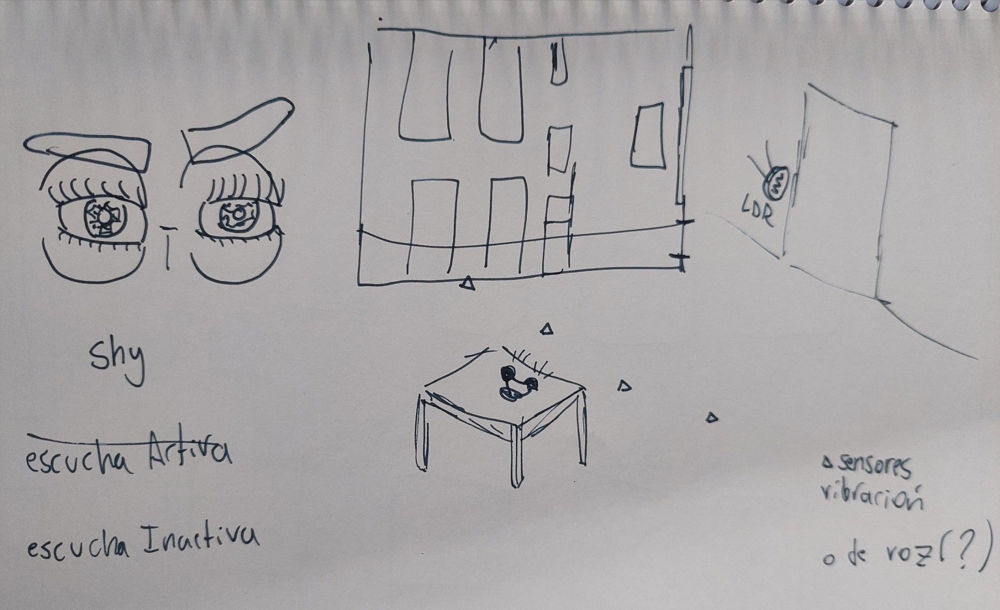
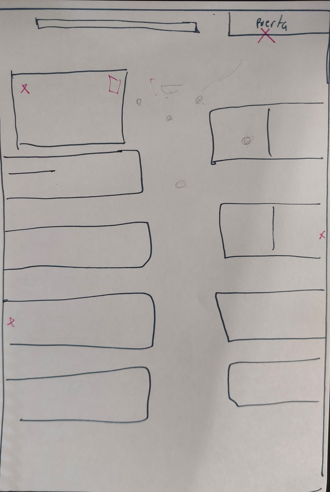
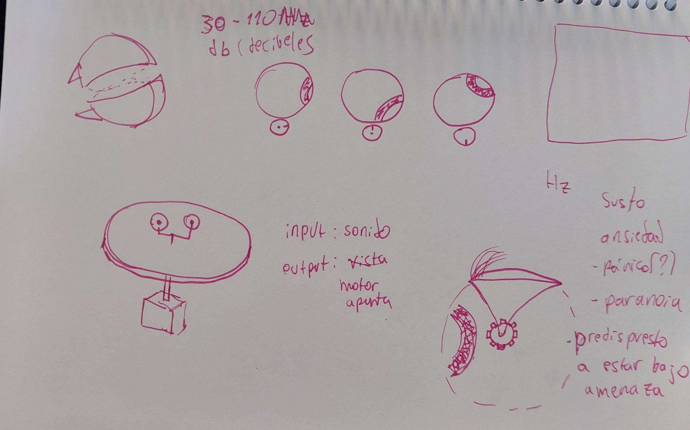

# sesion-07a

## clase 13 - 23-sept

A grandes rasgos exiten 4 tipos de motores:

1. DC motor (direct current): un motor DC es rápido, no sabe donde está.
aplicaciones: drones, ventiladores, vibradores, etc.
2. Step motor: lento, preciso, no sabe donde está. Funciona con grados.
aplicaciones: impresoras 3D, etc
3. Servomotor: funciona por grados, si sabe donde está. Se clasifican según cuánto giran(90°, 180°, 270°, 360°)
4. solenoide: movimiento lineal(no giratorio)

- [hackaday](https://hackaday.com)
- [clock that is wrong](https://github.com/dupontgu/clock_that_is_wrong)
- [CW & T](https://cwandt.com)
- [las llamadas que nunca hice](https://www.instagram.com/lasllamadasquenuncahice)
- [Nona Fernández](https://es.wikipedia.org/wiki/Nona_Fernández)
- [Patii Smith](https://es.wikipedia.org/wiki/Patti_Smith)
- [Transductor](https://es.wikipedia.org/wiki/Transducción)
- [Transductor en electrónica](https://es.wikipedia.org/wiki/Transductor)
- [driver](https://es.wikipedia.org/wiki/Controlador_de_dispositivo)
- [eléctrico vs electrónico](https://osakaelectronicsltda.com/blog/biblioteca/cual-es-la-diferencia-entre-un-aparato-electrico-y-electronico)
- [empresa de tiras led](https://www.demasled.cl/)
- [neoPixel](https://www.adafruit.com/category/168)

## grupo proyecto-02

### hijos de la tierra

ojos que te miran.

- [video referente ojos](https://www.youtube.com/watch?v=Ftt9e8xnKE4)

Buscamos crear un robot "creepy", que genere sensación de incomodidad y de "sentirse observado" en los usuarios.

debido a la dificultad que significa la detección de personas, queremos detectar a la gente a través de sonidos. Para esto, serán colocados entre 3-5 micrófonos en puntos estratégicos de la sala. Dependiendo de cuáles micrófonos detecten sonidos, y en qué intensidad, los ojos apuntarán en una dirección determinada.

por ahora, los ojos puede cambiar su dirección en el eje X, no en el eje Y. Los ojos estarán sobre una plataforma, la cual gira en 270° gracias a un motor.

Los párpados funcionan gracias a un eje de rotación, cuya posición está en el centro de la esfera(visto desde el lateral).

### info

los [párpados](https://es.wikipedia.org/wiki/Párpado)

## encargo-12

leer bitácoras de otro compañere, encontrar diferencias, similitudes, aciertos, dudas, etc.

leí la bitácora de 04-yanma-bit. La propuesta que más me llamó la atención fue una idea que proponía crear un videojuego, cuyos controles sean basados en la posición del usuario, esto me recuerda a la kinect de la xbox 360, o al juego ring fit, para la nintendo switch.

En mi opinión, esta propuesta puede compararse al proyecto feelMyParanoia, en el sentido de que la posición del usuario determina las acciones que se ejecutan en el código, a su vez, me interesa la idea del feedback en estos casos. A lo que voy es que, yo busco que en mi proyecto el usuario tenga claro qué es lo que está generando las respuestas del robot, es decir, que el feedback sea lo suficientemente directo, para que entre en duda si la respuesta fue provocada por el usuario, o si es parte del comportamiento.

La principal diferencia que veo entre esta propuesta y el proyecto feelMyParanoia, es en cierta parte similar a la similitud:
mientras que el proyecto mencionado, intenta que el código pueda representar virtualmente las acciones del usuario(ejemplo, al acercarse al sensor, el personaje camina hacia adelante). Por otro lado, feelMyParanoia busca emular una reacción a las acciones del usuario, lo que entendemos como una "reacción humana". En conclusión, en la propuesta de Yanma, el output, es una representación del input del usuario, mientras que feelMyParanoia, el output es una representación de las reacciones de una interacción real(en una situación de miedo/tensión), en otras palabras, el output del código, es una representación del output humano en una interacción similar.

En cuanto a dudas sobre este proyecto, me cuestiono la utilidad de usar un sensor de proximidad, y surge la duda respecto a usar botones ubicados en el piso, tipo "Dance Dance Revolution". Como reflexión a esto: el sensor de proximidad podría ser una ventaja, debido a la capacidad de detectar diferentes distancias, por lo que, con esto se podría, por ejemplo, controlar la velocidad del personaje. Sin embargo los botones dan la ventaja de entregar un feedback más directo, y reduce la posibilidad de fallo o de confusión del usuario.

## encargo-13

dos referentes de cada tema:
I. lenguaje natural
II. código
III. materialidad
IV. documentación

I. lenguaje natural

1 31 minutos: lo que me gusta del lenguaje de 31 minutos es, por una parte el humor implícito en la forma de expresarse de sus personajes, con frases que por sí mismas no causan gracia, pero cuando las juntas todas en un diálogo, de uno o más personajes, da risa. Un ejemplo(extraído de la descripción de tulio triviño en la [página oficial](https://www.31minutosoficial.cl)): Rostro del noticiero. Encargado de realizar entrevistas en el estudio, dormir temprano para no tener ~~orejas~~ ojeras darle órdenes a Juanín, exigirle a Juanín que revise el libreto y pedirle a Juanín que lo despierte en la mañana.

 Se hace uso de la repetición y la regla de 3 para enfatizar el chiste, además algo que aporta mucho a la gracia de 31 minutos es la interpretación de los actores y actrices de voz, con una subidas y bajadas de tono muy abruptas y con un timing espléndido. [extracto](https://youtube.com/shorts/R-izgPFMjkI?si=LBp6lst6EWe1dWlZ)

2 Gary Kingsbury: en la película Game Night, Jesse Plemons interpreta a Gary, un paco recién divorciado, solitario, con necesidad de aprobación. Gary, solía ser parte de las reuniones de un grupo de amigos, pero después de divorciarse dejaron de invitarlo. En la película muchos de sus diálogos expresan su busqueda por ser aceptado y querido por las personas que admira. Lo que más me gusta de su interpretación es su manera de hablar, que me hace sentir como que los diálogos provienen desde un lugar interno muy profundo de su persona, me hace sentir que las frases que dice viajaron miles de km antes de llegar a su boca. Esto acompañado del trabajo de cámara que enfatiza esa sensación de vacío. [aquí un extracto](https://youtu.be/bYM6tWIjr-I)

II. código

1. HolaMundo: es un youtuber chileno que se centra en contenido relacionado a la programación, tiene tutoriales de horas de duración con millones de visitas. Lo que me gusta más de su estilo de programar, es que se permite usar nombres de variables a su modo. Es decir con humor y usando muchas veces nombres no relacionados con el código, como "chanchito". Su videos de vscode fue uno de los primero tutoriales que vi sobre vscode, y me encantó esa forma, y desde entonces, siempre en mis proyectos de código, uso variables que me parezcan graciosas, llamativas y carismáticas. Por ejemplo, en el código de [rainyDays](https://editor.p5js.org/clifford1one/sketches/HkDAqxIUR). A las variables relacionadas al perrito, les puse washinton, al gatito asrael, etc. Esto me ayuda a hacer las variables más personales y así las recuerdo más.

2. Dan Shiffman: Dan Shiffman es un programador, parte del equipo fundador de la Processing Foundation. Es conocido en el internet por crear la comunidad "The COding Train", en la cual graba tutoriales, hostea foros y conversaciones, entre otras cosas. Viendo sus tutoriales uno puede darse cuenta de su larga experiencia y basto conocimiento, debido a su manera íntegra de entender los conceptos, y el código en general.
Dan tiene una forma específica de programar, como yo lo veo, intenta reducir el código al máximo, y que sea lo más legible posible, entiendo que esto se debe, por una parte, a su pasión por enseñar, y por otro lado, Dan debe haber lidiado con código enormes y muy complejos, por lo que esta forma de llamar a las variables de la manera más universal posible, ayuda mucho a que el código pueda ser entendible para múltiples personas, y no solo para el creador.

III. materialidad

1 en el sentido de la materialidad, y lo que quiero que el robot transmita, desde el primer prototipo me recordó mucho a este juguete:

me gusta mucho el color de este juguete, que en conjunto con las piezas que sostienen los ojos, transmite una sensación tipo "gore", como una cara que le sacaron la piel y tiene expuestos los músculos.

2 Steve Mould: en el video "Mechanical Circuits: electronics without electricity" Steve Mould hace una muy interesante analogía y comparación entre los circuitos electrónicos, y circuitos mecánicos. Me encanta la estética de los circuitos de este video, que hacen que incluso los circuitos más simples se vean sumamente complejos. Los colores y materialidad transmiten sensación de juego y recreación, a la vez que me llevan hacia un estilo tipo revolución industrial, por la combinación de grises y cafés y sus formas complejas expuestas. [video](https://youtu.be/QrkiJZKJfpY?si=iDvwOo3Nw-WRXFPB).

IV. documentación

1 oskitone: un proyecto que llama mucho mi atención es el poly555. Lo que me gusta más de [esta página](https://oskitone.github.io/poly555) es que (por la naturaleza del proyecto) está planteado como un manual de cómo hacer el tuyo propio. Separado en secciones relacionadas a "áreas", ejemplo: 3D printing, pcb, etc.

En mi opinión, este formato puede aportar mucho a mi proyecto, ya que al plantearlo como un manual, permite ser mucho más específico en las partes que yo considero importante para que el proyecto tenga la misma esencia, ejemplo, que los engranajes tengas 5mm de grosor.

2 555-timer-circuits: <www.555-timer-circuits.com>> en mi opinión está muy bien diseñada, con los elementos justos en pantalla, y con una jerarquía de la información muy bien definida. Me recuerda a páginas web de los 2010, debido a ciertas características, como que el formato de la info no se ajusta a la proporción de pantalla, o la tipografía y falta de ornamentos.
