# sesion-08a

las frecuencias mas agudas son más direccionales.


- [MovingAvg](https://docs.arduino.cc/libraries/movingavg)

- [abs()](https://docs.arduino.cc/language-reference/en/functions/math/abs)

- SPL sound pressure level

- [frecuencia](https://es.wikipedia.org/wiki/Frecuencia)
- [amplitud](https://es.wikipedia.org/wiki/Amplitud_(física)#:~:text=En%20física%2C%20la%20amplitud%20(del,o%20cuasiperiódicamente%20en%20el%20tiempo.)

- [trigonometría](https://es.wikipedia.org/wiki/Trigonometría)


## info rescatada

<https://forum.arduino.cc/t/calculating-decibels-spl-from-max4466-microphone-input/1239394>

     Microphone sensitivity is normally referenced to 94dB SPL.
     So with a gain of 75, you should get 0.47VRMS at 94dB. That's your reference (although you can calculate a different reference from that information).
     20 x log(V/0.47) is the dB difference.
     Add that dB calculation to 94dB and you've got your SPL level. (Of course if it's negative you'll be effectively subtracting.)

### qué avanzamos hoy

- prototipamos cómo se conectan los párpados a los motores. 

- mirado desde una vista lateral, el servomotor se encuentra en el centro de la circunferencia del globo ocular.

- ambos parpados están conectados entre sí. A trvés de una pieza larga y anogsta. (aprox 80mm x 4mm).

-  el párpado superior se mueve, con el centro de la circunferencia como el eje de rotación. EL párpado inferior esta fijado en posición.
- calibramos el ángulo en el que se puede mover el párpado superior. Por ahora es desde 30°-70°.

- [libreria servo](https://github.com/arduino-libraries/Servo/blob/master/docs/api.md#attach)

 -[moss-class](https://github.com/Mosswhosmoss/dis8645-2025-02-procesos/blob/main/03-Mosswhosmoss/sesion-08a/codigoRobotFriolento_0_2_1/SensorUltra.cpp)

 <https://forum.arduino.cc/t/calculating-decibels-spl-from-max4466-microphone-input/1239394>

 - [average](https://forum.arduino.cc/t/calculating-average-value/204225)

 ## encargo-16

     "cada persona del grupo debe subir a su README:
     qué llevan hasta el final de esta sesión, qué sí funciona,
     qué funciona casi, qué no funciona. después subir nueva 
     versión del código y de la documentación, del trabajo que
     hagan entre 8a y 9a."


-*redactado el 16 de octubre*-

en el período del 3-6 de octubre generamos avances brígidos(pesnamos que se entregaba el 7 de octubre).

### avance por partes

me encargué de diseñar y modelar en 3D todo el cuerpo, movimeintos y estética del robot.

casi todos los modelos fueron modelados e impresos antes de modelar el siguiente avance. Está ordenado en orden cronológico(basado en como windows ordena los archivos por fecha de creación).

#### forma y vibe

primero partí con este modelado para entender la posición de los iris y párpados, ya que esto determina  el sentimiento que el robot transmite.


luego, hice este modelo 3D sin pensar en medidas o estructuralidad.                    

[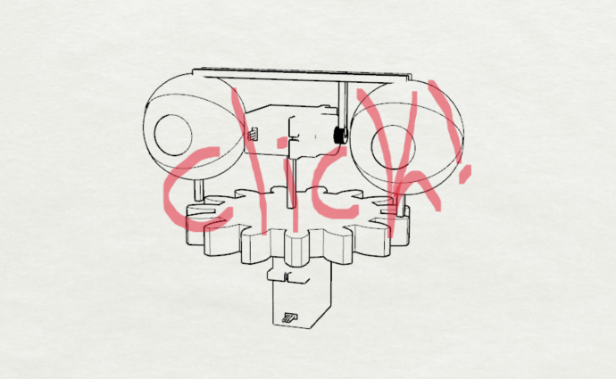](/12-santiagoClifford/sesion-08b/ascii-stl/primer-ideaBin.stl)


modelé la pupila del ojo. Partido a la mitad para evitar usar soportes al imprimir. En el centro tiene un ajugero donde posteriormente se introduce un tarugo para unir ambas mitades. Estos agujeros terminan en punta para que se imprima sin soportes.

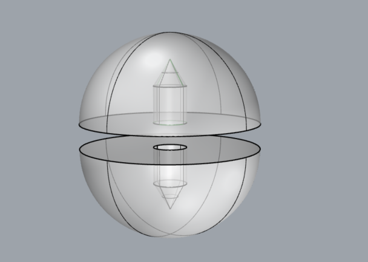

luego modelé  el párpado. con el obejtivo de sentir cómo roza con el globo ocular. Con esas lineas guías pude modelar el párpado a partir de un ángulo que calzara las necesidades del pryecto.

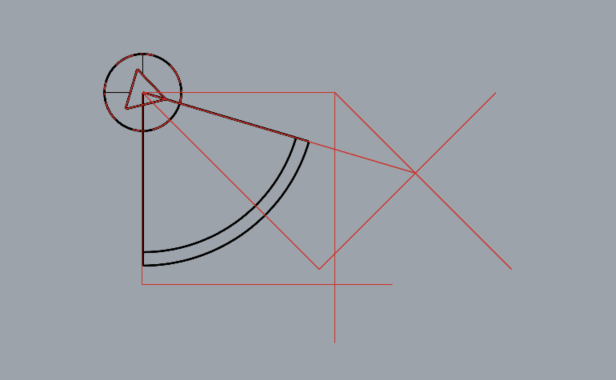

dado que el prototipo anterior funcionó bien, inmediatamente modele una versión con ambos párpdos unidos.

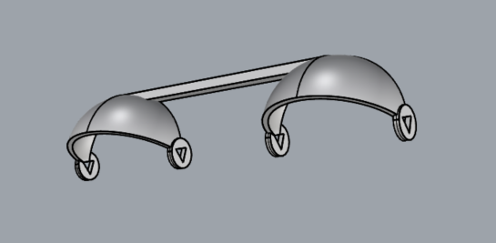

luego modelé esta pieza cilíindrica, para que fuera el conector entre el servo y los párpados. Me equivoqué en la escala y quedó enorme.

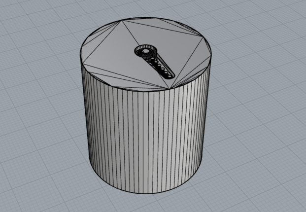

luego edité el modelo del globo ocular, con una una nueva forma de unir ambas mitades, esta vez permite agregarle un "palo de coyac" que será útil para agarrar la pupila a la base.


-mañana seguiré redactando esta compilación-


la siguiente versión del párpado, cuenta con un mayor grosor en uno de sus ejes de rotación. Esto con el propósito de insertar una tuerca. Para así usar la rotación que esta provee para prototipar.

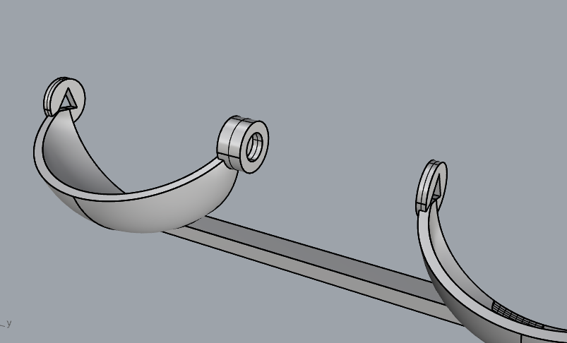

luego modelé esta pieza, que fuera la interfaz entre el párpado y el servo.

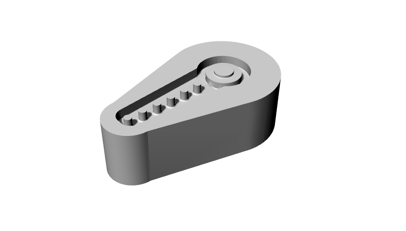

posteriormente uní estas piezas. Para esto utilicé tuercas y un tornillo M3. Con la ayuda de un alicate con mango plástico, calenté los pernos uno por uno, para despues introducirlos, uno en la útlima pieza, otro en el párpado. Además, a un tornillo le corté la "cabeza", y utilicé la parte del "hilo" para que ambos pernos estuvieran conectados, permitiendo rotación.

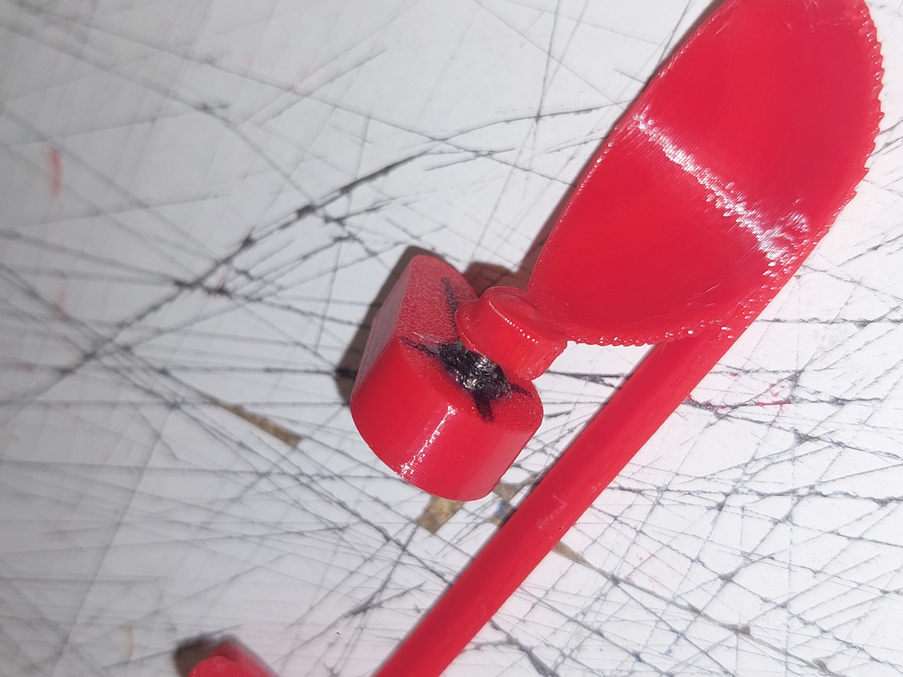

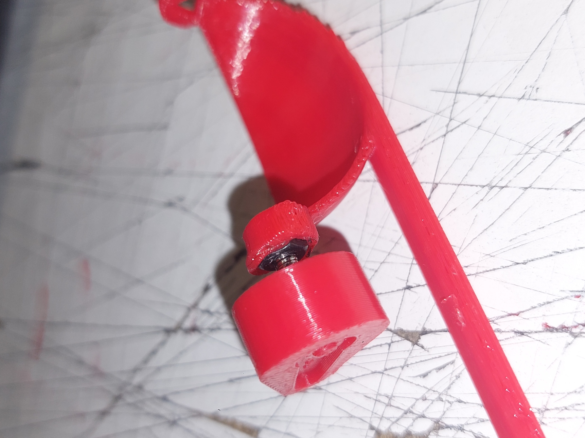

gracias a este prototipo, me dí cuenta de que para lograr el objetivo(en la manera en la que yo buscaba hacerlo ), era necesario que estas 2 últimas piezas estén unidas. Por lo que hice un modelo 3d con estas 2 piezas unidas.


el modelo anterior fue rápidamente descartado, ya que perturbaba la posición en la que se imprimía la pieza, y hubiera necesitado mayor cantidad de soportes. Por lo que modelé una pieza que permitiera que la impresión fuera desde la misma posición que las versiones anteriores, la cual era ideal debido al uso mínimo de soportes.

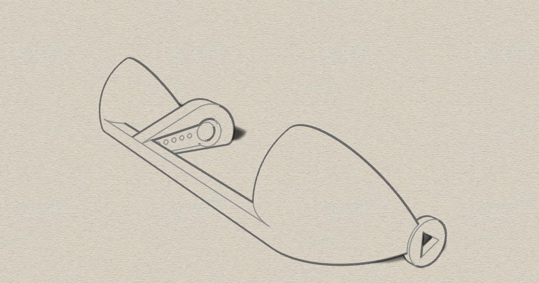

cuando esa pieza estuvo lista, le armé un setup con cartón y maskingtape, para verlo en funcionamiento.(esta parte ,e procupaba porque, en mi opnión, la parte del parpadeo mecánico, era la más complicada del proyecto).


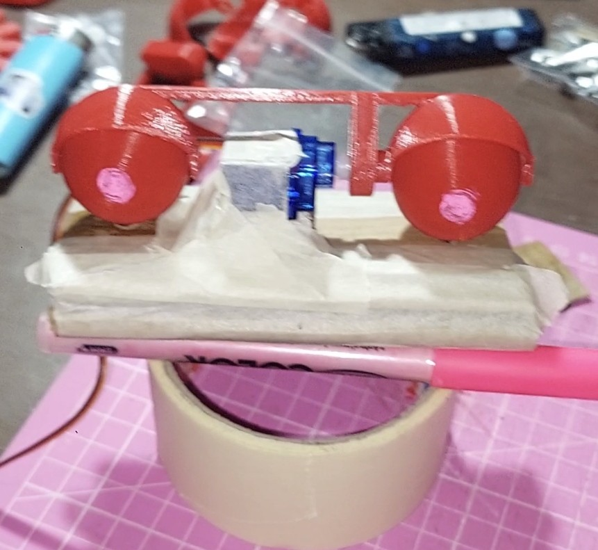


una vez comprobé su funcionamiento, modelé la pieza que funciona como soporte para todo el mecanismo. Como grupo, habíamos definido que la base ten 
Para esto, utilicé una librería de OpenSCAD, llamada [pd-gears](https://github.com/sadr0b0t/pd-gears). Me ayudé de [este tutorial](https://www.youtube.com/watch?v=pEo-DOJnO5k) para entender las funciones. 

Finalmente utilicé el siguiente código para modelar el engranaje:

```scad
use <pd-gears.scad>
gear(
    number_of_teeth = 20,
    hole_diameter = 0,
    thickness = 3,
    mm_per_tooth = 14.2,
    backlash = 0.15,
    clearance = 0.15
);
```

este código da como resultado este engranaje:

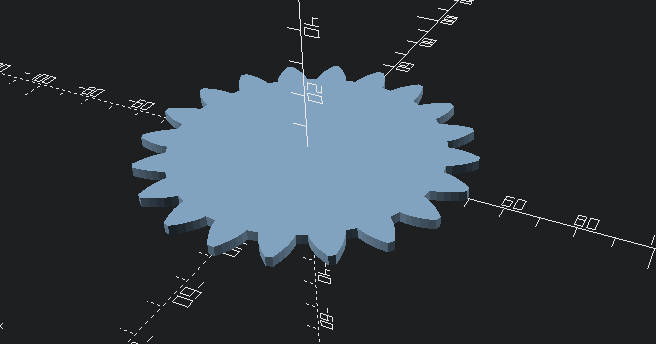

con este modelo listo, comencé a montar todas las piezas en rhino, asegurandome que el eje de rotación del servo quede justo en el centro de la circunferencia del globo ocular.

montando las piezas, añadí un sacado donde encajaran los pilares de los ojos, y también diseñé una pieza que sostiene el servomotor en la posición ideal, la cual se monta al engranaje ensamblándose.
