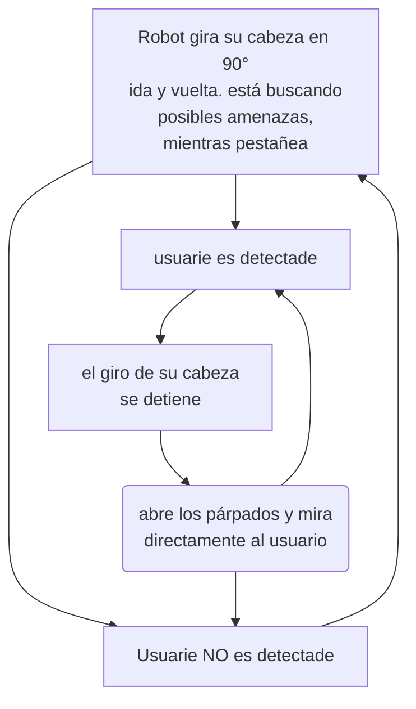

# sesion-09b

## 10-oct-2025

### nuevo flujo 

```mermaid
graph TB;
A[Robot gira su cabeza en 90°
ida y vuelta. está buscando
posibles amenazas,
mientras pestañea]
A-->B[usuarie es detectade]
A-->C[Usuarie NO es detectade]-->A

B-->D[el giro de su cabeza
se detiene]--> E(abre los párpados y mira
directamente al usuario)

E-->B
E-->C

```