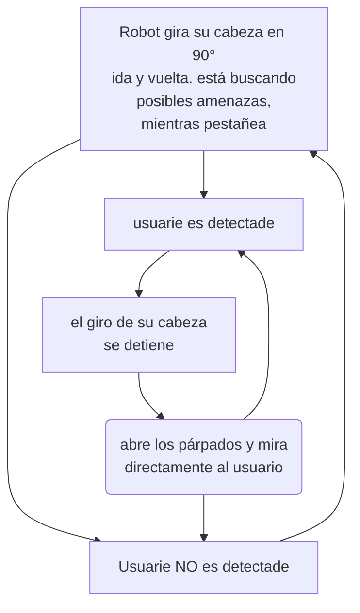

# sesion-09b

## 10-oct-2025

### nuevo flujo

### avance maldito masacre criminalístico

durante la clase, escribí un código, que moviera el servo paulatinamente, y que se detuviera al sensar proximidad. Tenía dudas de como salir de ciclo for, y después retomarlo, por lo que pedí ayuda a matías, quien me ayudo, sugiriendo crear variables que guarden la posiciónActual, posiciónMax y posiciónMin.

Tras esto, escribí denuevo el código, implementando las mejoras sugeridas, y vine al lab. Aquí, sebastianSaez1003 me ayudó con el código, creando las clases correspondientes para ordenar el código. Dado que, hice el código completo antes de compilarlo, surgieron literlamente decenas de errores, los cuales fuimos revisando 1 por 1 hasta que compiló correctamente.
