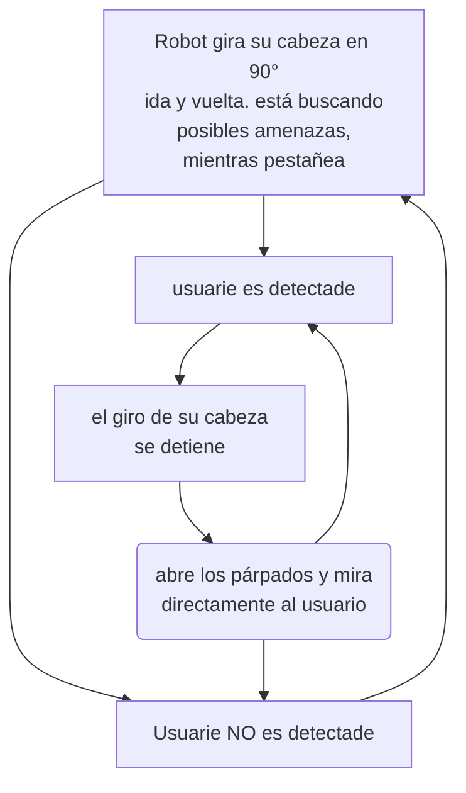

# sesion-09b

## 10-oct-2025

### resuemen propuestas

v1: el estado base del robot es quieto, al sus micrófonos sensar sonido, se activan los servos y le hacen apuntar a la fuente del sonido, y se queda mirandolo hasta que deje de emitir ruido, o se emita otro ruido proveniente desde otra posición

v2: el esta en constanté búsqueda de fuentes de peligros, por loq ue está en un estado perpetuo de mirar de izquierda a derecha y de vuelta, para interrumpitr este estado, debe detectar la presencia de una persona, al detetctarla, se queda mirando a la persona, hasta que deje de detectar su presencia. En ese momento vuelve al estado base del loop del movimiento de "cuello".

### nuevo flujo

### avance de alta calidad

durante la clase, escribí un código, que moviera el servo paulatinamente, y que se detuviera al sensar proximidad. Tenía dudas de como salir de ciclo for, y después retomarlo, por lo que pedí ayuda a matías, quien me ayudo, sugiriendo crear variables que guarden la posiciónActual, posiciónMax y posiciónMin.

Tras esto, escribí denuevo el código, implementando las mejoras sugeridas, y vine al lab. Aquí, sebastianSaez1003 me ayudó con el código, creando las clases correspondientes para ordenar el código. Dado que, hice el código completo antes de compilarlo, surgieron literlamente decenas de errores, los cuales fuimos revisando 1 por 1 hasta que compiló correctamente.

### avance de alta calidad v2

hoy en mi casa, me puse a pénsar en cómo abordar todo lo que conlleva el sensor ultrasónico tuve esta idea que me pareció genial, dado que complejiza el proyecto, y le da un uso al engranaje que hasta ahora, era solo decorativo.

la idea es que, el servo genera un movimiento linear en el engranaje linear(el del centro), y este provoca que los dos contenedores de los sensores giren, en sentidos opuestos.

con el propósito de poder probar y prototipar el movimiento de los engrasnajes, diseñe una base basada en [este referente](https://youtube.com/shorts/z2B92KWYxI0?si=4a_Tz0l9_7qoeDbT). La idea, es que funciones como un breadboard, para engranajes, que me permita colocar diferentes engranajes, y probar cómo combinan entre ellos y el resultado de sus combinaciones.

