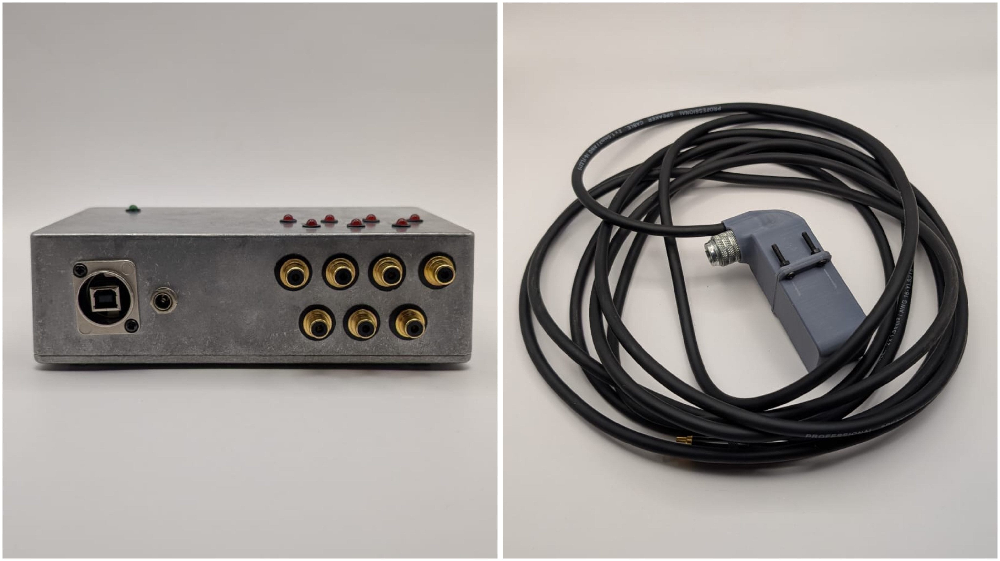

# Sesión-02a

Martes 12 de agosto, 2025

## Trabajo en clase

### Cosas que hablamos en la mañana

Se puede vivir realizando montajes y exposiciones de cosas experimentales, si eso es lo que nos interesa.

[Untref](https://untref.edu.ar/) hace un posgrado de arte electrónico.

Nicholas Negroponte, libro "Being Digital" sentó las bases en los 90 en el área digital.

[Jazmin Adler](https://jazminadler.com.ar/) y su libro "Señales hipermateriales: horizontes económicos de la condición algorítmica".

[Jorge Crowe](https://www.jcrowe.xyz/) Tiene un montón de proyectos interesantes de arte electrónico. En algunos proyectos ha trabajado con cassettes y PCBs.

[Yaeltex](https://yaeltex.com/), producen todo lo que tiene que ver con el hardware de cajas de ritmos, samplers, sintetizadores, etc. Además, creen en un sistema de producción en el que ya no exista la obsolescencia programada ni la irreparabilidad.

[Yuk Hui](https://es.wikipedia.org/wiki/Yuk_Hui) ¿Qué es un objeto digital? La digitalización y su impacto en la sociedad. Él estudió Ingeniería Informática en la Universidad de Hong Kong y Filosofía en el Goldsmiths College de Londres. Wau gracias por este referente Misa.

[Caja negra]( https://cajanegraeditora.com.ar/), editorial argentina que traduce libros de filosofía.

Encontré esta tienda que se llama [Lakomuna](https://lakomuna.cl/brand/caja-negra-editora/), donde venden libros de la editorial Caja Negra, en Chile.

Hablamos de las existencias de dominios en Internet. Dominio es un terreno y hosting es la casa. XD

IoT: the Internet of Things

[Stack Overflow](https://stackoverflow.com/questions), es un sitio como un foro para hacer preguntas sobre programación.

Tener cuidado con las licencias y con la IA, porque toma de referencia otros códigos sin dar créditos.

[John Cage](https://es.wikipedia.org/wiki/John_Cage), fue un compositor, teórico musical, artista y filósofo estadounidense. Pionero de la música aleatoria, de la música electrónica y del uso no estándar de instrumentos musicales.

### GitHub

- Explicaron cómo funciona GitHub para utilizarlo en el taller Máquinas Computacionales. También aprendimos cómo hacer carpetas y cómo subir fotos.

- Misa me estuvo ayudando a comprender cómo funciona GitHub Desktop. Aunque, la verdad, puede ser muy útil para cambiar nombres de carpetas, ordenarlas y subir archivos, él lo utiliza desde la terminal. Sin embargo, creo que es muy complejo estar actualizando para trabajar en un repositorio con más de un fork.

### Sokio

<https://sokio.studio/>

Sokio partió en la electrónica utilizando un computador Sinclair y un sampler Akai S2000. Le gustaba desarmar computadores para cambiar los sólidos de los chips en BASIC.

El sampler era un instrumento para dar muestras de sonido y secuenciarlos, además de procesar voces con efectos.

Comenzó a estudiar teatro y a componer música para las obras. Con tanta música hecha para obras cortas, se le ocurrió hacer una ópera.

Encontraba que las óperas eran fomes. Hizo una ópera con cantantes líricos, voces procesadas y computadores. Fue catalogada como la mejor ópera en 10 años en Chile: Ópera Patria.

Inauguró el teatro Matucana 100. Compuso música para cine y óperas que trataban el tema de la emigración.

Incorporó instrumentos reales que procesaba en tiempo real. Podría ser el intermedio entre una persona tocando un instrumento y una máquina reproduciendo ese instrumento.

Sokio es una especie de embajador de [Teenage Engineering](https://teenage.engineering/). Es una tienda de diseño que produce sintetizadores y objetos electrónicos, además de varias cosas más, con un diseño y una intención muy impresionantes. Por ejemplo, tenemos al [OP-1](https://teenage.engineering/products/op-1), que es prácticamente como tener muchos instrumentos en uno. Teenage Engineering diseñaba sus propios muebles para la oficina, y luego comenzaron a venderlos.

[Georgia Tech](https://www.gatech.edu/)

[Juan Downey](https://es.wikipedia.org/wiki/Juan_Downey)

#### Splitting / Absence

Desarrollando una ópera para [New Latin Wave](https://newlatinwave.com/).

Basada en la vida de Gordon Matta-Clark, anarquitecto y artista visual, trabaja con la ciudad y realiza un análisis de los objetos y de nosotros mismos.

La obra narra el impacto de Gordon Matta-Clark en el arte contemporáneo y el urbanismo.

[Juan Downey](https://es.wikipedia.org/wiki/Juan_Downey)

El ojo pensante.

Mada Machines.

Explicaron un poco el trabajo que, junto a Aarón Montoya, Matías Serrano y Francisco Stephens, tuvimos que realizar para Sokio. El cual consistía en crear un robot que moviera un solenoide con MIDI.

Ahí le entregamos el producto de la máquina y el solenoide con su carcasa. Lo probaron, todo funcionaba súper bien, y luego nos tomamos una foto, la cual sacamos con su celular, así que no la tengo.

Fue una experiencia muy bonita. Personalmente fue mi primer trabajo y quedé súper emocionada de tener la oportunidad de involucrarme en esta área de la electrónica, el arte y la música.

La ópera se va a realizar en el National Sawdust, Brooklyn, NY, y en el GAM de Santiago. Va a presentarse en Santiago, Nueva York, París y Chicago.

---

### Referentes

- [Nicholas Negroponte](https://es.wikipedia.org/wiki/Nicholas_Negroponte)

- [Jazmin Adler](https://jazminadler.com.ar/)

- [Jorge Crowe](https://www.jcrowe.xyz/)

- [Yuk Hui](https://es.wikipedia.org/wiki/Yuk_Hui)

- [John Cage](https://es.wikipedia.org/wiki/John_Cage)

- [Sokio](https://sokio.studio/)

- [Georgia Tech](https://www.gatech.edu/)

- [Juan Downey](https://es.wikipedia.org/wiki/Juan_Downey)

- [Gordon Matta-Clark](https://proyectoidis.org/gordon-matta-clark/)

### Palabras importantes

[IoT:](https://en.wikipedia.org/wiki/Internet_of_things) the Internet of Things, o el Internet de las cosas, describe dispositivos con sensores, capacidad de procesamiento, software y otras tecnologías que conectan e intercambian datos con otros dispositivos y sistemas a través de Internet u otras redes de comunicación.

[Terminal:](https://www.lenovo.com/es/es/glossary/terminal) Un terminal es esencialmente una interfaz de usuario basada en texto para interactuar con los ordenadores. Permite a los usuarios ejecutar comandos y ver los resultados, así como controlar las aplicaciones que se ejecutan en el ordenador.

[BASIC:](https://www.techtarget.com/whatis/definition/BASIC-Beginners-All-purpose-Symbolic-Instruction-Code) abreviatura de Código de Instrucciones Simbólicas Multiuso para Principiantes, es un lenguaje de programación inicial diseñado para ayudar a usuarios y estudiantes sin conocimientos técnicos a resolver problemas sencillos con una computadora. Con sus comandos sencillos y su sintaxis intuitiva, BASIC sigue siendo uno de los lenguajes de programación más sencillos desarrollados en la era informática.

[MIDI:](https://es.wikipedia.org/wiki/MIDI) siglas de Musical Instrument Digital Interface o en español «Interfaz Digital de Instrumentos Musicales» es un estándar tecnológico que describe un protocolo, una interfaz digital y conectores que permiten que varios instrumentos musicales electrónicos, ordenadores y otros dispositivos relacionados se conecten y comuniquen entre sí.
