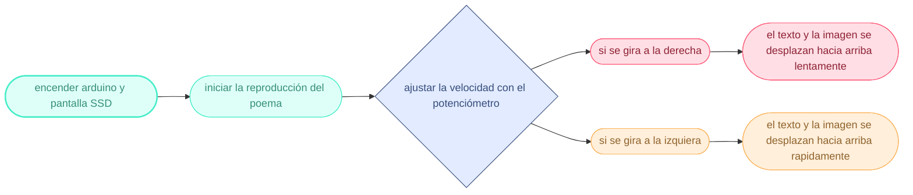

# Sesión-04a

Martes 26 de agosto, 2025

## Trabajo en clase

### Cosas que pasaron en la mañana

- Primero nos entregaron las pantallas OLED SSD y nuestras cajitas para los componentes, una para cada estudiante. Les pusimos nombres con la etiquetadora de Aarón.

- También nos entregaron unas pantallas redondas para investigar por grupo.

- Hablamos un poco sobre la documentación subida a GitHub, ya que recién comenzaron a evaluarla.

### Proyecto-01

Todas las cosas del Proyecto-01 se irán subiendo a la carpeta, y se mostrará el README con los poemas.

¿Qué significa “poema”? pro-yein que significa “lanzar hacia adelante” o “proyectar”

página que cita en apa <https://www.bibguru.com/es/>

>Poemas del Alma. (s.f.) “Cronos” – Nicanor Parra. Recuperado de <https://www.poemas-del-alma.com/nicanor-parra-cronos.htm>

```txt
"En Santiago de Chile

Los

días

son

interminablemente

largos:

Varias eternidades en un día.

Nos desplazamos a lomo de luma

Como los vendedores de cochayuyo:

Se bosteza. Se vuelve a bostezar.

Sin embargo las semanas son cortas

Los meses pasan a toda carrera

Ylosañosparecequevolaran."
```

#### Propuestas

Idea 01: Potenciómetro controla si el texto sube o baja.

Idea 02: Potenciómetro ajusta la velocidad del texto.

Idea 03: Potenciómetro cambia la dirección del texto: derecha baja, izquierda sube.

Idea 04: Botón cambia la dirección del texto al hacer clic.

Idea 05: Botón enciende o apaga una imagen.

#### Pixel art

Para nuestro proyecto decidimos agregar una imagen que se reproduzca en la pantalla. Optamos por crear un pixel art y, para que tenga más relación con el poema, decidí hacer una pequeña representación de Santiago.


Estuve investigando algunas herramientas gratuitas para hacer pixel art, ya que nunca había hecho un dibujo de este estilo y no tengo mucha experiencia en lo gráfico. Realicé el dibujo finalmente en Paint, ya que con las herramientas que tenía era suficiente. Vi algunos videos para entender cómo guardar correctamente los archivos y cómo dibujar para que la imagen se vea y se entienda mejor.

Sin embargo, la pantalla que utilizamos tiene ciertas limitaciones, ya que solo permite mostrar imágenes en blanco y negro, o en un solo color y su contraste. Esto hizo que el diseño tuviera que adaptarse a esa restricción.


>Video de referencia introductoria al pixel art. [CÓMO HACER PIXEL ART: Guía completa para principiantes ||Conceptos básicos, trucos y consejos.](https://youtu.be/YyC2i91EwNw?si=XXv2mYEYJoBRogo8)
>
>Video de referencia sobre el trazado en el pixel art. [CÓMO HACER PIXEL ART: Uso de Líneas y errores comunes (Doubles y Jaggies)](https://youtu.be/sGLBMKD7eDc?si=nGjneOnJ1f0_kIvZ)

Luego, utilicé una página web que convierte dibujos en código, transformándolos en ceros y unos. Esta herramienta me permitió llevar el pixel art a la pantalla de manera más sencilla. <https://javl.github.io/image2cpp/>

```cpp
const unsigned char PROGMEM smiley_bmp[] = {
0xff, 0xff, 0xff, 0xff, 0xff, 0xff, 0xff, 0xff, 0xff, 0xff, 0xff, 0xff, 0xff, 0xff, 0xff, 0xff, 
 0xff, 0xff, 0xff, 0xff, 0xff, 0xff, 0xff, 0xff, 0xff, 0xff, 0xff, 0xff, 0xff, 0xff, 0xff, 0xff, 
 0xff, 0xff, 0xff, 0xff, 0xff, 0xff, 0xff, 0xff, 0xff, 0xff, 0xff, 0xff, 0xff, 0xff, 0xff, 0xff, 
 0xff, 0xff, 0xff, 0xff, 0xff, 0xff, 0xff, 0xff, 0xff, 0xff, 0xff, 0xff, 0xff, 0xff, 0xff, 0xff, 
 0xff, 0xff, 0xff, 0xff, 0xff, 0xff, 0xff, 0xff, 0xff, 0xff, 0xff, 0xff, 0xff, 0xff, 0xff, 0xff, 
 0xff, 0xff, 0xff, 0xff, 0xff, 0xff, 0xff, 0xff, 0xff, 0xff, 0xff, 0xff, 0xff, 0xff, 0xff, 0xff, 
 0xff, 0xff, 0xff, 0xff, 0xff, 0xff, 0xff, 0xc1, 0xff, 0xff, 0xff, 0xff, 0xff, 0xff, 0xff, 0xff, 
 0xff, 0xff, 0xff, 0xff, 0xff, 0xff, 0xff, 0xbe, 0xff, 0xff, 0xff, 0xff, 0xff, 0xff, 0xff, 0xff, 
 0xff, 0xff, 0xff, 0xff, 0xff, 0xff, 0xff, 0xbe, 0xff, 0xff, 0xff, 0xff, 0xff, 0xff, 0xff, 0xff, 
 0xff, 0xff, 0xff, 0xff, 0xff, 0xff, 0xff, 0xbe, 0xff, 0xff, 0xff, 0xff, 0xff, 0xff, 0xff, 0xff, 
 0xff, 0xff, 0xff, 0xff, 0xff, 0xff, 0xff, 0x7f, 0x7f, 0xff, 0xff, 0xff, 0xff, 0xff, 0xff, 0xff, 
 0xff, 0xff, 0xff, 0xff, 0xff, 0xff, 0xff, 0x5d, 0x7f, 0xff, 0xff, 0xff, 0xff, 0xff, 0xff, 0xff, 
 0xff, 0xff, 0xff, 0xff, 0xff, 0xff, 0xff, 0x5d, 0x7f, 0xff, 0xff, 0xff, 0xff, 0xff, 0xff, 0xff, 
 0xff, 0xff, 0xff, 0xff, 0xff, 0xff, 0xff, 0x5d, 0x7f, 0xff, 0xff, 0xff, 0xff, 0xff, 0xff, 0xff, 
 0xff, 0xff, 0xff, 0xff, 0xff, 0xff, 0xfe, 0xdd, 0xbf, 0xff, 0xff, 0xff, 0xff, 0xff, 0xff, 0xff, 
 0xff, 0xff, 0xff, 0xff, 0xff, 0xff, 0xfe, 0xdd, 0xbf, 0xff, 0xff, 0xff, 0xff, 0xff, 0xff, 0xff, 
 0xff, 0xff, 0xff, 0xff, 0xff, 0xff, 0xfe, 0xdd, 0xbf, 0xff, 0xff, 0xff, 0xff, 0xff, 0xff, 0xff, 
 0xff, 0xff, 0xff, 0xff, 0xff, 0xff, 0xfe, 0xdd, 0xbf, 0xff, 0xff, 0xff, 0xff, 0xff, 0xff, 0xff, 
 0xff, 0xff, 0xff, 0xff, 0xff, 0xff, 0xf8, 0xbe, 0x80, 0xff, 0xff, 0xff, 0xff, 0xff, 0xff, 0xff, 
 0xff, 0xff, 0xff, 0xff, 0xfc, 0x0f, 0xe6, 0xbe, 0xbf, 0x1f, 0xff, 0xff, 0xff, 0xff, 0xff, 0xff, 
 0xff, 0xff, 0x00, 0x7f, 0xe3, 0xf3, 0x1e, 0xbe, 0xbf, 0xc7, 0xff, 0xff, 0xff, 0xff, 0xff, 0xff, 
 0xff, 0xf8, 0xff, 0x8f, 0x8f, 0xf8, 0xfe, 0xbe, 0xbf, 0xf9, 0xfe, 0x1f, 0xff, 0xff, 0xff, 0xff, 
 0xff, 0xc7, 0xff, 0xf0, 0x3f, 0xff, 0xfe, 0xbe, 0xbf, 0xfe, 0x41, 0xe1, 0xff, 0xff, 0xff, 0xff, 
 0xff, 0x3f, 0xff, 0xff, 0xff, 0xff, 0xfe, 0xbe, 0xbf, 0xff, 0x1f, 0xfe, 0x7f, 0xff, 0xff, 0xff, 
 0xfc, 0xff, 0xff, 0xff, 0xff, 0xff, 0xfe, 0xbe, 0xbf, 0xff, 0xcf, 0xff, 0x9f, 0xff, 0xff, 0xff, 
 0xe3, 0xff, 0xff, 0xff, 0xff, 0xff, 0xfe, 0xbe, 0xbf, 0xff, 0xe3, 0xff, 0xe7, 0xfc, 0x07, 0xff, 
 0x1f, 0xff, 0xff, 0xff, 0xfe, 0x7f, 0xfe, 0xbe, 0xbf, 0xff, 0xf9, 0xff, 0xf8, 0x03, 0xf9, 0xff, 
 0xff, 0xff, 0xff, 0xff, 0xf9, 0xf1, 0xfe, 0xbe, 0xbf, 0xff, 0xff, 0xff, 0xfd, 0xff, 0xfe, 0x7f, 
 0xff, 0xff, 0xff, 0xff, 0xe7, 0xfe, 0x3e, 0xbe, 0xbf, 0xff, 0xff, 0xff, 0xfe, 0xff, 0xff, 0x1f, 
 0xff, 0xff, 0x0f, 0xff, 0x9f, 0xff, 0xde, 0xbe, 0x8f, 0xff, 0xff, 0xff, 0xfe, 0x7f, 0xff, 0xc7, 
 0xdf, 0xfc, 0xf0, 0xff, 0x7f, 0xff, 0xee, 0x7f, 0x37, 0xe0, 0xff, 0xff, 0xff, 0xff, 0xff, 0xf8, 
 0xcf, 0xc3, 0xfe, 0x7c, 0x7f, 0xff, 0xfe, 0xff, 0xbb, 0x9f, 0x0f, 0xff, 0xff, 0xff, 0xff, 0xff, 
 0x33, 0x3f, 0xff, 0xff, 0xff, 0xff, 0xce, 0xff, 0xbf, 0xff, 0xf1, 0xff, 0xff, 0xff, 0xff, 0xff, 
 0xff, 0xff, 0xff, 0xff, 0xff, 0xff, 0xbe, 0xaa, 0xbf, 0xff, 0xfe, 0x3f, 0xff, 0xff, 0xff, 0xff, 
 0xff, 0xff, 0xff, 0xff, 0xff, 0xff, 0x7e, 0xff, 0xbf, 0xff, 0xff, 0xdf, 0xff, 0xe0, 0x1f, 0xff, 
 0xff, 0xff, 0xff, 0xff, 0xff, 0xff, 0xfe, 0xaa, 0xbf, 0xff, 0xff, 0xe7, 0xe0, 0x1f, 0xe7, 0xff, 
 0xff, 0xff, 0xff, 0xff, 0xff, 0xff, 0xfe, 0xff, 0xb8, 0x00, 0x03, 0xff, 0x9f, 0xff, 0xf8, 0xff, 
 0xff, 0xff, 0xff, 0xff, 0xff, 0xff, 0xfe, 0xaa, 0xb7, 0xff, 0xfd, 0xfe, 0x7f, 0xff, 0xff, 0x0f, 
 0xff, 0xff, 0xff, 0xff, 0xff, 0xff, 0xfe, 0xff, 0xb5, 0x55, 0x55, 0xff, 0xff, 0xff, 0xff, 0xff, 
 0xff, 0x9f, 0xff, 0xff, 0xff, 0xff, 0xfe, 0xaa, 0xb7, 0xff, 0xfd, 0xff, 0xff, 0xff, 0xff, 0xff, 
 0xff, 0xaf, 0xff, 0xff, 0xff, 0xff, 0xfe, 0xff, 0xb5, 0x55, 0x55, 0xff, 0xff, 0xff, 0xff, 0xff, 
 0xff, 0x03, 0xff, 0xff, 0xff, 0xff, 0xfe, 0xaa, 0xb7, 0x00, 0x1d, 0xff, 0xff, 0xff, 0xff, 0xff, 
 0xfe, 0xfd, 0xff, 0xff, 0xff, 0xff, 0xfe, 0xff, 0xb6, 0xff, 0xe5, 0xff, 0xc1, 0xff, 0xff, 0xff, 
 0xfe, 0xfd, 0xff, 0xff, 0xff, 0xff, 0xfe, 0xaa, 0xae, 0x06, 0x0d, 0xff, 0xbe, 0xff, 0xff, 0xff, 
 0xfe, 0xfd, 0xff, 0xff, 0xff, 0xff, 0xfe, 0xff, 0xaa, 0xff, 0xe5, 0xff, 0x88, 0xff, 0xff, 0xff, 
 0xfe, 0xf0, 0x0f, 0xcf, 0xff, 0xff, 0xfe, 0xaa, 0xae, 0x06, 0x0d, 0xff, 0xbe, 0xff, 0xff, 0xff, 
 0xe0, 0xef, 0xf7, 0x97, 0xff, 0xff, 0xfe, 0xff, 0xaa, 0xff, 0xe5, 0xff, 0x88, 0xff, 0xff, 0xff, 
 0x2e, 0xe1, 0x87, 0x6b, 0xff, 0xfc, 0x3e, 0xaa, 0xae, 0x06, 0x0d, 0xc3, 0xbe, 0xff, 0xff, 0xff, 
 0xae, 0xef, 0xf6, 0xf5, 0xfe, 0x7b, 0xde, 0xff, 0xaa, 0xff, 0xe5, 0xbc, 0x88, 0xff, 0xff, 0xff, 
 0x06, 0xe1, 0x86, 0x01, 0xfd, 0x82, 0x5e, 0xaa, 0xae, 0x06, 0x0d, 0xbc, 0x3e, 0xff, 0xff, 0x83, 
 0xfa, 0xef, 0xf6, 0xf5, 0xfd, 0xbb, 0xde, 0xff, 0xaa, 0xff, 0xed, 0xbb, 0xd8, 0xe7, 0xef, 0x79, 
 0x7a, 0xe1, 0x86, 0x54, 0x03, 0xda, 0x5e, 0xaa, 0xae, 0xff, 0x80, 0x17, 0xee, 0xeb, 0xd6, 0xf8, 
 0xe0, 0xef, 0xf0, 0xf5, 0xf2, 0xdb, 0xde, 0xff, 0x0e, 0xff, 0x7f, 0xe7, 0xe8, 0xc1, 0x00, 0x67, 
 0x5e, 0xe1, 0x86, 0x55, 0xfb, 0xda, 0x5e, 0xaa, 0xf0, 0x00, 0x55, 0x47, 0xe6, 0xbe, 0x77, 0xaf, 
 0xd4, 0xef, 0xf6, 0xf5, 0xfa, 0xc1, 0xde, 0xfe, 0xff, 0x99, 0x7f, 0xe1, 0xf0, 0xaa, 0xf7, 0x03, 
 0x5e, 0xe1, 0x86, 0x55, 0x9b, 0xdc, 0x1e, 0xaa, 0xaa, 0xff, 0x55, 0x4e, 0xf6, 0xbe, 0xf6, 0x7d, 
 0xd4, 0xef, 0xf6, 0xc0, 0x0b, 0x0f, 0xc2, 0xfe, 0xff, 0xff, 0x1f, 0xee, 0xe6, 0x2c, 0xf6, 0xfd, 
 0xde, 0xe1, 0x86, 0xbf, 0xc0, 0x75, 0x7c, 0x1e, 0xaa, 0x80, 0x61, 0x4e, 0xef, 0x38, 0x00, 0x0d, 
 0x00, 0xef, 0xf0, 0x2a, 0xbe, 0x77, 0xfd, 0xee, 0xff, 0x7e, 0xfb, 0xfe, 0xc9, 0xb7, 0xff, 0xf5, 
 0xff, 0x61, 0x87, 0xbf, 0xfe, 0xf5, 0x70, 0xe0, 0xaa, 0x7e, 0xfb, 0xfe, 0xdf, 0xb5, 0x56, 0x35, 
 0x35, 0x5e, 0xf7, 0xb1, 0x9e, 0xf7, 0xe7, 0x6e, 0x1f, 0x00, 0x00, 0x00, 0x19, 0x96, 0x7d, 0xd5, 
 0x8f, 0x5e, 0x9e, 0x2e, 0x64, 0x77, 0x0f, 0x6c, 0xce, 0xff, 0xff, 0xff, 0xef, 0xd5, 0xbb, 0xe5, 
 0xe5, 0x5e, 0x6d, 0xaf, 0x7b, 0xb4, 0xe7, 0x6d, 0xe6, 0xaf, 0x7c, 0x7e, 0xa9, 0xd3, 0xdb, 0xe5, 
 0xf7, 0x5e, 0xf3, 0xcf, 0x7b, 0x95, 0xfb, 0x6d, 0xf6, 0xfe, 0xbb, 0xbf, 0xef, 0xd3, 0xdb, 0xe5
};
```

Realicé un diagrama de flujo para el proyecto-01.



### Digital vs Analógico

Lo digital es discreto, simula la realidad. En vez de tiempo, son horas. Por ejemplo, Minecraft es una referencia a la realidad, a una realidad análoga, al igual que los píxeles de las fotos. Hacen un montaje de una foto, pero son pequeños pedacitos que se difuminan. En cambio, las fotos análogas no tienen píxeles porque son colores continuos, que varían de forma orgánica.
