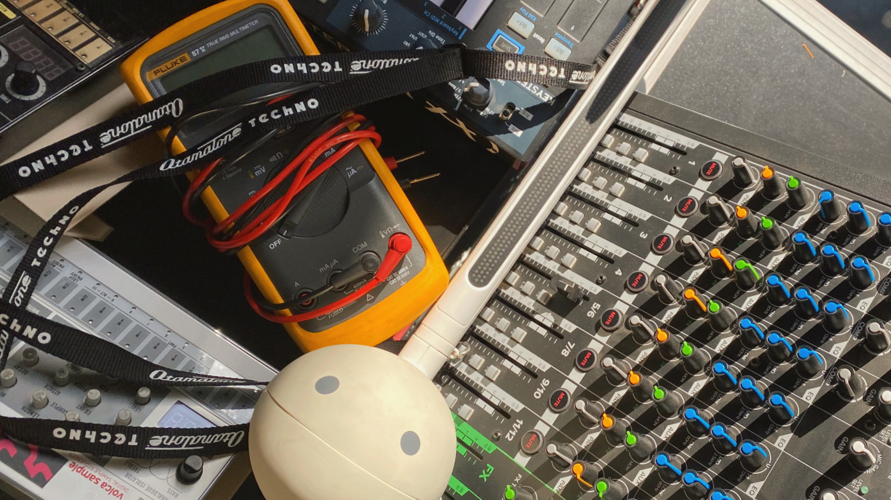
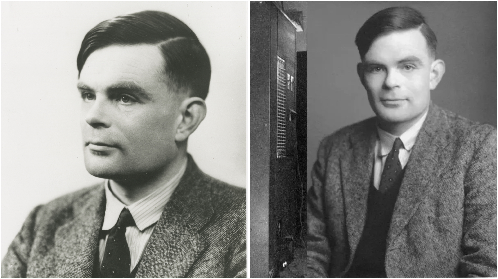

# Sesión-01a

Martes 05 de agosto, 2025

## Trabajo en clase

### Taller de diseño de maquinas computacionales DIS 8645

> Profesore: Aarón Montoya
>
> Profesor adjunto: Matias Serrano
>
> Ayudante: Mateo
>
> Ayudante: Janis

Nos presentamos y hablamos un poco sobre por qué decidimos volver a tomar un taller en esta área, y cuáles eran nuestras expectativas. En lo personal, tomé este taller porque me encantó el ambiente de trabajo. Disfruté mucho las tareas de escuchar discos y estudiar referentes.

Me gustaría aprender a imaginar cómo funciona la programación, persistir en esta bella área del diseño y encontrar mi propio enfoque o pasión dentro de la carrera.

### Horarios

| 08:30 - 09:00  | Llegar     |
|--------------- |----------- |
| 09:00 - 10:30  | Trabajar   |
| 10:30 - 11:00  | Descansar  |
| 11:00 - 12:30  | Trabajar   |
| 12:30 - 12:50  | Ordenar    |

### Introducción de contenidos  

#### ¿Qué es una máquina?

Palabras clave relacionadas con “máquina”, Machina, Meckhane, artificio, ingenio y medio.

Una máquina es un objeto físico con la capacidad de realizar procesos. Tiene entrada (input) y salida (output), puede contener piezas móviles o componentes electrónicos, y requiere energía, tiempo y un objetivo definido para funcionar. Está compuesta por más de un elemento, tiene intención y busca facilitar tareas.

No se puede definir un objeto o sujeto únicamente por su predicado.

#### ¿Qué es la tecnología?

La palabra viene del griego téchne, que se relaciona con arte, oficio y destreza.

Tecnología es la aplicación del conocimiento para resolver problemas o facilitar tareas a través de herramientas, técnicas o sistemas.

#### ¿Qué es lo computacional?

Es un campo que involucra, un objeto físico que puede procesar información, un lenguaje y orden lógico, cálculos numéricos (cómputos), uso de signos y símbolos, lo que se estudia en la semiótica.

También implica la interfaz humano-computador, es decir cómo las personas interactúan con las máquinas para dar instrucciones o recibir información.

---

### Referentes

- [Casey Reas](https://reas.com/)

- Christian Oyarzún: ramo de especialización, Cuerpo, Movimiento y Código.

- [Hernando Barragán:](https://people.interactionivrea.org/proxy-body.html?src=h.barragan%2Findex.html) Desarrolló el concepto de computación física.

- Ada Lovelace: Inventó la computación.

- Alan Turing: Creador de la máquina de Turing.

- [Mar Hicks](https://mitpress.mit.edu/9780262535182/programmed-inequality/)

### Palabras importantes

[Curaduría:](https://dle.rae.es/curadur%C3%ADa) Conservación y supervisión de bienes artísticos o culturales, especialmente para su eventual exhibición.

[Semiótica:](https://dotlib.com/es/blog/semiotica-definicion-fundamentos-y-aplicaciones) Es el estudio de los sistemas de signos y los procesos de significación.

[HCI:](https://albertolacalle.com/hci.htm) La Interacción Persona-Ordenador o en inglés Human Computer Interaction, es una disciplina relacionada con el diseño, evaluación, desarrollo y estudio de los fenómenos que rodean los sistemas informáticos para uso humano.

[STS:](https://gsas.harvard.edu/policy/science-technology-and-society) La Ciencia, Tecnología y Sociedad o en inglés science technology and society, emplean diversos métodos de las humanidades y las ciencias sociales para examinar cómo la ciencia y la tecnología influyen y se ven influidas por sus contextos sociales, culturales y materiales.

---

## Encargo-01: Alan Turing

En 1936, diez años antes de que se construyera la primera computadora, Alan Turing la creó en su mente. El estudió en el King's College, un colegio de Cambridge, una de las universidades más prestigiosas.

En ese tiempo, David Hilbert estaba estudiando las matemáticas y buscando una manera de convertirlas todas en símbolos, de modo que no existiera en ellas ningún supuesto ni enunciado indemostrable. Se planteó la siguiente pregunta: ¿existe un conjunto de pasos para determinar si un enunciado es verdadero o falso? Esto es conocido como el problema de la decisión. La idea era que no existieran enunciados imposibles de demostrar.

Luego Kurt Gödel presentó su teorema de la incompletud, que dice que las matemáticas son un sistema incompleto y que para resolver sus problemas tenemos que aceptar cosas no demostrables. Esto revolucionó las matemáticas y su sistema.

En 1936, Turing escribió un ensayo llamado On Computable Numbers (Acerca de números computables), donde definió dos tipos de números, los computables, es decir aquellos que se pueden resolver con una serie de pasos o algoritmos, y los no computables, para los cuales no existe algoritmo. Para responder a esta pregunta, Turing inventó una computadora.

Ya que en ese tiempo las computadoras eran realmente personas haciendo cálculos, Turing pensó que una máquina podía hacer lo mismo: resolver cualquier problema lógico con sus debidas instrucciones.

Él hizo un modelo lógico, no construyó ninguna computadora. Consistía en una cinta de papel infinita dividida en espacios que podían estar en blanco o contener un 0 o un 1, con un cabezal que podía leer cada cuadro, escribir o borrar las secciones. Este cabezal también podía moverse, y dentro de él había una memoria interna con los estados. Cada vez que el cabezal se movía, tenía la opción de escribir, borrar o dejar igual.

¿Cómo sabe si debe escribir, borrar o dejar igual? Esto podía funcionar gracias a algo que Turing llamó tabla de instrucciones, que ahora llamamos algoritmo. Con este modelo, que era una abstracción de una computadora, Turing demostró que con las debidas instrucciones una máquina podría resolver cualquier problema.

En diciembre de 1951, Turing se enfrentó a una pena de cárcel por mantener una relación sentimental con un hombre. Fue procesado por "indecencia grave" y sometido a un terrible proceso de castración química, que consumió su vida, y él decidió acabar con ella en 1954. Se dice que fue por una profunda depresión debido a lo horrible de este proceso. En 2009, Gordon Brown, entonces primer ministro, dio una disculpa pública a Turing, aunque en 2012 se negó el indulto. Finalmente, en 2013, la reina Isabel volvió a ofrecer una disculpa.

Alan Turing fue un genio increíblemente creativo. Es realmente terrible cómo los prejuicios y la discriminación no solo limitaron el desarrollo de su investigación y sus avances en la informática, sino que también convirtieron su vida en una persecución marcada por la crueldad.

> ▼ Figura 01. Fotografía. Fuente <https://teachinglondoncomputing.org/wp-content/uploads/2019/02/29-alan-turing-from-rs-.jpg>
>
> ▼ Figura 02. Fotografía. Fuente <https://s3-mspro.nyc3.cdn.digitaloceanspaces.com/tenant/5f3c32e7bc6bd007054065ad/mediaLibrary/photo/9baedef8-29e5-423c-b38e-b860712b7bb8-extra-large-standard-q100.webp?>
>
> Video de referencia ["La historia de Alan Turing, el hombre que inventó las computadoras"](https://youtu.be/H1ZE9CGO4js?si=yM7Q5HFvov5P2o_H)

## Encargo-02: Ada Lovelace

La primera computadora, el ENIAC, fue creada en 1946, y el primer lenguaje de programación, Fortran, apareció en 1955. Eso significa que la carrera de programación tiene menos de un siglo de vida, y aun así ha transformado profundamente el mundo. Lo sorprendente es que el concepto de una máquina universal fue imaginado por una persona 102 años antes de que existiera el primer lenguaje de programación.

Ada era una persona profundamente apasionada por las artes y las ciencias. Tuvo como profesora a Mary Somerville, una de las científicas y matemáticas más destacadas de su tiempo. Fue ella quien la introdujo en el mundo académico y la llevó a la Sociedad de Londres, donde Ada conoció al matemático Charles Babbage. Ese encuentro sería uno de los más importantes en la historia de la tecnología.

Babbage estaba trabajando en una máquina llamada máquina diferencial, diseñada para resolver ecuaciones matemáticas de forma automática. Se había inspirado en las calculadoras mecánicas creadas por Blaise Pascal y Gottfried Leibniz para desarrollar su diseño. El proyecto fue financiado inicialmente por el gobierno, pero los fondos no fueron suficientes para completar su construcción.

Ada quedó fascinada con esta máquina y le pidió que la aceptara como su estudiante. Aunque Babbage se negó, ambos continuaron en contacto y mantuvieron un intercambio constante de ideas.

Con el tiempo, Babbage se aburrió de su máquina diferencial, ya que estaba diseñada para realizar solo un tipo específico de funciones. Sintió entonces la necesidad de crear una máquina programable, a la que se le pudieran dar instrucciones para resolver cualquier tipo de problema matemático. Estas instrucciones iban a ser introducidas a través de tarjetas perforadas, las cuales estaban inspiradas en el telar de Joseph Marie Jacquard, una máquina que mediante tarjetas con agujeros, recibía instrucciones sobre cuándo mover las agujas y los hilos.

Ada Lovelace ya había visto la máquina de telar y le encantó la nueva idea de Babbage. Él seguía buscando financiamiento y fue a unas charlas en Italia, donde Luigi Menabrea, profesor de mecánica, tomó apuntes. Babbage le propuso a Ada traducirlos al inglés, pero Ada agregó notas de su propia investigación, enfocándose en los usos y capacidades de la máquina. Sus notas eran tres veces más extensas que el texto original.

Aquí ella desarrolló tres puntos. Primero, la máquina programable debía ser universal, es decir, capaz de resolver cualquier problema si se le entregaban las instrucciones correctas. Segundo, afirmó que las máquinas no podían pensar, solo ejecutaban las órdenes que se les daban. Y por último, escribió el primer programa de computadoras de la historia, explicando paso a paso los bucles y rutinas para calcular los números de Bernoulli y cómo entregar esa información a la máquina a través de las perforaciones.

Por estas notas, Ada es considerada la primera programadora, aunque lamentablemente existen discusiones sobre si las notas eran completamente suyas o no. Ada, aunque no era una genia de las matemáticas, definitivamente fue una gran visionaria y creativa. Indiscutiblemente fue la primera en publicar el primer programa de computadoras y se adelantó 100 años a su tiempo, imaginando y especulando cómo serían utilizadas las computadoras.

> Video de referencia ["La mujer que inició la programación, antes que existan las computadoras"](https://youtu.be/LdkXhXaZAZU?si=-T877GAZN710k29T)
