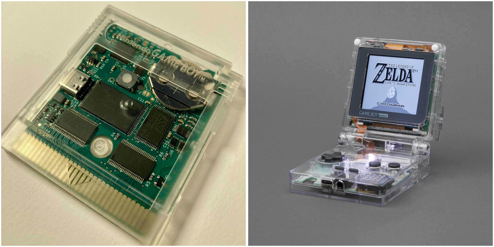
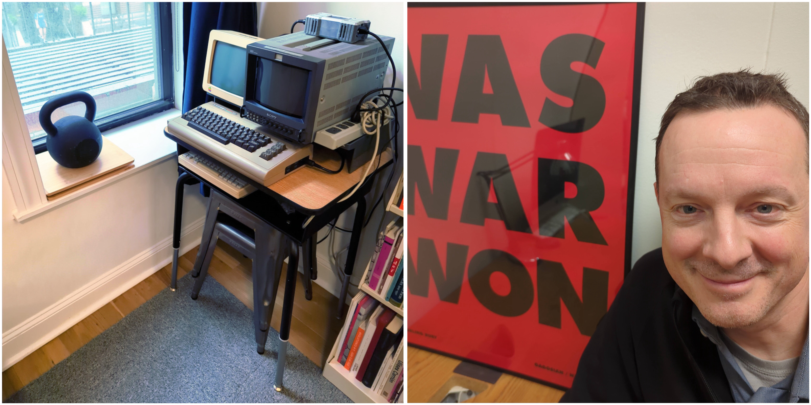
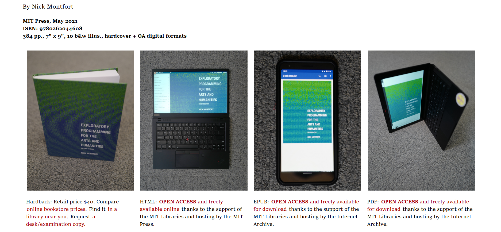
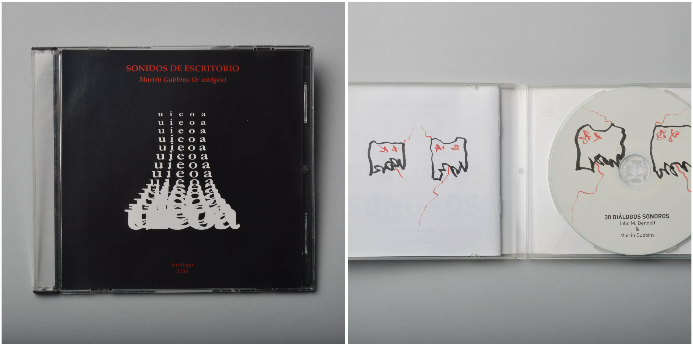

# Sesión-04b

Viernes 29 de agosto, 2025

## Encargo-08: Investigar la poesía y el trabajo de las poetas Allison Parrish, Nick Montfort y Martín Gubbins

### Allison Parrish

Allison Parrish es una poeta estadounidense que se dedica a la ingeniería de software, además de ser programadora creativa y diseñadora de juegos.

Fue reconocida como una de las primeras creadoras de bots creativos y literarios en Twitter, donde desarrollaba un bot poético conceptual y tuits experimentales. En 2016, fue nombrada "Mejor Creadora de Bots de Poesía" por The Village Voice.

Leí un proyecto que está desarrollando, llamado [El carrito pirata de Allison](https://abc.decontextualize.com/), es un cartucho flash para Game Boy, puedes copiar ROMs desde tu ordenador al cartucho y jugarlas en tu consola portátil. Me pareció súper interesante que algo que empieza como hobby lo comparte y lo convierte en una obra, la cual va actualizando continuamente. Muy cool.

Así mismo, como hizo con el proyecto llamado [Pocket SP](https://posts.decontextualize.com/pocket-sp/), el cual tomó una Game Boy Advance SP y la modificó, agregándole bisagras a la consola, las cuales históricamente han fallado y son desechadas por este fallo. Esta versión ganó la categoría "Técnica" del concurso de verano de modding de r/Gameboy, que fue lo que la motivó a trabajar intensamente en este proyecto.

Habla un poco de sus motivaciones, que vienen desde la nostalgia, desde su apreciación por las consolas y lo portátil. Al final, pone algo como que nada tenía que ver con sus obras, y dice que le divirtió mucho hacerlo. Eso me encantó; al fin de cuentas, dice mucho de ella y se ve su pasión por lo que hace, y eso es sumamente genial.

> Fuente https://portfolio.decontextualize.com/
>
> Fuente https://en.wikipedia.org/wiki/Allison_Parrish

### Nick Montfort

Nick Montfort es profesor de medios digitales en el MIT e investigador principal del Centro de Narrativa Digital de la Universidad de Bergen, Noruega. Se dedica al desarrollo de poesía y arte computacionales. trabaja en diversos contextos, incluyendo la web, la publicación de libros y lecturas literarias, así como exposiciones en galerías, la escena de demostración y la programación en vivo. 

Tiene un doctorado en informática y ciencias de la información de la Universidad de Pensilvania, una maestría en escritura creativa (poesía) de la Universidad de Boston, una maestría en artes y ciencias de los medios del MIT y títulos universitarios en artes liberales y ciencias de la computación de la Universidad de Texas en Austin.

Su libro académico más reciente es "output: An Anthology of Computer-Generated Text, 1953–2023."

> Fuente https://nickm.com/me.html
> 
> Fuente https://cmsw.mit.edu/profile/nick-montfort/

### Martín Gubbins

Martín Gubbins (Santiago, 1971), es una figura destacada de la escena literaria de vanguardia en Latinoamérica. ha publicado libros de poesía y poesía visual y ha grabado poesía sonora solo y con otros artistas. participado en exposiciones individuales y colectivas, instalaciones, lecturas, conciertos, performances y festivales en varias partes del mundo.

Escuché la obra Sonidos de escritorio y 30 diálogos sonoros.

Me parecieron interesantes, como a partir de sonidos casi repetitivos y con bastante textura y movimiento se van formando diálogos sonoros.

Martín Gubbins dice “Me gusta la imagen del poeta en acción, inmerso en una comunidad y de cara a una audiencia, buscando una comunión desafiante con el público, al que sitúo como co-creador. Entiendo el poema como una obra de arte basada en lenguaje y compuesta de un modo en que forma y contenido se enlacen desprejuiciadamente, desplazándose libremente entre la alta definición y lo abstracto; lo visual, semántico y sonoro”.

> Fuente https://martingubbins.cl/
