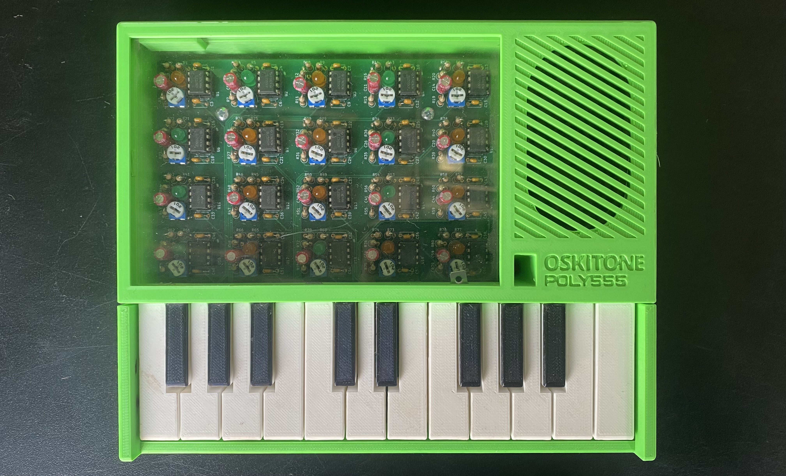

# Sesión-07a

Martes 23 de septiembre, 2025

## Trabajo en clase

### Cosas que hablamos en la mañana

- Toda la teoría del universo

- Susane Chau

- Cosmotécnica y la tecnodiversidad

- Lichen Lab

- [Bienal de Artes Mediales](cchv.cl/bienal-de-artes-mediales-de-santiago)

- Museo del Hongo


### Proyecto-02

El proyecto será de unas 4 personas

Diferentes formas de detectar presencia

Buscar proyectos en Arduino Project Hub y Instructables.com

RTC (Real Time Clock)

CWANDT / CWGT

Referencias: Hackaday, Clock, Nixie Tube Clock

Guardar y reproducir audio con módulo reproductor MP3 DFPlayer Mini

- Libro Beginning NFC

- Obra "Las llamadas que nunca hice", extremadamente cool

- Nona Fernández, Leer cualquier libro

- Patti Smith, Éramos unos niños

- Robert Mapplethorpe

Vale más caro el sonido que el tiempo; el sonido requiere / lleva tiempo

### Tipos de Motores

#### Motores DC

Rápidos, pero no saben en qué posición están. por ejemplo un Motor DC, vibran los joystick porque se desequilibra (como meter un ladrillo a la lavadora xd.

#### Stepper motor 

(motor paso a paso), más lento, gira de a poco, se mueve por grados.

Torque, Fuerza de giro que entrega un motor.

Drivers, Controladores necesarios para manejar motores.

#### Micro servomotor

Puede girar hasta 90° (algunos hasta 180°, 270° o 360°), los que tienen tope saben en qué posición están, los de 360° no saben desde dónde parten.

Hay librerías de Arduino ya incluidas para controlarlos.

#### Solenoide

Golpean al activarse, es  un motor que en vez de girar golpea, similares a los actuadores lineales, solo que los actuadores lineales son mas exactos y naturalmente mas caros.

#### Motores síncronos

Siempre giran a la misma velocidad, por ejemplo los de las escaleras mecánicas.

### Tipos de Leds

- Led RGB

- Neopixel

- Cintas led

podemos comprar mas variedades en DemasLED

llevan LEDs seguidos, y se pueden cortar cada cierto tramo

Miércoles con Sergio Majlub, sabe de LEDs

El dinero compra tiempo

### Ideas proyectos 02

Unos ojos que identifiquen y triangulen la profundidad de dónde estoy, siguiéndome con la mirada.
Cuando me acerque a un espacio, una oreja me hable con un sonido aleatorio (aún por definir).

Tip de búsqueda, si pones site:cl en Google, busca solo en Chile.

### Propuesta grupal Proyecto-02

#### Entrada

Sensores de distancia triangulan posición de usuario.

Detecta cuando el usuario está a muy corta proximidad.

#### Salida

Un servomotor mueve unos ojos haciendo que el robot siga al usuario con la mirada. Al detectar que el usuario está a muy corta proximidad, un parlante emite sonido pre-grabado aleatorio.

#### Sensores

Distancia ultrasónico

#### Links de compra

<https://afel.cl/products/sensor-de-ultrasonico-hc-sr04>

<https://afel.cl/products/modulo-reproductor-mp3-dfplayer-mini>

<https://afel.cl/products/micro-servomotor-sg90>

<https://www.mechatronicstore.cl/altavoz-8-ohm-1w/>

#### Dudas

¿Cómo obtener lecturas estables del sensor ultrasónico?

¿Cómo evitar que los ojos se queden fijos en objetos inmoviles (ambiente)? 

---

### Referentes

- Susane Chau

- Nonna Fernandez

- Robert Mapplethorpe

- Patti Smith

- Yuk Hui

### Palabras importantes

[Cosmotécnica:](https://www.centropoiesis.net/items/%22cosmo-t%C3%A9cnicas%22) El termino Cosmotécnica es desarrollado por Yuk Hui y se entiende como la unificación de una concepción del cosmos, y por lo tanto de la naturaleza por medio de las técnicas, tanto de oficios como de artes.

Tecnodiversidad: enontre est video que habla de eso [Yuk Hui (Masterclass) ¿Por qué es necesaria la tecnodiversidad?](https://youtu.be/Dni6UJDFUuw?si=XxG4CNcoMZsBdrT_)

[Drivers:](https://learn.microsoft.com/es-es/windows-hardware/drivers/gettingstarted/what-is-a-driver-) Un controlador es un componente de software que permite que el sistema operativo y un dispositivo se comuniquen. Por ejemplo, cuando una aplicación necesita leer datos de un dispositivo, llama a una función implementada por el sistema operativo. 

---

## Encargo-12: leer las bitacoras de colegas

Encontrar similitudes, diferencias, preguntas y aciertos de sus máquinas saludadoras propuestas. Citar correctamente las fuentes.

- Grupo-01

  - 04-yamna-bit
  - 05-sofiacartes
  - 14-mmillar95
  - 21-vaniaparedes
  - 26-vxlentiinaa
 
Siento que este proyecto tiene muchas cosas en común con el nuestro: es una especie de robot nervioso que, cuando te acercas, te cuenta un secreto. Esto se parece bastante a una idea que propuse hace unas clases, en la que mediante la cercanía el robot comunicara y emitiera sonidos y secretos. A partir de un concepto parecido, nos fuimos inspirando con nuestro grupo, mezclando además otros sensores.

- Grupo-06

  - 11-AntFuentealba
  - 12-santiagoClifford
  - 22-sofia-perezm
  - 23-felix-rg416
 
También tenemos cosas en común con este grupo, ya que incluimos unos ojos que te observen hasta que se produzca una interacción. En su caso, este grupo quiso hacer unos ojos que te sigan y generen una sensación incómoda y “creepy” en los usuarios.

## Encargo-13: Referentes asociados a tu proyecto

Buscar referentes asociados a tu proyecto de cada una de estas 4 categorías:

- lenguaje natural

- Código

- Materialidad

- Documentación

### Lenguaje

De lenguaje, me gusta mucho cómo se expresa la youtuber [blanca_guilera](http://www.youtube.com/@blanca_guilera), que suele hacer videos de literatura e historia con perspectiva feminista. También habla de ciencia en algunos videos, y siento que, además de proponer perspectivas muy claras y refrescantes, sabe manejar temas complejos o controvertidos con un lenguaje muy apropiado, que a mi parecer no espanta a personas que no entienden o difieren del feminismo. Además, suele hacer preguntas que logran capturar tu atención y las va resolviendo a lo largo del video, manteniéndote interesada. Es muy tranquila al hablar; siento que lo hace con un tono y una velocidad muy agradables.

Pongo de ejemplo esta [Lesson 1: Listening](https://youtu.be/waN4owHeyaQ) que subieron al canal de Moog, donde introducen las bases de los sintetizadores y la importancia de la escucha activa. Siento que logran explicar conceptos complejos de síntesis analógica de manera muy clara, combinando dibujos y colores con explicaciones verbales que ayudan a entender cómo pequeños cambios en los parámetros transforman el sonido. Además, enseñan a entrenar el oído para identificar timbresy texturas, lo que convierte la lección en un apoyo visual y narrativo muy completo.

### Código

De ejemplo para el código, encontré este ejercicio en [w3schools](https://www.w3schools.com/cpp/cpp_howto_random_number.asp) para aprender a generar números aleatorios, lo cual necesitamos trabajar en nuestro proyecto con las frases escogidas.

```ccp
// Get a different random number each time the program runs
srand(time(0));

// Generate a random number between 0 and 100
int randomNum = rand() % 101;

cout << randomNum;
return 0;
```

### Materialidad

De materialidad, creo que lo más probable es que utilicemos impresión 3D, ya que es un material y una técnica con muchas opciones de formas. Además, es rápido, y en el LID tenemos varios tipos de filamentos e impresoras disponibles. Para mí, el tema del tiempo es muy valioso, y si lo hiciera con madera o terciado tendría que ir en auto a comprar los materiales. Además, la impresión 3D no requiere ningún tipo de terminación específica.

Y también, como ejemplo concreto de fabricación digital, modelado 3D e impresión en PLA, tenemos uno de los sintetizadores de la marca [Oskitone](https://www.oskitone.com/), la cual fabrica instrumentos musicales electrónicos y kits de soldadura para armar uno mismo. Este sintetizador está en el laboratorio, y no solo lo encontré fascinante por su función y sonido, sino también porque convierte un material de prototipo en un producto de muy buena calidad.



### Documentación

De documentación, me gusta mucho este canal que habla de historia, se llama [Retro Flama](https://www.youtube.com/@RetroFlama) y habla de fenómenos tecnológicos y modas retro. Estos videos tienen imágenes de apoyo y narraciones que logran hilar muy bien las historias, incluso cuando abarcan muchos temas. Realmente me emocionan, ya que utilizan fotos difíciles de encontrar del pasado, graficando y transportándote a esos momentos. Además, transforman su investigación en algo muy fácil de digerir.

Por ejemplo, está este video que habla de [LA HISTORIA DE LOS SALVAPANTALLAS](https://youtu.be/my3RitIv62A?si=cypliP41-tG5IEZU)

También, como referente de documentación, me parece muy ordenada y concisa la manera en que explican los componentes y elementos que vienen en los productos de los [sintetizadores Moog](https://www.moogmusic.com/synthesizers/mavis/). Lo hacen mediante fotos extendidas con tomas superiores de todos los componentes, esquemáticos, y pequeñas láminas que se pueden superponer para probar diferentes sonidos y combinaciones.


