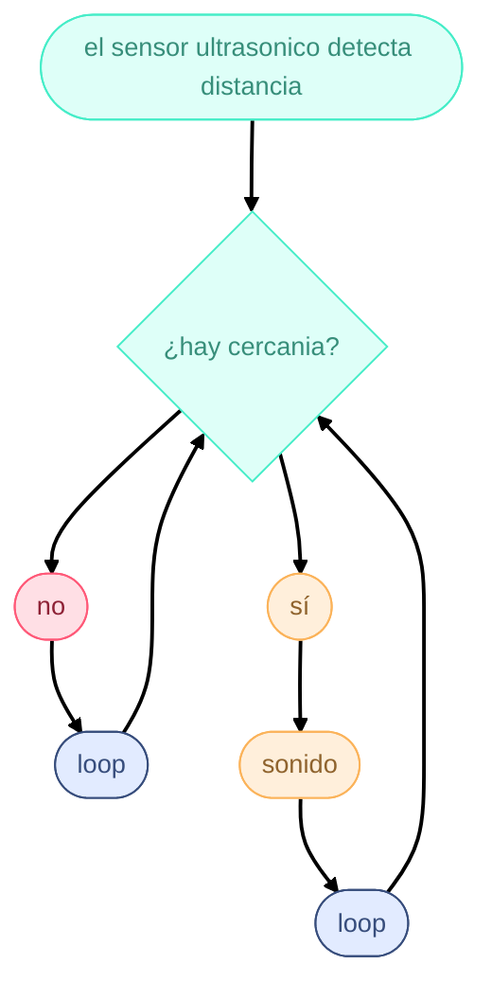

# Sesión-07b

Viernes 26 de septiembre, 2025

## Trabajo en clase

### Cosas que hablamos en la mañana

- Hablamos de las comisiones, ya que Aarón ya encontró una buena comisión, Cynthia.

- Rafael Benguria, profesor de Aarón y referente, Premio Nacional de Ciencias, hace clases de Física.

- Velocidad del sonido, no porque el sensor me diga algo es la verdad; es una interpretación.

### Pseudocodigo para los Proyectos-02

[reproductor-mp3](https://afel.cl/products/modulo-reproductor-mp3-dfplayer-mini)

---

## Encargo-14: Diagrama de flujo

cada persona del grupo debe implementar en diagrama de flujo dibujado o con la herramienta Mermaid.js con sus propias palabras y subirlo a su README.

[mermaid](https://mermaid.js.org/intro/getting-started.html)

## Encargo-15,

cada persona del grupo debe subir a su README: documentar funcionamiento de sus sensores, incluyendo instrucciones de conexión y de configuración, subir el proyecto entero de arduino como carpeta, tiene que poder compilar sin problema y mostrar en consola los datos de los sensores.
