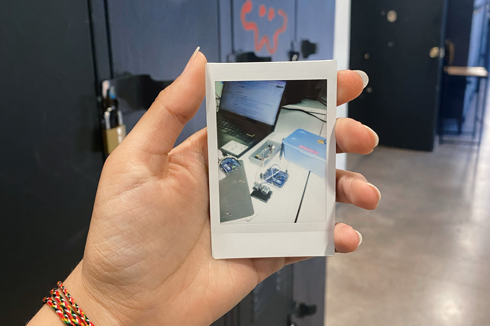

# Sesión-08a

Martes 30 de septiembre, 2025

## Trabajo en clase

### Cosas que hablamos en la mañana

- nos trajieron un sinte que funcionaba grabando audios y replicando en diferentes tonalidades

### Avaces del Proyecto-02

Tuvimos que reducir las interacciones y los sensores que queríamos agregar porque era muy complejo y teníamos poco tiempo para que todos lográramos entender en profundidad sus funcionamientos.

Antes queríamos trabajar con dos sensores que triangularan la ubicación de la persona y así poder seguir con los ojos a quien entrara en la exposición/obra. Pero tuvimos que acotar la idea e ir agregando de a poquito los sensores, si logramos unir el código primero.

Por eso mismo, estuve entendiendo bien y modificando en clase el diagrama de flujo que había que hacer para el encargo pasado.

---

### Referentes

### Palabras impoertantes

---

## Encargo-16: Resumir lo que llevamos hasta el momento

Durante esta sesión nos enfocamos principalmente en ajustar el ángulo del servo, que controla el movimiento de los ojos, para que respondiera correctamente junto al radar. Este proceso tomó bastante tiempo, ya que el sensor entregaba lecturas muy inestables.

Fuimos organizando y reescribiendo los códigos de los distintos componentes por separado, con la idea de comprender mejor cómo funcionaban individualmente antes de intentar integrarlos. También revisamos ejemplos de conexión del módulo MP3 con Arduino, para entender cómo podríamos implementarlo más adelante.

Una vez que logramos que el sensor ultrasónico mostrara datos en la terminal, intentamos estructurar el programa con pestañas para cada componente y dejar la configuración general en el archivo principal. 

Al combinar todo, surgieron varios errores y confusiones en la programación, por la dependencia entre el servo y el sensor, que deben funcionar coordinados.

Además, repartir las tareas fue un poco difícil, ya que no tuvimos una comunicación tan fluida dentro del grupo, lo que afectó la organización y la distribución del trabajo.

- Componentes principales:

  - Sensor ultrasónico HC-SR04

  - Servo motor

  - Módulo DFPlayer Mini
