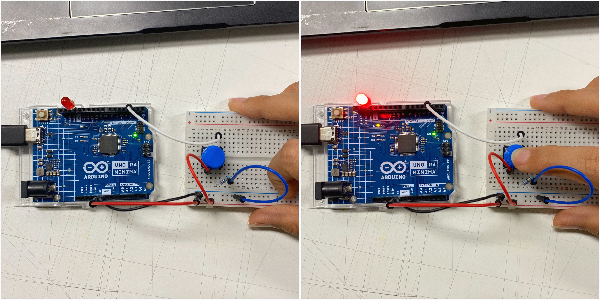

# Sesión-09a

Martes 07 de octubre, 2025

## Trabajo en clase

### Cosas que hablamos en la mañana

Vimos el proyecto de un grupo de trabajo, era un robot que levantaba el dedo.

Ética y geometría, ángulos peligrosos.

En los ejemplos de clase aprendimos que es importante separar los datos y parámetros del código principal, para evitar modificarlo por error si hay que hacer algún cambio.

### Avances del Proyecto-02

Aarón nos ayudó a ordenar las clases. Conversamos un poco con el grupo sobre lo que debíamos ir definiendo.

La idea es crear un índice para generar una lista de sonidos aleatorios para el módulo MP3.

Cuando el sensor ultrasónico detecte algo cerca, el sistema “tira un dado” para emitir un sonido al azar, utilizando la estructura switch case.

Este ejercicio me sirve para entender cómo funcionan los botones y, a partir de eso, poder crear un código que ejecute sonidos aleatorios. Luego, la idea es ir explicando cada parte para comprender mejor su funcionamiento.

Últimamente he tenido demasiadas cosas y peso emocional-mental, lo que no me ha permitido avanzar y aprender como quería. Por eso he estado muy perdida. Misa me explicó un poco cosas que ya debería saber de programación. Espero no haberlos decepcionado, he intentado ponerme al día, porque para mí esto es importante ;-;

En clase, Misa me dijo que primero entendiera cómo hacer funcionar un botón, así que intenté explicar un poco lo que iba ocurriendo en el código con ayuda de ChatGPT, y luego pasarlo a mis palabras para poder entenderlo mejor.

> [Ejemplo de botón](https://docs.arduino.cc/built-in-examples/digital/Button/)

```text
/*
  Button

  Turns on and off a light emitting diode(LED) connected to digital pin 13,
  when pressing a pushbutton attached to pin 2.

  The circuit:
  - LED attached from pin 13 to ground through 220 ohm resistor
  - pushbutton attached to pin 2 from +5V
  - 10K resistor attached to pin 2 from ground

  - Note: on most Arduinos there is already an LED on the board
    attached to pin 13.

  created 2005
  by DojoDave <http://www.0j0.org>
  modified 30 Aug 2011
  by Tom Igoe

  This example code is in the public domain.

  https://www.arduino.cc/en/Tutorial/BuiltInExamples/Button
*/

// constants won't change. They're used here to set pin numbers:
const int buttonPin = 2;  // the number of the pushbutton pin
const int ledPin = 13;    // the number of the LED pin

// variables will change:
int buttonState = 0;  // variable for reading the pushbutton status

void setup() {
  // initialize the LED pin as an output:
  pinMode(ledPin, OUTPUT);
  // initialize the pushbutton pin as an input:
  pinMode(buttonPin, INPUT);
}

void loop() {
  // read the state of the pushbutton value:
  buttonState = digitalRead(buttonPin);

  // check if the pushbutton is pressed. If it is, the buttonState is HIGH:
  if (buttonState == HIGH) {
    // turn LED on:
    digitalWrite(ledPin, HIGH);
  } else {
    // turn LED off:
    digitalWrite(ledPin, LOW);
  }
}
```

Aquí agregué mis cometarios para entender el codigo 

Creo que logré entender mejor cómo funciona el código, sé que todavía tengo que repasar ;(

``` cpp
/*
  Button

  Turns on and off a light emitting diode(LED) connected to digital pin 13,
  when pressing a pushbutton attached to pin 2.

  The circuit:
  - LED attached from pin 13 to ground through 220 ohm resistor
  - pushbutton attached to pin 2 from +5V
  - 10K resistor attached to pin 2 from ground

  - Note: on most Arduinos there is already an LED on the board
    attached to pin 13.

  created 2005
  by DojoDave <http://www.0j0.org>
  modified 30 Aug 2011
  by Tom Igoe

  This example code is in the public domain.

  https://www.arduino.cc/en/Tutorial/BuiltInExamples/Button
*/

// constante llamada buttonpin, con el valor 2, esta en un pin digital
const int buttonPin = 2;

// constante llamada ledpin, con el valor 13, esta donde el led
const int ledPin = 13;

// varianle buttonstate inicia en 0
int buttonState = 0;

// inicio de la funcion setup, solo lo hace una vez
void setup() {

  // configura el pin ledpin 13, como salida
  pinMode(ledPin, OUTPUT);

  // configura el pin buttonpin como entrada
  pinMode(buttonPin, INPUT);

  // fin del setup
}

// inicio del loop, bucle infinito
void loop() {

  // digitalread, lee el valor del pin, y lo deja en buttonstate
  buttonState = digitalRead(buttonPin);

  // el valor sera alto o bajo
  if (buttonState == HIGH) {

    // envia alto como voltaje, al led encendiendolo
    digitalWrite(ledPin, HIGH);

    // si la condicion es low entra en else
  } else {

    // envia low al pin led y lo apaga
    digitalWrite(ledPin, LOW);
  }
}
```



La idea es hacer un listado de frases y sonidos para poder reproducirlos de forma aleatoria con el monitor serial.

Igual, me pregunto si realmente es necesario que sea aleatorio, si de por sí ya tenía un orden desconectado, aunque puede funcionar como un listado independiente.

Luego, como encargo o tarea, volví a repasar en mi casa.

[Piskel](https://www.piskelapp.com/p/create/sprite/), para hacer gift en pixelart.

### Referentes

-

-

### Palabras importantes

---

## Encargo: Repaso

Como mencioné, volví a repasar un poco y fui haciendo algunos ejemplos que dejé registrados en la clase 01b, ya que ahí había un encargo parecido que sentía que no podía hacer muy bien, así que lo volví a realizar.

Mi repaso se encuentra en el encargo de la [sesión 01-b](https://github.com/Bernardita-lobo/dis8645-2025-02-procesos/tree/main/13-Bernardita-lobo/sesion-01b)
