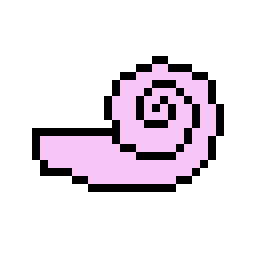
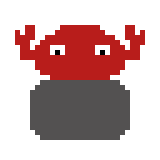
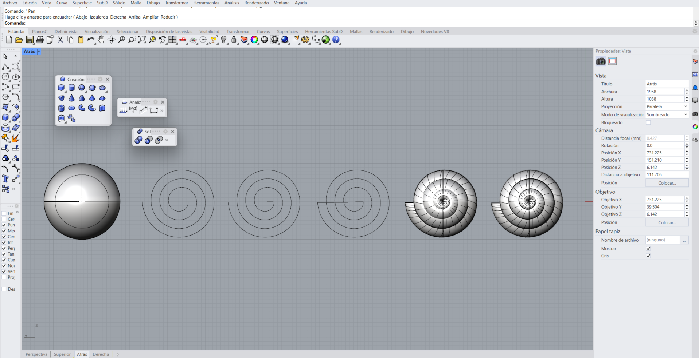
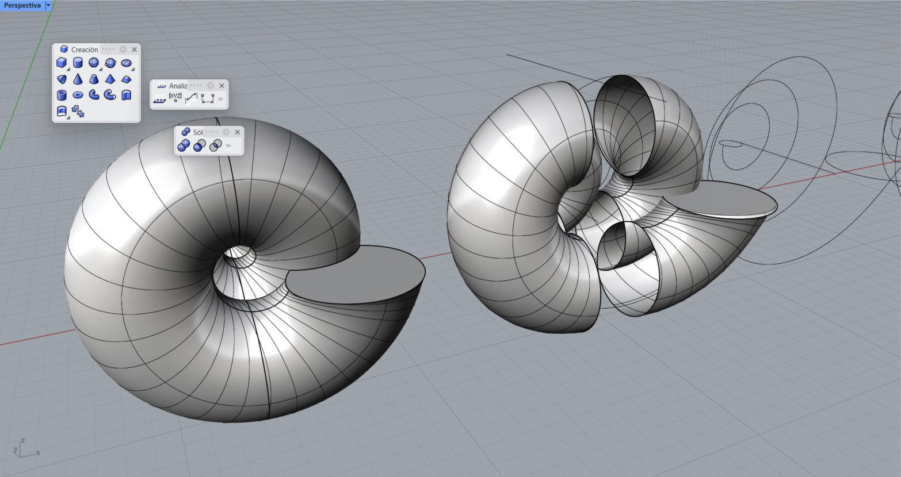
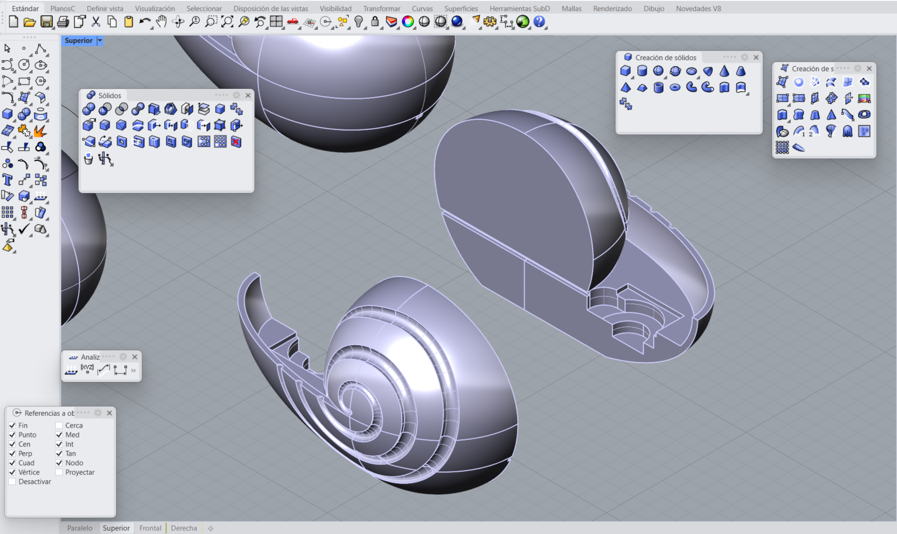
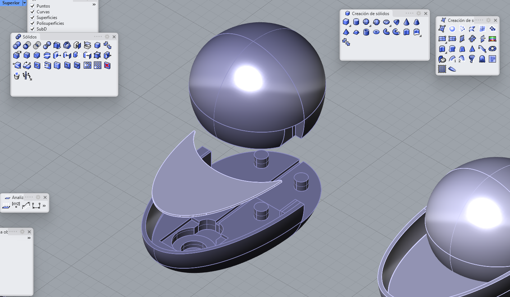

# Sesión-10a

Martes 14 de octubre, 2025

## Trabajo en clase

### Cosas que hablamos en la mañana

- Hablamos un poco sobre cómo va a funcionar la entrega del proyecto 02, cuál será el formato y la dinámica. También es probable que vengan personas externas al taller a ver los trabajos.

- Aarón también nos ayudó a acotar nuestras ideas para poder alcanzar los tiempos de entrega.

### Avances del Proyecto-02

Realicé los GIF que se ven arriba y me encantaron. Los hice rápidamente, pero siento que pueden ayudar bastante a visualizar la idea.

Como ya habíamos definido la carcasa e identidad del proyecto, estuve desarrollando una con forma de concha marina para contener el speaker. Hasta ese momento solo había logrado dar la forma general, pero no conseguía que quedara como un sólido, así que me rendí por un tiempo. 

> Video de referencia [Snail 3D Modeling in Rhino 6 (Part 1) : Jewelry CAD Design Tutorial ](https://youtu.be/GZgCaxfQmg8?si=GTQTN9FZe9D71rut)

En esta clase logré avanzar bastante, o al menos eso quiero pensar, aunque en la práctica perdí literalmente cada segundo del día porque nunca pude cerrar la pieza correctamente.

Por lo mismo, no llegué a tener un elemento físico con volumen y listo para imprimir. Al final del día decidí empezar de nuevo con algo menos ambicioso. 

Modelé una forma más básica de concha marina, a la que le di las tolerancias y dimensiones del speaker, como si ya estuviera lista para imprimir. A partir de esa base comencé nuevamente a darle las formas espirales características de las conchas.

### Reflexion dificultades del proyecto

Yo creo que lo que más me costó en este primer proyecto fue sentirme preparada para gestionar algo así, ya que varias veces sentí que no sabía lo suficiente para trabajar con programación. Se podría decir que “perdí” bastante tiempo repasando conceptos de programación en general para sentirme más al día. Por eso, no pude involucrarme tanto en el código como me habría gustado, participando principalmente en la búsqueda de referencias.

Además, siento que no tuvimos una comunicación tan buena y no supimos repartir bien el trabajo según nuestras habilidades. Cada integrante fue avanzando a distintos ritmos y en diferentes partes del proyecto, lo que hizo difícil concretar y unir todas las versiones de los códigos al final.

---

### Referentes

-

-

### Palabras importantes
