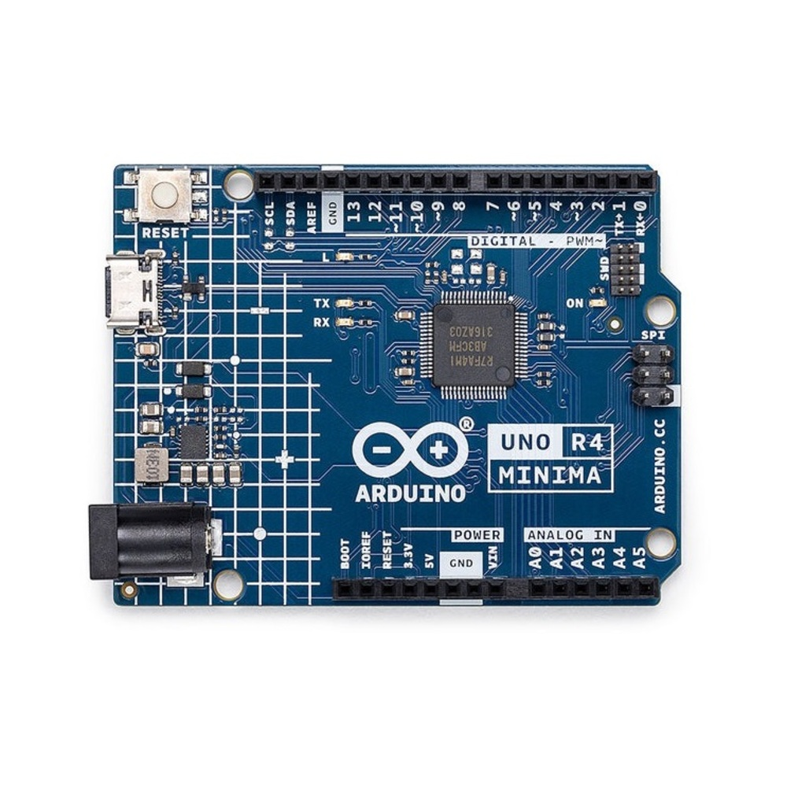
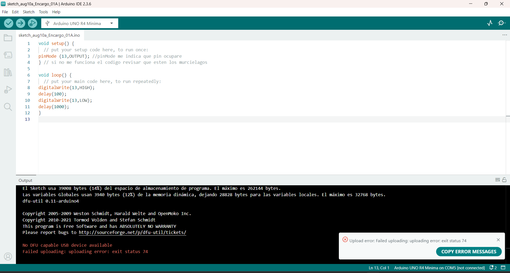
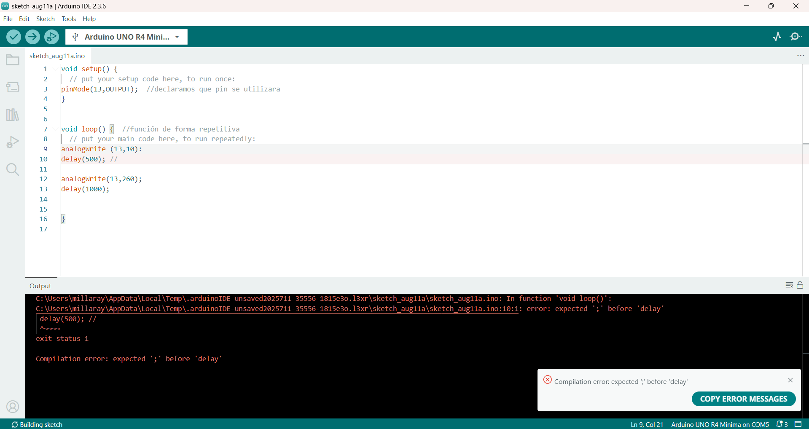
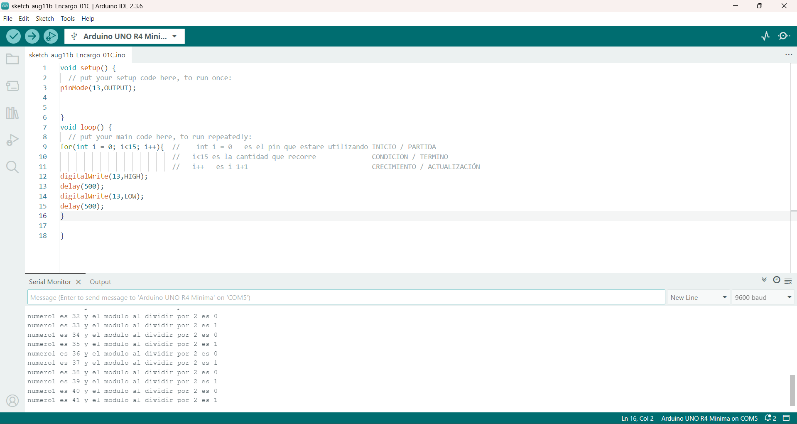

# sesion-01b / Clase 02 / 08.08.2025

## Arduino R4 minima



### Componentes

- Microcontrolador (MCU)
- Alimentación: Puerto USB-C
- Indicadores visuales
- Botón Reset
- Conectividad de pines
- Entradas analógicas
- 14 pines digitales (D0 a D13)

### Conceptos

- void setup  *// Lo que se ejecuta solo una vez*
- void Loop *// Lo que se genera continuamente (bucle)*
- pinMode *// Pin: Numero que quiero configurar Mode: Input/Output*
- digitalWrite *// Sirve para poner un pin digital en ALTO (HIGH) o en BAJO (LOW)*
- delay *//pausas*
- const int *// Número entero que no se puede modificar (usualmente para pines y datos que no se quieren modificar)*
- if *// Si una condición se cumple, ejecuta un bloque de código. Si no, lo ignora*

```cpp
// Definimos los pines
const int botonPin = 2;         // Pin del botón
const int ledPin   = LED_BUILTIN; // LED integrado en la placa

void setup() {
  pinMode(botonPin, INPUT_PULLUP); // Botón como entrada con resistencia interna
  pinMode(ledPin, OUTPUT);         // LED como salida
}

void loop() {
  int estadoBoton = digitalRead(botonPin); // Leer el botón

  if (estadoBoton == LOW) { // Si el botón se presiona
    digitalWrite(ledPin, HIGH); // Enciende el LED
  } else {
    digitalWrite(ledPin, LOW);  // Apaga el LED
  }
}
```

## Encargo

Realizar y documentar 3 códigos como mínimo, los cuales deben tener error y solucionarlos (intentar)

Generar codigos, solo con la placa de arduino

- Fallar muchas veces
- sin chat gpt
- sin componentes
- analizar la falla

### codigo_01

Para mi primer código de arduino, quiero realizar analizar los componentes y conceptos de la placa.

El led del Pin13 enciende y apaga con un delay(100).

- pinMode
- delay
- digitalWrite

error placa no encontrada

error no finalizar con ;



### codigo_01 arreglado

```cpp
void setup() {
  // put your setup code here, to run once:
pinMode (13,OUTPUT); //pinMode me indica que pin ocupare
} // si no me funciona el codigo revisar que esten los murcielagos 

void loop() {
  // put your main code here, to run repeatedly:
digitalWrite(13,HIGH);
delay(100);
digitalWrite(13,LOW);
delay(1000);
}
```

### codigo_02

Al igual que en el codigo anterir se utilizara el pin 13 que esta en el ardiono, y este led cambiuara de intendiad (alta/baja).

Con delay(500) y delay(1000).

**Error al poner : en vez de poner ;** *(línea 9)*



### codigo_02 arreglado

```cpp
void setup() {
  // put your setup code here, to run once:
pinMode(13,OUTPUT);  //declaramos que pin se utilizara
}

void loop() {  //función de forma repetitiva 
  // put your main code here, to run repeatedly:
analogWrite (13,10); // el segundo digito indica la intencidad del pin (intensidad baja)
delay(500); //

analogWrite(13,255); // el segundo digito indica la intencidad del pin (intensidad alta)
delay(1000);

}
```

### c0digo_03

Para este código quería probar otras variantes como el for.

También se quería realizar que el pin13 solo se prenda 15 veces y después se apague.

Error el pin13 se prendía constantemente

Se puso la información en void loop en vez de void setup

En sí, el código no está mal, pero no hizo lo que yo quiero que realice



### codigo_03 arreglado

```cpp
void setup() {
  // put your setup code here, to run once:
pinMode(13,OUTPUT);
  // put your main code here, to run repeatedly:
for(int i = 0; i<15; i++){  //    int i = 0   es el pin que estare utilizando INICIO / PARTIDA
                            //   i<15 es la cantidad que recorre              CONDICION / TERMINO
                            //   i++   es i 1+1                               CRECIMIENTO / ACTUALIZACIÓN 
digitalWrite(13,HIGH);
delay(500);
digitalWrite(13,LOW);
delay(500);
}

}
void loop() {

}
```

## Material de apoyo

video referencial que ayuda a entender los componentes de la placa arduino y su funcionamiento

[I'm an inline-style link](https://www.youtube.com/watch?v=EEKMPT_YcTI&list=PLyLh25DppBIe40j3VBAslnVfs4Pz-B3ZB&index=3)

video referencial for arduino

[I'm an inline-style link](https://www.youtube.com/watch?v=e8CEpAQ4otU )

libro de kit arduino, descripción de componentes y proyectos para realizar

Libro de proyectos Arduino (kit arduino)
