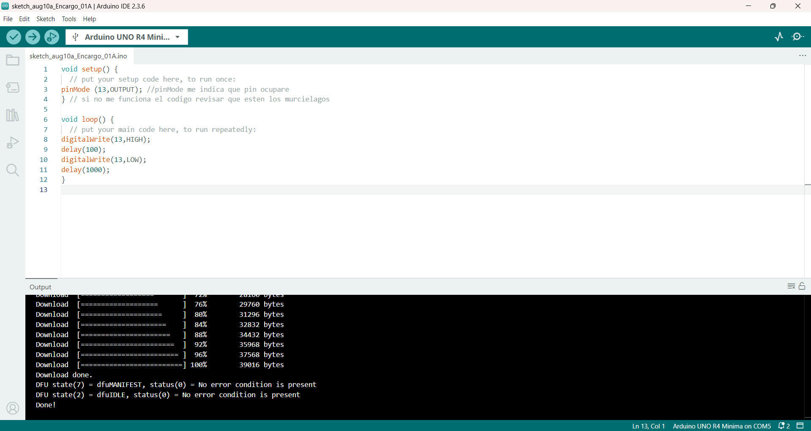
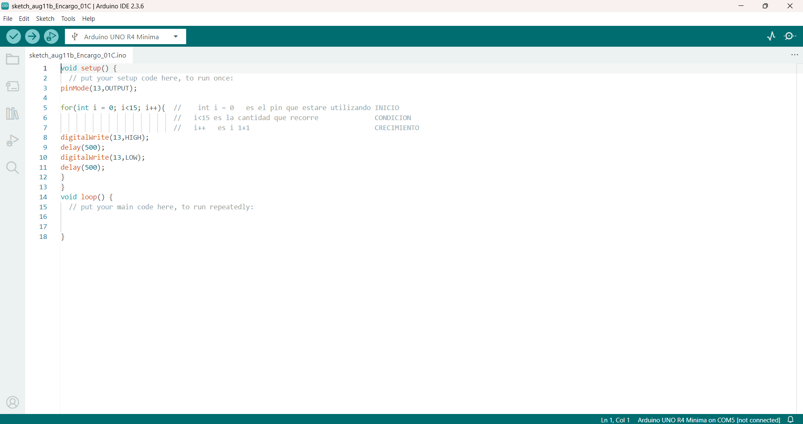

# Sesion-02a

## Encargo 01 / 12.08.2025

Generar codigos, solo con la placa de arduino

Fallar muchas veces

- sin chat gpt
- sin componentes
- analizar la falla

## Material de apoyo

video referencial que ayuda a entender los componentes de la placa arduino y su funcionamiento

[I'm an inline-style link](https://www.youtube.com/watch?v=EEKMPT_YcTI&list=PLyLh25DppBIe40j3VBAslnVfs4Pz-B3ZB&index=3)

video referencial for arduino

[I'm an inline-style link](https://www.youtube.com/watch?v=e8CEpAQ4otU )

libro de kit arduino, descripción de componentes y proyecctos para realizar

Libro de proyectos Arduino (kit arduino)

## Codigo 01

- pinMode  *preguntar para que no se traduzca*
- digitalWrite
- delay

quiero que se prenda y apague el pin 13

error no finalizar con

### error placa no conectada

#### codigo arreglado

## Codigo 02

### la luz del pin 13 cambia de intensidad (baja y alta)

### uso de la funcion for, el pin prende y apaga 15 veces

TODO: subiste pero no esperaste a que cargara, entonces quedó este link mal.

## Clase 03 // 12.08.2025

- U : universal = estandar
- S: serial
- B: bus

Tipo de comunicación por transporte

Intercambio de comunicación binaria

mouse: 9600

stack overflow >> pagina web que ayuda cuando no me sale un codigo

puesto de empanadas, tiene que estar limpio

utilizar fuentes originales // no las de inteligencia artificial
