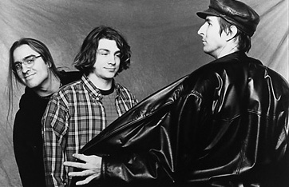

# sesion-05b / Clase 09 / 05.09.2025
## Conversación en la mañana

En la primera parte de la clase se habló sobre la entrega 01, promedios de nuestras notas y avance en la bitácora.

La universidad es una instancia en la que podemos errar y aprender de ello. Los proyectos son principalmente muy personales, por ende el ego es algo que nos puede jugar en contra y hay que trabajar en eso para que no sea un impedimento para poder desarrollar nuestros intereses.

## Inicio de clases
- .h prometo
- .cpp me hago cargo
- <> buscar el archivo para colocarlo en el código
- El código debe tener comentarios
- Todo debe estar ordenado (así se puede entender más fácil)
- La parte central del código es comentar que hace el código en sí 

---

## Clases

Adafruit_GFX → Es una librería muy usada para pantallas gráficas la cual permite dibujar texto, líneas, formas, etc.

Adafruit_SSD1306 → Para pantallas OLED (proyecto 01).

Ambas deben ir juntas.

```cpp
#include <Adafruit_GFX.h>
#include <Adafruit_SSD1306.h>
```

Ejemplo

```cpp
class Adafruit_SSD1306 : public Adafruit_GFX 
```
```cpp
class Completo_italiano : public Completo {}
```
Completo_italiano es un tipo de completo.

## Encargo 09

Escuchar dos primeros discos de Primus.

### ¿Quiénes son Primus?

Primus es una influyente banda de rock estadounidense, conocida por su estilo musical excéntrico y a menudo humorístico. Formada en 1984 en El Sobrante, California, la banda se distingue por su enfoque poco convencional en el bajo, temas líricos extraños y una mezcla de géneros como el funk rock, metal alternativo y rock progresivo. 

### Integrantes 

- Les Claypool: Bajista, vocalista y compositor principal.
- Larry "Ler" LaLonde: Guitarrista.
- Tim "Herb" Alexander: Baterista. En la actualidad, su lugar lo ocupa John Hoffman.




### Frizzle Fry 

Es un disco que sale de los discos que escucho generalmente. Me gustó mucho la presencia del bajo y que predomine al igual que la batería. A pesar de que las letras son un poco extrañas, para mí eso le da el factor distintivo a la banda.

Too many puppies muy buena canción.  

[Primus - Frizzle Fry](https://www.youtube.com/watch?v=5-WqNEmrnfM&list=PLPLj3dwmpRnGQMHtjrnhTU454dGRuR_xq)

### Sailing the Seas of Cheese

En este disco muestran aún más lo buenos que son tocando sus instrumentos, además me pareció interesante los videos que tienen como "Tommy The Cat" el cual ocupa la técnica de [spoken word](https://es.wikipedia.org/wiki/Spoken_word) que llama a las personas a seguir viéndolo y quedarse hasta el final.

[Primus - Tommy The Cat](https://www.youtube.com/watch?v=r4OhIU-PmB8&list=RDr4OhIU-PmB8&start_radio=1)

## Encargo 10

Investigar sobre la obra de Mitchel Resnick, leer uno de sus escritos o ver una de sus charlas, y comentarla críticamente.

### Mitchel Resnick

Mitchel Resnick (12 de junio de 1956) es un profesor, físico, informático, periodista y programador estadounidense.

Estudió la licenciatura de física en la Universidad de Princeton en 1978, realizó la maestría (1988) y doctorado en computación en el Instituto Tecnológico de Massachusetts (1992).Trabajó como periodista sobre ciencia y tecnológica desde el 1978 al 1983, y es referente mundial en el uso creativo de las computadoras en la educación.

Profesor: MIT Media Lab

Director: Grupo de investigación Lifelong Kindergarten

Desarrollo Scratch un motor de videojuegos desarrollado por MIT Media Lab.

Fuente: [Wikipedia](https://es.wikipedia.org/wiki/Mitchel_Resnick)

### Charla Lifelong Kindergarten

Esta charla fue realizada en un evento TEDxBeaconStreet en noviembre de 2017, el puento de vista de Resnick es que cada vez que los estudaintes avanzan en su educacion, el aprendizaje y los metodos de aprender se vuelven mas formalizados y con menos creatividad, aqui es donde llama a implementar a el jardín de infancia. con 4 principios de aprendizaje: 

Con 4 principios de aprendizaje (4P): 

- Projects: Las personas aprenden mejor cuando trabajan en proyectos que les interesan.
- Passion: Cuando las personas trabajan en temas que les apasionan, están dispuestas a esforzarse más y superar los obstáculos.
- Peers: Interactuar, compartir ideas y trabajar con otros en un espíritu de compañerismo enriquece la experiencia y fomenta el pensamiento crítico.
- Play: Experimentar, tomar riesgos y probar nuevas ideas en un entorno lúdico es crucial para la creatividad.
  
Estoy a favor de la iniciativa de “Lifelong Kindergarten” porque propone una forma de aprender más creativa y significativa. Me gusta que Resnick busque mantener el espíritu del jardín infantil, donde se aprende haciendo, jugando y compartiendo con otros. Creo que este enfoque motiva más a los estudiantes y les permite desarrollar su creatividad y curiosidad de una manera natural y divertida, en vez de estar generando cierto tipo de presión a los estudiantes, como se hace en las principales instituciones de enseñanza. 


  

[Mit Media LAB](https://www.media.mit.edu/posts/lifelong-kindergarten-cultivating-creativity-through-projects-passion-peers-and-play/#:~:text=Kindergarten%20is%20becoming%20more%20like,more%20important%20than%20ever%20before.)
