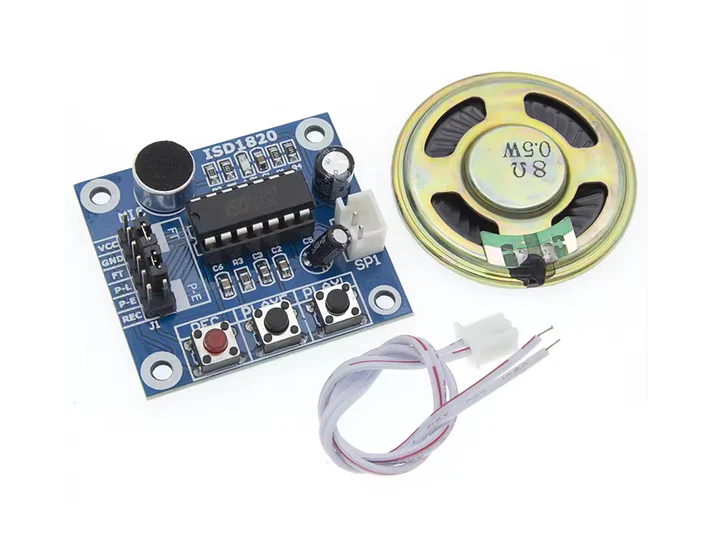
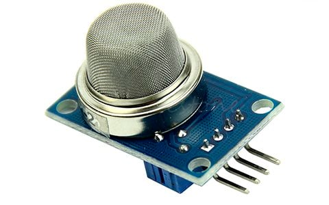
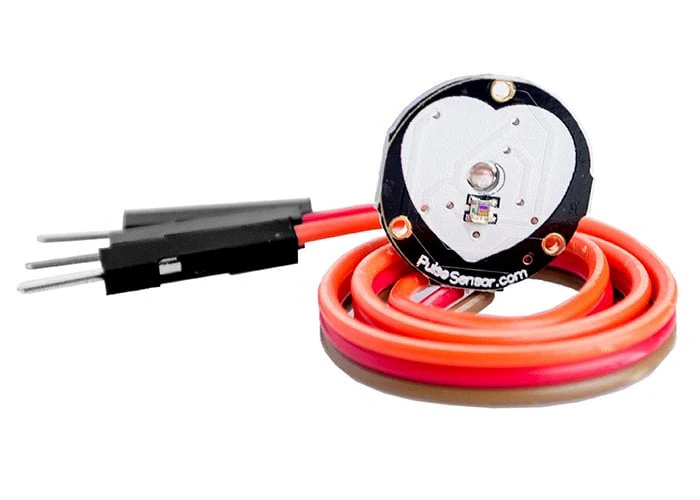
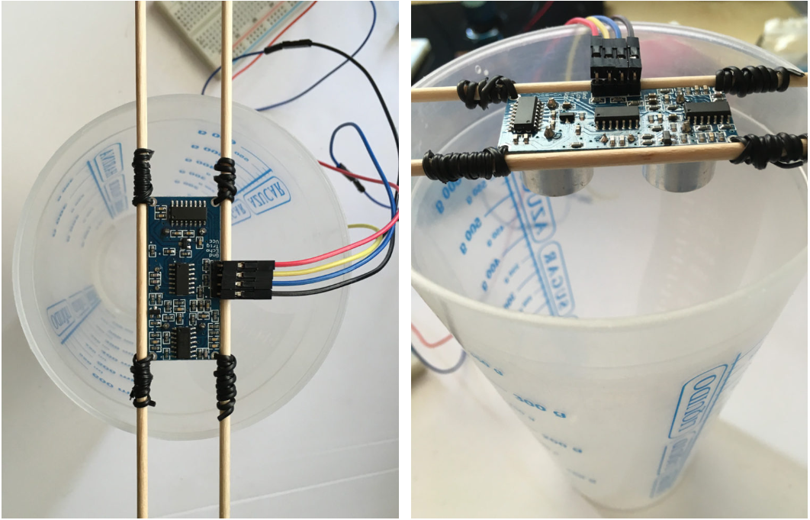

# sesion-06a / Clase 10 / 09.09.2025

## Bloque de la mañana 

Ponerme al día con Taller 

## Inicio de clase 

### Programación Softwares

[Scratchhttps](//scratch.mit.edu/): Permite el aprendizaje de programacion de una manera y grafica más facil sin necesidad de tener conocimientos profundos sobre codigos.

[Pure datahttps](//puredata.info/): Software para programar audio, lenguaje de programación visual desarrollado por Miller Puckette

[LaTeX](LaTeX): Segun Wikipedia es un sistema de composición de textos orientado a la creación de documentos escritos que presenten una alta calidad tipográfica. Por sus características y posibilidades, se usa de forma especialmente intensa en la generación de artículos y libros científicos que incluyen, entre otros elementos, expresiones matemáticas.


### Miller Puckette 
- (Matemático y programador estadounidense).
- Es el autor de los lenguajes de programación Max/MSP y Pure Data (Pd), ampliamente utilizados para crear música y obras multimedia interactivas.
- Desde 1994, ha sido profesor de música en la Universidad de California, San Diego (UCSD).
- Cultura computacional 


Las contribuciones de Miller Puckette han tenido un impacto duradero en el campo de la música electrónica y el arte multimedia. Sus entornos de programación han democratizado el acceso a herramientas sofisticadas de creación musical, permitiendo a una amplia gama de artistas y entusiastas explorar las posibilidades del sonido y la interacción.

## Investigación de sensores 

### Reproducción de audio ISD1820

- Dispositivo de grabación/reproducción de multiples mensajes.
- Grabador de voz en un solo chip. 
- Duración de grabación (Lab Interacción) 20 segundos.
- Voltaje de Operación: 3.3V DC. No es compatible con 5V.
  
### Partes del reproductor 

N° | Nombre                 | Función                              |
---|--------------          |--------------                        |
1  | VCC                    | Fuente de alimentación de 3,3 V      |
2  | GND                    | Conexión a tierra de la alimentación |
3  | REC                    | Entrada REC es una señal de grabación activa en ALTO    |
4  | PLAYE                  | Reproducción: activada por borde                        |
5  | PLAYL                  | Reproducción: nivel activado, cuando pasa de BAJO a ALTO, se inicia un ciclo de reproducción                  |
6  | SALIDAS DE ALTAVOZ     | Los pines SP+ y SP- proporcionan accionamiento directo para altavoces con impedancias tan bajas como 8 Ω.     |
7  | MIC                    | Entrada de microfono, transfiere sus señales al preamplificador en el chip.                                   |
8  | FT                     | Al conectar el mini puente, este modo permite que el micrófono controle el altavoz directamente.              |
9  | P-E                    | Conectando el mini jumper, reproduce los discos sin parar.                                                    |



### Sensor de Gas MQ2

- Módulo de alta sensibilidad y respuesta rápida para detectar gases combustibles y humo.
- Ideal para monitoreo de fugas y seguridad doméstica/industrial
- Voltaje de operación: 5 V
- Gases detectables: butano, propano, metano, alcohol, hidrógeno, humo (entre otros)
- Alarmas de humo y sistemas de seguridad

### Partes del sensor 01
  
N° | Nombre                 | Función                              |
---|--------------          |--------------                        |
1  | VCC                    | Fuente de alimentación de 5 V        |
2  | GND                    | Conexión a tierra de la alimentación |
3  | D0                     | Output                               |
4  | A0                     | Output                               |




### Sensor Pulso Cardiaco Corazón

- Monitorear tu pulso cardíaco es ahora más sencillo con la ayuda del sensor de pulso fotoeléctrico.
- Voltaje de Operación: 3.0V – 5.5V DC
- Cables: GND, VCC, Señal
- El dispositivo funciona del siguiente modo: un led de color verde emite luz que al entrar en contacto con nuestro dedo indice o el lóbulo del oído refleja cierta cantidad de luz, el flujo de sangre hace que la cantidad de luz reflejada cambie de acuerdo al pulso cardíaco. La luz reflejada es detectada por el sensor de luz APDS-9008, que convierte el flujo de luz en un voltaje analógico. Esta señal analógica es luego filtrada y amplificada en un opamp para luego entregar la señal analógica de salida del dispositivo.

### Partes del sensor 02
  
N° | Nombre                 | Función                              |
---|--------------          |--------------                        |
1  | VCC                    | Fuente de alimentación de 5 V        |
2  | GND                    | Conexión a tierra de la alimentación |
3  | A0                     | Señal                                |



## Encargo 11

investigar sensores vistos en clases, cotizarlos, encontrar referentes que los usen, y describir 3 pequeñas ideas que podamos aplicar a su proyecto-02 de máquinas de saludar.

### Proyecto realizado con Ultrasonico 

Sensor de nivel de agua con Arduino

Con el sensor de ultrasonidos se mide cuanta distancia hay hasta el líquido. Se debe conocer el recipiente para saber cuanta cantidad cabe y que medida se obtiene cuando está lleno. Lo mismo cuando el recipiente esté vacío. Esto se llama calibración.

La pantalla LCD mostrará el porcentaje de líquido que queda en el recipiente y su equivalente en litros.

Componentes:

- Arduino UNO
- Sensor ultrasonico
- Pantalla LCD 16×2
- Protoboard
- Potenciómetro 10kΩ
- Resistencia 220Ω
- Cables

#### Pantalla LCD 16×2

Pantalla de 16 columnas y 2 filas. Esto nos va a permitir escribir un total de 32 caracteres a la vez.

Código de ejemplo

``` cpp
// Incluímos la libreria externa para poder utilizarla
#include <LiquidCrystal.h> // Entre los símbolos <> buscará en la carpeta de librerías configurada
 
// Lo primero is inicializar la librería indicando los pins de la interfaz
LiquidCrystal lcd(12, 11, 5, 4, 3, 2);
 
// Definimos las constantes
#define COLS 16 // Columnas del LCD
#define ROWS 2 // Filas del LCD
 
void setup() {
  // Configuramos las filas y las columnas del LCD en este caso 16 columnas y 2 filas
  lcd.begin(COLS, ROWS);
}
 
void loop() {
 
  lcd.setCursor(0,0);
  lcd.print("Hola Mundo!!!!!!");
  lcd.setCursor(0,1);
  lcd.print("Probando el LCD.");
}
```


Link de página del proyecto: [Programar fácil](https://programarfacil.com/blog/arduino-blog/sensor-de-nivel-de-agua-con-arduino/)
