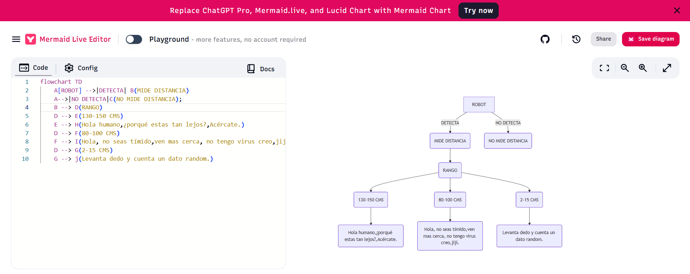

# sesion-07b / Clase 13 / 26.09.2025

## Inicio de clase
[Mermaid.js](https://mermaid.js.org/) : Es una biblioteca de JavaScript que utiliza una sintaxis basada en texto, similar a Markdown, para generar y renderizar automáticamente diagramas y visualizaciones en el navegador

## Encargo 
- cada persona del grupo debe implementar en diagrama de flujo dibujado o con la herramienta Mermaid.js con sus propias palabras y subirlo a su README.
- cada persona del grupo debe subir a su README: documentar funcionamiento de sus sensores, incluyendo instrucciones de conexión y de configuración, subir el proyecto entero de arduino como carpeta, tiene que poder compilar sin problema y mostrar en consola los datos de los sensores.

