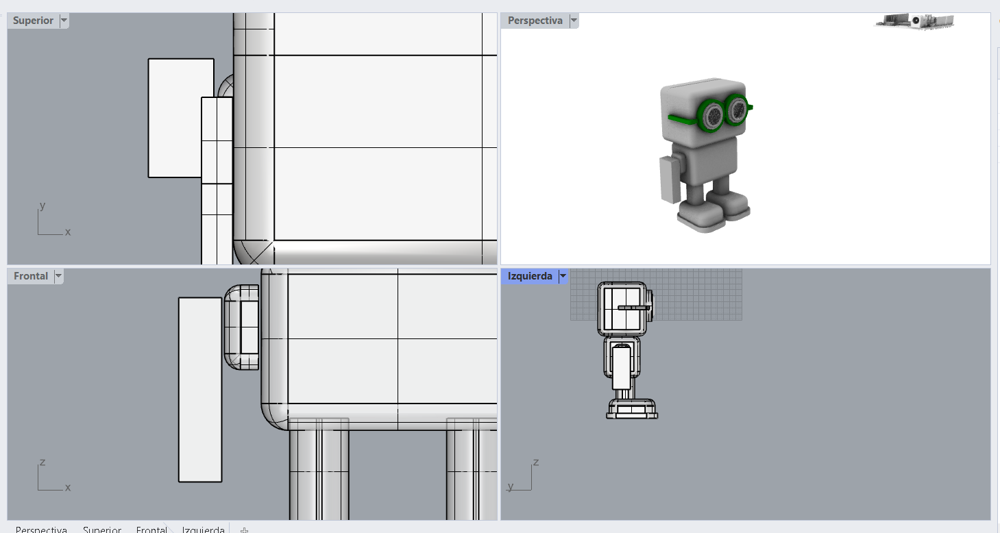
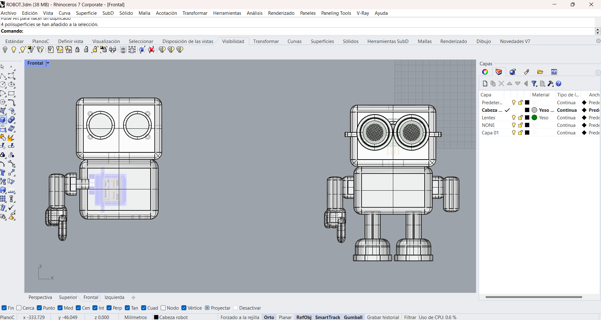
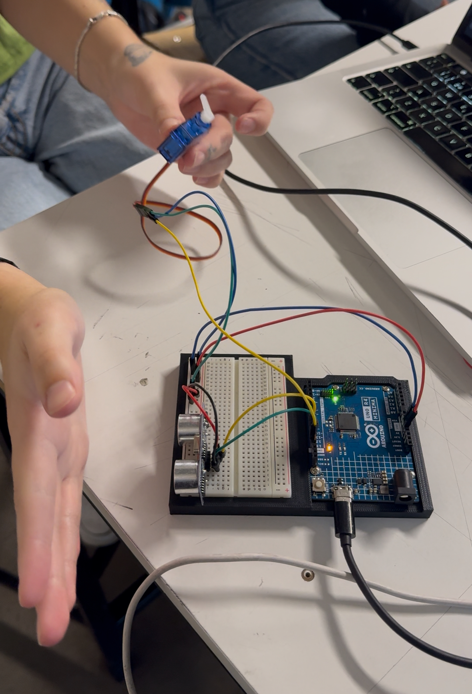

# sesion-08a / Clase 00 / 30.09.2025

Aarón mostró un sintetizador de [chompi](https://chompiclub.com/?srsltid=AfmBOoo2Sy8_3jn8NwnIu6cwiAqlvccJxFe7TZNzB6MteQ_q5BrRmyWa)

## Inicio de clase

Nos juntamos con nuestro grupo para poder trabajar en el proyecto

Se juntó el código del servomotor y el sensor de proximidad y funciona

El módulo reproductor no funciona (no reconoce la tarjeta SD)

### Posibles errores del Módulo reproductor DFPlayer Mini

- Formatear la tarjeta micro SD (FAT32).
- Archivos MP3 están en la raíz de la tarjeta.
- velocidad de comunicación (9600 baudios).
- Intercambiar RX y TX.
- Los archivos deben estar guardados como los tengo en el código.

### Datos curiosos para subir al código

- ¿Sabías que un disco duro de 5 MB pesaba una tonelada en 1956? ¡Se te cae de la mano!
- Según un físico, todos los electrones de internet pesan como una fresa. ¡Eso es un dato ligero!
- El primer ratón era de madera. ¡Tu ratón es más moderno!
- El primer "bug" fue una polilla real en una computadora en 1947. ¡Un error muy natural!

#### Diálogo listo 
+ Los diálogos serán:
 + **1.** "hola1.mp3" de 80-10cm, para llamar a la persona: "Hola humano ¿Por qué estás tan lejos? Acércate."
 + **2.** "hola2.mp3" de 40-60cm, para hacer que la persona se acerque más: "Hola! No seas timido, ven más cerca, no tengo virus... creo jiji"
 + **3.** "dato1, 2, 3, 4,5 y 6.mp3" de 2-10cm:
   + **dato1:** "¿Sabías qué? El primer mause era de madera... Seguro también servía de leña jajaj"
   + **dato2:** "¿Sabías qué? El error 404 es mi manera de hacerme el leso... jajaja"
   + **dato3:** "¿Sabías qué? La nube no existe, son computadores de otro... pero no se lo digas a nadie"
   + **dato4:** "¿Sabías qué? Los datos nunca se borran, solo se esconden... igual que tus calcetines"
   + **dato5:** "¿Sabías qué? Apagar y prender arregla todo, y sino, un golpecito y como nuevo"
   + **dato6:** "¿Sabías qué? El porcentaje exacto de 99,999999999999... Nah, inventé jajaja pero aún sigues aquí ¿no?"
   
Información sacada readme de [@vaniaparedes](https://github.com/mmillar95/dis8645-2025-02-procesos/edit/main/21-vaniaparedes/sesion-08a/README.md)

### Páginas

Estas páginas nos ayudarán a realizar nuestro proyecto.

- [3D hunyuan](https://3d.hunyuan.tencent.com/): Esta página la encontré por recomendación en un video de TikTok, es muy buena, ya que te genera el modelado 3D de cualquier imagen que subas, tiene buenos detalles y texturas.
- [Loquendo](https://loquendo.io/): Página de texto a audio recomendada por Mateo.
- [My instants](https://www.myinstants.com/es/search/?name=hola): Página que tiene botones con audio ya grabado (audios virales).
- [Artlist](https://artlist.io/voice-over): Es una página que mediante inteligencia artificial pasa de texto a audio, se le puede poner efecto, velocidad y distorsión.

## Carcasa Robot

### Prototipo 01
- Se empezó a trabajar con el sensor ultrasónico, ya que este es el centro de nuestro proyecto y los ojos de nuestro robot. Se trabajó en Rhino y se descargó el sensor de la página [GrabaCad](https://grabcad.com/library/tag/hc-sr04) que tiene buenos modelos 3D de componentes electrónicos y gratis.
- [Ultrasónico](https://grabcad.com/library/hc-sr04-ultrasonic-sensor-15)
- [Arduino R4](https://grabcad.com/library/arduino-uno-r4-wifi-1)
- [Servomotor](https://grabcad.com/library/sg90-micro-servo-9g-tower-pro-1)

Luego se siguió por la cabeza del robot impresa en 3D, viendo si calza con los componentes.





Para la presentación física del proyecto como equipo pensamos en realizar un robot el que contara el dato random. Debido a la cantidad de componentes, lo más adecuado para poder llevarlo a cabo sería realizar el robot sobre una caja que tendrá el Arduino por temas de tamaño y estabilidad.

## Códigos

- Primero definimos qué es lo que queremos que realice el sensor ultrasónico con sus medidas correspondientes.

```cpp

void configurarSensorUltrasonico() {
  // conectar la patita

  // definir la distancia minima de 2 a 10 cm
  // definir distancia media de 45 a 60 cm
  // definir la distancia maxima de 80 a 100 cm

  // Tiempo de reposo cuando no siente presencia 

}

```
- Luego realizaron el código del sevomotor


```cpp
#include <Servo.h>

Servo dedo;// Crear objeto servo
const int SERVO_PIN = 13;

// Configurar servo motor
void configurarServo() {
  dedo.attach(SERVO_PIN);
  dedo.write(0); // posición inicial 0 grados
}

// Levantar dedo
void levantarDedo() {
  dedo.write(180); //180 grados
}

// Bajar dedo
void bajarDedo() {
  dedo.write(0); //0 grados
}

```




## Encargo 16
Cada persona del grupo debe subir a su README: qué llevan hasta el final de esta sesión, qué sí funciona, qué funciona casi, qué no funciona. después subir nueva versión del código y de la documentación, del trabajo que hagan entre 8a y 9a.
