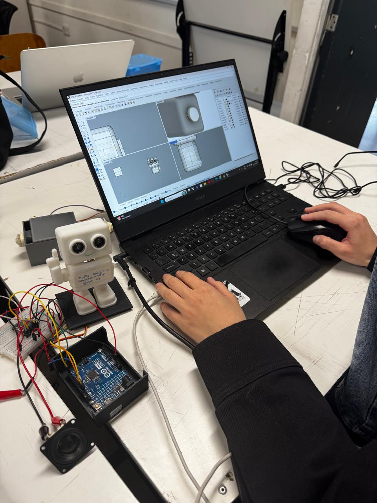
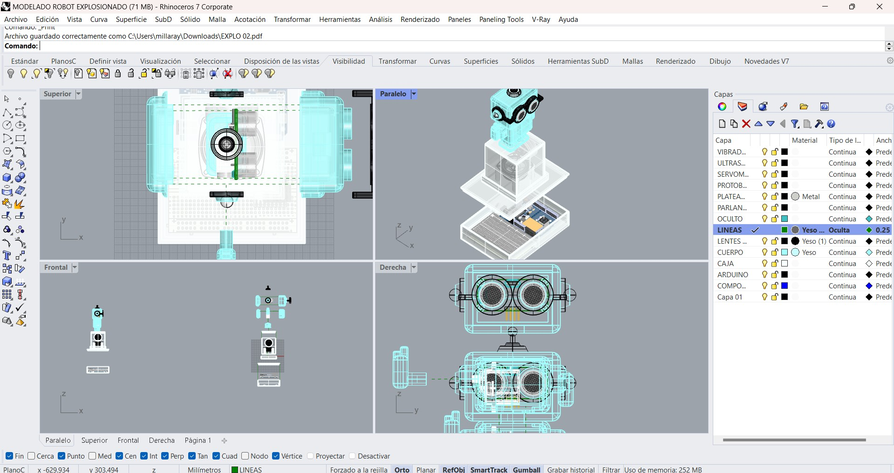
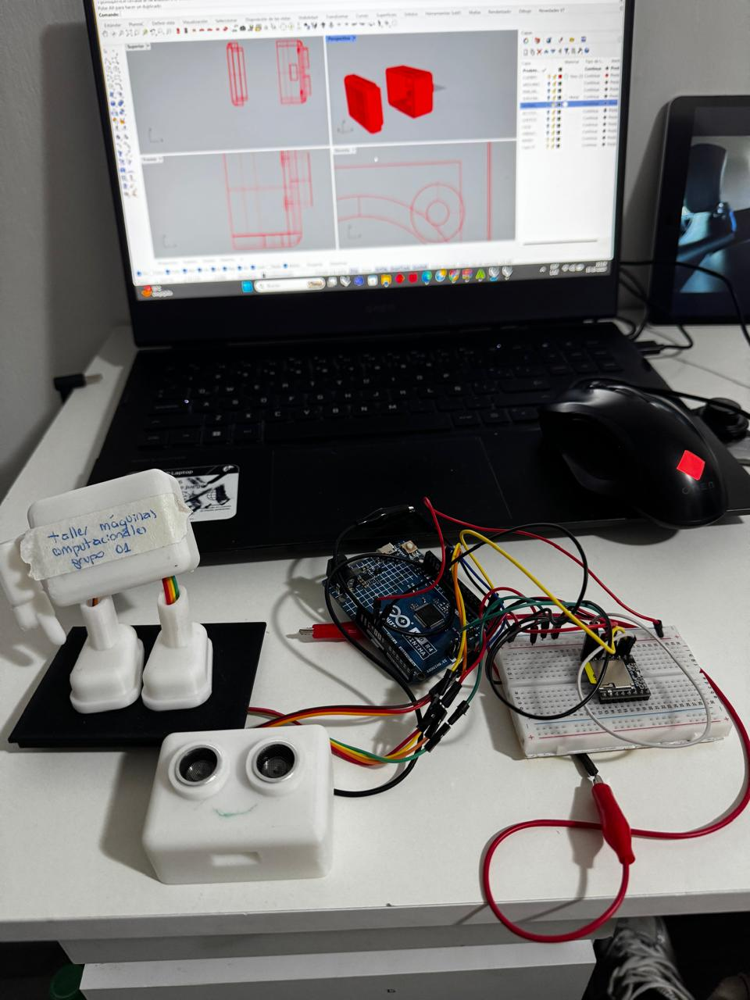
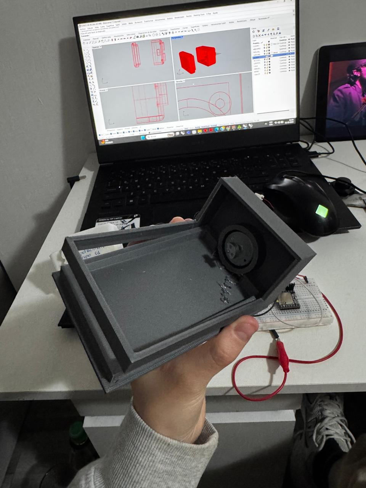

# sesion-09b / 10.10.2025

## Inicio de clases

Nos juntamos con nuestro grupo y comenzamos a seguir desarrollando el proyecto 02

- Rediseñar el modelado 3D de nuestro robot llamado Andy.

- Rhino es el programa de modelado 3D que estamos utilizando para desarrollar el proyecto 02. 

- Ajustes de tamaño y tolerancia para la impresión 3D. 

- Prototipo de la carcasa que almacenará el Arduino y la Protoboard. 

Referentes que nos dio Aarón en relación con la carcasa de nuestro proyecto y cómo utilizamos el sensor, no esconderlo, de manera que se vea en el resultado final.

[FloatingForestPedals](https://www.floatingforestpedals.com/shop/drifter)

[Thingamagoop](https://bleeplabs.com/original_thingamagoop/)

