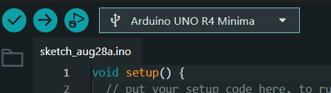

# sesion-01b

-8-08-2025

## vamos a ocupar Arduino IDE

Instalar arduino IDE

para poder escribir codigos en lenguaje C++

[Arduino](https://www.arduino.cc/en/software)

- ( ) : Parentesis.
- [  ] : Corchete.
- { } : Murciélago.
- // :Viene un comentario.
- || : OR
- */ :Abrir comentario.
- */ : Cerrar un comentario.
- ; : La línea terminó.
- = : Dentro de la izquierda vive el valor de la derecha. Asignar valor.
- == : Se compara. Condición.
- HIGH: Lo que está en 1
- LOW: Lo que está en 0
- delay: Significa que el arduino manda la señal y se queda ahí por un segunso, se vita que se queme. Le dice al arduino congelado.
- Void: Indica que se espera que la función no devuelva información a la función desde la que fue llamada.
- int: Son variables.
- foat: Para decimales.
- Char: Sólo una letra o un caracter.
- String: Colección de carácteres.
- bool: si//no
- AND: Debe cumplir todas.
- OR: Debe cumplir alguna.
- command t: Se ordena en el arduino.
- Serial.println: Imprime en otra línea.
- Serial.print: Imprime en la misma línea.
- for: Iteración - repite un bloque de instrucciones un número concreto de veces, dependiendo de la condición indicada.
- if: Sirven para que tu programa haga una cosa u otra dependiendo de cada situación.
- else: si-no Siempre va unido a una sentencia condicional if de Arduino, nunca puede ir sólo. Por lo tanto if else se traduciría como si se cumple la
 condición ejecuta el código, si no ejecuta este otro código.
- Serial.being(): Es una función y lo que esta en el paréntesis es el valos que se le asigna.

[Arduino Documentation](https://docs.arduino.cc)

Importante

- ✔ :Para verificar código.Para enviar código.
- -> :Para enviar código.
- Siempre verificar el puerto que sea Arduino UNO R4 Minima.



### código vistos en clases

-Examples/basics/Blink/

```cpp
void setup() {
  // initialize digital pin LED_BUILTIN as an output.
  pinMode(LED_BUILTIN, OUTPUT);
}

// the loop function runs over and over again forever
void loop() {
  digitalWrite(LED_BUILTIN, HIGH);  // turn the LED on (HIGH is the voltage level)
  delay(1000);                      // wait for a second
  digitalWrite(LED_BUILTIN, LOW);   // turn the LED off by making the voltage LOW
  delay(1000);                      // wait for a second
}
```

```cpp
/*
  Blink

  Turns an LED on for one second, then off for one second, repeatedly.

  https://docs.arduino.cc/built-in-examples/basics/Blink/
*/

int onTime;
int offTime;

// the setup function runs once when you press reset or power the board
void setup() {
  // initialize digital pin LED_BUILTIN as an output.
  pinMode(LED_BUILTIN, OUTPUT);
  // pinMode(n°, INPUT);

  onTime = 200;
  offTime = 3000;
}

// the loop function runs over and over again forever
void loop() {
  digitalWrite(LED_BUILTIN, HIGH);  // turn the LED on (HIGH is the voltage level)
  delay(onTime);                      // wait for a second
  digitalWrite(LED_BUILTIN, LOW);   // turn the LED off by making the voltage LOW
  delay(offTime);      
  
  confeti();                // wait for a second
}

void confeti(){
  Serial.print('wujuuu!');
}
```
