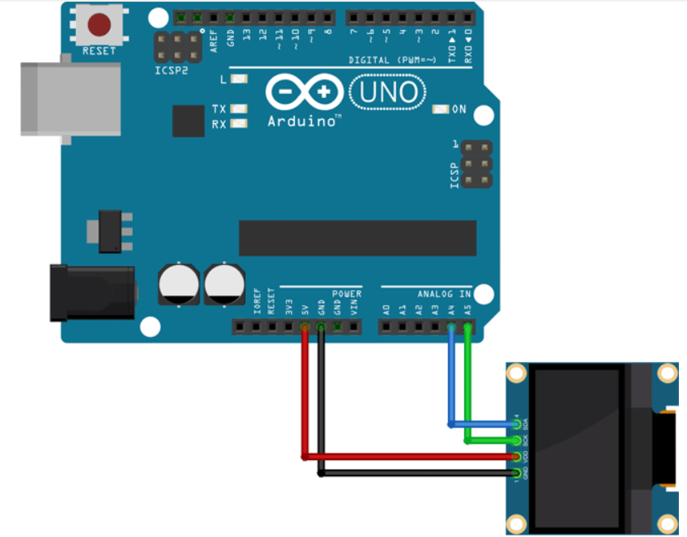
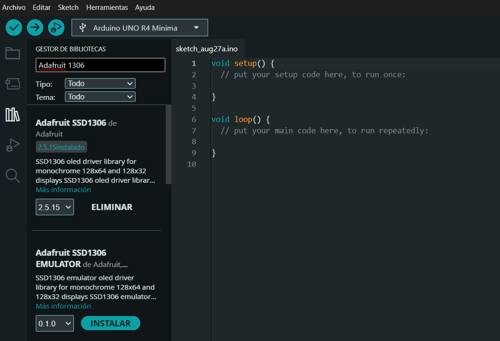

# Sesión 03B  

22-08-2025  

Clases por **Zoom**, ya que nos cancelaron las clases presenciales.  

---

## Apuntes  

Usamos [Wokwi](https://wokwi.com) ya que no pudimos utilizar las pantallas que íbamos a trabajar en clases presenciales.  

### Conexión de la pantalla OLED SSD1306 al Arduino UNO  
Esta pantalla utiliza el protocolo **I2C**, el cual funciona solo con 4 cables:  



- **GND** = Tierra  
- **VCC** = 5V  
- **SCL** = Reloj (Clock)  
- **SDA** = Datos (Data)  

La pantalla tiene una resolución de **128x64 píxeles**.  

### Librerías necesarias  

Buscamos la librería de **Adafruit** para poder hacer funcionar nuestra pantalla:  

- [Adafruit_SSD1306](https://github.com/adafruit/Adafruit_SSD1306)  
- [Adafruit-GFX](https://github.com/adafruit/Adafruit-GFX)  

  

En Arduino IDE también hay que instalar las librerías:  

  

---

## Ejemplos de la clase  

### Ejemplo 1  

Un **contador digital** en la pantalla OLED:  
- Muestra un mensaje fijo en la parte superior.  
- Muestra un número grande en la parte inferior que va aumentando cada segundo.  

```cpp
#include <Wire.h>
#include <Adafruit_GFX.h>
#include <Adafruit_SSD1306.h>

#define SCREEN_WIDTH 128
#define SCREEN_HEIGHT 64
#define OLED_RESET -1
// Le cambiamos el nombre de "display" a "pantalita"
Adafruit_SSD1306 pantallita(SCREEN_WIDTH, SCREEN_HEIGHT, &Wire, OLED_RESET);

int contador = 0;

void setup() {
  if(!pantallita.begin(SSD1306_SWITCHCAPVCC, 0x3C)) {
    Serial.println(F("No se encontró la pantalla SSD1306"));
    for(;;);
  }
  pantallita.clearDisplay();
  pantallita.setTextColor(SSD1306_WHITE);
}

void loop() {
  pantallita.clearDisplay(); // Limpiamos toda la pantalla
  
  // SE LE PUEDE CAMBIAR EL TAMAÑO
  pantallita.setTextSize(1); // Tamaño de texto más grande
  String mensaje = "Contador muy grande, Misa recomienda javiera contador";
  int16_t x1, y1;
  uint16_t w, h;
  
  // Medimos el ancho del texto para centrarlo horizontalmente
  // contador, con esas letras, ese tamaño ¿Cuánto mides?
  // es importante que se haga manual
  pantallita.getTextBounds(mensaje, 0, 0, &x1, &y1, &w, &h);
  pantallita.setCursor((SCREEN_WIDTH - w)/2, 0);
  pantallita.println(mensaje);

  // Mostramos el número centrado
  // TOMA EL VALOR 0 NUMÉRICO, PERO DÁMELO EN VERSIÓN TEXTO
  String numero = String(contador);
  // CUÁNTO MIDE LA PANTALLA
  pantallita.getTextBounds(numero, 0, 0, &x1, &y1, &w, &h);
  pantallita.setCursor((SCREEN_WIDTH - w)/2, 30); // 30 píxeles hacia abajo
  pantallita.println(numero);

  // EN QUÉ MOMENTO SE DIBUJA
  // UNO LE DICE TODO LO QUE TIENE QUE HACER
  // Y LO HARÁ CUANDO APAREZCA "pantallita.display();"
  pantallita.display(); // Actualiza la pantalla
  // A LO QEU VALE CONTADOR, AGRÉGALE 1
  contador++;
  // CON UN TIEMPO DE UN SEGUNDO
  delay(1000);
}

```

### Ejemplo 2

Usamos **javl.github.io** que es una pagina que tranforma imajenes en pixeles 

<https://javl.github.io/image2cpp>

```cpp
#include <Wire.h>
#include <Adafruit_GFX.h>
#include <Adafruit_SSD1306.h>

#define SCREEN_WIDTH 128
#define SCREEN_HEIGHT 64
#define OLED_RESET -1
Adafruit_SSD1306 pantallita(SCREEN_WIDTH, SCREEN_HEIGHT, &Wire, OLED_RESET);

int contador = 0;

const unsigned  char rafita [] PROGMEM = {

// 'rafita_2025', 128x64px
0xff, 0xff, 0xff, 0xff, 0xff, 0x81, 0xff, 0xff, 0xff, 0xff, 0xff, 0xff, 0xff, 0xff, 0xff, 0xff, 
0xff, 0xff, 0xff, 0xff, 0xf8, 0x00, 0x3f, 0xff, 0xff, 0xff, 0xff, 0xff, 0xff, 0xff, 0xff, 0xff, 
0xff, 0xff, 0xff, 0xff, 0xe0, 0x00, 0x07, 0xff, 0xff, 0xff, 0xff, 0xff, 0xff, 0xff, 0xff, 0xff, 
0xff, 0xff, 0xff, 0xff, 0x80, 0xff, 0x01, 0xff, 0xff, 0xff, 0xff, 0xff, 0xff, 0xff, 0xff, 0xff, 
0xff, 0xff, 0xff, 0xff, 0x07, 0xff, 0xe0, 0xff, 0xff, 0xff, 0xff, 0xff, 0xff, 0xff, 0xff, 0xff, 
0xff, 0xff, 0xff, 0xfe, 0x1f, 0xff, 0xf8, 0x3f, 0xff, 0xff, 0xff, 0xff, 0xf9, 0xff, 0xff, 0xff, 
0xff, 0xff, 0xff, 0xfc, 0x3f, 0xff, 0xfe, 0x0f, 0xff, 0xff, 0xff, 0xff, 0xe0, 0x7f, 0xff, 0xff, 
0xff, 0xff, 0xff, 0xf8, 0x7f, 0xff, 0xff, 0x07, 0xff, 0xff, 0xff, 0xff, 0xc0, 0x7f, 0xff, 0xff, 
0xff, 0xff, 0xff, 0xc0, 0xff, 0xff, 0xff, 0xc3, 0xff, 0xff, 0xff, 0xff, 0xc6, 0x3f, 0xff, 0xff, 
0xff, 0xff, 0xff, 0x80, 0xff, 0xff, 0xff, 0xf1, 0xff, 0xff, 0xff, 0xff, 0xc6, 0x3f, 0xff, 0xff, 
0xff, 0xff, 0xff, 0x0d, 0xff, 0xff, 0xff, 0xf8, 0xff, 0xff, 0xff, 0xff, 0xcf, 0x1f, 0xff, 0xff, 
0xff, 0xff, 0xfe, 0x1d, 0xff, 0xff, 0xff, 0xf8, 0x7f, 0xff, 0xff, 0xff, 0x8f, 0x1f, 0xff, 0xff, 
0xff, 0xff, 0xfc, 0x7b, 0xff, 0xff, 0xf7, 0xfc, 0x7f, 0xff, 0xff, 0xff, 0x8f, 0x1f, 0xff, 0xff, 
0xff, 0xff, 0xfc, 0x7b, 0xff, 0xff, 0xf7, 0xfe, 0x3f, 0xfe, 0x00, 0x1f, 0x0f, 0x3f, 0xff, 0xff, 
0xff, 0xff, 0xfc, 0xfb, 0xff, 0xff, 0xf7, 0xfe, 0x3f, 0xe0, 0x00, 0x03, 0x1e, 0x3f, 0xff, 0xff, 
0xff, 0xff, 0xf8, 0xfb, 0xff, 0xff, 0xf7, 0xfe, 0x3e, 0x00, 0x00, 0x00, 0x1e, 0x3f, 0xff, 0xff, 
0xff, 0xff, 0xf8, 0xfb, 0x3f, 0xff, 0xf7, 0xff, 0x00, 0x03, 0xff, 0xf0, 0x3c, 0x7f, 0xff, 0xff, 
0xff, 0xff, 0xf9, 0xfb, 0x3f, 0xff, 0xf7, 0xff, 0x00, 0x1f, 0xff, 0xfc, 0x7c, 0x7f, 0xff, 0xff, 
0xff, 0xff, 0xf1, 0xfb, 0xff, 0xf3, 0xf7, 0xff, 0x01, 0xff, 0xff, 0xfe, 0x78, 0xff, 0xff, 0xff, 
0xff, 0xff, 0xf1, 0xfb, 0xff, 0xf3, 0xf3, 0xff, 0x7f, 0xff, 0xff, 0xff, 0xb0, 0xff, 0xff, 0xff, 
0xff, 0xff, 0xf1, 0xfb, 0xff, 0xff, 0xfb, 0xff, 0x7f, 0xff, 0xff, 0xff, 0xc1, 0xff, 0xff, 0xff, 
0xff, 0xff, 0xf1, 0xff, 0xc3, 0xff, 0xfb, 0xff, 0x7f, 0xff, 0xff, 0xff, 0xe3, 0xff, 0xff, 0xff, 
0xff, 0xff, 0xf9, 0xf7, 0xc3, 0xff, 0xfd, 0xff, 0x7f, 0xff, 0xff, 0xff, 0xf1, 0xff, 0xff, 0xff, 
0xff, 0xff, 0xf8, 0xf7, 0xe7, 0xff, 0xfd, 0xfe, 0xff, 0xff, 0xff, 0xff, 0xf1, 0xff, 0xff, 0xff, 
0xff, 0xff, 0xfc, 0x07, 0xff, 0xff, 0xfe, 0x79, 0xff, 0xff, 0xff, 0xff, 0xf8, 0xff, 0xff, 0xff, 
0xff, 0xff, 0xfc, 0x07, 0xff, 0xff, 0xff, 0x03, 0xff, 0xff, 0xff, 0xff, 0xf8, 0xff, 0xff, 0xff, 
0xff, 0xff, 0xff, 0x87, 0xbf, 0xff, 0xff, 0xff, 0xff, 0xff, 0xff, 0xff, 0xf8, 0xff, 0xff, 0xff, 
0xff, 0xff, 0xff, 0xe3, 0xc0, 0x7f, 0xff, 0xff, 0xff, 0xff, 0xff, 0xff, 0xfc, 0xff, 0xff, 0xff, 
0xff, 0xff, 0xff, 0xe1, 0xff, 0xff, 0xff, 0xff, 0xff, 0xff, 0xff, 0xff, 0xfc, 0xff, 0xff, 0xff, 
0xff, 0xff, 0xff, 0xf1, 0xff, 0xff, 0xff, 0xff, 0xff, 0xff, 0xff, 0xff, 0xfc, 0xff, 0xff, 0xff, 
0xff, 0xff, 0xff, 0xf8, 0xff, 0xff, 0xff, 0xff, 0xff, 0xff, 0xff, 0xff, 0xfc, 0xff, 0xff, 0xff, 
0xff, 0xff, 0xff, 0xf8, 0x3f, 0xff, 0xff, 0xff, 0xff, 0xff, 0xff, 0xff, 0xfc, 0xff, 0xff, 0xff, 
0xff, 0xff, 0xff, 0xfc, 0x03, 0xff, 0xff, 0xff, 0xff, 0xff, 0xff, 0xff, 0xf8, 0xff, 0xff, 0xff, 
0xff, 0xff, 0xff, 0xff, 0x00, 0x1f, 0xff, 0xff, 0xff, 0xff, 0xff, 0xff, 0xf8, 0xff, 0xff, 0xff, 
0xff, 0xff, 0xff, 0xff, 0xe0, 0x3f, 0xff, 0xff, 0xff, 0xff, 0xff, 0xff, 0xf8, 0xff, 0xff, 0xff, 
0xff, 0xff, 0xff, 0xff, 0xfe, 0x3f, 0xff, 0xff, 0xff, 0xff, 0xff, 0xff, 0xf9, 0xff, 0xff, 0xff, 
0xff, 0xff, 0xff, 0xff, 0xff, 0x1f, 0xff, 0xff, 0xff, 0xff, 0xff, 0xff, 0xf1, 0xff, 0xff, 0xff, 
0xff, 0xff, 0xff, 0xff, 0xff, 0x1f, 0xff, 0xff, 0xff, 0xff, 0xff, 0xff, 0xf0, 0xff, 0xff, 0xff, 
0xff, 0xff, 0xff, 0xff, 0xfe, 0x1f, 0xff, 0xff, 0xff, 0xff, 0xff, 0xff, 0xf8, 0xff, 0xff, 0xff, 
0xff, 0xff, 0xff, 0xff, 0xfc, 0x1f, 0xff, 0xff, 0xff, 0xff, 0xff, 0xff, 0xfc, 0x7f, 0xff, 0xff, 
0xff, 0xff, 0xff, 0xff, 0xf8, 0x6f, 0xff, 0xff, 0xff, 0xff, 0xff, 0xbf, 0xfc, 0x7f, 0xff, 0xff, 
0xff, 0xff, 0xff, 0xff, 0xe0, 0xf7, 0xff, 0xff, 0xff, 0xff, 0xff, 0xbf, 0xfe, 0x3f, 0xff, 0xff, 
0xff, 0xff, 0xff, 0xff, 0x81, 0xf3, 0xff, 0xff, 0xff, 0xff, 0xff, 0xbf, 0xff, 0x1f, 0xff, 0xff, 
0xff, 0xff, 0xff, 0xff, 0x03, 0xf9, 0xff, 0xff, 0xff, 0xff, 0xff, 0xbf, 0xff, 0x1f, 0xff, 0xff, 
0xff, 0xff, 0xff, 0xfe, 0x3f, 0xfc, 0xff, 0xff, 0xff, 0xff, 0xff, 0xdf, 0xff, 0x9f, 0xff, 0xff, 
0xff, 0xff, 0xff, 0xfe, 0x3f, 0xfe, 0x7f, 0xff, 0xff, 0xff, 0xff, 0xdf, 0xff, 0x8f, 0xff, 0xff, 
0xff, 0xff, 0xff, 0xfe, 0x77, 0xff, 0x1f, 0xff, 0x7f, 0xff, 0xff, 0x8f, 0xff, 0x8f, 0xff, 0xff, 
0xff, 0xff, 0xff, 0xfe, 0x2f, 0xff, 0x0f, 0xfe, 0x7f, 0xff, 0xfe, 0x77, 0xff, 0x8f, 0xff, 0xff, 
0xff, 0xff, 0xff, 0xfe, 0x1c, 0xfe, 0x07, 0xfe, 0xff, 0xff, 0xf1, 0xf3, 0xff, 0x8f, 0xff, 0xff, 
0xff, 0xff, 0xff, 0xfe, 0x19, 0xfc, 0x0f, 0xfe, 0xff, 0xf0, 0x0f, 0xf8, 0xff, 0xcf, 0xff, 0xff, 
0xff, 0xff, 0xff, 0xff, 0x0b, 0xf8, 0x0f, 0xfe, 0x00, 0x00, 0x0f, 0xf8, 0xff, 0x8f, 0xff, 0xff, 
0xff, 0xff, 0xff, 0xff, 0x83, 0xf0, 0x1f, 0xfc, 0x00, 0x00, 0x0f, 0xf8, 0xdb, 0x8f, 0xff, 0xff, 
0xff, 0xff, 0xff, 0xff, 0xc0, 0x00, 0x1f, 0xfc, 0x00, 0x7f, 0xc7, 0xf8, 0xdb, 0x8f, 0xff, 0xff, 
0xff, 0xff, 0xff, 0xff, 0xe0, 0x00, 0x3f, 0xfc, 0x7f, 0xff, 0xc7, 0xf8, 0x5b, 0x8f, 0xff, 0xff, 
0xff, 0xff, 0xff, 0xff, 0xf8, 0x08, 0x7f, 0xf8, 0xff, 0xff, 0xc7, 0xfc, 0x4d, 0x1f, 0xff, 0xff, 
0xff, 0xff, 0xff, 0xff, 0xff, 0xf8, 0xef, 0xf8, 0xff, 0xff, 0x8f, 0xfc, 0x08, 0x3f, 0xff, 0xff, 
0xff, 0xff, 0xff, 0xff, 0xff, 0xf8, 0xdf, 0xf1, 0xff, 0xff, 0x8d, 0xb8, 0x00, 0x7f, 0xff, 0xff, 
0xff, 0xff, 0xff, 0xff, 0xff, 0xf8, 0xb9, 0xf1, 0xff, 0xff, 0x8d, 0xb8, 0x00, 0xff, 0xff, 0xff, 
0xff, 0xff, 0xff, 0xff, 0xff, 0xf8, 0x37, 0xe3, 0xff, 0xff, 0xcd, 0xb0, 0xff, 0xff, 0xff, 0xff, 
0xff, 0xff, 0xff, 0xff, 0xff, 0xfc, 0x37, 0xc7, 0xff, 0xff, 0xc5, 0x81, 0xff, 0xff, 0xff, 0xff, 
0xff, 0xff, 0xff, 0xff, 0xff, 0xfe, 0x0f, 0x07, 0xff, 0xff, 0xc0, 0x03, 0xff, 0xff, 0xff, 0xff, 
0xff, 0xff, 0xff, 0xff, 0xff, 0xff, 0x00, 0x0f, 0xff, 0xff, 0xe0, 0x07, 0xff, 0xff, 0xff, 0xff, 
0xff, 0xff, 0xff, 0xff, 0xff, 0xff, 0x80, 0x3f, 0xff, 0xff, 0xf8, 0x3f, 0xff, 0xff, 0xff, 0xff, 
0xff, 0xff, 0xff, 0xff, 0xff, 0xff, 0xf0, 0xff, 0xff, 0xff, 0xff, 0xff, 0xff, 0xff, 0xff, 0xff
};

const unsigned char akrilla [] PROGMEM = {
  // 'akrilla', 128x64px
0xff, 0xc0, 0x00, 0x00, 0x00, 0x01, 0x00, 0x00, 0x00, 0x0f, 0x80, 0x00, 0x03, 0xff, 0xff, 0xe0, 
0xff, 0xc0, 0x00, 0x00, 0x00, 0x00, 0x00, 0x00, 0x00, 0x0e, 0x80, 0x00, 0x03, 0xff, 0xff, 0xe0, 
0xff, 0xc0, 0x00, 0x00, 0x00, 0x02, 0x00, 0x00, 0x00, 0x1f, 0x80, 0x00, 0x07, 0xff, 0xff, 0xf0, 
0xff, 0x80, 0x00, 0x00, 0x00, 0x00, 0x00, 0x00, 0x00, 0x1b, 0xa0, 0x00, 0x07, 0xff, 0xff, 0xf0, 
0xff, 0x80, 0x00, 0x00, 0x00, 0x00, 0x00, 0x00, 0x00, 0x1f, 0x60, 0x00, 0x07, 0xff, 0xff, 0xf0, 
0xff, 0x80, 0x00, 0x00, 0x00, 0x00, 0x00, 0x00, 0x00, 0x1f, 0x60, 0x00, 0x07, 0xff, 0xff, 0xf0, 
0xff, 0x00, 0x00, 0x00, 0x00, 0x00, 0x00, 0x00, 0x00, 0x3f, 0x70, 0x00, 0x07, 0xff, 0xff, 0xf0, 
0xff, 0x00, 0x00, 0x00, 0x00, 0x00, 0x00, 0x00, 0x00, 0x3f, 0xf0, 0x00, 0x07, 0xff, 0xff, 0xf0, 
0xff, 0x00, 0x00, 0x00, 0x00, 0x00, 0x00, 0x00, 0x00, 0x7e, 0xf0, 0x00, 0x0f, 0xff, 0xff, 0xf0, 
0xff, 0x00, 0x00, 0x00, 0x00, 0x00, 0x00, 0x00, 0x00, 0x7e, 0xf8, 0x00, 0x0f, 0xff, 0xff, 0xf8, 
0xff, 0x00, 0x00, 0x00, 0x00, 0x00, 0x00, 0x00, 0x00, 0x7f, 0xf8, 0x00, 0x0f, 0xff, 0xff, 0xf8, 
0xfe, 0x00, 0x00, 0x00, 0x00, 0x00, 0x00, 0x00, 0x00, 0x7f, 0xf8, 0x00, 0x0f, 0xff, 0xff, 0xf8, 
0xfe, 0x00, 0x00, 0x00, 0x00, 0x00, 0x00, 0x00, 0x00, 0xff, 0xfc, 0x00, 0x0f, 0xff, 0xff, 0xf8, 
0xfe, 0x00, 0x00, 0x00, 0x00, 0x00, 0x00, 0x00, 0x00, 0xff, 0xfc, 0x00, 0x0f, 0xff, 0xff, 0xf8, 
0xfe, 0x00, 0x00, 0x00, 0x00, 0x00, 0x00, 0x00, 0x01, 0xff, 0xfc, 0x00, 0x0f, 0xff, 0xff, 0xf8, 
0xfe, 0x00, 0x00, 0x00, 0x00, 0x00, 0x00, 0x00, 0x00, 0xff, 0xfc, 0x00, 0x0f, 0xff, 0xff, 0xf8, 
0xfe, 0x00, 0x00, 0x00, 0x00, 0x00, 0x00, 0x00, 0x01, 0xff, 0xfc, 0x00, 0x0f, 0xff, 0xff, 0xf8, 
0xfc, 0x00, 0x00, 0x00, 0x00, 0x00, 0x00, 0x00, 0x01, 0xff, 0xfe, 0x00, 0x0f, 0xff, 0xff, 0xf8, 
0xfc, 0x00, 0x00, 0x00, 0x00, 0x00, 0x00, 0x00, 0x01, 0xf7, 0xfe, 0x00, 0x0f, 0xff, 0xff, 0xf8, 
0xfc, 0x00, 0x00, 0x00, 0x40, 0x00, 0x00, 0x00, 0x01, 0xff, 0xfe, 0x00, 0x0f, 0xff, 0xff, 0xfc, 
0xfc, 0x00, 0x00, 0x00, 0x00, 0x00, 0x00, 0x00, 0x01, 0xff, 0xfe, 0x00, 0x1f, 0xff, 0xff, 0xfc, 
0xfc, 0x00, 0x02, 0x00, 0x00, 0x00, 0x00, 0x00, 0x09, 0xef, 0xfe, 0x00, 0x1f, 0xff, 0xff, 0xfc, 
0xfc, 0x00, 0x00, 0x00, 0x00, 0x00, 0x08, 0x00, 0x01, 0xcf, 0xfe, 0x00, 0x1f, 0xff, 0xff, 0xfc, 
0xfc, 0x00, 0x00, 0x00, 0x40, 0x00, 0x00, 0x00, 0x01, 0xcf, 0xfe, 0x00, 0x1f, 0xff, 0xff, 0xfc, 
0xfc, 0x00, 0x00, 0x00, 0x00, 0x00, 0x00, 0x00, 0x01, 0xcf, 0xfe, 0x00, 0x1f, 0xff, 0xff, 0xfc, 
0xfc, 0x00, 0x00, 0x00, 0x00, 0x00, 0x00, 0x00, 0x01, 0xdf, 0xfe, 0x00, 0x1f, 0xff, 0xff, 0xfc, 
0xfc, 0x00, 0x00, 0x00, 0x00, 0x00, 0x00, 0x00, 0x01, 0xff, 0xfe, 0x00, 0x1f, 0xff, 0xff, 0xfc, 
0xf8, 0x00, 0x00, 0x00, 0x00, 0x00, 0x00, 0x00, 0x01, 0xff, 0xfe, 0x00, 0x1f, 0xff, 0xff, 0xfc, 
0xf8, 0x00, 0x00, 0x00, 0x00, 0x00, 0x00, 0x00, 0x01, 0xff, 0xfe, 0x00, 0x1f, 0xff, 0xff, 0xfc, 
0xf8, 0x00, 0x00, 0x00, 0x00, 0x00, 0x00, 0x00, 0x09, 0xff, 0xfe, 0x00, 0x1f, 0xff, 0xff, 0xfc, 
0xf8, 0x00, 0x00, 0x00, 0x00, 0x00, 0x00, 0x00, 0x0b, 0xff, 0xfe, 0x00, 0x1f, 0xff, 0xff, 0xfe, 
0xf8, 0x00, 0x00, 0x00, 0x00, 0x00, 0x00, 0x00, 0x47, 0xff, 0xfe, 0x00, 0x1f, 0xff, 0xff, 0xfe, 
0xf8, 0x00, 0x00, 0x00, 0x00, 0x00, 0x00, 0x00, 0x42, 0xff, 0xfe, 0x00, 0x1f, 0xff, 0xff, 0xfe, 
0xf8, 0x00, 0x00, 0x00, 0x00, 0x00, 0x00, 0x00, 0x02, 0xff, 0xfe, 0x00, 0x1f, 0xff, 0xff, 0xfe, 
0xf8, 0x00, 0x00, 0x00, 0x00, 0x00, 0x00, 0x00, 0x02, 0xff, 0xfe, 0x00, 0x1f, 0xff, 0xff, 0xfe, 
0xf8, 0x00, 0x00, 0x00, 0x00, 0x00, 0x00, 0x00, 0x42, 0xff, 0xfe, 0x00, 0x1f, 0xff, 0xff, 0xfe, 
0xf8, 0x00, 0x00, 0x00, 0x00, 0x00, 0x00, 0x00, 0x43, 0xff, 0xfe, 0x00, 0x1f, 0xff, 0xff, 0xfe, 
0xf8, 0x00, 0x20, 0x00, 0x00, 0x00, 0x00, 0x00, 0xe3, 0xff, 0xfe, 0x00, 0x1f, 0xff, 0xff, 0xfe, 
0xf8, 0x00, 0x00, 0x00, 0x00, 0x00, 0x00, 0x00, 0xe2, 0xff, 0xfe, 0x00, 0x1f, 0xff, 0xff, 0xfe, 
0xf8, 0x00, 0x00, 0x00, 0x00, 0x00, 0x00, 0x00, 0xf3, 0xff, 0xfe, 0x00, 0x1f, 0xff, 0xff, 0xfe, 
0xf8, 0x00, 0x00, 0x00, 0x00, 0x00, 0x00, 0x00, 0xf3, 0xff, 0xfe, 0x00, 0x1f, 0xff, 0xff, 0xfe, 
0xf8, 0x00, 0x00, 0x00, 0x00, 0x00, 0x00, 0x00, 0xf3, 0xff, 0xfe, 0x00, 0x1f, 0xff, 0xff, 0xfe, 
0xf8, 0x00, 0x00, 0x00, 0x00, 0x00, 0x00, 0x01, 0xf5, 0xff, 0xfe, 0x00, 0x1f, 0xff, 0xff, 0xfe, 
0xf8, 0x00, 0x00, 0x00, 0x00, 0x00, 0x00, 0x01, 0xf3, 0xff, 0xfe, 0x40, 0x1f, 0xff, 0xff, 0xff, 
0xf8, 0x00, 0x00, 0x00, 0x00, 0x00, 0x00, 0x03, 0xfb, 0xff, 0xfe, 0x40, 0x1f, 0xff, 0xff, 0xff, 
0xf8, 0x00, 0x00, 0x00, 0x00, 0x00, 0x00, 0x03, 0xff, 0xff, 0xfe, 0x40, 0x1f, 0xff, 0xff, 0xff, 
0xf8, 0x00, 0x00, 0x00, 0x00, 0x00, 0x00, 0x03, 0xff, 0xff, 0xfe, 0x40, 0x1f, 0xff, 0xff, 0xff, 
0xf8, 0x00, 0x00, 0x00, 0x00, 0x00, 0x00, 0x03, 0xff, 0xff, 0xff, 0xe0, 0x0f, 0xff, 0xff, 0xff, 
0xf8, 0x00, 0x00, 0x00, 0x00, 0x00, 0x00, 0x07, 0xff, 0xff, 0xfd, 0xe0, 0x1f, 0xff, 0xff, 0xff, 
0xf8, 0x00, 0x00, 0x00, 0x00, 0x00, 0x00, 0x07, 0xff, 0xff, 0xfd, 0xe0, 0x1f, 0xff, 0xff, 0xff, 
0xf8, 0x00, 0x00, 0x00, 0x00, 0x00, 0x00, 0x07, 0xff, 0xff, 0xff, 0xc0, 0x1f, 0xff, 0xff, 0xff, 
0xf8, 0x00, 0x00, 0x00, 0x00, 0x00, 0x00, 0x0f, 0xff, 0xff, 0xff, 0xe0, 0x1f, 0xff, 0xff, 0xff, 
0xf8, 0x00, 0x00, 0x00, 0x00, 0x00, 0x00, 0x0f, 0xff, 0xff, 0xfb, 0xe0, 0x1f, 0xff, 0xff, 0xff, 
0xf8, 0x00, 0x00, 0x00, 0x00, 0x00, 0x00, 0x0f, 0xff, 0xff, 0xfb, 0xe0, 0x1f, 0xff, 0xff, 0xff, 
0xfc, 0x00, 0x00, 0x00, 0x00, 0x00, 0x00, 0x1f, 0xff, 0xff, 0xfb, 0xe0, 0x1f, 0xff, 0xff, 0xff, 
0xfc, 0x00, 0x00, 0x00, 0x00, 0x00, 0x00, 0x1f, 0xff, 0xff, 0xff, 0xe0, 0x1f, 0xff, 0xff, 0xff, 
0xfc, 0x00, 0x00, 0x00, 0x00, 0x00, 0x00, 0x1f, 0xff, 0xff, 0xff, 0xf0, 0x1f, 0xff, 0xff, 0xff, 
0xfc, 0x00, 0x00, 0x00, 0x00, 0x00, 0x00, 0x1f, 0xff, 0xff, 0xff, 0xf0, 0x1f, 0xff, 0xff, 0xff, 
0xfc, 0x00, 0x00, 0x00, 0x00, 0x00, 0x00, 0x3f, 0xff, 0xff, 0xff, 0xf0, 0x1d, 0xff, 0xff, 0xff, 
0xff, 0x00, 0x00, 0x00, 0x00, 0x00, 0x00, 0x3f, 0xff, 0xff, 0xff, 0xf0, 0x0f, 0xff, 0xff, 0xff, 
0xff, 0x80, 0x00, 0x00, 0x00, 0x00, 0x00, 0x7f, 0xff, 0xff, 0xff, 0xf8, 0x0f, 0xff, 0xff, 0xff, 
0xfe, 0x80, 0x00, 0x00, 0x00, 0x00, 0x00, 0x7f, 0xff, 0xff, 0xff, 0xf8, 0x0f, 0xff, 0xff, 0xff, 
0xff, 0x00, 0x00, 0x00, 0x00, 0x00, 0x00, 0x7f, 0xff, 0xff, 0xff, 0xf8, 0x0f, 0xff, 0xff, 0xff, 
0xff, 0x80, 0x00, 0x00, 0x00, 0x00, 0x00, 0x7f, 0xff, 0xff, 0xff, 0xf8, 0x0f, 0xff, 0xff, 0xff
};

void setup() {
  if(!pantallita.begin(SSD1306_SWITCHCAPVCC, 0x3C)) {
    Serial.println(F("No se encontró la pantalla SSD1306"));
    for(;;);
  }
  pantallita.clearDisplay();
  pantallita.setTextColor(SSD1306_WHITE);
}

void loop() {
  pantallita.clearDisplay(); // Limpiamos toda la pantalla
  
  // dibujar akrilla
  pantallita.drawBitmap(0, 0, akrilla, 128, 64, WHITE);

  delay(1000);

  pantallita.display(); // Actualiza la pantalla

  pantallita.clearDisplay();

  pantallita.drawBitmap(0, 0, rafita, 128, 64, WHITE);

   delay(1000);

  pantallita.display(); // Actualiza la pantalla

  

}
```

#### Mis Ejercicios 

Mi codigo hace que tres párrafos van apareciendo y desapareciendo en distintas posiciones, repitiéndose en un bucle continuo.

```cpp
#include <Wire.h>
#include <Adafruit_GFX.h>
#include <Adafruit_SSD1306.h>

#define SCREEN_WIDTH 128
#define SCREEN_HEIGHT 64
#define OLED_RESET -1
Adafruit_SSD1306 pantallita(SCREEN_WIDTH, SCREEN_HEIGHT, &Wire, OLED_RESET);

int contador = 0;

const unsigned  char respuesta [] PROGMEM = {

  // 'rafita_2025', 128x64px
 0xff, 0xff, 0xff, 0xff, 0xff, 0xff, 0xff, 0xff, 0xff, 0xff, 0xff, 0xf0, 0xff, 0xff, 0xff, 0xff, 
 0xff, 0xff, 0xff, 0xff, 0xff, 0xff, 0xff, 0xf0, 0xff, 0xff, 0xff, 0xff, 0xff, 0xff, 0xff, 0xff, 
 0xff, 0xff, 0xff, 0xf0, 0xff, 0xff, 0xff, 0xff, 0xff, 0xff, 0xff, 0xff, 0xff, 0xff, 0xff, 0xf0, 
 0xff, 0xff, 0xff, 0xff, 0xff, 0xff, 0xff, 0xff, 0xff, 0xff, 0xff, 0xf0, 0xff, 0xff, 0xff, 0xff, 
 0xff, 0xff, 0xff, 0xff, 0xff, 0xff, 0xff, 0xf0, 0xff, 0xff, 0xff, 0xff, 0xff, 0xff, 0xff, 0xff, 
 0xff, 0xff, 0xff, 0xf0, 0xff, 0xff, 0xff, 0xff, 0xff, 0xff, 0xff, 0xff, 0xff, 0xff, 0xff, 0xf0, 
 0xff, 0xff, 0xff, 0xff, 0xff, 0xff, 0xff, 0xff, 0xff, 0xff, 0xff, 0xf0, 0xff, 0xff, 0xff, 0xff, 
 0xff, 0xff, 0xff, 0xff, 0xff, 0xff, 0xff, 0xf0, 0xff, 0xff, 0xf7, 0xff, 0xff, 0xff, 0xbf, 0xff, 
 0xff, 0xff, 0xff, 0xf0, 0xf0, 0x20, 0x40, 0x81, 0x39, 0x04, 0x08, 0x08, 0xf8, 0x18, 0x07, 0xf0, 
 0xf0, 0x20, 0x00, 0x81, 0x39, 0x04, 0x00, 0x08, 0xf8, 0x08, 0x27, 0xf0, 0xf3, 0x27, 0x8c, 0x99, 
 0x39, 0x3c, 0xe6, 0x72, 0x79, 0xc9, 0xe7, 0xf0, 0xf3, 0x20, 0x41, 0x99, 0x39, 0x04, 0x0e, 0x72, 
 0x79, 0xc8, 0x27, 0xf0, 0xf0, 0x20, 0x40, 0x81, 0x39, 0x06, 0x06, 0x72, 0x79, 0xc8, 0x27, 0xf0, 
 0xf3, 0x27, 0x8c, 0x03, 0x39, 0x3c, 0xe6, 0x70, 0x39, 0xc9, 0xe7, 0xf0, 0xf3, 0x20, 0x0c, 0x9f, 
 0x01, 0x04, 0x46, 0x60, 0x38, 0x08, 0x20, 0x70, 0xf3, 0x20, 0x40, 0x9f, 0x83, 0x00, 0x06, 0x67, 
 0x38, 0x18, 0x00, 0x70, 0xf3, 0xa0, 0x61, 0x9f, 0xc7, 0x06, 0x0e, 0x67, 0x38, 0x38, 0x00, 0x70, 
 0xff, 0xff, 0xff, 0xff, 0xff, 0xff, 0xff, 0xff, 0xff, 0xff, 0xff, 0xf0, 0xff, 0xff, 0xff, 0xff, 
 0xff, 0xff, 0xff, 0xff, 0xff, 0xff, 0xff, 0xf0, 0xff, 0xff, 0xff, 0xff, 0xff, 0xff, 0xff, 0xff, 
 0xff, 0xff, 0xff, 0xf0, 0xff, 0xff, 0xfc, 0xff, 0xff, 0xff, 0xff, 0xff, 0xff, 0xff, 0xff, 0xf0, 
 0xff, 0xff, 0xfc, 0xff, 0xff, 0xff, 0xff, 0xff, 0xff, 0xff, 0xff, 0xf0, 0xfc, 0x7f, 0xff, 0xf8, 
 0xff, 0xff, 0xe7, 0xff, 0xff, 0xff, 0xff, 0xf0, 0xf0, 0x30, 0x18, 0x60, 0x67, 0x0f, 0x81, 0xff, 
 0xff, 0xff, 0xff, 0xf0, 0xf0, 0x10, 0x18, 0x60, 0x27, 0x0f, 0x00, 0xff, 0xff, 0xff, 0xff, 0xf0, 
 0xf3, 0x93, 0x98, 0x67, 0x07, 0x0f, 0x3c, 0xff, 0xff, 0xff, 0xff, 0xf0, 0xe3, 0x90, 0x32, 0x67, 
 0xe7, 0x0f, 0x3c, 0xff, 0xff, 0xff, 0xff, 0xf0, 0xe3, 0x90, 0x32, 0x27, 0xe7, 0x0f, 0x3c, 0xff, 
 0xff, 0xff, 0xff, 0xf0, 0xf3, 0x93, 0x10, 0x27, 0x26, 0x4f, 0x1c, 0xff, 0xff, 0xff, 0xff, 0xf0, 
 0xf0, 0x13, 0x80, 0x20, 0x20, 0x40, 0x80, 0xff, 0xff, 0xff, 0xff, 0xf0, 0xf0, 0x33, 0x87, 0x00, 
 0x70, 0x40, 0x81, 0xff, 0xff, 0xff, 0xff, 0xf0, 0xfc, 0x73, 0x87, 0x98, 0xf8, 0xc0, 0xc3, 0xff, 
 0xff, 0xff, 0xff, 0xf0, 0xff, 0xff, 0xff, 0xff, 0xff, 0xff, 0xff, 0xff, 0xff, 0xff, 0xff, 0xf0, 
 0xff, 0xff, 0xff, 0xff, 0xff, 0xff, 0xff, 0xff, 0xff, 0xff, 0xff, 0xf0, 0xff, 0xff, 0xff, 0xff, 
 0xff, 0xff, 0xff, 0xff, 0xff, 0xff, 0xff, 0xf0, 0xff, 0xff, 0xff, 0xff, 0xff, 0xff, 0xff, 0xff, 
 0xff, 0xff, 0xff, 0xf0, 0xff, 0xff, 0xff, 0xff, 0xff, 0xff, 0xff, 0xff, 0xff, 0xff, 0xff, 0xf0, 
 0xff, 0xff, 0xff, 0xff, 0xff, 0xff, 0xff, 0xff, 0xff, 0xff, 0xff, 0xf0, 0xff, 0xff, 0xff, 0xff, 
 0xff, 0xff, 0xff, 0xff, 0xff, 0xff, 0xff, 0xf0
};

const unsigned char hagas [] PROGMEM = {
  // 'akrilla', 128x64px
 0xff, 0xff, 0xff, 0xff, 0xff, 0xff, 0xff, 0xff, 0xff, 0xff, 0xff, 0xf0, 0xff, 0xff, 0xff, 0xff, 
 0xff, 0xff, 0xff, 0xff, 0xff, 0xff, 0xff, 0xf0, 0xff, 0xff, 0xff, 0xff, 0xff, 0xff, 0xff, 0xff, 
 0xff, 0xff, 0xff, 0xf0, 0xff, 0xff, 0xff, 0xff, 0xff, 0xff, 0xff, 0xff, 0xff, 0xff, 0xff, 0xf0, 
 0xff, 0xff, 0xff, 0xff, 0xff, 0xff, 0xff, 0xff, 0xff, 0xff, 0xff, 0xf0, 0xff, 0xff, 0xff, 0xff, 
 0xff, 0xff, 0xff, 0xff, 0xff, 0xff, 0xff, 0xf0, 0xff, 0xff, 0xff, 0xff, 0xff, 0xff, 0xff, 0xff, 
 0xff, 0xff, 0xff, 0xf0, 0xff, 0xff, 0xff, 0xff, 0xff, 0xff, 0xff, 0xff, 0xff, 0xff, 0xff, 0xf0, 
 0xff, 0xff, 0xff, 0xff, 0xff, 0xff, 0xff, 0xff, 0xff, 0xff, 0xff, 0xf0, 0xff, 0xff, 0xff, 0xff, 
 0xff, 0xff, 0xff, 0xff, 0xff, 0xff, 0xff, 0xf0, 0xff, 0xff, 0xff, 0xff, 0xff, 0xff, 0xff, 0xff, 
 0xff, 0xff, 0xff, 0xf0, 0xff, 0xff, 0xff, 0xff, 0xff, 0xff, 0xff, 0xff, 0xff, 0xff, 0xff, 0xf0, 
 0xff, 0xff, 0xff, 0xff, 0xff, 0xff, 0xff, 0xff, 0xff, 0xff, 0xff, 0xf0, 0xff, 0xff, 0xff, 0xff, 
 0xff, 0xff, 0xff, 0xff, 0xff, 0xff, 0xff, 0xf0, 0xff, 0xff, 0xff, 0xf9, 0xff, 0xff, 0x3f, 0xff, 
 0xf3, 0xff, 0xff, 0xf0, 0xfe, 0x7c, 0xe1, 0xe0, 0x3c, 0x3c, 0x07, 0x9f, 0x80, 0xff, 0xff, 0xf0, 
 0xfe, 0x3c, 0xe1, 0xc0, 0x1c, 0x38, 0x07, 0x9f, 0x80, 0x7f, 0xff, 0xf0, 0xfe, 0x3c, 0xc0, 0xc7, 
 0x1c, 0x18, 0xe7, 0x9f, 0x1c, 0x3f, 0xff, 0xf0, 0xfe, 0x00, 0xc4, 0xcf, 0xf8, 0x98, 0x0f, 0x9f, 
 0x1e, 0x3f, 0xff, 0xf0, 0xfe, 0x00, 0xcc, 0x8c, 0x19, 0x8c, 0x07, 0x9f, 0x1e, 0x3f, 0xff, 0xf0, 
 0xfe, 0x00, 0x80, 0x0c, 0x18, 0x0e, 0x83, 0x9f, 0x1e, 0x3f, 0xff, 0xf0, 0xfe, 0x3c, 0x80, 0x07, 
 0x10, 0x08, 0xe3, 0x8f, 0x0c, 0x3f, 0xff, 0xf0, 0xfe, 0x3c, 0x80, 0x00, 0x10, 0x00, 0x07, 0x80, 
 0x80, 0x7f, 0xff, 0xf0, 0xfe, 0x7c, 0x1e, 0x20, 0x13, 0xc4, 0x07, 0x80, 0xc0, 0xff, 0xff, 0xf0, 
 0xff, 0xff, 0xff, 0xff, 0xff, 0xff, 0xff, 0xff, 0xff, 0xff, 0xff, 0xf0, 0xff, 0xff, 0xff, 0xff, 
 0xff, 0xff, 0xff, 0xff, 0xff, 0xff, 0xff, 0xf0, 0xff, 0xff, 0xff, 0xff, 0xff, 0xff, 0xff, 0xff, 
 0xff, 0xff, 0xff, 0xf0, 0xff, 0xff, 0xff, 0xff, 0xff, 0xff, 0xff, 0xff, 0xff, 0xff, 0xff, 0xf0, 
 0xff, 0xff, 0xff, 0xff, 0xff, 0xff, 0xff, 0xff, 0xff, 0xff, 0xff, 0xf0, 0xff, 0xff, 0xff, 0xff, 
 0xff, 0xff, 0xff, 0xff, 0xff, 0xff, 0xff, 0xf0, 0xff, 0x01, 0x9e, 0x20, 0x38, 0xf3, 0xc7, 0x80, 
 0xf8, 0xf0, 0x1f, 0xf0, 0xfe, 0x00, 0x8e, 0x20, 0x38, 0xf3, 0x83, 0x80, 0x70, 0x60, 0x0f, 0xf0, 
 0xfe, 0x38, 0x8e, 0x27, 0xf8, 0xf3, 0x83, 0x1c, 0x70, 0x63, 0x9f, 0xf0, 0xfe, 0x7c, 0x8e, 0x20, 
 0x38, 0x03, 0x13, 0x1f, 0xf2, 0x60, 0x1f, 0xf0, 0xfe, 0x7c, 0x0e, 0x20, 0x38, 0x03, 0x11, 0x38, 
 0x62, 0x30, 0x0f, 0xf0, 0xfe, 0x7c, 0x0e, 0x20, 0x38, 0x03, 0x01, 0x18, 0x60, 0x3c, 0x0f, 0xf0, 
 0xfe, 0x38, 0x84, 0x27, 0xf8, 0xf3, 0x00, 0x1c, 0x60, 0x03, 0x8f, 0xf0, 0xfe, 0x00, 0xc0, 0x60, 
 0x38, 0xf2, 0x00, 0x80, 0x40, 0x00, 0x0f, 0xf0, 0xff, 0x01, 0xc0, 0xe0, 0x38, 0xf2, 0x7c, 0x80, 
 0x4f, 0x90, 0x1f, 0xf0, 0xff, 0xc3, 0xff, 0xff, 0xff, 0xff, 0xff, 0xf7, 0xff, 0xfe, 0xff, 0xf0, 
 0xff, 0xe3, 0xff, 0xff, 0xff, 0xff, 0xff, 0xff, 0xff, 0xff, 0xff, 0xf0, 0xff, 0xff, 0xff, 0xff, 
 0xff, 0xff, 0xff, 0xff, 0xff, 0xff, 0xff, 0xf0, 0xff, 0xff, 0xff, 0xff, 0xff, 0xff, 0xff, 0xff, 
 0xff, 0xff, 0xff, 0xf0, 0xff, 0xff, 0xff, 0xff, 0xff, 0xff, 0xff, 0xff, 0xff, 0xff, 0xff, 0xf0, 
 0xff, 0xff, 0xff, 0xff, 0xff, 0xff, 0xff, 0xff, 0xff, 0xff, 0xff, 0xf0, 0xff, 0xff, 0xff, 0xff, 
 0xff, 0xff, 0xff, 0xff, 0xff, 0xff, 0xff, 0xf0, 0xff, 0xff, 0xff, 0xff, 0xff, 0xff, 0xff, 0xff, 
 0xff, 0xff, 0xff, 0xf0, 0xff, 0xff, 0xff, 0xff, 0xff, 0xff, 0xff, 0xff, 0xff, 0xff, 0xff, 0xf0, 
 0xff, 0xff, 0xff, 0xff, 0xff, 0xff, 0xff, 0xff, 0xff, 0xff, 0xff, 0xf0, 0xff, 0xff, 0xff, 0xff, 
 0xff, 0xff, 0xff, 0xff, 0xff, 0xff, 0xff, 0xf0, 0xff, 0xff, 0xff, 0xff, 0xff, 0xff, 0xff, 0xff, 
 0xff, 0xff, 0xff, 0xf0, 0xff, 0xff, 0xff, 0xff, 0xff, 0xff, 0xff, 0xff, 0xff, 0xff, 0xff, 0xf0
};

const unsigned char arrepentido [] PROGMEM = {
  // 'akrilla', 128x64px
 0xff, 0xff, 0xff, 0xff, 0xff, 0xff, 0xff, 0xff, 0xff, 0xff, 0xff, 0xf0, 0xff, 0xff, 0xff, 0xff, 
 0xff, 0xff, 0xff, 0xff, 0xff, 0xff, 0xff, 0xf0, 0xff, 0xff, 0xff, 0xff, 0xff, 0xff, 0xff, 0xff, 
 0xff, 0xff, 0xff, 0xf0, 0xff, 0xff, 0xff, 0xff, 0xff, 0xff, 0xff, 0xff, 0xff, 0xff, 0xff, 0xf0, 
 0xff, 0xff, 0xff, 0xff, 0xff, 0xff, 0xff, 0xff, 0xff, 0xff, 0xff, 0xf0, 0xff, 0xff, 0xff, 0xff, 
 0xff, 0xff, 0xff, 0xff, 0xff, 0xff, 0xff, 0xf0, 0xff, 0xff, 0xff, 0xff, 0xff, 0xff, 0xff, 0xff, 
 0xff, 0xff, 0xff, 0xf0, 0xff, 0xff, 0xff, 0xff, 0xff, 0xff, 0xff, 0xff, 0xff, 0xff, 0xff, 0xf0, 
 0xff, 0xff, 0xff, 0xff, 0xff, 0xff, 0xff, 0xff, 0xff, 0xff, 0xff, 0xf0, 0xff, 0xff, 0xff, 0xff, 
 0xff, 0xff, 0xff, 0xff, 0xff, 0xff, 0xff, 0xf0, 0xff, 0xff, 0xff, 0xff, 0xff, 0xff, 0xff, 0xff, 
 0xff, 0xff, 0xff, 0xf0, 0xff, 0xff, 0xff, 0xff, 0xff, 0xff, 0xff, 0xff, 0xff, 0xff, 0xff, 0xf0, 
 0xff, 0xff, 0xff, 0xff, 0xff, 0xff, 0xff, 0xff, 0xff, 0xff, 0xff, 0xf0, 0xff, 0xff, 0xff, 0xff, 
 0xff, 0xff, 0xff, 0xff, 0xff, 0xff, 0xff, 0xf0, 0xff, 0xff, 0xff, 0xff, 0xff, 0xff, 0xff, 0xff, 
 0xff, 0xff, 0xff, 0xf0, 0xff, 0xff, 0xff, 0xff, 0xff, 0xff, 0xff, 0xff, 0xff, 0xff, 0xff, 0xf0, 
 0xc0, 0x07, 0x8c, 0x08, 0x10, 0x01, 0x04, 0xc8, 0x20, 0x1c, 0xe0, 0xf0, 0xc0, 0x07, 0x8c, 0x08, 
 0x10, 0x01, 0x04, 0x48, 0x20, 0x18, 0x60, 0xf0, 0xf7, 0x3f, 0x2c, 0xe9, 0x93, 0x9d, 0x3c, 0x4c, 
 0xe1, 0x98, 0x47, 0xf0, 0xf7, 0x07, 0x24, 0x08, 0x10, 0x01, 0x04, 0x0c, 0xe0, 0x1a, 0x60, 0xf0, 
 0xf7, 0x3f, 0x04, 0x08, 0x13, 0x81, 0x3d, 0x0c, 0xe0, 0x10, 0x2c, 0x70, 0xf7, 0x06, 0x00, 0xe1, 
 0x90, 0x1f, 0x05, 0x8c, 0xe1, 0x90, 0x04, 0x70, 0xf7, 0x06, 0x70, 0xe1, 0x90, 0x1f, 0x05, 0xcc, 
 0xe1, 0xc3, 0x00, 0xf0, 0xff, 0xff, 0xff, 0xff, 0xff, 0xff, 0xff, 0xff, 0xff, 0xff, 0xff, 0xf0, 
 0xff, 0xff, 0xff, 0xff, 0xff, 0xff, 0xff, 0xff, 0xff, 0xff, 0xff, 0xf0, 0xff, 0xff, 0xff, 0xff, 
 0xff, 0xff, 0xff, 0xff, 0xff, 0xff, 0xff, 0xf0, 0xff, 0xff, 0xff, 0xff, 0xff, 0xff, 0xff, 0xff, 
 0xff, 0xff, 0xff, 0xf0, 0xff, 0xff, 0xff, 0xff, 0xff, 0xff, 0xff, 0xff, 0xff, 0xff, 0xff, 0xf0, 
 0xff, 0xff, 0xff, 0xff, 0xff, 0xff, 0xff, 0xff, 0xff, 0xff, 0xff, 0xf0, 0xff, 0xff, 0xff, 0xff, 
 0xff, 0xff, 0xff, 0xff, 0xff, 0xff, 0xff, 0xf0, 0xff, 0xff, 0xff, 0xff, 0xff, 0xff, 0xff, 0xff, 
 0xff, 0xff, 0xff, 0xf0, 0xff, 0xff, 0xff, 0xff, 0xff, 0xff, 0xff, 0xff, 0xff, 0xff, 0xff, 0xf0, 
 0xff, 0xff, 0xff, 0xff, 0xff, 0xff, 0xff, 0xff, 0xff, 0xff, 0xff, 0xf0, 0xff, 0xff, 0xff, 0xff, 
 0xff, 0xff, 0xff, 0xff, 0xff, 0xff, 0xff, 0xf0, 0xff, 0xff, 0xff, 0xff, 0xff, 0xff, 0xff, 0xff, 
 0xff, 0xff, 0xff, 0xf0, 0xff, 0xff, 0xff, 0xff, 0xff, 0xff, 0xff, 0xff, 0xff, 0xff, 0xff, 0xf0, 
 0xff, 0xff, 0xff, 0xff, 0xff, 0xff, 0xff, 0xff, 0xff, 0xff, 0xff, 0xf0, 0xff, 0xff, 0xff, 0xff, 
 0xff, 0xff, 0xff, 0xff, 0xff, 0xff, 0xff, 0xf0, 0xff, 0xff, 0xff, 0xff, 0xff, 0xff, 0xff, 0xff, 
 0xff, 0xff, 0xff, 0xf0, 0xff, 0xff, 0xff, 0xff, 0xff, 0xff, 0xff, 0xff, 0xff, 0xff, 0xff, 0xf0, 
 0xff, 0xff, 0xff, 0xff, 0xff, 0xff, 0xff, 0xff, 0xff, 0xff, 0xff, 0xf0, 0xff, 0xff, 0xff, 0xff, 
 0xff, 0xff, 0xff, 0xff, 0xff, 0xff, 0xff, 0xf0
 };


void setup() {
  if(!pantallita.begin(SSD1306_SWITCHCAPVCC, 0x3C)) {
    Serial.println(F("No se encontró la pantalla SSD1306"));
    for(;;);
  }
  pantallita.clearDisplay();
  pantallita.setTextColor(SSD1306_WHITE);
}

void loop() {
  // DIBUJA A (RESPUESTA DEL ORÁCULO) 
  pantallita.drawBitmap(0, 0, respuesta, 92, 42, WHITE);

   delay(500);

  pantallita.display(); // Actualiza la pantalla
  

  pantallita.clearDisplay(); // Limpiamos toda la pantalla
  
  // DIBUJA A (HAGAS LO QUE HAGA) 
  pantallita.drawBitmap( 18, 6, hagas, 92, 52, WHITE);

  delay(1400);

  pantallita.display(); // Actualiza la pantalla

  pantallita.clearDisplay(); // Limpiamos toda la pantalla

  // DIBUJA A (te arrepentiras) 
  pantallita.drawBitmap( 32, 24, arrepentido, 92, 52, WHITE);

  delay(1000);

  pantallita.display(); // Actualiza la pantalla

  pantallita.clearDisplay(); // Limpiamos toda la pantalla

  

  


}
```
