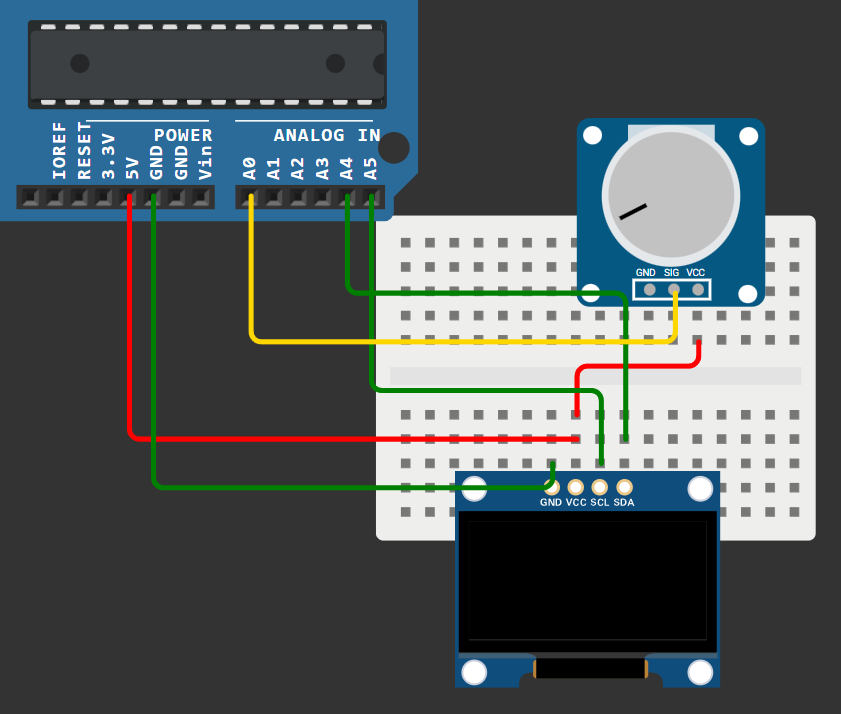
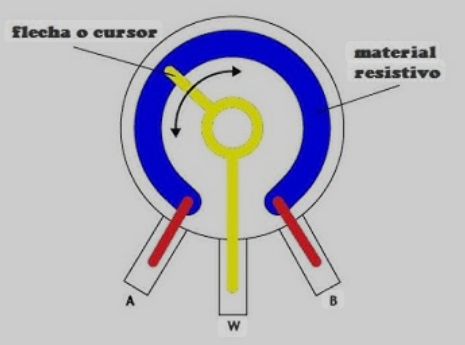

# sesion-04a

-26-08-2025  

## Apuntes  

En esta sesión trabajamos en la **entrega en grupo**.

soy del **grupo 7 Soundi**.

### 1. Primer acercamiento práctico  

- Nos entregaron el **protoboard** y la **pantalla OLED**.  
- Pudimos probar nuestros **primeros códigos en la pantalla** para verificar que estaba funcionando correctamente.  

### 2. Conexión de la pantalla con Arduino  

- Aprendimos a **conectar la pantalla al protoboard** y de ahí al Arduino.  
- Identificamos los **pines de alimentación (VCC y GND)** y los **pines de comunicación I2C (SDA y SCL)**.  
- Revisamos cómo colocar los **jumpers en el protoboard** para mantener el orden y evitar errores de conexión.  

### 3. Conexión y uso del potenciómetro  

- Después trabajamos con el **potenciómetro**.  
- Vimos cómo conectar sus **tres pines**:  
  - Uno a **5V** (positivo).  
  - Otro a **GND** (tierra).  
  - El pin central (**Vout**) hacia una **entrada analógica del Arduino (A0)**.  
- Probamos cómo el potenciómetro modifica valores en el código (entrada analógica) y cómo podemos usarlo para controlar la pantalla.  



---

## Ejemplos de la clase



En Arduino, las conexiones se realizan de la siguiente forma:

- **A → 5V**  
- **B → GND**  
- **W → A0** (entrada analógica)  

El código con `analogRead(A0)` convierte el voltaje de **0V a 5V** en un valor digital de **0 a 1023**.

### Ejemplo 1

```cpp
int valorPot= 0;


void setup() {
  // put your setup code here, to run once:
Serial.begin(9600);
}

void loop() {
  // put your main code here, to run repeatedly:

 valorPot = analogRead(A0); 
Serial.println(valorPot);

}
```

### Ejemplo 2

```cpp
// declarar valor
// inicializar 0
int valorPot = 0;

String verso0;
String verso1;
String verso2;

void setup() {
  // put your setup code here, to run once:
  Serial.begin(9600);

  verso0 = "ventilador";
  verso1 = "techo";
  verso2 = "lampara";

}

void loop() {
  // put your main code here, to run repeatedly:
  
  // leer el valor
  valorPot = analogRead(A0);

  if (valorPot < 300) {
    // aca esta entre 0 y 300-1
    Serial.println(verso0);
  }
  else if (valorPot < 600) {
    // aca esta entre 300 y 600
    Serial.println(verso1);
  } else {
    // aca esta mayor que 600
    Serial.println(verso2);
  }

  
  // Serial.println(valorPot);
}
```

## Proceso del trabajo

Mi parte del trabajo es el código para que se vea el poema en la pantalla.

#### primer código

Queríamos que los fotogramas se vieran el la pantalla pero no resulto

```cpp
#include <Wire.h>
#include <Adafruit_GFX.h>
#include <Adafruit_SSD1306.h>

#define SCREEN_WIDTH 128
#define SCREEN_HEIGHT 64
#define OLED_RESET -1
Adafruit_SSD1306 pantallita(SCREEN_WIDTH, SCREEN_HEIGHT, &Wire, OLED_RESET);


const unsigned char usopp [] PROGMEM = {
  // 'usopp de one piece', 128x64px
 0xff, 0xff, 0xff, 0xff, 0xff, 0xff, 0xff, 0xff, 0xff, 0xff, 0xff, 0xff, 0xff, 0xff, 0xff, 0xff, 
 0xff, 0xff, 0xff, 0xff, 0xff, 0xff, 0xff, 0xff, 0xff, 0xff, 0xff, 0xff, 0xff, 0xff, 0xff, 0xff, 
 0xff, 0xff, 0xff, 0xff, 0xff, 0xff, 0xff, 0xff, 0xff, 0xff, 0xff, 0xff, 0xff, 0xff, 0xff, 0xff, 
 0xff, 0xff, 0xff, 0xff, 0xff, 0xff, 0xff, 0xff, 0xff, 0xff, 0xff, 0xff, 0xff, 0xff, 0xff, 0xff, 
 0xff, 0xff, 0xff, 0xff, 0xff, 0xff, 0xff, 0xff, 0xff, 0xff, 0xff, 0xff, 0xff, 0xff, 0xff, 0xff, 
 0xff, 0xff, 0xff, 0xff, 0xff, 0xff, 0xff, 0xff, 0xff, 0xff, 0xff, 0xff, 0xff, 0xff, 0xff, 0xff, 
 0xff, 0xff, 0xff, 0xff, 0xff, 0xff, 0xff, 0xff, 0xff, 0xff, 0xff, 0xff, 0xff, 0xff, 0xff, 0xff, 
 0xff, 0xff, 0xff, 0xff, 0xff, 0xff, 0xff, 0xff, 0xff, 0xff, 0xff, 0xff, 0xff, 0xff, 0xff, 0xff, 
 0xff, 0xff, 0xff, 0xff, 0xff, 0xff, 0xff, 0xff, 0xff, 0xff, 0xff, 0xff, 0xff, 0xff, 0xff, 0xff, 
 0xff, 0xff, 0xff, 0xff, 0xff, 0xff, 0xff, 0xff, 0xff, 0xff, 0xff, 0xff, 0xff, 0xff, 0xff, 0xff, 
 0xff, 0xff, 0xff, 0xff, 0xff, 0xff, 0xff, 0xff, 0xff, 0xff, 0xff, 0xff, 0xff, 0xff, 0xff, 0xff, 
 0xff, 0xff, 0xff, 0xff, 0xff, 0xff, 0xff, 0xff, 0xff, 0xff, 0xff, 0xff, 0xff, 0xff, 0xff, 0xff, 
 0xff, 0xff, 0xff, 0xff, 0xff, 0xff, 0xff, 0xff, 0xff, 0xff, 0xff, 0xff, 0xff, 0xff, 0xff, 0xff, 
 0xff, 0xff, 0xff, 0xff, 0xff, 0xff, 0xff, 0xff, 0xff, 0xff, 0xff, 0xff, 0xff, 0xff, 0xff, 0xff, 
 0xff, 0xff, 0xff, 0xff, 0xff, 0xff, 0xff, 0xff, 0xff, 0xff, 0xff, 0xff, 0xff, 0xff, 0xff, 0xff, 
 0xff, 0xff, 0xff, 0xff, 0xff, 0xff, 0xff, 0xff, 0xff, 0xff, 0xff, 0xff, 0xff, 0xff, 0xff, 0xff, 
 0xff, 0xff, 0xff, 0xff, 0xff, 0xff, 0xff, 0xff, 0xff, 0xff, 0xff, 0xff, 0xff, 0xff, 0xff, 0xff, 
 0xff, 0xff, 0xff, 0xfc, 0x3f, 0xff, 0xff, 0xff, 0xff, 0xff, 0xff, 0xff, 0xff, 0xff, 0xff, 0xff, 
 0xff, 0xff, 0xff, 0xe0, 0x07, 0xff, 0xff, 0xff, 0xff, 0xff, 0xff, 0xff, 0xff, 0xff, 0xff, 0xff, 
 0xff, 0xff, 0xff, 0xc0, 0x01, 0xff, 0xff, 0xff, 0xff, 0xff, 0xff, 0xff, 0xff, 0xff, 0xff, 0xff, 
 0xff, 0xff, 0xff, 0x00, 0x00, 0xff, 0xff, 0xff, 0xff, 0xff, 0xff, 0xff, 0xff, 0xff, 0xff, 0xff, 
 0xff, 0xff, 0xfe, 0x00, 0x00, 0x7f, 0xff, 0xff, 0xff, 0xff, 0xff, 0xff, 0xff, 0xff, 0xff, 0xff, 
 0xff, 0xff, 0xfe, 0x0c, 0x18, 0x7f, 0xff, 0xff, 0xff, 0xff, 0xff, 0xff, 0xff, 0xff, 0xff, 0xff, 
 0xff, 0xff, 0xfc, 0x0e, 0x1c, 0x3f, 0xff, 0xff, 0xff, 0xff, 0xff, 0xff, 0xff, 0xff, 0xff, 0xff, 
 0xff, 0xff, 0xfc, 0x0c, 0x18, 0x3f, 0xff, 0xff, 0xff, 0xff, 0xff, 0xff, 0xff, 0xff, 0xff, 0xff, 
 0xff, 0xff, 0xfc, 0x00, 0x00, 0x3f, 0xff, 0xff, 0xff, 0xff, 0xff, 0xff, 0xff, 0xff, 0xff, 0xff, 
 0xff, 0xff, 0xfc, 0x03, 0x08, 0x3f, 0xff, 0xff, 0xff, 0xff, 0xff, 0xff, 0xff, 0xff, 0xff, 0xff, 
 0xff, 0xff, 0xfc, 0x0f, 0xf8, 0x3f, 0xff, 0xff, 0xff, 0xff, 0xff, 0xff, 0xff, 0xff, 0xff, 0xff, 
 0xff, 0xff, 0xfc, 0x47, 0xe1, 0x9f, 0xff, 0xff, 0xff, 0xff, 0xff, 0xff, 0xff, 0xff, 0xff, 0xff, 
 0xff, 0xff, 0xf0, 0xe1, 0xc3, 0x8f, 0xff, 0xff, 0xff, 0xff, 0xff, 0xff, 0xff, 0xff, 0xff, 0xff, 
 0xff, 0xff, 0xf0, 0xc1, 0xc0, 0x0f, 0xff, 0xff, 0xff, 0xff, 0xff, 0xff, 0xff, 0xff, 0xff, 0xff, 
 0xff, 0xff, 0xf0, 0x81, 0xc0, 0x07, 0xff, 0xff, 0xff, 0xff, 0xff, 0xff, 0xff, 0xff, 0xff, 0xff, 
 0xff, 0xff, 0xe0, 0x20, 0xe2, 0x37, 0xff, 0xff, 0xff, 0xff, 0xff, 0xff, 0xff, 0xff, 0xff, 0xff, 
 0xff, 0xff, 0xec, 0x24, 0xde, 0x3f, 0xff, 0xff, 0xff, 0xff, 0xff, 0xff, 0xff, 0xff, 0xff, 0xff, 
 0xff, 0xff, 0xee, 0xb8, 0x00, 0xb7, 0xff, 0xff, 0xff, 0xff, 0xff, 0xff, 0xff, 0xff, 0xff, 0xff, 
 0xff, 0xff, 0xee, 0x81, 0xbf, 0xb7, 0xff, 0xff, 0xff, 0xff, 0xff, 0xff, 0xff, 0xff, 0xff, 0xff, 
 0xff, 0xff, 0xee, 0xfd, 0xbf, 0x27, 0xff, 0xff, 0xff, 0xff, 0xff, 0xff, 0xff, 0xff, 0xff, 0xff, 
 0xff, 0xff, 0xf0, 0xfe, 0x3f, 0x0f, 0xff, 0xff, 0xff, 0xff, 0xff, 0xff, 0xff, 0xff, 0xff, 0xff, 
 0xff, 0xff, 0xe0, 0x7b, 0xe7, 0x07, 0xff, 0xff, 0xff, 0xff, 0xff, 0xff, 0xff, 0xff, 0xff, 0xff, 
 0xff, 0xff, 0x80, 0x78, 0x0f, 0x07, 0xff, 0xff, 0xff, 0xff, 0xff, 0xff, 0xff, 0xff, 0xff, 0xff, 
 0xff, 0xff, 0x00, 0x3f, 0xfe, 0x03, 0xff, 0xff, 0xff, 0xff, 0xff, 0xff, 0xff, 0xff, 0xff, 0xff, 
 0xff, 0xff, 0x00, 0x1f, 0xfc, 0x03, 0xff, 0xff, 0xff, 0xff, 0xff, 0xff, 0xff, 0xff, 0xff, 0xff, 
 0xff, 0xff, 0x80, 0x07, 0xf8, 0x03, 0xff, 0xff, 0xff, 0xff, 0xff, 0xff, 0xff, 0xff, 0xff, 0xff, 
 0xff, 0xff, 0xc0, 0x00, 0x00, 0x07, 0xff, 0xff, 0xff, 0xff, 0xff, 0xff, 0xff, 0xff, 0xff, 0xff, 
 0xff, 0xff, 0xc0, 0x07, 0xc0, 0x07, 0xff, 0xff, 0xff, 0xff, 0xff, 0xff, 0xff, 0xff, 0xff, 0xff, 
 0xff, 0xff, 0xe0, 0x0f, 0xf0, 0x07, 0xff, 0xff, 0xff, 0xff, 0xff, 0xff, 0xff, 0xff, 0xff, 0xff, 
 0xff, 0xff, 0xf0, 0x7f, 0xf0, 0x7f, 0xff, 0xff, 0xff, 0xff, 0xff, 0xff, 0xff, 0xff, 0xff, 0xff, 
 0xff, 0xff, 0xff, 0xff, 0xff, 0xff, 0xff, 0xff, 0xff, 0xff, 0xff, 0xff, 0xff, 0xff, 0xff, 0xff, 
 0xff, 0xff, 0xff, 0xff, 0xff, 0xff, 0xff, 0xff, 0xff, 0xff, 0xff, 0xff, 0xff, 0xff, 0xff, 0xff, 
 0xff, 0xff, 0xff, 0xff, 0xff, 0xff, 0xff, 0xff, 0xff, 0xff, 0xff, 0xff, 0xff, 0xff, 0xff, 0xff, 
 0xff, 0xff, 0xff, 0xff, 0xff, 0xff, 0xff, 0xff, 0xff, 0xff, 0xff, 0xff, 0xff, 0xff, 0xff, 0xff, 
 0xff, 0xff, 0xff, 0xff, 0xff, 0xff, 0xff, 0xff, 0xff, 0xff, 0xff, 0xff, 0xff, 0xff, 0xff, 0xff, 
 0xff, 0xff, 0xff, 0xff, 0xff, 0xff, 0xff, 0xff, 0xff, 0xff, 0xff, 0xff, 0xff, 0xff, 0xff, 0xff, 
 0xff, 0xff, 0xff, 0xff, 0xff, 0xff, 0xff, 0xff, 0xff, 0xff, 0xff, 0xff, 0xff, 0xff, 0xff, 0xff, 
 0xff, 0xff, 0xff, 0xff, 0xff, 0xff, 0xff, 0xff, 0xff, 0xff, 0xff, 0xff, 0xff, 0xff, 0xff, 0xff, 
 0xff, 0xff, 0xff, 0xff, 0xff, 0xff, 0xff, 0xff, 0xff, 0xff, 0xff, 0xff, 0xff, 0xff, 0xff, 0xff, 
 0xff, 0xff, 0xff, 0xff, 0xff, 0xff, 0xff, 0xff, 0xff, 0xff, 0xff, 0xff, 0xff, 0xff, 0xff, 0xff, 
 0xff, 0xff, 0xff, 0xff, 0xff, 0xff, 0xff, 0xff, 0xff, 0xff, 0xff, 0xff, 0xff, 0xff, 0xff, 0xff, 
 0xff, 0xff, 0xff, 0xff, 0xff, 0xff, 0xff, 0xff, 0xff, 0xff, 0xff, 0xff, 0xff, 0xff, 0xff, 0xff, 
 0xff, 0xff, 0xff, 0xff, 0xff, 0xff, 0xff, 0xff, 0xff, 0xff, 0xff, 0xff, 0xff, 0xff, 0xff, 0xff, 
 0xff, 0xff, 0xff, 0xff, 0xff, 0xff, 0xff, 0xff, 0xff, 0xff, 0xff, 0xff, 0xff, 0xff, 0xff, 0xff, 
 0xff, 0xff, 0xff, 0xff, 0xff, 0xff, 0xff, 0xff, 0xff, 0xff, 0xff, 0xff, 0xff, 0xff, 0xff, 0xff, 
 0xff, 0xff, 0xff, 0xff, 0xff, 0xff, 0xff, 0xff, 0xff, 0xff, 0xff, 0xff, 0xff, 0xff, 0xff, 0xff, 
 0xff, 0xff, 0xff, 0xff, 0xff, 0xff, 0xff, 0xff, 0xff, 0xff, 0xff, 0xff, 0xff, 0xff, 0xff, 0xff
};

const unsigned char jimbe [] PROGMEM = {
  //'jimbe de one piece', 128x64px
0xff, 0xff, 0xff, 0xff, 0xff, 0xff, 0xff, 0xff, 0xff, 0xff, 0xff, 0xff, 0xff, 0xff, 0xff, 0xff, 
 0xff, 0xff, 0xff, 0xff, 0xff, 0xff, 0xff, 0xff, 0xff, 0xff, 0xff, 0xff, 0xff, 0xff, 0xff, 0xff, 
 0xff, 0xff, 0xff, 0xff, 0xff, 0xff, 0xff, 0xff, 0xff, 0xff, 0xff, 0xff, 0xff, 0xff, 0xff, 0xff, 
 0xff, 0xff, 0xff, 0xff, 0xff, 0xff, 0xff, 0xff, 0xff, 0xff, 0xff, 0xff, 0xff, 0xff, 0xff, 0xff, 
 0xff, 0xff, 0xff, 0xff, 0xff, 0xff, 0xff, 0xff, 0xff, 0xff, 0xff, 0xff, 0xff, 0xff, 0xff, 0xff, 
 0xff, 0xff, 0xff, 0xff, 0xff, 0xff, 0xff, 0xff, 0xff, 0xff, 0xff, 0xff, 0xff, 0xff, 0xff, 0xff, 
 0xff, 0xff, 0xff, 0xff, 0xff, 0xff, 0xff, 0xff, 0xff, 0xff, 0xff, 0xff, 0xff, 0xff, 0xff, 0xff, 
 0xff, 0xff, 0xff, 0xff, 0xff, 0xff, 0xff, 0xff, 0xff, 0xff, 0xff, 0xff, 0xff, 0xff, 0xff, 0xff, 
 0xff, 0xff, 0xff, 0xff, 0xff, 0xff, 0xff, 0xff, 0xff, 0xff, 0xff, 0xff, 0xff, 0xff, 0xff, 0xff, 
 0xff, 0xff, 0xff, 0xff, 0xff, 0xff, 0xff, 0xff, 0xff, 0xff, 0xff, 0xff, 0xff, 0xff, 0xff, 0xff, 
 0xff, 0xff, 0xff, 0xff, 0xff, 0xff, 0xff, 0xff, 0xff, 0xff, 0xff, 0xff, 0xff, 0xff, 0xff, 0xff, 
 0xff, 0xff, 0xff, 0xff, 0xff, 0xff, 0xff, 0xff, 0xff, 0xff, 0xff, 0xff, 0xff, 0xff, 0xff, 0xff, 
 0xff, 0xff, 0xff, 0xff, 0xff, 0xff, 0xff, 0xff, 0xff, 0xff, 0xff, 0xff, 0xff, 0xff, 0xff, 0xff, 
 0xff, 0xff, 0xff, 0xff, 0xff, 0xff, 0xff, 0xff, 0xff, 0xff, 0xff, 0xff, 0xff, 0xff, 0xff, 0xff, 
 0xff, 0xff, 0xff, 0xff, 0xff, 0xff, 0xff, 0xff, 0xff, 0xff, 0xff, 0xff, 0xff, 0xff, 0xff, 0xff, 
 0xff, 0xff, 0xff, 0xff, 0x1f, 0xff, 0xff, 0xff, 0xff, 0xff, 0xff, 0xff, 0xff, 0xff, 0xff, 0xff, 
 0xff, 0xff, 0xff, 0xf0, 0x0f, 0xff, 0xff, 0xff, 0xff, 0xff, 0xff, 0xff, 0xff, 0xff, 0xff, 0xff, 
 0xff, 0xff, 0xff, 0xe0, 0x07, 0xff, 0xff, 0xff, 0xff, 0xff, 0xff, 0xff, 0xff, 0xff, 0xff, 0xff, 
 0xff, 0xff, 0xff, 0xe0, 0x07, 0xff, 0xff, 0xff, 0xff, 0xff, 0xff, 0xff, 0xff, 0xff, 0xff, 0xff, 
 0xff, 0xff, 0xff, 0xc0, 0x03, 0xff, 0xff, 0xff, 0xff, 0xff, 0xff, 0xff, 0xff, 0xff, 0xff, 0xff, 
 0xff, 0xff, 0xff, 0x80, 0x03, 0xff, 0xff, 0xff, 0xff, 0xff, 0xff, 0xff, 0xff, 0xff, 0xff, 0xff, 
 0xff, 0xff, 0xff, 0x80, 0x01, 0xff, 0xff, 0xff, 0xff, 0xff, 0xff, 0xff, 0xff, 0xff, 0xff, 0xff, 
 0xff, 0xff, 0xff, 0xc0, 0x03, 0xff, 0xff, 0xff, 0xff, 0xff, 0xff, 0xff, 0xff, 0xff, 0xff, 0xff, 
 0xff, 0xff, 0xff, 0x80, 0x03, 0xff, 0xff, 0xff, 0xff, 0xff, 0xff, 0xff, 0xff, 0xff, 0xff, 0xff, 
 0xff, 0xff, 0xff, 0x00, 0x01, 0xff, 0xff, 0xff, 0xff, 0xff, 0xff, 0xff, 0xff, 0xff, 0xff, 0xff, 
 0xff, 0xff, 0xfe, 0x00, 0x00, 0xff, 0xff, 0xff, 0xff, 0xff, 0xff, 0xff, 0xff, 0xff, 0xff, 0xff, 
 0xff, 0xff, 0xfe, 0x00, 0x00, 0x7f, 0xff, 0xff, 0xff, 0xff, 0xff, 0xff, 0xff, 0xff, 0xff, 0xff, 
 0xff, 0xff, 0xfc, 0x3c, 0x1c, 0x7f, 0xff, 0xff, 0xff, 0xff, 0xff, 0xff, 0xff, 0xff, 0xff, 0xff, 
 0xff, 0xff, 0xf8, 0x7f, 0xfe, 0x3f, 0xff, 0xff, 0xff, 0xff, 0xff, 0xff, 0xff, 0xff, 0xff, 0xff, 
 0xff, 0xff, 0xbd, 0xff, 0xff, 0x3f, 0xff, 0xff, 0xff, 0xff, 0xff, 0xff, 0xff, 0xff, 0xff, 0xff, 
 0xff, 0xfe, 0x7f, 0x1f, 0xf8, 0x10, 0xff, 0xff, 0xff, 0xff, 0xff, 0xff, 0xff, 0xff, 0xff, 0xff, 
 0xff, 0xfe, 0x9f, 0x0f, 0xc0, 0x60, 0xff, 0xff, 0xff, 0xff, 0xff, 0xff, 0xff, 0xff, 0xff, 0xff, 
 0xff, 0xfe, 0xff, 0x03, 0xc8, 0xee, 0xff, 0xff, 0xff, 0xff, 0xff, 0xff, 0xff, 0xff, 0xff, 0xff, 
 0xff, 0xff, 0x3f, 0x07, 0xe0, 0x70, 0x7f, 0xff, 0xff, 0xff, 0xff, 0xff, 0xff, 0xff, 0xff, 0xff, 
 0xff, 0xfc, 0x7e, 0x02, 0xc0, 0x7c, 0xbf, 0xff, 0xff, 0xff, 0xff, 0xff, 0xff, 0xff, 0xff, 0xff, 
 0xff, 0xfb, 0x7f, 0x04, 0x40, 0x16, 0xff, 0xff, 0xff, 0xff, 0xff, 0xff, 0xff, 0xff, 0xff, 0xff, 
 0xff, 0xfb, 0xbf, 0xc4, 0xe7, 0x82, 0x3f, 0xff, 0xff, 0xff, 0xff, 0xff, 0xff, 0xff, 0xff, 0xff, 
 0xff, 0xfc, 0x7e, 0x78, 0x3e, 0x7d, 0x3f, 0xff, 0xff, 0xff, 0xff, 0xff, 0xff, 0xff, 0xff, 0xff, 
 0xff, 0xfc, 0xfe, 0x7c, 0x7d, 0x7f, 0x1f, 0xff, 0xff, 0xff, 0xff, 0xff, 0xff, 0xff, 0xff, 0xff, 
 0xff, 0xf1, 0xfd, 0xa0, 0x7d, 0xbd, 0x8f, 0xff, 0xff, 0xff, 0xff, 0xff, 0xff, 0xff, 0xff, 0xff, 
 0xff, 0xf4, 0xfb, 0x9f, 0xf3, 0xbd, 0x8f, 0xff, 0xff, 0xff, 0xff, 0xff, 0xff, 0xff, 0xff, 0xff, 
 0xff, 0xf0, 0xfb, 0x7f, 0xfd, 0xbc, 0x5f, 0xff, 0xff, 0xff, 0xff, 0xff, 0xff, 0xff, 0xff, 0xff, 
 0xff, 0xff, 0xf8, 0xf8, 0x3e, 0x7f, 0xff, 0xff, 0xff, 0xff, 0xff, 0xff, 0xff, 0xff, 0xff, 0xff, 
 0xff, 0xff, 0xff, 0xf8, 0x3f, 0xff, 0xff, 0xff, 0xff, 0xff, 0xff, 0xff, 0xff, 0xff, 0xff, 0xff, 
 0xff, 0xff, 0xff, 0xe0, 0x1f, 0xff, 0xff, 0xff, 0xff, 0xff, 0xff, 0xff, 0xff, 0xff, 0xff, 0xff, 
 0xff, 0xff, 0xff, 0xe0, 0x1f, 0xff, 0xff, 0xff, 0xff, 0xff, 0xff, 0xff, 0xff, 0xff, 0xff, 0xff, 
 0xff, 0xff, 0xff, 0xf8, 0x3f, 0xff, 0xff, 0xff, 0xff, 0xff, 0xff, 0xff, 0xff, 0xff, 0xff, 0xff, 
 0xff, 0xff, 0xff, 0xff, 0xff, 0xff, 0xff, 0xff, 0xff, 0xff, 0xff, 0xff, 0xff, 0xff, 0xff, 0xff, 
 0xff, 0xff, 0xff, 0xff, 0xff, 0xff, 0xff, 0xff, 0xff, 0xff, 0xff, 0xff, 0xff, 0xff, 0xff, 0xff, 
 0xff, 0xff, 0xff, 0xff, 0xff, 0xff, 0xff, 0xff, 0xff, 0xff, 0xff, 0xff, 0xff, 0xff, 0xff, 0xff, 
 0xff, 0xff, 0xff, 0xff, 0xff, 0xff, 0xff, 0xff, 0xff, 0xff, 0xff, 0xff, 0xff, 0xff, 0xff, 0xff, 
 0xff, 0xff, 0xff, 0xff, 0xff, 0xff, 0xff, 0xff, 0xff, 0xff, 0xff, 0xff, 0xff, 0xff, 0xff, 0xff, 
 0xff, 0xff, 0xff, 0xff, 0xff, 0xff, 0xff, 0xff, 0xff, 0xff, 0xff, 0xff, 0xff, 0xff, 0xff, 0xff, 
 0xff, 0xff, 0xff, 0xff, 0xff, 0xff, 0xff, 0xff, 0xff, 0xff, 0xff, 0xff, 0xff, 0xff, 0xff, 0xff, 
 0xff, 0xff, 0xff, 0xff, 0xff, 0xff, 0xff, 0xff, 0xff, 0xff, 0xff, 0xff, 0xff, 0xff, 0xff, 0xff, 
 0xff, 0xff, 0xff, 0xff, 0xff, 0xff, 0xff, 0xff, 0xff, 0xff, 0xff, 0xff, 0xff, 0xff, 0xff, 0xff, 
 0xff, 0xff, 0xff, 0xff, 0xff, 0xff, 0xff, 0xff, 0xff, 0xff, 0xff, 0xff, 0xff, 0xff, 0xff, 0xff, 
 0xff, 0xff, 0xff, 0xff, 0xff, 0xff, 0xff, 0xff, 0xff, 0xff, 0xff, 0xff, 0xff, 0xff, 0xff, 0xff, 
 0xff, 0xff, 0xff, 0xff, 0xff, 0xff, 0xff, 0xff, 0xff, 0xff, 0xff, 0xff, 0xff, 0xff, 0xff, 0xff, 
 0xff, 0xff, 0xff, 0xff, 0xff, 0xff, 0xff, 0xff, 0xff, 0xff, 0xff, 0xff, 0xff, 0xff, 0xff, 0xff, 
 0xff, 0xff, 0xff, 0xff, 0xff, 0xff, 0xff, 0xff, 0xff, 0xff, 0xff, 0xff, 0xff, 0xff, 0xff, 0xff, 
 0xff, 0xff, 0xff, 0xff, 0xff, 0xff, 0xff, 0xff, 0xff, 0xff, 0xff, 0xff, 0xff, 0xff, 0xff, 0xff, 
 0xff, 0xff, 0xff, 0xff, 0xff, 0xff, 0xff, 0xff, 0xff, 0xff, 0xff, 0xff, 0xff, 0xff, 0xff, 0xff, 
 0xff, 0xff, 0xff, 0xff, 0xff, 0xff, 0xff, 0xff, 0xff, 0xff, 0xff, 0xff, 0xff, 0xff, 0xff, 0xff
  };

const unsigned char luffy [] PROGMEM = {
  //'luffy de one piece', 128x64px
  0xff, 0xff, 0xff, 0xff, 0xff, 0xff, 0xff, 0xff, 0xff, 0xff, 0xff, 0xff, 0xff, 0xff, 0xff, 0xff, 
 0xff, 0xff, 0xff, 0xff, 0xff, 0xff, 0xff, 0xff, 0xff, 0xff, 0xff, 0xff, 0xff, 0xff, 0xff, 0xff, 
 0xff, 0xff, 0xff, 0xff, 0xff, 0xff, 0xff, 0xff, 0xff, 0xff, 0xff, 0xff, 0xff, 0xff, 0xff, 0xff, 
 0xff, 0xff, 0xff, 0xff, 0xff, 0xff, 0xff, 0xff, 0xff, 0xff, 0xff, 0xff, 0xff, 0xff, 0xff, 0xff, 
 0xff, 0xff, 0xff, 0xff, 0xff, 0xff, 0xff, 0xff, 0xff, 0xff, 0xff, 0xff, 0xff, 0xff, 0xff, 0xff, 
 0xff, 0xff, 0xff, 0xff, 0xff, 0xff, 0xff, 0xff, 0xff, 0xff, 0xff, 0xff, 0xff, 0xff, 0xff, 0xff, 
 0xff, 0xff, 0xff, 0xff, 0xff, 0xff, 0xff, 0xff, 0xff, 0xff, 0xff, 0xff, 0xff, 0xff, 0xff, 0xff, 
 0xff, 0xff, 0xff, 0xff, 0xff, 0xff, 0xff, 0xff, 0xff, 0xff, 0xff, 0xff, 0xff, 0xff, 0xff, 0xff, 
 0xff, 0xff, 0xff, 0xff, 0xff, 0xff, 0xff, 0xff, 0xff, 0xff, 0xff, 0xff, 0xff, 0xff, 0xff, 0xff, 
 0xff, 0xff, 0xff, 0xff, 0xff, 0xff, 0xff, 0xff, 0xff, 0xff, 0xff, 0xff, 0xff, 0xff, 0xff, 0xff, 
 0xff, 0xff, 0xff, 0xff, 0xff, 0xff, 0xff, 0xff, 0xff, 0xff, 0xff, 0xff, 0xff, 0xff, 0xff, 0xff, 
 0xff, 0xff, 0xff, 0xff, 0xff, 0xff, 0xff, 0xff, 0xff, 0xff, 0xff, 0xff, 0xff, 0xff, 0xff, 0xff, 
 0xff, 0xff, 0xff, 0xff, 0xff, 0xff, 0xff, 0xff, 0xff, 0xff, 0xff, 0xff, 0xff, 0xff, 0xff, 0xff, 
 0xff, 0xff, 0xff, 0xff, 0xff, 0xff, 0xff, 0xff, 0xff, 0xff, 0xff, 0xff, 0xff, 0xff, 0xff, 0xff, 
 0xff, 0xff, 0xff, 0xff, 0xff, 0xff, 0xff, 0xff, 0xff, 0xff, 0xff, 0xff, 0xff, 0xff, 0xff, 0xff, 
 0xff, 0xff, 0xff, 0xff, 0xff, 0xff, 0xff, 0xff, 0xff, 0xff, 0xff, 0xff, 0xff, 0xff, 0xff, 0xff, 
 0xff, 0xff, 0xff, 0xff, 0xff, 0xff, 0xff, 0xff, 0xff, 0xff, 0xff, 0xff, 0xff, 0xff, 0xff, 0xff, 
 0xff, 0xff, 0xff, 0xff, 0xff, 0xff, 0xff, 0xff, 0xff, 0xff, 0xff, 0xff, 0xff, 0xff, 0xff, 0xff, 
 0xff, 0xff, 0xff, 0xe0, 0x03, 0xff, 0xff, 0xff, 0xff, 0xff, 0xff, 0xff, 0xff, 0xff, 0xff, 0xff, 
 0xff, 0xff, 0xff, 0x8f, 0xf8, 0xff, 0xff, 0xff, 0xff, 0xff, 0xff, 0xff, 0xff, 0xff, 0xff, 0xff, 
 0xff, 0xff, 0xff, 0x3f, 0xfe, 0x7f, 0xff, 0xff, 0xff, 0xff, 0xff, 0xff, 0xff, 0xff, 0xff, 0xff, 
 0xff, 0xff, 0xfe, 0x7f, 0xff, 0xbf, 0xff, 0xff, 0xff, 0xff, 0xff, 0xff, 0xff, 0xff, 0xff, 0xff, 
 0xff, 0xff, 0xfc, 0xff, 0xff, 0x9f, 0xff, 0xff, 0xff, 0xff, 0xff, 0xff, 0xff, 0xff, 0xff, 0xff, 
 0xff, 0xff, 0xf9, 0xff, 0xff, 0xcf, 0xff, 0xff, 0xff, 0xff, 0xff, 0xff, 0xff, 0xff, 0xff, 0xff, 
 0xff, 0xff, 0xf3, 0x98, 0x00, 0x8f, 0xff, 0xff, 0xff, 0xff, 0xff, 0xff, 0xff, 0xff, 0xff, 0xff, 
 0xff, 0xff, 0xf4, 0x00, 0x00, 0x07, 0xff, 0xff, 0xff, 0xff, 0xff, 0xff, 0xff, 0xff, 0xff, 0xff, 
 0xff, 0xff, 0xe0, 0x22, 0x22, 0x27, 0xff, 0xff, 0xff, 0xff, 0xff, 0xff, 0xff, 0xff, 0xff, 0xff, 
 0xff, 0xff, 0xe1, 0x11, 0x99, 0x1f, 0xff, 0xff, 0xff, 0xff, 0xff, 0xff, 0xff, 0xff, 0xff, 0xff, 
 0xff, 0xff, 0xe8, 0x00, 0x00, 0x01, 0xff, 0xff, 0xff, 0xff, 0xff, 0xff, 0xff, 0xff, 0xff, 0xff, 
 0xff, 0xff, 0xe0, 0x00, 0x00, 0x00, 0x3f, 0xff, 0xff, 0xff, 0xff, 0xff, 0xff, 0xff, 0xff, 0xff, 
 0xff, 0xf8, 0x00, 0x00, 0x00, 0x01, 0x87, 0xff, 0xff, 0xff, 0xff, 0xff, 0xff, 0xff, 0xff, 0xff, 
 0xff, 0xc3, 0x00, 0x00, 0x01, 0x80, 0xf1, 0xff, 0xff, 0xff, 0xff, 0xff, 0xff, 0xff, 0xff, 0xff, 
 0xff, 0x98, 0x03, 0x18, 0x04, 0xc0, 0x7d, 0xff, 0xff, 0xff, 0xff, 0xff, 0xff, 0xff, 0xff, 0xff, 
 0xff, 0xbf, 0x86, 0x06, 0x30, 0x00, 0x3e, 0xff, 0xff, 0xff, 0xff, 0xff, 0xff, 0xff, 0xff, 0xff, 
 0xff, 0x7f, 0x04, 0x02, 0x20, 0x60, 0x3c, 0xff, 0xff, 0xff, 0xff, 0xff, 0xff, 0xff, 0xff, 0xff, 
 0xff, 0x7f, 0x85, 0x02, 0x28, 0x30, 0x79, 0xff, 0xff, 0xff, 0xff, 0xff, 0xff, 0xff, 0xff, 0xff, 
 0xff, 0xbf, 0x8e, 0x06, 0x30, 0x39, 0x03, 0xff, 0xff, 0xff, 0xff, 0xff, 0xff, 0xff, 0xff, 0xff, 
 0xff, 0x9e, 0x46, 0x07, 0x30, 0x39, 0xbf, 0xff, 0xff, 0xff, 0xff, 0xff, 0xff, 0xff, 0xff, 0xff, 
 0xff, 0xc2, 0xc7, 0x07, 0xf8, 0x65, 0xbf, 0xff, 0xff, 0xff, 0xff, 0xff, 0xff, 0xff, 0xff, 0xff, 
 0xff, 0xfe, 0xc7, 0xcf, 0xfc, 0xc5, 0x9f, 0xff, 0xff, 0xff, 0xff, 0xff, 0xff, 0xff, 0xff, 0xff, 
 0xff, 0xfe, 0xf7, 0xff, 0xff, 0x83, 0x9f, 0xff, 0xff, 0xff, 0xff, 0xff, 0xff, 0xff, 0xff, 0xff, 
 0xff, 0xfe, 0xf3, 0xef, 0xfb, 0x93, 0xbf, 0xff, 0xff, 0xff, 0xff, 0xff, 0xff, 0xff, 0xff, 0xff, 
 0xff, 0xfe, 0x7b, 0xe3, 0x23, 0xc2, 0x7f, 0xff, 0xff, 0xff, 0xff, 0xff, 0xff, 0xff, 0xff, 0xff, 
 0xff, 0xff, 0x11, 0xf0, 0x1f, 0xe9, 0xff, 0xff, 0xff, 0xff, 0xff, 0xff, 0xff, 0xff, 0xff, 0xff, 
 0xff, 0xff, 0xcc, 0xff, 0xff, 0xcf, 0xff, 0xff, 0xff, 0xff, 0xff, 0xff, 0xff, 0xff, 0xff, 0xff, 
 0xff, 0xff, 0xfe, 0x7f, 0xff, 0x1f, 0xff, 0xff, 0xff, 0xff, 0xff, 0xff, 0xff, 0xff, 0xff, 0xff, 
 0xff, 0xff, 0xff, 0x1f, 0xe0, 0x7f, 0xff, 0xff, 0xff, 0xff, 0xff, 0xff, 0xff, 0xff, 0xff, 0xff, 
 0xff, 0xff, 0xff, 0xc0, 0x07, 0xff, 0xff, 0xff, 0xff, 0xff, 0xff, 0xff, 0xff, 0xff, 0xff, 0xff, 
 0xff, 0xff, 0xff, 0xff, 0xff, 0xff, 0xff, 0xff, 0xff, 0xff, 0xff, 0xff, 0xff, 0xff, 0xff, 0xff, 
 0xff, 0xff, 0xff, 0xff, 0xff, 0xff, 0xff, 0xff, 0xff, 0xff, 0xff, 0xff, 0xff, 0xff, 0xff, 0xff, 
 0xff, 0xff, 0xff, 0xff, 0xff, 0xff, 0xff, 0xff, 0xff, 0xff, 0xff, 0xff, 0xff, 0xff, 0xff, 0xff, 
 0xff, 0xff, 0xff, 0xff, 0xff, 0xff, 0xff, 0xff, 0xff, 0xff, 0xff, 0xff, 0xff, 0xff, 0xff, 0xff, 
 0xff, 0xff, 0xff, 0xff, 0xff, 0xff, 0xff, 0xff, 0xff, 0xff, 0xff, 0xff, 0xff, 0xff, 0xff, 0xff, 
 0xff, 0xff, 0xff, 0xff, 0xff, 0xff, 0xff, 0xff, 0xff, 0xff, 0xff, 0xff, 0xff, 0xff, 0xff, 0xff, 
 0xff, 0xff, 0xff, 0xff, 0xff, 0xff, 0xff, 0xff, 0xff, 0xff, 0xff, 0xff, 0xff, 0xff, 0xff, 0xff, 
 0xff, 0xff, 0xff, 0xff, 0xff, 0xff, 0xff, 0xff, 0xff, 0xff, 0xff, 0xff, 0xff, 0xff, 0xff, 0xff, 
 0xff, 0xff, 0xff, 0xff, 0xff, 0xff, 0xff, 0xff, 0xff, 0xff, 0xff, 0xff, 0xff, 0xff, 0xff, 0xff, 
 0xff, 0xff, 0xff, 0xff, 0xff, 0xff, 0xff, 0xff, 0xff, 0xff, 0xff, 0xff, 0xff, 0xff, 0xff, 0xff, 
 0xff, 0xff, 0xff, 0xff, 0xff, 0xff, 0xff, 0xff, 0xff, 0xff, 0xff, 0xff, 0xff, 0xff, 0xff, 0xff, 
 0xff, 0xff, 0xff, 0xff, 0xff, 0xff, 0xff, 0xff, 0xff, 0xff, 0xff, 0xff, 0xff, 0xff, 0xff, 0xff, 
 0xff, 0xff, 0xff, 0xff, 0xff, 0xff, 0xff, 0xff, 0xff, 0xff, 0xff, 0xff, 0xff, 0xff, 0xff, 0xff, 
 0xff, 0xff, 0xff, 0xff, 0xff, 0xff, 0xff, 0xff, 0xff, 0xff, 0xff, 0xff, 0xff, 0xff, 0xff, 0xff, 
 0xff, 0xff, 0xff, 0xff, 0xff, 0xff, 0xff, 0xff, 0xff, 0xff, 0xff, 0xff, 0xff, 0xff, 0xff, 0xff, 
 0xff, 0xff, 0xff, 0xff, 0xff, 0xff, 0xff, 0xff, 0xff, 0xff, 0xff, 0xff, 0xff, 0xff, 0xff, 0xff
};

const unsigned char sanji [] PROGMEM = {
  //'sanji de one piece', 128x64px
0xff, 0xff, 0xff, 0xff, 0xff, 0xff, 0xff, 0xff, 0xff, 0xff, 0xff, 0xff, 0xff, 0xff, 0xff, 0xff, 
 0xff, 0xff, 0xff, 0xff, 0xff, 0xff, 0xff, 0xff, 0xff, 0xff, 0xff, 0xff, 0xff, 0xff, 0xff, 0xff, 
 0xff, 0xff, 0xff, 0xff, 0xff, 0xff, 0xff, 0xff, 0xff, 0xff, 0xff, 0xff, 0xff, 0xff, 0xff, 0xff, 
 0xff, 0xff, 0xff, 0xff, 0xff, 0xff, 0xff, 0xff, 0xff, 0xff, 0xff, 0xff, 0xff, 0xff, 0xff, 0xff, 
 0xff, 0xff, 0xff, 0xff, 0xff, 0xff, 0xff, 0xff, 0xff, 0xff, 0xff, 0xff, 0xff, 0xff, 0xff, 0xff, 
 0xff, 0xff, 0xff, 0xff, 0xff, 0xff, 0xff, 0xff, 0xff, 0xff, 0xff, 0xff, 0xff, 0xff, 0xff, 0xff, 
 0xff, 0xff, 0xff, 0xff, 0xff, 0xff, 0xff, 0xff, 0xff, 0xff, 0xff, 0xff, 0xff, 0xff, 0xff, 0xff, 
 0xff, 0xff, 0xff, 0xff, 0xff, 0xff, 0xff, 0xff, 0xff, 0xff, 0xff, 0xff, 0xff, 0xff, 0xff, 0xff, 
 0xff, 0xff, 0xff, 0xff, 0xff, 0xff, 0xff, 0xff, 0xff, 0xff, 0xff, 0xff, 0xff, 0xff, 0xff, 0xff, 
 0xff, 0xff, 0xff, 0xff, 0xff, 0xff, 0xff, 0xff, 0xff, 0xff, 0xff, 0xff, 0xff, 0xff, 0xff, 0xff, 
 0xff, 0xff, 0xff, 0xff, 0xff, 0xff, 0xff, 0xff, 0xff, 0xff, 0xff, 0xff, 0xff, 0xff, 0xff, 0xff, 
 0xff, 0xff, 0xff, 0xff, 0xff, 0xff, 0xff, 0xff, 0xff, 0xff, 0xff, 0xff, 0xff, 0xff, 0xff, 0xff, 
 0xff, 0xff, 0xff, 0xff, 0xff, 0xff, 0xff, 0xff, 0xff, 0xff, 0xff, 0xff, 0xff, 0xff, 0xff, 0xff, 
 0xff, 0xff, 0xff, 0xff, 0xff, 0xff, 0xff, 0xff, 0xff, 0xff, 0xff, 0xff, 0xff, 0xff, 0xff, 0xff, 
 0xff, 0xff, 0xff, 0xff, 0xff, 0xff, 0xff, 0xff, 0xff, 0xff, 0xff, 0xff, 0xff, 0xff, 0xff, 0xff, 
 0xff, 0xff, 0xff, 0xff, 0xff, 0xff, 0xff, 0xff, 0xff, 0xff, 0xff, 0xff, 0xff, 0xff, 0xff, 0xff, 
 0xff, 0xff, 0xff, 0xff, 0xff, 0xff, 0xff, 0xff, 0xff, 0xff, 0xff, 0xff, 0xff, 0xff, 0xff, 0xff, 
 0xff, 0xff, 0xff, 0xff, 0xff, 0xff, 0xff, 0xff, 0xff, 0xff, 0xff, 0xff, 0xff, 0xff, 0xff, 0xff, 
 0xff, 0xff, 0xff, 0xff, 0xff, 0xff, 0xff, 0xff, 0xff, 0xff, 0xff, 0xff, 0xff, 0xff, 0xff, 0xff, 
 0xff, 0xff, 0xff, 0xff, 0xff, 0xff, 0xff, 0xff, 0xff, 0xff, 0xff, 0xff, 0xff, 0xff, 0xff, 0xff, 
 0xff, 0xff, 0xff, 0xff, 0xff, 0xff, 0xff, 0xff, 0xff, 0xff, 0xff, 0xff, 0xff, 0xff, 0xff, 0xff, 
 0xff, 0xff, 0xff, 0xff, 0xff, 0xff, 0xff, 0xff, 0xff, 0xff, 0xff, 0xff, 0xff, 0xff, 0xff, 0xff, 
 0xff, 0xff, 0xff, 0xff, 0xff, 0xff, 0xff, 0xff, 0xff, 0xff, 0xff, 0xff, 0xff, 0xff, 0xff, 0xff, 
 0xff, 0xff, 0xff, 0xff, 0xff, 0xff, 0xff, 0xff, 0xff, 0xff, 0xff, 0xff, 0xff, 0xff, 0xff, 0xff, 
 0xff, 0xff, 0xff, 0xff, 0xff, 0xff, 0xff, 0xff, 0xff, 0xff, 0xff, 0xff, 0xff, 0xff, 0xff, 0xff, 
 0xff, 0xff, 0xff, 0xff, 0xff, 0xff, 0xff, 0xff, 0xff, 0xff, 0xff, 0xff, 0xff, 0xff, 0xff, 0xff, 
 0xff, 0xff, 0xff, 0xff, 0xfc, 0x7f, 0xff, 0xff, 0xff, 0xff, 0xff, 0xff, 0xff, 0xff, 0xff, 0xff, 
 0xff, 0xff, 0xff, 0xff, 0xf1, 0x7f, 0xff, 0xff, 0xff, 0xff, 0xff, 0xff, 0xff, 0xff, 0xff, 0xff, 
 0xff, 0xff, 0xff, 0xff, 0xf4, 0xbf, 0xff, 0xff, 0xff, 0xff, 0xff, 0xff, 0xff, 0xff, 0xff, 0xff, 
 0xff, 0xff, 0xff, 0xff, 0xf8, 0x3f, 0xff, 0xff, 0xff, 0xff, 0xff, 0xff, 0xff, 0xff, 0xff, 0xff, 
 0xff, 0xff, 0xff, 0xff, 0xfc, 0x7f, 0xff, 0xff, 0xff, 0xff, 0xff, 0xff, 0xff, 0xff, 0xff, 0xff, 
 0xff, 0xff, 0xff, 0xff, 0xf3, 0xff, 0xff, 0xff, 0xff, 0xff, 0xff, 0xff, 0xff, 0xff, 0xff, 0xff, 
 0xff, 0xff, 0xff, 0xff, 0xc9, 0xfb, 0xff, 0xff, 0xff, 0xff, 0xff, 0xff, 0xff, 0xff, 0xff, 0xff, 
 0xff, 0xff, 0xc7, 0xff, 0xe0, 0x69, 0xff, 0xff, 0xff, 0xff, 0xff, 0xff, 0xff, 0xff, 0xff, 0xff, 
 0xff, 0xff, 0xbb, 0xff, 0xc8, 0xed, 0xff, 0xff, 0xff, 0xff, 0xff, 0xff, 0xff, 0xff, 0xff, 0xff, 
 0xff, 0xff, 0x9b, 0xff, 0xe9, 0xe5, 0xff, 0xff, 0xff, 0xff, 0xff, 0xff, 0xff, 0xff, 0xff, 0xff, 
 0xff, 0xff, 0xa1, 0xff, 0xe4, 0xc5, 0xff, 0xff, 0xff, 0xff, 0xff, 0xff, 0xff, 0xff, 0xff, 0xff, 
 0xff, 0xff, 0xd9, 0xfc, 0x71, 0xc5, 0xff, 0xff, 0xff, 0xff, 0xff, 0xff, 0xff, 0xff, 0xff, 0xff, 
 0xff, 0xff, 0xd1, 0xfe, 0xfd, 0x55, 0xff, 0xff, 0xff, 0xff, 0xff, 0xff, 0xff, 0xff, 0xff, 0xff, 
 0xff, 0xff, 0xdc, 0xff, 0xfd, 0x1b, 0xff, 0xff, 0xff, 0xff, 0xff, 0xff, 0xff, 0xff, 0xff, 0xff, 
 0xff, 0xff, 0xc0, 0xff, 0xf9, 0x07, 0xff, 0xff, 0xff, 0xff, 0xff, 0xff, 0xff, 0xff, 0xff, 0xff, 
 0xff, 0xff, 0xf8, 0xf3, 0x07, 0x7f, 0xff, 0xff, 0xff, 0xff, 0xff, 0xff, 0xff, 0xff, 0xff, 0xff, 
 0xff, 0xff, 0xfe, 0x7e, 0x62, 0x7f, 0xff, 0xff, 0xff, 0xff, 0xff, 0xff, 0xff, 0xff, 0xff, 0xff, 
 0xff, 0xff, 0xff, 0x1f, 0xf0, 0xdf, 0xff, 0xff, 0xff, 0xff, 0xff, 0xff, 0xff, 0xff, 0xff, 0xff, 
 0xff, 0xff, 0xff, 0xcf, 0xf1, 0x9f, 0xff, 0xff, 0xff, 0xff, 0xff, 0xff, 0xff, 0xff, 0xff, 0xff, 
 0xff, 0xff, 0xff, 0xe7, 0xe0, 0x1f, 0xff, 0xff, 0xff, 0xff, 0xff, 0xff, 0xff, 0xff, 0xff, 0xff, 
 0xff, 0xff, 0xff, 0xf0, 0x1e, 0x7f, 0xff, 0xff, 0xff, 0xff, 0xff, 0xff, 0xff, 0xff, 0xff, 0xff, 
 0xff, 0xff, 0xff, 0xff, 0xff, 0xff, 0xff, 0xff, 0xff, 0xff, 0xff, 0xff, 0xff, 0xff, 0xff, 0xff, 
 0xff, 0xff, 0xff, 0xff, 0xff, 0xff, 0xff, 0xff, 0xff, 0xff, 0xff, 0xff, 0xff, 0xff, 0xff, 0xff, 
 0xff, 0xff, 0xff, 0xff, 0xff, 0xff, 0xff, 0xff, 0xff, 0xff, 0xff, 0xff, 0xff, 0xff, 0xff, 0xff, 
 0xff, 0xff, 0xff, 0xff, 0xff, 0xff, 0xff, 0xff, 0xff, 0xff, 0xff, 0xff, 0xff, 0xff, 0xff, 0xff, 
 0xff, 0xff, 0xff, 0xff, 0xff, 0xff, 0xff, 0xff, 0xff, 0xff, 0xff, 0xff, 0xff, 0xff, 0xff, 0xff, 
 0xff, 0xff, 0xff, 0xff, 0xff, 0xff, 0xff, 0xff, 0xff, 0xff, 0xff, 0xff, 0xff, 0xff, 0xff, 0xff, 
 0xff, 0xff, 0xff, 0xff, 0xff, 0xff, 0xff, 0xff, 0xff, 0xff, 0xff, 0xff, 0xff, 0xff, 0xff, 0xff, 
 0xff, 0xff, 0xff, 0xff, 0xff, 0xff, 0xff, 0xff, 0xff, 0xff, 0xff, 0xff, 0xff, 0xff, 0xff, 0xff, 
 0xff, 0xff, 0xff, 0xff, 0xff, 0xff, 0xff, 0xff, 0xff, 0xff, 0xff, 0xff, 0xff, 0xff, 0xff, 0xff, 
 0xff, 0xff, 0xff, 0xff, 0xff, 0xff, 0xff, 0xff, 0xff, 0xff, 0xff, 0xff, 0xff, 0xff, 0xff, 0xff, 
 0xff, 0xff, 0xff, 0xff, 0xff, 0xff, 0xff, 0xff, 0xff, 0xff, 0xff, 0xff, 0xff, 0xff, 0xff, 0xff, 
 0xff, 0xff, 0xff, 0xff, 0xff, 0xff, 0xff, 0xff, 0xff, 0xff, 0xff, 0xff, 0xff, 0xff, 0xff, 0xff, 
 0xff, 0xff, 0xff, 0xff, 0xff, 0xff, 0xff, 0xff, 0xff, 0xff, 0xff, 0xff, 0xff, 0xff, 0xff, 0xff, 
 0xff, 0xff, 0xff, 0xff, 0xff, 0xff, 0xff, 0xff, 0xff, 0xff, 0xff, 0xff, 0xff, 0xff, 0xff, 0xff, 
 0xff, 0xff, 0xff, 0xff, 0xff, 0xff, 0xff, 0xff, 0xff, 0xff, 0xff, 0xff, 0xff, 0xff, 0xff, 0xff, 
 0xff, 0xff, 0xff, 0xff, 0xff, 0xff, 0xff, 0xff, 0xff, 0xff, 0xff, 0xff, 0xff, 0xff, 0xff, 0xff, 
 0xff, 0xff, 0xff, 0xff, 0xff, 0xff, 0xff, 0xff, 0xff, 0xff, 0xff, 0xff, 0xff, 0xff, 0xff, 0xff
};

const unsigned char zoro [] PROGMEM = {
  //'zoro de one piece', 128x64px
0xff, 0xff, 0xff, 0xff, 0xff, 0xff, 0xff, 0xff, 0xff, 0xff, 0xff, 0xff, 0xff, 0xff, 0xff, 0xff, 
 0xff, 0xff, 0xff, 0xff, 0xff, 0xff, 0xff, 0xff, 0xff, 0xff, 0xff, 0xff, 0xff, 0xff, 0xff, 0xff, 
 0xff, 0xff, 0xff, 0xff, 0xff, 0xff, 0xff, 0xff, 0xff, 0xff, 0xff, 0xff, 0xff, 0xff, 0xff, 0xff, 
 0xff, 0xff, 0xff, 0xff, 0xff, 0xff, 0xff, 0xff, 0xff, 0xff, 0xff, 0xff, 0xff, 0xff, 0xff, 0xff, 
 0xff, 0xff, 0xff, 0xff, 0xff, 0xff, 0xff, 0xff, 0xff, 0xff, 0xff, 0xff, 0xff, 0xff, 0xff, 0xff, 
 0xff, 0xff, 0xff, 0xff, 0xff, 0xff, 0xff, 0xff, 0xff, 0xff, 0xff, 0xff, 0xff, 0xff, 0xff, 0xff, 
 0xff, 0xff, 0xff, 0xff, 0xff, 0xff, 0xff, 0xff, 0xff, 0xff, 0xff, 0xff, 0xff, 0xff, 0xff, 0xff, 
 0xff, 0xff, 0xff, 0xff, 0xff, 0xff, 0xff, 0xff, 0xff, 0xff, 0xff, 0xff, 0xff, 0xff, 0xff, 0xff, 
 0xff, 0xff, 0xff, 0xff, 0xff, 0xff, 0xff, 0xff, 0xff, 0xff, 0xff, 0xff, 0xff, 0xff, 0xff, 0xff, 
 0xff, 0xff, 0xff, 0xff, 0xff, 0xff, 0xff, 0xff, 0xff, 0xff, 0xff, 0xff, 0xff, 0xff, 0xff, 0xff, 
 0xff, 0xff, 0xff, 0xff, 0xff, 0xff, 0xff, 0xff, 0xff, 0xff, 0xff, 0xff, 0xff, 0xff, 0xff, 0xff, 
 0xff, 0xff, 0xff, 0xff, 0xff, 0xff, 0xff, 0xff, 0xff, 0xff, 0xff, 0xff, 0xff, 0xff, 0xff, 0xff, 
 0xff, 0xff, 0xff, 0xff, 0xff, 0xff, 0xff, 0xff, 0xff, 0xff, 0xff, 0xff, 0xff, 0xff, 0xff, 0xff, 
 0xff, 0xff, 0xff, 0xff, 0xff, 0xff, 0xff, 0xff, 0xff, 0xff, 0xff, 0xff, 0xff, 0xff, 0xff, 0xff, 
 0xff, 0xff, 0xff, 0xff, 0xff, 0xff, 0xff, 0xff, 0xff, 0xff, 0xff, 0xff, 0xff, 0xff, 0xff, 0xff, 
 0xff, 0xff, 0xff, 0xff, 0xff, 0xff, 0xff, 0xff, 0xff, 0xff, 0xff, 0xff, 0xff, 0xff, 0xff, 0xff, 
 0xff, 0xff, 0xff, 0xff, 0xff, 0xff, 0xff, 0xff, 0xff, 0xff, 0xff, 0xff, 0xff, 0xff, 0xff, 0xff, 
 0xff, 0xff, 0xff, 0xf7, 0xff, 0xff, 0xff, 0xff, 0xff, 0xff, 0xff, 0xff, 0xff, 0xff, 0xff, 0xff, 
 0xff, 0xff, 0xff, 0xf6, 0xe7, 0xff, 0xff, 0xff, 0xff, 0xff, 0xff, 0xff, 0xff, 0xff, 0xff, 0xff, 
 0xff, 0xff, 0xf9, 0x99, 0x99, 0x9f, 0xff, 0xff, 0xff, 0xff, 0xff, 0xff, 0xff, 0xff, 0xff, 0xff, 
 0xff, 0xff, 0xfd, 0x99, 0x99, 0x9f, 0xff, 0xff, 0xff, 0xff, 0xff, 0xff, 0xff, 0xff, 0xff, 0xff, 
 0xff, 0xff, 0xfe, 0x66, 0x66, 0x67, 0xff, 0xff, 0xff, 0xff, 0xff, 0xff, 0xff, 0xff, 0xff, 0xff, 
 0xff, 0xff, 0xfe, 0x66, 0x66, 0x67, 0xff, 0xff, 0xff, 0xff, 0xff, 0xff, 0xff, 0xff, 0xff, 0xff, 
 0xff, 0xff, 0xf9, 0x99, 0x99, 0x99, 0xff, 0xff, 0xff, 0xff, 0xff, 0xff, 0xff, 0xff, 0xff, 0xff, 
 0xff, 0xff, 0xf9, 0x99, 0x99, 0x9f, 0xff, 0xff, 0xff, 0xff, 0xff, 0xff, 0xff, 0xff, 0xff, 0xff, 
 0xff, 0xff, 0xe6, 0x67, 0x6e, 0x67, 0xff, 0xff, 0xff, 0xff, 0xff, 0xff, 0xff, 0xff, 0xff, 0xff, 
 0xff, 0xff, 0xe6, 0x77, 0x7f, 0xe7, 0xff, 0xff, 0xff, 0xff, 0xff, 0xff, 0xff, 0xff, 0xff, 0xff, 
 0xff, 0xff, 0xd9, 0xfb, 0xff, 0xfb, 0xff, 0xff, 0xff, 0xff, 0xff, 0xff, 0xff, 0xff, 0xff, 0xff, 
 0xff, 0xff, 0xdb, 0xff, 0xff, 0xf9, 0xff, 0xff, 0xff, 0xff, 0xff, 0xff, 0xff, 0xff, 0xff, 0xff, 
 0xff, 0xff, 0xe7, 0xff, 0xff, 0xf7, 0xff, 0xff, 0xff, 0xff, 0xff, 0xff, 0xff, 0xff, 0xff, 0xff, 
 0xff, 0xff, 0xe6, 0x7f, 0xff, 0xf7, 0xff, 0xff, 0xff, 0xff, 0xff, 0xff, 0xff, 0xff, 0xff, 0xff, 
 0xff, 0xff, 0x9c, 0x1f, 0xff, 0x99, 0xff, 0xff, 0xff, 0xff, 0xff, 0xff, 0xff, 0xff, 0xff, 0xff, 
 0xff, 0xff, 0xff, 0xc1, 0xe0, 0x93, 0xff, 0xff, 0xff, 0xff, 0xff, 0xff, 0xff, 0xff, 0xff, 0xff, 
 0xff, 0xff, 0xe7, 0x30, 0xe4, 0x01, 0xff, 0xff, 0xff, 0xff, 0xff, 0xff, 0xff, 0xff, 0xff, 0xff, 
 0xff, 0xff, 0xd6, 0x07, 0xe0, 0x76, 0xff, 0xff, 0xff, 0xff, 0xff, 0xff, 0xff, 0xff, 0xff, 0xff, 
 0xff, 0xff, 0xb7, 0x9b, 0xdf, 0xc6, 0xff, 0xff, 0xff, 0xff, 0xff, 0xff, 0xff, 0xff, 0xff, 0xff, 
 0xff, 0xff, 0x05, 0xf3, 0xe1, 0x80, 0x7f, 0xff, 0xff, 0xff, 0xff, 0xff, 0xff, 0xff, 0xff, 0xff, 
 0xff, 0xff, 0x66, 0x07, 0xf4, 0x66, 0xff, 0xff, 0xff, 0xff, 0xff, 0xff, 0xff, 0xff, 0xff, 0xff, 
 0xff, 0xff, 0x67, 0xff, 0xff, 0xe2, 0xff, 0xff, 0xff, 0xff, 0xff, 0xff, 0xff, 0xff, 0xff, 0xff, 
 0xff, 0xff, 0x37, 0xff, 0xff, 0xec, 0xff, 0xff, 0xff, 0xff, 0xff, 0xff, 0xff, 0xff, 0xff, 0xff, 
 0xff, 0xff, 0x93, 0xff, 0xff, 0xe9, 0xff, 0xff, 0xff, 0xff, 0xff, 0xff, 0xff, 0xff, 0xff, 0xff, 
 0xff, 0xff, 0xc3, 0xff, 0xff, 0xc3, 0xff, 0xff, 0xff, 0xff, 0xff, 0xff, 0xff, 0xff, 0xff, 0xff, 
 0xff, 0xff, 0xfc, 0xf0, 0x07, 0xc7, 0xff, 0xff, 0xff, 0xff, 0xff, 0xff, 0xff, 0xff, 0xff, 0xff, 
 0xff, 0xff, 0xfe, 0x77, 0xf7, 0x9f, 0xff, 0xff, 0xff, 0xff, 0xff, 0xff, 0xff, 0xff, 0xff, 0xff, 
 0xff, 0xff, 0xff, 0x3f, 0xff, 0xbf, 0xff, 0xff, 0xff, 0xff, 0xff, 0xff, 0xff, 0xff, 0xff, 0xff, 
 0xff, 0xff, 0xff, 0xbf, 0xfe, 0x7f, 0xff, 0xff, 0xff, 0xff, 0xff, 0xff, 0xff, 0xff, 0xff, 0xff, 
 0xff, 0xff, 0xff, 0xc7, 0x74, 0xff, 0xff, 0xff, 0xff, 0xff, 0xff, 0xff, 0xff, 0xff, 0xff, 0xff, 
 0xff, 0xff, 0xff, 0xf0, 0x03, 0xff, 0xff, 0xff, 0xff, 0xff, 0xff, 0xff, 0xff, 0xff, 0xff, 0xff, 
 0xff, 0xff, 0xff, 0xff, 0xff, 0xff, 0xff, 0xff, 0xff, 0xff, 0xff, 0xff, 0xff, 0xff, 0xff, 0xff, 
 0xff, 0xff, 0xff, 0xff, 0xff, 0xff, 0xff, 0xff, 0xff, 0xff, 0xff, 0xff, 0xff, 0xff, 0xff, 0xff, 
 0xff, 0xff, 0xff, 0xff, 0xff, 0xff, 0xff, 0xff, 0xff, 0xff, 0xff, 0xff, 0xff, 0xff, 0xff, 0xff, 
 0xff, 0xff, 0xff, 0xff, 0xff, 0xff, 0xff, 0xff, 0xff, 0xff, 0xff, 0xff, 0xff, 0xff, 0xff, 0xff, 
 0xff, 0xff, 0xff, 0xff, 0xff, 0xff, 0xff, 0xff, 0xff, 0xff, 0xff, 0xff, 0xff, 0xff, 0xff, 0xff, 
 0xff, 0xff, 0xff, 0xff, 0xff, 0xff, 0xff, 0xff, 0xff, 0xff, 0xff, 0xff, 0xff, 0xff, 0xff, 0xff, 
 0xff, 0xff, 0xff, 0xff, 0xff, 0xff, 0xff, 0xff, 0xff, 0xff, 0xff, 0xff, 0xff, 0xff, 0xff, 0xff, 
 0xff, 0xff, 0xff, 0xff, 0xff, 0xff, 0xff, 0xff, 0xff, 0xff, 0xff, 0xff, 0xff, 0xff, 0xff, 0xff, 
 0xff, 0xff, 0xff, 0xff, 0xff, 0xff, 0xff, 0xff, 0xff, 0xff, 0xff, 0xff, 0xff, 0xff, 0xff, 0xff, 
 0xff, 0xff, 0xff, 0xff, 0xff, 0xff, 0xff, 0xff, 0xff, 0xff, 0xff, 0xff, 0xff, 0xff, 0xff, 0xff, 
 0xff, 0xff, 0xff, 0xff, 0xff, 0xff, 0xff, 0xff, 0xff, 0xff, 0xff, 0xff, 0xff, 0xff, 0xff, 0xff, 
 0xff, 0xff, 0xff, 0xff, 0xff, 0xff, 0xff, 0xff, 0xff, 0xff, 0xff, 0xff, 0xff, 0xff, 0xff, 0xff, 
 0xff, 0xff, 0xff, 0xff, 0xff, 0xff, 0xff, 0xff, 0xff, 0xff, 0xff, 0xff, 0xff, 0xff, 0xff, 0xff, 
 0xff, 0xff, 0xff, 0xff, 0xff, 0xff, 0xff, 0xff, 0xff, 0xff, 0xff, 0xff, 0xff, 0xff, 0xff, 0xff, 
 0xff, 0xff, 0xff, 0xff, 0xff, 0xff, 0xff, 0xff, 0xff, 0xff, 0xff, 0xff, 0xff, 0xff, 0xff, 0xff, 
 0xff, 0xff, 0xff, 0xff, 0xff, 0xff, 0xff, 0xff, 0xff, 0xff, 0xff, 0xff, 0xff, 0xff, 0xff, 0xff
};

const unsigned char franky [] PROGMEM = {
  //'franky de one piece', 128x64px
  0xff, 0xff, 0xff, 0xff, 0xff, 0xff, 0xff, 0xff, 0xff, 0xff, 0xff, 0xff, 0xff, 0xff, 0xff, 0xff, 
 0xff, 0xff, 0xff, 0xff, 0xff, 0xff, 0xff, 0xff, 0xff, 0xff, 0xff, 0xff, 0xff, 0xff, 0xff, 0xff, 
 0xff, 0xff, 0xff, 0xff, 0xff, 0xff, 0xff, 0xff, 0xff, 0xff, 0xff, 0xff, 0xff, 0xff, 0xff, 0xff, 
 0xff, 0xff, 0xff, 0xff, 0xff, 0xff, 0xff, 0xff, 0xff, 0xff, 0xff, 0xff, 0xff, 0xff, 0xff, 0xff, 
 0xff, 0xff, 0xff, 0xff, 0xff, 0xff, 0xff, 0xff, 0xff, 0xff, 0xff, 0xff, 0xff, 0xff, 0xff, 0xff, 
 0xff, 0xff, 0xff, 0xff, 0xff, 0xff, 0xff, 0xff, 0xff, 0xff, 0xff, 0xff, 0xff, 0xff, 0xff, 0xff, 
 0xff, 0xff, 0xff, 0xff, 0xff, 0xff, 0xff, 0xff, 0xff, 0xff, 0xff, 0xff, 0xff, 0xff, 0xff, 0xff, 
 0xff, 0xff, 0xff, 0xff, 0xff, 0xff, 0xff, 0xff, 0xff, 0xff, 0xff, 0xff, 0xff, 0xff, 0xff, 0xff, 
 0xff, 0xff, 0xff, 0xff, 0xff, 0xff, 0xff, 0xff, 0xff, 0xff, 0xff, 0xff, 0xff, 0xff, 0xff, 0xff, 
 0xff, 0xff, 0xff, 0xff, 0xff, 0xff, 0xff, 0xff, 0xff, 0xff, 0xff, 0xff, 0xff, 0xff, 0xff, 0xff, 
 0xff, 0xff, 0xff, 0xff, 0xff, 0xff, 0xff, 0xff, 0xff, 0xff, 0xff, 0xff, 0xff, 0xff, 0xff, 0xff, 
 0xff, 0xff, 0xff, 0xff, 0xff, 0xff, 0xff, 0xff, 0xff, 0xff, 0xff, 0xff, 0xff, 0xff, 0xff, 0xff, 
 0xff, 0xff, 0xff, 0xff, 0xdf, 0xff, 0xff, 0xff, 0xff, 0xff, 0xff, 0xff, 0xff, 0xff, 0xff, 0xff, 
 0xff, 0xff, 0xff, 0xff, 0xff, 0xff, 0xff, 0xff, 0xff, 0xff, 0xff, 0xff, 0xff, 0xff, 0xff, 0xff, 
 0xff, 0xff, 0xff, 0xff, 0xff, 0xff, 0xff, 0xff, 0xff, 0xff, 0xff, 0xff, 0xff, 0xff, 0xff, 0xff, 
 0xff, 0xff, 0xff, 0xff, 0xff, 0xff, 0xff, 0xff, 0xff, 0xff, 0xff, 0xff, 0xff, 0xff, 0xff, 0xff, 
 0xff, 0xff, 0xff, 0xfd, 0xff, 0xff, 0xff, 0xff, 0xff, 0xff, 0xff, 0xff, 0xff, 0xff, 0xff, 0xff, 
 0xff, 0xff, 0xff, 0xff, 0xff, 0xff, 0xff, 0xff, 0xff, 0xff, 0xff, 0xff, 0xff, 0xff, 0xff, 0xff, 
 0xff, 0xff, 0xff, 0xf7, 0xf7, 0xff, 0xff, 0xff, 0xff, 0xff, 0xff, 0xff, 0xff, 0xff, 0xff, 0xff, 
 0xff, 0xff, 0xff, 0xff, 0xff, 0xff, 0xff, 0xff, 0xff, 0xff, 0xff, 0xff, 0xff, 0xff, 0xff, 0xff, 
 0xff, 0xff, 0xff, 0xfd, 0xdd, 0xff, 0xff, 0xff, 0xff, 0xff, 0xff, 0xff, 0xff, 0xff, 0xff, 0xff, 
 0xff, 0xff, 0xff, 0xff, 0xff, 0xff, 0xff, 0xff, 0xff, 0xff, 0xff, 0xff, 0xff, 0xff, 0xff, 0xff, 
 0xff, 0xff, 0xff, 0xff, 0x7f, 0x7f, 0xff, 0xff, 0xff, 0xff, 0xff, 0xff, 0xff, 0xff, 0xff, 0xff, 
 0xff, 0xff, 0xff, 0xff, 0xff, 0xff, 0xff, 0xff, 0xff, 0xff, 0xff, 0xff, 0xff, 0xff, 0xff, 0xff, 
 0xff, 0xff, 0xff, 0xdd, 0xdd, 0xff, 0xff, 0xff, 0xff, 0xff, 0xff, 0xff, 0xff, 0xff, 0xff, 0xff, 
 0xff, 0xff, 0xff, 0xff, 0xff, 0xff, 0xff, 0xff, 0xff, 0xff, 0xff, 0xff, 0xff, 0xff, 0xff, 0xff, 
 0xff, 0xff, 0xff, 0xf7, 0x77, 0x7f, 0xff, 0xff, 0xff, 0xff, 0xff, 0xff, 0xff, 0xff, 0xff, 0xff, 
 0xff, 0xff, 0xff, 0xff, 0xff, 0xff, 0xff, 0xff, 0xff, 0xff, 0xff, 0xff, 0xff, 0xff, 0xff, 0xff, 
 0xff, 0xff, 0xfd, 0xdf, 0xfd, 0xff, 0xff, 0xff, 0xff, 0xff, 0xff, 0xff, 0xff, 0xff, 0xff, 0xff, 
 0xff, 0xff, 0xff, 0xff, 0xff, 0xff, 0xff, 0xff, 0xff, 0xff, 0xff, 0xff, 0xff, 0xff, 0xff, 0xff, 
 0xff, 0xff, 0xff, 0xff, 0x77, 0xff, 0xff, 0xff, 0xff, 0xff, 0xff, 0xff, 0xff, 0xff, 0xff, 0xff, 
 0xff, 0xff, 0xff, 0xff, 0xff, 0xff, 0xff, 0xff, 0xff, 0xff, 0xff, 0xff, 0xff, 0xff, 0xff, 0xff, 
 0xff, 0xff, 0xfd, 0xff, 0xfd, 0x1f, 0xff, 0xff, 0xff, 0xff, 0xff, 0xff, 0xff, 0xff, 0xff, 0xff, 
 0xff, 0xff, 0xff, 0xbf, 0xf0, 0x7f, 0xff, 0xff, 0xff, 0xff, 0xff, 0xff, 0xff, 0xff, 0xff, 0xff, 
 0xff, 0xff, 0xf7, 0x8f, 0x63, 0xff, 0xff, 0xff, 0xff, 0xff, 0xff, 0xff, 0xff, 0xff, 0xff, 0xff, 
 0xff, 0xff, 0xff, 0xc6, 0x7f, 0xff, 0xff, 0xff, 0xff, 0xff, 0xff, 0xff, 0xff, 0xff, 0xff, 0xff, 
 0xff, 0xff, 0xff, 0x8e, 0x00, 0x1f, 0xff, 0xff, 0xff, 0xff, 0xff, 0xff, 0xff, 0xff, 0xff, 0xff, 
 0xff, 0xff, 0xe4, 0x01, 0x00, 0x07, 0xff, 0xff, 0xff, 0xff, 0xff, 0xff, 0xff, 0xff, 0xff, 0xff, 
 0xff, 0xff, 0xc0, 0x01, 0xa0, 0x1b, 0xff, 0xff, 0xff, 0xff, 0xff, 0xff, 0xff, 0xff, 0xff, 0xff, 
 0xff, 0xff, 0xda, 0x01, 0x90, 0x1b, 0xff, 0xff, 0xff, 0xff, 0xff, 0xff, 0xff, 0xff, 0xff, 0xff, 
 0xff, 0xff, 0xdb, 0x88, 0x19, 0xdd, 0xff, 0xff, 0xff, 0xff, 0xff, 0xff, 0xff, 0xff, 0xff, 0xff, 
 0xff, 0xff, 0xdb, 0xfd, 0xff, 0xdd, 0xff, 0xff, 0xff, 0xff, 0xff, 0xff, 0xff, 0xff, 0xff, 0xff, 
 0xff, 0xff, 0xdb, 0xe0, 0x07, 0xdb, 0xff, 0xff, 0xff, 0xff, 0xff, 0xff, 0xff, 0xff, 0xff, 0xff, 
 0xff, 0xff, 0xdd, 0xc7, 0xf9, 0x9b, 0xff, 0xff, 0xff, 0xff, 0xff, 0xff, 0xff, 0xff, 0xff, 0xff, 
 0xff, 0xff, 0xdd, 0xc1, 0xc3, 0xbb, 0xff, 0xff, 0xff, 0xff, 0xff, 0xff, 0xff, 0xff, 0xff, 0xff, 
 0xff, 0xff, 0xe5, 0xe7, 0xf3, 0x87, 0xff, 0xff, 0xff, 0xff, 0xff, 0xff, 0xff, 0xff, 0xff, 0xff, 
 0xff, 0xff, 0xf1, 0xf7, 0xe7, 0xaf, 0xff, 0xff, 0xff, 0xff, 0xff, 0xff, 0xff, 0xff, 0xff, 0xff, 
 0xff, 0xff, 0xfc, 0xf9, 0xcf, 0xbf, 0xff, 0xff, 0xff, 0xff, 0xff, 0xff, 0xff, 0xff, 0xff, 0xff, 
 0xff, 0xff, 0xfe, 0xfc, 0x1f, 0x7f, 0xff, 0xff, 0xff, 0xff, 0xff, 0xff, 0xff, 0xff, 0xff, 0xff, 
 0xff, 0xff, 0xfe, 0x7f, 0xff, 0x7f, 0xff, 0xff, 0xff, 0xff, 0xff, 0xff, 0xff, 0xff, 0xff, 0xff, 
 0xff, 0xff, 0xff, 0x73, 0xfe, 0x7f, 0xff, 0xff, 0xff, 0xff, 0xff, 0xff, 0xff, 0xff, 0xff, 0xff, 
 0xff, 0xff, 0xff, 0xb3, 0xdc, 0xff, 0xff, 0xff, 0xff, 0xff, 0xff, 0xff, 0xff, 0xff, 0xff, 0xff, 
 0xff, 0xff, 0xff, 0x91, 0x8d, 0xff, 0xff, 0xff, 0xff, 0xff, 0xff, 0xff, 0xff, 0xff, 0xff, 0xff, 
 0xff, 0xff, 0xff, 0xd4, 0xab, 0xff, 0xff, 0xff, 0xff, 0xff, 0xff, 0xff, 0xff, 0xff, 0xff, 0xff, 
 0xff, 0xff, 0xff, 0xc6, 0x33, 0xff, 0xff, 0xff, 0xff, 0xff, 0xff, 0xff, 0xff, 0xff, 0xff, 0xff, 
 0xff, 0xff, 0xff, 0xff, 0xf7, 0xff, 0xff, 0xff, 0xff, 0xff, 0xff, 0xff, 0xff, 0xff, 0xff, 0xff, 
 0xff, 0xff, 0xff, 0xff, 0xff, 0xff, 0xff, 0xff, 0xff, 0xff, 0xff, 0xff, 0xff, 0xff, 0xff, 0xff, 
 0xff, 0xff, 0xff, 0xff, 0xff, 0xff, 0xff, 0xff, 0xff, 0xff, 0xff, 0xff, 0xff, 0xff, 0xff, 0xff, 
 0xff, 0xff, 0xff, 0xff, 0xff, 0xff, 0xff, 0xff, 0xff, 0xff, 0xff, 0xff, 0xff, 0xff, 0xff, 0xff, 
 0xff, 0xff, 0xff, 0xff, 0xff, 0xff, 0xff, 0xff, 0xff, 0xff, 0xff, 0xff, 0xff, 0xff, 0xff, 0xff, 
 0xff, 0xff, 0xff, 0xff, 0xff, 0xff, 0xff, 0xff, 0xff, 0xff, 0xff, 0xff, 0xff, 0xff, 0xff, 0xff, 
 0xff, 0xff, 0xff, 0xff, 0xff, 0xff, 0xff, 0xff, 0xff, 0xff, 0xff, 0xff, 0xff, 0xff, 0xff, 0xff, 
 0xff, 0xff, 0xff, 0xff, 0xff, 0xff, 0xff, 0xff, 0xff, 0xff, 0xff, 0xff, 0xff, 0xff, 0xff, 0xff, 
 0xff, 0xff, 0xff, 0xff, 0xff, 0xff, 0xff, 0xff, 0xff, 0xff, 0xff, 0xff, 0xff, 0xff, 0xff, 0xff
};

const unsigned char brook [] PROGMEM = {
  //'brook de one piece', 128x64px
 0xff, 0xff, 0xff, 0xff, 0xff, 0xff, 0xff, 0xff, 0xff, 0xff, 0xff, 0xff, 0xff, 0xff, 0xff, 0xff, 
 0xff, 0xff, 0xff, 0xff, 0xff, 0xff, 0xff, 0xff, 0xff, 0xff, 0xff, 0xff, 0xff, 0xff, 0xff, 0xff, 
 0xff, 0xff, 0xff, 0xff, 0xff, 0xff, 0xff, 0xff, 0xff, 0xff, 0xff, 0xff, 0xff, 0xff, 0xff, 0xff, 
 0xff, 0xff, 0xff, 0xff, 0xff, 0xff, 0xff, 0xff, 0xff, 0xff, 0xff, 0xff, 0xff, 0xff, 0xff, 0xff, 
 0xff, 0xff, 0xff, 0xff, 0xff, 0xff, 0xff, 0xff, 0xff, 0xff, 0xff, 0xff, 0xff, 0xff, 0xff, 0xff, 
 0xff, 0xff, 0xff, 0xff, 0xff, 0xff, 0xff, 0xff, 0xff, 0xff, 0xff, 0xff, 0xff, 0xff, 0xff, 0xff, 
 0xff, 0xff, 0xff, 0xff, 0xff, 0xff, 0xff, 0xff, 0xff, 0xff, 0xff, 0xff, 0xff, 0xff, 0xff, 0xff, 
 0xff, 0xff, 0xff, 0xff, 0xff, 0xff, 0xff, 0xff, 0xff, 0xff, 0xff, 0xff, 0xff, 0xff, 0xff, 0xff, 
 0xff, 0xff, 0xff, 0xff, 0xff, 0xff, 0xff, 0xff, 0xff, 0xff, 0xff, 0xff, 0xff, 0xff, 0xff, 0xff, 
 0xff, 0xff, 0xff, 0xff, 0xff, 0xff, 0xff, 0xff, 0xff, 0xff, 0xff, 0xff, 0xff, 0xff, 0xff, 0xff, 
 0xff, 0xff, 0xff, 0xfc, 0x3f, 0xff, 0xff, 0xff, 0xff, 0xff, 0xff, 0xff, 0xff, 0xff, 0xff, 0xff, 
 0xff, 0xff, 0xff, 0xe0, 0x0f, 0xff, 0xff, 0xff, 0xff, 0xff, 0xff, 0xff, 0xff, 0xff, 0xff, 0xff, 
 0xff, 0xff, 0xff, 0xe8, 0x8f, 0xff, 0xff, 0xff, 0xff, 0xff, 0xff, 0xff, 0xff, 0xff, 0xff, 0xff, 
 0xff, 0xff, 0xff, 0xe0, 0x0f, 0xff, 0xff, 0xff, 0xff, 0xff, 0xff, 0xff, 0xff, 0xff, 0xff, 0xff, 
 0xff, 0xff, 0xff, 0xe0, 0x0f, 0xff, 0xff, 0xff, 0xff, 0xff, 0xff, 0xff, 0xff, 0xff, 0xff, 0xff, 
 0xff, 0xff, 0xff, 0xc0, 0x0f, 0xff, 0xff, 0xff, 0xff, 0xff, 0xff, 0xff, 0xff, 0xff, 0xff, 0xff, 
 0xff, 0xff, 0xff, 0xc8, 0x8f, 0xff, 0xff, 0xff, 0xff, 0xff, 0xff, 0xff, 0xff, 0xff, 0xff, 0xff, 
 0xff, 0xff, 0xff, 0xc0, 0x0f, 0xff, 0xff, 0xff, 0xff, 0xff, 0xff, 0xff, 0xff, 0xff, 0xff, 0xff, 
 0xff, 0xff, 0xff, 0xe0, 0x0f, 0xff, 0xff, 0xff, 0xff, 0xff, 0xff, 0xff, 0xff, 0xff, 0xff, 0xff, 
 0xff, 0xff, 0xff, 0xc0, 0x0f, 0xff, 0xff, 0xff, 0xff, 0xff, 0xff, 0xff, 0xff, 0xff, 0xff, 0xff, 
 0xff, 0xff, 0xff, 0x88, 0x8b, 0xff, 0xff, 0xff, 0xff, 0xff, 0xff, 0xff, 0xff, 0xff, 0xff, 0xff, 
 0xff, 0xff, 0xfe, 0x00, 0x00, 0xff, 0xff, 0xff, 0xff, 0xff, 0xff, 0xff, 0xff, 0xff, 0xff, 0xff, 
 0xff, 0xff, 0xfe, 0x00, 0x00, 0xff, 0xff, 0xff, 0xff, 0xff, 0xff, 0xff, 0xff, 0xff, 0xff, 0xff, 
 0xff, 0xff, 0xf0, 0x00, 0x00, 0x3f, 0xff, 0xff, 0xff, 0xff, 0xff, 0xff, 0xff, 0xff, 0xff, 0xff, 
 0xff, 0xff, 0xc0, 0x00, 0x00, 0x1f, 0xff, 0xff, 0xff, 0xff, 0xff, 0xff, 0xff, 0xff, 0xff, 0xff, 
 0xff, 0xff, 0xc0, 0x00, 0x00, 0x0f, 0xff, 0xff, 0xff, 0xff, 0xff, 0xff, 0xff, 0xff, 0xff, 0xff, 
 0xff, 0xff, 0xc0, 0x00, 0x00, 0x07, 0xff, 0xff, 0xff, 0xff, 0xff, 0xff, 0xff, 0xff, 0xff, 0xff, 
 0xff, 0xff, 0xc0, 0x00, 0x00, 0x07, 0xff, 0xff, 0xff, 0xff, 0xff, 0xff, 0xff, 0xff, 0xff, 0xff, 
 0xff, 0xff, 0xe0, 0x03, 0xc0, 0x03, 0xff, 0xff, 0xff, 0xff, 0xff, 0xff, 0xff, 0xff, 0xff, 0xff, 
 0xff, 0xff, 0xc0, 0x01, 0xf0, 0x01, 0xff, 0xff, 0xff, 0xff, 0xff, 0xff, 0xff, 0xff, 0xff, 0xff, 
 0xff, 0xff, 0x80, 0x06, 0xf0, 0x01, 0xff, 0xff, 0xff, 0xff, 0xff, 0xff, 0xff, 0xff, 0xff, 0xff, 
 0xff, 0xff, 0x00, 0x0f, 0xd8, 0x03, 0xff, 0xff, 0xff, 0xff, 0xff, 0xff, 0xff, 0xff, 0xff, 0xff, 
 0xff, 0xfe, 0x00, 0x0d, 0xf8, 0x00, 0xff, 0xff, 0xff, 0xff, 0xff, 0xff, 0xff, 0xff, 0xff, 0xff, 
 0xff, 0xfe, 0x00, 0x0f, 0xd8, 0x00, 0x7f, 0xff, 0xff, 0xff, 0xff, 0xff, 0xff, 0xff, 0xff, 0xff, 
 0xff, 0xfe, 0x00, 0x01, 0xc8, 0x00, 0x3f, 0xff, 0xff, 0xff, 0xff, 0xff, 0xff, 0xff, 0xff, 0xff, 
 0xff, 0xff, 0x00, 0x01, 0xc8, 0x00, 0x3f, 0xff, 0xff, 0xff, 0xff, 0xff, 0xff, 0xff, 0xff, 0xff, 
 0xff, 0xff, 0x00, 0x19, 0xc8, 0x00, 0x1f, 0xff, 0xff, 0xff, 0xff, 0xff, 0xff, 0xff, 0xff, 0xff, 
 0xff, 0xff, 0x00, 0x0e, 0x78, 0x00, 0x1f, 0xff, 0xff, 0xff, 0xff, 0xff, 0xff, 0xff, 0xff, 0xff, 
 0xff, 0xfe, 0x00, 0x1e, 0x70, 0x00, 0x3f, 0xff, 0xff, 0xff, 0xff, 0xff, 0xff, 0xff, 0xff, 0xff, 
 0xff, 0xfc, 0x00, 0x07, 0xf0, 0x00, 0x7f, 0xff, 0xff, 0xff, 0xff, 0xff, 0xff, 0xff, 0xff, 0xff, 
 0xff, 0xff, 0x00, 0x01, 0x00, 0x00, 0x7f, 0xff, 0xff, 0xff, 0xff, 0xff, 0xff, 0xff, 0xff, 0xff, 
 0xff, 0xfe, 0x00, 0x00, 0x90, 0x00, 0xff, 0xff, 0xff, 0xff, 0xff, 0xff, 0xff, 0xff, 0xff, 0xff, 
 0xff, 0xfe, 0x00, 0x00, 0x10, 0x01, 0xff, 0xff, 0xff, 0xff, 0xff, 0xff, 0xff, 0xff, 0xff, 0xff, 
 0xff, 0xff, 0x00, 0x00, 0x70, 0x01, 0xff, 0xff, 0xff, 0xff, 0xff, 0xff, 0xff, 0xff, 0xff, 0xff, 
 0xff, 0xff, 0x00, 0x00, 0x10, 0x01, 0xff, 0xff, 0xff, 0xff, 0xff, 0xff, 0xff, 0xff, 0xff, 0xff, 
 0xff, 0xff, 0x80, 0x07, 0xf0, 0x03, 0xff, 0xff, 0xff, 0xff, 0xff, 0xff, 0xff, 0xff, 0xff, 0xff, 
 0xff, 0xff, 0xc0, 0x03, 0x80, 0x07, 0xff, 0xff, 0xff, 0xff, 0xff, 0xff, 0xff, 0xff, 0xff, 0xff, 
 0xff, 0xff, 0xc0, 0x00, 0x00, 0x07, 0xff, 0xff, 0xff, 0xff, 0xff, 0xff, 0xff, 0xff, 0xff, 0xff, 
 0xff, 0xff, 0xc0, 0x00, 0x00, 0x07, 0xff, 0xff, 0xff, 0xff, 0xff, 0xff, 0xff, 0xff, 0xff, 0xff, 
 0xff, 0xff, 0xf0, 0x00, 0x00, 0x0f, 0xff, 0xff, 0xff, 0xff, 0xff, 0xff, 0xff, 0xff, 0xff, 0xff, 
 0xff, 0xff, 0xf8, 0x00, 0x00, 0x7f, 0xff, 0xff, 0xff, 0xff, 0xff, 0xff, 0xff, 0xff, 0xff, 0xff, 
 0xff, 0xff, 0xfc, 0x00, 0x07, 0xff, 0xff, 0xff, 0xff, 0xff, 0xff, 0xff, 0xff, 0xff, 0xff, 0xff, 
 0xff, 0xff, 0xfe, 0x18, 0x0f, 0xff, 0xff, 0xff, 0xff, 0xff, 0xff, 0xff, 0xff, 0xff, 0xff, 0xff, 
 0xff, 0xff, 0xff, 0xff, 0xff, 0xff, 0xff, 0xff, 0xff, 0xff, 0xff, 0xff, 0xff, 0xff, 0xff, 0xff, 
 0xff, 0xff, 0xff, 0xff, 0xff, 0xff, 0xff, 0xff, 0xff, 0xff, 0xff, 0xff, 0xff, 0xff, 0xff, 0xff, 
 0xff, 0xff, 0xff, 0xff, 0xff, 0xff, 0xff, 0xff, 0xff, 0xff, 0xff, 0xff, 0xff, 0xff, 0xff, 0xff, 
 0xff, 0xff, 0xff, 0xff, 0xff, 0xff, 0xff, 0xff, 0xff, 0xff, 0xff, 0xff, 0xff, 0xff, 0xff, 0xff, 
 0xff, 0xff, 0xff, 0xff, 0xff, 0xff, 0xff, 0xff, 0xff, 0xff, 0xff, 0xff, 0xff, 0xff, 0xff, 0xff, 
 0xff, 0xff, 0xff, 0xff, 0xff, 0xff, 0xff, 0xff, 0xff, 0xff, 0xff, 0xff, 0xff, 0xff, 0xff, 0xff, 
 0xff, 0xff, 0xff, 0xff, 0xff, 0xff, 0xff, 0xff, 0xff, 0xff, 0xff, 0xff, 0xff, 0xff, 0xff, 0xff, 
 0xff, 0xff, 0xff, 0xff, 0xff, 0xff, 0xff, 0xff, 0xff, 0xff, 0xff, 0xff, 0xff, 0xff, 0xff, 0xff, 
 0xff, 0xff, 0xff, 0xff, 0xff, 0xff, 0xff, 0xff, 0xff, 0xff, 0xff, 0xff, 0xff, 0xff, 0xff, 0xff, 
 0xff, 0xff, 0xff, 0xff, 0xff, 0xff, 0xff, 0xff, 0xff, 0xff, 0xff, 0xff, 0xff, 0xff, 0xff, 0xff, 
 0xff, 0xff, 0xff, 0xff, 0xff, 0xff, 0xff, 0xff, 0xff, 0xff, 0xff, 0xff, 0xff, 0xff, 0xff, 0xff
  };

const unsigned char nicoRobin [] PROGMEM = {
  //'nicoRobin de one piece', 128x64px
  0xff, 0xff, 0xff, 0xff, 0xff, 0xff, 0xff, 0xff, 0xff, 0xff, 0xff, 0xff, 0xff, 0xff, 0xff, 0xff, 
 0xff, 0xff, 0xff, 0xff, 0xff, 0xff, 0xff, 0xff, 0xff, 0xff, 0xff, 0xff, 0xff, 0xff, 0xff, 0xff, 
 0xff, 0xff, 0xff, 0xff, 0xff, 0xff, 0xff, 0xff, 0xff, 0xff, 0xff, 0xff, 0xff, 0xff, 0xff, 0xff, 
 0xff, 0xff, 0xff, 0xff, 0xff, 0xff, 0xff, 0xff, 0xff, 0xff, 0xff, 0xff, 0xff, 0xff, 0xff, 0xff, 
 0xff, 0xff, 0xff, 0xff, 0xff, 0xff, 0xff, 0xff, 0xff, 0xff, 0xff, 0xff, 0xff, 0xff, 0xff, 0xff, 
 0xff, 0xff, 0xff, 0xff, 0xff, 0xff, 0xff, 0xff, 0xff, 0xff, 0xff, 0xff, 0xff, 0xff, 0xff, 0xff, 
 0xff, 0xff, 0xff, 0xff, 0xff, 0xff, 0xff, 0xff, 0xff, 0xff, 0xff, 0xff, 0xff, 0xff, 0xff, 0xff, 
 0xff, 0xff, 0xff, 0xff, 0xff, 0xff, 0xff, 0xff, 0xff, 0xff, 0xff, 0xff, 0xff, 0xff, 0xff, 0xff, 
 0xff, 0xff, 0xff, 0xff, 0xff, 0xff, 0xff, 0xff, 0xff, 0xff, 0xff, 0xff, 0xff, 0xff, 0xff, 0xff, 
 0xff, 0xff, 0xff, 0xff, 0xff, 0xff, 0xff, 0xff, 0xff, 0xff, 0xff, 0xff, 0xff, 0xff, 0xff, 0xff, 
 0xff, 0xff, 0xff, 0xff, 0xff, 0xff, 0xff, 0xff, 0xff, 0xff, 0xff, 0xff, 0xff, 0xff, 0xff, 0xff, 
 0xff, 0xff, 0xff, 0xff, 0xff, 0xff, 0xff, 0xff, 0xff, 0xff, 0xff, 0xff, 0xff, 0xff, 0xff, 0xff, 
 0xff, 0xff, 0xff, 0xff, 0xff, 0xff, 0xff, 0xff, 0xff, 0xff, 0xff, 0xff, 0xff, 0xff, 0xff, 0xff, 
 0xff, 0xff, 0xff, 0xff, 0xff, 0xff, 0xff, 0xff, 0xff, 0xff, 0xff, 0xff, 0xff, 0xff, 0xff, 0xff, 
 0xff, 0xff, 0xff, 0xff, 0xff, 0xff, 0xff, 0xff, 0xff, 0xff, 0xff, 0xff, 0xff, 0xff, 0xff, 0xff, 
 0xff, 0xff, 0xff, 0xff, 0xff, 0xff, 0xff, 0xff, 0xff, 0xff, 0xff, 0xff, 0xff, 0xff, 0xff, 0xff, 
 0xff, 0xff, 0xff, 0xe1, 0x07, 0xff, 0xff, 0xff, 0xff, 0xff, 0xff, 0xff, 0xff, 0xff, 0xff, 0xff, 
 0xff, 0xff, 0xff, 0x80, 0x03, 0xff, 0xff, 0xff, 0xff, 0xff, 0xff, 0xff, 0xff, 0xff, 0xff, 0xff, 
 0xff, 0xff, 0xfe, 0x00, 0x00, 0xff, 0xff, 0xff, 0xff, 0xff, 0xff, 0xff, 0xff, 0xff, 0xff, 0xff, 
 0xff, 0xff, 0xfe, 0x00, 0x00, 0xfb, 0xff, 0xff, 0xff, 0xff, 0xff, 0xff, 0xff, 0xff, 0xff, 0xff, 
 0xff, 0xff, 0xfc, 0x00, 0x00, 0xf9, 0xbf, 0xff, 0xff, 0xff, 0xff, 0xff, 0xff, 0xff, 0xff, 0xff, 
 0xff, 0xff, 0xfc, 0x00, 0x00, 0x76, 0x7f, 0xff, 0xff, 0xff, 0xff, 0xff, 0xff, 0xff, 0xff, 0xff, 
 0xff, 0xff, 0xfc, 0x00, 0x00, 0x76, 0xff, 0xff, 0xff, 0xff, 0xff, 0xff, 0xff, 0xff, 0xff, 0xff, 
 0xff, 0xff, 0xf8, 0x00, 0x00, 0x39, 0xff, 0xff, 0xff, 0xff, 0xff, 0xff, 0xff, 0xff, 0xff, 0xff, 
 0xff, 0xff, 0xf0, 0x00, 0x00, 0x3f, 0xff, 0xff, 0xff, 0xff, 0xff, 0xff, 0xff, 0xff, 0xff, 0xff, 
 0xff, 0xff, 0xf0, 0x04, 0x00, 0x3f, 0xff, 0xff, 0xff, 0xff, 0xff, 0xff, 0xff, 0xff, 0xff, 0xff, 
 0xff, 0xff, 0xf0, 0x04, 0x48, 0x3f, 0xff, 0xff, 0xff, 0xff, 0xff, 0xff, 0xff, 0xff, 0xff, 0xff, 
 0xff, 0xff, 0xe0, 0x6c, 0x40, 0x3f, 0xff, 0xff, 0xff, 0xff, 0xff, 0xff, 0xff, 0xff, 0xff, 0xff, 
 0xff, 0xff, 0xe0, 0x0c, 0x00, 0x3f, 0xff, 0xff, 0xff, 0xff, 0xff, 0xff, 0xff, 0xff, 0xff, 0xff, 
 0xff, 0xff, 0xe0, 0xe4, 0x62, 0x3f, 0xff, 0xff, 0xff, 0xff, 0xff, 0xff, 0xff, 0xff, 0xff, 0xff, 
 0xff, 0xff, 0xf0, 0x06, 0x00, 0x3f, 0xff, 0xff, 0xff, 0xff, 0xff, 0xff, 0xff, 0xff, 0xff, 0xff, 
 0xff, 0xff, 0xf0, 0xc7, 0xe4, 0x3f, 0xff, 0xff, 0xff, 0xff, 0xff, 0xff, 0xff, 0xff, 0xff, 0xff, 
 0xff, 0xff, 0xf0, 0x47, 0xda, 0x3f, 0xff, 0xff, 0xff, 0xff, 0xff, 0xff, 0xff, 0xff, 0xff, 0xff, 
 0xff, 0xff, 0xf0, 0x07, 0xe4, 0x7f, 0xff, 0xff, 0xff, 0xff, 0xff, 0xff, 0xff, 0xff, 0xff, 0xff, 
 0xff, 0xff, 0xf0, 0x1c, 0xe4, 0x7f, 0xff, 0xff, 0xff, 0xff, 0xff, 0xff, 0xff, 0xff, 0xff, 0xff, 
 0xff, 0xff, 0xf8, 0xbe, 0xf4, 0x7f, 0xff, 0xff, 0xff, 0xff, 0xff, 0xff, 0xff, 0xff, 0xff, 0xff, 
 0xff, 0xff, 0xf8, 0xff, 0xfc, 0xff, 0xff, 0xff, 0xff, 0xff, 0xff, 0xff, 0xff, 0xff, 0xff, 0xff, 
 0xff, 0xff, 0xf8, 0x67, 0x98, 0xff, 0xff, 0xff, 0xff, 0xff, 0xff, 0xff, 0xff, 0xff, 0xff, 0xff, 
 0xff, 0xff, 0xf8, 0x30, 0x70, 0xff, 0xff, 0xff, 0xff, 0xff, 0xff, 0xff, 0xff, 0xff, 0xff, 0xff, 
 0xff, 0xff, 0xf8, 0x3f, 0xe0, 0xff, 0xff, 0xff, 0xff, 0xff, 0xff, 0xff, 0xff, 0xff, 0xff, 0xff, 
 0xff, 0xff, 0xf0, 0x0f, 0xc0, 0x7f, 0xff, 0xff, 0xff, 0xff, 0xff, 0xff, 0xff, 0xff, 0xff, 0xff, 
 0xff, 0xff, 0xf0, 0x07, 0x00, 0x7f, 0xff, 0xff, 0xff, 0xff, 0xff, 0xff, 0xff, 0xff, 0xff, 0xff, 
 0xff, 0xff, 0xf0, 0x00, 0x00, 0x7f, 0xff, 0xff, 0xff, 0xff, 0xff, 0xff, 0xff, 0xff, 0xff, 0xff, 
 0xff, 0xff, 0xf0, 0x00, 0x00, 0x7f, 0xff, 0xff, 0xff, 0xff, 0xff, 0xff, 0xff, 0xff, 0xff, 0xff, 
 0xff, 0xff, 0xf0, 0x00, 0x00, 0x7f, 0xff, 0xff, 0xff, 0xff, 0xff, 0xff, 0xff, 0xff, 0xff, 0xff, 
 0xff, 0xff, 0xe8, 0x00, 0x01, 0xff, 0xff, 0xff, 0xff, 0xff, 0xff, 0xff, 0xff, 0xff, 0xff, 0xff, 
 0xff, 0xff, 0xfc, 0x00, 0x45, 0xff, 0xff, 0xff, 0xff, 0xff, 0xff, 0xff, 0xff, 0xff, 0xff, 0xff, 
 0xff, 0xff, 0xfe, 0x08, 0x47, 0xff, 0xff, 0xff, 0xff, 0xff, 0xff, 0xff, 0xff, 0xff, 0xff, 0xff, 
 0xff, 0xff, 0xff, 0xf8, 0xdf, 0xff, 0xff, 0xff, 0xff, 0xff, 0xff, 0xff, 0xff, 0xff, 0xff, 0xff, 
 0xff, 0xff, 0xff, 0xf9, 0xff, 0xff, 0xff, 0xff, 0xff, 0xff, 0xff, 0xff, 0xff, 0xff, 0xff, 0xff, 
 0xff, 0xff, 0xff, 0xff, 0xff, 0xff, 0xff, 0xff, 0xff, 0xff, 0xff, 0xff, 0xff, 0xff, 0xff, 0xff, 
 0xff, 0xff, 0xff, 0xff, 0xff, 0xff, 0xff, 0xff, 0xff, 0xff, 0xff, 0xff, 0xff, 0xff, 0xff, 0xff, 
 0xff, 0xff, 0xff, 0xff, 0xff, 0xff, 0xff, 0xff, 0xff, 0xff, 0xff, 0xff, 0xff, 0xff, 0xff, 0xff, 
 0xff, 0xff, 0xff, 0xff, 0xff, 0xff, 0xff, 0xff, 0xff, 0xff, 0xff, 0xff, 0xff, 0xff, 0xff, 0xff, 
 0xff, 0xff, 0xff, 0xff, 0xff, 0xff, 0xff, 0xff, 0xff, 0xff, 0xff, 0xff, 0xff, 0xff, 0xff, 0xff, 
 0xff, 0xff, 0xff, 0xff, 0xff, 0xff, 0xff, 0xff, 0xff, 0xff, 0xff, 0xff, 0xff, 0xff, 0xff, 0xff, 
 0xff, 0xff, 0xff, 0xff, 0xff, 0xff, 0xff, 0xff, 0xff, 0xff, 0xff, 0xff, 0xff, 0xff, 0xff, 0xff, 
 0xff, 0xff, 0xff, 0xff, 0xff, 0xff, 0xff, 0xff, 0xff, 0xff, 0xff, 0xff, 0xff, 0xff, 0xff, 0xff, 
 0xff, 0xff, 0xff, 0xff, 0xff, 0xff, 0xff, 0xff, 0xff, 0xff, 0xff, 0xff, 0xff, 0xff, 0xff, 0xff, 
 0xff, 0xff, 0xff, 0xff, 0xff, 0xff, 0xff, 0xff, 0xff, 0xff, 0xff, 0xff, 0xff, 0xff, 0xff, 0xff, 
 0xff, 0xff, 0xff, 0xff, 0xff, 0xff, 0xff, 0xff, 0xff, 0xff, 0xff, 0xff, 0xff, 0xff, 0xff, 0xff, 
 0xff, 0xff, 0xff, 0xff, 0xff, 0xff, 0xff, 0xff, 0xff, 0xff, 0xff, 0xff, 0xff, 0xff, 0xff, 0xff, 
 0xff, 0xff, 0xff, 0xff, 0xff, 0xff, 0xff, 0xff, 0xff, 0xff, 0xff, 0xff, 0xff, 0xff, 0xff, 0xff, 
 0xff, 0xff, 0xff, 0xff, 0xff, 0xff, 0xff, 0xff, 0xff, 0xff, 0xff, 0xff, 0xff, 0xff, 0xff, 0xff
};

const unsigned char chopper [] PROGMEM = {
  //'chopper de one piece', 128x64px
 0xff, 0xff, 0xff, 0xff, 0xff, 0xff, 0xff, 0xff, 0xff, 0xff, 0xff, 0xff, 0xff, 0xff, 0xff, 0xff, 
 0xff, 0xff, 0xff, 0xff, 0xff, 0xff, 0xff, 0xff, 0xff, 0xff, 0xff, 0xff, 0xff, 0xff, 0xff, 0xff, 
 0xff, 0xff, 0xff, 0xff, 0xff, 0xff, 0xff, 0xff, 0xff, 0xff, 0xff, 0xff, 0xff, 0xff, 0xff, 0xff, 
 0xff, 0xff, 0xff, 0xff, 0xff, 0xff, 0xff, 0xff, 0xff, 0xff, 0xff, 0xff, 0xff, 0xff, 0xff, 0xff, 
 0xff, 0xff, 0xff, 0xff, 0xff, 0xff, 0xff, 0xff, 0xff, 0xff, 0xff, 0xff, 0xff, 0xff, 0xff, 0xff, 
 0xff, 0xff, 0xff, 0xff, 0xff, 0xff, 0xff, 0xff, 0xff, 0xff, 0xff, 0xff, 0xff, 0xff, 0xff, 0xff, 
 0xff, 0xff, 0xff, 0xff, 0xff, 0xff, 0xff, 0xff, 0xff, 0xff, 0xff, 0xff, 0xff, 0xff, 0xff, 0xff, 
 0xff, 0xff, 0xff, 0xff, 0xff, 0xff, 0xff, 0xff, 0xff, 0xff, 0xff, 0xff, 0xff, 0xff, 0xff, 0xff, 
 0xff, 0xff, 0xff, 0xff, 0xff, 0xff, 0xff, 0xff, 0xff, 0xff, 0xff, 0xff, 0xff, 0xff, 0xff, 0xff, 
 0xff, 0xff, 0xff, 0xff, 0xff, 0xff, 0xff, 0xff, 0xff, 0xff, 0xff, 0xff, 0xff, 0xff, 0xff, 0xff, 
 0xff, 0xff, 0xff, 0xff, 0xff, 0xff, 0xff, 0xff, 0xff, 0xff, 0xff, 0xff, 0xff, 0xff, 0xff, 0xff, 
 0xff, 0xff, 0xff, 0xff, 0xff, 0xff, 0xff, 0xff, 0xff, 0xff, 0xff, 0xff, 0xff, 0xff, 0xff, 0xff, 
 0xff, 0xff, 0xff, 0xff, 0xff, 0xff, 0xff, 0xff, 0xff, 0xff, 0xff, 0xff, 0xff, 0xff, 0xff, 0xff, 
 0xff, 0xff, 0xff, 0xff, 0xff, 0xff, 0xff, 0xff, 0xff, 0xff, 0xff, 0xff, 0xff, 0xff, 0xff, 0xff, 
 0xff, 0xff, 0xff, 0xff, 0xff, 0xff, 0xff, 0xff, 0xff, 0xff, 0xff, 0xff, 0xff, 0xff, 0xff, 0xff, 
 0xff, 0xff, 0xff, 0xff, 0xff, 0xff, 0xff, 0xff, 0xff, 0xff, 0xff, 0xff, 0xff, 0xff, 0xff, 0xff, 
 0xff, 0xff, 0xff, 0xe0, 0x01, 0xff, 0xff, 0xff, 0xff, 0xff, 0xff, 0xff, 0xff, 0xff, 0xff, 0xff, 
 0xff, 0xff, 0xfc, 0x00, 0x00, 0x7f, 0xff, 0xff, 0xff, 0xff, 0xff, 0xff, 0xff, 0xff, 0xff, 0xff, 
 0xff, 0xff, 0xf8, 0x00, 0x00, 0x1f, 0x3f, 0xff, 0xff, 0xff, 0xff, 0xff, 0xff, 0xff, 0xff, 0xff, 
 0xff, 0xfe, 0x70, 0x00, 0x00, 0x0f, 0x3f, 0xff, 0xff, 0xff, 0xff, 0xff, 0xff, 0xff, 0xff, 0xff, 
 0xff, 0xfd, 0x70, 0x00, 0x00, 0x0f, 0x17, 0xff, 0xff, 0xff, 0xff, 0xff, 0xff, 0xff, 0xff, 0xff, 
 0xff, 0xf9, 0x70, 0x00, 0x00, 0x09, 0x23, 0xff, 0xff, 0xff, 0xff, 0xff, 0xff, 0xff, 0xff, 0xff, 
 0xff, 0xe5, 0x10, 0x00, 0x30, 0x10, 0x09, 0xff, 0xff, 0xff, 0xff, 0xff, 0xff, 0xff, 0xff, 0xff, 
 0xff, 0xc1, 0x00, 0x0e, 0x70, 0x14, 0xfd, 0xff, 0xff, 0xff, 0xff, 0xff, 0xff, 0xff, 0xff, 0xff, 
 0xff, 0x99, 0x20, 0x1f, 0xe0, 0x13, 0xfb, 0xff, 0xff, 0xff, 0xff, 0xff, 0xff, 0xff, 0xff, 0xff, 
 0xff, 0xdf, 0xa0, 0x0f, 0xc0, 0x19, 0xc7, 0xff, 0xff, 0xff, 0xff, 0xff, 0xff, 0xff, 0xff, 0xff, 
 0xff, 0xe3, 0xc0, 0x07, 0xc0, 0x19, 0xbf, 0xff, 0xff, 0xff, 0xff, 0xff, 0xff, 0xff, 0xff, 0xff, 
 0xff, 0xf9, 0xd0, 0x07, 0xe0, 0x07, 0xbf, 0xff, 0xff, 0xff, 0xff, 0xff, 0xff, 0xff, 0xff, 0xff, 
 0xff, 0xf9, 0xc0, 0x0e, 0x70, 0x18, 0x3f, 0xff, 0xff, 0xff, 0xff, 0xff, 0xff, 0xff, 0xff, 0xff, 
 0xff, 0xfc, 0xf0, 0x00, 0x00, 0x11, 0xff, 0xff, 0xff, 0xff, 0xff, 0xff, 0xff, 0xff, 0xff, 0xff, 
 0xff, 0xfe, 0x30, 0x00, 0x00, 0x0d, 0xff, 0xff, 0xff, 0xff, 0xff, 0xff, 0xff, 0xff, 0xff, 0xff, 
 0xff, 0xff, 0x00, 0x00, 0x00, 0x0d, 0xff, 0xff, 0xff, 0xff, 0xff, 0xff, 0xff, 0xff, 0xff, 0xff, 
 0xff, 0xff, 0x60, 0x00, 0x00, 0x1d, 0xff, 0xff, 0xff, 0xff, 0xff, 0xff, 0xff, 0xff, 0xff, 0xff, 
 0xff, 0xff, 0x60, 0x00, 0x00, 0x01, 0xff, 0xff, 0xff, 0xff, 0xff, 0xff, 0xff, 0xff, 0xff, 0xff, 
 0xff, 0xff, 0x00, 0x00, 0x00, 0x01, 0xff, 0xff, 0xff, 0xff, 0xff, 0xff, 0xff, 0xff, 0xff, 0xff, 
 0xff, 0xfe, 0x00, 0x00, 0x00, 0x00, 0xff, 0xff, 0xff, 0xff, 0xff, 0xff, 0xff, 0xff, 0xff, 0xff, 
 0xff, 0xfc, 0x00, 0x00, 0x00, 0x00, 0x7f, 0xff, 0xff, 0xff, 0xff, 0xff, 0xff, 0xff, 0xff, 0xff, 
 0xff, 0xf8, 0x00, 0x00, 0x00, 0x00, 0x7f, 0xff, 0xff, 0xff, 0xff, 0xff, 0xff, 0xff, 0xff, 0xff, 
 0xff, 0xf8, 0x00, 0x1f, 0xf0, 0x00, 0x7f, 0xff, 0xff, 0xff, 0xff, 0xff, 0xff, 0xff, 0xff, 0xff, 
 0xff, 0xf8, 0x01, 0x0f, 0xc2, 0x00, 0x7f, 0xff, 0xff, 0xff, 0xff, 0xff, 0xff, 0xff, 0xff, 0xff, 
 0xff, 0xfc, 0x03, 0x47, 0x80, 0x00, 0x7f, 0xff, 0xff, 0xff, 0xff, 0xff, 0xff, 0xff, 0xff, 0xff, 
 0xff, 0xfc, 0x02, 0x83, 0x00, 0x00, 0xff, 0xff, 0xff, 0xff, 0xff, 0xff, 0xff, 0xff, 0xff, 0xff, 
 0xff, 0xfe, 0x00, 0x83, 0x40, 0x03, 0xff, 0xff, 0xff, 0xff, 0xff, 0xff, 0xff, 0xff, 0xff, 0xff, 
 0xff, 0xff, 0x80, 0xc3, 0x00, 0x07, 0xff, 0xff, 0xff, 0xff, 0xff, 0xff, 0xff, 0xff, 0xff, 0xff, 
 0xff, 0xff, 0xf8, 0x00, 0x02, 0xff, 0xff, 0xff, 0xff, 0xff, 0xff, 0xff, 0xff, 0xff, 0xff, 0xff, 
 0xff, 0xff, 0xfd, 0xf4, 0xfc, 0xff, 0xff, 0xff, 0xff, 0xff, 0xff, 0xff, 0xff, 0xff, 0xff, 0xff, 
 0xff, 0xff, 0xfc, 0xf8, 0x79, 0xff, 0xff, 0xff, 0xff, 0xff, 0xff, 0xff, 0xff, 0xff, 0xff, 0xff, 
 0xff, 0xff, 0xfe, 0x78, 0x27, 0xff, 0xff, 0xff, 0xff, 0xff, 0xff, 0xff, 0xff, 0xff, 0xff, 0xff, 
 0xff, 0xff, 0xff, 0x84, 0x1f, 0xff, 0xff, 0xff, 0xff, 0xff, 0xff, 0xff, 0xff, 0xff, 0xff, 0xff, 
 0xff, 0xff, 0xff, 0xff, 0xff, 0xff, 0xff, 0xff, 0xff, 0xff, 0xff, 0xff, 0xff, 0xff, 0xff, 0xff, 
 0xff, 0xff, 0xff, 0xff, 0xff, 0xff, 0xff, 0xff, 0xff, 0xff, 0xff, 0xff, 0xff, 0xff, 0xff, 0xff, 
 0xff, 0xff, 0xff, 0xff, 0xff, 0xff, 0xff, 0xff, 0xff, 0xff, 0xff, 0xff, 0xff, 0xff, 0xff, 0xff, 
 0xff, 0xff, 0xff, 0xff, 0xff, 0xff, 0xff, 0xff, 0xff, 0xff, 0xff, 0xff, 0xff, 0xff, 0xff, 0xff, 
 0xff, 0xff, 0xff, 0xff, 0xff, 0xff, 0xff, 0xff, 0xff, 0xff, 0xff, 0xff, 0xff, 0xff, 0xff, 0xff, 
 0xff, 0xff, 0xff, 0xff, 0xff, 0xff, 0xff, 0xff, 0xff, 0xff, 0xff, 0xff, 0xff, 0xff, 0xff, 0xff, 
 0xff, 0xff, 0xff, 0xff, 0xff, 0xff, 0xff, 0xff, 0xff, 0xff, 0xff, 0xff, 0xff, 0xff, 0xff, 0xff, 
 0xff, 0xff, 0xff, 0xff, 0xff, 0xff, 0xff, 0xff, 0xff, 0xff, 0xff, 0xff, 0xff, 0xff, 0xff, 0xff, 
 0xff, 0xff, 0xff, 0xff, 0xff, 0xff, 0xff, 0xff, 0xff, 0xff, 0xff, 0xff, 0xff, 0xff, 0xff, 0xff, 
 0xff, 0xff, 0xff, 0xff, 0xff, 0xff, 0xff, 0xff, 0xff, 0xff, 0xff, 0xff, 0xff, 0xff, 0xff, 0xff, 
 0xff, 0xff, 0xff, 0xff, 0xff, 0xff, 0xff, 0xff, 0xff, 0xff, 0xff, 0xff, 0xff, 0xff, 0xff, 0xff, 
 0xff, 0xff, 0xff, 0xff, 0xff, 0xff, 0xff, 0xff, 0xff, 0xff, 0xff, 0xff, 0xff, 0xff, 0xff, 0xff, 
 0xff, 0xff, 0xff, 0xff, 0xff, 0xff, 0xff, 0xff, 0xff, 0xff, 0xff, 0xff, 0xff, 0xff, 0xff, 0xff, 
 0xff, 0xff, 0xff, 0xff, 0xff, 0xff, 0xff, 0xff, 0xff, 0xff, 0xff, 0xff, 0xff, 0xff, 0xff, 0xff, 
 0xff, 0xff, 0xff, 0xff, 0xff, 0xff, 0xff, 0xff, 0xff, 0xff, 0xff, 0xff, 0xff, 0xff, 0xff, 0xff
};

const unsigned char nami [] PROGMEM = {
  //'nami de one piece', 128x64px
0xff, 0xff, 0xff, 0xff, 0xff, 0xff, 0xff, 0xff, 0xff, 0xff, 0xff, 0xff, 0xff, 0xff, 0xff, 0xff, 
 0xff, 0xff, 0xff, 0xff, 0xff, 0xff, 0xff, 0xff, 0xff, 0xff, 0xff, 0xff, 0xff, 0xff, 0xff, 0xff, 
 0xff, 0xff, 0xff, 0xff, 0xff, 0xff, 0xff, 0xff, 0xff, 0xff, 0xff, 0xff, 0xff, 0xff, 0xff, 0xff, 
 0xff, 0xff, 0xff, 0xff, 0xff, 0xff, 0xff, 0xff, 0xff, 0xff, 0xff, 0xff, 0xff, 0xff, 0xff, 0xff, 
 0xff, 0xff, 0xff, 0xff, 0xff, 0xff, 0xff, 0xff, 0xff, 0xff, 0xff, 0xff, 0xff, 0xff, 0xff, 0xff, 
 0xff, 0xff, 0xff, 0xff, 0xff, 0xff, 0xff, 0xff, 0xff, 0xff, 0xff, 0xff, 0xff, 0xff, 0xff, 0xff, 
 0xff, 0xff, 0xff, 0xff, 0xff, 0xff, 0xff, 0xff, 0xff, 0xff, 0xff, 0xff, 0xff, 0xff, 0xff, 0xff, 
 0xff, 0xff, 0xff, 0xff, 0xff, 0xff, 0xff, 0xff, 0xff, 0xff, 0xff, 0xff, 0xff, 0xff, 0xff, 0xff, 
 0xff, 0xff, 0xff, 0xff, 0xff, 0xff, 0xff, 0xff, 0xff, 0xff, 0xff, 0xff, 0xff, 0xff, 0xff, 0xff, 
 0xff, 0xff, 0xff, 0xff, 0xff, 0xff, 0xff, 0xff, 0xff, 0xff, 0xff, 0xff, 0xff, 0xff, 0xff, 0xff, 
 0xff, 0xff, 0xff, 0xff, 0xff, 0xff, 0xff, 0xff, 0xff, 0xff, 0xff, 0xff, 0xff, 0xff, 0xff, 0xff, 
 0xff, 0xff, 0xff, 0xff, 0xff, 0xff, 0xff, 0xff, 0xff, 0xff, 0xff, 0xff, 0xff, 0xff, 0xff, 0xff, 
 0xff, 0xff, 0xff, 0xff, 0xff, 0xff, 0xff, 0xff, 0xff, 0xff, 0xff, 0xff, 0xff, 0xff, 0xff, 0xff, 
 0xff, 0xff, 0xff, 0xff, 0xff, 0xff, 0xff, 0xff, 0xff, 0xff, 0xff, 0xff, 0xff, 0xff, 0xff, 0xff, 
 0xff, 0xff, 0xff, 0xbb, 0xff, 0x3f, 0xff, 0xff, 0xff, 0xff, 0xff, 0xff, 0xff, 0xff, 0xff, 0xff, 
 0xff, 0xff, 0xff, 0xff, 0xff, 0xff, 0xff, 0xff, 0xff, 0xff, 0xff, 0xff, 0xff, 0xff, 0xff, 0xff, 
 0xff, 0xff, 0xff, 0xee, 0xfd, 0xcf, 0xbf, 0xff, 0xff, 0xff, 0xff, 0xff, 0xff, 0xff, 0xff, 0xff, 
 0xff, 0xff, 0xff, 0xff, 0xff, 0xff, 0xff, 0xff, 0xff, 0xff, 0xff, 0xff, 0xff, 0xff, 0xff, 0xff, 
 0xff, 0xff, 0xff, 0xff, 0xff, 0xff, 0xff, 0xff, 0xff, 0xff, 0xff, 0xff, 0xff, 0xff, 0xff, 0xff, 
 0xff, 0xff, 0xff, 0xff, 0xff, 0xff, 0xff, 0xff, 0xff, 0xff, 0xff, 0xff, 0xff, 0xff, 0xff, 0xff, 
 0xff, 0xff, 0xff, 0xff, 0xff, 0xff, 0xff, 0xff, 0xff, 0xff, 0xff, 0xff, 0xff, 0xff, 0xff, 0xff, 
 0xff, 0xff, 0xff, 0xff, 0xff, 0xff, 0xef, 0xff, 0xff, 0xff, 0xff, 0xff, 0xff, 0xff, 0xff, 0xff, 
 0xff, 0xff, 0xff, 0xff, 0xff, 0xff, 0xff, 0xff, 0xff, 0xff, 0xff, 0xff, 0xff, 0xff, 0xff, 0xff, 
 0xff, 0xff, 0x7f, 0xff, 0xff, 0xff, 0xff, 0xff, 0xff, 0xff, 0xff, 0xff, 0xff, 0xff, 0xff, 0xff, 
 0xff, 0xff, 0xff, 0xff, 0xff, 0xff, 0xff, 0xff, 0xff, 0xff, 0xff, 0xff, 0xff, 0xff, 0xff, 0xff, 
 0xff, 0xff, 0xdf, 0xff, 0xff, 0xf3, 0xe7, 0xff, 0xff, 0xff, 0xff, 0xff, 0xff, 0xff, 0xff, 0xff, 
 0xff, 0xff, 0xff, 0xef, 0xff, 0xc7, 0xff, 0xff, 0xff, 0xff, 0xff, 0xff, 0xff, 0xff, 0xff, 0xff, 
 0xff, 0xff, 0x77, 0xc7, 0xff, 0x0d, 0xbf, 0xff, 0xff, 0xff, 0xff, 0xff, 0xff, 0xff, 0xff, 0xff, 
 0xff, 0xff, 0xff, 0xe1, 0xfe, 0x39, 0xff, 0xff, 0xff, 0xff, 0xff, 0xff, 0xff, 0xff, 0xff, 0xff, 
 0xff, 0xff, 0xdf, 0x60, 0xfe, 0x01, 0xef, 0xff, 0xff, 0xff, 0xff, 0xff, 0xff, 0xff, 0xff, 0xff, 
 0xff, 0xff, 0xff, 0x00, 0x3e, 0x01, 0x77, 0xff, 0xff, 0xff, 0xff, 0xff, 0xff, 0xff, 0xff, 0xff, 
 0xff, 0xff, 0x7b, 0x00, 0xfe, 0x07, 0x63, 0xff, 0xff, 0xff, 0xff, 0xff, 0xff, 0xff, 0xff, 0xff, 
 0xff, 0xff, 0x72, 0x00, 0xfe, 0x07, 0xf3, 0xff, 0xff, 0xff, 0xff, 0xff, 0xff, 0xff, 0xff, 0xff, 
 0xff, 0xff, 0x72, 0xc0, 0xff, 0x07, 0xfb, 0xff, 0xff, 0xff, 0xff, 0xff, 0xff, 0xff, 0xff, 0xff, 
 0xff, 0xfe, 0x73, 0xc1, 0xff, 0x07, 0xd9, 0xff, 0xff, 0xff, 0xff, 0xff, 0xff, 0xff, 0xff, 0xff, 
 0xff, 0xfe, 0x0b, 0xc3, 0xfe, 0x03, 0xc1, 0xff, 0xff, 0xff, 0xff, 0xff, 0xff, 0xff, 0xff, 0xff, 
 0xff, 0xfe, 0x07, 0x21, 0xfe, 0x03, 0xc9, 0xff, 0xff, 0xff, 0xff, 0xff, 0xff, 0xff, 0xff, 0xff, 
 0xff, 0xfe, 0x47, 0x81, 0xc7, 0x87, 0xcb, 0xff, 0xff, 0xff, 0xff, 0xff, 0xff, 0xff, 0xff, 0xff, 
 0xff, 0xff, 0x03, 0xff, 0x87, 0xff, 0xb3, 0xff, 0xff, 0xff, 0xff, 0xff, 0xff, 0xff, 0xff, 0xff, 
 0xff, 0xff, 0x13, 0x1f, 0x8f, 0xf1, 0xf3, 0xff, 0xff, 0xff, 0xff, 0xff, 0xff, 0xff, 0xff, 0xff, 
 0xff, 0xff, 0x81, 0x0f, 0xff, 0xe1, 0xc7, 0xff, 0xff, 0xff, 0xff, 0xff, 0xff, 0xff, 0xff, 0xff, 
 0xff, 0xff, 0xe1, 0x9f, 0xff, 0xff, 0x8f, 0xff, 0xff, 0xff, 0xff, 0xff, 0xff, 0xff, 0xff, 0xff, 
 0xff, 0xff, 0xf8, 0xfc, 0xfe, 0x7f, 0xbf, 0xff, 0xff, 0xff, 0xff, 0xff, 0xff, 0xff, 0xff, 0xff, 
 0xff, 0xff, 0xfc, 0x7e, 0x00, 0x7b, 0xff, 0xff, 0xff, 0xff, 0xff, 0xff, 0xff, 0xff, 0xff, 0xff, 
 0xff, 0xff, 0xfe, 0x7f, 0x01, 0xfb, 0xff, 0xff, 0xff, 0xff, 0xff, 0xff, 0xff, 0xff, 0xff, 0xff, 
 0xff, 0xff, 0xff, 0x3f, 0xff, 0xf3, 0xff, 0xff, 0xff, 0xff, 0xff, 0xff, 0xff, 0xff, 0xff, 0xff, 
 0xff, 0xff, 0xff, 0x0f, 0xff, 0xef, 0xff, 0xff, 0xff, 0xff, 0xff, 0xff, 0xff, 0xff, 0xff, 0xff, 
 0xff, 0xff, 0xdf, 0xc7, 0xff, 0x8f, 0xff, 0xff, 0xff, 0xff, 0xff, 0xff, 0xff, 0xff, 0xff, 0xff, 
 0xff, 0xff, 0xff, 0xf1, 0xfc, 0x0f, 0xff, 0xff, 0xff, 0xff, 0xff, 0xff, 0xff, 0xff, 0xff, 0xff, 
 0xff, 0xff, 0x77, 0xf8, 0x00, 0xcf, 0xff, 0xff, 0xff, 0xff, 0xff, 0xff, 0xff, 0xff, 0xff, 0xff, 
 0xff, 0xff, 0xff, 0xfe, 0x07, 0xff, 0xff, 0xff, 0xff, 0xff, 0xff, 0xff, 0xff, 0xff, 0xff, 0xff, 
 0xff, 0xff, 0xff, 0xff, 0xff, 0xbf, 0xff, 0xff, 0xff, 0xff, 0xff, 0xff, 0xff, 0xff, 0xff, 0xff, 
 0xff, 0xff, 0xff, 0xff, 0xff, 0xff, 0xff, 0xff, 0xff, 0xff, 0xff, 0xff, 0xff, 0xff, 0xff, 0xff, 
 0xff, 0xff, 0xff, 0xff, 0xff, 0xff, 0xff, 0xff, 0xff, 0xff, 0xff, 0xff, 0xff, 0xff, 0xff, 0xff, 
 0xff, 0xff, 0xff, 0xff, 0xff, 0xff, 0xff, 0xff, 0xff, 0xff, 0xff, 0xff, 0xff, 0xff, 0xff, 0xff, 
 0xff, 0xff, 0xff, 0xff, 0xff, 0xff, 0xff, 0xff, 0xff, 0xff, 0xff, 0xff, 0xff, 0xff, 0xff, 0xff, 
 0xff, 0xff, 0xff, 0xff, 0xff, 0xff, 0xff, 0xff, 0xff, 0xff, 0xff, 0xff, 0xff, 0xff, 0xff, 0xff, 
 0xff, 0xff, 0xff, 0xff, 0xff, 0xff, 0xff, 0xff, 0xff, 0xff, 0xff, 0xff, 0xff, 0xff, 0xff, 0xff, 
 0xff, 0xff, 0xff, 0xff, 0xff, 0xff, 0xff, 0xff, 0xff, 0xff, 0xff, 0xff, 0xff, 0xff, 0xff, 0xff, 
 0xff, 0xff, 0xff, 0xff, 0xff, 0xff, 0xff, 0xff, 0xff, 0xff, 0xff, 0xff, 0xff, 0xff, 0xff, 0xff, 
 0xff, 0xff, 0xff, 0xff, 0xff, 0xff, 0xff, 0xff, 0xff, 0xff, 0xff, 0xff, 0xff, 0xff, 0xff, 0xff, 
 0xff, 0xff, 0xff, 0xff, 0xff, 0xff, 0xff, 0xff, 0xff, 0xff, 0xff, 0xff, 0xff, 0xff, 0xff, 0xff, 
 0xff, 0xff, 0xff, 0xff, 0xff, 0xff, 0xff, 0xff, 0xff, 0xff, 0xff, 0xff, 0xff, 0xff, 0xff, 0xff, 
 0xff, 0xff, 0xff, 0xff, 0xff, 0xff, 0xff, 0xff, 0xff, 0xff, 0xff, 0xff, 0xff, 0xff, 0xff, 0xff
};

 int valorPot = 0;
void setup()
Serial.begin(9600)
 {
  if(!pantallita.begin(SSD1306_SWITCHCAPVCC, 0x3C)) {
    Serial.println(F("No se encontró la pantalla SSD1306"));
    for(;;);
  }
  pantallita.clearDisplay();
  pantallita.setTextColor(SSD1306_WHITE);
}

void loop() {
 
  // dibujar usopp
  pantallita.drawBitmap(20, 0, luffy, 128, 64, WHITE);

  delay(1000);

  pantallita.display(); // Actualiza la pantalla

  pantallita.clearDisplay();

 valorPot = analogRead(A0);

  if (valorPot, < 300) {
    // aca esta entre 0 y 300-1
    Serial.println(verso0);
  }
  else if (valorPot < 600) {
    // aca esta entre 300 y 600
    Serial.println(verso1);
  } else {
    // aca esta mayor que 600
    Serial.println(verso2);
  }
```

#### segundo código

luego con el código del Profe Aarón

remplazamos Serial.println() por pantallita.drawBitmap()

 ```cpp
 // Antes usábamos Serial.println() para mostrar el valor en el monitor serie:
  if (valorPot < 300) {
    Serial.println();
  }
```

```cpp
 // Para que se pudiera ver en la pantalla, reemplazamos "Serial.println()" por:
if (valorPot < 300) {
    pantallita.drawBitmap();
  }
```

#### tercer código

aquí integre todos los fotogramas que teniamos para verlos en la pantalla

```cpp
#include <Wire.h>
#include <Adafruit_GFX.h>
#include <Adafruit_SSD1306.h>

#define SCREEN_WIDTH 128
#define SCREEN_HEIGHT 64
#define OLED_RESET -1
Adafruit_SSD1306 pantallita(SCREEN_WIDTH, SCREEN_HEIGHT, &Wire, OLED_RESET);


const unsigned char usopp [] PROGMEM = {
  // 'usopp de one piece', 128x64px
 0xff, 0xff, 0xff, 0xff, 0xff, 0xff, 0xff, 0xff, 0xff, 0xff, 0xff, 0xff, 0xff, 0xff, 0xff, 0xff, 
 0xff, 0xff, 0xff, 0xff, 0xff, 0xff, 0xff, 0xff, 0xff, 0xff, 0xff, 0xff, 0xff, 0xff, 0xff, 0xff, 
 0xff, 0xff, 0xff, 0xff, 0xff, 0xff, 0xff, 0xff, 0xff, 0xff, 0xff, 0xff, 0xff, 0xff, 0xff, 0xff, 
 0xff, 0xff, 0xff, 0xff, 0xff, 0xff, 0xff, 0xff, 0xff, 0xff, 0xff, 0xff, 0xff, 0xff, 0xff, 0xff, 
 0xff, 0xff, 0xff, 0xff, 0xff, 0xff, 0xff, 0xff, 0xff, 0xff, 0xff, 0xff, 0xff, 0xff, 0xff, 0xff, 
 0xff, 0xff, 0xff, 0xff, 0xff, 0xff, 0xff, 0xff, 0xff, 0xff, 0xff, 0xff, 0xff, 0xff, 0xff, 0xff, 
 0xff, 0xff, 0xff, 0xff, 0xff, 0xff, 0xff, 0xff, 0xff, 0xff, 0xff, 0xff, 0xff, 0xff, 0xff, 0xff, 
 0xff, 0xff, 0xff, 0xff, 0xff, 0xff, 0xff, 0xff, 0xff, 0xff, 0xff, 0xff, 0xff, 0xff, 0xff, 0xff, 
 0xff, 0xff, 0xff, 0xff, 0xff, 0xff, 0xff, 0xff, 0xff, 0xff, 0xff, 0xff, 0xff, 0xff, 0xff, 0xff, 
 0xff, 0xff, 0xff, 0xff, 0xff, 0xff, 0xff, 0xff, 0xff, 0xff, 0xff, 0xff, 0xff, 0xff, 0xff, 0xff, 
 0xff, 0xff, 0xff, 0xff, 0xff, 0xff, 0xff, 0xff, 0xff, 0xff, 0xff, 0xff, 0xff, 0xff, 0xff, 0xff, 
 0xff, 0xff, 0xff, 0xff, 0xff, 0xff, 0xff, 0xff, 0xff, 0xff, 0xff, 0xff, 0xff, 0xff, 0xff, 0xff, 
 0xff, 0xff, 0xff, 0xff, 0xff, 0xff, 0xff, 0xff, 0xff, 0xff, 0xff, 0xff, 0xff, 0xff, 0xff, 0xff, 
 0xff, 0xff, 0xff, 0xff, 0xff, 0xff, 0xff, 0xff, 0xff, 0xff, 0xff, 0xff, 0xff, 0xff, 0xff, 0xff, 
 0xff, 0xff, 0xff, 0xff, 0xff, 0xff, 0xff, 0xff, 0xff, 0xff, 0xff, 0xff, 0xff, 0xff, 0xff, 0xff, 
 0xff, 0xff, 0xff, 0xff, 0xff, 0xff, 0xff, 0xff, 0xff, 0xff, 0xff, 0xff, 0xff, 0xff, 0xff, 0xff, 
 0xff, 0xff, 0xff, 0xff, 0xff, 0xff, 0xff, 0xff, 0xff, 0xff, 0xff, 0xff, 0xff, 0xff, 0xff, 0xff, 
 0xff, 0xff, 0xff, 0xfc, 0x3f, 0xff, 0xff, 0xff, 0xff, 0xff, 0xff, 0xff, 0xff, 0xff, 0xff, 0xff, 
 0xff, 0xff, 0xff, 0xe0, 0x07, 0xff, 0xff, 0xff, 0xff, 0xff, 0xff, 0xff, 0xff, 0xff, 0xff, 0xff, 
 0xff, 0xff, 0xff, 0xc0, 0x01, 0xff, 0xff, 0xff, 0xff, 0xff, 0xff, 0xff, 0xff, 0xff, 0xff, 0xff, 
 0xff, 0xff, 0xff, 0x00, 0x00, 0xff, 0xff, 0xff, 0xff, 0xff, 0xff, 0xff, 0xff, 0xff, 0xff, 0xff, 
 0xff, 0xff, 0xfe, 0x00, 0x00, 0x7f, 0xff, 0xff, 0xff, 0xff, 0xff, 0xff, 0xff, 0xff, 0xff, 0xff, 
 0xff, 0xff, 0xfe, 0x0c, 0x18, 0x7f, 0xff, 0xff, 0xff, 0xff, 0xff, 0xff, 0xff, 0xff, 0xff, 0xff, 
 0xff, 0xff, 0xfc, 0x0e, 0x1c, 0x3f, 0xff, 0xff, 0xff, 0xff, 0xff, 0xff, 0xff, 0xff, 0xff, 0xff, 
 0xff, 0xff, 0xfc, 0x0c, 0x18, 0x3f, 0xff, 0xff, 0xff, 0xff, 0xff, 0xff, 0xff, 0xff, 0xff, 0xff, 
 0xff, 0xff, 0xfc, 0x00, 0x00, 0x3f, 0xff, 0xff, 0xff, 0xff, 0xff, 0xff, 0xff, 0xff, 0xff, 0xff, 
 0xff, 0xff, 0xfc, 0x03, 0x08, 0x3f, 0xff, 0xff, 0xff, 0xff, 0xff, 0xff, 0xff, 0xff, 0xff, 0xff, 
 0xff, 0xff, 0xfc, 0x0f, 0xf8, 0x3f, 0xff, 0xff, 0xff, 0xff, 0xff, 0xff, 0xff, 0xff, 0xff, 0xff, 
 0xff, 0xff, 0xfc, 0x47, 0xe1, 0x9f, 0xff, 0xff, 0xff, 0xff, 0xff, 0xff, 0xff, 0xff, 0xff, 0xff, 
 0xff, 0xff, 0xf0, 0xe1, 0xc3, 0x8f, 0xff, 0xff, 0xff, 0xff, 0xff, 0xff, 0xff, 0xff, 0xff, 0xff, 
 0xff, 0xff, 0xf0, 0xc1, 0xc0, 0x0f, 0xff, 0xff, 0xff, 0xff, 0xff, 0xff, 0xff, 0xff, 0xff, 0xff, 
 0xff, 0xff, 0xf0, 0x81, 0xc0, 0x07, 0xff, 0xff, 0xff, 0xff, 0xff, 0xff, 0xff, 0xff, 0xff, 0xff, 
 0xff, 0xff, 0xe0, 0x20, 0xe2, 0x37, 0xff, 0xff, 0xff, 0xff, 0xff, 0xff, 0xff, 0xff, 0xff, 0xff, 
 0xff, 0xff, 0xec, 0x24, 0xde, 0x3f, 0xff, 0xff, 0xff, 0xff, 0xff, 0xff, 0xff, 0xff, 0xff, 0xff, 
 0xff, 0xff, 0xee, 0xb8, 0x00, 0xb7, 0xff, 0xff, 0xff, 0xff, 0xff, 0xff, 0xff, 0xff, 0xff, 0xff, 
 0xff, 0xff, 0xee, 0x81, 0xbf, 0xb7, 0xff, 0xff, 0xff, 0xff, 0xff, 0xff, 0xff, 0xff, 0xff, 0xff, 
 0xff, 0xff, 0xee, 0xfd, 0xbf, 0x27, 0xff, 0xff, 0xff, 0xff, 0xff, 0xff, 0xff, 0xff, 0xff, 0xff, 
 0xff, 0xff, 0xf0, 0xfe, 0x3f, 0x0f, 0xff, 0xff, 0xff, 0xff, 0xff, 0xff, 0xff, 0xff, 0xff, 0xff, 
 0xff, 0xff, 0xe0, 0x7b, 0xe7, 0x07, 0xff, 0xff, 0xff, 0xff, 0xff, 0xff, 0xff, 0xff, 0xff, 0xff, 
 0xff, 0xff, 0x80, 0x78, 0x0f, 0x07, 0xff, 0xff, 0xff, 0xff, 0xff, 0xff, 0xff, 0xff, 0xff, 0xff, 
 0xff, 0xff, 0x00, 0x3f, 0xfe, 0x03, 0xff, 0xff, 0xff, 0xff, 0xff, 0xff, 0xff, 0xff, 0xff, 0xff, 
 0xff, 0xff, 0x00, 0x1f, 0xfc, 0x03, 0xff, 0xff, 0xff, 0xff, 0xff, 0xff, 0xff, 0xff, 0xff, 0xff, 
 0xff, 0xff, 0x80, 0x07, 0xf8, 0x03, 0xff, 0xff, 0xff, 0xff, 0xff, 0xff, 0xff, 0xff, 0xff, 0xff, 
 0xff, 0xff, 0xc0, 0x00, 0x00, 0x07, 0xff, 0xff, 0xff, 0xff, 0xff, 0xff, 0xff, 0xff, 0xff, 0xff, 
 0xff, 0xff, 0xc0, 0x07, 0xc0, 0x07, 0xff, 0xff, 0xff, 0xff, 0xff, 0xff, 0xff, 0xff, 0xff, 0xff, 
 0xff, 0xff, 0xe0, 0x0f, 0xf0, 0x07, 0xff, 0xff, 0xff, 0xff, 0xff, 0xff, 0xff, 0xff, 0xff, 0xff, 
 0xff, 0xff, 0xf0, 0x7f, 0xf0, 0x7f, 0xff, 0xff, 0xff, 0xff, 0xff, 0xff, 0xff, 0xff, 0xff, 0xff, 
 0xff, 0xff, 0xff, 0xff, 0xff, 0xff, 0xff, 0xff, 0xff, 0xff, 0xff, 0xff, 0xff, 0xff, 0xff, 0xff, 
 0xff, 0xff, 0xff, 0xff, 0xff, 0xff, 0xff, 0xff, 0xff, 0xff, 0xff, 0xff, 0xff, 0xff, 0xff, 0xff, 
 0xff, 0xff, 0xff, 0xff, 0xff, 0xff, 0xff, 0xff, 0xff, 0xff, 0xff, 0xff, 0xff, 0xff, 0xff, 0xff, 
 0xff, 0xff, 0xff, 0xff, 0xff, 0xff, 0xff, 0xff, 0xff, 0xff, 0xff, 0xff, 0xff, 0xff, 0xff, 0xff, 
 0xff, 0xff, 0xff, 0xff, 0xff, 0xff, 0xff, 0xff, 0xff, 0xff, 0xff, 0xff, 0xff, 0xff, 0xff, 0xff, 
 0xff, 0xff, 0xff, 0xff, 0xff, 0xff, 0xff, 0xff, 0xff, 0xff, 0xff, 0xff, 0xff, 0xff, 0xff, 0xff, 
 0xff, 0xff, 0xff, 0xff, 0xff, 0xff, 0xff, 0xff, 0xff, 0xff, 0xff, 0xff, 0xff, 0xff, 0xff, 0xff, 
 0xff, 0xff, 0xff, 0xff, 0xff, 0xff, 0xff, 0xff, 0xff, 0xff, 0xff, 0xff, 0xff, 0xff, 0xff, 0xff, 
 0xff, 0xff, 0xff, 0xff, 0xff, 0xff, 0xff, 0xff, 0xff, 0xff, 0xff, 0xff, 0xff, 0xff, 0xff, 0xff, 
 0xff, 0xff, 0xff, 0xff, 0xff, 0xff, 0xff, 0xff, 0xff, 0xff, 0xff, 0xff, 0xff, 0xff, 0xff, 0xff, 
 0xff, 0xff, 0xff, 0xff, 0xff, 0xff, 0xff, 0xff, 0xff, 0xff, 0xff, 0xff, 0xff, 0xff, 0xff, 0xff, 
 0xff, 0xff, 0xff, 0xff, 0xff, 0xff, 0xff, 0xff, 0xff, 0xff, 0xff, 0xff, 0xff, 0xff, 0xff, 0xff, 
 0xff, 0xff, 0xff, 0xff, 0xff, 0xff, 0xff, 0xff, 0xff, 0xff, 0xff, 0xff, 0xff, 0xff, 0xff, 0xff, 
 0xff, 0xff, 0xff, 0xff, 0xff, 0xff, 0xff, 0xff, 0xff, 0xff, 0xff, 0xff, 0xff, 0xff, 0xff, 0xff, 
 0xff, 0xff, 0xff, 0xff, 0xff, 0xff, 0xff, 0xff, 0xff, 0xff, 0xff, 0xff, 0xff, 0xff, 0xff, 0xff, 
 0xff, 0xff, 0xff, 0xff, 0xff, 0xff, 0xff, 0xff, 0xff, 0xff, 0xff, 0xff, 0xff, 0xff, 0xff, 0xff, 
 0xff, 0xff, 0xff, 0xff, 0xff, 0xff, 0xff, 0xff, 0xff, 0xff, 0xff, 0xff, 0xff, 0xff, 0xff, 0xff
};

const unsigned char jimbe [] PROGMEM = {
  //'jimbe de one piece', 128x64px
 0xff, 0xff, 0xff, 0xff, 0xff, 0xff, 0xff, 0xff, 0xff, 0xff, 0xff, 0xff, 0xff, 0xff, 0xff, 0xff, 
 0xff, 0xff, 0xff, 0xff, 0xff, 0xff, 0xff, 0xff, 0xff, 0xff, 0xff, 0xff, 0xff, 0xff, 0xff, 0xff, 
 0xff, 0xff, 0xff, 0xff, 0xff, 0xff, 0xff, 0xff, 0xff, 0xff, 0xff, 0xff, 0xff, 0xff, 0xff, 0xff, 
 0xff, 0xff, 0xff, 0xff, 0xff, 0xff, 0xff, 0xff, 0xff, 0xff, 0xff, 0xff, 0xff, 0xff, 0xff, 0xff, 
 0xff, 0xff, 0xff, 0xff, 0xff, 0xff, 0xff, 0xff, 0xff, 0xff, 0xff, 0xff, 0xff, 0xff, 0xff, 0xff, 
 0xff, 0xff, 0xff, 0xff, 0xff, 0xff, 0xff, 0xff, 0xff, 0xff, 0xff, 0xff, 0xff, 0xff, 0xff, 0xff, 
 0xff, 0xff, 0xff, 0xff, 0xff, 0xff, 0xff, 0xff, 0xff, 0xff, 0xff, 0xff, 0xff, 0xff, 0xff, 0xff, 
 0xff, 0xff, 0xff, 0xff, 0xff, 0xff, 0xff, 0xff, 0xff, 0xff, 0xff, 0xff, 0xff, 0xff, 0xff, 0xff, 
 0xff, 0xff, 0xff, 0xff, 0xff, 0xff, 0xff, 0xff, 0xff, 0xff, 0xff, 0xff, 0xff, 0xff, 0xff, 0xff, 
 0xff, 0xff, 0xff, 0xff, 0xff, 0xff, 0xff, 0xff, 0xff, 0xff, 0xff, 0xff, 0xff, 0xff, 0xff, 0xff, 
 0xff, 0xff, 0xff, 0xff, 0xff, 0xff, 0xff, 0xff, 0xff, 0xff, 0xff, 0xff, 0xff, 0xff, 0xff, 0xff, 
 0xff, 0xff, 0xff, 0xff, 0xff, 0xff, 0xff, 0xff, 0xff, 0xff, 0xff, 0xff, 0xff, 0xff, 0xff, 0xff, 
 0xff, 0xff, 0xff, 0xff, 0xff, 0xff, 0xff, 0xff, 0xff, 0xff, 0xff, 0xff, 0xff, 0xff, 0xff, 0xff, 
 0xff, 0xff, 0xff, 0xff, 0xff, 0xff, 0xff, 0xff, 0xff, 0xff, 0xff, 0xff, 0xff, 0xff, 0xff, 0xff, 
 0xff, 0xff, 0xff, 0xff, 0xff, 0xff, 0xff, 0xff, 0xff, 0xff, 0xff, 0xff, 0xff, 0xff, 0xff, 0xff, 
 0xff, 0xff, 0xff, 0xff, 0x1f, 0xff, 0xff, 0xff, 0xff, 0xff, 0xff, 0xff, 0xff, 0xff, 0xff, 0xff, 
 0xff, 0xff, 0xff, 0xf0, 0x0f, 0xff, 0xff, 0xff, 0xff, 0xff, 0xff, 0xff, 0xff, 0xff, 0xff, 0xff, 
 0xff, 0xff, 0xff, 0xe0, 0x07, 0xff, 0xff, 0xff, 0xff, 0xff, 0xff, 0xff, 0xff, 0xff, 0xff, 0xff, 
 0xff, 0xff, 0xff, 0xe0, 0x07, 0xff, 0xff, 0xff, 0xff, 0xff, 0xff, 0xff, 0xff, 0xff, 0xff, 0xff, 
 0xff, 0xff, 0xff, 0xc0, 0x03, 0xff, 0xff, 0xff, 0xff, 0xff, 0xff, 0xff, 0xff, 0xff, 0xff, 0xff, 
 0xff, 0xff, 0xff, 0x80, 0x03, 0xff, 0xff, 0xff, 0xff, 0xff, 0xff, 0xff, 0xff, 0xff, 0xff, 0xff, 
 0xff, 0xff, 0xff, 0x80, 0x01, 0xff, 0xff, 0xff, 0xff, 0xff, 0xff, 0xff, 0xff, 0xff, 0xff, 0xff, 
 0xff, 0xff, 0xff, 0xc0, 0x03, 0xff, 0xff, 0xff, 0xff, 0xff, 0xff, 0xff, 0xff, 0xff, 0xff, 0xff, 
 0xff, 0xff, 0xff, 0x80, 0x03, 0xff, 0xff, 0xff, 0xff, 0xff, 0xff, 0xff, 0xff, 0xff, 0xff, 0xff, 
 0xff, 0xff, 0xff, 0x00, 0x01, 0xff, 0xff, 0xff, 0xff, 0xff, 0xff, 0xff, 0xff, 0xff, 0xff, 0xff, 
 0xff, 0xff, 0xfe, 0x00, 0x00, 0xff, 0xff, 0xff, 0xff, 0xff, 0xff, 0xff, 0xff, 0xff, 0xff, 0xff, 
 0xff, 0xff, 0xfe, 0x00, 0x00, 0x7f, 0xff, 0xff, 0xff, 0xff, 0xff, 0xff, 0xff, 0xff, 0xff, 0xff, 
 0xff, 0xff, 0xfc, 0x3c, 0x1c, 0x7f, 0xff, 0xff, 0xff, 0xff, 0xff, 0xff, 0xff, 0xff, 0xff, 0xff, 
 0xff, 0xff, 0xf8, 0x7f, 0xfe, 0x3f, 0xff, 0xff, 0xff, 0xff, 0xff, 0xff, 0xff, 0xff, 0xff, 0xff, 
 0xff, 0xff, 0xbd, 0xff, 0xff, 0x3f, 0xff, 0xff, 0xff, 0xff, 0xff, 0xff, 0xff, 0xff, 0xff, 0xff, 
 0xff, 0xfe, 0x7f, 0x1f, 0xf8, 0x10, 0xff, 0xff, 0xff, 0xff, 0xff, 0xff, 0xff, 0xff, 0xff, 0xff, 
 0xff, 0xfe, 0x9f, 0x0f, 0xc0, 0x60, 0xff, 0xff, 0xff, 0xff, 0xff, 0xff, 0xff, 0xff, 0xff, 0xff, 
 0xff, 0xfe, 0xff, 0x03, 0xc8, 0xee, 0xff, 0xff, 0xff, 0xff, 0xff, 0xff, 0xff, 0xff, 0xff, 0xff, 
 0xff, 0xff, 0x3f, 0x07, 0xe0, 0x70, 0x7f, 0xff, 0xff, 0xff, 0xff, 0xff, 0xff, 0xff, 0xff, 0xff, 
 0xff, 0xfc, 0x7e, 0x02, 0xc0, 0x7c, 0xbf, 0xff, 0xff, 0xff, 0xff, 0xff, 0xff, 0xff, 0xff, 0xff, 
 0xff, 0xfb, 0x7f, 0x04, 0x40, 0x16, 0xff, 0xff, 0xff, 0xff, 0xff, 0xff, 0xff, 0xff, 0xff, 0xff, 
 0xff, 0xfb, 0xbf, 0xc4, 0xe7, 0x82, 0x3f, 0xff, 0xff, 0xff, 0xff, 0xff, 0xff, 0xff, 0xff, 0xff, 
 0xff, 0xfc, 0x7e, 0x78, 0x3e, 0x7d, 0x3f, 0xff, 0xff, 0xff, 0xff, 0xff, 0xff, 0xff, 0xff, 0xff, 
 0xff, 0xfc, 0xfe, 0x7c, 0x7d, 0x7f, 0x1f, 0xff, 0xff, 0xff, 0xff, 0xff, 0xff, 0xff, 0xff, 0xff, 
 0xff, 0xf1, 0xfd, 0xa0, 0x7d, 0xbd, 0x8f, 0xff, 0xff, 0xff, 0xff, 0xff, 0xff, 0xff, 0xff, 0xff, 
 0xff, 0xf4, 0xfb, 0x9f, 0xf3, 0xbd, 0x8f, 0xff, 0xff, 0xff, 0xff, 0xff, 0xff, 0xff, 0xff, 0xff, 
 0xff, 0xf0, 0xfb, 0x7f, 0xfd, 0xbc, 0x5f, 0xff, 0xff, 0xff, 0xff, 0xff, 0xff, 0xff, 0xff, 0xff, 
 0xff, 0xff, 0xf8, 0xf8, 0x3e, 0x7f, 0xff, 0xff, 0xff, 0xff, 0xff, 0xff, 0xff, 0xff, 0xff, 0xff, 
 0xff, 0xff, 0xff, 0xf8, 0x3f, 0xff, 0xff, 0xff, 0xff, 0xff, 0xff, 0xff, 0xff, 0xff, 0xff, 0xff, 
 0xff, 0xff, 0xff, 0xe0, 0x1f, 0xff, 0xff, 0xff, 0xff, 0xff, 0xff, 0xff, 0xff, 0xff, 0xff, 0xff, 
 0xff, 0xff, 0xff, 0xe0, 0x1f, 0xff, 0xff, 0xff, 0xff, 0xff, 0xff, 0xff, 0xff, 0xff, 0xff, 0xff, 
 0xff, 0xff, 0xff, 0xf8, 0x3f, 0xff, 0xff, 0xff, 0xff, 0xff, 0xff, 0xff, 0xff, 0xff, 0xff, 0xff, 
 0xff, 0xff, 0xff, 0xff, 0xff, 0xff, 0xff, 0xff, 0xff, 0xff, 0xff, 0xff, 0xff, 0xff, 0xff, 0xff, 
 0xff, 0xff, 0xff, 0xff, 0xff, 0xff, 0xff, 0xff, 0xff, 0xff, 0xff, 0xff, 0xff, 0xff, 0xff, 0xff, 
 0xff, 0xff, 0xff, 0xff, 0xff, 0xff, 0xff, 0xff, 0xff, 0xff, 0xff, 0xff, 0xff, 0xff, 0xff, 0xff, 
 0xff, 0xff, 0xff, 0xff, 0xff, 0xff, 0xff, 0xff, 0xff, 0xff, 0xff, 0xff, 0xff, 0xff, 0xff, 0xff, 
 0xff, 0xff, 0xff, 0xff, 0xff, 0xff, 0xff, 0xff, 0xff, 0xff, 0xff, 0xff, 0xff, 0xff, 0xff, 0xff, 
 0xff, 0xff, 0xff, 0xff, 0xff, 0xff, 0xff, 0xff, 0xff, 0xff, 0xff, 0xff, 0xff, 0xff, 0xff, 0xff, 
 0xff, 0xff, 0xff, 0xff, 0xff, 0xff, 0xff, 0xff, 0xff, 0xff, 0xff, 0xff, 0xff, 0xff, 0xff, 0xff, 
 0xff, 0xff, 0xff, 0xff, 0xff, 0xff, 0xff, 0xff, 0xff, 0xff, 0xff, 0xff, 0xff, 0xff, 0xff, 0xff, 
 0xff, 0xff, 0xff, 0xff, 0xff, 0xff, 0xff, 0xff, 0xff, 0xff, 0xff, 0xff, 0xff, 0xff, 0xff, 0xff, 
 0xff, 0xff, 0xff, 0xff, 0xff, 0xff, 0xff, 0xff, 0xff, 0xff, 0xff, 0xff, 0xff, 0xff, 0xff, 0xff, 
 0xff, 0xff, 0xff, 0xff, 0xff, 0xff, 0xff, 0xff, 0xff, 0xff, 0xff, 0xff, 0xff, 0xff, 0xff, 0xff, 
 0xff, 0xff, 0xff, 0xff, 0xff, 0xff, 0xff, 0xff, 0xff, 0xff, 0xff, 0xff, 0xff, 0xff, 0xff, 0xff, 
 0xff, 0xff, 0xff, 0xff, 0xff, 0xff, 0xff, 0xff, 0xff, 0xff, 0xff, 0xff, 0xff, 0xff, 0xff, 0xff, 
 0xff, 0xff, 0xff, 0xff, 0xff, 0xff, 0xff, 0xff, 0xff, 0xff, 0xff, 0xff, 0xff, 0xff, 0xff, 0xff, 
 0xff, 0xff, 0xff, 0xff, 0xff, 0xff, 0xff, 0xff, 0xff, 0xff, 0xff, 0xff, 0xff, 0xff, 0xff, 0xff, 
 0xff, 0xff, 0xff, 0xff, 0xff, 0xff, 0xff, 0xff, 0xff, 0xff, 0xff, 0xff, 0xff, 0xff, 0xff, 0xff, 
 0xff, 0xff, 0xff, 0xff, 0xff, 0xff, 0xff, 0xff, 0xff, 0xff, 0xff, 0xff, 0xff, 0xff, 0xff, 0xff
  };

const unsigned char luffy [] PROGMEM = {
  //'luffy de one piece', 128x64px
  0xff, 0xff, 0xff, 0xff, 0xff, 0xff, 0xff, 0xff, 0xff, 0xff, 0xff, 0xff, 0xff, 0xff, 0xff, 0xff, 
 0xff, 0xff, 0xff, 0xff, 0xff, 0xff, 0xff, 0xff, 0xff, 0xff, 0xff, 0xff, 0xff, 0xff, 0xff, 0xff, 
 0xff, 0xff, 0xff, 0xff, 0xff, 0xff, 0xff, 0xff, 0xff, 0xff, 0xff, 0xff, 0xff, 0xff, 0xff, 0xff, 
 0xff, 0xff, 0xff, 0xff, 0xff, 0xff, 0xff, 0xff, 0xff, 0xff, 0xff, 0xff, 0xff, 0xff, 0xff, 0xff, 
 0xff, 0xff, 0xff, 0xff, 0xff, 0xff, 0xff, 0xff, 0xff, 0xff, 0xff, 0xff, 0xff, 0xff, 0xff, 0xff, 
 0xff, 0xff, 0xff, 0xff, 0xff, 0xff, 0xff, 0xff, 0xff, 0xff, 0xff, 0xff, 0xff, 0xff, 0xff, 0xff, 
 0xff, 0xff, 0xff, 0xff, 0xff, 0xff, 0xff, 0xff, 0xff, 0xff, 0xff, 0xff, 0xff, 0xff, 0xff, 0xff, 
 0xff, 0xff, 0xff, 0xff, 0xff, 0xff, 0xff, 0xff, 0xff, 0xff, 0xff, 0xff, 0xff, 0xff, 0xff, 0xff, 
 0xff, 0xff, 0xff, 0xff, 0xff, 0xff, 0xff, 0xff, 0xff, 0xff, 0xff, 0xff, 0xff, 0xff, 0xff, 0xff, 
 0xff, 0xff, 0xff, 0xff, 0xff, 0xff, 0xff, 0xff, 0xff, 0xff, 0xff, 0xff, 0xff, 0xff, 0xff, 0xff, 
 0xff, 0xff, 0xff, 0xff, 0xff, 0xff, 0xff, 0xff, 0xff, 0xff, 0xff, 0xff, 0xff, 0xff, 0xff, 0xff, 
 0xff, 0xff, 0xff, 0xff, 0xff, 0xff, 0xff, 0xff, 0xff, 0xff, 0xff, 0xff, 0xff, 0xff, 0xff, 0xff, 
 0xff, 0xff, 0xff, 0xff, 0xff, 0xff, 0xff, 0xff, 0xff, 0xff, 0xff, 0xff, 0xff, 0xff, 0xff, 0xff, 
 0xff, 0xff, 0xff, 0xff, 0xff, 0xff, 0xff, 0xff, 0xff, 0xff, 0xff, 0xff, 0xff, 0xff, 0xff, 0xff, 
 0xff, 0xff, 0xff, 0xff, 0xff, 0xff, 0xff, 0xff, 0xff, 0xff, 0xff, 0xff, 0xff, 0xff, 0xff, 0xff, 
 0xff, 0xff, 0xff, 0xff, 0xff, 0xff, 0xff, 0xff, 0xff, 0xff, 0xff, 0xff, 0xff, 0xff, 0xff, 0xff, 
 0xff, 0xff, 0xff, 0xff, 0xff, 0xff, 0xff, 0xff, 0xff, 0xff, 0xff, 0xff, 0xff, 0xff, 0xff, 0xff, 
 0xff, 0xff, 0xff, 0xff, 0xff, 0xff, 0xff, 0xff, 0xff, 0xff, 0xff, 0xff, 0xff, 0xff, 0xff, 0xff, 
 0xff, 0xff, 0xff, 0xe0, 0x03, 0xff, 0xff, 0xff, 0xff, 0xff, 0xff, 0xff, 0xff, 0xff, 0xff, 0xff, 
 0xff, 0xff, 0xff, 0x8f, 0xf8, 0xff, 0xff, 0xff, 0xff, 0xff, 0xff, 0xff, 0xff, 0xff, 0xff, 0xff, 
 0xff, 0xff, 0xff, 0x3f, 0xfe, 0x7f, 0xff, 0xff, 0xff, 0xff, 0xff, 0xff, 0xff, 0xff, 0xff, 0xff, 
 0xff, 0xff, 0xfe, 0x7f, 0xff, 0xbf, 0xff, 0xff, 0xff, 0xff, 0xff, 0xff, 0xff, 0xff, 0xff, 0xff, 
 0xff, 0xff, 0xfc, 0xff, 0xff, 0x9f, 0xff, 0xff, 0xff, 0xff, 0xff, 0xff, 0xff, 0xff, 0xff, 0xff, 
 0xff, 0xff, 0xf9, 0xff, 0xff, 0xcf, 0xff, 0xff, 0xff, 0xff, 0xff, 0xff, 0xff, 0xff, 0xff, 0xff, 
 0xff, 0xff, 0xf3, 0x98, 0x00, 0x8f, 0xff, 0xff, 0xff, 0xff, 0xff, 0xff, 0xff, 0xff, 0xff, 0xff, 
 0xff, 0xff, 0xf4, 0x00, 0x00, 0x07, 0xff, 0xff, 0xff, 0xff, 0xff, 0xff, 0xff, 0xff, 0xff, 0xff, 
 0xff, 0xff, 0xe0, 0x22, 0x22, 0x27, 0xff, 0xff, 0xff, 0xff, 0xff, 0xff, 0xff, 0xff, 0xff, 0xff, 
 0xff, 0xff, 0xe1, 0x11, 0x99, 0x1f, 0xff, 0xff, 0xff, 0xff, 0xff, 0xff, 0xff, 0xff, 0xff, 0xff, 
 0xff, 0xff, 0xe8, 0x00, 0x00, 0x01, 0xff, 0xff, 0xff, 0xff, 0xff, 0xff, 0xff, 0xff, 0xff, 0xff, 
 0xff, 0xff, 0xe0, 0x00, 0x00, 0x00, 0x3f, 0xff, 0xff, 0xff, 0xff, 0xff, 0xff, 0xff, 0xff, 0xff, 
 0xff, 0xf8, 0x00, 0x00, 0x00, 0x01, 0x87, 0xff, 0xff, 0xff, 0xff, 0xff, 0xff, 0xff, 0xff, 0xff, 
 0xff, 0xc3, 0x00, 0x00, 0x01, 0x80, 0xf1, 0xff, 0xff, 0xff, 0xff, 0xff, 0xff, 0xff, 0xff, 0xff, 
 0xff, 0x98, 0x03, 0x18, 0x04, 0xc0, 0x7d, 0xff, 0xff, 0xff, 0xff, 0xff, 0xff, 0xff, 0xff, 0xff, 
 0xff, 0xbf, 0x86, 0x06, 0x30, 0x00, 0x3e, 0xff, 0xff, 0xff, 0xff, 0xff, 0xff, 0xff, 0xff, 0xff, 
 0xff, 0x7f, 0x04, 0x02, 0x20, 0x60, 0x3c, 0xff, 0xff, 0xff, 0xff, 0xff, 0xff, 0xff, 0xff, 0xff, 
 0xff, 0x7f, 0x85, 0x02, 0x28, 0x30, 0x79, 0xff, 0xff, 0xff, 0xff, 0xff, 0xff, 0xff, 0xff, 0xff, 
 0xff, 0xbf, 0x8e, 0x06, 0x30, 0x39, 0x03, 0xff, 0xff, 0xff, 0xff, 0xff, 0xff, 0xff, 0xff, 0xff, 
 0xff, 0x9e, 0x46, 0x07, 0x30, 0x39, 0xbf, 0xff, 0xff, 0xff, 0xff, 0xff, 0xff, 0xff, 0xff, 0xff, 
 0xff, 0xc2, 0xc7, 0x07, 0xf8, 0x65, 0xbf, 0xff, 0xff, 0xff, 0xff, 0xff, 0xff, 0xff, 0xff, 0xff, 
 0xff, 0xfe, 0xc7, 0xcf, 0xfc, 0xc5, 0x9f, 0xff, 0xff, 0xff, 0xff, 0xff, 0xff, 0xff, 0xff, 0xff, 
 0xff, 0xfe, 0xf7, 0xff, 0xff, 0x83, 0x9f, 0xff, 0xff, 0xff, 0xff, 0xff, 0xff, 0xff, 0xff, 0xff, 
 0xff, 0xfe, 0xf3, 0xef, 0xfb, 0x93, 0xbf, 0xff, 0xff, 0xff, 0xff, 0xff, 0xff, 0xff, 0xff, 0xff, 
 0xff, 0xfe, 0x7b, 0xe3, 0x23, 0xc2, 0x7f, 0xff, 0xff, 0xff, 0xff, 0xff, 0xff, 0xff, 0xff, 0xff, 
 0xff, 0xff, 0x11, 0xf0, 0x1f, 0xe9, 0xff, 0xff, 0xff, 0xff, 0xff, 0xff, 0xff, 0xff, 0xff, 0xff, 
 0xff, 0xff, 0xcc, 0xff, 0xff, 0xcf, 0xff, 0xff, 0xff, 0xff, 0xff, 0xff, 0xff, 0xff, 0xff, 0xff, 
 0xff, 0xff, 0xfe, 0x7f, 0xff, 0x1f, 0xff, 0xff, 0xff, 0xff, 0xff, 0xff, 0xff, 0xff, 0xff, 0xff, 
 0xff, 0xff, 0xff, 0x1f, 0xe0, 0x7f, 0xff, 0xff, 0xff, 0xff, 0xff, 0xff, 0xff, 0xff, 0xff, 0xff, 
 0xff, 0xff, 0xff, 0xc0, 0x07, 0xff, 0xff, 0xff, 0xff, 0xff, 0xff, 0xff, 0xff, 0xff, 0xff, 0xff, 
 0xff, 0xff, 0xff, 0xff, 0xff, 0xff, 0xff, 0xff, 0xff, 0xff, 0xff, 0xff, 0xff, 0xff, 0xff, 0xff, 
 0xff, 0xff, 0xff, 0xff, 0xff, 0xff, 0xff, 0xff, 0xff, 0xff, 0xff, 0xff, 0xff, 0xff, 0xff, 0xff, 
 0xff, 0xff, 0xff, 0xff, 0xff, 0xff, 0xff, 0xff, 0xff, 0xff, 0xff, 0xff, 0xff, 0xff, 0xff, 0xff, 
 0xff, 0xff, 0xff, 0xff, 0xff, 0xff, 0xff, 0xff, 0xff, 0xff, 0xff, 0xff, 0xff, 0xff, 0xff, 0xff, 
 0xff, 0xff, 0xff, 0xff, 0xff, 0xff, 0xff, 0xff, 0xff, 0xff, 0xff, 0xff, 0xff, 0xff, 0xff, 0xff, 
 0xff, 0xff, 0xff, 0xff, 0xff, 0xff, 0xff, 0xff, 0xff, 0xff, 0xff, 0xff, 0xff, 0xff, 0xff, 0xff, 
 0xff, 0xff, 0xff, 0xff, 0xff, 0xff, 0xff, 0xff, 0xff, 0xff, 0xff, 0xff, 0xff, 0xff, 0xff, 0xff, 
 0xff, 0xff, 0xff, 0xff, 0xff, 0xff, 0xff, 0xff, 0xff, 0xff, 0xff, 0xff, 0xff, 0xff, 0xff, 0xff, 
 0xff, 0xff, 0xff, 0xff, 0xff, 0xff, 0xff, 0xff, 0xff, 0xff, 0xff, 0xff, 0xff, 0xff, 0xff, 0xff, 
 0xff, 0xff, 0xff, 0xff, 0xff, 0xff, 0xff, 0xff, 0xff, 0xff, 0xff, 0xff, 0xff, 0xff, 0xff, 0xff, 
 0xff, 0xff, 0xff, 0xff, 0xff, 0xff, 0xff, 0xff, 0xff, 0xff, 0xff, 0xff, 0xff, 0xff, 0xff, 0xff, 
 0xff, 0xff, 0xff, 0xff, 0xff, 0xff, 0xff, 0xff, 0xff, 0xff, 0xff, 0xff, 0xff, 0xff, 0xff, 0xff, 
 0xff, 0xff, 0xff, 0xff, 0xff, 0xff, 0xff, 0xff, 0xff, 0xff, 0xff, 0xff, 0xff, 0xff, 0xff, 0xff, 
 0xff, 0xff, 0xff, 0xff, 0xff, 0xff, 0xff, 0xff, 0xff, 0xff, 0xff, 0xff, 0xff, 0xff, 0xff, 0xff, 
 0xff, 0xff, 0xff, 0xff, 0xff, 0xff, 0xff, 0xff, 0xff, 0xff, 0xff, 0xff, 0xff, 0xff, 0xff, 0xff, 
 0xff, 0xff, 0xff, 0xff, 0xff, 0xff, 0xff, 0xff, 0xff, 0xff, 0xff, 0xff, 0xff, 0xff, 0xff, 0xff
};

const unsigned char sanji [] PROGMEM = {
  //'sanji de one piece', 128x64px
 0xff, 0xff, 0xff, 0xff, 0xff, 0xff, 0xff, 0xff, 0xff, 0xff, 0xff, 0xff, 0xff, 0xff, 0xff, 0xff, 
 0xff, 0xff, 0xff, 0xff, 0xff, 0xff, 0xff, 0xff, 0xff, 0xff, 0xff, 0xff, 0xff, 0xff, 0xff, 0xff, 
 0xff, 0xff, 0xff, 0xff, 0xff, 0xff, 0xff, 0xff, 0xff, 0xff, 0xff, 0xff, 0xff, 0xff, 0xff, 0xff, 
 0xff, 0xff, 0xff, 0xff, 0xff, 0xff, 0xff, 0xff, 0xff, 0xff, 0xff, 0xff, 0xff, 0xff, 0xff, 0xff, 
 0xff, 0xff, 0xff, 0xff, 0xff, 0xff, 0xff, 0xff, 0xff, 0xff, 0xff, 0xff, 0xff, 0xff, 0xff, 0xff, 
 0xff, 0xff, 0xff, 0xff, 0xff, 0xff, 0xff, 0xff, 0xff, 0xff, 0xff, 0xff, 0xff, 0xff, 0xff, 0xff, 
 0xff, 0xff, 0xff, 0xff, 0xff, 0xff, 0xff, 0xff, 0xff, 0xff, 0xff, 0xff, 0xff, 0xff, 0xff, 0xff, 
 0xff, 0xff, 0xff, 0xff, 0xff, 0xff, 0xff, 0xff, 0xff, 0xff, 0xff, 0xff, 0xff, 0xff, 0xff, 0xff, 
 0xff, 0xff, 0xff, 0xff, 0xff, 0xff, 0xff, 0xff, 0xff, 0xff, 0xff, 0xff, 0xff, 0xff, 0xff, 0xff, 
 0xff, 0xff, 0xff, 0xff, 0xff, 0xff, 0xff, 0xff, 0xff, 0xff, 0xff, 0xff, 0xff, 0xff, 0xff, 0xff, 
 0xff, 0xff, 0xff, 0xff, 0xff, 0xff, 0xff, 0xff, 0xff, 0xff, 0xff, 0xff, 0xff, 0xff, 0xff, 0xff, 
 0xff, 0xff, 0xff, 0xff, 0xff, 0xff, 0xff, 0xff, 0xff, 0xff, 0xff, 0xff, 0xff, 0xff, 0xff, 0xff, 
 0xff, 0xff, 0xff, 0xff, 0xff, 0xff, 0xff, 0xff, 0xff, 0xff, 0xff, 0xff, 0xff, 0xff, 0xff, 0xff, 
 0xff, 0xff, 0xff, 0xff, 0xff, 0xff, 0xff, 0xff, 0xff, 0xff, 0xff, 0xff, 0xff, 0xff, 0xff, 0xff, 
 0xff, 0xff, 0xff, 0xff, 0xff, 0xff, 0xff, 0xff, 0xff, 0xff, 0xff, 0xff, 0xff, 0xff, 0xff, 0xff, 
 0xff, 0xff, 0xff, 0xff, 0xff, 0xff, 0xff, 0xff, 0xff, 0xff, 0xff, 0xff, 0xff, 0xff, 0xff, 0xff, 
 0xff, 0xff, 0xff, 0xff, 0xff, 0xff, 0xff, 0xff, 0xff, 0xff, 0xff, 0xff, 0xff, 0xff, 0xff, 0xff, 
 0xff, 0xff, 0xff, 0xff, 0xff, 0xff, 0xff, 0xff, 0xff, 0xff, 0xff, 0xff, 0xff, 0xff, 0xff, 0xff, 
 0xff, 0xff, 0xff, 0xff, 0xff, 0xff, 0xff, 0xff, 0xff, 0xff, 0xff, 0xff, 0xff, 0xff, 0xff, 0xff, 
 0xff, 0xff, 0xff, 0xff, 0xff, 0xff, 0xff, 0xff, 0xff, 0xff, 0xff, 0xff, 0xff, 0xff, 0xff, 0xff, 
 0xff, 0xff, 0xff, 0xff, 0xff, 0xff, 0xff, 0xff, 0xff, 0xff, 0xff, 0xff, 0xff, 0xff, 0xff, 0xff, 
 0xff, 0xff, 0xff, 0xff, 0xff, 0xff, 0xff, 0xff, 0xff, 0xff, 0xff, 0xff, 0xff, 0xff, 0xff, 0xff, 
 0xff, 0xff, 0xff, 0xff, 0xff, 0xff, 0xff, 0xff, 0xff, 0xff, 0xff, 0xff, 0xff, 0xff, 0xff, 0xff, 
 0xff, 0xff, 0xff, 0xff, 0xff, 0xff, 0xff, 0xff, 0xff, 0xff, 0xff, 0xff, 0xff, 0xff, 0xff, 0xff, 
 0xff, 0xff, 0xff, 0xff, 0xff, 0xff, 0xff, 0xff, 0xff, 0xff, 0xff, 0xff, 0xff, 0xff, 0xff, 0xff, 
 0xff, 0xff, 0xff, 0xff, 0xff, 0xff, 0xff, 0xff, 0xff, 0xff, 0xff, 0xff, 0xff, 0xff, 0xff, 0xff, 
 0xff, 0xff, 0xff, 0xff, 0xfc, 0x7f, 0xff, 0xff, 0xff, 0xff, 0xff, 0xff, 0xff, 0xff, 0xff, 0xff, 
 0xff, 0xff, 0xff, 0xff, 0xf1, 0x7f, 0xff, 0xff, 0xff, 0xff, 0xff, 0xff, 0xff, 0xff, 0xff, 0xff, 
 0xff, 0xff, 0xff, 0xff, 0xf4, 0xbf, 0xff, 0xff, 0xff, 0xff, 0xff, 0xff, 0xff, 0xff, 0xff, 0xff, 
 0xff, 0xff, 0xff, 0xff, 0xf8, 0x3f, 0xff, 0xff, 0xff, 0xff, 0xff, 0xff, 0xff, 0xff, 0xff, 0xff, 
 0xff, 0xff, 0xff, 0xff, 0xfc, 0x7f, 0xff, 0xff, 0xff, 0xff, 0xff, 0xff, 0xff, 0xff, 0xff, 0xff, 
 0xff, 0xff, 0xff, 0xff, 0xf3, 0xff, 0xff, 0xff, 0xff, 0xff, 0xff, 0xff, 0xff, 0xff, 0xff, 0xff, 
 0xff, 0xff, 0xff, 0xff, 0xc9, 0xfb, 0xff, 0xff, 0xff, 0xff, 0xff, 0xff, 0xff, 0xff, 0xff, 0xff, 
 0xff, 0xff, 0xc7, 0xff, 0xe0, 0x69, 0xff, 0xff, 0xff, 0xff, 0xff, 0xff, 0xff, 0xff, 0xff, 0xff, 
 0xff, 0xff, 0xbb, 0xff, 0xc8, 0xed, 0xff, 0xff, 0xff, 0xff, 0xff, 0xff, 0xff, 0xff, 0xff, 0xff, 
 0xff, 0xff, 0x9b, 0xff, 0xe9, 0xe5, 0xff, 0xff, 0xff, 0xff, 0xff, 0xff, 0xff, 0xff, 0xff, 0xff, 
 0xff, 0xff, 0xa1, 0xff, 0xe4, 0xc5, 0xff, 0xff, 0xff, 0xff, 0xff, 0xff, 0xff, 0xff, 0xff, 0xff, 
 0xff, 0xff, 0xd9, 0xfc, 0x71, 0xc5, 0xff, 0xff, 0xff, 0xff, 0xff, 0xff, 0xff, 0xff, 0xff, 0xff, 
 0xff, 0xff, 0xd1, 0xfe, 0xfd, 0x55, 0xff, 0xff, 0xff, 0xff, 0xff, 0xff, 0xff, 0xff, 0xff, 0xff, 
 0xff, 0xff, 0xdc, 0xff, 0xfd, 0x1b, 0xff, 0xff, 0xff, 0xff, 0xff, 0xff, 0xff, 0xff, 0xff, 0xff, 
 0xff, 0xff, 0xc0, 0xff, 0xf9, 0x07, 0xff, 0xff, 0xff, 0xff, 0xff, 0xff, 0xff, 0xff, 0xff, 0xff, 
 0xff, 0xff, 0xf8, 0xf3, 0x07, 0x7f, 0xff, 0xff, 0xff, 0xff, 0xff, 0xff, 0xff, 0xff, 0xff, 0xff, 
 0xff, 0xff, 0xfe, 0x7e, 0x62, 0x7f, 0xff, 0xff, 0xff, 0xff, 0xff, 0xff, 0xff, 0xff, 0xff, 0xff, 
 0xff, 0xff, 0xff, 0x1f, 0xf0, 0xdf, 0xff, 0xff, 0xff, 0xff, 0xff, 0xff, 0xff, 0xff, 0xff, 0xff, 
 0xff, 0xff, 0xff, 0xcf, 0xf1, 0x9f, 0xff, 0xff, 0xff, 0xff, 0xff, 0xff, 0xff, 0xff, 0xff, 0xff, 
 0xff, 0xff, 0xff, 0xe7, 0xe0, 0x1f, 0xff, 0xff, 0xff, 0xff, 0xff, 0xff, 0xff, 0xff, 0xff, 0xff, 
 0xff, 0xff, 0xff, 0xf0, 0x1e, 0x7f, 0xff, 0xff, 0xff, 0xff, 0xff, 0xff, 0xff, 0xff, 0xff, 0xff, 
 0xff, 0xff, 0xff, 0xff, 0xff, 0xff, 0xff, 0xff, 0xff, 0xff, 0xff, 0xff, 0xff, 0xff, 0xff, 0xff, 
 0xff, 0xff, 0xff, 0xff, 0xff, 0xff, 0xff, 0xff, 0xff, 0xff, 0xff, 0xff, 0xff, 0xff, 0xff, 0xff, 
 0xff, 0xff, 0xff, 0xff, 0xff, 0xff, 0xff, 0xff, 0xff, 0xff, 0xff, 0xff, 0xff, 0xff, 0xff, 0xff, 
 0xff, 0xff, 0xff, 0xff, 0xff, 0xff, 0xff, 0xff, 0xff, 0xff, 0xff, 0xff, 0xff, 0xff, 0xff, 0xff, 
 0xff, 0xff, 0xff, 0xff, 0xff, 0xff, 0xff, 0xff, 0xff, 0xff, 0xff, 0xff, 0xff, 0xff, 0xff, 0xff, 
 0xff, 0xff, 0xff, 0xff, 0xff, 0xff, 0xff, 0xff, 0xff, 0xff, 0xff, 0xff, 0xff, 0xff, 0xff, 0xff, 
 0xff, 0xff, 0xff, 0xff, 0xff, 0xff, 0xff, 0xff, 0xff, 0xff, 0xff, 0xff, 0xff, 0xff, 0xff, 0xff, 
 0xff, 0xff, 0xff, 0xff, 0xff, 0xff, 0xff, 0xff, 0xff, 0xff, 0xff, 0xff, 0xff, 0xff, 0xff, 0xff, 
 0xff, 0xff, 0xff, 0xff, 0xff, 0xff, 0xff, 0xff, 0xff, 0xff, 0xff, 0xff, 0xff, 0xff, 0xff, 0xff, 
 0xff, 0xff, 0xff, 0xff, 0xff, 0xff, 0xff, 0xff, 0xff, 0xff, 0xff, 0xff, 0xff, 0xff, 0xff, 0xff, 
 0xff, 0xff, 0xff, 0xff, 0xff, 0xff, 0xff, 0xff, 0xff, 0xff, 0xff, 0xff, 0xff, 0xff, 0xff, 0xff, 
 0xff, 0xff, 0xff, 0xff, 0xff, 0xff, 0xff, 0xff, 0xff, 0xff, 0xff, 0xff, 0xff, 0xff, 0xff, 0xff, 
 0xff, 0xff, 0xff, 0xff, 0xff, 0xff, 0xff, 0xff, 0xff, 0xff, 0xff, 0xff, 0xff, 0xff, 0xff, 0xff, 
 0xff, 0xff, 0xff, 0xff, 0xff, 0xff, 0xff, 0xff, 0xff, 0xff, 0xff, 0xff, 0xff, 0xff, 0xff, 0xff, 
 0xff, 0xff, 0xff, 0xff, 0xff, 0xff, 0xff, 0xff, 0xff, 0xff, 0xff, 0xff, 0xff, 0xff, 0xff, 0xff, 
 0xff, 0xff, 0xff, 0xff, 0xff, 0xff, 0xff, 0xff, 0xff, 0xff, 0xff, 0xff, 0xff, 0xff, 0xff, 0xff, 
 0xff, 0xff, 0xff, 0xff, 0xff, 0xff, 0xff, 0xff, 0xff, 0xff, 0xff, 0xff, 0xff, 0xff, 0xff, 0xff
};

const unsigned char zoro [] PROGMEM = {
  //'zoro de one piece', 128x64px
 0xff, 0xff, 0xff, 0xff, 0xff, 0xff, 0xff, 0xff, 0xff, 0xff, 0xff, 0xff, 0xff, 0xff, 0xff, 0xff, 
 0xff, 0xff, 0xff, 0xff, 0xff, 0xff, 0xff, 0xff, 0xff, 0xff, 0xff, 0xff, 0xff, 0xff, 0xff, 0xff, 
 0xff, 0xff, 0xff, 0xff, 0xff, 0xff, 0xff, 0xff, 0xff, 0xff, 0xff, 0xff, 0xff, 0xff, 0xff, 0xff, 
 0xff, 0xff, 0xff, 0xff, 0xff, 0xff, 0xff, 0xff, 0xff, 0xff, 0xff, 0xff, 0xff, 0xff, 0xff, 0xff, 
 0xff, 0xff, 0xff, 0xff, 0xff, 0xff, 0xff, 0xff, 0xff, 0xff, 0xff, 0xff, 0xff, 0xff, 0xff, 0xff, 
 0xff, 0xff, 0xff, 0xff, 0xff, 0xff, 0xff, 0xff, 0xff, 0xff, 0xff, 0xff, 0xff, 0xff, 0xff, 0xff, 
 0xff, 0xff, 0xff, 0xff, 0xff, 0xff, 0xff, 0xff, 0xff, 0xff, 0xff, 0xff, 0xff, 0xff, 0xff, 0xff, 
 0xff, 0xff, 0xff, 0xff, 0xff, 0xff, 0xff, 0xff, 0xff, 0xff, 0xff, 0xff, 0xff, 0xff, 0xff, 0xff, 
 0xff, 0xff, 0xff, 0xff, 0xff, 0xff, 0xff, 0xff, 0xff, 0xff, 0xff, 0xff, 0xff, 0xff, 0xff, 0xff, 
 0xff, 0xff, 0xff, 0xff, 0xff, 0xff, 0xff, 0xff, 0xff, 0xff, 0xff, 0xff, 0xff, 0xff, 0xff, 0xff, 
 0xff, 0xff, 0xff, 0xff, 0xff, 0xff, 0xff, 0xff, 0xff, 0xff, 0xff, 0xff, 0xff, 0xff, 0xff, 0xff, 
 0xff, 0xff, 0xff, 0xff, 0xff, 0xff, 0xff, 0xff, 0xff, 0xff, 0xff, 0xff, 0xff, 0xff, 0xff, 0xff, 
 0xff, 0xff, 0xff, 0xff, 0xff, 0xff, 0xff, 0xff, 0xff, 0xff, 0xff, 0xff, 0xff, 0xff, 0xff, 0xff, 
 0xff, 0xff, 0xff, 0xff, 0xff, 0xff, 0xff, 0xff, 0xff, 0xff, 0xff, 0xff, 0xff, 0xff, 0xff, 0xff, 
 0xff, 0xff, 0xff, 0xff, 0xff, 0xff, 0xff, 0xff, 0xff, 0xff, 0xff, 0xff, 0xff, 0xff, 0xff, 0xff, 
 0xff, 0xff, 0xff, 0xff, 0xff, 0xff, 0xff, 0xff, 0xff, 0xff, 0xff, 0xff, 0xff, 0xff, 0xff, 0xff, 
 0xff, 0xff, 0xff, 0xff, 0xff, 0xff, 0xff, 0xff, 0xff, 0xff, 0xff, 0xff, 0xff, 0xff, 0xff, 0xff, 
 0xff, 0xff, 0xff, 0xf7, 0xff, 0xff, 0xff, 0xff, 0xff, 0xff, 0xff, 0xff, 0xff, 0xff, 0xff, 0xff, 
 0xff, 0xff, 0xff, 0xf6, 0xe7, 0xff, 0xff, 0xff, 0xff, 0xff, 0xff, 0xff, 0xff, 0xff, 0xff, 0xff, 
 0xff, 0xff, 0xf9, 0x99, 0x99, 0x9f, 0xff, 0xff, 0xff, 0xff, 0xff, 0xff, 0xff, 0xff, 0xff, 0xff, 
 0xff, 0xff, 0xfd, 0x99, 0x99, 0x9f, 0xff, 0xff, 0xff, 0xff, 0xff, 0xff, 0xff, 0xff, 0xff, 0xff, 
 0xff, 0xff, 0xfe, 0x66, 0x66, 0x67, 0xff, 0xff, 0xff, 0xff, 0xff, 0xff, 0xff, 0xff, 0xff, 0xff, 
 0xff, 0xff, 0xfe, 0x66, 0x66, 0x67, 0xff, 0xff, 0xff, 0xff, 0xff, 0xff, 0xff, 0xff, 0xff, 0xff, 
 0xff, 0xff, 0xf9, 0x99, 0x99, 0x99, 0xff, 0xff, 0xff, 0xff, 0xff, 0xff, 0xff, 0xff, 0xff, 0xff, 
 0xff, 0xff, 0xf9, 0x99, 0x99, 0x9f, 0xff, 0xff, 0xff, 0xff, 0xff, 0xff, 0xff, 0xff, 0xff, 0xff, 
 0xff, 0xff, 0xe6, 0x67, 0x6e, 0x67, 0xff, 0xff, 0xff, 0xff, 0xff, 0xff, 0xff, 0xff, 0xff, 0xff, 
 0xff, 0xff, 0xe6, 0x77, 0x7f, 0xe7, 0xff, 0xff, 0xff, 0xff, 0xff, 0xff, 0xff, 0xff, 0xff, 0xff, 
 0xff, 0xff, 0xd9, 0xfb, 0xff, 0xfb, 0xff, 0xff, 0xff, 0xff, 0xff, 0xff, 0xff, 0xff, 0xff, 0xff, 
 0xff, 0xff, 0xdb, 0xff, 0xff, 0xf9, 0xff, 0xff, 0xff, 0xff, 0xff, 0xff, 0xff, 0xff, 0xff, 0xff, 
 0xff, 0xff, 0xe7, 0xff, 0xff, 0xf7, 0xff, 0xff, 0xff, 0xff, 0xff, 0xff, 0xff, 0xff, 0xff, 0xff, 
 0xff, 0xff, 0xe6, 0x7f, 0xff, 0xf7, 0xff, 0xff, 0xff, 0xff, 0xff, 0xff, 0xff, 0xff, 0xff, 0xff, 
 0xff, 0xff, 0x9c, 0x1f, 0xff, 0x99, 0xff, 0xff, 0xff, 0xff, 0xff, 0xff, 0xff, 0xff, 0xff, 0xff, 
 0xff, 0xff, 0xff, 0xc1, 0xe0, 0x93, 0xff, 0xff, 0xff, 0xff, 0xff, 0xff, 0xff, 0xff, 0xff, 0xff, 
 0xff, 0xff, 0xe7, 0x30, 0xe4, 0x01, 0xff, 0xff, 0xff, 0xff, 0xff, 0xff, 0xff, 0xff, 0xff, 0xff, 
 0xff, 0xff, 0xd6, 0x07, 0xe0, 0x76, 0xff, 0xff, 0xff, 0xff, 0xff, 0xff, 0xff, 0xff, 0xff, 0xff, 
 0xff, 0xff, 0xb7, 0x9b, 0xdf, 0xc6, 0xff, 0xff, 0xff, 0xff, 0xff, 0xff, 0xff, 0xff, 0xff, 0xff, 
 0xff, 0xff, 0x05, 0xf3, 0xe1, 0x80, 0x7f, 0xff, 0xff, 0xff, 0xff, 0xff, 0xff, 0xff, 0xff, 0xff, 
 0xff, 0xff, 0x66, 0x07, 0xf4, 0x66, 0xff, 0xff, 0xff, 0xff, 0xff, 0xff, 0xff, 0xff, 0xff, 0xff, 
 0xff, 0xff, 0x67, 0xff, 0xff, 0xe2, 0xff, 0xff, 0xff, 0xff, 0xff, 0xff, 0xff, 0xff, 0xff, 0xff, 
 0xff, 0xff, 0x37, 0xff, 0xff, 0xec, 0xff, 0xff, 0xff, 0xff, 0xff, 0xff, 0xff, 0xff, 0xff, 0xff, 
 0xff, 0xff, 0x93, 0xff, 0xff, 0xe9, 0xff, 0xff, 0xff, 0xff, 0xff, 0xff, 0xff, 0xff, 0xff, 0xff, 
 0xff, 0xff, 0xc3, 0xff, 0xff, 0xc3, 0xff, 0xff, 0xff, 0xff, 0xff, 0xff, 0xff, 0xff, 0xff, 0xff, 
 0xff, 0xff, 0xfc, 0xf0, 0x07, 0xc7, 0xff, 0xff, 0xff, 0xff, 0xff, 0xff, 0xff, 0xff, 0xff, 0xff, 
 0xff, 0xff, 0xfe, 0x77, 0xf7, 0x9f, 0xff, 0xff, 0xff, 0xff, 0xff, 0xff, 0xff, 0xff, 0xff, 0xff, 
 0xff, 0xff, 0xff, 0x3f, 0xff, 0xbf, 0xff, 0xff, 0xff, 0xff, 0xff, 0xff, 0xff, 0xff, 0xff, 0xff, 
 0xff, 0xff, 0xff, 0xbf, 0xfe, 0x7f, 0xff, 0xff, 0xff, 0xff, 0xff, 0xff, 0xff, 0xff, 0xff, 0xff, 
 0xff, 0xff, 0xff, 0xc7, 0x74, 0xff, 0xff, 0xff, 0xff, 0xff, 0xff, 0xff, 0xff, 0xff, 0xff, 0xff, 
 0xff, 0xff, 0xff, 0xf0, 0x03, 0xff, 0xff, 0xff, 0xff, 0xff, 0xff, 0xff, 0xff, 0xff, 0xff, 0xff, 
 0xff, 0xff, 0xff, 0xff, 0xff, 0xff, 0xff, 0xff, 0xff, 0xff, 0xff, 0xff, 0xff, 0xff, 0xff, 0xff, 
 0xff, 0xff, 0xff, 0xff, 0xff, 0xff, 0xff, 0xff, 0xff, 0xff, 0xff, 0xff, 0xff, 0xff, 0xff, 0xff, 
 0xff, 0xff, 0xff, 0xff, 0xff, 0xff, 0xff, 0xff, 0xff, 0xff, 0xff, 0xff, 0xff, 0xff, 0xff, 0xff, 
 0xff, 0xff, 0xff, 0xff, 0xff, 0xff, 0xff, 0xff, 0xff, 0xff, 0xff, 0xff, 0xff, 0xff, 0xff, 0xff, 
 0xff, 0xff, 0xff, 0xff, 0xff, 0xff, 0xff, 0xff, 0xff, 0xff, 0xff, 0xff, 0xff, 0xff, 0xff, 0xff, 
 0xff, 0xff, 0xff, 0xff, 0xff, 0xff, 0xff, 0xff, 0xff, 0xff, 0xff, 0xff, 0xff, 0xff, 0xff, 0xff, 
 0xff, 0xff, 0xff, 0xff, 0xff, 0xff, 0xff, 0xff, 0xff, 0xff, 0xff, 0xff, 0xff, 0xff, 0xff, 0xff, 
 0xff, 0xff, 0xff, 0xff, 0xff, 0xff, 0xff, 0xff, 0xff, 0xff, 0xff, 0xff, 0xff, 0xff, 0xff, 0xff, 
 0xff, 0xff, 0xff, 0xff, 0xff, 0xff, 0xff, 0xff, 0xff, 0xff, 0xff, 0xff, 0xff, 0xff, 0xff, 0xff, 
 0xff, 0xff, 0xff, 0xff, 0xff, 0xff, 0xff, 0xff, 0xff, 0xff, 0xff, 0xff, 0xff, 0xff, 0xff, 0xff, 
 0xff, 0xff, 0xff, 0xff, 0xff, 0xff, 0xff, 0xff, 0xff, 0xff, 0xff, 0xff, 0xff, 0xff, 0xff, 0xff, 
 0xff, 0xff, 0xff, 0xff, 0xff, 0xff, 0xff, 0xff, 0xff, 0xff, 0xff, 0xff, 0xff, 0xff, 0xff, 0xff, 
 0xff, 0xff, 0xff, 0xff, 0xff, 0xff, 0xff, 0xff, 0xff, 0xff, 0xff, 0xff, 0xff, 0xff, 0xff, 0xff, 
 0xff, 0xff, 0xff, 0xff, 0xff, 0xff, 0xff, 0xff, 0xff, 0xff, 0xff, 0xff, 0xff, 0xff, 0xff, 0xff, 
 0xff, 0xff, 0xff, 0xff, 0xff, 0xff, 0xff, 0xff, 0xff, 0xff, 0xff, 0xff, 0xff, 0xff, 0xff, 0xff, 
 0xff, 0xff, 0xff, 0xff, 0xff, 0xff, 0xff, 0xff, 0xff, 0xff, 0xff, 0xff, 0xff, 0xff, 0xff, 0xff
};

const unsigned char franky [] PROGMEM = {
  //'franky de one piece', 128x64px
  0xff, 0xff, 0xff, 0xff, 0xff, 0xff, 0xff, 0xff, 0xff, 0xff, 0xff, 0xff, 0xff, 0xff, 0xff, 0xff, 
 0xff, 0xff, 0xff, 0xff, 0xff, 0xff, 0xff, 0xff, 0xff, 0xff, 0xff, 0xff, 0xff, 0xff, 0xff, 0xff, 
 0xff, 0xff, 0xff, 0xff, 0xff, 0xff, 0xff, 0xff, 0xff, 0xff, 0xff, 0xff, 0xff, 0xff, 0xff, 0xff, 
 0xff, 0xff, 0xff, 0xff, 0xff, 0xff, 0xff, 0xff, 0xff, 0xff, 0xff, 0xff, 0xff, 0xff, 0xff, 0xff, 
 0xff, 0xff, 0xff, 0xff, 0xff, 0xff, 0xff, 0xff, 0xff, 0xff, 0xff, 0xff, 0xff, 0xff, 0xff, 0xff, 
 0xff, 0xff, 0xff, 0xff, 0xff, 0xff, 0xff, 0xff, 0xff, 0xff, 0xff, 0xff, 0xff, 0xff, 0xff, 0xff, 
 0xff, 0xff, 0xff, 0xff, 0xff, 0xff, 0xff, 0xff, 0xff, 0xff, 0xff, 0xff, 0xff, 0xff, 0xff, 0xff, 
 0xff, 0xff, 0xff, 0xff, 0xff, 0xff, 0xff, 0xff, 0xff, 0xff, 0xff, 0xff, 0xff, 0xff, 0xff, 0xff, 
 0xff, 0xff, 0xff, 0xff, 0xff, 0xff, 0xff, 0xff, 0xff, 0xff, 0xff, 0xff, 0xff, 0xff, 0xff, 0xff, 
 0xff, 0xff, 0xff, 0xff, 0xff, 0xff, 0xff, 0xff, 0xff, 0xff, 0xff, 0xff, 0xff, 0xff, 0xff, 0xff, 
 0xff, 0xff, 0xff, 0xff, 0xff, 0xff, 0xff, 0xff, 0xff, 0xff, 0xff, 0xff, 0xff, 0xff, 0xff, 0xff, 
 0xff, 0xff, 0xff, 0xff, 0xff, 0xff, 0xff, 0xff, 0xff, 0xff, 0xff, 0xff, 0xff, 0xff, 0xff, 0xff, 
 0xff, 0xff, 0xff, 0xff, 0xdf, 0xff, 0xff, 0xff, 0xff, 0xff, 0xff, 0xff, 0xff, 0xff, 0xff, 0xff, 
 0xff, 0xff, 0xff, 0xff, 0xff, 0xff, 0xff, 0xff, 0xff, 0xff, 0xff, 0xff, 0xff, 0xff, 0xff, 0xff, 
 0xff, 0xff, 0xff, 0xff, 0xff, 0xff, 0xff, 0xff, 0xff, 0xff, 0xff, 0xff, 0xff, 0xff, 0xff, 0xff, 
 0xff, 0xff, 0xff, 0xff, 0xff, 0xff, 0xff, 0xff, 0xff, 0xff, 0xff, 0xff, 0xff, 0xff, 0xff, 0xff, 
 0xff, 0xff, 0xff, 0xfd, 0xff, 0xff, 0xff, 0xff, 0xff, 0xff, 0xff, 0xff, 0xff, 0xff, 0xff, 0xff, 
 0xff, 0xff, 0xff, 0xff, 0xff, 0xff, 0xff, 0xff, 0xff, 0xff, 0xff, 0xff, 0xff, 0xff, 0xff, 0xff, 
 0xff, 0xff, 0xff, 0xf7, 0xf7, 0xff, 0xff, 0xff, 0xff, 0xff, 0xff, 0xff, 0xff, 0xff, 0xff, 0xff, 
 0xff, 0xff, 0xff, 0xff, 0xff, 0xff, 0xff, 0xff, 0xff, 0xff, 0xff, 0xff, 0xff, 0xff, 0xff, 0xff, 
 0xff, 0xff, 0xff, 0xfd, 0xdd, 0xff, 0xff, 0xff, 0xff, 0xff, 0xff, 0xff, 0xff, 0xff, 0xff, 0xff, 
 0xff, 0xff, 0xff, 0xff, 0xff, 0xff, 0xff, 0xff, 0xff, 0xff, 0xff, 0xff, 0xff, 0xff, 0xff, 0xff, 
 0xff, 0xff, 0xff, 0xff, 0x7f, 0x7f, 0xff, 0xff, 0xff, 0xff, 0xff, 0xff, 0xff, 0xff, 0xff, 0xff, 
 0xff, 0xff, 0xff, 0xff, 0xff, 0xff, 0xff, 0xff, 0xff, 0xff, 0xff, 0xff, 0xff, 0xff, 0xff, 0xff, 
 0xff, 0xff, 0xff, 0xdd, 0xdd, 0xff, 0xff, 0xff, 0xff, 0xff, 0xff, 0xff, 0xff, 0xff, 0xff, 0xff, 
 0xff, 0xff, 0xff, 0xff, 0xff, 0xff, 0xff, 0xff, 0xff, 0xff, 0xff, 0xff, 0xff, 0xff, 0xff, 0xff, 
 0xff, 0xff, 0xff, 0xf7, 0x77, 0x7f, 0xff, 0xff, 0xff, 0xff, 0xff, 0xff, 0xff, 0xff, 0xff, 0xff, 
 0xff, 0xff, 0xff, 0xff, 0xff, 0xff, 0xff, 0xff, 0xff, 0xff, 0xff, 0xff, 0xff, 0xff, 0xff, 0xff, 
 0xff, 0xff, 0xfd, 0xdf, 0xfd, 0xff, 0xff, 0xff, 0xff, 0xff, 0xff, 0xff, 0xff, 0xff, 0xff, 0xff, 
 0xff, 0xff, 0xff, 0xff, 0xff, 0xff, 0xff, 0xff, 0xff, 0xff, 0xff, 0xff, 0xff, 0xff, 0xff, 0xff, 
 0xff, 0xff, 0xff, 0xff, 0x77, 0xff, 0xff, 0xff, 0xff, 0xff, 0xff, 0xff, 0xff, 0xff, 0xff, 0xff, 
 0xff, 0xff, 0xff, 0xff, 0xff, 0xff, 0xff, 0xff, 0xff, 0xff, 0xff, 0xff, 0xff, 0xff, 0xff, 0xff, 
 0xff, 0xff, 0xfd, 0xff, 0xfd, 0x1f, 0xff, 0xff, 0xff, 0xff, 0xff, 0xff, 0xff, 0xff, 0xff, 0xff, 
 0xff, 0xff, 0xff, 0xbf, 0xf0, 0x7f, 0xff, 0xff, 0xff, 0xff, 0xff, 0xff, 0xff, 0xff, 0xff, 0xff, 
 0xff, 0xff, 0xf7, 0x8f, 0x63, 0xff, 0xff, 0xff, 0xff, 0xff, 0xff, 0xff, 0xff, 0xff, 0xff, 0xff, 
 0xff, 0xff, 0xff, 0xc6, 0x7f, 0xff, 0xff, 0xff, 0xff, 0xff, 0xff, 0xff, 0xff, 0xff, 0xff, 0xff, 
 0xff, 0xff, 0xff, 0x8e, 0x00, 0x1f, 0xff, 0xff, 0xff, 0xff, 0xff, 0xff, 0xff, 0xff, 0xff, 0xff, 
 0xff, 0xff, 0xe4, 0x01, 0x00, 0x07, 0xff, 0xff, 0xff, 0xff, 0xff, 0xff, 0xff, 0xff, 0xff, 0xff, 
 0xff, 0xff, 0xc0, 0x01, 0xa0, 0x1b, 0xff, 0xff, 0xff, 0xff, 0xff, 0xff, 0xff, 0xff, 0xff, 0xff, 
 0xff, 0xff, 0xda, 0x01, 0x90, 0x1b, 0xff, 0xff, 0xff, 0xff, 0xff, 0xff, 0xff, 0xff, 0xff, 0xff, 
 0xff, 0xff, 0xdb, 0x88, 0x19, 0xdd, 0xff, 0xff, 0xff, 0xff, 0xff, 0xff, 0xff, 0xff, 0xff, 0xff, 
 0xff, 0xff, 0xdb, 0xfd, 0xff, 0xdd, 0xff, 0xff, 0xff, 0xff, 0xff, 0xff, 0xff, 0xff, 0xff, 0xff, 
 0xff, 0xff, 0xdb, 0xe0, 0x07, 0xdb, 0xff, 0xff, 0xff, 0xff, 0xff, 0xff, 0xff, 0xff, 0xff, 0xff, 
 0xff, 0xff, 0xdd, 0xc7, 0xf9, 0x9b, 0xff, 0xff, 0xff, 0xff, 0xff, 0xff, 0xff, 0xff, 0xff, 0xff, 
 0xff, 0xff, 0xdd, 0xc1, 0xc3, 0xbb, 0xff, 0xff, 0xff, 0xff, 0xff, 0xff, 0xff, 0xff, 0xff, 0xff, 
 0xff, 0xff, 0xe5, 0xe7, 0xf3, 0x87, 0xff, 0xff, 0xff, 0xff, 0xff, 0xff, 0xff, 0xff, 0xff, 0xff, 
 0xff, 0xff, 0xf1, 0xf7, 0xe7, 0xaf, 0xff, 0xff, 0xff, 0xff, 0xff, 0xff, 0xff, 0xff, 0xff, 0xff, 
 0xff, 0xff, 0xfc, 0xf9, 0xcf, 0xbf, 0xff, 0xff, 0xff, 0xff, 0xff, 0xff, 0xff, 0xff, 0xff, 0xff, 
 0xff, 0xff, 0xfe, 0xfc, 0x1f, 0x7f, 0xff, 0xff, 0xff, 0xff, 0xff, 0xff, 0xff, 0xff, 0xff, 0xff, 
 0xff, 0xff, 0xfe, 0x7f, 0xff, 0x7f, 0xff, 0xff, 0xff, 0xff, 0xff, 0xff, 0xff, 0xff, 0xff, 0xff, 
 0xff, 0xff, 0xff, 0x73, 0xfe, 0x7f, 0xff, 0xff, 0xff, 0xff, 0xff, 0xff, 0xff, 0xff, 0xff, 0xff, 
 0xff, 0xff, 0xff, 0xb3, 0xdc, 0xff, 0xff, 0xff, 0xff, 0xff, 0xff, 0xff, 0xff, 0xff, 0xff, 0xff, 
 0xff, 0xff, 0xff, 0x91, 0x8d, 0xff, 0xff, 0xff, 0xff, 0xff, 0xff, 0xff, 0xff, 0xff, 0xff, 0xff, 
 0xff, 0xff, 0xff, 0xd4, 0xab, 0xff, 0xff, 0xff, 0xff, 0xff, 0xff, 0xff, 0xff, 0xff, 0xff, 0xff, 
 0xff, 0xff, 0xff, 0xc6, 0x33, 0xff, 0xff, 0xff, 0xff, 0xff, 0xff, 0xff, 0xff, 0xff, 0xff, 0xff, 
 0xff, 0xff, 0xff, 0xff, 0xf7, 0xff, 0xff, 0xff, 0xff, 0xff, 0xff, 0xff, 0xff, 0xff, 0xff, 0xff, 
 0xff, 0xff, 0xff, 0xff, 0xff, 0xff, 0xff, 0xff, 0xff, 0xff, 0xff, 0xff, 0xff, 0xff, 0xff, 0xff, 
 0xff, 0xff, 0xff, 0xff, 0xff, 0xff, 0xff, 0xff, 0xff, 0xff, 0xff, 0xff, 0xff, 0xff, 0xff, 0xff, 
 0xff, 0xff, 0xff, 0xff, 0xff, 0xff, 0xff, 0xff, 0xff, 0xff, 0xff, 0xff, 0xff, 0xff, 0xff, 0xff, 
 0xff, 0xff, 0xff, 0xff, 0xff, 0xff, 0xff, 0xff, 0xff, 0xff, 0xff, 0xff, 0xff, 0xff, 0xff, 0xff, 
 0xff, 0xff, 0xff, 0xff, 0xff, 0xff, 0xff, 0xff, 0xff, 0xff, 0xff, 0xff, 0xff, 0xff, 0xff, 0xff, 
 0xff, 0xff, 0xff, 0xff, 0xff, 0xff, 0xff, 0xff, 0xff, 0xff, 0xff, 0xff, 0xff, 0xff, 0xff, 0xff, 
 0xff, 0xff, 0xff, 0xff, 0xff, 0xff, 0xff, 0xff, 0xff, 0xff, 0xff, 0xff, 0xff, 0xff, 0xff, 0xff, 
 0xff, 0xff, 0xff, 0xff, 0xff, 0xff, 0xff, 0xff, 0xff, 0xff, 0xff, 0xff, 0xff, 0xff, 0xff, 0xff
};

const unsigned char brook [] PROGMEM = {
  //'brook de one piece', 128x64px
 0xff, 0xff, 0xff, 0xff, 0xff, 0xff, 0xff, 0xff, 0xff, 0xff, 0xff, 0xff, 0xff, 0xff, 0xff, 0xff, 
 0xff, 0xff, 0xff, 0xff, 0xff, 0xff, 0xff, 0xff, 0xff, 0xff, 0xff, 0xff, 0xff, 0xff, 0xff, 0xff, 
 0xff, 0xff, 0xff, 0xff, 0xff, 0xff, 0xff, 0xff, 0xff, 0xff, 0xff, 0xff, 0xff, 0xff, 0xff, 0xff, 
 0xff, 0xff, 0xff, 0xff, 0xff, 0xff, 0xff, 0xff, 0xff, 0xff, 0xff, 0xff, 0xff, 0xff, 0xff, 0xff, 
 0xff, 0xff, 0xff, 0xff, 0xff, 0xff, 0xff, 0xff, 0xff, 0xff, 0xff, 0xff, 0xff, 0xff, 0xff, 0xff, 
 0xff, 0xff, 0xff, 0xff, 0xff, 0xff, 0xff, 0xff, 0xff, 0xff, 0xff, 0xff, 0xff, 0xff, 0xff, 0xff, 
 0xff, 0xff, 0xff, 0xff, 0xff, 0xff, 0xff, 0xff, 0xff, 0xff, 0xff, 0xff, 0xff, 0xff, 0xff, 0xff, 
 0xff, 0xff, 0xff, 0xff, 0xff, 0xff, 0xff, 0xff, 0xff, 0xff, 0xff, 0xff, 0xff, 0xff, 0xff, 0xff, 
 0xff, 0xff, 0xff, 0xff, 0xff, 0xff, 0xff, 0xff, 0xff, 0xff, 0xff, 0xff, 0xff, 0xff, 0xff, 0xff, 
 0xff, 0xff, 0xff, 0xff, 0xff, 0xff, 0xff, 0xff, 0xff, 0xff, 0xff, 0xff, 0xff, 0xff, 0xff, 0xff, 
 0xff, 0xff, 0xff, 0xfc, 0x3f, 0xff, 0xff, 0xff, 0xff, 0xff, 0xff, 0xff, 0xff, 0xff, 0xff, 0xff, 
 0xff, 0xff, 0xff, 0xe0, 0x0f, 0xff, 0xff, 0xff, 0xff, 0xff, 0xff, 0xff, 0xff, 0xff, 0xff, 0xff, 
 0xff, 0xff, 0xff, 0xe8, 0x8f, 0xff, 0xff, 0xff, 0xff, 0xff, 0xff, 0xff, 0xff, 0xff, 0xff, 0xff, 
 0xff, 0xff, 0xff, 0xe0, 0x0f, 0xff, 0xff, 0xff, 0xff, 0xff, 0xff, 0xff, 0xff, 0xff, 0xff, 0xff, 
 0xff, 0xff, 0xff, 0xe0, 0x0f, 0xff, 0xff, 0xff, 0xff, 0xff, 0xff, 0xff, 0xff, 0xff, 0xff, 0xff, 
 0xff, 0xff, 0xff, 0xc0, 0x0f, 0xff, 0xff, 0xff, 0xff, 0xff, 0xff, 0xff, 0xff, 0xff, 0xff, 0xff, 
 0xff, 0xff, 0xff, 0xc8, 0x8f, 0xff, 0xff, 0xff, 0xff, 0xff, 0xff, 0xff, 0xff, 0xff, 0xff, 0xff, 
 0xff, 0xff, 0xff, 0xc0, 0x0f, 0xff, 0xff, 0xff, 0xff, 0xff, 0xff, 0xff, 0xff, 0xff, 0xff, 0xff, 
 0xff, 0xff, 0xff, 0xe0, 0x0f, 0xff, 0xff, 0xff, 0xff, 0xff, 0xff, 0xff, 0xff, 0xff, 0xff, 0xff, 
 0xff, 0xff, 0xff, 0xc0, 0x0f, 0xff, 0xff, 0xff, 0xff, 0xff, 0xff, 0xff, 0xff, 0xff, 0xff, 0xff, 
 0xff, 0xff, 0xff, 0x88, 0x8b, 0xff, 0xff, 0xff, 0xff, 0xff, 0xff, 0xff, 0xff, 0xff, 0xff, 0xff, 
 0xff, 0xff, 0xfe, 0x00, 0x00, 0xff, 0xff, 0xff, 0xff, 0xff, 0xff, 0xff, 0xff, 0xff, 0xff, 0xff, 
 0xff, 0xff, 0xfe, 0x00, 0x00, 0xff, 0xff, 0xff, 0xff, 0xff, 0xff, 0xff, 0xff, 0xff, 0xff, 0xff, 
 0xff, 0xff, 0xf0, 0x00, 0x00, 0x3f, 0xff, 0xff, 0xff, 0xff, 0xff, 0xff, 0xff, 0xff, 0xff, 0xff, 
 0xff, 0xff, 0xc0, 0x00, 0x00, 0x1f, 0xff, 0xff, 0xff, 0xff, 0xff, 0xff, 0xff, 0xff, 0xff, 0xff, 
 0xff, 0xff, 0xc0, 0x00, 0x00, 0x0f, 0xff, 0xff, 0xff, 0xff, 0xff, 0xff, 0xff, 0xff, 0xff, 0xff, 
 0xff, 0xff, 0xc0, 0x00, 0x00, 0x07, 0xff, 0xff, 0xff, 0xff, 0xff, 0xff, 0xff, 0xff, 0xff, 0xff, 
 0xff, 0xff, 0xc0, 0x00, 0x00, 0x07, 0xff, 0xff, 0xff, 0xff, 0xff, 0xff, 0xff, 0xff, 0xff, 0xff, 
 0xff, 0xff, 0xe0, 0x03, 0xc0, 0x03, 0xff, 0xff, 0xff, 0xff, 0xff, 0xff, 0xff, 0xff, 0xff, 0xff, 
 0xff, 0xff, 0xc0, 0x01, 0xf0, 0x01, 0xff, 0xff, 0xff, 0xff, 0xff, 0xff, 0xff, 0xff, 0xff, 0xff, 
 0xff, 0xff, 0x80, 0x06, 0xf0, 0x01, 0xff, 0xff, 0xff, 0xff, 0xff, 0xff, 0xff, 0xff, 0xff, 0xff, 
 0xff, 0xff, 0x00, 0x0f, 0xd8, 0x03, 0xff, 0xff, 0xff, 0xff, 0xff, 0xff, 0xff, 0xff, 0xff, 0xff, 
 0xff, 0xfe, 0x00, 0x0d, 0xf8, 0x00, 0xff, 0xff, 0xff, 0xff, 0xff, 0xff, 0xff, 0xff, 0xff, 0xff, 
 0xff, 0xfe, 0x00, 0x0f, 0xd8, 0x00, 0x7f, 0xff, 0xff, 0xff, 0xff, 0xff, 0xff, 0xff, 0xff, 0xff, 
 0xff, 0xfe, 0x00, 0x01, 0xc8, 0x00, 0x3f, 0xff, 0xff, 0xff, 0xff, 0xff, 0xff, 0xff, 0xff, 0xff, 
 0xff, 0xff, 0x00, 0x01, 0xc8, 0x00, 0x3f, 0xff, 0xff, 0xff, 0xff, 0xff, 0xff, 0xff, 0xff, 0xff, 
 0xff, 0xff, 0x00, 0x19, 0xc8, 0x00, 0x1f, 0xff, 0xff, 0xff, 0xff, 0xff, 0xff, 0xff, 0xff, 0xff, 
 0xff, 0xff, 0x00, 0x0e, 0x78, 0x00, 0x1f, 0xff, 0xff, 0xff, 0xff, 0xff, 0xff, 0xff, 0xff, 0xff, 
 0xff, 0xfe, 0x00, 0x1e, 0x70, 0x00, 0x3f, 0xff, 0xff, 0xff, 0xff, 0xff, 0xff, 0xff, 0xff, 0xff, 
 0xff, 0xfc, 0x00, 0x07, 0xf0, 0x00, 0x7f, 0xff, 0xff, 0xff, 0xff, 0xff, 0xff, 0xff, 0xff, 0xff, 
 0xff, 0xff, 0x00, 0x01, 0x00, 0x00, 0x7f, 0xff, 0xff, 0xff, 0xff, 0xff, 0xff, 0xff, 0xff, 0xff, 
 0xff, 0xfe, 0x00, 0x00, 0x90, 0x00, 0xff, 0xff, 0xff, 0xff, 0xff, 0xff, 0xff, 0xff, 0xff, 0xff, 
 0xff, 0xfe, 0x00, 0x00, 0x10, 0x01, 0xff, 0xff, 0xff, 0xff, 0xff, 0xff, 0xff, 0xff, 0xff, 0xff, 
 0xff, 0xff, 0x00, 0x00, 0x70, 0x01, 0xff, 0xff, 0xff, 0xff, 0xff, 0xff, 0xff, 0xff, 0xff, 0xff, 
 0xff, 0xff, 0x00, 0x00, 0x10, 0x01, 0xff, 0xff, 0xff, 0xff, 0xff, 0xff, 0xff, 0xff, 0xff, 0xff, 
 0xff, 0xff, 0x80, 0x07, 0xf0, 0x03, 0xff, 0xff, 0xff, 0xff, 0xff, 0xff, 0xff, 0xff, 0xff, 0xff, 
 0xff, 0xff, 0xc0, 0x03, 0x80, 0x07, 0xff, 0xff, 0xff, 0xff, 0xff, 0xff, 0xff, 0xff, 0xff, 0xff, 
 0xff, 0xff, 0xc0, 0x00, 0x00, 0x07, 0xff, 0xff, 0xff, 0xff, 0xff, 0xff, 0xff, 0xff, 0xff, 0xff, 
 0xff, 0xff, 0xc0, 0x00, 0x00, 0x07, 0xff, 0xff, 0xff, 0xff, 0xff, 0xff, 0xff, 0xff, 0xff, 0xff, 
 0xff, 0xff, 0xf0, 0x00, 0x00, 0x0f, 0xff, 0xff, 0xff, 0xff, 0xff, 0xff, 0xff, 0xff, 0xff, 0xff, 
 0xff, 0xff, 0xf8, 0x00, 0x00, 0x7f, 0xff, 0xff, 0xff, 0xff, 0xff, 0xff, 0xff, 0xff, 0xff, 0xff, 
 0xff, 0xff, 0xfc, 0x00, 0x07, 0xff, 0xff, 0xff, 0xff, 0xff, 0xff, 0xff, 0xff, 0xff, 0xff, 0xff, 
 0xff, 0xff, 0xfe, 0x18, 0x0f, 0xff, 0xff, 0xff, 0xff, 0xff, 0xff, 0xff, 0xff, 0xff, 0xff, 0xff, 
 0xff, 0xff, 0xff, 0xff, 0xff, 0xff, 0xff, 0xff, 0xff, 0xff, 0xff, 0xff, 0xff, 0xff, 0xff, 0xff, 
 0xff, 0xff, 0xff, 0xff, 0xff, 0xff, 0xff, 0xff, 0xff, 0xff, 0xff, 0xff, 0xff, 0xff, 0xff, 0xff, 
 0xff, 0xff, 0xff, 0xff, 0xff, 0xff, 0xff, 0xff, 0xff, 0xff, 0xff, 0xff, 0xff, 0xff, 0xff, 0xff, 
 0xff, 0xff, 0xff, 0xff, 0xff, 0xff, 0xff, 0xff, 0xff, 0xff, 0xff, 0xff, 0xff, 0xff, 0xff, 0xff, 
 0xff, 0xff, 0xff, 0xff, 0xff, 0xff, 0xff, 0xff, 0xff, 0xff, 0xff, 0xff, 0xff, 0xff, 0xff, 0xff, 
 0xff, 0xff, 0xff, 0xff, 0xff, 0xff, 0xff, 0xff, 0xff, 0xff, 0xff, 0xff, 0xff, 0xff, 0xff, 0xff, 
 0xff, 0xff, 0xff, 0xff, 0xff, 0xff, 0xff, 0xff, 0xff, 0xff, 0xff, 0xff, 0xff, 0xff, 0xff, 0xff, 
 0xff, 0xff, 0xff, 0xff, 0xff, 0xff, 0xff, 0xff, 0xff, 0xff, 0xff, 0xff, 0xff, 0xff, 0xff, 0xff, 
 0xff, 0xff, 0xff, 0xff, 0xff, 0xff, 0xff, 0xff, 0xff, 0xff, 0xff, 0xff, 0xff, 0xff, 0xff, 0xff, 
 0xff, 0xff, 0xff, 0xff, 0xff, 0xff, 0xff, 0xff, 0xff, 0xff, 0xff, 0xff, 0xff, 0xff, 0xff, 0xff, 
 0xff, 0xff, 0xff, 0xff, 0xff, 0xff, 0xff, 0xff, 0xff, 0xff, 0xff, 0xff, 0xff, 0xff, 0xff, 0xff
  };

const unsigned char nicoRobin [] PROGMEM = {
  //'nicoRobin de one piece', 128x64px
  0xff, 0xff, 0xff, 0xff, 0xff, 0xff, 0xff, 0xff, 0xff, 0xff, 0xff, 0xff, 0xff, 0xff, 0xff, 0xff, 
 0xff, 0xff, 0xff, 0xff, 0xff, 0xff, 0xff, 0xff, 0xff, 0xff, 0xff, 0xff, 0xff, 0xff, 0xff, 0xff, 
 0xff, 0xff, 0xff, 0xff, 0xff, 0xff, 0xff, 0xff, 0xff, 0xff, 0xff, 0xff, 0xff, 0xff, 0xff, 0xff, 
 0xff, 0xff, 0xff, 0xff, 0xff, 0xff, 0xff, 0xff, 0xff, 0xff, 0xff, 0xff, 0xff, 0xff, 0xff, 0xff, 
 0xff, 0xff, 0xff, 0xff, 0xff, 0xff, 0xff, 0xff, 0xff, 0xff, 0xff, 0xff, 0xff, 0xff, 0xff, 0xff, 
 0xff, 0xff, 0xff, 0xff, 0xff, 0xff, 0xff, 0xff, 0xff, 0xff, 0xff, 0xff, 0xff, 0xff, 0xff, 0xff, 
 0xff, 0xff, 0xff, 0xff, 0xff, 0xff, 0xff, 0xff, 0xff, 0xff, 0xff, 0xff, 0xff, 0xff, 0xff, 0xff, 
 0xff, 0xff, 0xff, 0xff, 0xff, 0xff, 0xff, 0xff, 0xff, 0xff, 0xff, 0xff, 0xff, 0xff, 0xff, 0xff, 
 0xff, 0xff, 0xff, 0xff, 0xff, 0xff, 0xff, 0xff, 0xff, 0xff, 0xff, 0xff, 0xff, 0xff, 0xff, 0xff, 
 0xff, 0xff, 0xff, 0xff, 0xff, 0xff, 0xff, 0xff, 0xff, 0xff, 0xff, 0xff, 0xff, 0xff, 0xff, 0xff, 
 0xff, 0xff, 0xff, 0xff, 0xff, 0xff, 0xff, 0xff, 0xff, 0xff, 0xff, 0xff, 0xff, 0xff, 0xff, 0xff, 
 0xff, 0xff, 0xff, 0xff, 0xff, 0xff, 0xff, 0xff, 0xff, 0xff, 0xff, 0xff, 0xff, 0xff, 0xff, 0xff, 
 0xff, 0xff, 0xff, 0xff, 0xff, 0xff, 0xff, 0xff, 0xff, 0xff, 0xff, 0xff, 0xff, 0xff, 0xff, 0xff, 
 0xff, 0xff, 0xff, 0xff, 0xff, 0xff, 0xff, 0xff, 0xff, 0xff, 0xff, 0xff, 0xff, 0xff, 0xff, 0xff, 
 0xff, 0xff, 0xff, 0xff, 0xff, 0xff, 0xff, 0xff, 0xff, 0xff, 0xff, 0xff, 0xff, 0xff, 0xff, 0xff, 
 0xff, 0xff, 0xff, 0xff, 0xff, 0xff, 0xff, 0xff, 0xff, 0xff, 0xff, 0xff, 0xff, 0xff, 0xff, 0xff, 
 0xff, 0xff, 0xff, 0xe1, 0x07, 0xff, 0xff, 0xff, 0xff, 0xff, 0xff, 0xff, 0xff, 0xff, 0xff, 0xff, 
 0xff, 0xff, 0xff, 0x80, 0x03, 0xff, 0xff, 0xff, 0xff, 0xff, 0xff, 0xff, 0xff, 0xff, 0xff, 0xff, 
 0xff, 0xff, 0xfe, 0x00, 0x00, 0xff, 0xff, 0xff, 0xff, 0xff, 0xff, 0xff, 0xff, 0xff, 0xff, 0xff, 
 0xff, 0xff, 0xfe, 0x00, 0x00, 0xfb, 0xff, 0xff, 0xff, 0xff, 0xff, 0xff, 0xff, 0xff, 0xff, 0xff, 
 0xff, 0xff, 0xfc, 0x00, 0x00, 0xf9, 0xbf, 0xff, 0xff, 0xff, 0xff, 0xff, 0xff, 0xff, 0xff, 0xff, 
 0xff, 0xff, 0xfc, 0x00, 0x00, 0x76, 0x7f, 0xff, 0xff, 0xff, 0xff, 0xff, 0xff, 0xff, 0xff, 0xff, 
 0xff, 0xff, 0xfc, 0x00, 0x00, 0x76, 0xff, 0xff, 0xff, 0xff, 0xff, 0xff, 0xff, 0xff, 0xff, 0xff, 
 0xff, 0xff, 0xf8, 0x00, 0x00, 0x39, 0xff, 0xff, 0xff, 0xff, 0xff, 0xff, 0xff, 0xff, 0xff, 0xff, 
 0xff, 0xff, 0xf0, 0x00, 0x00, 0x3f, 0xff, 0xff, 0xff, 0xff, 0xff, 0xff, 0xff, 0xff, 0xff, 0xff, 
 0xff, 0xff, 0xf0, 0x04, 0x00, 0x3f, 0xff, 0xff, 0xff, 0xff, 0xff, 0xff, 0xff, 0xff, 0xff, 0xff, 
 0xff, 0xff, 0xf0, 0x04, 0x48, 0x3f, 0xff, 0xff, 0xff, 0xff, 0xff, 0xff, 0xff, 0xff, 0xff, 0xff, 
 0xff, 0xff, 0xe0, 0x6c, 0x40, 0x3f, 0xff, 0xff, 0xff, 0xff, 0xff, 0xff, 0xff, 0xff, 0xff, 0xff, 
 0xff, 0xff, 0xe0, 0x0c, 0x00, 0x3f, 0xff, 0xff, 0xff, 0xff, 0xff, 0xff, 0xff, 0xff, 0xff, 0xff, 
 0xff, 0xff, 0xe0, 0xe4, 0x62, 0x3f, 0xff, 0xff, 0xff, 0xff, 0xff, 0xff, 0xff, 0xff, 0xff, 0xff, 
 0xff, 0xff, 0xf0, 0x06, 0x00, 0x3f, 0xff, 0xff, 0xff, 0xff, 0xff, 0xff, 0xff, 0xff, 0xff, 0xff, 
 0xff, 0xff, 0xf0, 0xc7, 0xe4, 0x3f, 0xff, 0xff, 0xff, 0xff, 0xff, 0xff, 0xff, 0xff, 0xff, 0xff, 
 0xff, 0xff, 0xf0, 0x47, 0xda, 0x3f, 0xff, 0xff, 0xff, 0xff, 0xff, 0xff, 0xff, 0xff, 0xff, 0xff, 
 0xff, 0xff, 0xf0, 0x07, 0xe4, 0x7f, 0xff, 0xff, 0xff, 0xff, 0xff, 0xff, 0xff, 0xff, 0xff, 0xff, 
 0xff, 0xff, 0xf0, 0x1c, 0xe4, 0x7f, 0xff, 0xff, 0xff, 0xff, 0xff, 0xff, 0xff, 0xff, 0xff, 0xff, 
 0xff, 0xff, 0xf8, 0xbe, 0xf4, 0x7f, 0xff, 0xff, 0xff, 0xff, 0xff, 0xff, 0xff, 0xff, 0xff, 0xff, 
 0xff, 0xff, 0xf8, 0xff, 0xfc, 0xff, 0xff, 0xff, 0xff, 0xff, 0xff, 0xff, 0xff, 0xff, 0xff, 0xff, 
 0xff, 0xff, 0xf8, 0x67, 0x98, 0xff, 0xff, 0xff, 0xff, 0xff, 0xff, 0xff, 0xff, 0xff, 0xff, 0xff, 
 0xff, 0xff, 0xf8, 0x30, 0x70, 0xff, 0xff, 0xff, 0xff, 0xff, 0xff, 0xff, 0xff, 0xff, 0xff, 0xff, 
 0xff, 0xff, 0xf8, 0x3f, 0xe0, 0xff, 0xff, 0xff, 0xff, 0xff, 0xff, 0xff, 0xff, 0xff, 0xff, 0xff, 
 0xff, 0xff, 0xf0, 0x0f, 0xc0, 0x7f, 0xff, 0xff, 0xff, 0xff, 0xff, 0xff, 0xff, 0xff, 0xff, 0xff, 
 0xff, 0xff, 0xf0, 0x07, 0x00, 0x7f, 0xff, 0xff, 0xff, 0xff, 0xff, 0xff, 0xff, 0xff, 0xff, 0xff, 
 0xff, 0xff, 0xf0, 0x00, 0x00, 0x7f, 0xff, 0xff, 0xff, 0xff, 0xff, 0xff, 0xff, 0xff, 0xff, 0xff, 
 0xff, 0xff, 0xf0, 0x00, 0x00, 0x7f, 0xff, 0xff, 0xff, 0xff, 0xff, 0xff, 0xff, 0xff, 0xff, 0xff, 
 0xff, 0xff, 0xf0, 0x00, 0x00, 0x7f, 0xff, 0xff, 0xff, 0xff, 0xff, 0xff, 0xff, 0xff, 0xff, 0xff, 
 0xff, 0xff, 0xe8, 0x00, 0x01, 0xff, 0xff, 0xff, 0xff, 0xff, 0xff, 0xff, 0xff, 0xff, 0xff, 0xff, 
 0xff, 0xff, 0xfc, 0x00, 0x45, 0xff, 0xff, 0xff, 0xff, 0xff, 0xff, 0xff, 0xff, 0xff, 0xff, 0xff, 
 0xff, 0xff, 0xfe, 0x08, 0x47, 0xff, 0xff, 0xff, 0xff, 0xff, 0xff, 0xff, 0xff, 0xff, 0xff, 0xff, 
 0xff, 0xff, 0xff, 0xf8, 0xdf, 0xff, 0xff, 0xff, 0xff, 0xff, 0xff, 0xff, 0xff, 0xff, 0xff, 0xff, 
 0xff, 0xff, 0xff, 0xf9, 0xff, 0xff, 0xff, 0xff, 0xff, 0xff, 0xff, 0xff, 0xff, 0xff, 0xff, 0xff, 
 0xff, 0xff, 0xff, 0xff, 0xff, 0xff, 0xff, 0xff, 0xff, 0xff, 0xff, 0xff, 0xff, 0xff, 0xff, 0xff, 
 0xff, 0xff, 0xff, 0xff, 0xff, 0xff, 0xff, 0xff, 0xff, 0xff, 0xff, 0xff, 0xff, 0xff, 0xff, 0xff, 
 0xff, 0xff, 0xff, 0xff, 0xff, 0xff, 0xff, 0xff, 0xff, 0xff, 0xff, 0xff, 0xff, 0xff, 0xff, 0xff, 
 0xff, 0xff, 0xff, 0xff, 0xff, 0xff, 0xff, 0xff, 0xff, 0xff, 0xff, 0xff, 0xff, 0xff, 0xff, 0xff, 
 0xff, 0xff, 0xff, 0xff, 0xff, 0xff, 0xff, 0xff, 0xff, 0xff, 0xff, 0xff, 0xff, 0xff, 0xff, 0xff, 
 0xff, 0xff, 0xff, 0xff, 0xff, 0xff, 0xff, 0xff, 0xff, 0xff, 0xff, 0xff, 0xff, 0xff, 0xff, 0xff, 
 0xff, 0xff, 0xff, 0xff, 0xff, 0xff, 0xff, 0xff, 0xff, 0xff, 0xff, 0xff, 0xff, 0xff, 0xff, 0xff, 
 0xff, 0xff, 0xff, 0xff, 0xff, 0xff, 0xff, 0xff, 0xff, 0xff, 0xff, 0xff, 0xff, 0xff, 0xff, 0xff, 
 0xff, 0xff, 0xff, 0xff, 0xff, 0xff, 0xff, 0xff, 0xff, 0xff, 0xff, 0xff, 0xff, 0xff, 0xff, 0xff, 
 0xff, 0xff, 0xff, 0xff, 0xff, 0xff, 0xff, 0xff, 0xff, 0xff, 0xff, 0xff, 0xff, 0xff, 0xff, 0xff, 
 0xff, 0xff, 0xff, 0xff, 0xff, 0xff, 0xff, 0xff, 0xff, 0xff, 0xff, 0xff, 0xff, 0xff, 0xff, 0xff, 
 0xff, 0xff, 0xff, 0xff, 0xff, 0xff, 0xff, 0xff, 0xff, 0xff, 0xff, 0xff, 0xff, 0xff, 0xff, 0xff, 
 0xff, 0xff, 0xff, 0xff, 0xff, 0xff, 0xff, 0xff, 0xff, 0xff, 0xff, 0xff, 0xff, 0xff, 0xff, 0xff, 
 0xff, 0xff, 0xff, 0xff, 0xff, 0xff, 0xff, 0xff, 0xff, 0xff, 0xff, 0xff, 0xff, 0xff, 0xff, 0xff
};

const unsigned char chopper [] PROGMEM = {
  //'chopper de one piece', 128x64px
 0xff, 0xff, 0xff, 0xff, 0xff, 0xff, 0xff, 0xff, 0xff, 0xff, 0xff, 0xff, 0xff, 0xff, 0xff, 0xff, 
 0xff, 0xff, 0xff, 0xff, 0xff, 0xff, 0xff, 0xff, 0xff, 0xff, 0xff, 0xff, 0xff, 0xff, 0xff, 0xff, 
 0xff, 0xff, 0xff, 0xff, 0xff, 0xff, 0xff, 0xff, 0xff, 0xff, 0xff, 0xff, 0xff, 0xff, 0xff, 0xff, 
 0xff, 0xff, 0xff, 0xff, 0xff, 0xff, 0xff, 0xff, 0xff, 0xff, 0xff, 0xff, 0xff, 0xff, 0xff, 0xff, 
 0xff, 0xff, 0xff, 0xff, 0xff, 0xff, 0xff, 0xff, 0xff, 0xff, 0xff, 0xff, 0xff, 0xff, 0xff, 0xff, 
 0xff, 0xff, 0xff, 0xff, 0xff, 0xff, 0xff, 0xff, 0xff, 0xff, 0xff, 0xff, 0xff, 0xff, 0xff, 0xff, 
 0xff, 0xff, 0xff, 0xff, 0xff, 0xff, 0xff, 0xff, 0xff, 0xff, 0xff, 0xff, 0xff, 0xff, 0xff, 0xff, 
 0xff, 0xff, 0xff, 0xff, 0xff, 0xff, 0xff, 0xff, 0xff, 0xff, 0xff, 0xff, 0xff, 0xff, 0xff, 0xff, 
 0xff, 0xff, 0xff, 0xff, 0xff, 0xff, 0xff, 0xff, 0xff, 0xff, 0xff, 0xff, 0xff, 0xff, 0xff, 0xff, 
 0xff, 0xff, 0xff, 0xff, 0xff, 0xff, 0xff, 0xff, 0xff, 0xff, 0xff, 0xff, 0xff, 0xff, 0xff, 0xff, 
 0xff, 0xff, 0xff, 0xff, 0xff, 0xff, 0xff, 0xff, 0xff, 0xff, 0xff, 0xff, 0xff, 0xff, 0xff, 0xff, 
 0xff, 0xff, 0xff, 0xff, 0xff, 0xff, 0xff, 0xff, 0xff, 0xff, 0xff, 0xff, 0xff, 0xff, 0xff, 0xff, 
 0xff, 0xff, 0xff, 0xff, 0xff, 0xff, 0xff, 0xff, 0xff, 0xff, 0xff, 0xff, 0xff, 0xff, 0xff, 0xff, 
 0xff, 0xff, 0xff, 0xff, 0xff, 0xff, 0xff, 0xff, 0xff, 0xff, 0xff, 0xff, 0xff, 0xff, 0xff, 0xff, 
 0xff, 0xff, 0xff, 0xff, 0xff, 0xff, 0xff, 0xff, 0xff, 0xff, 0xff, 0xff, 0xff, 0xff, 0xff, 0xff, 
 0xff, 0xff, 0xff, 0xff, 0xff, 0xff, 0xff, 0xff, 0xff, 0xff, 0xff, 0xff, 0xff, 0xff, 0xff, 0xff, 
 0xff, 0xff, 0xff, 0xe0, 0x01, 0xff, 0xff, 0xff, 0xff, 0xff, 0xff, 0xff, 0xff, 0xff, 0xff, 0xff, 
 0xff, 0xff, 0xfc, 0x00, 0x00, 0x7f, 0xff, 0xff, 0xff, 0xff, 0xff, 0xff, 0xff, 0xff, 0xff, 0xff, 
 0xff, 0xff, 0xf8, 0x00, 0x00, 0x1f, 0x3f, 0xff, 0xff, 0xff, 0xff, 0xff, 0xff, 0xff, 0xff, 0xff, 
 0xff, 0xfe, 0x70, 0x00, 0x00, 0x0f, 0x3f, 0xff, 0xff, 0xff, 0xff, 0xff, 0xff, 0xff, 0xff, 0xff, 
 0xff, 0xfd, 0x70, 0x00, 0x00, 0x0f, 0x17, 0xff, 0xff, 0xff, 0xff, 0xff, 0xff, 0xff, 0xff, 0xff, 
 0xff, 0xf9, 0x70, 0x00, 0x00, 0x09, 0x23, 0xff, 0xff, 0xff, 0xff, 0xff, 0xff, 0xff, 0xff, 0xff, 
 0xff, 0xe5, 0x10, 0x00, 0x30, 0x10, 0x09, 0xff, 0xff, 0xff, 0xff, 0xff, 0xff, 0xff, 0xff, 0xff, 
 0xff, 0xc1, 0x00, 0x0e, 0x70, 0x14, 0xfd, 0xff, 0xff, 0xff, 0xff, 0xff, 0xff, 0xff, 0xff, 0xff, 
 0xff, 0x99, 0x20, 0x1f, 0xe0, 0x13, 0xfb, 0xff, 0xff, 0xff, 0xff, 0xff, 0xff, 0xff, 0xff, 0xff, 
 0xff, 0xdf, 0xa0, 0x0f, 0xc0, 0x19, 0xc7, 0xff, 0xff, 0xff, 0xff, 0xff, 0xff, 0xff, 0xff, 0xff, 
 0xff, 0xe3, 0xc0, 0x07, 0xc0, 0x19, 0xbf, 0xff, 0xff, 0xff, 0xff, 0xff, 0xff, 0xff, 0xff, 0xff, 
 0xff, 0xf9, 0xd0, 0x07, 0xe0, 0x07, 0xbf, 0xff, 0xff, 0xff, 0xff, 0xff, 0xff, 0xff, 0xff, 0xff, 
 0xff, 0xf9, 0xc0, 0x0e, 0x70, 0x18, 0x3f, 0xff, 0xff, 0xff, 0xff, 0xff, 0xff, 0xff, 0xff, 0xff, 
 0xff, 0xfc, 0xf0, 0x00, 0x00, 0x11, 0xff, 0xff, 0xff, 0xff, 0xff, 0xff, 0xff, 0xff, 0xff, 0xff, 
 0xff, 0xfe, 0x30, 0x00, 0x00, 0x0d, 0xff, 0xff, 0xff, 0xff, 0xff, 0xff, 0xff, 0xff, 0xff, 0xff, 
 0xff, 0xff, 0x00, 0x00, 0x00, 0x0d, 0xff, 0xff, 0xff, 0xff, 0xff, 0xff, 0xff, 0xff, 0xff, 0xff, 
 0xff, 0xff, 0x60, 0x00, 0x00, 0x1d, 0xff, 0xff, 0xff, 0xff, 0xff, 0xff, 0xff, 0xff, 0xff, 0xff, 
 0xff, 0xff, 0x60, 0x00, 0x00, 0x01, 0xff, 0xff, 0xff, 0xff, 0xff, 0xff, 0xff, 0xff, 0xff, 0xff, 
 0xff, 0xff, 0x00, 0x00, 0x00, 0x01, 0xff, 0xff, 0xff, 0xff, 0xff, 0xff, 0xff, 0xff, 0xff, 0xff, 
 0xff, 0xfe, 0x00, 0x00, 0x00, 0x00, 0xff, 0xff, 0xff, 0xff, 0xff, 0xff, 0xff, 0xff, 0xff, 0xff, 
 0xff, 0xfc, 0x00, 0x00, 0x00, 0x00, 0x7f, 0xff, 0xff, 0xff, 0xff, 0xff, 0xff, 0xff, 0xff, 0xff, 
 0xff, 0xf8, 0x00, 0x00, 0x00, 0x00, 0x7f, 0xff, 0xff, 0xff, 0xff, 0xff, 0xff, 0xff, 0xff, 0xff, 
 0xff, 0xf8, 0x00, 0x1f, 0xf0, 0x00, 0x7f, 0xff, 0xff, 0xff, 0xff, 0xff, 0xff, 0xff, 0xff, 0xff, 
 0xff, 0xf8, 0x01, 0x0f, 0xc2, 0x00, 0x7f, 0xff, 0xff, 0xff, 0xff, 0xff, 0xff, 0xff, 0xff, 0xff, 
 0xff, 0xfc, 0x03, 0x47, 0x80, 0x00, 0x7f, 0xff, 0xff, 0xff, 0xff, 0xff, 0xff, 0xff, 0xff, 0xff, 
 0xff, 0xfc, 0x02, 0x83, 0x00, 0x00, 0xff, 0xff, 0xff, 0xff, 0xff, 0xff, 0xff, 0xff, 0xff, 0xff, 
 0xff, 0xfe, 0x00, 0x83, 0x40, 0x03, 0xff, 0xff, 0xff, 0xff, 0xff, 0xff, 0xff, 0xff, 0xff, 0xff, 
 0xff, 0xff, 0x80, 0xc3, 0x00, 0x07, 0xff, 0xff, 0xff, 0xff, 0xff, 0xff, 0xff, 0xff, 0xff, 0xff, 
 0xff, 0xff, 0xf8, 0x00, 0x02, 0xff, 0xff, 0xff, 0xff, 0xff, 0xff, 0xff, 0xff, 0xff, 0xff, 0xff, 
 0xff, 0xff, 0xfd, 0xf4, 0xfc, 0xff, 0xff, 0xff, 0xff, 0xff, 0xff, 0xff, 0xff, 0xff, 0xff, 0xff, 
 0xff, 0xff, 0xfc, 0xf8, 0x79, 0xff, 0xff, 0xff, 0xff, 0xff, 0xff, 0xff, 0xff, 0xff, 0xff, 0xff, 
 0xff, 0xff, 0xfe, 0x78, 0x27, 0xff, 0xff, 0xff, 0xff, 0xff, 0xff, 0xff, 0xff, 0xff, 0xff, 0xff, 
 0xff, 0xff, 0xff, 0x84, 0x1f, 0xff, 0xff, 0xff, 0xff, 0xff, 0xff, 0xff, 0xff, 0xff, 0xff, 0xff, 
 0xff, 0xff, 0xff, 0xff, 0xff, 0xff, 0xff, 0xff, 0xff, 0xff, 0xff, 0xff, 0xff, 0xff, 0xff, 0xff, 
 0xff, 0xff, 0xff, 0xff, 0xff, 0xff, 0xff, 0xff, 0xff, 0xff, 0xff, 0xff, 0xff, 0xff, 0xff, 0xff, 
 0xff, 0xff, 0xff, 0xff, 0xff, 0xff, 0xff, 0xff, 0xff, 0xff, 0xff, 0xff, 0xff, 0xff, 0xff, 0xff, 
 0xff, 0xff, 0xff, 0xff, 0xff, 0xff, 0xff, 0xff, 0xff, 0xff, 0xff, 0xff, 0xff, 0xff, 0xff, 0xff, 
 0xff, 0xff, 0xff, 0xff, 0xff, 0xff, 0xff, 0xff, 0xff, 0xff, 0xff, 0xff, 0xff, 0xff, 0xff, 0xff, 
 0xff, 0xff, 0xff, 0xff, 0xff, 0xff, 0xff, 0xff, 0xff, 0xff, 0xff, 0xff, 0xff, 0xff, 0xff, 0xff, 
 0xff, 0xff, 0xff, 0xff, 0xff, 0xff, 0xff, 0xff, 0xff, 0xff, 0xff, 0xff, 0xff, 0xff, 0xff, 0xff, 
 0xff, 0xff, 0xff, 0xff, 0xff, 0xff, 0xff, 0xff, 0xff, 0xff, 0xff, 0xff, 0xff, 0xff, 0xff, 0xff, 
 0xff, 0xff, 0xff, 0xff, 0xff, 0xff, 0xff, 0xff, 0xff, 0xff, 0xff, 0xff, 0xff, 0xff, 0xff, 0xff, 
 0xff, 0xff, 0xff, 0xff, 0xff, 0xff, 0xff, 0xff, 0xff, 0xff, 0xff, 0xff, 0xff, 0xff, 0xff, 0xff, 
 0xff, 0xff, 0xff, 0xff, 0xff, 0xff, 0xff, 0xff, 0xff, 0xff, 0xff, 0xff, 0xff, 0xff, 0xff, 0xff, 
 0xff, 0xff, 0xff, 0xff, 0xff, 0xff, 0xff, 0xff, 0xff, 0xff, 0xff, 0xff, 0xff, 0xff, 0xff, 0xff, 
 0xff, 0xff, 0xff, 0xff, 0xff, 0xff, 0xff, 0xff, 0xff, 0xff, 0xff, 0xff, 0xff, 0xff, 0xff, 0xff, 
 0xff, 0xff, 0xff, 0xff, 0xff, 0xff, 0xff, 0xff, 0xff, 0xff, 0xff, 0xff, 0xff, 0xff, 0xff, 0xff, 
 0xff, 0xff, 0xff, 0xff, 0xff, 0xff, 0xff, 0xff, 0xff, 0xff, 0xff, 0xff, 0xff, 0xff, 0xff, 0xff
};

const unsigned char nami [] PROGMEM = {
  //'nami de one piece', 128x64px
 0xff, 0xff, 0xff, 0xff, 0xff, 0xff, 0xff, 0xff, 0xff, 0xff, 0xff, 0xff, 0xff, 0xff, 0xff, 0xff, 
 0xff, 0xff, 0xff, 0xff, 0xff, 0xff, 0xff, 0xff, 0xff, 0xff, 0xff, 0xff, 0xff, 0xff, 0xff, 0xff, 
 0xff, 0xff, 0xff, 0xff, 0xff, 0xff, 0xff, 0xff, 0xff, 0xff, 0xff, 0xff, 0xff, 0xff, 0xff, 0xff, 
 0xff, 0xff, 0xff, 0xff, 0xff, 0xff, 0xff, 0xff, 0xff, 0xff, 0xff, 0xff, 0xff, 0xff, 0xff, 0xff, 
 0xff, 0xff, 0xff, 0xff, 0xff, 0xff, 0xff, 0xff, 0xff, 0xff, 0xff, 0xff, 0xff, 0xff, 0xff, 0xff, 
 0xff, 0xff, 0xff, 0xff, 0xff, 0xff, 0xff, 0xff, 0xff, 0xff, 0xff, 0xff, 0xff, 0xff, 0xff, 0xff, 
 0xff, 0xff, 0xff, 0xff, 0xff, 0xff, 0xff, 0xff, 0xff, 0xff, 0xff, 0xff, 0xff, 0xff, 0xff, 0xff, 
 0xff, 0xff, 0xff, 0xff, 0xff, 0xff, 0xff, 0xff, 0xff, 0xff, 0xff, 0xff, 0xff, 0xff, 0xff, 0xff, 
 0xff, 0xff, 0xff, 0xff, 0xff, 0xff, 0xff, 0xff, 0xff, 0xff, 0xff, 0xff, 0xff, 0xff, 0xff, 0xff, 
 0xff, 0xff, 0xff, 0xff, 0xff, 0xff, 0xff, 0xff, 0xff, 0xff, 0xff, 0xff, 0xff, 0xff, 0xff, 0xff, 
 0xff, 0xff, 0xff, 0xff, 0xff, 0xff, 0xff, 0xff, 0xff, 0xff, 0xff, 0xff, 0xff, 0xff, 0xff, 0xff, 
 0xff, 0xff, 0xff, 0xff, 0xff, 0xff, 0xff, 0xff, 0xff, 0xff, 0xff, 0xff, 0xff, 0xff, 0xff, 0xff, 
 0xff, 0xff, 0xff, 0xff, 0xff, 0xff, 0xff, 0xff, 0xff, 0xff, 0xff, 0xff, 0xff, 0xff, 0xff, 0xff, 
 0xff, 0xff, 0xff, 0xff, 0xff, 0xff, 0xff, 0xff, 0xff, 0xff, 0xff, 0xff, 0xff, 0xff, 0xff, 0xff, 
 0xff, 0xff, 0xff, 0xbb, 0xff, 0x3f, 0xff, 0xff, 0xff, 0xff, 0xff, 0xff, 0xff, 0xff, 0xff, 0xff, 
 0xff, 0xff, 0xff, 0xff, 0xff, 0xff, 0xff, 0xff, 0xff, 0xff, 0xff, 0xff, 0xff, 0xff, 0xff, 0xff, 
 0xff, 0xff, 0xff, 0xee, 0xfd, 0xcf, 0xbf, 0xff, 0xff, 0xff, 0xff, 0xff, 0xff, 0xff, 0xff, 0xff, 
 0xff, 0xff, 0xff, 0xff, 0xff, 0xff, 0xff, 0xff, 0xff, 0xff, 0xff, 0xff, 0xff, 0xff, 0xff, 0xff, 
 0xff, 0xff, 0xff, 0xff, 0xff, 0xff, 0xff, 0xff, 0xff, 0xff, 0xff, 0xff, 0xff, 0xff, 0xff, 0xff, 
 0xff, 0xff, 0xff, 0xff, 0xff, 0xff, 0xff, 0xff, 0xff, 0xff, 0xff, 0xff, 0xff, 0xff, 0xff, 0xff, 
 0xff, 0xff, 0xff, 0xff, 0xff, 0xff, 0xff, 0xff, 0xff, 0xff, 0xff, 0xff, 0xff, 0xff, 0xff, 0xff, 
 0xff, 0xff, 0xff, 0xff, 0xff, 0xff, 0xef, 0xff, 0xff, 0xff, 0xff, 0xff, 0xff, 0xff, 0xff, 0xff, 
 0xff, 0xff, 0xff, 0xff, 0xff, 0xff, 0xff, 0xff, 0xff, 0xff, 0xff, 0xff, 0xff, 0xff, 0xff, 0xff, 
 0xff, 0xff, 0x7f, 0xff, 0xff, 0xff, 0xff, 0xff, 0xff, 0xff, 0xff, 0xff, 0xff, 0xff, 0xff, 0xff, 
 0xff, 0xff, 0xff, 0xff, 0xff, 0xff, 0xff, 0xff, 0xff, 0xff, 0xff, 0xff, 0xff, 0xff, 0xff, 0xff, 
 0xff, 0xff, 0xdf, 0xff, 0xff, 0xf3, 0xe7, 0xff, 0xff, 0xff, 0xff, 0xff, 0xff, 0xff, 0xff, 0xff, 
 0xff, 0xff, 0xff, 0xef, 0xff, 0xc7, 0xff, 0xff, 0xff, 0xff, 0xff, 0xff, 0xff, 0xff, 0xff, 0xff, 
 0xff, 0xff, 0x77, 0xc7, 0xff, 0x0d, 0xbf, 0xff, 0xff, 0xff, 0xff, 0xff, 0xff, 0xff, 0xff, 0xff, 
 0xff, 0xff, 0xff, 0xe1, 0xfe, 0x39, 0xff, 0xff, 0xff, 0xff, 0xff, 0xff, 0xff, 0xff, 0xff, 0xff, 
 0xff, 0xff, 0xdf, 0x60, 0xfe, 0x01, 0xef, 0xff, 0xff, 0xff, 0xff, 0xff, 0xff, 0xff, 0xff, 0xff, 
 0xff, 0xff, 0xff, 0x00, 0x3e, 0x01, 0x77, 0xff, 0xff, 0xff, 0xff, 0xff, 0xff, 0xff, 0xff, 0xff, 
 0xff, 0xff, 0x7b, 0x00, 0xfe, 0x07, 0x63, 0xff, 0xff, 0xff, 0xff, 0xff, 0xff, 0xff, 0xff, 0xff, 
 0xff, 0xff, 0x72, 0x00, 0xfe, 0x07, 0xf3, 0xff, 0xff, 0xff, 0xff, 0xff, 0xff, 0xff, 0xff, 0xff, 
 0xff, 0xff, 0x72, 0xc0, 0xff, 0x07, 0xfb, 0xff, 0xff, 0xff, 0xff, 0xff, 0xff, 0xff, 0xff, 0xff, 
 0xff, 0xfe, 0x73, 0xc1, 0xff, 0x07, 0xd9, 0xff, 0xff, 0xff, 0xff, 0xff, 0xff, 0xff, 0xff, 0xff, 
 0xff, 0xfe, 0x0b, 0xc3, 0xfe, 0x03, 0xc1, 0xff, 0xff, 0xff, 0xff, 0xff, 0xff, 0xff, 0xff, 0xff, 
 0xff, 0xfe, 0x07, 0x21, 0xfe, 0x03, 0xc9, 0xff, 0xff, 0xff, 0xff, 0xff, 0xff, 0xff, 0xff, 0xff, 
 0xff, 0xfe, 0x47, 0x81, 0xc7, 0x87, 0xcb, 0xff, 0xff, 0xff, 0xff, 0xff, 0xff, 0xff, 0xff, 0xff, 
 0xff, 0xff, 0x03, 0xff, 0x87, 0xff, 0xb3, 0xff, 0xff, 0xff, 0xff, 0xff, 0xff, 0xff, 0xff, 0xff, 
 0xff, 0xff, 0x13, 0x1f, 0x8f, 0xf1, 0xf3, 0xff, 0xff, 0xff, 0xff, 0xff, 0xff, 0xff, 0xff, 0xff, 
 0xff, 0xff, 0x81, 0x0f, 0xff, 0xe1, 0xc7, 0xff, 0xff, 0xff, 0xff, 0xff, 0xff, 0xff, 0xff, 0xff, 
 0xff, 0xff, 0xe1, 0x9f, 0xff, 0xff, 0x8f, 0xff, 0xff, 0xff, 0xff, 0xff, 0xff, 0xff, 0xff, 0xff, 
 0xff, 0xff, 0xf8, 0xfc, 0xfe, 0x7f, 0xbf, 0xff, 0xff, 0xff, 0xff, 0xff, 0xff, 0xff, 0xff, 0xff, 
 0xff, 0xff, 0xfc, 0x7e, 0x00, 0x7b, 0xff, 0xff, 0xff, 0xff, 0xff, 0xff, 0xff, 0xff, 0xff, 0xff, 
 0xff, 0xff, 0xfe, 0x7f, 0x01, 0xfb, 0xff, 0xff, 0xff, 0xff, 0xff, 0xff, 0xff, 0xff, 0xff, 0xff, 
 0xff, 0xff, 0xff, 0x3f, 0xff, 0xf3, 0xff, 0xff, 0xff, 0xff, 0xff, 0xff, 0xff, 0xff, 0xff, 0xff, 
 0xff, 0xff, 0xff, 0x0f, 0xff, 0xef, 0xff, 0xff, 0xff, 0xff, 0xff, 0xff, 0xff, 0xff, 0xff, 0xff, 
 0xff, 0xff, 0xdf, 0xc7, 0xff, 0x8f, 0xff, 0xff, 0xff, 0xff, 0xff, 0xff, 0xff, 0xff, 0xff, 0xff, 
 0xff, 0xff, 0xff, 0xf1, 0xfc, 0x0f, 0xff, 0xff, 0xff, 0xff, 0xff, 0xff, 0xff, 0xff, 0xff, 0xff, 
 0xff, 0xff, 0x77, 0xf8, 0x00, 0xcf, 0xff, 0xff, 0xff, 0xff, 0xff, 0xff, 0xff, 0xff, 0xff, 0xff, 
 0xff, 0xff, 0xff, 0xfe, 0x07, 0xff, 0xff, 0xff, 0xff, 0xff, 0xff, 0xff, 0xff, 0xff, 0xff, 0xff, 
 0xff, 0xff, 0xff, 0xff, 0xff, 0xbf, 0xff, 0xff, 0xff, 0xff, 0xff, 0xff, 0xff, 0xff, 0xff, 0xff, 
 0xff, 0xff, 0xff, 0xff, 0xff, 0xff, 0xff, 0xff, 0xff, 0xff, 0xff, 0xff, 0xff, 0xff, 0xff, 0xff, 
 0xff, 0xff, 0xff, 0xff, 0xff, 0xff, 0xff, 0xff, 0xff, 0xff, 0xff, 0xff, 0xff, 0xff, 0xff, 0xff, 
 0xff, 0xff, 0xff, 0xff, 0xff, 0xff, 0xff, 0xff, 0xff, 0xff, 0xff, 0xff, 0xff, 0xff, 0xff, 0xff, 
 0xff, 0xff, 0xff, 0xff, 0xff, 0xff, 0xff, 0xff, 0xff, 0xff, 0xff, 0xff, 0xff, 0xff, 0xff, 0xff, 
 0xff, 0xff, 0xff, 0xff, 0xff, 0xff, 0xff, 0xff, 0xff, 0xff, 0xff, 0xff, 0xff, 0xff, 0xff, 0xff, 
 0xff, 0xff, 0xff, 0xff, 0xff, 0xff, 0xff, 0xff, 0xff, 0xff, 0xff, 0xff, 0xff, 0xff, 0xff, 0xff, 
 0xff, 0xff, 0xff, 0xff, 0xff, 0xff, 0xff, 0xff, 0xff, 0xff, 0xff, 0xff, 0xff, 0xff, 0xff, 0xff, 
 0xff, 0xff, 0xff, 0xff, 0xff, 0xff, 0xff, 0xff, 0xff, 0xff, 0xff, 0xff, 0xff, 0xff, 0xff, 0xff, 
 0xff, 0xff, 0xff, 0xff, 0xff, 0xff, 0xff, 0xff, 0xff, 0xff, 0xff, 0xff, 0xff, 0xff, 0xff, 0xff, 
 0xff, 0xff, 0xff, 0xff, 0xff, 0xff, 0xff, 0xff, 0xff, 0xff, 0xff, 0xff, 0xff, 0xff, 0xff, 0xff, 
 0xff, 0xff, 0xff, 0xff, 0xff, 0xff, 0xff, 0xff, 0xff, 0xff, 0xff, 0xff, 0xff, 0xff, 0xff, 0xff, 
 0xff, 0xff, 0xff, 0xff, 0xff, 0xff, 0xff, 0xff, 0xff, 0xff, 0xff, 0xff, 0xff, 0xff, 0xff, 0xff
};

 int valorPot = 0;

void setup() {
  Serial.begin(9600); 
  if (!pantallita.begin(SSD1306_SWITCHCAPVCC, 0x3C)) {
    Serial.println(F("No se encontró la pantalla SSD1306"));
    for (;;); 
  }
  pantallita.clearDisplay();
  pantallita.setTextColor(SSD1306_WHITE);
  pantallita.display(); 
}

void loop() {
  int valorPot = analogRead(A0);

  pantallita.clearDisplay(); 

  if (valorPot < 100) {
    pantallita.drawBitmap(30, 0, jimbe, 128, 64, WHITE);
  }
  else if (valorPot < 200) {
    pantallita.drawBitmap(30, 0, brook, 128, 64, WHITE);
  } 
  else if (valorPot < 300) {
    pantallita.drawBitmap(30, 0, chopper, 128, 64, WHITE);
  }
  else if (valorPot < 400) {
    pantallita.drawBitmap(30, 0, luffy, 128, 64, WHITE);
  }
  else if (valorPot < 500) {
    pantallita.drawBitmap(30, 0, nami, 128, 64, WHITE);
  }
   
  else if (valorPot < 600) {
    pantallita.drawBitmap(30, 0, zoro, 128, 64, WHITE);
  }
  else if (valorPot < 700) {
    pantallita.drawBitmap(30, 0, franky, 128, 64, WHITE);
  }
  
  else if (valorPot < 800) {
    pantallita.drawBitmap(30, 0, sanji, 128, 64, WHITE);
  }
   else if (valorPot < 900) {
    pantallita.drawBitmap(30, 0, nicoRobin, 128, 64, WHITE);
  }
   
   else {
    pantallita.drawBitmap(30, 0, usopp, 128, 64, WHITE);
  }
  pantallita.display(); 
  delay(100);
}
```

#### cuarto código

aquí agrege más fotogramas y en total 16 ya que eso vamos a ocupar y la idea es que si tenemos 16 fotogramas y el potenciómetro entrega valores entre 0 y 1023, entonces cada fotograma debe cubrir un segmento igual del potenciómetro.
1024 valores ÷ 16 fotogramas = 64 valores por fotograma.                                                                                                 Con esto, cada fotograma aparece exactamente el mismo “tiempo” mientras giras el potenciómetro, porque todos tienen un rango de 64 valores.

```cpp
//
#include <Wire.h>
#include <Adafruit_GFX.h>
#include <Adafruit_SSD1306.h>

//
#define SCREEN_WIDTH 128
#define SCREEN_HEIGHT 64
#define OLED_RESET -1

//
Adafruit_SSD1306 pantallita(SCREEN_WIDTH, SCREEN_HEIGHT, &Wire, OLED_RESET);

//
const unsigned char usopp [] PROGMEM = {
  // 'usopp de one piece', 128x64px
 0xff, 0xff, 0xff, 0xff, 0xff, 0xff, 0xff, 0xff, 0xff, 0xff, 0xff, 0xff, 0xff, 0xff, 0xff, 0xff, 
 0xff, 0xff, 0xff, 0xff, 0xff, 0xff, 0xff, 0xff, 0xff, 0xff, 0xff, 0xff, 0xff, 0xff, 0xff, 0xff, 
 0xff, 0xff, 0xff, 0xff, 0xff, 0xff, 0xff, 0xff, 0xff, 0xff, 0xff, 0xff, 0xff, 0xff, 0xff, 0xff, 
 0xff, 0xff, 0xff, 0xff, 0xff, 0xff, 0xff, 0xff, 0xff, 0xff, 0xff, 0xff, 0xff, 0xff, 0xff, 0xff, 
 0xff, 0xff, 0xff, 0xff, 0xff, 0xff, 0xff, 0xff, 0xff, 0xff, 0xff, 0xff, 0xff, 0xff, 0xff, 0xff, 
 0xff, 0xff, 0xff, 0xff, 0xff, 0xff, 0xff, 0xff, 0xff, 0xff, 0xff, 0xff, 0xff, 0xff, 0xff, 0xff, 
 0xff, 0xff, 0xff, 0xff, 0xff, 0xff, 0xff, 0xff, 0xff, 0xff, 0xff, 0xff, 0xff, 0xff, 0xff, 0xff, 
 0xff, 0xff, 0xff, 0xff, 0xff, 0xff, 0xff, 0xff, 0xff, 0xff, 0xff, 0xff, 0xff, 0xff, 0xff, 0xff, 
 0xff, 0xff, 0xff, 0xff, 0xff, 0xff, 0xff, 0xff, 0xff, 0xff, 0xff, 0xff, 0xff, 0xff, 0xff, 0xff, 
 0xff, 0xff, 0xff, 0xff, 0xff, 0xff, 0xff, 0xff, 0xff, 0xff, 0xff, 0xff, 0xff, 0xff, 0xff, 0xff, 
 0xff, 0xff, 0xff, 0xff, 0xff, 0xff, 0xff, 0xff, 0xff, 0xff, 0xff, 0xff, 0xff, 0xff, 0xff, 0xff, 
 0xff, 0xff, 0xff, 0xff, 0xff, 0xff, 0xff, 0xff, 0xff, 0xff, 0xff, 0xff, 0xff, 0xff, 0xff, 0xff, 
 0xff, 0xff, 0xff, 0xff, 0xff, 0xff, 0xff, 0xff, 0xff, 0xff, 0xff, 0xff, 0xff, 0xff, 0xff, 0xff, 
 0xff, 0xff, 0xff, 0xff, 0xff, 0xff, 0xff, 0xff, 0xff, 0xff, 0xff, 0xff, 0xff, 0xff, 0xff, 0xff, 
 0xff, 0xff, 0xff, 0xff, 0xff, 0xff, 0xff, 0xff, 0xff, 0xff, 0xff, 0xff, 0xff, 0xff, 0xff, 0xff, 
 0xff, 0xff, 0xff, 0xff, 0xff, 0xff, 0xff, 0xff, 0xff, 0xff, 0xff, 0xff, 0xff, 0xff, 0xff, 0xff, 
 0xff, 0xff, 0xff, 0xff, 0xff, 0xff, 0xff, 0xff, 0xff, 0xff, 0xff, 0xff, 0xff, 0xff, 0xff, 0xff, 
 0xff, 0xff, 0xff, 0xfc, 0x3f, 0xff, 0xff, 0xff, 0xff, 0xff, 0xff, 0xff, 0xff, 0xff, 0xff, 0xff, 
 0xff, 0xff, 0xff, 0xe0, 0x07, 0xff, 0xff, 0xff, 0xff, 0xff, 0xff, 0xff, 0xff, 0xff, 0xff, 0xff, 
 0xff, 0xff, 0xff, 0xc0, 0x01, 0xff, 0xff, 0xff, 0xff, 0xff, 0xff, 0xff, 0xff, 0xff, 0xff, 0xff, 
 0xff, 0xff, 0xff, 0x00, 0x00, 0xff, 0xff, 0xff, 0xff, 0xff, 0xff, 0xff, 0xff, 0xff, 0xff, 0xff, 
 0xff, 0xff, 0xfe, 0x00, 0x00, 0x7f, 0xff, 0xff, 0xff, 0xff, 0xff, 0xff, 0xff, 0xff, 0xff, 0xff, 
 0xff, 0xff, 0xfe, 0x0c, 0x18, 0x7f, 0xff, 0xff, 0xff, 0xff, 0xff, 0xff, 0xff, 0xff, 0xff, 0xff, 
 0xff, 0xff, 0xfc, 0x0e, 0x1c, 0x3f, 0xff, 0xff, 0xff, 0xff, 0xff, 0xff, 0xff, 0xff, 0xff, 0xff, 
 0xff, 0xff, 0xfc, 0x0c, 0x18, 0x3f, 0xff, 0xff, 0xff, 0xff, 0xff, 0xff, 0xff, 0xff, 0xff, 0xff, 
 0xff, 0xff, 0xfc, 0x00, 0x00, 0x3f, 0xff, 0xff, 0xff, 0xff, 0xff, 0xff, 0xff, 0xff, 0xff, 0xff, 
 0xff, 0xff, 0xfc, 0x03, 0x08, 0x3f, 0xff, 0xff, 0xff, 0xff, 0xff, 0xff, 0xff, 0xff, 0xff, 0xff, 
 0xff, 0xff, 0xfc, 0x0f, 0xf8, 0x3f, 0xff, 0xff, 0xff, 0xff, 0xff, 0xff, 0xff, 0xff, 0xff, 0xff, 
 0xff, 0xff, 0xfc, 0x47, 0xe1, 0x9f, 0xff, 0xff, 0xff, 0xff, 0xff, 0xff, 0xff, 0xff, 0xff, 0xff, 
 0xff, 0xff, 0xf0, 0xe1, 0xc3, 0x8f, 0xff, 0xff, 0xff, 0xff, 0xff, 0xff, 0xff, 0xff, 0xff, 0xff, 
 0xff, 0xff, 0xf0, 0xc1, 0xc0, 0x0f, 0xff, 0xff, 0xff, 0xff, 0xff, 0xff, 0xff, 0xff, 0xff, 0xff, 
 0xff, 0xff, 0xf0, 0x81, 0xc0, 0x07, 0xff, 0xff, 0xff, 0xff, 0xff, 0xff, 0xff, 0xff, 0xff, 0xff, 
 0xff, 0xff, 0xe0, 0x20, 0xe2, 0x37, 0xff, 0xff, 0xff, 0xff, 0xff, 0xff, 0xff, 0xff, 0xff, 0xff, 
 0xff, 0xff, 0xec, 0x24, 0xde, 0x3f, 0xff, 0xff, 0xff, 0xff, 0xff, 0xff, 0xff, 0xff, 0xff, 0xff, 
 0xff, 0xff, 0xee, 0xb8, 0x00, 0xb7, 0xff, 0xff, 0xff, 0xff, 0xff, 0xff, 0xff, 0xff, 0xff, 0xff, 
 0xff, 0xff, 0xee, 0x81, 0xbf, 0xb7, 0xff, 0xff, 0xff, 0xff, 0xff, 0xff, 0xff, 0xff, 0xff, 0xff, 
 0xff, 0xff, 0xee, 0xfd, 0xbf, 0x27, 0xff, 0xff, 0xff, 0xff, 0xff, 0xff, 0xff, 0xff, 0xff, 0xff, 
 0xff, 0xff, 0xf0, 0xfe, 0x3f, 0x0f, 0xff, 0xff, 0xff, 0xff, 0xff, 0xff, 0xff, 0xff, 0xff, 0xff, 
 0xff, 0xff, 0xe0, 0x7b, 0xe7, 0x07, 0xff, 0xff, 0xff, 0xff, 0xff, 0xff, 0xff, 0xff, 0xff, 0xff, 
 0xff, 0xff, 0x80, 0x78, 0x0f, 0x07, 0xff, 0xff, 0xff, 0xff, 0xff, 0xff, 0xff, 0xff, 0xff, 0xff, 
 0xff, 0xff, 0x00, 0x3f, 0xfe, 0x03, 0xff, 0xff, 0xff, 0xff, 0xff, 0xff, 0xff, 0xff, 0xff, 0xff, 
 0xff, 0xff, 0x00, 0x1f, 0xfc, 0x03, 0xff, 0xff, 0xff, 0xff, 0xff, 0xff, 0xff, 0xff, 0xff, 0xff, 
 0xff, 0xff, 0x80, 0x07, 0xf8, 0x03, 0xff, 0xff, 0xff, 0xff, 0xff, 0xff, 0xff, 0xff, 0xff, 0xff, 
 0xff, 0xff, 0xc0, 0x00, 0x00, 0x07, 0xff, 0xff, 0xff, 0xff, 0xff, 0xff, 0xff, 0xff, 0xff, 0xff, 
 0xff, 0xff, 0xc0, 0x07, 0xc0, 0x07, 0xff, 0xff, 0xff, 0xff, 0xff, 0xff, 0xff, 0xff, 0xff, 0xff, 
 0xff, 0xff, 0xe0, 0x0f, 0xf0, 0x07, 0xff, 0xff, 0xff, 0xff, 0xff, 0xff, 0xff, 0xff, 0xff, 0xff, 
 0xff, 0xff, 0xf0, 0x7f, 0xf0, 0x7f, 0xff, 0xff, 0xff, 0xff, 0xff, 0xff, 0xff, 0xff, 0xff, 0xff, 
 0xff, 0xff, 0xff, 0xff, 0xff, 0xff, 0xff, 0xff, 0xff, 0xff, 0xff, 0xff, 0xff, 0xff, 0xff, 0xff, 
 0xff, 0xff, 0xff, 0xff, 0xff, 0xff, 0xff, 0xff, 0xff, 0xff, 0xff, 0xff, 0xff, 0xff, 0xff, 0xff, 
 0xff, 0xff, 0xff, 0xff, 0xff, 0xff, 0xff, 0xff, 0xff, 0xff, 0xff, 0xff, 0xff, 0xff, 0xff, 0xff, 
 0xff, 0xff, 0xff, 0xff, 0xff, 0xff, 0xff, 0xff, 0xff, 0xff, 0xff, 0xff, 0xff, 0xff, 0xff, 0xff, 
 0xff, 0xff, 0xff, 0xff, 0xff, 0xff, 0xff, 0xff, 0xff, 0xff, 0xff, 0xff, 0xff, 0xff, 0xff, 0xff, 
 0xff, 0xff, 0xff, 0xff, 0xff, 0xff, 0xff, 0xff, 0xff, 0xff, 0xff, 0xff, 0xff, 0xff, 0xff, 0xff, 
 0xff, 0xff, 0xff, 0xff, 0xff, 0xff, 0xff, 0xff, 0xff, 0xff, 0xff, 0xff, 0xff, 0xff, 0xff, 0xff, 
 0xff, 0xff, 0xff, 0xff, 0xff, 0xff, 0xff, 0xff, 0xff, 0xff, 0xff, 0xff, 0xff, 0xff, 0xff, 0xff, 
 0xff, 0xff, 0xff, 0xff, 0xff, 0xff, 0xff, 0xff, 0xff, 0xff, 0xff, 0xff, 0xff, 0xff, 0xff, 0xff, 
 0xff, 0xff, 0xff, 0xff, 0xff, 0xff, 0xff, 0xff, 0xff, 0xff, 0xff, 0xff, 0xff, 0xff, 0xff, 0xff, 
 0xff, 0xff, 0xff, 0xff, 0xff, 0xff, 0xff, 0xff, 0xff, 0xff, 0xff, 0xff, 0xff, 0xff, 0xff, 0xff, 
 0xff, 0xff, 0xff, 0xff, 0xff, 0xff, 0xff, 0xff, 0xff, 0xff, 0xff, 0xff, 0xff, 0xff, 0xff, 0xff, 
 0xff, 0xff, 0xff, 0xff, 0xff, 0xff, 0xff, 0xff, 0xff, 0xff, 0xff, 0xff, 0xff, 0xff, 0xff, 0xff, 
 0xff, 0xff, 0xff, 0xff, 0xff, 0xff, 0xff, 0xff, 0xff, 0xff, 0xff, 0xff, 0xff, 0xff, 0xff, 0xff, 
 0xff, 0xff, 0xff, 0xff, 0xff, 0xff, 0xff, 0xff, 0xff, 0xff, 0xff, 0xff, 0xff, 0xff, 0xff, 0xff, 
 0xff, 0xff, 0xff, 0xff, 0xff, 0xff, 0xff, 0xff, 0xff, 0xff, 0xff, 0xff, 0xff, 0xff, 0xff, 0xff, 
 0xff, 0xff, 0xff, 0xff, 0xff, 0xff, 0xff, 0xff, 0xff, 0xff, 0xff, 0xff, 0xff, 0xff, 0xff, 0xff
};

const unsigned char jimbe [] PROGMEM = {
  //'jimbe de one piece', 128x64px
  0xff, 0xff, 0xff, 0xff, 0xff, 0xff, 0xff, 0xff, 0xff, 0xff, 0xff, 0xff, 0xff, 0xff, 0xff, 0xff, 
 0xff, 0xff, 0xff, 0xff, 0xff, 0xff, 0xff, 0xff, 0xff, 0xff, 0xff, 0xff, 0xff, 0xff, 0xff, 0xff, 
 0xff, 0xff, 0xff, 0xff, 0xff, 0xff, 0xff, 0xff, 0xff, 0xff, 0xff, 0xff, 0xff, 0xff, 0xff, 0xff, 
 0xff, 0xff, 0xff, 0xff, 0xff, 0xff, 0xff, 0xff, 0xff, 0xff, 0xff, 0xff, 0xff, 0xff, 0xff, 0xff, 
 0xff, 0xff, 0xff, 0xff, 0xff, 0xff, 0xff, 0xff, 0xff, 0xff, 0xff, 0xff, 0xff, 0xff, 0xff, 0xff, 
 0xff, 0xff, 0xff, 0xff, 0xff, 0xff, 0xff, 0xff, 0xff, 0xff, 0xff, 0xff, 0xff, 0xff, 0xff, 0xff, 
 0xff, 0xff, 0xff, 0xff, 0xff, 0xff, 0xff, 0xff, 0xff, 0xff, 0xff, 0xff, 0xff, 0xff, 0xff, 0xff, 
 0xff, 0xff, 0xff, 0xff, 0xff, 0xff, 0xff, 0xff, 0xff, 0xff, 0xff, 0xff, 0xff, 0xff, 0xff, 0xff, 
 0xff, 0xff, 0xff, 0xff, 0xff, 0xff, 0xff, 0xff, 0xff, 0xff, 0xff, 0xff, 0xff, 0xff, 0xff, 0xff, 
 0xff, 0xff, 0xff, 0xff, 0xff, 0xff, 0xff, 0xff, 0xff, 0xff, 0xff, 0xff, 0xff, 0xff, 0xff, 0xff, 
 0xff, 0xff, 0xff, 0xff, 0xff, 0xff, 0xff, 0xff, 0xff, 0xff, 0xff, 0xff, 0xff, 0xff, 0xff, 0xff, 
 0xff, 0xff, 0xff, 0xff, 0xff, 0xff, 0xff, 0xff, 0xff, 0xff, 0xff, 0xff, 0xff, 0xff, 0xff, 0xff, 
 0xff, 0xff, 0xff, 0xff, 0xff, 0xff, 0xff, 0xff, 0xff, 0xff, 0xff, 0xff, 0xff, 0xff, 0xff, 0xff, 
 0xff, 0xff, 0xff, 0xff, 0xff, 0xff, 0xff, 0xff, 0xff, 0xff, 0xff, 0xff, 0xff, 0xff, 0xff, 0xff, 
 0xff, 0xff, 0xff, 0xff, 0xff, 0xff, 0xff, 0xff, 0xff, 0xff, 0xff, 0xff, 0xff, 0xff, 0xff, 0xff, 
 0xff, 0xff, 0xff, 0xff, 0x1f, 0xff, 0xff, 0xff, 0xff, 0xff, 0xff, 0xff, 0xff, 0xff, 0xff, 0xff, 
 0xff, 0xff, 0xff, 0xf0, 0x0f, 0xff, 0xff, 0xff, 0xff, 0xff, 0xff, 0xff, 0xff, 0xff, 0xff, 0xff, 
 0xff, 0xff, 0xff, 0xe0, 0x07, 0xff, 0xff, 0xff, 0xff, 0xff, 0xff, 0xff, 0xff, 0xff, 0xff, 0xff, 
 0xff, 0xff, 0xff, 0xe0, 0x07, 0xff, 0xff, 0xff, 0xff, 0xff, 0xff, 0xff, 0xff, 0xff, 0xff, 0xff, 
 0xff, 0xff, 0xff, 0xc0, 0x03, 0xff, 0xff, 0xff, 0xff, 0xff, 0xff, 0xff, 0xff, 0xff, 0xff, 0xff, 
 0xff, 0xff, 0xff, 0x80, 0x03, 0xff, 0xff, 0xff, 0xff, 0xff, 0xff, 0xff, 0xff, 0xff, 0xff, 0xff, 
 0xff, 0xff, 0xff, 0x80, 0x01, 0xff, 0xff, 0xff, 0xff, 0xff, 0xff, 0xff, 0xff, 0xff, 0xff, 0xff, 
 0xff, 0xff, 0xff, 0xc0, 0x03, 0xff, 0xff, 0xff, 0xff, 0xff, 0xff, 0xff, 0xff, 0xff, 0xff, 0xff, 
 0xff, 0xff, 0xff, 0x80, 0x03, 0xff, 0xff, 0xff, 0xff, 0xff, 0xff, 0xff, 0xff, 0xff, 0xff, 0xff, 
 0xff, 0xff, 0xff, 0x00, 0x01, 0xff, 0xff, 0xff, 0xff, 0xff, 0xff, 0xff, 0xff, 0xff, 0xff, 0xff, 
 0xff, 0xff, 0xfe, 0x00, 0x00, 0xff, 0xff, 0xff, 0xff, 0xff, 0xff, 0xff, 0xff, 0xff, 0xff, 0xff, 
 0xff, 0xff, 0xfe, 0x00, 0x00, 0x7f, 0xff, 0xff, 0xff, 0xff, 0xff, 0xff, 0xff, 0xff, 0xff, 0xff, 
 0xff, 0xff, 0xfc, 0x3c, 0x1c, 0x7f, 0xff, 0xff, 0xff, 0xff, 0xff, 0xff, 0xff, 0xff, 0xff, 0xff, 
 0xff, 0xff, 0xf8, 0x7f, 0xfe, 0x3f, 0xff, 0xff, 0xff, 0xff, 0xff, 0xff, 0xff, 0xff, 0xff, 0xff, 
 0xff, 0xff, 0xbd, 0xff, 0xff, 0x3f, 0xff, 0xff, 0xff, 0xff, 0xff, 0xff, 0xff, 0xff, 0xff, 0xff, 
 0xff, 0xfe, 0x7f, 0x1f, 0xf8, 0x10, 0xff, 0xff, 0xff, 0xff, 0xff, 0xff, 0xff, 0xff, 0xff, 0xff, 
 0xff, 0xfe, 0x9f, 0x0f, 0xc0, 0x60, 0xff, 0xff, 0xff, 0xff, 0xff, 0xff, 0xff, 0xff, 0xff, 0xff, 
 0xff, 0xfe, 0xff, 0x03, 0xc8, 0xee, 0xff, 0xff, 0xff, 0xff, 0xff, 0xff, 0xff, 0xff, 0xff, 0xff, 
 0xff, 0xff, 0x3f, 0x07, 0xe0, 0x70, 0x7f, 0xff, 0xff, 0xff, 0xff, 0xff, 0xff, 0xff, 0xff, 0xff, 
 0xff, 0xfc, 0x7e, 0x02, 0xc0, 0x7c, 0xbf, 0xff, 0xff, 0xff, 0xff, 0xff, 0xff, 0xff, 0xff, 0xff, 
 0xff, 0xfb, 0x7f, 0x04, 0x40, 0x16, 0xff, 0xff, 0xff, 0xff, 0xff, 0xff, 0xff, 0xff, 0xff, 0xff, 
 0xff, 0xfb, 0xbf, 0xc4, 0xe7, 0x82, 0x3f, 0xff, 0xff, 0xff, 0xff, 0xff, 0xff, 0xff, 0xff, 0xff, 
 0xff, 0xfc, 0x7e, 0x78, 0x3e, 0x7d, 0x3f, 0xff, 0xff, 0xff, 0xff, 0xff, 0xff, 0xff, 0xff, 0xff, 
 0xff, 0xfc, 0xfe, 0x7c, 0x7d, 0x7f, 0x1f, 0xff, 0xff, 0xff, 0xff, 0xff, 0xff, 0xff, 0xff, 0xff, 
 0xff, 0xf1, 0xfd, 0xa0, 0x7d, 0xbd, 0x8f, 0xff, 0xff, 0xff, 0xff, 0xff, 0xff, 0xff, 0xff, 0xff, 
 0xff, 0xf4, 0xfb, 0x9f, 0xf3, 0xbd, 0x8f, 0xff, 0xff, 0xff, 0xff, 0xff, 0xff, 0xff, 0xff, 0xff, 
 0xff, 0xf0, 0xfb, 0x7f, 0xfd, 0xbc, 0x5f, 0xff, 0xff, 0xff, 0xff, 0xff, 0xff, 0xff, 0xff, 0xff, 
 0xff, 0xff, 0xf8, 0xf8, 0x3e, 0x7f, 0xff, 0xff, 0xff, 0xff, 0xff, 0xff, 0xff, 0xff, 0xff, 0xff, 
 0xff, 0xff, 0xff, 0xf8, 0x3f, 0xff, 0xff, 0xff, 0xff, 0xff, 0xff, 0xff, 0xff, 0xff, 0xff, 0xff, 
 0xff, 0xff, 0xff, 0xe0, 0x1f, 0xff, 0xff, 0xff, 0xff, 0xff, 0xff, 0xff, 0xff, 0xff, 0xff, 0xff, 
 0xff, 0xff, 0xff, 0xe0, 0x1f, 0xff, 0xff, 0xff, 0xff, 0xff, 0xff, 0xff, 0xff, 0xff, 0xff, 0xff, 
 0xff, 0xff, 0xff, 0xf8, 0x3f, 0xff, 0xff, 0xff, 0xff, 0xff, 0xff, 0xff, 0xff, 0xff, 0xff, 0xff, 
 0xff, 0xff, 0xff, 0xff, 0xff, 0xff, 0xff, 0xff, 0xff, 0xff, 0xff, 0xff, 0xff, 0xff, 0xff, 0xff, 
 0xff, 0xff, 0xff, 0xff, 0xff, 0xff, 0xff, 0xff, 0xff, 0xff, 0xff, 0xff, 0xff, 0xff, 0xff, 0xff, 
 0xff, 0xff, 0xff, 0xff, 0xff, 0xff, 0xff, 0xff, 0xff, 0xff, 0xff, 0xff, 0xff, 0xff, 0xff, 0xff, 
 0xff, 0xff, 0xff, 0xff, 0xff, 0xff, 0xff, 0xff, 0xff, 0xff, 0xff, 0xff, 0xff, 0xff, 0xff, 0xff, 
 0xff, 0xff, 0xff, 0xff, 0xff, 0xff, 0xff, 0xff, 0xff, 0xff, 0xff, 0xff, 0xff, 0xff, 0xff, 0xff, 
 0xff, 0xff, 0xff, 0xff, 0xff, 0xff, 0xff, 0xff, 0xff, 0xff, 0xff, 0xff, 0xff, 0xff, 0xff, 0xff, 
 0xff, 0xff, 0xff, 0xff, 0xff, 0xff, 0xff, 0xff, 0xff, 0xff, 0xff, 0xff, 0xff, 0xff, 0xff, 0xff, 
 0xff, 0xff, 0xff, 0xff, 0xff, 0xff, 0xff, 0xff, 0xff, 0xff, 0xff, 0xff, 0xff, 0xff, 0xff, 0xff, 
 0xff, 0xff, 0xff, 0xff, 0xff, 0xff, 0xff, 0xff, 0xff, 0xff, 0xff, 0xff, 0xff, 0xff, 0xff, 0xff, 
 0xff, 0xff, 0xff, 0xff, 0xff, 0xff, 0xff, 0xff, 0xff, 0xff, 0xff, 0xff, 0xff, 0xff, 0xff, 0xff, 
 0xff, 0xff, 0xff, 0xff, 0xff, 0xff, 0xff, 0xff, 0xff, 0xff, 0xff, 0xff, 0xff, 0xff, 0xff, 0xff, 
 0xff, 0xff, 0xff, 0xff, 0xff, 0xff, 0xff, 0xff, 0xff, 0xff, 0xff, 0xff, 0xff, 0xff, 0xff, 0xff, 
 0xff, 0xff, 0xff, 0xff, 0xff, 0xff, 0xff, 0xff, 0xff, 0xff, 0xff, 0xff, 0xff, 0xff, 0xff, 0xff, 
 0xff, 0xff, 0xff, 0xff, 0xff, 0xff, 0xff, 0xff, 0xff, 0xff, 0xff, 0xff, 0xff, 0xff, 0xff, 0xff, 
 0xff, 0xff, 0xff, 0xff, 0xff, 0xff, 0xff, 0xff, 0xff, 0xff, 0xff, 0xff, 0xff, 0xff, 0xff, 0xff, 
 0xff, 0xff, 0xff, 0xff, 0xff, 0xff, 0xff, 0xff, 0xff, 0xff, 0xff, 0xff, 0xff, 0xff, 0xff, 0xff, 
 0xff, 0xff, 0xff, 0xff, 0xff, 0xff, 0xff, 0xff, 0xff, 0xff, 0xff, 0xff, 0xff, 0xff, 0xff, 0xff

};

const unsigned char luffy [] PROGMEM = {
  //'luffy de one piece', 128x64px
  0xff, 0xff, 0xff, 0xff, 0xff, 0xff, 0xff, 0xff, 0xff, 0xff, 0xff, 0xff, 0xff, 0xff, 0xff, 0xff, 
 0xff, 0xff, 0xff, 0xff, 0xff, 0xff, 0xff, 0xff, 0xff, 0xff, 0xff, 0xff, 0xff, 0xff, 0xff, 0xff, 
 0xff, 0xff, 0xff, 0xff, 0xff, 0xff, 0xff, 0xff, 0xff, 0xff, 0xff, 0xff, 0xff, 0xff, 0xff, 0xff, 
 0xff, 0xff, 0xff, 0xff, 0xff, 0xff, 0xff, 0xff, 0xff, 0xff, 0xff, 0xff, 0xff, 0xff, 0xff, 0xff, 
 0xff, 0xff, 0xff, 0xff, 0xff, 0xff, 0xff, 0xff, 0xff, 0xff, 0xff, 0xff, 0xff, 0xff, 0xff, 0xff, 
 0xff, 0xff, 0xff, 0xff, 0xff, 0xff, 0xff, 0xff, 0xff, 0xff, 0xff, 0xff, 0xff, 0xff, 0xff, 0xff, 
 0xff, 0xff, 0xff, 0xff, 0xff, 0xff, 0xff, 0xff, 0xff, 0xff, 0xff, 0xff, 0xff, 0xff, 0xff, 0xff, 
 0xff, 0xff, 0xff, 0xff, 0xff, 0xff, 0xff, 0xff, 0xff, 0xff, 0xff, 0xff, 0xff, 0xff, 0xff, 0xff, 
 0xff, 0xff, 0xff, 0xff, 0xff, 0xff, 0xff, 0xff, 0xff, 0xff, 0xff, 0xff, 0xff, 0xff, 0xff, 0xff, 
 0xff, 0xff, 0xff, 0xff, 0xff, 0xff, 0xff, 0xff, 0xff, 0xff, 0xff, 0xff, 0xff, 0xff, 0xff, 0xff, 
 0xff, 0xff, 0xff, 0xff, 0xff, 0xff, 0xff, 0xff, 0xff, 0xff, 0xff, 0xff, 0xff, 0xff, 0xff, 0xff, 
 0xff, 0xff, 0xff, 0xff, 0xff, 0xff, 0xff, 0xff, 0xff, 0xff, 0xff, 0xff, 0xff, 0xff, 0xff, 0xff, 
 0xff, 0xff, 0xff, 0xff, 0xff, 0xff, 0xff, 0xff, 0xff, 0xff, 0xff, 0xff, 0xff, 0xff, 0xff, 0xff, 
 0xff, 0xff, 0xff, 0xff, 0xff, 0xff, 0xff, 0xff, 0xff, 0xff, 0xff, 0xff, 0xff, 0xff, 0xff, 0xff, 
 0xff, 0xff, 0xff, 0xff, 0xff, 0xff, 0xff, 0xff, 0xff, 0xff, 0xff, 0xff, 0xff, 0xff, 0xff, 0xff, 
 0xff, 0xff, 0xff, 0xff, 0xff, 0xff, 0xff, 0xff, 0xff, 0xff, 0xff, 0xff, 0xff, 0xff, 0xff, 0xff, 
 0xff, 0xff, 0xff, 0xff, 0xff, 0xff, 0xff, 0xff, 0xff, 0xff, 0xff, 0xff, 0xff, 0xff, 0xff, 0xff, 
 0xff, 0xff, 0xff, 0xff, 0xff, 0xff, 0xff, 0xff, 0xff, 0xff, 0xff, 0xff, 0xff, 0xff, 0xff, 0xff, 
 0xff, 0xff, 0xff, 0xe0, 0x03, 0xff, 0xff, 0xff, 0xff, 0xff, 0xff, 0xff, 0xff, 0xff, 0xff, 0xff, 
 0xff, 0xff, 0xff, 0x8f, 0xf8, 0xff, 0xff, 0xff, 0xff, 0xff, 0xff, 0xff, 0xff, 0xff, 0xff, 0xff, 
 0xff, 0xff, 0xff, 0x3f, 0xfe, 0x7f, 0xff, 0xff, 0xff, 0xff, 0xff, 0xff, 0xff, 0xff, 0xff, 0xff, 
 0xff, 0xff, 0xfe, 0x7f, 0xff, 0xbf, 0xff, 0xff, 0xff, 0xff, 0xff, 0xff, 0xff, 0xff, 0xff, 0xff, 
 0xff, 0xff, 0xfc, 0xff, 0xff, 0x9f, 0xff, 0xff, 0xff, 0xff, 0xff, 0xff, 0xff, 0xff, 0xff, 0xff, 
 0xff, 0xff, 0xf9, 0xff, 0xff, 0xcf, 0xff, 0xff, 0xff, 0xff, 0xff, 0xff, 0xff, 0xff, 0xff, 0xff, 
 0xff, 0xff, 0xf3, 0x98, 0x00, 0x8f, 0xff, 0xff, 0xff, 0xff, 0xff, 0xff, 0xff, 0xff, 0xff, 0xff, 
 0xff, 0xff, 0xf4, 0x00, 0x00, 0x07, 0xff, 0xff, 0xff, 0xff, 0xff, 0xff, 0xff, 0xff, 0xff, 0xff, 
 0xff, 0xff, 0xe0, 0x22, 0x22, 0x27, 0xff, 0xff, 0xff, 0xff, 0xff, 0xff, 0xff, 0xff, 0xff, 0xff, 
 0xff, 0xff, 0xe1, 0x11, 0x99, 0x1f, 0xff, 0xff, 0xff, 0xff, 0xff, 0xff, 0xff, 0xff, 0xff, 0xff, 
 0xff, 0xff, 0xe8, 0x00, 0x00, 0x01, 0xff, 0xff, 0xff, 0xff, 0xff, 0xff, 0xff, 0xff, 0xff, 0xff, 
 0xff, 0xff, 0xe0, 0x00, 0x00, 0x00, 0x3f, 0xff, 0xff, 0xff, 0xff, 0xff, 0xff, 0xff, 0xff, 0xff, 
 0xff, 0xf8, 0x00, 0x00, 0x00, 0x01, 0x87, 0xff, 0xff, 0xff, 0xff, 0xff, 0xff, 0xff, 0xff, 0xff, 
 0xff, 0xc3, 0x00, 0x00, 0x01, 0x80, 0xf1, 0xff, 0xff, 0xff, 0xff, 0xff, 0xff, 0xff, 0xff, 0xff, 
 0xff, 0x98, 0x03, 0x18, 0x04, 0xc0, 0x7d, 0xff, 0xff, 0xff, 0xff, 0xff, 0xff, 0xff, 0xff, 0xff, 
 0xff, 0xbf, 0x86, 0x06, 0x30, 0x00, 0x3e, 0xff, 0xff, 0xff, 0xff, 0xff, 0xff, 0xff, 0xff, 0xff, 
 0xff, 0x7f, 0x04, 0x02, 0x20, 0x60, 0x3c, 0xff, 0xff, 0xff, 0xff, 0xff, 0xff, 0xff, 0xff, 0xff, 
 0xff, 0x7f, 0x85, 0x02, 0x28, 0x30, 0x79, 0xff, 0xff, 0xff, 0xff, 0xff, 0xff, 0xff, 0xff, 0xff, 
 0xff, 0xbf, 0x8e, 0x06, 0x30, 0x39, 0x03, 0xff, 0xff, 0xff, 0xff, 0xff, 0xff, 0xff, 0xff, 0xff, 
 0xff, 0x9e, 0x46, 0x07, 0x30, 0x39, 0xbf, 0xff, 0xff, 0xff, 0xff, 0xff, 0xff, 0xff, 0xff, 0xff, 
 0xff, 0xc2, 0xc7, 0x07, 0xf8, 0x65, 0xbf, 0xff, 0xff, 0xff, 0xff, 0xff, 0xff, 0xff, 0xff, 0xff, 
 0xff, 0xfe, 0xc7, 0xcf, 0xfc, 0xc5, 0x9f, 0xff, 0xff, 0xff, 0xff, 0xff, 0xff, 0xff, 0xff, 0xff, 
 0xff, 0xfe, 0xf7, 0xff, 0xff, 0x83, 0x9f, 0xff, 0xff, 0xff, 0xff, 0xff, 0xff, 0xff, 0xff, 0xff, 
 0xff, 0xfe, 0xf3, 0xef, 0xfb, 0x93, 0xbf, 0xff, 0xff, 0xff, 0xff, 0xff, 0xff, 0xff, 0xff, 0xff, 
 0xff, 0xfe, 0x7b, 0xe3, 0x23, 0xc2, 0x7f, 0xff, 0xff, 0xff, 0xff, 0xff, 0xff, 0xff, 0xff, 0xff, 
 0xff, 0xff, 0x11, 0xf0, 0x1f, 0xe9, 0xff, 0xff, 0xff, 0xff, 0xff, 0xff, 0xff, 0xff, 0xff, 0xff, 
 0xff, 0xff, 0xcc, 0xff, 0xff, 0xcf, 0xff, 0xff, 0xff, 0xff, 0xff, 0xff, 0xff, 0xff, 0xff, 0xff, 
 0xff, 0xff, 0xfe, 0x7f, 0xff, 0x1f, 0xff, 0xff, 0xff, 0xff, 0xff, 0xff, 0xff, 0xff, 0xff, 0xff, 
 0xff, 0xff, 0xff, 0x1f, 0xe0, 0x7f, 0xff, 0xff, 0xff, 0xff, 0xff, 0xff, 0xff, 0xff, 0xff, 0xff, 
 0xff, 0xff, 0xff, 0xc0, 0x07, 0xff, 0xff, 0xff, 0xff, 0xff, 0xff, 0xff, 0xff, 0xff, 0xff, 0xff, 
 0xff, 0xff, 0xff, 0xff, 0xff, 0xff, 0xff, 0xff, 0xff, 0xff, 0xff, 0xff, 0xff, 0xff, 0xff, 0xff, 
 0xff, 0xff, 0xff, 0xff, 0xff, 0xff, 0xff, 0xff, 0xff, 0xff, 0xff, 0xff, 0xff, 0xff, 0xff, 0xff, 
 0xff, 0xff, 0xff, 0xff, 0xff, 0xff, 0xff, 0xff, 0xff, 0xff, 0xff, 0xff, 0xff, 0xff, 0xff, 0xff, 
 0xff, 0xff, 0xff, 0xff, 0xff, 0xff, 0xff, 0xff, 0xff, 0xff, 0xff, 0xff, 0xff, 0xff, 0xff, 0xff, 
 0xff, 0xff, 0xff, 0xff, 0xff, 0xff, 0xff, 0xff, 0xff, 0xff, 0xff, 0xff, 0xff, 0xff, 0xff, 0xff, 
 0xff, 0xff, 0xff, 0xff, 0xff, 0xff, 0xff, 0xff, 0xff, 0xff, 0xff, 0xff, 0xff, 0xff, 0xff, 0xff, 
 0xff, 0xff, 0xff, 0xff, 0xff, 0xff, 0xff, 0xff, 0xff, 0xff, 0xff, 0xff, 0xff, 0xff, 0xff, 0xff, 
 0xff, 0xff, 0xff, 0xff, 0xff, 0xff, 0xff, 0xff, 0xff, 0xff, 0xff, 0xff, 0xff, 0xff, 0xff, 0xff, 
 0xff, 0xff, 0xff, 0xff, 0xff, 0xff, 0xff, 0xff, 0xff, 0xff, 0xff, 0xff, 0xff, 0xff, 0xff, 0xff, 
 0xff, 0xff, 0xff, 0xff, 0xff, 0xff, 0xff, 0xff, 0xff, 0xff, 0xff, 0xff, 0xff, 0xff, 0xff, 0xff, 
 0xff, 0xff, 0xff, 0xff, 0xff, 0xff, 0xff, 0xff, 0xff, 0xff, 0xff, 0xff, 0xff, 0xff, 0xff, 0xff, 
 0xff, 0xff, 0xff, 0xff, 0xff, 0xff, 0xff, 0xff, 0xff, 0xff, 0xff, 0xff, 0xff, 0xff, 0xff, 0xff, 
 0xff, 0xff, 0xff, 0xff, 0xff, 0xff, 0xff, 0xff, 0xff, 0xff, 0xff, 0xff, 0xff, 0xff, 0xff, 0xff, 
 0xff, 0xff, 0xff, 0xff, 0xff, 0xff, 0xff, 0xff, 0xff, 0xff, 0xff, 0xff, 0xff, 0xff, 0xff, 0xff, 
 0xff, 0xff, 0xff, 0xff, 0xff, 0xff, 0xff, 0xff, 0xff, 0xff, 0xff, 0xff, 0xff, 0xff, 0xff, 0xff, 
 0xff, 0xff, 0xff, 0xff, 0xff, 0xff, 0xff, 0xff, 0xff, 0xff, 0xff, 0xff, 0xff, 0xff, 0xff, 0xff
};

const unsigned char sanji [] PROGMEM = {
  //'sanji de one piece', 128x64px
 0xff, 0xff, 0xff, 0xff, 0xff, 0xff, 0xff, 0xff, 0xff, 0xff, 0xff, 0xff, 0xff, 0xff, 0xff, 0xff, 
 0xff, 0xff, 0xff, 0xff, 0xff, 0xff, 0xff, 0xff, 0xff, 0xff, 0xff, 0xff, 0xff, 0xff, 0xff, 0xff, 
 0xff, 0xff, 0xff, 0xff, 0xff, 0xff, 0xff, 0xff, 0xff, 0xff, 0xff, 0xff, 0xff, 0xff, 0xff, 0xff, 
 0xff, 0xff, 0xff, 0xff, 0xff, 0xff, 0xff, 0xff, 0xff, 0xff, 0xff, 0xff, 0xff, 0xff, 0xff, 0xff, 
 0xff, 0xff, 0xff, 0xff, 0xff, 0xff, 0xff, 0xff, 0xff, 0xff, 0xff, 0xff, 0xff, 0xff, 0xff, 0xff, 
 0xff, 0xff, 0xff, 0xff, 0xff, 0xff, 0xff, 0xff, 0xff, 0xff, 0xff, 0xff, 0xff, 0xff, 0xff, 0xff, 
 0xff, 0xff, 0xff, 0xff, 0xff, 0xff, 0xff, 0xff, 0xff, 0xff, 0xff, 0xff, 0xff, 0xff, 0xff, 0xff, 
 0xff, 0xff, 0xff, 0xff, 0xff, 0xff, 0xff, 0xff, 0xff, 0xff, 0xff, 0xff, 0xff, 0xff, 0xff, 0xff, 
 0xff, 0xff, 0xff, 0xff, 0xff, 0xff, 0xff, 0xff, 0xff, 0xff, 0xff, 0xff, 0xff, 0xff, 0xff, 0xff, 
 0xff, 0xff, 0xff, 0xff, 0xff, 0xff, 0xff, 0xff, 0xff, 0xff, 0xff, 0xff, 0xff, 0xff, 0xff, 0xff, 
 0xff, 0xff, 0xff, 0xff, 0xff, 0xff, 0xff, 0xff, 0xff, 0xff, 0xff, 0xff, 0xff, 0xff, 0xff, 0xff, 
 0xff, 0xff, 0xff, 0xff, 0xff, 0xff, 0xff, 0xff, 0xff, 0xff, 0xff, 0xff, 0xff, 0xff, 0xff, 0xff, 
 0xff, 0xff, 0xff, 0xff, 0xff, 0xff, 0xff, 0xff, 0xff, 0xff, 0xff, 0xff, 0xff, 0xff, 0xff, 0xff, 
 0xff, 0xff, 0xff, 0xff, 0xff, 0xff, 0xff, 0xff, 0xff, 0xff, 0xff, 0xff, 0xff, 0xff, 0xff, 0xff, 
 0xff, 0xff, 0xff, 0xff, 0xff, 0xff, 0xff, 0xff, 0xff, 0xff, 0xff, 0xff, 0xff, 0xff, 0xff, 0xff, 
 0xff, 0xff, 0xff, 0xff, 0xff, 0xff, 0xff, 0xff, 0xff, 0xff, 0xff, 0xff, 0xff, 0xff, 0xff, 0xff, 
 0xff, 0xff, 0xff, 0xff, 0xff, 0xff, 0xff, 0xff, 0xff, 0xff, 0xff, 0xff, 0xff, 0xff, 0xff, 0xff, 
 0xff, 0xff, 0xff, 0xff, 0xff, 0xff, 0xff, 0xff, 0xff, 0xff, 0xff, 0xff, 0xff, 0xff, 0xff, 0xff, 
 0xff, 0xff, 0xff, 0xff, 0xff, 0xff, 0xff, 0xff, 0xff, 0xff, 0xff, 0xff, 0xff, 0xff, 0xff, 0xff, 
 0xff, 0xff, 0xff, 0xff, 0xff, 0xff, 0xff, 0xff, 0xff, 0xff, 0xff, 0xff, 0xff, 0xff, 0xff, 0xff, 
 0xff, 0xff, 0xff, 0xff, 0xff, 0xff, 0xff, 0xff, 0xff, 0xff, 0xff, 0xff, 0xff, 0xff, 0xff, 0xff, 
 0xff, 0xff, 0xff, 0xff, 0xff, 0xff, 0xff, 0xff, 0xff, 0xff, 0xff, 0xff, 0xff, 0xff, 0xff, 0xff, 
 0xff, 0xff, 0xff, 0xff, 0xff, 0xff, 0xff, 0xff, 0xff, 0xff, 0xff, 0xff, 0xff, 0xff, 0xff, 0xff, 
 0xff, 0xff, 0xff, 0xff, 0xff, 0xff, 0xff, 0xff, 0xff, 0xff, 0xff, 0xff, 0xff, 0xff, 0xff, 0xff, 
 0xff, 0xff, 0xff, 0xff, 0xff, 0xff, 0xff, 0xff, 0xff, 0xff, 0xff, 0xff, 0xff, 0xff, 0xff, 0xff, 
 0xff, 0xff, 0xff, 0xff, 0xff, 0xff, 0xff, 0xff, 0xff, 0xff, 0xff, 0xff, 0xff, 0xff, 0xff, 0xff, 
 0xff, 0xff, 0xff, 0xff, 0xfc, 0x7f, 0xff, 0xff, 0xff, 0xff, 0xff, 0xff, 0xff, 0xff, 0xff, 0xff, 
 0xff, 0xff, 0xff, 0xff, 0xf1, 0x7f, 0xff, 0xff, 0xff, 0xff, 0xff, 0xff, 0xff, 0xff, 0xff, 0xff, 
 0xff, 0xff, 0xff, 0xff, 0xf4, 0xbf, 0xff, 0xff, 0xff, 0xff, 0xff, 0xff, 0xff, 0xff, 0xff, 0xff, 
 0xff, 0xff, 0xff, 0xff, 0xf8, 0x3f, 0xff, 0xff, 0xff, 0xff, 0xff, 0xff, 0xff, 0xff, 0xff, 0xff, 
 0xff, 0xff, 0xff, 0xff, 0xfc, 0x7f, 0xff, 0xff, 0xff, 0xff, 0xff, 0xff, 0xff, 0xff, 0xff, 0xff, 
 0xff, 0xff, 0xff, 0xff, 0xf3, 0xff, 0xff, 0xff, 0xff, 0xff, 0xff, 0xff, 0xff, 0xff, 0xff, 0xff, 
 0xff, 0xff, 0xff, 0xff, 0xc9, 0xfb, 0xff, 0xff, 0xff, 0xff, 0xff, 0xff, 0xff, 0xff, 0xff, 0xff, 
 0xff, 0xff, 0xc7, 0xff, 0xe0, 0x69, 0xff, 0xff, 0xff, 0xff, 0xff, 0xff, 0xff, 0xff, 0xff, 0xff, 
 0xff, 0xff, 0xbb, 0xff, 0xc8, 0xed, 0xff, 0xff, 0xff, 0xff, 0xff, 0xff, 0xff, 0xff, 0xff, 0xff, 
 0xff, 0xff, 0x9b, 0xff, 0xe9, 0xe5, 0xff, 0xff, 0xff, 0xff, 0xff, 0xff, 0xff, 0xff, 0xff, 0xff, 
 0xff, 0xff, 0xa1, 0xff, 0xe4, 0xc5, 0xff, 0xff, 0xff, 0xff, 0xff, 0xff, 0xff, 0xff, 0xff, 0xff, 
 0xff, 0xff, 0xd9, 0xfc, 0x71, 0xc5, 0xff, 0xff, 0xff, 0xff, 0xff, 0xff, 0xff, 0xff, 0xff, 0xff, 
 0xff, 0xff, 0xd1, 0xfe, 0xfd, 0x55, 0xff, 0xff, 0xff, 0xff, 0xff, 0xff, 0xff, 0xff, 0xff, 0xff, 
 0xff, 0xff, 0xdc, 0xff, 0xfd, 0x1b, 0xff, 0xff, 0xff, 0xff, 0xff, 0xff, 0xff, 0xff, 0xff, 0xff, 
 0xff, 0xff, 0xc0, 0xff, 0xf9, 0x07, 0xff, 0xff, 0xff, 0xff, 0xff, 0xff, 0xff, 0xff, 0xff, 0xff, 
 0xff, 0xff, 0xf8, 0xf3, 0x07, 0x7f, 0xff, 0xff, 0xff, 0xff, 0xff, 0xff, 0xff, 0xff, 0xff, 0xff, 
 0xff, 0xff, 0xfe, 0x7e, 0x62, 0x7f, 0xff, 0xff, 0xff, 0xff, 0xff, 0xff, 0xff, 0xff, 0xff, 0xff, 
 0xff, 0xff, 0xff, 0x1f, 0xf0, 0xdf, 0xff, 0xff, 0xff, 0xff, 0xff, 0xff, 0xff, 0xff, 0xff, 0xff, 
 0xff, 0xff, 0xff, 0xcf, 0xf1, 0x9f, 0xff, 0xff, 0xff, 0xff, 0xff, 0xff, 0xff, 0xff, 0xff, 0xff, 
 0xff, 0xff, 0xff, 0xe7, 0xe0, 0x1f, 0xff, 0xff, 0xff, 0xff, 0xff, 0xff, 0xff, 0xff, 0xff, 0xff, 
 0xff, 0xff, 0xff, 0xf0, 0x1e, 0x7f, 0xff, 0xff, 0xff, 0xff, 0xff, 0xff, 0xff, 0xff, 0xff, 0xff, 
 0xff, 0xff, 0xff, 0xff, 0xff, 0xff, 0xff, 0xff, 0xff, 0xff, 0xff, 0xff, 0xff, 0xff, 0xff, 0xff, 
 0xff, 0xff, 0xff, 0xff, 0xff, 0xff, 0xff, 0xff, 0xff, 0xff, 0xff, 0xff, 0xff, 0xff, 0xff, 0xff, 
 0xff, 0xff, 0xff, 0xff, 0xff, 0xff, 0xff, 0xff, 0xff, 0xff, 0xff, 0xff, 0xff, 0xff, 0xff, 0xff, 
 0xff, 0xff, 0xff, 0xff, 0xff, 0xff, 0xff, 0xff, 0xff, 0xff, 0xff, 0xff, 0xff, 0xff, 0xff, 0xff, 
 0xff, 0xff, 0xff, 0xff, 0xff, 0xff, 0xff, 0xff, 0xff, 0xff, 0xff, 0xff, 0xff, 0xff, 0xff, 0xff, 
 0xff, 0xff, 0xff, 0xff, 0xff, 0xff, 0xff, 0xff, 0xff, 0xff, 0xff, 0xff, 0xff, 0xff, 0xff, 0xff, 
 0xff, 0xff, 0xff, 0xff, 0xff, 0xff, 0xff, 0xff, 0xff, 0xff, 0xff, 0xff, 0xff, 0xff, 0xff, 0xff, 
 0xff, 0xff, 0xff, 0xff, 0xff, 0xff, 0xff, 0xff, 0xff, 0xff, 0xff, 0xff, 0xff, 0xff, 0xff, 0xff, 
 0xff, 0xff, 0xff, 0xff, 0xff, 0xff, 0xff, 0xff, 0xff, 0xff, 0xff, 0xff, 0xff, 0xff, 0xff, 0xff, 
 0xff, 0xff, 0xff, 0xff, 0xff, 0xff, 0xff, 0xff, 0xff, 0xff, 0xff, 0xff, 0xff, 0xff, 0xff, 0xff, 
 0xff, 0xff, 0xff, 0xff, 0xff, 0xff, 0xff, 0xff, 0xff, 0xff, 0xff, 0xff, 0xff, 0xff, 0xff, 0xff, 
 0xff, 0xff, 0xff, 0xff, 0xff, 0xff, 0xff, 0xff, 0xff, 0xff, 0xff, 0xff, 0xff, 0xff, 0xff, 0xff, 
 0xff, 0xff, 0xff, 0xff, 0xff, 0xff, 0xff, 0xff, 0xff, 0xff, 0xff, 0xff, 0xff, 0xff, 0xff, 0xff, 
 0xff, 0xff, 0xff, 0xff, 0xff, 0xff, 0xff, 0xff, 0xff, 0xff, 0xff, 0xff, 0xff, 0xff, 0xff, 0xff, 
 0xff, 0xff, 0xff, 0xff, 0xff, 0xff, 0xff, 0xff, 0xff, 0xff, 0xff, 0xff, 0xff, 0xff, 0xff, 0xff, 
 0xff, 0xff, 0xff, 0xff, 0xff, 0xff, 0xff, 0xff, 0xff, 0xff, 0xff, 0xff, 0xff, 0xff, 0xff, 0xff, 
 0xff, 0xff, 0xff, 0xff, 0xff, 0xff, 0xff, 0xff, 0xff, 0xff, 0xff, 0xff, 0xff, 0xff, 0xff, 0xff
};

const unsigned char zoro [] PROGMEM = {
  //'zoro de one piece', 128x64px
 0xff, 0xff, 0xff, 0xff, 0xff, 0xff, 0xff, 0xff, 0xff, 0xff, 0xff, 0xff, 0xff, 0xff, 0xff, 0xff, 
 0xff, 0xff, 0xff, 0xff, 0xff, 0xff, 0xff, 0xff, 0xff, 0xff, 0xff, 0xff, 0xff, 0xff, 0xff, 0xff, 
 0xff, 0xff, 0xff, 0xff, 0xff, 0xff, 0xff, 0xff, 0xff, 0xff, 0xff, 0xff, 0xff, 0xff, 0xff, 0xff, 
 0xff, 0xff, 0xff, 0xff, 0xff, 0xff, 0xff, 0xff, 0xff, 0xff, 0xff, 0xff, 0xff, 0xff, 0xff, 0xff, 
 0xff, 0xff, 0xff, 0xff, 0xff, 0xff, 0xff, 0xff, 0xff, 0xff, 0xff, 0xff, 0xff, 0xff, 0xff, 0xff, 
 0xff, 0xff, 0xff, 0xff, 0xff, 0xff, 0xff, 0xff, 0xff, 0xff, 0xff, 0xff, 0xff, 0xff, 0xff, 0xff, 
 0xff, 0xff, 0xff, 0xff, 0xff, 0xff, 0xff, 0xff, 0xff, 0xff, 0xff, 0xff, 0xff, 0xff, 0xff, 0xff, 
 0xff, 0xff, 0xff, 0xff, 0xff, 0xff, 0xff, 0xff, 0xff, 0xff, 0xff, 0xff, 0xff, 0xff, 0xff, 0xff, 
 0xff, 0xff, 0xff, 0xff, 0xff, 0xff, 0xff, 0xff, 0xff, 0xff, 0xff, 0xff, 0xff, 0xff, 0xff, 0xff, 
 0xff, 0xff, 0xff, 0xff, 0xff, 0xff, 0xff, 0xff, 0xff, 0xff, 0xff, 0xff, 0xff, 0xff, 0xff, 0xff, 
 0xff, 0xff, 0xff, 0xff, 0xff, 0xff, 0xff, 0xff, 0xff, 0xff, 0xff, 0xff, 0xff, 0xff, 0xff, 0xff, 
 0xff, 0xff, 0xff, 0xff, 0xff, 0xff, 0xff, 0xff, 0xff, 0xff, 0xff, 0xff, 0xff, 0xff, 0xff, 0xff, 
 0xff, 0xff, 0xff, 0xff, 0xff, 0xff, 0xff, 0xff, 0xff, 0xff, 0xff, 0xff, 0xff, 0xff, 0xff, 0xff, 
 0xff, 0xff, 0xff, 0xff, 0xff, 0xff, 0xff, 0xff, 0xff, 0xff, 0xff, 0xff, 0xff, 0xff, 0xff, 0xff, 
 0xff, 0xff, 0xff, 0xff, 0xff, 0xff, 0xff, 0xff, 0xff, 0xff, 0xff, 0xff, 0xff, 0xff, 0xff, 0xff, 
 0xff, 0xff, 0xff, 0xff, 0xff, 0xff, 0xff, 0xff, 0xff, 0xff, 0xff, 0xff, 0xff, 0xff, 0xff, 0xff, 
 0xff, 0xff, 0xff, 0xff, 0xff, 0xff, 0xff, 0xff, 0xff, 0xff, 0xff, 0xff, 0xff, 0xff, 0xff, 0xff, 
 0xff, 0xff, 0xff, 0xf7, 0xff, 0xff, 0xff, 0xff, 0xff, 0xff, 0xff, 0xff, 0xff, 0xff, 0xff, 0xff, 
 0xff, 0xff, 0xff, 0xf6, 0xe7, 0xff, 0xff, 0xff, 0xff, 0xff, 0xff, 0xff, 0xff, 0xff, 0xff, 0xff, 
 0xff, 0xff, 0xf9, 0x99, 0x99, 0x9f, 0xff, 0xff, 0xff, 0xff, 0xff, 0xff, 0xff, 0xff, 0xff, 0xff, 
 0xff, 0xff, 0xfd, 0x99, 0x99, 0x9f, 0xff, 0xff, 0xff, 0xff, 0xff, 0xff, 0xff, 0xff, 0xff, 0xff, 
 0xff, 0xff, 0xfe, 0x66, 0x66, 0x67, 0xff, 0xff, 0xff, 0xff, 0xff, 0xff, 0xff, 0xff, 0xff, 0xff, 
 0xff, 0xff, 0xfe, 0x66, 0x66, 0x67, 0xff, 0xff, 0xff, 0xff, 0xff, 0xff, 0xff, 0xff, 0xff, 0xff, 
 0xff, 0xff, 0xf9, 0x99, 0x99, 0x99, 0xff, 0xff, 0xff, 0xff, 0xff, 0xff, 0xff, 0xff, 0xff, 0xff, 
 0xff, 0xff, 0xf9, 0x99, 0x99, 0x9f, 0xff, 0xff, 0xff, 0xff, 0xff, 0xff, 0xff, 0xff, 0xff, 0xff, 
 0xff, 0xff, 0xe6, 0x67, 0x6e, 0x67, 0xff, 0xff, 0xff, 0xff, 0xff, 0xff, 0xff, 0xff, 0xff, 0xff, 
 0xff, 0xff, 0xe6, 0x77, 0x7f, 0xe7, 0xff, 0xff, 0xff, 0xff, 0xff, 0xff, 0xff, 0xff, 0xff, 0xff, 
 0xff, 0xff, 0xd9, 0xfb, 0xff, 0xfb, 0xff, 0xff, 0xff, 0xff, 0xff, 0xff, 0xff, 0xff, 0xff, 0xff, 
 0xff, 0xff, 0xdb, 0xff, 0xff, 0xf9, 0xff, 0xff, 0xff, 0xff, 0xff, 0xff, 0xff, 0xff, 0xff, 0xff, 
 0xff, 0xff, 0xe7, 0xff, 0xff, 0xf7, 0xff, 0xff, 0xff, 0xff, 0xff, 0xff, 0xff, 0xff, 0xff, 0xff, 
 0xff, 0xff, 0xe6, 0x7f, 0xff, 0xf7, 0xff, 0xff, 0xff, 0xff, 0xff, 0xff, 0xff, 0xff, 0xff, 0xff, 
 0xff, 0xff, 0x9c, 0x1f, 0xff, 0x99, 0xff, 0xff, 0xff, 0xff, 0xff, 0xff, 0xff, 0xff, 0xff, 0xff, 
 0xff, 0xff, 0xff, 0xc1, 0xe0, 0x93, 0xff, 0xff, 0xff, 0xff, 0xff, 0xff, 0xff, 0xff, 0xff, 0xff, 
 0xff, 0xff, 0xe7, 0x30, 0xe4, 0x01, 0xff, 0xff, 0xff, 0xff, 0xff, 0xff, 0xff, 0xff, 0xff, 0xff, 
 0xff, 0xff, 0xd6, 0x07, 0xe0, 0x76, 0xff, 0xff, 0xff, 0xff, 0xff, 0xff, 0xff, 0xff, 0xff, 0xff, 
 0xff, 0xff, 0xb7, 0x9b, 0xdf, 0xc6, 0xff, 0xff, 0xff, 0xff, 0xff, 0xff, 0xff, 0xff, 0xff, 0xff, 
 0xff, 0xff, 0x05, 0xf3, 0xe1, 0x80, 0x7f, 0xff, 0xff, 0xff, 0xff, 0xff, 0xff, 0xff, 0xff, 0xff, 
 0xff, 0xff, 0x66, 0x07, 0xf4, 0x66, 0xff, 0xff, 0xff, 0xff, 0xff, 0xff, 0xff, 0xff, 0xff, 0xff, 
 0xff, 0xff, 0x67, 0xff, 0xff, 0xe2, 0xff, 0xff, 0xff, 0xff, 0xff, 0xff, 0xff, 0xff, 0xff, 0xff, 
 0xff, 0xff, 0x37, 0xff, 0xff, 0xec, 0xff, 0xff, 0xff, 0xff, 0xff, 0xff, 0xff, 0xff, 0xff, 0xff, 
 0xff, 0xff, 0x93, 0xff, 0xff, 0xe9, 0xff, 0xff, 0xff, 0xff, 0xff, 0xff, 0xff, 0xff, 0xff, 0xff, 
 0xff, 0xff, 0xc3, 0xff, 0xff, 0xc3, 0xff, 0xff, 0xff, 0xff, 0xff, 0xff, 0xff, 0xff, 0xff, 0xff, 
 0xff, 0xff, 0xfc, 0xf0, 0x07, 0xc7, 0xff, 0xff, 0xff, 0xff, 0xff, 0xff, 0xff, 0xff, 0xff, 0xff, 
 0xff, 0xff, 0xfe, 0x77, 0xf7, 0x9f, 0xff, 0xff, 0xff, 0xff, 0xff, 0xff, 0xff, 0xff, 0xff, 0xff, 
 0xff, 0xff, 0xff, 0x3f, 0xff, 0xbf, 0xff, 0xff, 0xff, 0xff, 0xff, 0xff, 0xff, 0xff, 0xff, 0xff, 
 0xff, 0xff, 0xff, 0xbf, 0xfe, 0x7f, 0xff, 0xff, 0xff, 0xff, 0xff, 0xff, 0xff, 0xff, 0xff, 0xff, 
 0xff, 0xff, 0xff, 0xc7, 0x74, 0xff, 0xff, 0xff, 0xff, 0xff, 0xff, 0xff, 0xff, 0xff, 0xff, 0xff, 
 0xff, 0xff, 0xff, 0xf0, 0x03, 0xff, 0xff, 0xff, 0xff, 0xff, 0xff, 0xff, 0xff, 0xff, 0xff, 0xff, 
 0xff, 0xff, 0xff, 0xff, 0xff, 0xff, 0xff, 0xff, 0xff, 0xff, 0xff, 0xff, 0xff, 0xff, 0xff, 0xff, 
 0xff, 0xff, 0xff, 0xff, 0xff, 0xff, 0xff, 0xff, 0xff, 0xff, 0xff, 0xff, 0xff, 0xff, 0xff, 0xff, 
 0xff, 0xff, 0xff, 0xff, 0xff, 0xff, 0xff, 0xff, 0xff, 0xff, 0xff, 0xff, 0xff, 0xff, 0xff, 0xff, 
 0xff, 0xff, 0xff, 0xff, 0xff, 0xff, 0xff, 0xff, 0xff, 0xff, 0xff, 0xff, 0xff, 0xff, 0xff, 0xff, 
 0xff, 0xff, 0xff, 0xff, 0xff, 0xff, 0xff, 0xff, 0xff, 0xff, 0xff, 0xff, 0xff, 0xff, 0xff, 0xff, 
 0xff, 0xff, 0xff, 0xff, 0xff, 0xff, 0xff, 0xff, 0xff, 0xff, 0xff, 0xff, 0xff, 0xff, 0xff, 0xff, 
 0xff, 0xff, 0xff, 0xff, 0xff, 0xff, 0xff, 0xff, 0xff, 0xff, 0xff, 0xff, 0xff, 0xff, 0xff, 0xff, 
 0xff, 0xff, 0xff, 0xff, 0xff, 0xff, 0xff, 0xff, 0xff, 0xff, 0xff, 0xff, 0xff, 0xff, 0xff, 0xff, 
 0xff, 0xff, 0xff, 0xff, 0xff, 0xff, 0xff, 0xff, 0xff, 0xff, 0xff, 0xff, 0xff, 0xff, 0xff, 0xff, 
 0xff, 0xff, 0xff, 0xff, 0xff, 0xff, 0xff, 0xff, 0xff, 0xff, 0xff, 0xff, 0xff, 0xff, 0xff, 0xff, 
 0xff, 0xff, 0xff, 0xff, 0xff, 0xff, 0xff, 0xff, 0xff, 0xff, 0xff, 0xff, 0xff, 0xff, 0xff, 0xff, 
 0xff, 0xff, 0xff, 0xff, 0xff, 0xff, 0xff, 0xff, 0xff, 0xff, 0xff, 0xff, 0xff, 0xff, 0xff, 0xff, 
 0xff, 0xff, 0xff, 0xff, 0xff, 0xff, 0xff, 0xff, 0xff, 0xff, 0xff, 0xff, 0xff, 0xff, 0xff, 0xff, 
 0xff, 0xff, 0xff, 0xff, 0xff, 0xff, 0xff, 0xff, 0xff, 0xff, 0xff, 0xff, 0xff, 0xff, 0xff, 0xff, 
 0xff, 0xff, 0xff, 0xff, 0xff, 0xff, 0xff, 0xff, 0xff, 0xff, 0xff, 0xff, 0xff, 0xff, 0xff, 0xff, 
 0xff, 0xff, 0xff, 0xff, 0xff, 0xff, 0xff, 0xff, 0xff, 0xff, 0xff, 0xff, 0xff, 0xff, 0xff, 0xff
};

const unsigned char franky [] PROGMEM = {
  //'franky de one piece', 128x64px
  0xff, 0xff, 0xff, 0xff, 0xff, 0xff, 0xff, 0xff, 0xff, 0xff, 0xff, 0xff, 0xff, 0xff, 0xff, 0xff, 
 0xff, 0xff, 0xff, 0xff, 0xff, 0xff, 0xff, 0xff, 0xff, 0xff, 0xff, 0xff, 0xff, 0xff, 0xff, 0xff, 
 0xff, 0xff, 0xff, 0xff, 0xff, 0xff, 0xff, 0xff, 0xff, 0xff, 0xff, 0xff, 0xff, 0xff, 0xff, 0xff, 
 0xff, 0xff, 0xff, 0xff, 0xff, 0xff, 0xff, 0xff, 0xff, 0xff, 0xff, 0xff, 0xff, 0xff, 0xff, 0xff, 
 0xff, 0xff, 0xff, 0xff, 0xff, 0xff, 0xff, 0xff, 0xff, 0xff, 0xff, 0xff, 0xff, 0xff, 0xff, 0xff, 
 0xff, 0xff, 0xff, 0xff, 0xff, 0xff, 0xff, 0xff, 0xff, 0xff, 0xff, 0xff, 0xff, 0xff, 0xff, 0xff, 
 0xff, 0xff, 0xff, 0xff, 0xff, 0xff, 0xff, 0xff, 0xff, 0xff, 0xff, 0xff, 0xff, 0xff, 0xff, 0xff, 
 0xff, 0xff, 0xff, 0xff, 0xff, 0xff, 0xff, 0xff, 0xff, 0xff, 0xff, 0xff, 0xff, 0xff, 0xff, 0xff, 
 0xff, 0xff, 0xff, 0xff, 0xff, 0xff, 0xff, 0xff, 0xff, 0xff, 0xff, 0xff, 0xff, 0xff, 0xff, 0xff, 
 0xff, 0xff, 0xff, 0xff, 0xff, 0xff, 0xff, 0xff, 0xff, 0xff, 0xff, 0xff, 0xff, 0xff, 0xff, 0xff, 
 0xff, 0xff, 0xff, 0xff, 0xff, 0xff, 0xff, 0xff, 0xff, 0xff, 0xff, 0xff, 0xff, 0xff, 0xff, 0xff, 
 0xff, 0xff, 0xff, 0xff, 0xff, 0xff, 0xff, 0xff, 0xff, 0xff, 0xff, 0xff, 0xff, 0xff, 0xff, 0xff, 
 0xff, 0xff, 0xff, 0xff, 0xdf, 0xff, 0xff, 0xff, 0xff, 0xff, 0xff, 0xff, 0xff, 0xff, 0xff, 0xff, 
 0xff, 0xff, 0xff, 0xff, 0xff, 0xff, 0xff, 0xff, 0xff, 0xff, 0xff, 0xff, 0xff, 0xff, 0xff, 0xff, 
 0xff, 0xff, 0xff, 0xff, 0xff, 0xff, 0xff, 0xff, 0xff, 0xff, 0xff, 0xff, 0xff, 0xff, 0xff, 0xff, 
 0xff, 0xff, 0xff, 0xff, 0xff, 0xff, 0xff, 0xff, 0xff, 0xff, 0xff, 0xff, 0xff, 0xff, 0xff, 0xff, 
 0xff, 0xff, 0xff, 0xfd, 0xff, 0xff, 0xff, 0xff, 0xff, 0xff, 0xff, 0xff, 0xff, 0xff, 0xff, 0xff, 
 0xff, 0xff, 0xff, 0xff, 0xff, 0xff, 0xff, 0xff, 0xff, 0xff, 0xff, 0xff, 0xff, 0xff, 0xff, 0xff, 
 0xff, 0xff, 0xff, 0xf7, 0xf7, 0xff, 0xff, 0xff, 0xff, 0xff, 0xff, 0xff, 0xff, 0xff, 0xff, 0xff, 
 0xff, 0xff, 0xff, 0xff, 0xff, 0xff, 0xff, 0xff, 0xff, 0xff, 0xff, 0xff, 0xff, 0xff, 0xff, 0xff, 
 0xff, 0xff, 0xff, 0xfd, 0xdd, 0xff, 0xff, 0xff, 0xff, 0xff, 0xff, 0xff, 0xff, 0xff, 0xff, 0xff, 
 0xff, 0xff, 0xff, 0xff, 0xff, 0xff, 0xff, 0xff, 0xff, 0xff, 0xff, 0xff, 0xff, 0xff, 0xff, 0xff, 
 0xff, 0xff, 0xff, 0xff, 0x7f, 0x7f, 0xff, 0xff, 0xff, 0xff, 0xff, 0xff, 0xff, 0xff, 0xff, 0xff, 
 0xff, 0xff, 0xff, 0xff, 0xff, 0xff, 0xff, 0xff, 0xff, 0xff, 0xff, 0xff, 0xff, 0xff, 0xff, 0xff, 
 0xff, 0xff, 0xff, 0xdd, 0xdd, 0xff, 0xff, 0xff, 0xff, 0xff, 0xff, 0xff, 0xff, 0xff, 0xff, 0xff, 
 0xff, 0xff, 0xff, 0xff, 0xff, 0xff, 0xff, 0xff, 0xff, 0xff, 0xff, 0xff, 0xff, 0xff, 0xff, 0xff, 
 0xff, 0xff, 0xff, 0xf7, 0x77, 0x7f, 0xff, 0xff, 0xff, 0xff, 0xff, 0xff, 0xff, 0xff, 0xff, 0xff, 
 0xff, 0xff, 0xff, 0xff, 0xff, 0xff, 0xff, 0xff, 0xff, 0xff, 0xff, 0xff, 0xff, 0xff, 0xff, 0xff, 
 0xff, 0xff, 0xfd, 0xdf, 0xfd, 0xff, 0xff, 0xff, 0xff, 0xff, 0xff, 0xff, 0xff, 0xff, 0xff, 0xff, 
 0xff, 0xff, 0xff, 0xff, 0xff, 0xff, 0xff, 0xff, 0xff, 0xff, 0xff, 0xff, 0xff, 0xff, 0xff, 0xff, 
 0xff, 0xff, 0xff, 0xff, 0x77, 0xff, 0xff, 0xff, 0xff, 0xff, 0xff, 0xff, 0xff, 0xff, 0xff, 0xff, 
 0xff, 0xff, 0xff, 0xff, 0xff, 0xff, 0xff, 0xff, 0xff, 0xff, 0xff, 0xff, 0xff, 0xff, 0xff, 0xff, 
 0xff, 0xff, 0xfd, 0xff, 0xfd, 0x1f, 0xff, 0xff, 0xff, 0xff, 0xff, 0xff, 0xff, 0xff, 0xff, 0xff, 
 0xff, 0xff, 0xff, 0xbf, 0xf0, 0x7f, 0xff, 0xff, 0xff, 0xff, 0xff, 0xff, 0xff, 0xff, 0xff, 0xff, 
 0xff, 0xff, 0xf7, 0x8f, 0x63, 0xff, 0xff, 0xff, 0xff, 0xff, 0xff, 0xff, 0xff, 0xff, 0xff, 0xff, 
 0xff, 0xff, 0xff, 0xc6, 0x7f, 0xff, 0xff, 0xff, 0xff, 0xff, 0xff, 0xff, 0xff, 0xff, 0xff, 0xff, 
 0xff, 0xff, 0xff, 0x8e, 0x00, 0x1f, 0xff, 0xff, 0xff, 0xff, 0xff, 0xff, 0xff, 0xff, 0xff, 0xff, 
 0xff, 0xff, 0xe4, 0x01, 0x00, 0x07, 0xff, 0xff, 0xff, 0xff, 0xff, 0xff, 0xff, 0xff, 0xff, 0xff, 
 0xff, 0xff, 0xc0, 0x01, 0xa0, 0x1b, 0xff, 0xff, 0xff, 0xff, 0xff, 0xff, 0xff, 0xff, 0xff, 0xff, 
 0xff, 0xff, 0xda, 0x01, 0x90, 0x1b, 0xff, 0xff, 0xff, 0xff, 0xff, 0xff, 0xff, 0xff, 0xff, 0xff, 
 0xff, 0xff, 0xdb, 0x88, 0x19, 0xdd, 0xff, 0xff, 0xff, 0xff, 0xff, 0xff, 0xff, 0xff, 0xff, 0xff, 
 0xff, 0xff, 0xdb, 0xfd, 0xff, 0xdd, 0xff, 0xff, 0xff, 0xff, 0xff, 0xff, 0xff, 0xff, 0xff, 0xff, 
 0xff, 0xff, 0xdb, 0xe0, 0x07, 0xdb, 0xff, 0xff, 0xff, 0xff, 0xff, 0xff, 0xff, 0xff, 0xff, 0xff, 
 0xff, 0xff, 0xdd, 0xc7, 0xf9, 0x9b, 0xff, 0xff, 0xff, 0xff, 0xff, 0xff, 0xff, 0xff, 0xff, 0xff, 
 0xff, 0xff, 0xdd, 0xc1, 0xc3, 0xbb, 0xff, 0xff, 0xff, 0xff, 0xff, 0xff, 0xff, 0xff, 0xff, 0xff, 
 0xff, 0xff, 0xe5, 0xe7, 0xf3, 0x87, 0xff, 0xff, 0xff, 0xff, 0xff, 0xff, 0xff, 0xff, 0xff, 0xff, 
 0xff, 0xff, 0xf1, 0xf7, 0xe7, 0xaf, 0xff, 0xff, 0xff, 0xff, 0xff, 0xff, 0xff, 0xff, 0xff, 0xff, 
 0xff, 0xff, 0xfc, 0xf9, 0xcf, 0xbf, 0xff, 0xff, 0xff, 0xff, 0xff, 0xff, 0xff, 0xff, 0xff, 0xff, 
 0xff, 0xff, 0xfe, 0xfc, 0x1f, 0x7f, 0xff, 0xff, 0xff, 0xff, 0xff, 0xff, 0xff, 0xff, 0xff, 0xff, 
 0xff, 0xff, 0xfe, 0x7f, 0xff, 0x7f, 0xff, 0xff, 0xff, 0xff, 0xff, 0xff, 0xff, 0xff, 0xff, 0xff, 
 0xff, 0xff, 0xff, 0x73, 0xfe, 0x7f, 0xff, 0xff, 0xff, 0xff, 0xff, 0xff, 0xff, 0xff, 0xff, 0xff, 
 0xff, 0xff, 0xff, 0xb3, 0xdc, 0xff, 0xff, 0xff, 0xff, 0xff, 0xff, 0xff, 0xff, 0xff, 0xff, 0xff, 
 0xff, 0xff, 0xff, 0x91, 0x8d, 0xff, 0xff, 0xff, 0xff, 0xff, 0xff, 0xff, 0xff, 0xff, 0xff, 0xff, 
 0xff, 0xff, 0xff, 0xd4, 0xab, 0xff, 0xff, 0xff, 0xff, 0xff, 0xff, 0xff, 0xff, 0xff, 0xff, 0xff, 
 0xff, 0xff, 0xff, 0xc6, 0x33, 0xff, 0xff, 0xff, 0xff, 0xff, 0xff, 0xff, 0xff, 0xff, 0xff, 0xff, 
 0xff, 0xff, 0xff, 0xff, 0xf7, 0xff, 0xff, 0xff, 0xff, 0xff, 0xff, 0xff, 0xff, 0xff, 0xff, 0xff, 
 0xff, 0xff, 0xff, 0xff, 0xff, 0xff, 0xff, 0xff, 0xff, 0xff, 0xff, 0xff, 0xff, 0xff, 0xff, 0xff, 
 0xff, 0xff, 0xff, 0xff, 0xff, 0xff, 0xff, 0xff, 0xff, 0xff, 0xff, 0xff, 0xff, 0xff, 0xff, 0xff, 
 0xff, 0xff, 0xff, 0xff, 0xff, 0xff, 0xff, 0xff, 0xff, 0xff, 0xff, 0xff, 0xff, 0xff, 0xff, 0xff, 
 0xff, 0xff, 0xff, 0xff, 0xff, 0xff, 0xff, 0xff, 0xff, 0xff, 0xff, 0xff, 0xff, 0xff, 0xff, 0xff, 
 0xff, 0xff, 0xff, 0xff, 0xff, 0xff, 0xff, 0xff, 0xff, 0xff, 0xff, 0xff, 0xff, 0xff, 0xff, 0xff, 
 0xff, 0xff, 0xff, 0xff, 0xff, 0xff, 0xff, 0xff, 0xff, 0xff, 0xff, 0xff, 0xff, 0xff, 0xff, 0xff, 
 0xff, 0xff, 0xff, 0xff, 0xff, 0xff, 0xff, 0xff, 0xff, 0xff, 0xff, 0xff, 0xff, 0xff, 0xff, 0xff, 
 0xff, 0xff, 0xff, 0xff, 0xff, 0xff, 0xff, 0xff, 0xff, 0xff, 0xff, 0xff, 0xff, 0xff, 0xff, 0xff
};

const unsigned char brook [] PROGMEM = {
  //'brook de one piece', 128x64px
 0xff, 0xff, 0xff, 0xff, 0xff, 0xff, 0xff, 0xff, 0xff, 0xff, 0xff, 0xff, 0xff, 0xff, 0xff, 0xff, 
 0xff, 0xff, 0xff, 0xff, 0xff, 0xff, 0xff, 0xff, 0xff, 0xff, 0xff, 0xff, 0xff, 0xff, 0xff, 0xff, 
 0xff, 0xff, 0xff, 0xff, 0xff, 0xff, 0xff, 0xff, 0xff, 0xff, 0xff, 0xff, 0xff, 0xff, 0xff, 0xff, 
 0xff, 0xff, 0xff, 0xff, 0xff, 0xff, 0xff, 0xff, 0xff, 0xff, 0xff, 0xff, 0xff, 0xff, 0xff, 0xff, 
 0xff, 0xff, 0xff, 0xff, 0xff, 0xff, 0xff, 0xff, 0xff, 0xff, 0xff, 0xff, 0xff, 0xff, 0xff, 0xff, 
 0xff, 0xff, 0xff, 0xff, 0xff, 0xff, 0xff, 0xff, 0xff, 0xff, 0xff, 0xff, 0xff, 0xff, 0xff, 0xff, 
 0xff, 0xff, 0xff, 0xff, 0xff, 0xff, 0xff, 0xff, 0xff, 0xff, 0xff, 0xff, 0xff, 0xff, 0xff, 0xff, 
 0xff, 0xff, 0xff, 0xff, 0xff, 0xff, 0xff, 0xff, 0xff, 0xff, 0xff, 0xff, 0xff, 0xff, 0xff, 0xff, 
 0xff, 0xff, 0xff, 0xff, 0xff, 0xff, 0xff, 0xff, 0xff, 0xff, 0xff, 0xff, 0xff, 0xff, 0xff, 0xff, 
 0xff, 0xff, 0xff, 0xff, 0xff, 0xff, 0xff, 0xff, 0xff, 0xff, 0xff, 0xff, 0xff, 0xff, 0xff, 0xff, 
 0xff, 0xff, 0xff, 0xfc, 0x3f, 0xff, 0xff, 0xff, 0xff, 0xff, 0xff, 0xff, 0xff, 0xff, 0xff, 0xff, 
 0xff, 0xff, 0xff, 0xe0, 0x0f, 0xff, 0xff, 0xff, 0xff, 0xff, 0xff, 0xff, 0xff, 0xff, 0xff, 0xff, 
 0xff, 0xff, 0xff, 0xe8, 0x8f, 0xff, 0xff, 0xff, 0xff, 0xff, 0xff, 0xff, 0xff, 0xff, 0xff, 0xff, 
 0xff, 0xff, 0xff, 0xe0, 0x0f, 0xff, 0xff, 0xff, 0xff, 0xff, 0xff, 0xff, 0xff, 0xff, 0xff, 0xff, 
 0xff, 0xff, 0xff, 0xe0, 0x0f, 0xff, 0xff, 0xff, 0xff, 0xff, 0xff, 0xff, 0xff, 0xff, 0xff, 0xff, 
 0xff, 0xff, 0xff, 0xc0, 0x0f, 0xff, 0xff, 0xff, 0xff, 0xff, 0xff, 0xff, 0xff, 0xff, 0xff, 0xff, 
 0xff, 0xff, 0xff, 0xc8, 0x8f, 0xff, 0xff, 0xff, 0xff, 0xff, 0xff, 0xff, 0xff, 0xff, 0xff, 0xff, 
 0xff, 0xff, 0xff, 0xc0, 0x0f, 0xff, 0xff, 0xff, 0xff, 0xff, 0xff, 0xff, 0xff, 0xff, 0xff, 0xff, 
 0xff, 0xff, 0xff, 0xe0, 0x0f, 0xff, 0xff, 0xff, 0xff, 0xff, 0xff, 0xff, 0xff, 0xff, 0xff, 0xff, 
 0xff, 0xff, 0xff, 0xc0, 0x0f, 0xff, 0xff, 0xff, 0xff, 0xff, 0xff, 0xff, 0xff, 0xff, 0xff, 0xff, 
 0xff, 0xff, 0xff, 0x88, 0x8b, 0xff, 0xff, 0xff, 0xff, 0xff, 0xff, 0xff, 0xff, 0xff, 0xff, 0xff, 
 0xff, 0xff, 0xfe, 0x00, 0x00, 0xff, 0xff, 0xff, 0xff, 0xff, 0xff, 0xff, 0xff, 0xff, 0xff, 0xff, 
 0xff, 0xff, 0xfe, 0x00, 0x00, 0xff, 0xff, 0xff, 0xff, 0xff, 0xff, 0xff, 0xff, 0xff, 0xff, 0xff, 
 0xff, 0xff, 0xf0, 0x00, 0x00, 0x3f, 0xff, 0xff, 0xff, 0xff, 0xff, 0xff, 0xff, 0xff, 0xff, 0xff, 
 0xff, 0xff, 0xc0, 0x00, 0x00, 0x1f, 0xff, 0xff, 0xff, 0xff, 0xff, 0xff, 0xff, 0xff, 0xff, 0xff, 
 0xff, 0xff, 0xc0, 0x00, 0x00, 0x0f, 0xff, 0xff, 0xff, 0xff, 0xff, 0xff, 0xff, 0xff, 0xff, 0xff, 
 0xff, 0xff, 0xc0, 0x00, 0x00, 0x07, 0xff, 0xff, 0xff, 0xff, 0xff, 0xff, 0xff, 0xff, 0xff, 0xff, 
 0xff, 0xff, 0xc0, 0x00, 0x00, 0x07, 0xff, 0xff, 0xff, 0xff, 0xff, 0xff, 0xff, 0xff, 0xff, 0xff, 
 0xff, 0xff, 0xe0, 0x03, 0xc0, 0x03, 0xff, 0xff, 0xff, 0xff, 0xff, 0xff, 0xff, 0xff, 0xff, 0xff, 
 0xff, 0xff, 0xc0, 0x01, 0xf0, 0x01, 0xff, 0xff, 0xff, 0xff, 0xff, 0xff, 0xff, 0xff, 0xff, 0xff, 
 0xff, 0xff, 0x80, 0x06, 0xf0, 0x01, 0xff, 0xff, 0xff, 0xff, 0xff, 0xff, 0xff, 0xff, 0xff, 0xff, 
 0xff, 0xff, 0x00, 0x0f, 0xd8, 0x03, 0xff, 0xff, 0xff, 0xff, 0xff, 0xff, 0xff, 0xff, 0xff, 0xff, 
 0xff, 0xfe, 0x00, 0x0d, 0xf8, 0x00, 0xff, 0xff, 0xff, 0xff, 0xff, 0xff, 0xff, 0xff, 0xff, 0xff, 
 0xff, 0xfe, 0x00, 0x0f, 0xd8, 0x00, 0x7f, 0xff, 0xff, 0xff, 0xff, 0xff, 0xff, 0xff, 0xff, 0xff, 
 0xff, 0xfe, 0x00, 0x01, 0xc8, 0x00, 0x3f, 0xff, 0xff, 0xff, 0xff, 0xff, 0xff, 0xff, 0xff, 0xff, 
 0xff, 0xff, 0x00, 0x01, 0xc8, 0x00, 0x3f, 0xff, 0xff, 0xff, 0xff, 0xff, 0xff, 0xff, 0xff, 0xff, 
 0xff, 0xff, 0x00, 0x19, 0xc8, 0x00, 0x1f, 0xff, 0xff, 0xff, 0xff, 0xff, 0xff, 0xff, 0xff, 0xff, 
 0xff, 0xff, 0x00, 0x0e, 0x78, 0x00, 0x1f, 0xff, 0xff, 0xff, 0xff, 0xff, 0xff, 0xff, 0xff, 0xff, 
 0xff, 0xfe, 0x00, 0x1e, 0x70, 0x00, 0x3f, 0xff, 0xff, 0xff, 0xff, 0xff, 0xff, 0xff, 0xff, 0xff, 
 0xff, 0xfc, 0x00, 0x07, 0xf0, 0x00, 0x7f, 0xff, 0xff, 0xff, 0xff, 0xff, 0xff, 0xff, 0xff, 0xff, 
 0xff, 0xff, 0x00, 0x01, 0x00, 0x00, 0x7f, 0xff, 0xff, 0xff, 0xff, 0xff, 0xff, 0xff, 0xff, 0xff, 
 0xff, 0xfe, 0x00, 0x00, 0x90, 0x00, 0xff, 0xff, 0xff, 0xff, 0xff, 0xff, 0xff, 0xff, 0xff, 0xff, 
 0xff, 0xfe, 0x00, 0x00, 0x10, 0x01, 0xff, 0xff, 0xff, 0xff, 0xff, 0xff, 0xff, 0xff, 0xff, 0xff, 
 0xff, 0xff, 0x00, 0x00, 0x70, 0x01, 0xff, 0xff, 0xff, 0xff, 0xff, 0xff, 0xff, 0xff, 0xff, 0xff, 
 0xff, 0xff, 0x00, 0x00, 0x10, 0x01, 0xff, 0xff, 0xff, 0xff, 0xff, 0xff, 0xff, 0xff, 0xff, 0xff, 
 0xff, 0xff, 0x80, 0x07, 0xf0, 0x03, 0xff, 0xff, 0xff, 0xff, 0xff, 0xff, 0xff, 0xff, 0xff, 0xff, 
 0xff, 0xff, 0xc0, 0x03, 0x80, 0x07, 0xff, 0xff, 0xff, 0xff, 0xff, 0xff, 0xff, 0xff, 0xff, 0xff, 
 0xff, 0xff, 0xc0, 0x00, 0x00, 0x07, 0xff, 0xff, 0xff, 0xff, 0xff, 0xff, 0xff, 0xff, 0xff, 0xff, 
 0xff, 0xff, 0xc0, 0x00, 0x00, 0x07, 0xff, 0xff, 0xff, 0xff, 0xff, 0xff, 0xff, 0xff, 0xff, 0xff, 
 0xff, 0xff, 0xf0, 0x00, 0x00, 0x0f, 0xff, 0xff, 0xff, 0xff, 0xff, 0xff, 0xff, 0xff, 0xff, 0xff, 
 0xff, 0xff, 0xf8, 0x00, 0x00, 0x7f, 0xff, 0xff, 0xff, 0xff, 0xff, 0xff, 0xff, 0xff, 0xff, 0xff, 
 0xff, 0xff, 0xfc, 0x00, 0x07, 0xff, 0xff, 0xff, 0xff, 0xff, 0xff, 0xff, 0xff, 0xff, 0xff, 0xff, 
 0xff, 0xff, 0xfe, 0x18, 0x0f, 0xff, 0xff, 0xff, 0xff, 0xff, 0xff, 0xff, 0xff, 0xff, 0xff, 0xff, 
 0xff, 0xff, 0xff, 0xff, 0xff, 0xff, 0xff, 0xff, 0xff, 0xff, 0xff, 0xff, 0xff, 0xff, 0xff, 0xff, 
 0xff, 0xff, 0xff, 0xff, 0xff, 0xff, 0xff, 0xff, 0xff, 0xff, 0xff, 0xff, 0xff, 0xff, 0xff, 0xff, 
 0xff, 0xff, 0xff, 0xff, 0xff, 0xff, 0xff, 0xff, 0xff, 0xff, 0xff, 0xff, 0xff, 0xff, 0xff, 0xff, 
 0xff, 0xff, 0xff, 0xff, 0xff, 0xff, 0xff, 0xff, 0xff, 0xff, 0xff, 0xff, 0xff, 0xff, 0xff, 0xff, 
 0xff, 0xff, 0xff, 0xff, 0xff, 0xff, 0xff, 0xff, 0xff, 0xff, 0xff, 0xff, 0xff, 0xff, 0xff, 0xff, 
 0xff, 0xff, 0xff, 0xff, 0xff, 0xff, 0xff, 0xff, 0xff, 0xff, 0xff, 0xff, 0xff, 0xff, 0xff, 0xff, 
 0xff, 0xff, 0xff, 0xff, 0xff, 0xff, 0xff, 0xff, 0xff, 0xff, 0xff, 0xff, 0xff, 0xff, 0xff, 0xff, 
 0xff, 0xff, 0xff, 0xff, 0xff, 0xff, 0xff, 0xff, 0xff, 0xff, 0xff, 0xff, 0xff, 0xff, 0xff, 0xff, 
 0xff, 0xff, 0xff, 0xff, 0xff, 0xff, 0xff, 0xff, 0xff, 0xff, 0xff, 0xff, 0xff, 0xff, 0xff, 0xff, 
 0xff, 0xff, 0xff, 0xff, 0xff, 0xff, 0xff, 0xff, 0xff, 0xff, 0xff, 0xff, 0xff, 0xff, 0xff, 0xff, 
 0xff, 0xff, 0xff, 0xff, 0xff, 0xff, 0xff, 0xff, 0xff, 0xff, 0xff, 0xff, 0xff, 0xff, 0xff, 0xff
};

const unsigned char nicoRobin [] PROGMEM = {
  //'nicoRobin de one piece', 128x64px
  0xff, 0xff, 0xff, 0xff, 0xff, 0xff, 0xff, 0xff, 0xff, 0xff, 0xff, 0xff, 0xff, 0xff, 0xff, 0xff, 
 0xff, 0xff, 0xff, 0xff, 0xff, 0xff, 0xff, 0xff, 0xff, 0xff, 0xff, 0xff, 0xff, 0xff, 0xff, 0xff, 
 0xff, 0xff, 0xff, 0xff, 0xff, 0xff, 0xff, 0xff, 0xff, 0xff, 0xff, 0xff, 0xff, 0xff, 0xff, 0xff, 
 0xff, 0xff, 0xff, 0xff, 0xff, 0xff, 0xff, 0xff, 0xff, 0xff, 0xff, 0xff, 0xff, 0xff, 0xff, 0xff, 
 0xff, 0xff, 0xff, 0xff, 0xff, 0xff, 0xff, 0xff, 0xff, 0xff, 0xff, 0xff, 0xff, 0xff, 0xff, 0xff, 
 0xff, 0xff, 0xff, 0xff, 0xff, 0xff, 0xff, 0xff, 0xff, 0xff, 0xff, 0xff, 0xff, 0xff, 0xff, 0xff, 
 0xff, 0xff, 0xff, 0xff, 0xff, 0xff, 0xff, 0xff, 0xff, 0xff, 0xff, 0xff, 0xff, 0xff, 0xff, 0xff, 
 0xff, 0xff, 0xff, 0xff, 0xff, 0xff, 0xff, 0xff, 0xff, 0xff, 0xff, 0xff, 0xff, 0xff, 0xff, 0xff, 
 0xff, 0xff, 0xff, 0xff, 0xff, 0xff, 0xff, 0xff, 0xff, 0xff, 0xff, 0xff, 0xff, 0xff, 0xff, 0xff, 
 0xff, 0xff, 0xff, 0xff, 0xff, 0xff, 0xff, 0xff, 0xff, 0xff, 0xff, 0xff, 0xff, 0xff, 0xff, 0xff, 
 0xff, 0xff, 0xff, 0xff, 0xff, 0xff, 0xff, 0xff, 0xff, 0xff, 0xff, 0xff, 0xff, 0xff, 0xff, 0xff, 
 0xff, 0xff, 0xff, 0xff, 0xff, 0xff, 0xff, 0xff, 0xff, 0xff, 0xff, 0xff, 0xff, 0xff, 0xff, 0xff, 
 0xff, 0xff, 0xff, 0xff, 0xff, 0xff, 0xff, 0xff, 0xff, 0xff, 0xff, 0xff, 0xff, 0xff, 0xff, 0xff, 
 0xff, 0xff, 0xff, 0xff, 0xff, 0xff, 0xff, 0xff, 0xff, 0xff, 0xff, 0xff, 0xff, 0xff, 0xff, 0xff, 
 0xff, 0xff, 0xff, 0xff, 0xff, 0xff, 0xff, 0xff, 0xff, 0xff, 0xff, 0xff, 0xff, 0xff, 0xff, 0xff, 
 0xff, 0xff, 0xff, 0xff, 0xff, 0xff, 0xff, 0xff, 0xff, 0xff, 0xff, 0xff, 0xff, 0xff, 0xff, 0xff, 
 0xff, 0xff, 0xff, 0xe1, 0x07, 0xff, 0xff, 0xff, 0xff, 0xff, 0xff, 0xff, 0xff, 0xff, 0xff, 0xff, 
 0xff, 0xff, 0xff, 0x80, 0x03, 0xff, 0xff, 0xff, 0xff, 0xff, 0xff, 0xff, 0xff, 0xff, 0xff, 0xff, 
 0xff, 0xff, 0xfe, 0x00, 0x00, 0xff, 0xff, 0xff, 0xff, 0xff, 0xff, 0xff, 0xff, 0xff, 0xff, 0xff, 
 0xff, 0xff, 0xfe, 0x00, 0x00, 0xfb, 0xff, 0xff, 0xff, 0xff, 0xff, 0xff, 0xff, 0xff, 0xff, 0xff, 
 0xff, 0xff, 0xfc, 0x00, 0x00, 0xf9, 0xbf, 0xff, 0xff, 0xff, 0xff, 0xff, 0xff, 0xff, 0xff, 0xff, 
 0xff, 0xff, 0xfc, 0x00, 0x00, 0x76, 0x7f, 0xff, 0xff, 0xff, 0xff, 0xff, 0xff, 0xff, 0xff, 0xff, 
 0xff, 0xff, 0xfc, 0x00, 0x00, 0x76, 0xff, 0xff, 0xff, 0xff, 0xff, 0xff, 0xff, 0xff, 0xff, 0xff, 
 0xff, 0xff, 0xf8, 0x00, 0x00, 0x39, 0xff, 0xff, 0xff, 0xff, 0xff, 0xff, 0xff, 0xff, 0xff, 0xff, 
 0xff, 0xff, 0xf0, 0x00, 0x00, 0x3f, 0xff, 0xff, 0xff, 0xff, 0xff, 0xff, 0xff, 0xff, 0xff, 0xff, 
 0xff, 0xff, 0xf0, 0x04, 0x00, 0x3f, 0xff, 0xff, 0xff, 0xff, 0xff, 0xff, 0xff, 0xff, 0xff, 0xff, 
 0xff, 0xff, 0xf0, 0x04, 0x48, 0x3f, 0xff, 0xff, 0xff, 0xff, 0xff, 0xff, 0xff, 0xff, 0xff, 0xff, 
 0xff, 0xff, 0xe0, 0x6c, 0x40, 0x3f, 0xff, 0xff, 0xff, 0xff, 0xff, 0xff, 0xff, 0xff, 0xff, 0xff, 
 0xff, 0xff, 0xe0, 0x0c, 0x00, 0x3f, 0xff, 0xff, 0xff, 0xff, 0xff, 0xff, 0xff, 0xff, 0xff, 0xff, 
 0xff, 0xff, 0xe0, 0xe4, 0x62, 0x3f, 0xff, 0xff, 0xff, 0xff, 0xff, 0xff, 0xff, 0xff, 0xff, 0xff, 
 0xff, 0xff, 0xf0, 0x06, 0x00, 0x3f, 0xff, 0xff, 0xff, 0xff, 0xff, 0xff, 0xff, 0xff, 0xff, 0xff, 
 0xff, 0xff, 0xf0, 0xc7, 0xe4, 0x3f, 0xff, 0xff, 0xff, 0xff, 0xff, 0xff, 0xff, 0xff, 0xff, 0xff, 
 0xff, 0xff, 0xf0, 0x47, 0xda, 0x3f, 0xff, 0xff, 0xff, 0xff, 0xff, 0xff, 0xff, 0xff, 0xff, 0xff, 
 0xff, 0xff, 0xf0, 0x07, 0xe4, 0x7f, 0xff, 0xff, 0xff, 0xff, 0xff, 0xff, 0xff, 0xff, 0xff, 0xff, 
 0xff, 0xff, 0xf0, 0x1c, 0xe4, 0x7f, 0xff, 0xff, 0xff, 0xff, 0xff, 0xff, 0xff, 0xff, 0xff, 0xff, 
 0xff, 0xff, 0xf8, 0xbe, 0xf4, 0x7f, 0xff, 0xff, 0xff, 0xff, 0xff, 0xff, 0xff, 0xff, 0xff, 0xff, 
 0xff, 0xff, 0xf8, 0xff, 0xfc, 0xff, 0xff, 0xff, 0xff, 0xff, 0xff, 0xff, 0xff, 0xff, 0xff, 0xff, 
 0xff, 0xff, 0xf8, 0x67, 0x98, 0xff, 0xff, 0xff, 0xff, 0xff, 0xff, 0xff, 0xff, 0xff, 0xff, 0xff, 
 0xff, 0xff, 0xf8, 0x30, 0x70, 0xff, 0xff, 0xff, 0xff, 0xff, 0xff, 0xff, 0xff, 0xff, 0xff, 0xff, 
 0xff, 0xff, 0xf8, 0x3f, 0xe0, 0xff, 0xff, 0xff, 0xff, 0xff, 0xff, 0xff, 0xff, 0xff, 0xff, 0xff, 
 0xff, 0xff, 0xf0, 0x0f, 0xc0, 0x7f, 0xff, 0xff, 0xff, 0xff, 0xff, 0xff, 0xff, 0xff, 0xff, 0xff, 
 0xff, 0xff, 0xf0, 0x07, 0x00, 0x7f, 0xff, 0xff, 0xff, 0xff, 0xff, 0xff, 0xff, 0xff, 0xff, 0xff, 
 0xff, 0xff, 0xf0, 0x00, 0x00, 0x7f, 0xff, 0xff, 0xff, 0xff, 0xff, 0xff, 0xff, 0xff, 0xff, 0xff, 
 0xff, 0xff, 0xf0, 0x00, 0x00, 0x7f, 0xff, 0xff, 0xff, 0xff, 0xff, 0xff, 0xff, 0xff, 0xff, 0xff, 
 0xff, 0xff, 0xf0, 0x00, 0x00, 0x7f, 0xff, 0xff, 0xff, 0xff, 0xff, 0xff, 0xff, 0xff, 0xff, 0xff, 
 0xff, 0xff, 0xe8, 0x00, 0x01, 0xff, 0xff, 0xff, 0xff, 0xff, 0xff, 0xff, 0xff, 0xff, 0xff, 0xff, 
 0xff, 0xff, 0xfc, 0x00, 0x45, 0xff, 0xff, 0xff, 0xff, 0xff, 0xff, 0xff, 0xff, 0xff, 0xff, 0xff, 
 0xff, 0xff, 0xfe, 0x08, 0x47, 0xff, 0xff, 0xff, 0xff, 0xff, 0xff, 0xff, 0xff, 0xff, 0xff, 0xff, 
 0xff, 0xff, 0xff, 0xf8, 0xdf, 0xff, 0xff, 0xff, 0xff, 0xff, 0xff, 0xff, 0xff, 0xff, 0xff, 0xff, 
 0xff, 0xff, 0xff, 0xf9, 0xff, 0xff, 0xff, 0xff, 0xff, 0xff, 0xff, 0xff, 0xff, 0xff, 0xff, 0xff, 
 0xff, 0xff, 0xff, 0xff, 0xff, 0xff, 0xff, 0xff, 0xff, 0xff, 0xff, 0xff, 0xff, 0xff, 0xff, 0xff, 
 0xff, 0xff, 0xff, 0xff, 0xff, 0xff, 0xff, 0xff, 0xff, 0xff, 0xff, 0xff, 0xff, 0xff, 0xff, 0xff, 
 0xff, 0xff, 0xff, 0xff, 0xff, 0xff, 0xff, 0xff, 0xff, 0xff, 0xff, 0xff, 0xff, 0xff, 0xff, 0xff, 
 0xff, 0xff, 0xff, 0xff, 0xff, 0xff, 0xff, 0xff, 0xff, 0xff, 0xff, 0xff, 0xff, 0xff, 0xff, 0xff, 
 0xff, 0xff, 0xff, 0xff, 0xff, 0xff, 0xff, 0xff, 0xff, 0xff, 0xff, 0xff, 0xff, 0xff, 0xff, 0xff, 
 0xff, 0xff, 0xff, 0xff, 0xff, 0xff, 0xff, 0xff, 0xff, 0xff, 0xff, 0xff, 0xff, 0xff, 0xff, 0xff, 
 0xff, 0xff, 0xff, 0xff, 0xff, 0xff, 0xff, 0xff, 0xff, 0xff, 0xff, 0xff, 0xff, 0xff, 0xff, 0xff, 
 0xff, 0xff, 0xff, 0xff, 0xff, 0xff, 0xff, 0xff, 0xff, 0xff, 0xff, 0xff, 0xff, 0xff, 0xff, 0xff, 
 0xff, 0xff, 0xff, 0xff, 0xff, 0xff, 0xff, 0xff, 0xff, 0xff, 0xff, 0xff, 0xff, 0xff, 0xff, 0xff, 
 0xff, 0xff, 0xff, 0xff, 0xff, 0xff, 0xff, 0xff, 0xff, 0xff, 0xff, 0xff, 0xff, 0xff, 0xff, 0xff, 
 0xff, 0xff, 0xff, 0xff, 0xff, 0xff, 0xff, 0xff, 0xff, 0xff, 0xff, 0xff, 0xff, 0xff, 0xff, 0xff, 
 0xff, 0xff, 0xff, 0xff, 0xff, 0xff, 0xff, 0xff, 0xff, 0xff, 0xff, 0xff, 0xff, 0xff, 0xff, 0xff, 
 0xff, 0xff, 0xff, 0xff, 0xff, 0xff, 0xff, 0xff, 0xff, 0xff, 0xff, 0xff, 0xff, 0xff, 0xff, 0xff, 
 0xff, 0xff, 0xff, 0xff, 0xff, 0xff, 0xff, 0xff, 0xff, 0xff, 0xff, 0xff, 0xff, 0xff, 0xff, 0xff
};

const unsigned char chopper [] PROGMEM = {
  //'chopper de one piece', 128x64px
 0xff, 0xff, 0xff, 0xff, 0xff, 0xff, 0xff, 0xff, 0xff, 0xff, 0xff, 0xff, 0xff, 0xff, 0xff, 0xff, 
 0xff, 0xff, 0xff, 0xff, 0xff, 0xff, 0xff, 0xff, 0xff, 0xff, 0xff, 0xff, 0xff, 0xff, 0xff, 0xff, 
 0xff, 0xff, 0xff, 0xff, 0xff, 0xff, 0xff, 0xff, 0xff, 0xff, 0xff, 0xff, 0xff, 0xff, 0xff, 0xff, 
 0xff, 0xff, 0xff, 0xff, 0xff, 0xff, 0xff, 0xff, 0xff, 0xff, 0xff, 0xff, 0xff, 0xff, 0xff, 0xff, 
 0xff, 0xff, 0xff, 0xff, 0xff, 0xff, 0xff, 0xff, 0xff, 0xff, 0xff, 0xff, 0xff, 0xff, 0xff, 0xff, 
 0xff, 0xff, 0xff, 0xff, 0xff, 0xff, 0xff, 0xff, 0xff, 0xff, 0xff, 0xff, 0xff, 0xff, 0xff, 0xff, 
 0xff, 0xff, 0xff, 0xff, 0xff, 0xff, 0xff, 0xff, 0xff, 0xff, 0xff, 0xff, 0xff, 0xff, 0xff, 0xff, 
 0xff, 0xff, 0xff, 0xff, 0xff, 0xff, 0xff, 0xff, 0xff, 0xff, 0xff, 0xff, 0xff, 0xff, 0xff, 0xff, 
 0xff, 0xff, 0xff, 0xff, 0xff, 0xff, 0xff, 0xff, 0xff, 0xff, 0xff, 0xff, 0xff, 0xff, 0xff, 0xff, 
 0xff, 0xff, 0xff, 0xff, 0xff, 0xff, 0xff, 0xff, 0xff, 0xff, 0xff, 0xff, 0xff, 0xff, 0xff, 0xff, 
 0xff, 0xff, 0xff, 0xff, 0xff, 0xff, 0xff, 0xff, 0xff, 0xff, 0xff, 0xff, 0xff, 0xff, 0xff, 0xff, 
 0xff, 0xff, 0xff, 0xff, 0xff, 0xff, 0xff, 0xff, 0xff, 0xff, 0xff, 0xff, 0xff, 0xff, 0xff, 0xff, 
 0xff, 0xff, 0xff, 0xff, 0xff, 0xff, 0xff, 0xff, 0xff, 0xff, 0xff, 0xff, 0xff, 0xff, 0xff, 0xff, 
 0xff, 0xff, 0xff, 0xff, 0xff, 0xff, 0xff, 0xff, 0xff, 0xff, 0xff, 0xff, 0xff, 0xff, 0xff, 0xff, 
 0xff, 0xff, 0xff, 0xff, 0xff, 0xff, 0xff, 0xff, 0xff, 0xff, 0xff, 0xff, 0xff, 0xff, 0xff, 0xff, 
 0xff, 0xff, 0xff, 0xff, 0xff, 0xff, 0xff, 0xff, 0xff, 0xff, 0xff, 0xff, 0xff, 0xff, 0xff, 0xff, 
 0xff, 0xff, 0xff, 0xe0, 0x01, 0xff, 0xff, 0xff, 0xff, 0xff, 0xff, 0xff, 0xff, 0xff, 0xff, 0xff, 
 0xff, 0xff, 0xfc, 0x00, 0x00, 0x7f, 0xff, 0xff, 0xff, 0xff, 0xff, 0xff, 0xff, 0xff, 0xff, 0xff, 
 0xff, 0xff, 0xf8, 0x00, 0x00, 0x1f, 0x3f, 0xff, 0xff, 0xff, 0xff, 0xff, 0xff, 0xff, 0xff, 0xff, 
 0xff, 0xfe, 0x70, 0x00, 0x00, 0x0f, 0x3f, 0xff, 0xff, 0xff, 0xff, 0xff, 0xff, 0xff, 0xff, 0xff, 
 0xff, 0xfd, 0x70, 0x00, 0x00, 0x0f, 0x17, 0xff, 0xff, 0xff, 0xff, 0xff, 0xff, 0xff, 0xff, 0xff, 
 0xff, 0xf9, 0x70, 0x00, 0x00, 0x09, 0x23, 0xff, 0xff, 0xff, 0xff, 0xff, 0xff, 0xff, 0xff, 0xff, 
 0xff, 0xe5, 0x10, 0x00, 0x30, 0x10, 0x09, 0xff, 0xff, 0xff, 0xff, 0xff, 0xff, 0xff, 0xff, 0xff, 
 0xff, 0xc1, 0x00, 0x0e, 0x70, 0x14, 0xfd, 0xff, 0xff, 0xff, 0xff, 0xff, 0xff, 0xff, 0xff, 0xff, 
 0xff, 0x99, 0x20, 0x1f, 0xe0, 0x13, 0xfb, 0xff, 0xff, 0xff, 0xff, 0xff, 0xff, 0xff, 0xff, 0xff, 
 0xff, 0xdf, 0xa0, 0x0f, 0xc0, 0x19, 0xc7, 0xff, 0xff, 0xff, 0xff, 0xff, 0xff, 0xff, 0xff, 0xff, 
 0xff, 0xe3, 0xc0, 0x07, 0xc0, 0x19, 0xbf, 0xff, 0xff, 0xff, 0xff, 0xff, 0xff, 0xff, 0xff, 0xff, 
 0xff, 0xf9, 0xd0, 0x07, 0xe0, 0x07, 0xbf, 0xff, 0xff, 0xff, 0xff, 0xff, 0xff, 0xff, 0xff, 0xff, 
 0xff, 0xf9, 0xc0, 0x0e, 0x70, 0x18, 0x3f, 0xff, 0xff, 0xff, 0xff, 0xff, 0xff, 0xff, 0xff, 0xff, 
 0xff, 0xfc, 0xf0, 0x00, 0x00, 0x11, 0xff, 0xff, 0xff, 0xff, 0xff, 0xff, 0xff, 0xff, 0xff, 0xff, 
 0xff, 0xfe, 0x30, 0x00, 0x00, 0x0d, 0xff, 0xff, 0xff, 0xff, 0xff, 0xff, 0xff, 0xff, 0xff, 0xff, 
 0xff, 0xff, 0x00, 0x00, 0x00, 0x0d, 0xff, 0xff, 0xff, 0xff, 0xff, 0xff, 0xff, 0xff, 0xff, 0xff, 
 0xff, 0xff, 0x60, 0x00, 0x00, 0x1d, 0xff, 0xff, 0xff, 0xff, 0xff, 0xff, 0xff, 0xff, 0xff, 0xff, 
 0xff, 0xff, 0x60, 0x00, 0x00, 0x01, 0xff, 0xff, 0xff, 0xff, 0xff, 0xff, 0xff, 0xff, 0xff, 0xff, 
 0xff, 0xff, 0x00, 0x00, 0x00, 0x01, 0xff, 0xff, 0xff, 0xff, 0xff, 0xff, 0xff, 0xff, 0xff, 0xff, 
 0xff, 0xfe, 0x00, 0x00, 0x00, 0x00, 0xff, 0xff, 0xff, 0xff, 0xff, 0xff, 0xff, 0xff, 0xff, 0xff, 
 0xff, 0xfc, 0x00, 0x00, 0x00, 0x00, 0x7f, 0xff, 0xff, 0xff, 0xff, 0xff, 0xff, 0xff, 0xff, 0xff, 
 0xff, 0xf8, 0x00, 0x00, 0x00, 0x00, 0x7f, 0xff, 0xff, 0xff, 0xff, 0xff, 0xff, 0xff, 0xff, 0xff, 
 0xff, 0xf8, 0x00, 0x1f, 0xf0, 0x00, 0x7f, 0xff, 0xff, 0xff, 0xff, 0xff, 0xff, 0xff, 0xff, 0xff, 
 0xff, 0xf8, 0x01, 0x0f, 0xc2, 0x00, 0x7f, 0xff, 0xff, 0xff, 0xff, 0xff, 0xff, 0xff, 0xff, 0xff, 
 0xff, 0xfc, 0x03, 0x47, 0x80, 0x00, 0x7f, 0xff, 0xff, 0xff, 0xff, 0xff, 0xff, 0xff, 0xff, 0xff, 
 0xff, 0xfc, 0x02, 0x83, 0x00, 0x00, 0xff, 0xff, 0xff, 0xff, 0xff, 0xff, 0xff, 0xff, 0xff, 0xff, 
 0xff, 0xfe, 0x00, 0x83, 0x40, 0x03, 0xff, 0xff, 0xff, 0xff, 0xff, 0xff, 0xff, 0xff, 0xff, 0xff, 
 0xff, 0xff, 0x80, 0xc3, 0x00, 0x07, 0xff, 0xff, 0xff, 0xff, 0xff, 0xff, 0xff, 0xff, 0xff, 0xff, 
 0xff, 0xff, 0xf8, 0x00, 0x02, 0xff, 0xff, 0xff, 0xff, 0xff, 0xff, 0xff, 0xff, 0xff, 0xff, 0xff, 
 0xff, 0xff, 0xfd, 0xf4, 0xfc, 0xff, 0xff, 0xff, 0xff, 0xff, 0xff, 0xff, 0xff, 0xff, 0xff, 0xff, 
 0xff, 0xff, 0xfc, 0xf8, 0x79, 0xff, 0xff, 0xff, 0xff, 0xff, 0xff, 0xff, 0xff, 0xff, 0xff, 0xff, 
 0xff, 0xff, 0xfe, 0x78, 0x27, 0xff, 0xff, 0xff, 0xff, 0xff, 0xff, 0xff, 0xff, 0xff, 0xff, 0xff, 
 0xff, 0xff, 0xff, 0x84, 0x1f, 0xff, 0xff, 0xff, 0xff, 0xff, 0xff, 0xff, 0xff, 0xff, 0xff, 0xff, 
 0xff, 0xff, 0xff, 0xff, 0xff, 0xff, 0xff, 0xff, 0xff, 0xff, 0xff, 0xff, 0xff, 0xff, 0xff, 0xff, 
 0xff, 0xff, 0xff, 0xff, 0xff, 0xff, 0xff, 0xff, 0xff, 0xff, 0xff, 0xff, 0xff, 0xff, 0xff, 0xff, 
 0xff, 0xff, 0xff, 0xff, 0xff, 0xff, 0xff, 0xff, 0xff, 0xff, 0xff, 0xff, 0xff, 0xff, 0xff, 0xff, 
 0xff, 0xff, 0xff, 0xff, 0xff, 0xff, 0xff, 0xff, 0xff, 0xff, 0xff, 0xff, 0xff, 0xff, 0xff, 0xff, 
 0xff, 0xff, 0xff, 0xff, 0xff, 0xff, 0xff, 0xff, 0xff, 0xff, 0xff, 0xff, 0xff, 0xff, 0xff, 0xff, 
 0xff, 0xff, 0xff, 0xff, 0xff, 0xff, 0xff, 0xff, 0xff, 0xff, 0xff, 0xff, 0xff, 0xff, 0xff, 0xff, 
 0xff, 0xff, 0xff, 0xff, 0xff, 0xff, 0xff, 0xff, 0xff, 0xff, 0xff, 0xff, 0xff, 0xff, 0xff, 0xff, 
 0xff, 0xff, 0xff, 0xff, 0xff, 0xff, 0xff, 0xff, 0xff, 0xff, 0xff, 0xff, 0xff, 0xff, 0xff, 0xff, 
 0xff, 0xff, 0xff, 0xff, 0xff, 0xff, 0xff, 0xff, 0xff, 0xff, 0xff, 0xff, 0xff, 0xff, 0xff, 0xff, 
 0xff, 0xff, 0xff, 0xff, 0xff, 0xff, 0xff, 0xff, 0xff, 0xff, 0xff, 0xff, 0xff, 0xff, 0xff, 0xff, 
 0xff, 0xff, 0xff, 0xff, 0xff, 0xff, 0xff, 0xff, 0xff, 0xff, 0xff, 0xff, 0xff, 0xff, 0xff, 0xff, 
 0xff, 0xff, 0xff, 0xff, 0xff, 0xff, 0xff, 0xff, 0xff, 0xff, 0xff, 0xff, 0xff, 0xff, 0xff, 0xff, 
 0xff, 0xff, 0xff, 0xff, 0xff, 0xff, 0xff, 0xff, 0xff, 0xff, 0xff, 0xff, 0xff, 0xff, 0xff, 0xff, 
 0xff, 0xff, 0xff, 0xff, 0xff, 0xff, 0xff, 0xff, 0xff, 0xff, 0xff, 0xff, 0xff, 0xff, 0xff, 0xff, 
 0xff, 0xff, 0xff, 0xff, 0xff, 0xff, 0xff, 0xff, 0xff, 0xff, 0xff, 0xff, 0xff, 0xff, 0xff, 0xff
};

const unsigned char nami [] PROGMEM = {
  //'nami de one piece', 128x64px
  0xff, 0xff, 0xff, 0xff, 0xff, 0xff, 0xff, 0xff, 0xff, 0xff, 0xff, 0xff, 0xff, 0xff, 0xff, 0xff, 
 0xff, 0xff, 0xff, 0xff, 0xff, 0xff, 0xff, 0xff, 0xff, 0xff, 0xff, 0xff, 0xff, 0xff, 0xff, 0xff, 
 0xff, 0xff, 0xff, 0xff, 0xff, 0xff, 0xff, 0xff, 0xff, 0xff, 0xff, 0xff, 0xff, 0xff, 0xff, 0xff, 
 0xff, 0xff, 0xff, 0xff, 0xff, 0xff, 0xff, 0xff, 0xff, 0xff, 0xff, 0xff, 0xff, 0xff, 0xff, 0xff, 
 0xff, 0xff, 0xff, 0xff, 0xff, 0xff, 0xff, 0xff, 0xff, 0xff, 0xff, 0xff, 0xff, 0xff, 0xff, 0xff, 
 0xff, 0xff, 0xff, 0xff, 0xff, 0xff, 0xff, 0xff, 0xff, 0xff, 0xff, 0xff, 0xff, 0xff, 0xff, 0xff, 
 0xff, 0xff, 0xff, 0xff, 0xff, 0xff, 0xff, 0xff, 0xff, 0xff, 0xff, 0xff, 0xff, 0xff, 0xff, 0xff, 
 0xff, 0xff, 0xff, 0xff, 0xff, 0xff, 0xff, 0xff, 0xff, 0xff, 0xff, 0xff, 0xff, 0xff, 0xff, 0xff, 
 0xff, 0xff, 0xff, 0xff, 0xff, 0xff, 0xff, 0xff, 0xff, 0xff, 0xff, 0xff, 0xff, 0xff, 0xff, 0xff, 
 0xff, 0xff, 0xff, 0xff, 0xff, 0xff, 0xff, 0xff, 0xff, 0xff, 0xff, 0xff, 0xff, 0xff, 0xff, 0xff, 
 0xff, 0xff, 0xff, 0xff, 0xff, 0xff, 0xff, 0xff, 0xff, 0xff, 0xff, 0xff, 0xff, 0xff, 0xff, 0xff, 
 0xff, 0xff, 0xff, 0xff, 0xff, 0xff, 0xff, 0xff, 0xff, 0xff, 0xff, 0xff, 0xff, 0xff, 0xff, 0xff, 
 0xff, 0xff, 0xff, 0xff, 0xff, 0xff, 0xff, 0xff, 0xff, 0xff, 0xff, 0xff, 0xff, 0xff, 0xff, 0xff, 
 0xff, 0xff, 0xff, 0xff, 0xff, 0xff, 0xff, 0xff, 0xff, 0xff, 0xff, 0xff, 0xff, 0xff, 0xff, 0xff, 
 0xff, 0xff, 0xff, 0xbb, 0xff, 0x3f, 0xff, 0xff, 0xff, 0xff, 0xff, 0xff, 0xff, 0xff, 0xff, 0xff, 
 0xff, 0xff, 0xff, 0xff, 0xff, 0xff, 0xff, 0xff, 0xff, 0xff, 0xff, 0xff, 0xff, 0xff, 0xff, 0xff, 
 0xff, 0xff, 0xff, 0xee, 0xfd, 0xcf, 0xbf, 0xff, 0xff, 0xff, 0xff, 0xff, 0xff, 0xff, 0xff, 0xff, 
 0xff, 0xff, 0xff, 0xff, 0xff, 0xff, 0xff, 0xff, 0xff, 0xff, 0xff, 0xff, 0xff, 0xff, 0xff, 0xff, 
 0xff, 0xff, 0xff, 0xff, 0xff, 0xff, 0xff, 0xff, 0xff, 0xff, 0xff, 0xff, 0xff, 0xff, 0xff, 0xff, 
 0xff, 0xff, 0xff, 0xff, 0xff, 0xff, 0xff, 0xff, 0xff, 0xff, 0xff, 0xff, 0xff, 0xff, 0xff, 0xff, 
 0xff, 0xff, 0xff, 0xff, 0xff, 0xff, 0xff, 0xff, 0xff, 0xff, 0xff, 0xff, 0xff, 0xff, 0xff, 0xff, 
 0xff, 0xff, 0xff, 0xff, 0xff, 0xff, 0xef, 0xff, 0xff, 0xff, 0xff, 0xff, 0xff, 0xff, 0xff, 0xff, 
 0xff, 0xff, 0xff, 0xff, 0xff, 0xff, 0xff, 0xff, 0xff, 0xff, 0xff, 0xff, 0xff, 0xff, 0xff, 0xff, 
 0xff, 0xff, 0x7f, 0xff, 0xff, 0xff, 0xff, 0xff, 0xff, 0xff, 0xff, 0xff, 0xff, 0xff, 0xff, 0xff, 
 0xff, 0xff, 0xff, 0xff, 0xff, 0xff, 0xff, 0xff, 0xff, 0xff, 0xff, 0xff, 0xff, 0xff, 0xff, 0xff, 
 0xff, 0xff, 0xdf, 0xff, 0xff, 0xf3, 0xe7, 0xff, 0xff, 0xff, 0xff, 0xff, 0xff, 0xff, 0xff, 0xff, 
 0xff, 0xff, 0xff, 0xef, 0xff, 0xc7, 0xff, 0xff, 0xff, 0xff, 0xff, 0xff, 0xff, 0xff, 0xff, 0xff, 
 0xff, 0xff, 0x77, 0xc7, 0xff, 0x0d, 0xbf, 0xff, 0xff, 0xff, 0xff, 0xff, 0xff, 0xff, 0xff, 0xff, 
 0xff, 0xff, 0xff, 0xe1, 0xfe, 0x39, 0xff, 0xff, 0xff, 0xff, 0xff, 0xff, 0xff, 0xff, 0xff, 0xff, 
 0xff, 0xff, 0xdf, 0x60, 0xfe, 0x01, 0xef, 0xff, 0xff, 0xff, 0xff, 0xff, 0xff, 0xff, 0xff, 0xff, 
 0xff, 0xff, 0xff, 0x00, 0x3e, 0x01, 0x77, 0xff, 0xff, 0xff, 0xff, 0xff, 0xff, 0xff, 0xff, 0xff, 
 0xff, 0xff, 0x7b, 0x00, 0xfe, 0x07, 0x63, 0xff, 0xff, 0xff, 0xff, 0xff, 0xff, 0xff, 0xff, 0xff, 
 0xff, 0xff, 0x72, 0x00, 0xfe, 0x07, 0xf3, 0xff, 0xff, 0xff, 0xff, 0xff, 0xff, 0xff, 0xff, 0xff, 
 0xff, 0xff, 0x72, 0xc0, 0xff, 0x07, 0xfb, 0xff, 0xff, 0xff, 0xff, 0xff, 0xff, 0xff, 0xff, 0xff, 
 0xff, 0xfe, 0x73, 0xc1, 0xff, 0x07, 0xd9, 0xff, 0xff, 0xff, 0xff, 0xff, 0xff, 0xff, 0xff, 0xff, 
 0xff, 0xfe, 0x0b, 0xc3, 0xfe, 0x03, 0xc1, 0xff, 0xff, 0xff, 0xff, 0xff, 0xff, 0xff, 0xff, 0xff, 
 0xff, 0xfe, 0x07, 0x21, 0xfe, 0x03, 0xc9, 0xff, 0xff, 0xff, 0xff, 0xff, 0xff, 0xff, 0xff, 0xff, 
 0xff, 0xfe, 0x47, 0x81, 0xc7, 0x87, 0xcb, 0xff, 0xff, 0xff, 0xff, 0xff, 0xff, 0xff, 0xff, 0xff, 
 0xff, 0xff, 0x03, 0xff, 0x87, 0xff, 0xb3, 0xff, 0xff, 0xff, 0xff, 0xff, 0xff, 0xff, 0xff, 0xff, 
 0xff, 0xff, 0x13, 0x1f, 0x8f, 0xf1, 0xf3, 0xff, 0xff, 0xff, 0xff, 0xff, 0xff, 0xff, 0xff, 0xff, 
 0xff, 0xff, 0x81, 0x0f, 0xff, 0xe1, 0xc7, 0xff, 0xff, 0xff, 0xff, 0xff, 0xff, 0xff, 0xff, 0xff, 
 0xff, 0xff, 0xe1, 0x9f, 0xff, 0xff, 0x8f, 0xff, 0xff, 0xff, 0xff, 0xff, 0xff, 0xff, 0xff, 0xff, 
 0xff, 0xff, 0xf8, 0xfc, 0xfe, 0x7f, 0xbf, 0xff, 0xff, 0xff, 0xff, 0xff, 0xff, 0xff, 0xff, 0xff, 
 0xff, 0xff, 0xfc, 0x7e, 0x00, 0x7b, 0xff, 0xff, 0xff, 0xff, 0xff, 0xff, 0xff, 0xff, 0xff, 0xff, 
 0xff, 0xff, 0xfe, 0x7f, 0x01, 0xfb, 0xff, 0xff, 0xff, 0xff, 0xff, 0xff, 0xff, 0xff, 0xff, 0xff, 
 0xff, 0xff, 0xff, 0x3f, 0xff, 0xf3, 0xff, 0xff, 0xff, 0xff, 0xff, 0xff, 0xff, 0xff, 0xff, 0xff, 
 0xff, 0xff, 0xff, 0x0f, 0xff, 0xef, 0xff, 0xff, 0xff, 0xff, 0xff, 0xff, 0xff, 0xff, 0xff, 0xff, 
 0xff, 0xff, 0xdf, 0xc7, 0xff, 0x8f, 0xff, 0xff, 0xff, 0xff, 0xff, 0xff, 0xff, 0xff, 0xff, 0xff, 
 0xff, 0xff, 0xff, 0xf1, 0xfc, 0x0f, 0xff, 0xff, 0xff, 0xff, 0xff, 0xff, 0xff, 0xff, 0xff, 0xff, 
 0xff, 0xff, 0x77, 0xf8, 0x00, 0xcf, 0xff, 0xff, 0xff, 0xff, 0xff, 0xff, 0xff, 0xff, 0xff, 0xff, 
 0xff, 0xff, 0xff, 0xfe, 0x07, 0xff, 0xff, 0xff, 0xff, 0xff, 0xff, 0xff, 0xff, 0xff, 0xff, 0xff, 
 0xff, 0xff, 0xff, 0xff, 0xff, 0xbf, 0xff, 0xff, 0xff, 0xff, 0xff, 0xff, 0xff, 0xff, 0xff, 0xff, 
 0xff, 0xff, 0xff, 0xff, 0xff, 0xff, 0xff, 0xff, 0xff, 0xff, 0xff, 0xff, 0xff, 0xff, 0xff, 0xff, 
 0xff, 0xff, 0xff, 0xff, 0xff, 0xff, 0xff, 0xff, 0xff, 0xff, 0xff, 0xff, 0xff, 0xff, 0xff, 0xff, 
 0xff, 0xff, 0xff, 0xff, 0xff, 0xff, 0xff, 0xff, 0xff, 0xff, 0xff, 0xff, 0xff, 0xff, 0xff, 0xff, 
 0xff, 0xff, 0xff, 0xff, 0xff, 0xff, 0xff, 0xff, 0xff, 0xff, 0xff, 0xff, 0xff, 0xff, 0xff, 0xff, 
 0xff, 0xff, 0xff, 0xff, 0xff, 0xff, 0xff, 0xff, 0xff, 0xff, 0xff, 0xff, 0xff, 0xff, 0xff, 0xff, 
 0xff, 0xff, 0xff, 0xff, 0xff, 0xff, 0xff, 0xff, 0xff, 0xff, 0xff, 0xff, 0xff, 0xff, 0xff, 0xff, 
 0xff, 0xff, 0xff, 0xff, 0xff, 0xff, 0xff, 0xff, 0xff, 0xff, 0xff, 0xff, 0xff, 0xff, 0xff, 0xff, 
 0xff, 0xff, 0xff, 0xff, 0xff, 0xff, 0xff, 0xff, 0xff, 0xff, 0xff, 0xff, 0xff, 0xff, 0xff, 0xff, 
 0xff, 0xff, 0xff, 0xff, 0xff, 0xff, 0xff, 0xff, 0xff, 0xff, 0xff, 0xff, 0xff, 0xff, 0xff, 0xff, 
 0xff, 0xff, 0xff, 0xff, 0xff, 0xff, 0xff, 0xff, 0xff, 0xff, 0xff, 0xff, 0xff, 0xff, 0xff, 0xff, 
 0xff, 0xff, 0xff, 0xff, 0xff, 0xff, 0xff, 0xff, 0xff, 0xff, 0xff, 0xff, 0xff, 0xff, 0xff, 0xff, 
 0xff, 0xff, 0xff, 0xff, 0xff, 0xff, 0xff, 0xff, 0xff, 0xff, 0xff, 0xff, 0xff, 0xff, 0xff, 0xff
};

const unsigned char merry [] PROGMEM = {
 // 'merry', 128x64px
 0x00, 0x00, 0x00, 0x00, 0x00, 0x00, 0x00, 0x00, 0x00, 0x00, 0x00, 0x00, 0x00, 0x00, 0x00, 0x00, 
 0x00, 0x00, 0x00, 0x00, 0x00, 0x00, 0x00, 0x00, 0x00, 0x00, 0x00, 0x00, 0x00, 0x00, 0x00, 0x00, 
 0x00, 0x00, 0x00, 0x00, 0x00, 0x00, 0x00, 0x00, 0x00, 0x00, 0x00, 0x00, 0x00, 0x00, 0x00, 0x00, 
 0x00, 0x00, 0x00, 0x00, 0x00, 0x00, 0x00, 0x00, 0x00, 0x00, 0x07, 0x80, 0x00, 0x00, 0x00, 0x00, 
 0x00, 0x00, 0x00, 0x00, 0x00, 0x00, 0x00, 0x00, 0x00, 0x00, 0x07, 0xc0, 0x00, 0x00, 0x00, 0x00, 
 0x00, 0x00, 0x00, 0x00, 0x00, 0x00, 0x00, 0x00, 0x00, 0x00, 0x07, 0xf9, 0x00, 0x00, 0x00, 0x00, 
 0x00, 0x00, 0x00, 0x00, 0x00, 0x00, 0x00, 0x00, 0x00, 0x00, 0x03, 0xff, 0x00, 0x00, 0x00, 0x00, 
 0x00, 0x00, 0x00, 0x00, 0x00, 0x00, 0x00, 0x00, 0x00, 0x00, 0x07, 0xdf, 0x00, 0x00, 0x00, 0x00, 
 0x00, 0x00, 0x00, 0x00, 0x00, 0x00, 0x00, 0x00, 0x00, 0x00, 0x0f, 0xdf, 0x00, 0x00, 0x00, 0x00, 
 0x00, 0x00, 0x00, 0x00, 0x00, 0x00, 0x00, 0x00, 0x00, 0x00, 0x1f, 0x8f, 0x00, 0x00, 0x00, 0x00, 
 0x00, 0x00, 0x00, 0x00, 0x00, 0x00, 0x00, 0x00, 0x00, 0x00, 0x0e, 0xff, 0x00, 0x00, 0x00, 0x00, 
 0x00, 0x00, 0x00, 0x00, 0x00, 0x00, 0x00, 0x00, 0x00, 0x00, 0x06, 0x3e, 0x00, 0x00, 0x00, 0x00, 
 0x00, 0x00, 0x00, 0x00, 0x00, 0x00, 0x70, 0x00, 0x00, 0x00, 0x16, 0x00, 0x00, 0x00, 0x00, 0x00, 
 0x00, 0x00, 0x00, 0x00, 0x00, 0x01, 0x38, 0x00, 0x00, 0x00, 0x04, 0x00, 0x00, 0x00, 0x00, 0x00, 
 0x00, 0x00, 0x00, 0x00, 0x00, 0x03, 0xf0, 0x00, 0x00, 0x00, 0x0c, 0x00, 0x00, 0x00, 0x00, 0x00, 
 0x00, 0x00, 0x00, 0x00, 0x00, 0x03, 0xfa, 0x00, 0x00, 0x01, 0xfc, 0x00, 0x00, 0x00, 0x00, 0x00, 
 0x00, 0x00, 0x00, 0x00, 0x00, 0x03, 0xff, 0x00, 0x00, 0x07, 0xff, 0x00, 0x00, 0x00, 0x00, 0x00, 
 0x00, 0x00, 0x00, 0x00, 0x00, 0x03, 0x8f, 0x00, 0x00, 0x0e, 0x1f, 0xc0, 0x00, 0x00, 0x00, 0x00, 
 0x00, 0x00, 0x00, 0x00, 0x00, 0x07, 0x8e, 0x00, 0x00, 0x3c, 0x1f, 0xe0, 0x00, 0x00, 0x00, 0x00, 
 0x00, 0x00, 0x00, 0x00, 0x00, 0x0f, 0x8e, 0x00, 0x00, 0x3e, 0x3f, 0xf0, 0x00, 0x00, 0x00, 0x00, 
 0x00, 0x00, 0x00, 0x00, 0x00, 0x0f, 0xcc, 0x00, 0x00, 0xf8, 0x00, 0x00, 0x80, 0x00, 0x00, 0x00, 
 0x00, 0x00, 0x00, 0x00, 0x00, 0x07, 0xfc, 0x00, 0xdf, 0xdf, 0xff, 0xff, 0x80, 0x00, 0x00, 0x00, 
 0x00, 0x00, 0x00, 0x00, 0x00, 0x01, 0xf0, 0x02, 0xf7, 0x0f, 0x10, 0x00, 0x80, 0x00, 0x00, 0x00, 
 0x00, 0x00, 0x00, 0x00, 0x00, 0x00, 0xf0, 0x0f, 0xe0, 0x00, 0x00, 0x00, 0x00, 0x00, 0x00, 0x00, 
 0x00, 0x00, 0x00, 0x00, 0x00, 0x00, 0x7c, 0x1c, 0x00, 0x00, 0x00, 0x00, 0x00, 0x00, 0x00, 0x00, 
 0x00, 0x00, 0x00, 0x00, 0x00, 0x00, 0x7e, 0x00, 0x00, 0x00, 0x00, 0x00, 0x00, 0x00, 0x00, 0x00, 
 0x00, 0x00, 0x00, 0x00, 0x00, 0x0f, 0xff, 0x00, 0x00, 0x00, 0x00, 0x00, 0x80, 0x00, 0x00, 0x00, 
 0x00, 0x00, 0x00, 0x00, 0x00, 0x07, 0xfc, 0x40, 0x03, 0xe0, 0x00, 0x00, 0x00, 0x00, 0x00, 0x00, 
 0x00, 0x00, 0x00, 0x00, 0x00, 0x13, 0xfd, 0xc0, 0x0f, 0xfc, 0x00, 0x00, 0x00, 0x00, 0x00, 0x00, 
 0x00, 0x00, 0x00, 0x00, 0x00, 0x1e, 0x04, 0x4c, 0x30, 0x06, 0x00, 0x04, 0x00, 0x00, 0x00, 0x00, 
 0x00, 0x00, 0x00, 0x00, 0x00, 0x00, 0x00, 0xe3, 0x00, 0x00, 0x00, 0x00, 0x00, 0x00, 0x00, 0x00, 
 0x00, 0x00, 0x00, 0x00, 0x00, 0x00, 0x2c, 0x00, 0x80, 0x00, 0x00, 0x00, 0x00, 0x00, 0x00, 0x00, 
 0x00, 0x00, 0x00, 0x00, 0x00, 0x00, 0x0c, 0x1f, 0xc0, 0x00, 0x00, 0x10, 0x00, 0x00, 0x00, 0x00, 
 0x00, 0x00, 0x00, 0x00, 0x00, 0x40, 0x00, 0x3f, 0xc0, 0x00, 0x00, 0x00, 0x00, 0x00, 0x00, 0x00, 
 0x00, 0x00, 0x00, 0x00, 0x00, 0x40, 0x00, 0x7f, 0xc0, 0x00, 0x00, 0x00, 0x00, 0x00, 0x00, 0x00, 
 0x00, 0x00, 0x00, 0x00, 0x00, 0x00, 0x00, 0x7f, 0xc0, 0x00, 0x00, 0x00, 0x00, 0x00, 0x00, 0x00, 
 0x00, 0x00, 0x00, 0x00, 0x00, 0x5c, 0x00, 0x0f, 0x80, 0x00, 0x00, 0x00, 0x00, 0x00, 0x00, 0x00, 
 0x00, 0x00, 0x00, 0x00, 0x00, 0x40, 0x00, 0x0f, 0x00, 0x00, 0x00, 0x00, 0x00, 0x00, 0x00, 0x00, 
 0x00, 0x00, 0x00, 0x00, 0x00, 0x00, 0x00, 0x80, 0x00, 0x00, 0x00, 0x00, 0x00, 0x00, 0x00, 0x00, 
 0x00, 0x00, 0x00, 0x00, 0x00, 0x00, 0x00, 0x00, 0x00, 0x00, 0x00, 0x00, 0x00, 0x00, 0x00, 0x00, 
 0x00, 0x00, 0x00, 0x00, 0x00, 0x00, 0x00, 0x00, 0x00, 0x00, 0x00, 0x00, 0x00, 0x00, 0x00, 0x00, 
 0x00, 0x00, 0x00, 0x00, 0x00, 0x06, 0x80, 0x00, 0x00, 0x00, 0x00, 0x00, 0x00, 0x00, 0x00, 0x00, 
 0x00, 0x00, 0x00, 0x00, 0x00, 0x00, 0xc0, 0x00, 0x00, 0x00, 0x00, 0x00, 0x00, 0x00, 0x00, 0x00, 
 0x00, 0x00, 0x00, 0x00, 0x00, 0x00, 0x00, 0x80, 0x00, 0x00, 0x00, 0x00, 0x00, 0x00, 0x00, 0x00, 
 0x00, 0x00, 0x00, 0x00, 0x00, 0x00, 0x00, 0xc0, 0x00, 0x00, 0x00, 0x00, 0x00, 0x00, 0x00, 0x00, 
 0x00, 0x00, 0x00, 0x00, 0x00, 0x00, 0x80, 0x80, 0x40, 0x00, 0x00, 0x01, 0x80, 0x00, 0x00, 0x00, 
 0x00, 0x00, 0x00, 0x00, 0x00, 0x06, 0x80, 0xf0, 0x00, 0x00, 0x00, 0x30, 0x00, 0x00, 0x00, 0x00, 
 0x00, 0x00, 0x00, 0x00, 0x00, 0x01, 0x01, 0x42, 0x00, 0x00, 0x00, 0xc0, 0x00, 0x00, 0x00, 0x00, 
 0x00, 0x00, 0x00, 0x00, 0x00, 0x03, 0x00, 0x52, 0x78, 0x00, 0x00, 0x80, 0x00, 0x00, 0x00, 0x00, 
 0x00, 0x00, 0x00, 0x00, 0x00, 0x1a, 0x00, 0x10, 0xbc, 0x00, 0x00, 0x00, 0x00, 0x00, 0x00, 0x00, 
 0x00, 0x00, 0x00, 0x00, 0x00, 0x12, 0x02, 0x11, 0xbc, 0x84, 0x00, 0x04, 0x80, 0x00, 0x00, 0x00, 
 0x00, 0x00, 0x00, 0x00, 0x00, 0x10, 0x00, 0x99, 0xb4, 0x87, 0x00, 0xc4, 0x80, 0x00, 0x00, 0x00, 
 0x00, 0x00, 0x00, 0x00, 0x00, 0x10, 0x00, 0x7f, 0xbc, 0x07, 0xc0, 0xd5, 0x80, 0x00, 0x00, 0x00, 
 0x00, 0x00, 0x00, 0x00, 0x00, 0x10, 0x00, 0x40, 0x3c, 0x3f, 0xf0, 0xf9, 0x80, 0x00, 0x00, 0x00, 
 0x00, 0x00, 0x00, 0x00, 0x00, 0x00, 0x00, 0x00, 0x04, 0xbf, 0xe8, 0xfb, 0x80, 0x00, 0x00, 0x00, 
 0x00, 0x00, 0x00, 0x00, 0x00, 0x07, 0x00, 0x10, 0x00, 0x7f, 0xfc, 0xc3, 0x00, 0x00, 0x00, 0x00, 
 0x00, 0x00, 0x00, 0x00, 0x00, 0x10, 0xf8, 0x0e, 0x00, 0x1f, 0xde, 0xc7, 0x80, 0x00, 0x00, 0x00, 
 0x00, 0x00, 0x00, 0x00, 0x00, 0x27, 0x78, 0x08, 0xfe, 0x06, 0x7f, 0xe7, 0x80, 0x00, 0x00, 0x00, 
 0x00, 0x00, 0x00, 0x00, 0x00, 0x6f, 0x3c, 0x0f, 0xfe, 0x00, 0x7f, 0xff, 0x00, 0x00, 0x00, 0x00, 
 0x00, 0x00, 0x00, 0x00, 0x00, 0x6f, 0x3c, 0x07, 0x9c, 0x1f, 0x7f, 0xff, 0x80, 0x00, 0x00, 0x00, 
 0x00, 0x00, 0x00, 0x00, 0x00, 0x47, 0x6c, 0x05, 0x9c, 0xfe, 0x1f, 0xff, 0x80, 0x00, 0x00, 0x00, 
 0x00, 0x00, 0x00, 0x00, 0x00, 0x40, 0xfe, 0x01, 0xe0, 0x72, 0x8f, 0xff, 0x80, 0x00, 0x00, 0x00, 
 0x00, 0x00, 0x00, 0x00, 0x00, 0x47, 0xfe, 0x03, 0xc1, 0x21, 0x0d, 0xff, 0x80, 0x00, 0x00, 0x00, 
 0x00, 0x00, 0x00, 0x00, 0x00, 0x47, 0xff, 0x01, 0xd3, 0xe5, 0x04, 0x07, 0x80, 0x00, 0x00, 0x00
};

const unsigned char caramerry [] PROGMEM = {
 // 'cara-merry', 128x64px
 0x00, 0x00, 0x00, 0x00, 0x00, 0x00, 0x00, 0x00, 0x00, 0x00, 0x00, 0x00, 0x00, 0x00, 0x00, 0x00, 
 0x00, 0x00, 0x00, 0x00, 0x00, 0x00, 0x00, 0x00, 0x00, 0x00, 0x00, 0x00, 0x00, 0x00, 0x00, 0x00, 
 0x00, 0x00, 0x00, 0x00, 0x00, 0x00, 0x00, 0x00, 0x00, 0x00, 0x00, 0x00, 0x00, 0x00, 0x00, 0x00, 
 0x00, 0x00, 0x00, 0x00, 0x00, 0x00, 0x00, 0x00, 0x00, 0x00, 0x00, 0x00, 0x00, 0x00, 0x00, 0x00, 
 0x00, 0x00, 0x00, 0x00, 0x00, 0x00, 0x00, 0x00, 0x00, 0x00, 0x00, 0x00, 0x00, 0x00, 0x00, 0x00, 
 0x00, 0x00, 0x00, 0x00, 0x00, 0x00, 0x00, 0x00, 0x00, 0x00, 0x00, 0x00, 0x00, 0x00, 0x00, 0x00, 
 0x00, 0x00, 0x00, 0x00, 0x00, 0x00, 0x00, 0x00, 0x00, 0x00, 0x00, 0x00, 0x00, 0x00, 0x00, 0x00, 
 0x00, 0x00, 0x00, 0x00, 0x00, 0x00, 0x00, 0x00, 0x00, 0x00, 0x00, 0x00, 0x00, 0x00, 0x00, 0x00, 
 0x00, 0x00, 0x00, 0x00, 0x01, 0xff, 0x80, 0x00, 0x00, 0x01, 0xff, 0x80, 0x00, 0x00, 0x00, 0x00, 
 0x00, 0x00, 0x00, 0x00, 0x01, 0xff, 0x80, 0x00, 0x00, 0x01, 0xff, 0x80, 0x00, 0x00, 0x00, 0x00, 
 0x00, 0x00, 0x00, 0x00, 0x0e, 0x00, 0x78, 0x00, 0x00, 0x3f, 0x00, 0x60, 0x00, 0x00, 0x00, 0x00, 
 0x00, 0x00, 0x00, 0x00, 0x0e, 0x00, 0x7c, 0x00, 0x00, 0x3e, 0x00, 0x60, 0x00, 0x00, 0x00, 0x00, 
 0x00, 0x00, 0x00, 0x00, 0x0e, 0x00, 0x7c, 0x00, 0x00, 0x3e, 0x00, 0x60, 0x00, 0x00, 0x00, 0x00, 
 0x00, 0x00, 0x00, 0x00, 0x30, 0x00, 0x03, 0xff, 0xff, 0xc0, 0x00, 0x1c, 0x00, 0x00, 0x00, 0x00, 
 0x00, 0x00, 0x00, 0x00, 0x30, 0x00, 0x03, 0xff, 0xff, 0xc0, 0x00, 0x1c, 0x00, 0x00, 0x00, 0x00, 
 0x00, 0x00, 0x00, 0x01, 0xdf, 0xf0, 0x1f, 0x80, 0x01, 0xf8, 0x0f, 0xf3, 0x00, 0x00, 0x00, 0x00, 
 0x00, 0x00, 0x00, 0x01, 0xcf, 0xf0, 0x1f, 0x00, 0x01, 0xf8, 0x0f, 0xf3, 0x80, 0x00, 0x00, 0x00, 
 0x00, 0x00, 0x00, 0x01, 0xcf, 0xfc, 0x7f, 0x00, 0x00, 0xfe, 0x3f, 0xf3, 0x80, 0x00, 0x00, 0x00, 
 0x00, 0x00, 0x00, 0x01, 0xce, 0x7e, 0x60, 0x00, 0x00, 0x0e, 0x7e, 0x73, 0x80, 0x00, 0x00, 0x00, 
 0x00, 0x00, 0x00, 0x01, 0xce, 0x7e, 0x60, 0x00, 0x00, 0x0e, 0x7e, 0x73, 0x80, 0x00, 0x00, 0x00, 
 0x00, 0x00, 0x00, 0x01, 0xcc, 0x1f, 0x80, 0x00, 0x00, 0x01, 0xf0, 0x63, 0x80, 0x00, 0x00, 0x00, 
 0x00, 0x00, 0x00, 0x01, 0xcc, 0x1f, 0x80, 0x00, 0x00, 0x01, 0xf0, 0x63, 0x80, 0x00, 0x00, 0x00, 
 0x00, 0x00, 0x00, 0x01, 0xcc, 0x1f, 0x80, 0x00, 0x00, 0x01, 0xf0, 0x63, 0x80, 0x00, 0x00, 0x00, 
 0x00, 0x00, 0x00, 0x01, 0xc1, 0x9c, 0x00, 0x00, 0x00, 0x00, 0x71, 0x83, 0x80, 0x00, 0x00, 0x00, 
 0x00, 0x00, 0x00, 0x01, 0xc1, 0x9c, 0x00, 0x00, 0x00, 0x00, 0x71, 0x83, 0x80, 0x00, 0x00, 0x00, 
 0x00, 0x00, 0x00, 0x00, 0x3e, 0x1c, 0x00, 0x00, 0x00, 0x00, 0x30, 0x7c, 0x00, 0x00, 0x00, 0x00, 
 0x00, 0x00, 0x00, 0x00, 0x3e, 0x1c, 0x00, 0x00, 0x00, 0x00, 0x30, 0x7c, 0x00, 0x00, 0x00, 0x00, 
 0x00, 0x00, 0x00, 0x02, 0x3e, 0x1c, 0x00, 0x00, 0x00, 0x00, 0x30, 0x7c, 0x00, 0x00, 0x00, 0x00, 
 0x00, 0x00, 0x00, 0x00, 0x01, 0xf0, 0x00, 0x00, 0x00, 0x00, 0x0f, 0x80, 0x00, 0x00, 0x00, 0x00, 
 0x00, 0x00, 0x00, 0x00, 0x01, 0xf0, 0x00, 0x00, 0x00, 0x00, 0x0f, 0x80, 0x00, 0x00, 0x00, 0x00, 
 0x00, 0x00, 0x00, 0x00, 0x00, 0x70, 0x78, 0x00, 0x00, 0x3e, 0x0e, 0x00, 0x00, 0x00, 0x00, 0x00, 
 0x00, 0x00, 0x00, 0x00, 0x00, 0x70, 0x7c, 0x00, 0x00, 0x3e, 0x0c, 0x00, 0x00, 0x00, 0x00, 0x00, 
 0x00, 0x00, 0x00, 0x00, 0x00, 0x70, 0x7c, 0x00, 0x00, 0x3e, 0x0c, 0x00, 0x00, 0x00, 0x00, 0x00, 
 0x00, 0x00, 0x00, 0x00, 0x00, 0x70, 0x7c, 0x00, 0x00, 0x3e, 0x0c, 0x00, 0x00, 0x00, 0x00, 0x00, 
 0x00, 0x00, 0x00, 0x00, 0x00, 0x70, 0x7c, 0x00, 0x00, 0x3e, 0x0c, 0x00, 0x00, 0x00, 0x00, 0x00, 
 0x00, 0x00, 0x00, 0x00, 0x00, 0x70, 0x78, 0x08, 0x10, 0x1c, 0x0c, 0x00, 0x00, 0x00, 0x00, 0x00, 
 0x00, 0x00, 0x00, 0x00, 0x00, 0x70, 0x00, 0x18, 0x38, 0x00, 0x0c, 0x00, 0x00, 0x00, 0x00, 0x00, 
 0x00, 0x00, 0x00, 0x00, 0x00, 0x70, 0x00, 0x18, 0x38, 0x00, 0x0c, 0x00, 0x00, 0x00, 0x00, 0x00, 
 0x00, 0x00, 0x00, 0x00, 0x00, 0x70, 0x00, 0x07, 0xc0, 0x00, 0x0c, 0x00, 0x00, 0x00, 0x00, 0x00, 
 0x00, 0x00, 0x00, 0x00, 0x00, 0x70, 0x00, 0x07, 0xc0, 0x00, 0x0c, 0x00, 0x00, 0x00, 0x00, 0x00, 
 0x00, 0x00, 0x00, 0x00, 0x00, 0x0c, 0x7c, 0x07, 0xc0, 0x3e, 0x30, 0x00, 0x00, 0x00, 0x00, 0x00, 
 0x00, 0x00, 0x00, 0x00, 0x00, 0x0c, 0x7c, 0x07, 0xc0, 0x3e, 0x30, 0x00, 0x00, 0x00, 0x00, 0x00, 
 0x00, 0x00, 0x00, 0x00, 0x00, 0x0c, 0x7c, 0x07, 0xc0, 0x3e, 0x30, 0x00, 0x00, 0x00, 0x00, 0x00, 
 0x00, 0x00, 0x00, 0x00, 0x00, 0x0c, 0x60, 0x18, 0x38, 0x0e, 0x70, 0x00, 0x00, 0x00, 0x00, 0x00, 
 0x00, 0x00, 0x00, 0x00, 0x00, 0x0c, 0x60, 0x18, 0x38, 0x0e, 0x70, 0x00, 0x00, 0x00, 0x00, 0x00, 
 0x00, 0x00, 0x00, 0x00, 0x00, 0x03, 0xff, 0xe0, 0x07, 0xff, 0x80, 0x00, 0x00, 0x00, 0x00, 0x00, 
 0x00, 0x00, 0x00, 0x00, 0x00, 0x03, 0x9f, 0xe0, 0x07, 0xf9, 0x80, 0x00, 0x00, 0x00, 0x00, 0x00, 
 0x00, 0x00, 0x00, 0x00, 0x00, 0x03, 0x9f, 0xe0, 0x07, 0xf9, 0x80, 0x00, 0x00, 0x00, 0x00, 0x00, 
 0x00, 0x00, 0x00, 0x00, 0x00, 0x00, 0x60, 0x00, 0x00, 0x0e, 0x00, 0x00, 0x00, 0x00, 0x00, 0x00, 
 0x00, 0x00, 0x00, 0x00, 0x00, 0x00, 0x60, 0x00, 0x00, 0x0e, 0x00, 0x00, 0x00, 0x00, 0x00, 0x00, 
 0x00, 0x00, 0x00, 0x00, 0x00, 0x00, 0x1f, 0xc0, 0x00, 0xf8, 0x00, 0x00, 0x00, 0x00, 0x00, 0x00, 
 0x00, 0x00, 0x00, 0x00, 0x00, 0x00, 0x1f, 0xe0, 0x07, 0xf0, 0x00, 0x00, 0x00, 0x00, 0x00, 0x00, 
 0x00, 0x00, 0x00, 0x00, 0x00, 0x00, 0x1f, 0xe0, 0x07, 0xf0, 0x00, 0x00, 0x00, 0x00, 0x00, 0x00, 
 0x00, 0x00, 0x00, 0x00, 0x00, 0x00, 0x00, 0x1f, 0xf8, 0x00, 0x00, 0x00, 0x00, 0x00, 0x00, 0x00, 
 0x00, 0x00, 0x00, 0x00, 0x00, 0x00, 0x00, 0x1f, 0xf8, 0x00, 0x00, 0x00, 0x00, 0x00, 0x00, 0x00, 
 0x00, 0x00, 0x00, 0x00, 0x00, 0x00, 0x00, 0x1f, 0xf8, 0x00, 0x00, 0x00, 0x00, 0x00, 0x00, 0x00, 
 0x00, 0x00, 0x00, 0x00, 0x00, 0x00, 0x00, 0x00, 0x00, 0x00, 0x00, 0x00, 0x00, 0x00, 0x00, 0x00, 
 0x00, 0x00, 0x00, 0x00, 0x00, 0x00, 0x00, 0x00, 0x00, 0x00, 0x00, 0x00, 0x00, 0x00, 0x00, 0x00, 
 0x00, 0x00, 0x00, 0x00, 0x00, 0x00, 0x00, 0x00, 0x00, 0x00, 0x00, 0x00, 0x00, 0x00, 0x00, 0x00, 
 0x00, 0x00, 0x00, 0x00, 0x00, 0x00, 0x00, 0x00, 0x00, 0x00, 0x00, 0x00, 0x00, 0x00, 0x00, 0x00, 
 0x00, 0x00, 0x00, 0x00, 0x00, 0x00, 0x00, 0x00, 0x00, 0x00, 0x00, 0x00, 0x00, 0x00, 0x00, 0x00, 
 0x00, 0x00, 0x00, 0x00, 0x00, 0x00, 0x00, 0x00, 0x00, 0x00, 0x00, 0x00, 0x00, 0x00, 0x00, 0x00, 
 0x00, 0x00, 0x00, 0x00, 0x00, 0x00, 0x00, 0x00, 0x00, 0x00, 0x00, 0x00, 0x00, 0x00, 0x00, 0x00, 
 0x00, 0x00, 0x00, 0x00, 0x00, 0x00, 0x00, 0x00, 0x00, 0x00, 0x00, 0x00, 0x00, 0x00, 0x00, 0x00

};

const unsigned char carasunny [] PROGMEM = {
 // 'carasunny', 128x64px
 0x00, 0x00, 0x00, 0x00, 0x00, 0x00, 0x00, 0x00, 0x00, 0x00, 0x00, 0x00, 0x00, 0x00, 0x00, 0x00, 
 0x00, 0x00, 0x00, 0x00, 0x00, 0x00, 0x00, 0x00, 0x00, 0x00, 0x00, 0x00, 0x00, 0x00, 0x00, 0x00, 
 0x00, 0x00, 0x00, 0x00, 0x00, 0x00, 0x00, 0x00, 0x00, 0x00, 0x00, 0x00, 0x00, 0x00, 0x00, 0x00, 
 0x00, 0x00, 0x00, 0x00, 0x00, 0x00, 0x00, 0x00, 0x00, 0x00, 0x00, 0x00, 0x00, 0x00, 0x00, 0x00, 
 0x00, 0x00, 0x00, 0x00, 0x00, 0x00, 0x00, 0x00, 0x00, 0x00, 0x00, 0x00, 0x00, 0x00, 0x00, 0x00, 
 0x00, 0x00, 0x00, 0x00, 0x00, 0x00, 0x00, 0x00, 0x40, 0x00, 0x00, 0x00, 0x00, 0x00, 0x00, 0x00, 
 0x00, 0x00, 0x00, 0x00, 0x00, 0x00, 0x00, 0x00, 0x40, 0x00, 0x00, 0x00, 0x00, 0x00, 0x00, 0x00, 
 0x00, 0x00, 0x00, 0x00, 0x00, 0x00, 0x80, 0x01, 0x30, 0x00, 0xc0, 0x00, 0x00, 0x00, 0x00, 0x00, 
 0x00, 0x00, 0x00, 0x00, 0x00, 0x00, 0x80, 0x01, 0x30, 0x00, 0x80, 0x00, 0x00, 0x00, 0x00, 0x00, 
 0x00, 0x00, 0x00, 0x00, 0x00, 0x03, 0x60, 0x06, 0x0c, 0x03, 0x20, 0x00, 0x00, 0x00, 0x00, 0x00, 
 0x00, 0x00, 0x00, 0x00, 0x00, 0x03, 0x60, 0x06, 0x0c, 0x03, 0x20, 0x00, 0x00, 0x00, 0x00, 0x00, 
 0x00, 0x00, 0x00, 0x00, 0x00, 0x03, 0x60, 0x06, 0x0c, 0x03, 0x20, 0x00, 0x00, 0x00, 0x00, 0x00, 
 0x00, 0x00, 0x00, 0x00, 0x00, 0x03, 0x00, 0x00, 0x00, 0x03, 0x20, 0x00, 0x00, 0x00, 0x00, 0x00, 
 0x00, 0x00, 0x00, 0x00, 0x00, 0x03, 0x18, 0x18, 0x03, 0x03, 0x20, 0x00, 0x00, 0x00, 0x00, 0x00, 
 0x00, 0x00, 0x00, 0x00, 0x00, 0x00, 0x18, 0x18, 0x03, 0x00, 0x00, 0x00, 0x00, 0x00, 0x00, 0x00, 
 0x00, 0x00, 0x00, 0x00, 0x00, 0x0c, 0x18, 0x18, 0x03, 0x0c, 0x08, 0x00, 0x00, 0x00, 0x00, 0x00, 
 0x00, 0x00, 0x00, 0x00, 0x00, 0x0c, 0x00, 0x1e, 0x03, 0x0c, 0x08, 0x00, 0x00, 0x00, 0x00, 0x00, 
 0x00, 0x00, 0x00, 0x00, 0x00, 0x0c, 0x06, 0x1e, 0x03, 0x0c, 0x08, 0x00, 0x00, 0x00, 0x00, 0x00, 
 0x00, 0x00, 0x00, 0x00, 0x00, 0x0c, 0x01, 0x9f, 0xc3, 0x30, 0x08, 0x00, 0x00, 0x00, 0x00, 0x00, 
 0x00, 0x00, 0x00, 0x00, 0x00, 0x0c, 0x01, 0x9f, 0xc3, 0x30, 0x08, 0x00, 0x00, 0x00, 0x00, 0x00, 
 0x00, 0x00, 0x00, 0x00, 0x00, 0x0c, 0x1f, 0xe0, 0x00, 0xc0, 0x08, 0x00, 0x00, 0x00, 0x00, 0x00, 
 0x00, 0x00, 0x00, 0x00, 0x00, 0x0c, 0x1f, 0xe0, 0x00, 0xc0, 0x08, 0x00, 0x00, 0x00, 0x00, 0x00, 
 0x00, 0x00, 0x00, 0x00, 0x00, 0x0d, 0xfe, 0x00, 0x00, 0x00, 0x38, 0x00, 0x00, 0x00, 0x00, 0x00, 
 0x00, 0x00, 0x00, 0x00, 0x00, 0x01, 0xfe, 0x00, 0x00, 0x00, 0x30, 0x00, 0x00, 0x00, 0x00, 0x00, 
 0x00, 0x00, 0x00, 0x00, 0x00, 0x03, 0xf8, 0x00, 0x00, 0x0f, 0xe0, 0x00, 0x00, 0x00, 0x00, 0x00, 
 0x00, 0x00, 0x00, 0x00, 0x00, 0x00, 0xf8, 0x00, 0x00, 0x0f, 0xc0, 0x00, 0x00, 0x00, 0x00, 0x00, 
 0x00, 0x00, 0x00, 0x00, 0x0f, 0x00, 0xe0, 0x00, 0x00, 0x03, 0xc0, 0x38, 0x00, 0x00, 0x00, 0x00, 
 0x00, 0x00, 0x00, 0x00, 0x0f, 0x00, 0xe0, 0x00, 0x00, 0x03, 0xc0, 0x38, 0x00, 0x00, 0x00, 0x00, 
 0x00, 0x00, 0x00, 0x00, 0x0c, 0xff, 0xe0, 0x00, 0x00, 0x00, 0xff, 0x98, 0x00, 0x00, 0x00, 0x00, 
 0x00, 0x00, 0x00, 0x00, 0x0c, 0xff, 0xe0, 0x00, 0x00, 0x00, 0xff, 0x98, 0x00, 0x00, 0x00, 0x00, 
 0x00, 0x00, 0x00, 0x00, 0x0c, 0x03, 0x80, 0x00, 0x00, 0x00, 0x00, 0x18, 0x00, 0x00, 0x00, 0x00, 
 0x00, 0x00, 0x00, 0x00, 0x0c, 0x03, 0x87, 0x80, 0x00, 0xf0, 0x00, 0x18, 0x00, 0x00, 0x00, 0x00, 
 0x00, 0x00, 0x00, 0x00, 0x0c, 0x03, 0x87, 0x80, 0x00, 0xf0, 0x00, 0x18, 0x00, 0x00, 0x00, 0x00, 
 0x00, 0x00, 0x00, 0x00, 0x0c, 0x03, 0x87, 0x80, 0x00, 0xf0, 0x00, 0x18, 0x00, 0x00, 0x00, 0x00, 
 0x00, 0x00, 0x00, 0x00, 0x0c, 0x03, 0x87, 0x81, 0xc0, 0xf0, 0x00, 0x18, 0x00, 0x00, 0x00, 0x00, 
 0x00, 0x00, 0x00, 0x00, 0x03, 0x03, 0x80, 0x03, 0xc0, 0x00, 0xc0, 0x60, 0x00, 0x00, 0x00, 0x00, 
 0x00, 0x00, 0x00, 0x00, 0x03, 0x03, 0x80, 0x03, 0xc0, 0x00, 0xc0, 0x60, 0x00, 0x00, 0x00, 0x00, 
 0x00, 0x00, 0x00, 0x00, 0x00, 0xc3, 0x80, 0x1b, 0xc4, 0x00, 0xff, 0x80, 0x00, 0x00, 0x00, 0x00, 
 0x00, 0x00, 0x00, 0x00, 0x00, 0x03, 0x80, 0x1b, 0xcc, 0x00, 0xff, 0x80, 0x00, 0x00, 0x00, 0x00, 
 0x00, 0x00, 0x00, 0x00, 0x00, 0x3f, 0xe0, 0x07, 0xf8, 0x03, 0xfe, 0x00, 0x00, 0x00, 0x00, 0x00, 
 0x00, 0x00, 0x00, 0x00, 0x00, 0x00, 0x60, 0x07, 0xf8, 0x03, 0x00, 0x00, 0x00, 0x00, 0x00, 0x00, 
 0x00, 0x00, 0x00, 0x00, 0x00, 0x00, 0x20, 0x00, 0x00, 0x02, 0x00, 0x00, 0x00, 0x00, 0x00, 0x00, 
 0x00, 0x00, 0x00, 0x00, 0x00, 0x00, 0x20, 0x00, 0x00, 0x02, 0x00, 0x00, 0x00, 0x00, 0x00, 0x00, 
 0x00, 0x00, 0x00, 0x00, 0x00, 0x00, 0x38, 0x00, 0x00, 0x00, 0xc0, 0x00, 0x00, 0x00, 0x00, 0x00, 
 0x00, 0x00, 0x00, 0x00, 0x00, 0x00, 0x38, 0x00, 0x00, 0x00, 0xc0, 0x00, 0x00, 0x00, 0x00, 0x00, 
 0x00, 0x00, 0x00, 0x00, 0x00, 0x00, 0xfe, 0x00, 0x00, 0x00, 0x20, 0x00, 0x00, 0x00, 0x00, 0x00, 
 0x00, 0x00, 0x00, 0x00, 0x00, 0x00, 0xff, 0x00, 0x00, 0x00, 0x20, 0x00, 0x00, 0x00, 0x00, 0x00, 
 0x00, 0x00, 0x00, 0x00, 0x00, 0x03, 0x7f, 0xf8, 0x07, 0xc0, 0x08, 0x00, 0x00, 0x00, 0x00, 0x00, 
 0x00, 0x00, 0x00, 0x00, 0x00, 0x02, 0x3f, 0xff, 0xff, 0xc0, 0x08, 0x00, 0x00, 0x00, 0x00, 0x00, 
 0x00, 0x00, 0x00, 0x00, 0x00, 0x0c, 0x1f, 0xff, 0xff, 0xc0, 0x08, 0x00, 0x00, 0x00, 0x00, 0x00, 
 0x00, 0x00, 0x00, 0x00, 0x00, 0x08, 0x1f, 0xfc, 0x3f, 0xf0, 0x08, 0x00, 0x00, 0x00, 0x00, 0x00, 
 0x00, 0x00, 0x00, 0x00, 0x00, 0x30, 0x07, 0xfc, 0x1f, 0xf0, 0x06, 0x00, 0x00, 0x00, 0x00, 0x00, 
 0x00, 0x00, 0x00, 0x00, 0x00, 0x00, 0x00, 0x78, 0x07, 0xfc, 0x00, 0x00, 0x00, 0x00, 0x00, 0x00, 
 0x00, 0x00, 0x00, 0x00, 0x00, 0xc0, 0x00, 0x78, 0x07, 0xfc, 0x01, 0x80, 0x00, 0x00, 0x00, 0x00, 
 0x00, 0x00, 0x00, 0x00, 0x00, 0x00, 0x07, 0x80, 0x00, 0xff, 0x00, 0x00, 0x00, 0x00, 0x00, 0x00, 
 0x00, 0x00, 0x00, 0x00, 0x03, 0x00, 0x07, 0x80, 0x00, 0xff, 0x00, 0x60, 0x00, 0x00, 0x00, 0x00, 
 0x00, 0x00, 0x00, 0x00, 0x00, 0xff, 0xf8, 0x00, 0x00, 0x0f, 0xff, 0x80, 0x00, 0x00, 0x00, 0x00, 
 0x00, 0x00, 0x00, 0x00, 0x00, 0xff, 0xf8, 0x00, 0x00, 0x0f, 0xff, 0x80, 0x00, 0x00, 0x00, 0x00, 
 0x00, 0x00, 0x00, 0x00, 0x00, 0x00, 0x00, 0x00, 0x00, 0x00, 0x00, 0x00, 0x00, 0x00, 0x00, 0x00, 
 0x00, 0x00, 0x00, 0x00, 0x00, 0x00, 0x00, 0x00, 0x00, 0x00, 0x00, 0x00, 0x00, 0x00, 0x00, 0x00, 
 0x00, 0x00, 0x00, 0x00, 0x00, 0x00, 0x00, 0x00, 0x00, 0x00, 0x00, 0x00, 0x00, 0x00, 0x00, 0x00, 
 0x00, 0x00, 0x00, 0x00, 0x00, 0x00, 0x00, 0x00, 0x00, 0x00, 0x00, 0x00, 0x00, 0x00, 0x00, 0x00, 
 0x00, 0x00, 0x00, 0x00, 0x00, 0x00, 0x00, 0x00, 0x00, 0x00, 0x00, 0x00, 0x00, 0x00, 0x00, 0x00, 
 0x00, 0x00, 0x00, 0x00, 0x00, 0x00, 0x00, 0x00, 0x00, 0x00, 0x00, 0x00, 0x00, 0x00, 0x00, 0x00

};

const unsigned char bandera[] PROGMEM = {
 // 'bandera', 128x64px
 0x00, 0x00, 0x00, 0x00, 0x00, 0x00, 0x00, 0x00, 0x00, 0x00, 0x00, 0x00, 0x00, 0x00, 0x00, 0x00, 
 0x00, 0x00, 0x00, 0x00, 0x00, 0x00, 0x00, 0x00, 0x00, 0x00, 0x00, 0x00, 0x00, 0x00, 0x00, 0x00, 
 0x00, 0x00, 0x00, 0x00, 0x00, 0x00, 0x00, 0x00, 0x00, 0x00, 0x00, 0x00, 0x00, 0x00, 0x00, 0x00, 
 0x00, 0x00, 0x00, 0x00, 0x00, 0x00, 0x00, 0x00, 0x00, 0x00, 0x00, 0x00, 0x00, 0x00, 0x00, 0x00, 
 0x00, 0x00, 0x00, 0x00, 0x01, 0xc0, 0x00, 0x00, 0x00, 0x00, 0x07, 0x00, 0x00, 0x00, 0x00, 0x00, 
 0x00, 0x00, 0x00, 0x00, 0x01, 0xc0, 0x00, 0x00, 0x00, 0x00, 0x07, 0x00, 0x00, 0x00, 0x00, 0x00, 
 0x00, 0x00, 0x00, 0x00, 0x06, 0x20, 0x00, 0x3f, 0xf8, 0x00, 0x08, 0xc0, 0x00, 0x00, 0x00, 0x00, 
 0x00, 0x00, 0x00, 0x00, 0x06, 0x20, 0x01, 0xe0, 0x07, 0x00, 0x08, 0xc0, 0x00, 0x00, 0x00, 0x00, 
 0x00, 0x00, 0x00, 0x00, 0x04, 0x20, 0x01, 0xc0, 0x07, 0x00, 0x08, 0x40, 0x00, 0x00, 0x00, 0x00, 
 0x00, 0x00, 0x00, 0x00, 0x38, 0xc0, 0x0f, 0x00, 0x00, 0xe0, 0x06, 0x38, 0x00, 0x00, 0x00, 0x00, 
 0x00, 0x00, 0x00, 0x00, 0x40, 0x20, 0x10, 0x00, 0x00, 0x10, 0x08, 0x04, 0x00, 0x00, 0x00, 0x00, 
 0x00, 0x00, 0x00, 0x00, 0x40, 0x20, 0x10, 0x00, 0x00, 0x18, 0x08, 0x04, 0x00, 0x00, 0x00, 0x00, 
 0x00, 0x00, 0x00, 0x00, 0x46, 0x18, 0x60, 0x00, 0x00, 0x0c, 0x30, 0xc4, 0x00, 0x00, 0x00, 0x00, 
 0x00, 0x00, 0x00, 0x00, 0x39, 0x04, 0xff, 0xff, 0xff, 0xfe, 0x41, 0x38, 0x00, 0x00, 0x00, 0x00, 
 0x00, 0x00, 0x00, 0x00, 0x00, 0xc3, 0xff, 0xff, 0xff, 0xff, 0x82, 0x00, 0x00, 0x00, 0x00, 0x00, 
 0x00, 0x00, 0x00, 0x00, 0x00, 0x43, 0xff, 0xff, 0xff, 0xff, 0x86, 0x00, 0x00, 0x00, 0x00, 0x00, 
 0x00, 0x00, 0x00, 0x00, 0x00, 0x23, 0xff, 0xff, 0xff, 0xff, 0x88, 0x00, 0x00, 0x00, 0x00, 0x00, 
 0x00, 0x00, 0x00, 0x00, 0x03, 0xff, 0xff, 0xff, 0xff, 0xff, 0xff, 0xc0, 0x00, 0x00, 0x00, 0x00, 
 0x00, 0x00, 0x00, 0x00, 0x07, 0xff, 0xff, 0xff, 0xff, 0xff, 0xff, 0xc0, 0x00, 0x00, 0x00, 0x00, 
 0x00, 0x00, 0x00, 0x00, 0x08, 0x00, 0x00, 0x00, 0x00, 0x00, 0x00, 0x20, 0x00, 0x00, 0x00, 0x00, 
 0x00, 0x00, 0x00, 0x00, 0x0f, 0xff, 0xff, 0xff, 0xff, 0xff, 0xff, 0xe0, 0x00, 0x00, 0x00, 0x00, 
 0x00, 0x00, 0x00, 0x00, 0x07, 0xff, 0xff, 0xff, 0xff, 0xff, 0xff, 0xc0, 0x00, 0x00, 0x00, 0x00, 
 0x00, 0x00, 0x00, 0x00, 0x00, 0x06, 0x00, 0x00, 0x00, 0x00, 0x40, 0x00, 0x00, 0x00, 0x00, 0x00, 
 0x00, 0x00, 0x00, 0x00, 0x00, 0x04, 0x00, 0x00, 0x00, 0x00, 0x40, 0x00, 0x00, 0x00, 0x00, 0x00, 
 0x00, 0x00, 0x00, 0x00, 0x00, 0x04, 0x03, 0xc0, 0x07, 0x80, 0x40, 0x00, 0x00, 0x00, 0x00, 0x00, 
 0x00, 0x00, 0x00, 0x00, 0x00, 0x04, 0x0f, 0xf0, 0x1f, 0xe0, 0x40, 0x00, 0x00, 0x00, 0x00, 0x00, 
 0x00, 0x00, 0x00, 0x00, 0x00, 0x04, 0x0f, 0xf0, 0x1f, 0xe0, 0x40, 0x00, 0x00, 0x00, 0x00, 0x00, 
 0x00, 0x00, 0x00, 0x00, 0x00, 0x04, 0x1f, 0xf8, 0x3f, 0xf0, 0x40, 0x00, 0x00, 0x00, 0x00, 0x00, 
 0x00, 0x00, 0x00, 0x00, 0x00, 0x04, 0x1f, 0xf8, 0x3f, 0xf0, 0x40, 0x00, 0x00, 0x00, 0x00, 0x00, 
 0x00, 0x00, 0x00, 0x00, 0x00, 0x04, 0x1f, 0xf8, 0x3f, 0xf0, 0x40, 0x00, 0x00, 0x00, 0x00, 0x00, 
 0x00, 0x00, 0x00, 0x00, 0x00, 0x03, 0x1f, 0xf8, 0x3f, 0xf1, 0x80, 0x00, 0x00, 0x00, 0x00, 0x00, 
 0x00, 0x00, 0x00, 0x00, 0x00, 0x03, 0x0f, 0xf0, 0x1f, 0xe1, 0x80, 0x00, 0x00, 0x00, 0x00, 0x00, 
 0x00, 0x00, 0x00, 0x00, 0x00, 0x00, 0x83, 0xe0, 0x07, 0xc2, 0x00, 0x00, 0x00, 0x00, 0x00, 0x00, 
 0x00, 0x00, 0x00, 0x00, 0x00, 0x00, 0x83, 0xc0, 0x07, 0x82, 0x00, 0x00, 0x00, 0x00, 0x00, 0x00, 
 0x00, 0x00, 0x00, 0x00, 0x00, 0x00, 0x80, 0x07, 0xc0, 0x02, 0x00, 0x00, 0x00, 0x00, 0x00, 0x00, 
 0x00, 0x00, 0x00, 0x00, 0x00, 0x00, 0x40, 0x0f, 0xe0, 0x04, 0x00, 0x00, 0x00, 0x00, 0x00, 0x00, 
 0x00, 0x00, 0x00, 0x00, 0x00, 0x00, 0x60, 0x0f, 0xe0, 0x0c, 0x00, 0x00, 0x00, 0x00, 0x00, 0x00, 
 0x00, 0x00, 0x00, 0x00, 0x00, 0x00, 0x10, 0x07, 0xc0, 0x10, 0x00, 0x00, 0x00, 0x00, 0x00, 0x00, 
 0x00, 0x00, 0x00, 0x00, 0x00, 0x00, 0x10, 0x03, 0x80, 0x10, 0x00, 0x00, 0x00, 0x00, 0x00, 0x00, 
 0x00, 0x00, 0x00, 0x00, 0x00, 0x00, 0x0e, 0x00, 0x00, 0xe0, 0x00, 0x00, 0x00, 0x00, 0x00, 0x00, 
 0x00, 0x00, 0x00, 0x00, 0x00, 0x00, 0x03, 0xc0, 0x07, 0x80, 0x00, 0x00, 0x00, 0x00, 0x00, 0x00, 
 0x00, 0x00, 0x00, 0x00, 0x00, 0x00, 0x03, 0xe0, 0x07, 0xc0, 0x00, 0x00, 0x00, 0x00, 0x00, 0x00, 
 0x00, 0x00, 0x00, 0x00, 0x00, 0x00, 0x0e, 0x7f, 0xfc, 0xe0, 0x00, 0x00, 0x00, 0x00, 0x00, 0x00, 
 0x00, 0x00, 0x00, 0x00, 0x00, 0x00, 0x1f, 0xc1, 0x07, 0xf0, 0x00, 0x00, 0x00, 0x00, 0x00, 0x00, 
 0x00, 0x00, 0x00, 0x00, 0x00, 0x00, 0x1f, 0xc1, 0x07, 0xf8, 0x00, 0x00, 0x00, 0x00, 0x00, 0x00, 
 0x00, 0x00, 0x00, 0x00, 0x00, 0x00, 0x72, 0x41, 0x04, 0x9c, 0x00, 0x00, 0x00, 0x00, 0x00, 0x00, 
 0x00, 0x00, 0x00, 0x00, 0x00, 0x00, 0x92, 0x7f, 0xfc, 0x92, 0x00, 0x00, 0x00, 0x00, 0x00, 0x00, 
 0x00, 0x00, 0x00, 0x00, 0x00, 0x01, 0x11, 0xe1, 0x8f, 0x11, 0x00, 0x00, 0x00, 0x00, 0x00, 0x00, 
 0x00, 0x00, 0x00, 0x00, 0x00, 0x03, 0x11, 0xc1, 0x07, 0x11, 0x80, 0x00, 0x00, 0x00, 0x00, 0x00, 
 0x00, 0x00, 0x00, 0x00, 0x00, 0xe4, 0x1c, 0x41, 0x04, 0x70, 0x4e, 0x00, 0x00, 0x00, 0x00, 0x00, 
 0x00, 0x00, 0x00, 0x00, 0x01, 0x98, 0x2c, 0x3f, 0xf8, 0x68, 0x31, 0x00, 0x00, 0x00, 0x00, 0x00, 
 0x00, 0x00, 0x00, 0x00, 0x01, 0x18, 0x6c, 0x3f, 0xf8, 0x6c, 0x31, 0x00, 0x00, 0x00, 0x00, 0x00, 
 0x00, 0x00, 0x00, 0x00, 0x01, 0x00, 0x82, 0x00, 0x00, 0x82, 0x01, 0x00, 0x00, 0x00, 0x00, 0x00, 
 0x00, 0x00, 0x00, 0x00, 0x01, 0x80, 0x82, 0x00, 0x00, 0x82, 0x01, 0x00, 0x00, 0x00, 0x00, 0x00, 
 0x00, 0x00, 0x00, 0x00, 0x00, 0x63, 0x02, 0x00, 0x00, 0x81, 0x8e, 0x00, 0x00, 0x00, 0x00, 0x00, 
 0x00, 0x00, 0x00, 0x00, 0x00, 0x18, 0x81, 0xc0, 0x07, 0x02, 0x30, 0x00, 0x00, 0x00, 0x00, 0x00, 
 0x00, 0x00, 0x00, 0x00, 0x00, 0x18, 0x80, 0xc0, 0x07, 0x02, 0x30, 0x00, 0x00, 0x00, 0x00, 0x00, 
 0x00, 0x00, 0x00, 0x00, 0x00, 0x18, 0x80, 0x38, 0x38, 0x02, 0x30, 0x00, 0x00, 0x00, 0x00, 0x00, 
 0x00, 0x00, 0x00, 0x00, 0x00, 0x07, 0x00, 0x07, 0xc0, 0x01, 0xc0, 0x00, 0x00, 0x00, 0x00, 0x00, 
 0x00, 0x00, 0x00, 0x00, 0x00, 0x07, 0x00, 0x03, 0xc0, 0x01, 0xc0, 0x00, 0x00, 0x00, 0x00, 0x00, 
 0x00, 0x00, 0x00, 0x00, 0x00, 0x00, 0x00, 0x00, 0x00, 0x00, 0x00, 0x00, 0x00, 0x00, 0x00, 0x00, 
 0x00, 0x00, 0x00, 0x00, 0x00, 0x00, 0x00, 0x00, 0x00, 0x00, 0x00, 0x00, 0x00, 0x00, 0x00, 0x00, 
 0x00, 0x00, 0x00, 0x00, 0x00, 0x00, 0x00, 0x00, 0x00, 0x00, 0x00, 0x00, 0x00, 0x00, 0x00, 0x00, 
 0x00, 0x00, 0x00, 0x00, 0x00, 0x00, 0x00, 0x00, 0x00, 0x00, 0x00, 0x00, 0x00, 0x00, 0x00, 0x00
};

const unsigned char fruta[] PROGMEM = {
 // 'fruta', 128x64px
 0x00, 0x00, 0x00, 0x00, 0x08, 0x0f, 0xff, 0xc0, 0x00, 0x03, 0xf0, 0x00, 0x00, 0x00, 0x00, 0x00, 
 0x00, 0x00, 0x00, 0x00, 0x08, 0x0f, 0xff, 0xfc, 0x03, 0x07, 0x30, 0x00, 0x00, 0x00, 0x00, 0x00, 
 0x00, 0x00, 0x00, 0x00, 0x08, 0x7c, 0x02, 0xff, 0xff, 0xfe, 0x70, 0x00, 0x00, 0x00, 0x00, 0x00, 
 0x00, 0x00, 0x00, 0x00, 0x08, 0xf3, 0xfe, 0x0f, 0x83, 0xfe, 0xf0, 0x10, 0x00, 0x00, 0x00, 0x00, 
 0x00, 0x00, 0x00, 0x00, 0x08, 0xef, 0x83, 0x80, 0x78, 0x00, 0xe0, 0x10, 0x00, 0x00, 0x00, 0x00, 
 0x00, 0x00, 0x00, 0x00, 0x08, 0xdf, 0x83, 0xf0, 0xff, 0xe7, 0x00, 0x00, 0x00, 0x00, 0x00, 0x00, 
 0x00, 0x00, 0x00, 0x00, 0x08, 0xf3, 0x80, 0x1c, 0xcf, 0xfe, 0x00, 0x00, 0x00, 0x00, 0x00, 0x00, 
 0x00, 0x00, 0x00, 0x00, 0x08, 0xdf, 0x80, 0x1c, 0xc0, 0x3e, 0x00, 0x10, 0x00, 0x00, 0x00, 0x00, 
 0x00, 0x00, 0x00, 0x00, 0x00, 0xe0, 0x80, 0x0c, 0xfe, 0x00, 0x00, 0x10, 0x00, 0x00, 0x00, 0x00, 
 0x00, 0x00, 0x00, 0x00, 0x00, 0xff, 0x81, 0xfc, 0xff, 0xe0, 0x00, 0x00, 0x00, 0x00, 0x00, 0x00, 
 0x00, 0x00, 0x00, 0x00, 0x00, 0x7f, 0x8f, 0xfc, 0xff, 0xf0, 0x00, 0x00, 0x00, 0x00, 0x00, 0x00, 
 0x00, 0x00, 0x00, 0x00, 0x00, 0x00, 0x1f, 0x8c, 0xc3, 0xfe, 0x00, 0x00, 0x00, 0x00, 0x00, 0x00, 
 0x00, 0x00, 0x00, 0x00, 0x00, 0x00, 0x7f, 0x8c, 0xe0, 0x1f, 0x00, 0x00, 0x00, 0x00, 0x00, 0x00, 
 0x00, 0x00, 0x00, 0x00, 0x00, 0x03, 0xb0, 0x1c, 0xfd, 0x3f, 0x00, 0x00, 0x00, 0x00, 0x00, 0x00, 
 0x00, 0x00, 0x00, 0x00, 0x00, 0x07, 0x31, 0xbc, 0x5c, 0xe3, 0xc0, 0x00, 0x00, 0x00, 0x00, 0x00, 
 0x00, 0x00, 0x00, 0x00, 0x00, 0x07, 0x33, 0x38, 0x1c, 0xe2, 0xe0, 0x00, 0x00, 0x00, 0x00, 0x00, 
 0x00, 0x00, 0x00, 0x00, 0x00, 0x06, 0x32, 0x3f, 0xf0, 0xc0, 0xf0, 0x00, 0x00, 0x00, 0x00, 0x00, 
 0x00, 0x00, 0x00, 0x00, 0x00, 0x0c, 0x42, 0x1f, 0xe2, 0xe2, 0x78, 0x08, 0x00, 0x00, 0x00, 0x00, 
 0x00, 0x00, 0x00, 0x00, 0x00, 0x1b, 0x82, 0x07, 0xe2, 0x22, 0x58, 0x08, 0x00, 0x00, 0x00, 0x00, 
 0x00, 0x00, 0x00, 0x00, 0x00, 0x38, 0x01, 0x80, 0x0c, 0x36, 0x5c, 0x08, 0x00, 0x00, 0x00, 0x00, 
 0x00, 0x00, 0x00, 0x00, 0x00, 0x30, 0x00, 0xe3, 0xf0, 0x3e, 0x4e, 0x08, 0x00, 0x00, 0x00, 0x00, 
 0x00, 0x00, 0x00, 0x00, 0x00, 0x70, 0xfc, 0x63, 0x0f, 0x80, 0x46, 0x08, 0x00, 0x00, 0x00, 0x00, 
 0x00, 0x00, 0x00, 0x00, 0x00, 0xe7, 0x86, 0x00, 0x09, 0xc0, 0x47, 0x00, 0x00, 0x00, 0x00, 0x00, 
 0x00, 0x00, 0x00, 0x00, 0x00, 0xef, 0x02, 0x00, 0x11, 0xc0, 0xe1, 0x00, 0x00, 0x00, 0x00, 0x00, 
 0x00, 0x00, 0x00, 0x00, 0x00, 0xc8, 0x03, 0x80, 0x20, 0x60, 0xc1, 0x80, 0x00, 0x00, 0x00, 0x00, 
 0x00, 0x00, 0x00, 0x00, 0x03, 0xf0, 0x03, 0x80, 0x22, 0x20, 0x81, 0xc0, 0x00, 0x00, 0x00, 0x00, 
 0x00, 0x00, 0x00, 0x00, 0x03, 0xb1, 0xe1, 0x80, 0x22, 0x33, 0x81, 0xc0, 0x00, 0x00, 0x00, 0x00, 
 0x00, 0x00, 0x00, 0x00, 0x03, 0xc2, 0x21, 0x80, 0x3a, 0x33, 0x11, 0xc0, 0x00, 0x00, 0x00, 0x00, 
 0x00, 0x00, 0x00, 0x00, 0x03, 0xc2, 0x30, 0x7e, 0x1e, 0x33, 0x11, 0xc0, 0x00, 0x00, 0x00, 0x00, 
 0x00, 0x00, 0x00, 0x00, 0x07, 0x02, 0x10, 0x40, 0x80, 0x37, 0x6c, 0x70, 0x00, 0x00, 0x00, 0x00, 
 0x00, 0x00, 0x00, 0x00, 0x07, 0xfa, 0x01, 0x81, 0x80, 0x06, 0x22, 0x70, 0x00, 0x00, 0x00, 0x00, 
 0x00, 0x00, 0x00, 0x00, 0x07, 0xfa, 0x03, 0x00, 0xe0, 0x46, 0x23, 0x70, 0x00, 0x00, 0x00, 0x00, 
 0x00, 0x00, 0x00, 0x00, 0x04, 0x1a, 0x7e, 0x3c, 0x38, 0x86, 0x23, 0x70, 0x00, 0x00, 0x00, 0x00, 
 0x00, 0x00, 0x00, 0x00, 0x07, 0x05, 0xfe, 0x3c, 0x00, 0x1f, 0x23, 0x70, 0x00, 0x00, 0x00, 0x00, 
 0x00, 0x00, 0x00, 0x00, 0x07, 0xc4, 0x0c, 0x46, 0x07, 0x1f, 0x07, 0x70, 0x00, 0x00, 0x00, 0x00, 
 0x00, 0x00, 0x00, 0x00, 0x07, 0xe6, 0x0c, 0x43, 0x80, 0x71, 0x07, 0x70, 0x00, 0x00, 0x00, 0x00, 
 0x00, 0x00, 0x00, 0x00, 0x04, 0xe2, 0x0c, 0x41, 0x83, 0x81, 0xc7, 0x70, 0x00, 0x00, 0x00, 0x00, 
 0x00, 0x00, 0x00, 0x00, 0x04, 0x22, 0x0c, 0x20, 0x83, 0x81, 0xfe, 0xe0, 0x00, 0x00, 0x00, 0x00, 
 0x00, 0x00, 0x00, 0x00, 0x06, 0x62, 0x0e, 0x00, 0x87, 0x01, 0xfc, 0xe0, 0x00, 0x00, 0x00, 0x00, 
 0x00, 0x00, 0x00, 0x00, 0x02, 0xc2, 0x0e, 0x03, 0x8c, 0x10, 0x40, 0xe0, 0x00, 0x00, 0x00, 0x00, 
 0x00, 0x00, 0x00, 0x00, 0x02, 0x0d, 0xff, 0x03, 0x08, 0x00, 0x40, 0xe0, 0x00, 0x00, 0x00, 0x00, 
 0x00, 0x00, 0x00, 0x00, 0x02, 0x0f, 0x01, 0xfe, 0x08, 0x24, 0x40, 0xe0, 0x00, 0x00, 0x00, 0x00, 
 0x00, 0x00, 0x00, 0x00, 0x06, 0x0f, 0x01, 0x80, 0x08, 0x20, 0x60, 0xc0, 0x00, 0x00, 0x00, 0x00, 
 0x00, 0x00, 0x00, 0x00, 0x07, 0x7e, 0x01, 0x00, 0x08, 0x20, 0x67, 0xc0, 0x00, 0x00, 0x00, 0x00, 
 0x00, 0x00, 0x00, 0x00, 0x01, 0xe6, 0x71, 0xc0, 0x08, 0x20, 0x7f, 0xc0, 0x00, 0x00, 0x00, 0x00, 
 0x00, 0x00, 0x00, 0x00, 0x01, 0xe6, 0x20, 0xc0, 0x0e, 0x33, 0x80, 0x40, 0x00, 0x00, 0x00, 0x00, 
 0x00, 0x00, 0x00, 0x00, 0x01, 0xc6, 0x0c, 0x40, 0x0e, 0x3b, 0x80, 0xc0, 0x00, 0x00, 0x00, 0x00, 
 0x00, 0x00, 0x00, 0x00, 0x00, 0xe7, 0x70, 0x47, 0x86, 0x1f, 0x0f, 0xc0, 0x00, 0x00, 0x00, 0x00, 
 0x00, 0x00, 0x00, 0x00, 0x00, 0xe3, 0x70, 0xcc, 0x43, 0x03, 0x11, 0x80, 0x00, 0x00, 0x00, 0x00, 
 0x00, 0x00, 0x00, 0x00, 0x00, 0x60, 0xe1, 0xdc, 0x43, 0x03, 0x19, 0x80, 0x00, 0x00, 0x00, 0x00, 
 0x00, 0x00, 0x00, 0x00, 0x00, 0x70, 0x03, 0xb8, 0x61, 0x04, 0x23, 0x80, 0x00, 0x00, 0x00, 0x00, 
 0x00, 0x00, 0x00, 0x00, 0x00, 0x70, 0x07, 0x30, 0x41, 0x04, 0x27, 0x00, 0x00, 0x00, 0x00, 0x00, 
 0x00, 0x00, 0x00, 0x00, 0x00, 0x3e, 0xfe, 0x20, 0xe1, 0x06, 0x27, 0x00, 0x00, 0x00, 0x00, 0x00, 
 0x00, 0x00, 0x00, 0x00, 0x00, 0x1f, 0xc0, 0x20, 0x81, 0x83, 0x3c, 0x00, 0x00, 0x00, 0x00, 0x00, 
 0x00, 0x00, 0x00, 0x00, 0x00, 0x0f, 0x80, 0x30, 0x81, 0x83, 0x7c, 0x00, 0x00, 0x00, 0x00, 0x00, 
 0x00, 0x00, 0x00, 0x00, 0x00, 0x07, 0x80, 0x38, 0x03, 0x81, 0xf8, 0x00, 0x00, 0x00, 0x00, 0x00, 
 0x00, 0x00, 0x00, 0x00, 0x00, 0x03, 0xc0, 0x18, 0x0e, 0x03, 0xc0, 0x00, 0x00, 0x00, 0x00, 0x00, 
 0x00, 0x00, 0x00, 0x00, 0x00, 0x01, 0xe0, 0x18, 0x0e, 0x07, 0xc0, 0x00, 0x00, 0x00, 0x00, 0x00, 
 0x00, 0x00, 0x00, 0x00, 0x00, 0x00, 0x7f, 0x07, 0xfd, 0xfe, 0x00, 0x00, 0x00, 0x00, 0x00, 0x00, 
 0x00, 0x00, 0x00, 0x00, 0x00, 0x00, 0x3f, 0xff, 0xfd, 0xfe, 0x00, 0x00, 0x00, 0x00, 0x00, 0x00, 
 0x00, 0x00, 0x00, 0x00, 0x00, 0x00, 0x3f, 0xff, 0xff, 0xf8, 0x00, 0x00, 0x00, 0x00, 0x00, 0x00, 
 0x00, 0x00, 0x00, 0x00, 0x00, 0x00, 0x01, 0xff, 0xff, 0x80, 0x00, 0x00, 0x00, 0x00, 0x00, 0x00, 
 0x00, 0x00, 0x00, 0x00, 0x00, 0x00, 0x01, 0xff, 0xff, 0x80, 0x00, 0x00, 0x00, 0x00, 0x00, 0x00, 
 0x00, 0x00, 0x00, 0x00, 0x00, 0x00, 0x00, 0x00, 0x00, 0x00, 0x00, 0x00, 0x00, 0x00, 0x00, 0x00
};

const unsigned char sunny [] PROGMEM = {
 // 'sunny', 128x64px
 0x00, 0x00, 0x00, 0x00, 0x00, 0x00, 0x00, 0x00, 0x00, 0x00, 0x00, 0x00, 0x00, 0x00, 0x00, 0x00, 
 0x00, 0x00, 0x00, 0x00, 0x00, 0x00, 0x00, 0x00, 0x00, 0x00, 0x00, 0x00, 0x00, 0x00, 0x00, 0x00, 
 0x00, 0x00, 0x00, 0x00, 0x00, 0x00, 0x00, 0x00, 0x08, 0x00, 0x00, 0x00, 0x00, 0x00, 0x00, 0x00, 
 0x00, 0x00, 0x00, 0x00, 0x00, 0x00, 0x00, 0x3e, 0x18, 0x00, 0x00, 0x00, 0x00, 0x00, 0x00, 0x00, 
 0x00, 0x00, 0x00, 0x00, 0x00, 0x00, 0x00, 0x3e, 0x18, 0x00, 0x00, 0x00, 0x00, 0x00, 0x00, 0x00, 
 0x00, 0x00, 0x00, 0x00, 0x00, 0x00, 0x00, 0x1e, 0x00, 0x00, 0x00, 0x00, 0x00, 0x00, 0x00, 0x00, 
 0x00, 0x00, 0x00, 0x00, 0x00, 0x00, 0x00, 0x1e, 0x3f, 0x00, 0x00, 0x00, 0x00, 0x00, 0x00, 0x00, 
 0x00, 0x00, 0x00, 0x00, 0x00, 0x00, 0x00, 0x0e, 0x3b, 0x00, 0x00, 0x00, 0x00, 0x00, 0x00, 0x00, 
 0x00, 0x00, 0x00, 0x00, 0x00, 0x00, 0x00, 0x1f, 0xdf, 0xe0, 0x00, 0x00, 0x00, 0x00, 0x00, 0x00, 
 0x00, 0x00, 0x00, 0x00, 0x00, 0x00, 0x01, 0xff, 0x80, 0x1f, 0x00, 0x00, 0x00, 0x00, 0x00, 0x00, 
 0x00, 0x00, 0x00, 0x00, 0x00, 0x00, 0x01, 0xdd, 0x80, 0x00, 0xe0, 0x00, 0x00, 0x00, 0x00, 0x00, 
 0x00, 0x00, 0x00, 0x00, 0x00, 0x00, 0x01, 0xff, 0xc0, 0x00, 0xe0, 0x00, 0x00, 0x00, 0x00, 0x00, 
 0x00, 0x00, 0x00, 0x00, 0x00, 0x00, 0x01, 0x7f, 0xc0, 0x00, 0x80, 0x00, 0x00, 0x00, 0x00, 0x00, 
 0x00, 0x00, 0x00, 0x00, 0x00, 0x00, 0x00, 0x77, 0xc0, 0x00, 0x00, 0x00, 0x00, 0x00, 0x00, 0x00, 
 0x00, 0x00, 0x00, 0x00, 0x00, 0x00, 0x02, 0x7f, 0x80, 0x01, 0x00, 0x00, 0x00, 0x00, 0x00, 0x00, 
 0x00, 0x00, 0x00, 0x00, 0x00, 0x00, 0x02, 0x1f, 0x00, 0x01, 0x00, 0x00, 0x00, 0x00, 0x00, 0x00, 
 0x00, 0x00, 0x00, 0x00, 0x00, 0x00, 0x02, 0xff, 0xf4, 0x01, 0x00, 0x00, 0x00, 0x00, 0x00, 0x00, 
 0x00, 0x00, 0x00, 0x00, 0x00, 0x00, 0x0f, 0x68, 0x18, 0x41, 0x00, 0x00, 0x00, 0x00, 0x00, 0x00, 
 0x00, 0x00, 0x00, 0x00, 0x00, 0x00, 0x1e, 0x46, 0x28, 0x09, 0x00, 0x00, 0x00, 0x00, 0x00, 0x00, 
 0x00, 0x00, 0x00, 0x00, 0x00, 0x00, 0x72, 0x81, 0x40, 0x03, 0x00, 0x00, 0x00, 0x00, 0x00, 0x00, 
 0x00, 0x00, 0x00, 0x00, 0x00, 0x07, 0x99, 0xff, 0x90, 0x01, 0xe0, 0x00, 0x00, 0x00, 0x00, 0x00, 
 0x00, 0x00, 0x00, 0x00, 0x00, 0x07, 0x06, 0x04, 0xe0, 0x03, 0xe0, 0x00, 0x00, 0x00, 0x00, 0x00, 
 0x00, 0x00, 0x00, 0x00, 0x00, 0x01, 0x10, 0x00, 0x20, 0x03, 0x00, 0x00, 0x00, 0x00, 0x00, 0x00, 
 0x00, 0x00, 0x00, 0x00, 0x00, 0x02, 0x05, 0x8c, 0xe0, 0x05, 0x00, 0x00, 0x00, 0x00, 0x00, 0x00, 
 0x00, 0x00, 0x00, 0x00, 0x00, 0x06, 0x01, 0x9c, 0x00, 0x04, 0x80, 0x00, 0x00, 0x00, 0x00, 0x00, 
 0x00, 0x00, 0x00, 0x00, 0x00, 0x04, 0x02, 0x61, 0x00, 0x07, 0x80, 0x00, 0x00, 0x00, 0x00, 0x00, 
 0x00, 0x00, 0x00, 0x00, 0x00, 0x04, 0x02, 0x62, 0x00, 0x07, 0xf0, 0x00, 0x00, 0x00, 0x00, 0x00, 
 0x00, 0x00, 0x00, 0x00, 0x00, 0x04, 0x03, 0xfc, 0x00, 0x0f, 0xf0, 0x00, 0x00, 0x00, 0x00, 0x00, 
 0x00, 0x00, 0x00, 0x00, 0x00, 0x06, 0x05, 0x94, 0x80, 0x08, 0x00, 0x00, 0x00, 0x00, 0x00, 0x00, 
 0x00, 0x00, 0x00, 0x00, 0x00, 0x04, 0x0a, 0xfe, 0x00, 0x08, 0x00, 0x00, 0x00, 0x00, 0x00, 0x00, 
 0x00, 0x00, 0x00, 0x00, 0x00, 0x04, 0x12, 0x87, 0x38, 0x08, 0x00, 0x00, 0x00, 0x00, 0x00, 0x00, 
 0x00, 0x00, 0x00, 0x00, 0x00, 0x04, 0x77, 0xee, 0x80, 0x1c, 0x00, 0x00, 0x00, 0x00, 0x00, 0x00, 
 0x00, 0x00, 0x00, 0x00, 0x00, 0x04, 0x4a, 0x66, 0x88, 0x1c, 0x00, 0x00, 0x00, 0x00, 0x00, 0x00, 
 0x00, 0x00, 0x00, 0x00, 0x00, 0x04, 0x7f, 0x04, 0x20, 0x1e, 0xc0, 0x00, 0x00, 0x00, 0x00, 0x00, 
 0x00, 0x00, 0x00, 0x00, 0x00, 0x04, 0x1f, 0xfc, 0x40, 0x1f, 0x80, 0x00, 0x00, 0x00, 0x00, 0x00, 
 0x00, 0x00, 0x00, 0x00, 0x00, 0x06, 0x1f, 0x60, 0x00, 0x3f, 0x30, 0x00, 0x00, 0x00, 0x00, 0x00, 
 0x00, 0x00, 0x00, 0x00, 0x00, 0x07, 0x1f, 0x86, 0x00, 0x3e, 0x30, 0x00, 0x00, 0x00, 0x00, 0x00, 
 0x00, 0x00, 0x00, 0x00, 0x00, 0x07, 0xbf, 0xff, 0x40, 0x3f, 0x78, 0x00, 0x00, 0x00, 0x00, 0x00, 
 0x00, 0x00, 0x00, 0x00, 0x00, 0x03, 0xff, 0x9f, 0xe8, 0x35, 0x50, 0x00, 0x00, 0x00, 0x00, 0x00, 
 0x00, 0x00, 0x00, 0x00, 0x00, 0x0f, 0x60, 0xff, 0xff, 0x3f, 0xf0, 0x00, 0x00, 0x00, 0x00, 0x00, 
 0x00, 0x00, 0x00, 0x00, 0x00, 0x0b, 0xc0, 0x7f, 0xbf, 0xbf, 0x30, 0x00, 0x00, 0x00, 0x00, 0x00, 
 0x00, 0x00, 0x00, 0x00, 0x00, 0x2f, 0x80, 0x7f, 0xff, 0xff, 0x20, 0x00, 0x00, 0x00, 0x00, 0x00, 
 0x00, 0x00, 0x00, 0x00, 0x00, 0x3f, 0xc0, 0x3f, 0xfd, 0xff, 0x80, 0x00, 0x00, 0x00, 0x00, 0x00, 
 0x00, 0x00, 0x00, 0x00, 0x00, 0x1f, 0x00, 0x3f, 0xfd, 0xff, 0x00, 0x00, 0x00, 0x00, 0x00, 0x00, 
 0x00, 0x00, 0x00, 0x00, 0x00, 0x0f, 0x10, 0x3f, 0xf7, 0xfe, 0x00, 0x00, 0x00, 0x00, 0x00, 0x00, 
 0x00, 0x00, 0x00, 0x00, 0x00, 0x0f, 0xbe, 0x3f, 0xf7, 0xfe, 0x00, 0x00, 0x00, 0x00, 0x00, 0x00, 
 0x00, 0x00, 0x00, 0x00, 0x00, 0x0f, 0xbf, 0x7f, 0x97, 0xef, 0x80, 0x00, 0x00, 0x00, 0x00, 0x00, 
 0x00, 0x00, 0x00, 0x00, 0x00, 0x13, 0xfe, 0xff, 0x1f, 0xef, 0x80, 0x00, 0x00, 0x00, 0x00, 0x00, 
 0x00, 0x00, 0x00, 0x00, 0x00, 0x1f, 0xff, 0xff, 0xbf, 0xef, 0x80, 0x00, 0x00, 0x00, 0x00, 0x00, 
 0x00, 0x00, 0x00, 0x00, 0x00, 0x0f, 0xff, 0xff, 0xff, 0x9f, 0x80, 0x00, 0x00, 0x00, 0x00, 0x00, 
 0x00, 0x00, 0x00, 0x00, 0x00, 0x07, 0xff, 0xff, 0xff, 0xff, 0x00, 0x00, 0x00, 0x00, 0x00, 0x00, 
 0x00, 0x00, 0x00, 0x00, 0x00, 0x07, 0xff, 0xff, 0xff, 0xff, 0x80, 0x00, 0x00, 0x00, 0x00, 0x00, 
 0x00, 0x00, 0x00, 0x00, 0x00, 0x07, 0xff, 0xff, 0xdf, 0xff, 0x80, 0x00, 0x00, 0x00, 0x00, 0x00, 
 0x00, 0x00, 0x00, 0x00, 0x00, 0x07, 0xbf, 0xff, 0x9f, 0xff, 0x80, 0x00, 0x00, 0x00, 0x00, 0x00, 
 0x00, 0x00, 0x00, 0x00, 0x00, 0x04, 0x7f, 0x9f, 0xbf, 0xff, 0x80, 0x00, 0x00, 0x00, 0x00, 0x00, 
 0x00, 0x00, 0x00, 0x00, 0x00, 0x06, 0x7f, 0x9f, 0x7f, 0xff, 0x00, 0x00, 0x00, 0x00, 0x00, 0x00, 
 0x00, 0x00, 0x00, 0x00, 0x00, 0x03, 0xff, 0xbf, 0xff, 0xfe, 0x00, 0x00, 0x00, 0x00, 0x00, 0x00, 
 0x00, 0x00, 0x00, 0x00, 0x00, 0x03, 0xfd, 0xff, 0xff, 0xfe, 0x00, 0x00, 0x00, 0x00, 0x00, 0x00, 
 0x00, 0x00, 0x00, 0x00, 0x00, 0x01, 0xfd, 0xf3, 0xff, 0xfe, 0x00, 0x00, 0x00, 0x00, 0x00, 0x00, 
 0x00, 0x00, 0x00, 0x00, 0x00, 0x01, 0xf4, 0x0f, 0xff, 0xfc, 0x00, 0x00, 0x00, 0x00, 0x00, 0x00, 
 0x00, 0x00, 0x00, 0x00, 0x00, 0x01, 0xff, 0xff, 0xff, 0xfc, 0x00, 0x00, 0x00, 0x00, 0x00, 0x00, 
 0x00, 0x00, 0x00, 0x00, 0x00, 0x00, 0xff, 0xff, 0xff, 0xfc, 0x00, 0x00, 0x00, 0x00, 0x00, 0x00, 
 0x00, 0x00, 0x00, 0x00, 0x00, 0x00, 0x7f, 0xff, 0xff, 0xfc, 0x00, 0x00, 0x00, 0x00, 0x00, 0x00, 
 0x00, 0x00, 0x00, 0x00, 0x00, 0x00, 0x00, 0x00, 0x00, 0x00, 0x00, 0x00, 0x00, 0x00, 0x00, 0x00
   
 
};

//
int valorPot = 0;

void setup() {
  //
  Serial.begin(9600); 
  if (!pantallita.begin(SSD1306_SWITCHCAPVCC, 0x3C)) {
    Serial.println(F("No se encontró la pantalla SSD1306"));
    for (;;); 
  }
  pantallita.clearDisplay();
  pantallita.setTextColor(SSD1306_WHITE);
  pantallita.display(); 
}

void loop() {
  //  
   int valorPot = analogRead(A0);
  
  //
  pantallita.clearDisplay(); 

  //
  if (valorPot < 63) {
    pantallita.drawBitmap(30, 0, jimbe, 128, 64, WHITE);
  }

  //
  else if (valorPot < 126) {
    pantallita.drawBitmap(30, 0, brook, 128, 64, WHITE);
  } 
  
  //
  else if (valorPot < 189) {
    pantallita.drawBitmap(30, 0, chopper, 128, 64, WHITE);
  }
  
  //
  else if (valorPot < 252) {
    pantallita.drawBitmap(30, 0, luffy, 128, 64, WHITE);
  }
  
  //
  else if (valorPot < 315) {
    pantallita.drawBitmap(30, 0, nami, 128, 64, WHITE);
  }

  // 
  else if (valorPot < 378) {
    pantallita.drawBitmap(30, 0, zoro, 128, 64, WHITE);
  }
  
  //
  else if (valorPot < 441) {
    pantallita.drawBitmap(30, 0, franky, 128, 64, WHITE);
  }
  
  //
  else if (valorPot < 504) {
    pantallita.drawBitmap(30, 0, sanji, 128, 64, WHITE);
  }
  
  //
  else if (valorPot < 567) {
    pantallita.drawBitmap(30, 0, nicoRobin, 128, 64, WHITE);
  }
  
  //
  else if (valorPot < 630) {
    pantallita.drawBitmap(30, 0, usopp, 128, 64, WHITE);
  }
  
  //
  else if (valorPot < 693) {
    pantallita.drawBitmap(0, 0, sunny, 128, 64, WHITE);
  }
  
  //
  else if (valorPot < 756) {
    pantallita.drawBitmap(0, 0, merry, 128, 64, WHITE);
  }
  
  //
  else if (valorPot < 819) {
    pantallita.drawBitmap(0, 0, fruta, 128, 64, WHITE);
  }
  
  //
  else if (valorPot < 882) {
    pantallita.drawBitmap(0, 0, bandera, 128, 64, WHITE);
  }
  
  //
  else if (valorPot < 944) {
    pantallita.drawBitmap(0, 0, carasunny, 128, 64, WHITE);
  }
  
  //
  else {
    pantallita.drawBitmap(0, 0, caramerry, 128, 64, WHITE);
  }
 
  //
 pantallita.display(); 
  delay(100); 
}
```

#### tercer código

código final ordenado con comentarios

```cpp
//Librerías
#include <Wire.h>
#include <Adafruit_GFX.h>
#include <Adafruit_SSD1306.h>

//Parámetros de la pantalla
#define SCREEN_WIDTH 128
#define SCREEN_HEIGHT 64
#define OLED_RESET -1

//Objeto de la pantalla (I2C)
Adafruit_SSD1306 pantallita(SCREEN_WIDTH, SCREEN_HEIGHT, &Wire, OLED_RESET);

//datos  de cada fotograma (128x64 px)
const unsigned char fotograma1 [] PROGMEM = {
  //'fotograma1', 128x64px
 0xff, 0xff, 0xff, 0xff, 0xff, 0xff, 0xff, 0xff, 0xff, 0xff, 0xff, 0xff, 0xff, 0xff, 0xff, 0xf0, 
 0xff, 0xff, 0xff, 0xff, 0xff, 0xff, 0xff, 0xff, 0xff, 0xff, 0xff, 0xff, 0xff, 0xff, 0xff, 0xf0, 
 0xff, 0xff, 0xff, 0xff, 0xff, 0xff, 0xff, 0xff, 0xff, 0xff, 0xff, 0xff, 0xff, 0xff, 0xff, 0xf0, 
 0xff, 0xff, 0xff, 0xff, 0xff, 0xff, 0xff, 0xff, 0xff, 0xff, 0xff, 0xff, 0xff, 0xff, 0xff, 0xf0, 
 0xff, 0xff, 0xff, 0xff, 0xff, 0xff, 0xff, 0xff, 0xff, 0xff, 0xff, 0xff, 0xff, 0xff, 0xff, 0xf0, 
 0xff, 0xff, 0xff, 0xff, 0xff, 0xff, 0xff, 0xff, 0xff, 0xff, 0xff, 0xff, 0xff, 0xff, 0xff, 0xf0, 
 0xff, 0xff, 0xff, 0xff, 0xff, 0xff, 0xff, 0xff, 0xff, 0xff, 0xff, 0xff, 0xff, 0xff, 0xff, 0xf0, 
 0xff, 0xff, 0xff, 0xff, 0xff, 0xff, 0xff, 0xff, 0xff, 0xff, 0xff, 0xff, 0xff, 0xff, 0xff, 0xf0, 
 0xff, 0xff, 0xff, 0xff, 0xff, 0xff, 0xff, 0xff, 0xff, 0xff, 0xff, 0xff, 0xff, 0xff, 0xff, 0xf0, 
 0xff, 0xff, 0xff, 0xfc, 0xff, 0xff, 0xff, 0xff, 0xff, 0xff, 0xff, 0xff, 0xff, 0xff, 0xff, 0xf0, 
 0xff, 0xff, 0xff, 0xfc, 0x7f, 0xff, 0xff, 0xff, 0xff, 0xff, 0xff, 0xff, 0xff, 0xff, 0xff, 0xf0, 
 0xff, 0xff, 0xff, 0xfc, 0x3f, 0xff, 0xff, 0xff, 0xff, 0xff, 0xff, 0xff, 0xff, 0xff, 0xff, 0xf0, 
 0xff, 0xff, 0xff, 0xfc, 0x1b, 0xff, 0xff, 0xff, 0xff, 0xff, 0xff, 0xff, 0xff, 0xff, 0xff, 0xf0, 
 0xff, 0xf7, 0xff, 0xfe, 0x09, 0xff, 0xff, 0xff, 0xff, 0xff, 0xff, 0xff, 0xff, 0xff, 0xff, 0xf0, 
 0xff, 0xf1, 0xff, 0xfe, 0x04, 0xff, 0xff, 0xff, 0xff, 0xff, 0xff, 0xff, 0xff, 0xff, 0xff, 0xf0, 
 0xff, 0xf8, 0x7b, 0xff, 0x00, 0x7f, 0xff, 0xff, 0xff, 0xff, 0xff, 0xff, 0xff, 0xff, 0xff, 0xf0, 
 0xff, 0xf8, 0x38, 0xff, 0x80, 0x3f, 0xff, 0xff, 0xff, 0xff, 0xff, 0xff, 0xff, 0xff, 0xff, 0xf0, 
 0xff, 0xfc, 0x0c, 0x78, 0xc0, 0x1f, 0xff, 0xff, 0xff, 0xff, 0xff, 0xff, 0xff, 0xff, 0xff, 0xf0, 
 0xff, 0xfe, 0x02, 0x18, 0x60, 0x0f, 0xff, 0xff, 0xff, 0xff, 0xff, 0xff, 0xff, 0xff, 0xff, 0xf0, 
 0xff, 0xff, 0x00, 0x08, 0x00, 0x07, 0xff, 0xff, 0xff, 0xff, 0xff, 0xff, 0xff, 0xff, 0xff, 0xf0, 
 0xff, 0xff, 0xc0, 0x00, 0x00, 0x03, 0xff, 0xff, 0xff, 0xff, 0xff, 0xff, 0xff, 0xff, 0xff, 0xf0, 
 0xff, 0xfc, 0x60, 0x00, 0x00, 0x01, 0xff, 0xff, 0xff, 0xff, 0xff, 0xff, 0xff, 0xff, 0xff, 0xf0, 
 0xff, 0xfc, 0x00, 0x00, 0x00, 0x00, 0xff, 0xff, 0xff, 0xff, 0xff, 0xff, 0xff, 0xff, 0xff, 0xf0, 
 0xff, 0xfe, 0x00, 0x00, 0x00, 0x00, 0x7f, 0xff, 0xff, 0xff, 0xff, 0xff, 0xff, 0xff, 0xff, 0xf0, 
 0xff, 0xff, 0x00, 0x00, 0x00, 0x00, 0x7f, 0xff, 0xff, 0xff, 0xff, 0xff, 0xff, 0xff, 0xff, 0xf0, 
 0xff, 0xff, 0x80, 0x00, 0x00, 0x00, 0x7f, 0xff, 0xff, 0xff, 0xff, 0xff, 0xff, 0xff, 0xff, 0xf0, 
 0xff, 0xff, 0xf0, 0x00, 0x00, 0x00, 0x3f, 0xff, 0xff, 0xff, 0xff, 0xff, 0xff, 0xff, 0xff, 0xf0, 
 0xff, 0xff, 0xf8, 0x00, 0x00, 0x00, 0x3f, 0xff, 0xff, 0xff, 0xff, 0xff, 0xff, 0xff, 0xff, 0xf0, 
 0xff, 0xff, 0xc0, 0x00, 0x00, 0x00, 0x3f, 0xff, 0xff, 0xff, 0xff, 0xff, 0xff, 0xff, 0xff, 0xf0, 
 0xff, 0xff, 0xe0, 0x00, 0x00, 0x00, 0x1f, 0xff, 0xff, 0xff, 0xff, 0xff, 0xff, 0xff, 0xff, 0xf0, 
 0xff, 0xff, 0xf8, 0x00, 0x00, 0x00, 0x1f, 0xff, 0xff, 0xff, 0xff, 0xff, 0xff, 0xff, 0xff, 0xf0, 
 0xff, 0xff, 0xf0, 0x00, 0x00, 0x00, 0x0f, 0xff, 0xff, 0xff, 0xff, 0xff, 0xff, 0xff, 0xff, 0xf0, 
 0xff, 0xff, 0xf0, 0x00, 0x00, 0x00, 0x0f, 0xff, 0xff, 0xff, 0xff, 0xff, 0xff, 0xff, 0xff, 0xf0, 
 0xff, 0xff, 0xfc, 0x00, 0x00, 0x00, 0x07, 0xff, 0xff, 0xff, 0xff, 0xff, 0xff, 0xff, 0xff, 0xf0, 
 0xff, 0xff, 0xfe, 0x00, 0x00, 0x00, 0x00, 0x00, 0x1f, 0xff, 0xff, 0xff, 0xff, 0xff, 0xff, 0xf0, 
 0xff, 0xff, 0xfc, 0x00, 0x00, 0x00, 0x00, 0x00, 0x1f, 0xff, 0xff, 0xff, 0xff, 0xff, 0xff, 0xf0, 
 0xff, 0xff, 0xfc, 0x00, 0x00, 0x00, 0x00, 0x00, 0x7f, 0xff, 0xff, 0xff, 0xff, 0xff, 0xff, 0xf0, 
 0xff, 0xff, 0xff, 0x00, 0x00, 0x00, 0x00, 0x00, 0xff, 0xff, 0xff, 0xff, 0xff, 0xff, 0xff, 0xf0, 
 0xff, 0xff, 0xff, 0x80, 0x00, 0x00, 0x00, 0x01, 0xff, 0xff, 0xff, 0xff, 0xff, 0xff, 0xff, 0xf0, 
 0xff, 0xff, 0xff, 0xc0, 0x00, 0x00, 0x00, 0x07, 0xff, 0xff, 0xff, 0xff, 0xff, 0xff, 0xff, 0xf0, 
 0xff, 0xff, 0xff, 0xe0, 0x00, 0x00, 0x00, 0x0f, 0xff, 0xff, 0xff, 0xff, 0xff, 0xff, 0xff, 0xf0, 
 0xff, 0xff, 0xff, 0xf8, 0x00, 0x00, 0x00, 0x1f, 0xff, 0xff, 0xff, 0xff, 0xff, 0xff, 0xff, 0xf0, 
 0xff, 0xff, 0xff, 0xfe, 0x00, 0x00, 0x00, 0x1f, 0xff, 0xff, 0xff, 0xff, 0xff, 0xff, 0xff, 0xf0, 
 0xff, 0xff, 0xff, 0xff, 0x00, 0x00, 0x00, 0x3f, 0xff, 0xcf, 0xff, 0xff, 0xff, 0xff, 0xff, 0xf0, 
 0xff, 0xff, 0xff, 0xff, 0xc0, 0x00, 0x00, 0x7f, 0xff, 0xdf, 0xff, 0xff, 0xff, 0xff, 0xff, 0xf0, 
 0xff, 0xff, 0xff, 0xff, 0xe0, 0x00, 0x00, 0xf7, 0x81, 0x04, 0x1c, 0x1f, 0xdc, 0x08, 0x3f, 0xf0, 
 0xff, 0xff, 0xff, 0xff, 0xf8, 0x00, 0x01, 0xe7, 0x81, 0x04, 0x0c, 0x0f, 0x98, 0x08, 0x3f, 0xf0, 
 0xff, 0xff, 0xff, 0xff, 0xf0, 0x00, 0x07, 0xe7, 0x9e, 0x3c, 0xcc, 0xcf, 0x9e, 0x71, 0xff, 0xf0, 
 0xff, 0xff, 0xff, 0xff, 0xc0, 0x00, 0x7f, 0xc7, 0x9e, 0x7c, 0xcc, 0xcf, 0x1e, 0x73, 0xff, 0xf0, 
 0xff, 0xff, 0xff, 0xff, 0x00, 0x07, 0xff, 0x83, 0x02, 0x08, 0x18, 0x1e, 0x0e, 0x70, 0x7f, 0xf0, 
 0xff, 0xff, 0xff, 0xfc, 0x00, 0xff, 0xff, 0x93, 0x06, 0x08, 0x18, 0x1e, 0x4e, 0x70, 0x7f, 0xf0, 
 0xff, 0xff, 0xff, 0xf0, 0x0f, 0xff, 0xff, 0x13, 0x3e, 0x79, 0x39, 0x3c, 0x4e, 0x73, 0xff, 0xf0, 
 0xff, 0xff, 0xff, 0xc0, 0x7f, 0xff, 0xff, 0x03, 0x3e, 0x79, 0x39, 0x3c, 0x0c, 0xf3, 0xff, 0xf0, 
 0xff, 0xff, 0xff, 0x03, 0xff, 0xff, 0xfe, 0x01, 0x3c, 0x09, 0x99, 0x98, 0x04, 0xe0, 0x7f, 0xf0, 
 0xff, 0xff, 0xfe, 0x1f, 0xff, 0xff, 0xfc, 0x79, 0x3c, 0x09, 0x99, 0x91, 0xe4, 0xe0, 0x7f, 0xf0, 
 0xff, 0xff, 0xfe, 0xff, 0xff, 0xff, 0xff, 0xff, 0xff, 0xff, 0xff, 0xff, 0xff, 0xff, 0xff, 0xf0, 
 0xff, 0xff, 0xff, 0xff, 0xff, 0xff, 0xff, 0xff, 0xff, 0xff, 0xff, 0xff, 0xff, 0xff, 0xff, 0xf0, 
 0xff, 0xff, 0xff, 0xff, 0xff, 0xff, 0xff, 0xff, 0xff, 0xff, 0xff, 0xff, 0xff, 0xff, 0xff, 0xf0, 
 0xff, 0xff, 0xff, 0xff, 0xff, 0xff, 0xff, 0xff, 0xff, 0xff, 0xff, 0xff, 0xff, 0xff, 0xff, 0xf0, 
 0xff, 0xff, 0xff, 0xff, 0xff, 0xff, 0xff, 0xff, 0xff, 0xff, 0xff, 0xff, 0xff, 0xff, 0xff, 0xf0, 
 0xff, 0xff, 0xff, 0xff, 0xff, 0xff, 0xff, 0xff, 0xff, 0xff, 0xff, 0xff, 0xff, 0xff, 0xff, 0xf0, 
 0xff, 0xff, 0xff, 0xff, 0xff, 0xff, 0xff, 0xff, 0xff, 0xff, 0xff, 0xff, 0xff, 0xff, 0xff, 0xf0, 
 0xff, 0xff, 0xff, 0xff, 0xff, 0xff, 0xff, 0xff, 0xff, 0xff, 0xff, 0xff, 0xff, 0xff, 0xff, 0xf0, 
 0xff, 0xff, 0xff, 0xff, 0xff, 0xff, 0xff, 0xff, 0xff, 0xff, 0xff, 0xff, 0xff, 0xff, 0xff, 0xf0
};

const unsigned char fotograma2 [] PROGMEM = {
  //'fotograma2', 128x64px
 0xff, 0xff, 0xff, 0xff, 0xff, 0xff, 0xff, 0xff, 0xff, 0xff, 0xff, 0xff, 0xff, 0xff, 0xff, 0xf0, 
 0xff, 0xff, 0xff, 0xff, 0xff, 0xff, 0xff, 0xff, 0xff, 0xff, 0xff, 0xff, 0xff, 0xff, 0xff, 0xf0, 
 0xff, 0xff, 0xff, 0xff, 0xff, 0xff, 0xff, 0xff, 0xff, 0xff, 0xff, 0xff, 0xff, 0xff, 0xff, 0xf0, 
 0xff, 0xff, 0xff, 0xff, 0xff, 0xff, 0xff, 0xff, 0xff, 0xff, 0xff, 0xff, 0xff, 0xff, 0xff, 0xf0, 
 0xff, 0xff, 0xff, 0xff, 0xff, 0xff, 0xff, 0xff, 0xff, 0xff, 0xff, 0xff, 0xff, 0xff, 0xff, 0xf0, 
 0xff, 0xff, 0xff, 0xff, 0xff, 0xff, 0xff, 0xff, 0xff, 0xff, 0xff, 0xff, 0xff, 0xff, 0xff, 0xf0, 
 0xff, 0xff, 0xff, 0xff, 0xff, 0xff, 0xff, 0xff, 0xff, 0xff, 0xff, 0xff, 0xff, 0xff, 0xff, 0xf0, 
 0xff, 0xff, 0xff, 0xff, 0xff, 0xff, 0xff, 0xff, 0xff, 0xff, 0xff, 0xff, 0xff, 0xff, 0xff, 0xf0, 
 0xff, 0xff, 0xff, 0xff, 0xff, 0xff, 0xff, 0xff, 0xff, 0xff, 0xff, 0xff, 0xff, 0xff, 0xff, 0xf0, 
 0xff, 0xff, 0xff, 0xff, 0xff, 0xff, 0xff, 0xff, 0xff, 0xff, 0xff, 0xff, 0xff, 0xff, 0xff, 0xf0, 
 0xff, 0xff, 0xff, 0xff, 0xff, 0xff, 0xff, 0xff, 0xff, 0xff, 0xff, 0xff, 0xff, 0xff, 0xff, 0xf0, 
 0xff, 0xff, 0xff, 0xff, 0xff, 0xff, 0xff, 0xff, 0xff, 0xff, 0xff, 0xff, 0xff, 0xff, 0xff, 0xf0, 
 0xff, 0xff, 0xff, 0xff, 0xff, 0xff, 0xff, 0xff, 0xff, 0xff, 0xff, 0xff, 0xff, 0xff, 0xff, 0xf0, 
 0xff, 0xff, 0xff, 0xff, 0xff, 0xff, 0xff, 0xff, 0xff, 0xff, 0xff, 0xff, 0xff, 0xff, 0xff, 0xf0, 
 0xff, 0xff, 0xff, 0xff, 0xff, 0xff, 0xff, 0xff, 0xff, 0xff, 0xff, 0xff, 0xff, 0xff, 0xff, 0xf0, 
 0xff, 0xff, 0xff, 0xff, 0xff, 0x7f, 0xff, 0xff, 0xff, 0xff, 0xff, 0xff, 0xff, 0xff, 0xff, 0xf0, 
 0xff, 0xff, 0xff, 0xff, 0xff, 0x1f, 0xff, 0xff, 0xff, 0xff, 0xff, 0xff, 0xff, 0xff, 0xff, 0xf0, 
 0xff, 0xff, 0xff, 0xff, 0xff, 0x8f, 0xff, 0xff, 0xff, 0xff, 0xff, 0xff, 0xff, 0xff, 0xff, 0xf0, 
 0xff, 0xff, 0xff, 0xff, 0xff, 0x87, 0xff, 0xff, 0xff, 0xff, 0xff, 0xff, 0xff, 0xff, 0xff, 0xf0, 
 0xff, 0xff, 0xff, 0xff, 0xff, 0x83, 0x3f, 0xff, 0xff, 0xff, 0xff, 0xff, 0xff, 0xff, 0xff, 0xf0, 
 0xff, 0xff, 0xff, 0xff, 0xff, 0xc1, 0x9f, 0xff, 0xff, 0xff, 0xff, 0xff, 0xff, 0xff, 0xff, 0xf0, 
 0xff, 0xff, 0xff, 0xff, 0xff, 0xc0, 0x8f, 0xff, 0xff, 0xff, 0xff, 0xff, 0xff, 0xff, 0xff, 0xf0, 
 0xff, 0xff, 0xff, 0xff, 0xfe, 0x60, 0x07, 0xff, 0xff, 0xff, 0xff, 0xff, 0xff, 0xff, 0xff, 0xf0, 
 0xff, 0xff, 0xff, 0xff, 0xfe, 0x10, 0x03, 0xff, 0xff, 0xff, 0xff, 0xff, 0xff, 0xff, 0xff, 0xf0, 
 0xff, 0xff, 0xff, 0xff, 0xff, 0x00, 0x01, 0xff, 0xff, 0xff, 0xff, 0xff, 0xff, 0xff, 0xff, 0xf0, 
 0xff, 0xff, 0xff, 0xff, 0xff, 0x00, 0x00, 0xff, 0xff, 0xff, 0xff, 0xff, 0xff, 0xff, 0xff, 0xf0, 
 0xff, 0xff, 0xff, 0xff, 0xff, 0xc0, 0x00, 0xff, 0xff, 0xff, 0xff, 0xff, 0xff, 0xff, 0xff, 0xf0, 
 0xff, 0xff, 0xf1, 0xf1, 0xfc, 0x60, 0x00, 0x7f, 0xff, 0xff, 0xff, 0xff, 0xff, 0xff, 0xff, 0xf0, 
 0xff, 0xff, 0xf0, 0x18, 0x1e, 0x00, 0x00, 0x7f, 0xff, 0xff, 0xff, 0xff, 0xff, 0xff, 0xff, 0xf0, 
 0xff, 0xff, 0xf8, 0x00, 0x02, 0x00, 0x00, 0x7f, 0xff, 0xff, 0xff, 0xff, 0xff, 0xff, 0xff, 0xf0, 
 0xff, 0xff, 0xfe, 0x00, 0x00, 0x00, 0x00, 0x3f, 0xff, 0xff, 0xff, 0xff, 0xff, 0xff, 0xff, 0xf0, 
 0xff, 0xff, 0xff, 0xc0, 0x00, 0x00, 0x00, 0x3f, 0xff, 0xff, 0xf7, 0xf0, 0x07, 0x38, 0xff, 0xf0, 
 0xff, 0xff, 0xf8, 0x00, 0x00, 0x00, 0x00, 0x3f, 0xff, 0xff, 0xe7, 0xf0, 0x07, 0x30, 0x7f, 0xf0, 
 0xff, 0xff, 0xfc, 0x00, 0x00, 0x00, 0x00, 0x3f, 0xff, 0xff, 0xe7, 0xfc, 0xe7, 0x33, 0x7f, 0xf0, 
 0xff, 0xff, 0xff, 0x00, 0x00, 0x00, 0x00, 0x00, 0x00, 0xff, 0xc7, 0xfc, 0xe7, 0x33, 0xff, 0xf0, 
 0xff, 0xff, 0xff, 0xe0, 0x00, 0x00, 0x00, 0x00, 0x01, 0xff, 0x83, 0xfc, 0xce, 0x71, 0xff, 0xf0, 
 0xff, 0xff, 0xff, 0x80, 0x00, 0x00, 0x00, 0x00, 0x07, 0xff, 0x93, 0xfc, 0xce, 0x78, 0xff, 0xf0, 
 0xff, 0xff, 0xff, 0xe0, 0x00, 0x00, 0x00, 0x00, 0x0f, 0xff, 0x13, 0xf9, 0xce, 0x7c, 0x7f, 0xf0, 
 0xff, 0xff, 0xff, 0xc0, 0x00, 0x00, 0x00, 0x00, 0x3f, 0xff, 0x03, 0xf9, 0xcc, 0x6e, 0x7f, 0xf0, 
 0xff, 0xff, 0xff, 0xf0, 0x00, 0x00, 0x00, 0x00, 0x7f, 0xfe, 0x01, 0xf9, 0xc0, 0xc0, 0xff, 0xf0, 
 0xff, 0xff, 0xff, 0xf0, 0x00, 0x00, 0x00, 0x00, 0xff, 0xfc, 0x79, 0xf9, 0xe1, 0xe1, 0xff, 0xf0, 
 0xff, 0xff, 0xff, 0xf0, 0x00, 0x00, 0x00, 0x01, 0xff, 0xff, 0xff, 0xff, 0xff, 0xff, 0xff, 0xf0, 
 0xff, 0xff, 0xff, 0xfe, 0x00, 0x00, 0x00, 0x01, 0xff, 0xff, 0xff, 0xff, 0xff, 0xff, 0xff, 0xf0, 
 0xff, 0xff, 0xff, 0xff, 0x80, 0x00, 0x00, 0x03, 0xff, 0xff, 0xff, 0xfe, 0x5f, 0xff, 0xff, 0xf0, 
 0xff, 0xff, 0xff, 0xff, 0xf0, 0x00, 0x00, 0x07, 0xff, 0xff, 0xff, 0xff, 0x9f, 0xff, 0xff, 0xf0, 
 0xff, 0xff, 0xff, 0xff, 0xfe, 0x00, 0x00, 0x0f, 0xff, 0x19, 0xcc, 0x1b, 0xcf, 0x0f, 0x8f, 0xf0, 
 0xff, 0xff, 0xff, 0xff, 0xff, 0x80, 0x00, 0x1f, 0xfe, 0x09, 0xcc, 0x1b, 0xce, 0x07, 0x07, 0xf0, 
 0xff, 0xff, 0xff, 0xff, 0xfe, 0x00, 0x00, 0xff, 0xfc, 0xd9, 0xc8, 0xf1, 0xcc, 0x62, 0x6f, 0xf0, 
 0xff, 0xff, 0xff, 0xff, 0xf8, 0x00, 0x0f, 0xff, 0xfc, 0xf9, 0xc9, 0xf0, 0xc8, 0xf2, 0x7f, 0xf0, 
 0xff, 0xff, 0xff, 0xff, 0xe0, 0x01, 0xff, 0xff, 0xfc, 0x33, 0x98, 0x30, 0x19, 0xf2, 0x1f, 0xf0, 
 0xff, 0xff, 0xff, 0xff, 0x80, 0x1f, 0xff, 0xff, 0xff, 0x13, 0x98, 0x32, 0x19, 0xf3, 0x8f, 0xf0, 
 0xff, 0xff, 0xff, 0xff, 0x01, 0xff, 0xff, 0xff, 0xff, 0x93, 0x99, 0xf3, 0x19, 0xe3, 0xcf, 0xf0, 
 0xff, 0xff, 0xff, 0xfc, 0x0f, 0xff, 0xff, 0xff, 0xf9, 0x93, 0x19, 0xf3, 0x18, 0xc4, 0xcf, 0xf0, 
 0xff, 0xff, 0xff, 0xf0, 0x3f, 0xff, 0xff, 0xff, 0xf8, 0x10, 0x30, 0x27, 0x9c, 0x0c, 0x0f, 0xf0, 
 0xff, 0xff, 0xff, 0xe1, 0xff, 0xff, 0xff, 0xff, 0xfc, 0x38, 0x70, 0x27, 0xfe, 0x1e, 0x1f, 0xf0, 
 0xff, 0xff, 0xff, 0xff, 0xff, 0xff, 0xff, 0xff, 0xff, 0xff, 0xff, 0xff, 0xff, 0xff, 0xff, 0xf0, 
 0xff, 0xff, 0xff, 0xff, 0xff, 0xff, 0xff, 0xff, 0xff, 0xff, 0xff, 0xff, 0xff, 0xff, 0xff, 0xf0, 
 0xff, 0xff, 0xff, 0xff, 0xff, 0xff, 0xff, 0xff, 0xff, 0xff, 0xff, 0xff, 0xff, 0xff, 0xff, 0xf0, 
 0xff, 0xff, 0xff, 0xff, 0xff, 0xff, 0xff, 0xff, 0xff, 0xff, 0xff, 0xff, 0xff, 0xff, 0xff, 0xf0, 
 0xff, 0xff, 0xff, 0xff, 0xff, 0xff, 0xff, 0xff, 0xff, 0xff, 0xff, 0xff, 0xff, 0xff, 0xff, 0xf0, 
 0xff, 0xff, 0xff, 0xff, 0xff, 0xff, 0xff, 0xff, 0xff, 0xff, 0xff, 0xff, 0xff, 0xff, 0xff, 0xf0, 
 0xff, 0xff, 0xff, 0xff, 0xff, 0xff, 0xff, 0xff, 0xff, 0xff, 0xff, 0xff, 0xff, 0xff, 0xff, 0xf0, 
 0xff, 0xff, 0xff, 0xff, 0xff, 0xff, 0xff, 0xff, 0xff, 0xff, 0xff, 0xff, 0xff, 0xff, 0xff, 0xf0, 
 0xff, 0xff, 0xff, 0xff, 0xff, 0xff, 0xff, 0xff, 0xff, 0xff, 0xff, 0xff, 0xff, 0xff, 0xff, 0xf0
};

const unsigned char fotograma3 [] PROGMEM = {
  //'fotograma3', 128x64px
  0xff, 0xff, 0xff, 0xff, 0xff, 0xff, 0xff, 0xff, 0xff, 0xff, 0xff, 0xff, 0xff, 0xff, 0xff, 0xf0, 
 0xff, 0xff, 0xff, 0xff, 0xff, 0xff, 0xff, 0xff, 0xff, 0xff, 0xff, 0xff, 0xff, 0xff, 0xff, 0xf0, 
 0xff, 0xff, 0xff, 0xff, 0xff, 0xff, 0xff, 0xff, 0xff, 0xff, 0xff, 0xff, 0xff, 0xff, 0xff, 0xf0, 
 0xff, 0xff, 0xff, 0xff, 0xff, 0xff, 0xff, 0xff, 0xff, 0xff, 0xff, 0xff, 0xff, 0xff, 0xff, 0xf0, 
 0xff, 0xff, 0xff, 0xff, 0xff, 0xff, 0xff, 0xff, 0xff, 0xff, 0xff, 0xff, 0xff, 0xff, 0xff, 0xf0, 
 0xff, 0xff, 0xff, 0xff, 0xff, 0xff, 0xff, 0xff, 0xff, 0xff, 0xff, 0xff, 0xff, 0xff, 0xff, 0xf0, 
 0xff, 0xff, 0xff, 0xff, 0xff, 0xff, 0xff, 0xff, 0xff, 0xff, 0xff, 0xff, 0xff, 0xff, 0xff, 0xf0, 
 0xff, 0xff, 0xff, 0xff, 0xff, 0xff, 0xff, 0xff, 0xff, 0xff, 0xff, 0xff, 0xff, 0xff, 0xff, 0xf0, 
 0xff, 0xff, 0xff, 0xff, 0xff, 0xff, 0xff, 0xff, 0xff, 0xff, 0xff, 0xff, 0xff, 0xff, 0xff, 0xf0, 
 0xff, 0xff, 0xff, 0xff, 0xff, 0xff, 0xff, 0xff, 0xff, 0xff, 0xff, 0xff, 0xff, 0xff, 0xff, 0xf0, 
 0xff, 0xff, 0xff, 0xff, 0xff, 0xff, 0xff, 0xff, 0xff, 0xff, 0xff, 0xff, 0xff, 0xff, 0xff, 0xf0, 
 0xff, 0xff, 0xff, 0xff, 0xff, 0xff, 0xff, 0xff, 0xff, 0xff, 0xff, 0xff, 0xff, 0xff, 0xff, 0xf0, 
 0xff, 0xff, 0xff, 0xff, 0xff, 0xff, 0xff, 0xff, 0xff, 0xff, 0xff, 0xff, 0xff, 0xff, 0xff, 0xf0, 
 0xff, 0xff, 0xff, 0xff, 0xff, 0xff, 0xff, 0xff, 0xc3, 0xe1, 0xe0, 0xf8, 0x73, 0x98, 0x3f, 0xf0, 
 0xff, 0xff, 0xff, 0xff, 0xff, 0xff, 0xff, 0xff, 0xc1, 0xc0, 0xe0, 0x60, 0x33, 0x98, 0x3f, 0xf0, 
 0xff, 0xff, 0xff, 0xff, 0xff, 0xff, 0xff, 0xff, 0x88, 0x8c, 0x66, 0x47, 0x13, 0x91, 0xff, 0xf0, 
 0xff, 0xff, 0xff, 0xff, 0xff, 0xff, 0xff, 0xff, 0x9c, 0x9e, 0x66, 0x4f, 0x93, 0x93, 0xff, 0xf0, 
 0xff, 0xff, 0xff, 0xff, 0xff, 0xff, 0xff, 0xff, 0x98, 0x3e, 0x40, 0x9f, 0x87, 0x30, 0x7f, 0xf0, 
 0xff, 0xff, 0xff, 0xff, 0xff, 0xff, 0xff, 0xff, 0x81, 0x3e, 0x40, 0x99, 0x87, 0x30, 0x7f, 0xf0, 
 0xff, 0xff, 0xff, 0xff, 0xff, 0xff, 0xff, 0xff, 0x83, 0x3c, 0x49, 0x98, 0x07, 0x33, 0xff, 0xf0, 
 0xff, 0xff, 0xff, 0xff, 0xff, 0xff, 0xff, 0xff, 0x9f, 0x1c, 0xc9, 0x8c, 0x26, 0x33, 0xff, 0xf0, 
 0xff, 0xff, 0xff, 0xff, 0xff, 0xff, 0xff, 0xff, 0x3f, 0x81, 0xcc, 0xc0, 0x20, 0x60, 0x7f, 0xf0, 
 0xff, 0xff, 0xff, 0xff, 0xff, 0xff, 0xff, 0xff, 0x3f, 0xc3, 0xcc, 0xe0, 0x30, 0xe0, 0x7f, 0xf0, 
 0xff, 0xff, 0xff, 0xff, 0xff, 0xff, 0xff, 0xff, 0xff, 0xff, 0xff, 0xff, 0xff, 0xff, 0xff, 0xf0, 
 0xff, 0xff, 0xff, 0xff, 0xff, 0xff, 0xff, 0xff, 0xff, 0xff, 0xff, 0xff, 0xff, 0xff, 0xff, 0xf0, 
 0xff, 0xff, 0xff, 0xff, 0xff, 0xff, 0xff, 0xff, 0xff, 0xff, 0xff, 0xff, 0xff, 0xff, 0xff, 0xf0, 
 0xff, 0xff, 0xff, 0xff, 0xff, 0xff, 0xff, 0xff, 0xff, 0xff, 0xff, 0xff, 0xff, 0xff, 0xff, 0xf0, 
 0xff, 0xff, 0xff, 0xff, 0xff, 0xff, 0xff, 0xff, 0xff, 0xff, 0xff, 0xff, 0xff, 0xff, 0xff, 0xf0, 
 0xff, 0xff, 0xff, 0xff, 0xff, 0xff, 0xfe, 0x07, 0xff, 0xff, 0xff, 0xff, 0xff, 0xff, 0xff, 0xf0, 
 0xff, 0xff, 0xff, 0xff, 0xff, 0xff, 0xf0, 0x03, 0xff, 0xff, 0xff, 0xff, 0xff, 0xff, 0xff, 0xf0, 
 0xff, 0xff, 0xff, 0xff, 0xff, 0xff, 0xe0, 0x03, 0xff, 0xff, 0xff, 0xff, 0xff, 0xff, 0xff, 0xf0, 
 0xff, 0xff, 0xff, 0xff, 0xff, 0xff, 0xc0, 0x03, 0xff, 0xff, 0xff, 0xff, 0xff, 0xff, 0xff, 0xf0, 
 0xff, 0xff, 0xff, 0xff, 0xff, 0xff, 0x00, 0x03, 0xff, 0xff, 0xff, 0xff, 0xff, 0xff, 0xff, 0xf0, 
 0xff, 0xff, 0xff, 0xff, 0xff, 0xfc, 0x00, 0x00, 0x07, 0xff, 0xff, 0xff, 0xff, 0xff, 0xff, 0xf0, 
 0xff, 0xff, 0xff, 0xff, 0xff, 0xf0, 0x00, 0x00, 0x00, 0x7f, 0xff, 0xff, 0xff, 0xff, 0xff, 0xf0, 
 0xff, 0xff, 0xff, 0xff, 0xff, 0x80, 0x00, 0x00, 0x00, 0xff, 0xff, 0xff, 0xff, 0xff, 0xff, 0xf0, 
 0xff, 0xff, 0xff, 0xff, 0xf0, 0x00, 0x00, 0x00, 0x01, 0xff, 0xff, 0xff, 0xff, 0xff, 0xff, 0xf0, 
 0xff, 0xff, 0xff, 0xff, 0xc0, 0x00, 0x00, 0x00, 0x07, 0xff, 0xff, 0xff, 0xff, 0xff, 0xff, 0xf0, 
 0xff, 0xff, 0xff, 0xff, 0x80, 0x00, 0x00, 0x00, 0x0f, 0xff, 0xff, 0xff, 0xff, 0xff, 0xff, 0xf0, 
 0xff, 0xff, 0xff, 0xff, 0x80, 0x00, 0x00, 0x00, 0x1f, 0xff, 0xff, 0xff, 0xff, 0xff, 0xff, 0xf0, 
 0xff, 0xff, 0xff, 0xff, 0x00, 0x00, 0x00, 0x00, 0x3f, 0xff, 0xff, 0xff, 0xff, 0xff, 0xff, 0xf0, 
 0xff, 0xff, 0xff, 0xfe, 0x00, 0x00, 0x00, 0x00, 0x7f, 0xff, 0xff, 0xff, 0xff, 0xff, 0xff, 0xf0, 
 0xff, 0xff, 0xff, 0xfe, 0x00, 0x00, 0x00, 0x00, 0xff, 0xff, 0xff, 0xff, 0xff, 0xff, 0xff, 0xf0, 
 0xff, 0xff, 0xff, 0xfe, 0x00, 0x00, 0x00, 0x01, 0xff, 0xff, 0xff, 0xff, 0xff, 0xff, 0xff, 0xf0, 
 0xff, 0xff, 0xff, 0xfe, 0x00, 0x00, 0x00, 0x01, 0xff, 0xff, 0xff, 0xff, 0xff, 0xff, 0xff, 0xf0, 
 0xff, 0xff, 0xff, 0xfe, 0x00, 0x00, 0x00, 0x03, 0xff, 0xff, 0xff, 0xff, 0xff, 0xff, 0xff, 0xf0, 
 0xff, 0xff, 0xff, 0xfe, 0x07, 0xc0, 0x00, 0x0f, 0xff, 0xff, 0xff, 0xff, 0xff, 0xff, 0xff, 0xf0, 
 0xff, 0xff, 0xff, 0xfe, 0x8f, 0x80, 0x00, 0x7f, 0xff, 0xff, 0xff, 0xff, 0xff, 0xff, 0xff, 0xf0, 
 0xff, 0xff, 0xff, 0xff, 0x9e, 0x00, 0x07, 0xff, 0xff, 0xff, 0xff, 0xff, 0xff, 0xff, 0xff, 0xf0, 
 0xff, 0xff, 0xff, 0xff, 0xf8, 0x00, 0x7f, 0xff, 0xff, 0xff, 0xff, 0xff, 0xff, 0xff, 0xff, 0xf0, 
 0xff, 0xff, 0xff, 0xff, 0xf0, 0x07, 0xff, 0xff, 0xff, 0xff, 0xff, 0xff, 0xff, 0xff, 0xff, 0xf0, 
 0xff, 0xff, 0xff, 0xff, 0xc0, 0x7f, 0xff, 0xff, 0xff, 0xff, 0xff, 0xff, 0xff, 0xff, 0xff, 0xf0, 
 0xff, 0xff, 0xff, 0xff, 0x03, 0xff, 0xff, 0xff, 0xff, 0xff, 0xff, 0xff, 0xff, 0xff, 0xff, 0xf0, 
 0xff, 0xff, 0xff, 0xfc, 0x1f, 0xff, 0xff, 0xff, 0xff, 0xff, 0xff, 0xff, 0xff, 0xff, 0xff, 0xf0, 
 0xff, 0xff, 0xff, 0xf8, 0xff, 0xff, 0xff, 0xff, 0xff, 0xff, 0xff, 0xff, 0xff, 0xff, 0xff, 0xf0, 
 0xff, 0xff, 0xff, 0xff, 0xff, 0xff, 0xff, 0xff, 0xff, 0xff, 0xff, 0xff, 0xff, 0xff, 0xff, 0xf0, 
 0xff, 0xff, 0xff, 0xff, 0xff, 0xff, 0xff, 0xff, 0xff, 0xff, 0xff, 0xff, 0xff, 0xff, 0xff, 0xf0, 
 0xff, 0xff, 0xff, 0xff, 0xff, 0xff, 0xff, 0xff, 0xff, 0xff, 0xff, 0xff, 0xff, 0xff, 0xff, 0xf0, 
 0xff, 0xff, 0xff, 0xff, 0xff, 0xff, 0xff, 0xff, 0xff, 0xff, 0xff, 0xff, 0xff, 0xff, 0xff, 0xf0, 
 0xff, 0xff, 0xff, 0xff, 0xff, 0xff, 0xff, 0xff, 0xff, 0xff, 0xff, 0xff, 0xff, 0xff, 0xff, 0xf0, 
 0xff, 0xff, 0xff, 0xff, 0xff, 0xff, 0xff, 0xff, 0xff, 0xff, 0xff, 0xff, 0xff, 0xff, 0xff, 0xf0, 
 0xff, 0xff, 0xff, 0xff, 0xff, 0xff, 0xff, 0xff, 0xff, 0xff, 0xff, 0xff, 0xff, 0xff, 0xff, 0xf0, 
 0xff, 0xff, 0xff, 0xff, 0xff, 0xff, 0xff, 0xff, 0xff, 0xff, 0xff, 0xff, 0xff, 0xff, 0xff, 0xf0, 
 0xff, 0xff, 0xff, 0xff, 0xff, 0xff, 0xff, 0xff, 0xff, 0xff, 0xff, 0xff, 0xff, 0xff, 0xff, 0xf0
};

const unsigned char fotograma4 [] PROGMEM = {
  // 'fotograma4 de poema suenos', 128x64px
 0xff, 0xff, 0xff, 0xff, 0xff, 0xff, 0xff, 0xff, 0xff, 0xff, 0xff, 0xff, 0xff, 0xff, 0xff, 0xf0, 
 0xff, 0xff, 0xff, 0xff, 0xff, 0xff, 0xff, 0xff, 0xff, 0xff, 0xff, 0xff, 0xff, 0xff, 0xff, 0xf0, 
 0xff, 0xff, 0xff, 0xff, 0xff, 0xff, 0xff, 0xff, 0xff, 0xff, 0xff, 0xff, 0xff, 0xff, 0xff, 0xf0, 
 0xff, 0xff, 0xff, 0xff, 0xff, 0xff, 0xff, 0xff, 0xff, 0xff, 0xff, 0xff, 0xff, 0xff, 0xff, 0xf0, 
 0xff, 0xff, 0xff, 0xff, 0xff, 0xff, 0xff, 0xff, 0xff, 0xff, 0xff, 0xff, 0xff, 0xff, 0xff, 0xf0, 
 0xff, 0xff, 0xff, 0xff, 0xff, 0xff, 0xff, 0xff, 0xff, 0xff, 0xff, 0xff, 0xff, 0xff, 0xff, 0xf0, 
 0xff, 0xff, 0xff, 0xff, 0xff, 0xff, 0xff, 0xff, 0xff, 0xff, 0xff, 0xff, 0xff, 0xff, 0xff, 0xf0, 
 0xff, 0xff, 0xff, 0xff, 0xff, 0xff, 0xff, 0xff, 0xff, 0xff, 0xff, 0xff, 0xff, 0xff, 0xff, 0xf0, 
 0xff, 0xfe, 0x39, 0xf9, 0xf8, 0x7c, 0x7f, 0xff, 0xff, 0xff, 0xff, 0xff, 0xff, 0xff, 0xff, 0xf0, 
 0xff, 0xfc, 0x19, 0xf9, 0xe0, 0x38, 0x3f, 0xff, 0xff, 0xff, 0xff, 0xff, 0xff, 0xff, 0xff, 0xf0, 
 0xff, 0xfc, 0xd3, 0xf3, 0xc7, 0x13, 0x7f, 0xff, 0xff, 0xff, 0xff, 0xff, 0xff, 0xff, 0xff, 0xf0, 
 0xff, 0xfc, 0xf3, 0xf3, 0xcf, 0x93, 0xff, 0xff, 0xff, 0xff, 0xff, 0xff, 0xff, 0xff, 0xff, 0xf0, 
 0xff, 0xfc, 0x73, 0xf3, 0x9f, 0x90, 0xff, 0xff, 0xff, 0xff, 0xff, 0xff, 0xff, 0xff, 0xff, 0xf0, 
 0xff, 0xfe, 0x33, 0xf3, 0x9f, 0x9c, 0x7f, 0xff, 0xff, 0xff, 0xff, 0xff, 0xff, 0xff, 0xff, 0xf0, 
 0xff, 0xff, 0x13, 0xf3, 0x9f, 0x1e, 0x7f, 0xff, 0xff, 0xff, 0xff, 0xff, 0xff, 0xff, 0xff, 0xf0, 
 0xff, 0xfb, 0x93, 0xe3, 0x8e, 0x26, 0x7f, 0xff, 0xff, 0xff, 0xff, 0xff, 0xff, 0xff, 0xff, 0xf0, 
 0xff, 0xf0, 0x27, 0xe0, 0x40, 0x60, 0x7f, 0xff, 0xff, 0xff, 0xff, 0xff, 0xff, 0xff, 0xff, 0xf0, 
 0xff, 0xf8, 0x67, 0xe0, 0x60, 0xf0, 0xff, 0xff, 0xff, 0xff, 0xff, 0xff, 0xff, 0xff, 0xff, 0xf0, 
 0xff, 0xff, 0xff, 0xff, 0xff, 0xff, 0xff, 0xff, 0xff, 0xff, 0xff, 0xff, 0xff, 0xff, 0xff, 0xf0, 
 0xff, 0xff, 0xff, 0xff, 0xff, 0xff, 0xff, 0xff, 0xff, 0xff, 0xff, 0xff, 0xff, 0xff, 0xff, 0xf0, 
 0xff, 0xff, 0xff, 0xff, 0xfc, 0x5f, 0xff, 0xff, 0xff, 0xff, 0xff, 0xff, 0xff, 0xff, 0xff, 0xf0, 
 0xff, 0xff, 0xff, 0xff, 0xff, 0x3f, 0xff, 0xff, 0xff, 0xff, 0xff, 0xff, 0xff, 0xff, 0xff, 0xf0, 
 0xff, 0xfe, 0x39, 0xcc, 0x1f, 0xce, 0x1f, 0x8f, 0xff, 0xff, 0xff, 0xff, 0xff, 0xff, 0xff, 0xf0, 
 0xff, 0xfc, 0x19, 0xcc, 0x13, 0xcc, 0x0f, 0x07, 0xff, 0xff, 0xff, 0xff, 0xff, 0xff, 0xff, 0xf0, 
 0xff, 0xfc, 0xd9, 0xc8, 0xf1, 0x98, 0xc6, 0x6f, 0xff, 0xff, 0xff, 0xff, 0xff, 0xff, 0xff, 0xf0, 
 0xff, 0xfc, 0xf3, 0x99, 0xf1, 0x99, 0xe6, 0x7f, 0xff, 0xff, 0xff, 0xff, 0xff, 0xff, 0xff, 0xf0, 
 0xff, 0xfc, 0x73, 0x98, 0x30, 0x93, 0xe6, 0x1f, 0xff, 0xff, 0xff, 0xff, 0xff, 0xff, 0xff, 0xf0, 
 0xff, 0xfe, 0x33, 0x98, 0x30, 0x13, 0xe7, 0x8f, 0xff, 0xff, 0xff, 0xff, 0xff, 0xff, 0xff, 0xf0, 
 0xff, 0xff, 0x13, 0x99, 0xe6, 0x13, 0xc7, 0xcf, 0xff, 0xff, 0xff, 0xff, 0xff, 0xff, 0xff, 0xf0, 
 0xff, 0xfb, 0x93, 0x19, 0xe7, 0x11, 0xcc, 0xcf, 0xff, 0xff, 0xff, 0xff, 0xff, 0xff, 0xff, 0xf0, 
 0xff, 0xf0, 0x30, 0x30, 0x27, 0xb8, 0x1c, 0x0f, 0xff, 0xff, 0xff, 0xff, 0xff, 0xff, 0xff, 0xf0, 
 0xff, 0xf8, 0x78, 0x70, 0x27, 0xfc, 0x3e, 0x1f, 0xff, 0xff, 0xff, 0xff, 0xff, 0xff, 0xff, 0xf0, 
 0xff, 0xff, 0xff, 0xff, 0xff, 0xff, 0xff, 0xff, 0xff, 0xff, 0xff, 0xff, 0xff, 0xff, 0xff, 0xf0, 
 0xff, 0xff, 0xff, 0xff, 0xff, 0xff, 0xff, 0xff, 0x80, 0x0f, 0xff, 0xff, 0xff, 0xff, 0xff, 0xf0, 
 0xff, 0xff, 0xff, 0xff, 0xff, 0xff, 0xff, 0xf8, 0x00, 0x0f, 0xff, 0xff, 0xff, 0xff, 0xff, 0xf0, 
 0xff, 0xff, 0xff, 0xff, 0xff, 0xff, 0xff, 0x80, 0x00, 0x3f, 0xff, 0xff, 0xff, 0xff, 0xff, 0xf0, 
 0xff, 0xff, 0xff, 0xff, 0xff, 0xff, 0xfc, 0x00, 0x00, 0x7f, 0xff, 0xff, 0xff, 0xff, 0xff, 0xf0, 
 0xff, 0xff, 0xff, 0xff, 0xff, 0xff, 0xf0, 0x00, 0x01, 0xff, 0xff, 0xff, 0xff, 0xff, 0xff, 0xf0, 
 0xff, 0xff, 0xff, 0xff, 0xff, 0xff, 0xc0, 0x00, 0x03, 0xff, 0xff, 0xff, 0xff, 0xff, 0xff, 0xf0, 
 0xff, 0xff, 0xff, 0xff, 0xff, 0xff, 0x00, 0x00, 0x07, 0xff, 0xff, 0xff, 0xff, 0xff, 0xff, 0xf0, 
 0xff, 0xff, 0xff, 0xff, 0xff, 0xfc, 0x00, 0x00, 0x0f, 0xff, 0xff, 0xff, 0xff, 0xff, 0xff, 0xf0, 
 0xff, 0xff, 0xff, 0xff, 0xff, 0xf8, 0x00, 0x00, 0x1f, 0xff, 0xff, 0xff, 0xff, 0xff, 0xff, 0xf0, 
 0xff, 0xff, 0xff, 0xff, 0xff, 0xf0, 0x00, 0x00, 0x3f, 0xff, 0xff, 0xff, 0xff, 0xff, 0xff, 0xf0, 
 0xff, 0xff, 0xff, 0xff, 0xff, 0xe0, 0x00, 0x00, 0x7f, 0xff, 0xff, 0xff, 0xff, 0xff, 0xff, 0xf0, 
 0xff, 0xff, 0xff, 0xff, 0xff, 0xe0, 0x00, 0x00, 0x7f, 0xff, 0xff, 0xff, 0xff, 0xff, 0xff, 0xf0, 
 0xff, 0xff, 0xff, 0xff, 0xff, 0xe0, 0x00, 0x00, 0xff, 0xff, 0xff, 0xff, 0xff, 0xff, 0xff, 0xf0, 
 0xff, 0xff, 0xff, 0xff, 0xff, 0xc0, 0x00, 0x00, 0xff, 0xff, 0xff, 0xff, 0xff, 0xff, 0xff, 0xf0, 
 0xff, 0xff, 0xff, 0xff, 0xff, 0xc0, 0x00, 0x01, 0xff, 0xff, 0xff, 0xff, 0xff, 0xff, 0xff, 0xf0, 
 0xff, 0xff, 0xff, 0xff, 0xff, 0x00, 0x00, 0x03, 0xff, 0xff, 0x4e, 0x60, 0x83, 0x81, 0x79, 0xf0, 
 0xff, 0xff, 0xff, 0xff, 0xfe, 0x00, 0x00, 0x03, 0xff, 0x7e, 0x4e, 0x60, 0x81, 0x81, 0x79, 0xf0, 
 0xff, 0xff, 0xff, 0xff, 0xf8, 0x00, 0x00, 0x03, 0xfe, 0x7c, 0xce, 0x47, 0x99, 0x9e, 0x39, 0xf0, 
 0xff, 0xff, 0xff, 0xff, 0xe0, 0x00, 0x03, 0x23, 0xfe, 0x3c, 0x9c, 0xcf, 0x99, 0x9e, 0x19, 0xf0, 
 0xff, 0xff, 0xff, 0xff, 0x81, 0xe0, 0x07, 0xb3, 0xfe, 0x38, 0x9c, 0xc1, 0x03, 0x82, 0x03, 0xf0, 
 0xff, 0xff, 0xff, 0xfe, 0x1f, 0xe0, 0x0f, 0xf7, 0xfe, 0x10, 0x9c, 0xc1, 0x03, 0x06, 0x43, 0xf0, 
 0xff, 0xff, 0xff, 0xff, 0xff, 0xfc, 0x0f, 0xff, 0xfe, 0x00, 0x9c, 0xcf, 0x27, 0x3e, 0x63, 0xf0, 
 0xff, 0xff, 0xff, 0xff, 0xff, 0xfc, 0x8f, 0xff, 0xfe, 0x48, 0x98, 0xcf, 0x27, 0x3e, 0x63, 0xf0, 
 0xff, 0xff, 0xff, 0xff, 0xff, 0xfe, 0xcf, 0xff, 0xfc, 0xc9, 0x81, 0x81, 0x33, 0x04, 0xf3, 0xf0, 
 0xff, 0xff, 0xff, 0xff, 0xff, 0xff, 0xcf, 0xff, 0xfc, 0xf9, 0xc3, 0x81, 0x33, 0x04, 0xff, 0xf0, 
 0xff, 0xff, 0xff, 0xff, 0xff, 0xff, 0xff, 0xff, 0xff, 0xff, 0xff, 0xff, 0xff, 0xff, 0xff, 0xf0, 
 0xff, 0xff, 0xff, 0xff, 0xff, 0xff, 0xff, 0xff, 0xff, 0xff, 0xff, 0xff, 0xff, 0xff, 0xff, 0xf0, 
 0xff, 0xff, 0xff, 0xff, 0xff, 0xff, 0xff, 0xff, 0xff, 0xff, 0xff, 0xff, 0xff, 0xff, 0xff, 0xf0, 
 0xff, 0xff, 0xff, 0xff, 0xff, 0xff, 0xff, 0xff, 0xff, 0xff, 0xff, 0xff, 0xff, 0xff, 0xff, 0xf0, 
 0xff, 0xff, 0xff, 0xff, 0xff, 0xff, 0xff, 0xff, 0xff, 0xff, 0xff, 0xff, 0xff, 0xff, 0xff, 0xf0, 
 0xff, 0xff, 0xff, 0xff, 0xff, 0xff, 0xff, 0xff, 0xff, 0xff, 0xff, 0xff, 0xff, 0xff, 0xff, 0xf0
};

const unsigned char fotograma5 [] PROGMEM = {
  // 'fotograma5 de poema suenos', 128x64px
 0xff, 0xff, 0xff, 0xff, 0xff, 0xff, 0xff, 0xff, 0xff, 0xff, 0xff, 0xff, 0xff, 0xff, 0xff, 0xf0, 
 0xff, 0xff, 0xff, 0xff, 0xff, 0xff, 0xff, 0xff, 0xff, 0xff, 0xff, 0xff, 0xff, 0xff, 0xff, 0xf0, 
 0xff, 0xff, 0xff, 0xff, 0xff, 0xff, 0xff, 0xff, 0xff, 0xff, 0xff, 0xff, 0xff, 0xff, 0xff, 0xf0, 
 0xff, 0xff, 0xff, 0xff, 0xff, 0xff, 0xff, 0xff, 0xff, 0xff, 0xff, 0xff, 0xff, 0xff, 0xff, 0xf0, 
 0xff, 0xff, 0xff, 0xff, 0xff, 0xff, 0xff, 0xff, 0xff, 0xff, 0xff, 0xff, 0xff, 0xff, 0xff, 0xf0, 
 0xff, 0xff, 0xff, 0xff, 0xff, 0xff, 0xff, 0xff, 0xff, 0xff, 0xff, 0xff, 0xff, 0xff, 0xff, 0xf0, 
 0xff, 0xff, 0xff, 0xff, 0xff, 0xff, 0xff, 0xff, 0xff, 0xff, 0xff, 0xff, 0xff, 0xff, 0xff, 0xf0, 
 0xff, 0xff, 0xff, 0xff, 0xff, 0xff, 0xff, 0xff, 0xff, 0xff, 0xff, 0xff, 0xff, 0xff, 0xff, 0xf0, 
 0xff, 0xff, 0xff, 0xff, 0xff, 0xff, 0xff, 0xff, 0xff, 0xff, 0xff, 0xff, 0xff, 0xff, 0xff, 0xf0, 
 0xff, 0xff, 0xff, 0xff, 0xff, 0xff, 0xff, 0xff, 0xff, 0xff, 0xff, 0xff, 0xff, 0xff, 0xff, 0xf0, 
 0xff, 0xff, 0xff, 0xff, 0xff, 0xff, 0xff, 0xff, 0xff, 0xff, 0xff, 0xff, 0xff, 0xff, 0xff, 0xf0, 
 0xff, 0xff, 0xff, 0xff, 0xff, 0xff, 0xff, 0xff, 0xff, 0xff, 0xff, 0xff, 0xff, 0xff, 0xff, 0xf0, 
 0xff, 0xff, 0xff, 0xff, 0xff, 0xff, 0xff, 0xff, 0xff, 0xff, 0xff, 0xff, 0xff, 0xff, 0xff, 0xf0, 
 0xff, 0xff, 0xff, 0xfc, 0xff, 0x7f, 0x3c, 0x4c, 0x7f, 0xbf, 0xc1, 0xc7, 0xff, 0xff, 0xff, 0xf0, 
 0xff, 0xff, 0xff, 0xfc, 0xfe, 0x7f, 0x9c, 0xcc, 0x0f, 0x3f, 0xc1, 0x83, 0xff, 0xff, 0xff, 0xf0, 
 0xff, 0xff, 0xff, 0xf8, 0xfe, 0x7f, 0x99, 0x9c, 0x8f, 0x3f, 0x8f, 0x9b, 0xff, 0xff, 0xff, 0xf0, 
 0xff, 0xff, 0xff, 0xf9, 0xfc, 0x7f, 0x99, 0x98, 0xc6, 0x3f, 0x9f, 0x9f, 0xff, 0xff, 0xff, 0xf0, 
 0xff, 0xff, 0xff, 0xf9, 0xf8, 0x3f, 0x93, 0x99, 0xe4, 0x1f, 0x83, 0x8f, 0xff, 0xff, 0xff, 0xf0, 
 0xff, 0xff, 0xff, 0xf9, 0xf9, 0x3f, 0xc3, 0x99, 0xe4, 0x9f, 0x83, 0xc7, 0xff, 0xff, 0xff, 0xf0, 
 0xff, 0xff, 0xff, 0xf9, 0xf1, 0x3f, 0xc7, 0x99, 0xc8, 0x9f, 0x9f, 0xe3, 0xff, 0xff, 0xff, 0xf0, 
 0xff, 0xff, 0xff, 0xf9, 0xf0, 0x3f, 0xcf, 0x99, 0x88, 0x1f, 0x9f, 0x73, 0xff, 0xff, 0xff, 0xf0, 
 0xff, 0xff, 0xff, 0xf0, 0x20, 0x1f, 0xcf, 0x30, 0x10, 0x0f, 0x02, 0x07, 0xff, 0xff, 0xff, 0xf0, 
 0xff, 0xff, 0xff, 0xf0, 0x07, 0x9f, 0xff, 0x30, 0x63, 0xcf, 0x03, 0x0f, 0xff, 0xff, 0xff, 0xf0, 
 0xff, 0xff, 0xff, 0xff, 0xff, 0xff, 0xff, 0xff, 0xff, 0xff, 0xff, 0xff, 0xff, 0xff, 0xff, 0xf0, 
 0xff, 0xff, 0xff, 0xff, 0xff, 0xff, 0xff, 0xff, 0xff, 0xff, 0xff, 0xff, 0xff, 0xff, 0xff, 0xf0, 
 0xff, 0xff, 0xff, 0xff, 0xff, 0xff, 0xff, 0xff, 0xff, 0xff, 0xff, 0xff, 0xff, 0xff, 0xff, 0xf0, 
 0xff, 0xff, 0xff, 0xff, 0xff, 0xff, 0xff, 0xff, 0xff, 0xff, 0xff, 0xff, 0xff, 0xff, 0xff, 0xf0, 
 0xff, 0xff, 0xff, 0xff, 0xff, 0xff, 0xff, 0xff, 0xff, 0xff, 0xff, 0xff, 0xff, 0xff, 0xff, 0xf0, 
 0xff, 0xff, 0xff, 0xff, 0xff, 0xff, 0xff, 0xff, 0xff, 0xff, 0xff, 0xff, 0xff, 0xff, 0xff, 0xf0, 
 0xff, 0xff, 0xff, 0xff, 0xff, 0xff, 0xff, 0xff, 0xff, 0xff, 0xff, 0xff, 0xff, 0xff, 0xff, 0xf0, 
 0xff, 0xff, 0xff, 0xff, 0xff, 0xff, 0xff, 0xff, 0xff, 0xff, 0xff, 0xff, 0xff, 0xff, 0xff, 0xf0, 
 0xff, 0xff, 0xff, 0xff, 0xff, 0xff, 0xff, 0xff, 0xff, 0xff, 0xff, 0xff, 0xff, 0xff, 0xff, 0xf0, 
 0xff, 0xff, 0xff, 0xff, 0xff, 0xff, 0xff, 0xff, 0xff, 0xff, 0xff, 0xff, 0xff, 0xff, 0xff, 0xf0, 
 0xff, 0xff, 0xff, 0xff, 0xff, 0xff, 0xff, 0xff, 0xf0, 0x0f, 0xff, 0xff, 0xff, 0xff, 0xff, 0xf0, 
 0xff, 0xff, 0xff, 0xff, 0xff, 0xff, 0xff, 0xff, 0x80, 0x03, 0xff, 0xff, 0xff, 0xff, 0xff, 0xf0, 
 0xff, 0xff, 0xff, 0xff, 0xff, 0xff, 0xff, 0xfe, 0x00, 0x07, 0xff, 0xff, 0xff, 0xff, 0xff, 0xf0, 
 0xff, 0xff, 0xff, 0xff, 0xff, 0xff, 0xff, 0xf0, 0x00, 0x1f, 0xff, 0xff, 0xff, 0xff, 0xff, 0xf0, 
 0xff, 0xff, 0xff, 0xff, 0xff, 0xff, 0xff, 0xc0, 0x00, 0x3f, 0xff, 0xff, 0xff, 0xff, 0xff, 0xf0, 
 0xff, 0xff, 0xff, 0xff, 0xff, 0xff, 0xff, 0x00, 0x00, 0x7f, 0xff, 0xff, 0xff, 0xff, 0xff, 0xf0, 
 0xff, 0xff, 0xff, 0xff, 0xff, 0xff, 0xfc, 0x00, 0x01, 0xff, 0xff, 0xff, 0xff, 0xff, 0xff, 0xf0, 
 0xff, 0xff, 0xff, 0xff, 0xff, 0xff, 0xf8, 0x00, 0x03, 0xff, 0xff, 0xff, 0xff, 0xff, 0xff, 0xf0, 
 0xff, 0xff, 0xff, 0xff, 0xff, 0xff, 0xf0, 0x00, 0x07, 0xff, 0xff, 0xff, 0xff, 0xff, 0xff, 0xf0, 
 0xff, 0xff, 0xff, 0xff, 0xff, 0xff, 0xe0, 0x00, 0x07, 0xff, 0xff, 0xff, 0xff, 0xff, 0xff, 0xf0, 
 0xff, 0xff, 0xff, 0xff, 0xff, 0xff, 0x80, 0x00, 0x07, 0xff, 0xff, 0xff, 0xff, 0xff, 0xff, 0xf0, 
 0xff, 0xff, 0xff, 0xff, 0xff, 0xff, 0x00, 0x00, 0x03, 0xff, 0xff, 0xff, 0xff, 0xff, 0xff, 0xf0, 
 0xff, 0xff, 0xff, 0xff, 0xff, 0xfe, 0x00, 0x00, 0x01, 0xff, 0xff, 0xff, 0xff, 0xff, 0xff, 0xf0, 
 0xff, 0xff, 0xff, 0xff, 0xff, 0xf8, 0x00, 0x00, 0x01, 0xff, 0xff, 0xff, 0xff, 0xff, 0xff, 0xf0, 
 0xff, 0xff, 0xff, 0xff, 0xff, 0xf0, 0x00, 0x00, 0x01, 0xff, 0xff, 0xff, 0xff, 0xff, 0xff, 0xf0, 
 0xff, 0xff, 0xff, 0xff, 0xff, 0xc0, 0x00, 0x00, 0x01, 0xff, 0xff, 0xff, 0xff, 0xff, 0xff, 0xf0, 
 0xff, 0xff, 0xff, 0xff, 0xff, 0x00, 0x00, 0x00, 0x00, 0xff, 0xff, 0xff, 0xff, 0xff, 0xff, 0xf0, 
 0xff, 0xff, 0xff, 0xff, 0xfe, 0x00, 0x00, 0x00, 0x00, 0xff, 0xff, 0xff, 0xff, 0xff, 0xff, 0xf0, 
 0xff, 0xff, 0xff, 0xff, 0xf0, 0x1f, 0x00, 0x00, 0x00, 0xff, 0xff, 0xff, 0xff, 0xff, 0xff, 0xf0, 
 0xff, 0xff, 0xff, 0xff, 0xc0, 0xff, 0x00, 0x00, 0x00, 0xff, 0xff, 0xff, 0xff, 0xff, 0xff, 0xf0, 
 0xff, 0xff, 0xff, 0xff, 0x87, 0xfe, 0x00, 0x00, 0x00, 0xff, 0xff, 0xff, 0xff, 0xff, 0xff, 0xf0, 
 0xff, 0xff, 0xff, 0xff, 0xff, 0xfe, 0x00, 0x00, 0x00, 0xff, 0xff, 0xff, 0xff, 0xff, 0xff, 0xf0, 
 0xff, 0xff, 0xff, 0xff, 0xff, 0xfe, 0x00, 0x00, 0x00, 0xff, 0xff, 0xff, 0xff, 0xff, 0xff, 0xf0, 
 0xff, 0xff, 0xff, 0xff, 0xff, 0xfe, 0x00, 0x00, 0x00, 0xff, 0xff, 0xff, 0xff, 0xff, 0xff, 0xf0, 
 0xff, 0xff, 0xff, 0xff, 0xff, 0xfe, 0x00, 0x00, 0x00, 0xff, 0xff, 0xff, 0xff, 0xff, 0xff, 0xf0, 
 0xff, 0xff, 0xff, 0xff, 0xff, 0xff, 0x80, 0x00, 0x22, 0xff, 0xff, 0xff, 0xff, 0xff, 0xff, 0xf0, 
 0xff, 0xff, 0xff, 0xff, 0xff, 0xff, 0x80, 0x01, 0x23, 0xff, 0xff, 0xff, 0xff, 0xff, 0xff, 0xf0, 
 0xff, 0xff, 0xff, 0xff, 0xff, 0xff, 0x00, 0x01, 0xa3, 0xff, 0xff, 0xff, 0xff, 0xff, 0xff, 0xf0, 
 0xff, 0xff, 0xff, 0xff, 0xff, 0xff, 0xc0, 0x01, 0xf1, 0xff, 0xff, 0xff, 0xff, 0xff, 0xff, 0xf0, 
 0xff, 0xff, 0xff, 0xff, 0xff, 0xff, 0xc8, 0x01, 0xf1, 0xff, 0xff, 0xff, 0xff, 0xff, 0xff, 0xf0, 
 0xff, 0xff, 0xff, 0xff, 0xff, 0xff, 0xd8, 0x03, 0xf9, 0xff, 0xff, 0xff, 0xff, 0xff, 0xff, 0xf0
};

const unsigned char fotograma6 [] PROGMEM = {
  // 'fotograma6 de poema suenos', 128x64px
 0xff, 0xff, 0xff, 0xff, 0xff, 0xff, 0xff, 0xff, 0xff, 0xff, 0xff, 0xff, 0xff, 0xff, 0xff, 0xf0, 
 0xff, 0xff, 0xff, 0xff, 0xff, 0xff, 0xff, 0xff, 0xff, 0xff, 0xff, 0xff, 0xff, 0xff, 0xff, 0xf0, 
 0xff, 0xff, 0xff, 0xff, 0xff, 0xff, 0xff, 0xff, 0xff, 0xff, 0xff, 0xff, 0xff, 0xff, 0xff, 0xf0, 
 0xff, 0xff, 0xff, 0xff, 0xff, 0xff, 0xff, 0xff, 0xff, 0xff, 0xff, 0xff, 0xff, 0xff, 0xff, 0xf0, 
 0xff, 0xff, 0xff, 0xff, 0xff, 0xff, 0xff, 0xff, 0xff, 0xff, 0xff, 0xff, 0xff, 0xff, 0xff, 0xf0, 
 0xff, 0xff, 0xff, 0xff, 0xff, 0xff, 0xff, 0xff, 0xff, 0xff, 0xff, 0xff, 0xff, 0xff, 0xff, 0xf0, 
 0xff, 0xff, 0xff, 0xff, 0xff, 0xff, 0xff, 0xff, 0xff, 0xff, 0xff, 0xff, 0xff, 0xff, 0xff, 0xf0, 
 0xff, 0xff, 0xff, 0xff, 0xff, 0xff, 0xff, 0xff, 0xff, 0xff, 0xff, 0xff, 0xff, 0xff, 0xff, 0xf0, 
 0xff, 0xff, 0xff, 0xff, 0xff, 0xff, 0xff, 0xff, 0xff, 0xff, 0xff, 0xff, 0xff, 0xff, 0xff, 0xf0, 
 0xff, 0xff, 0xff, 0xff, 0xff, 0xff, 0xff, 0xff, 0xff, 0xff, 0xff, 0xff, 0xff, 0xff, 0xff, 0xf0, 
 0xff, 0xff, 0xff, 0xff, 0xff, 0xff, 0xff, 0xff, 0xff, 0xff, 0xff, 0xff, 0xff, 0xff, 0xff, 0xf0, 
 0xff, 0xff, 0xff, 0xff, 0xff, 0xff, 0xff, 0xff, 0xff, 0xff, 0xe7, 0xff, 0xff, 0xff, 0xff, 0xf0, 
 0xff, 0xff, 0xff, 0xff, 0xff, 0xff, 0xff, 0xff, 0xff, 0xff, 0xcf, 0xff, 0xff, 0xff, 0xff, 0xf0, 
 0xff, 0xe1, 0xe1, 0xff, 0xf7, 0x0f, 0xe7, 0x37, 0x9f, 0x07, 0xef, 0xf3, 0xde, 0x0f, 0x87, 0xf0, 
 0xff, 0xc0, 0xc0, 0xf7, 0xe6, 0x07, 0xe7, 0x37, 0x9f, 0x03, 0xcf, 0xf3, 0x9e, 0x07, 0x03, 0xf0, 
 0xff, 0x8c, 0x8c, 0x67, 0xcc, 0x63, 0xe7, 0x23, 0x9f, 0x33, 0xcf, 0xe7, 0x9e, 0x66, 0x31, 0xf0, 
 0xff, 0x1f, 0x9e, 0x63, 0xc8, 0xf3, 0xe7, 0x21, 0x9e, 0x73, 0x8f, 0xe7, 0x1e, 0x64, 0x79, 0xf0, 
 0xff, 0x3f, 0x3e, 0x63, 0x89, 0xf3, 0xce, 0x60, 0x3e, 0x63, 0x07, 0xe6, 0x0c, 0x0c, 0xf9, 0xf0, 
 0xff, 0x3f, 0x3e, 0x61, 0x09, 0xf3, 0xce, 0x64, 0x3e, 0x07, 0x27, 0xe6, 0x4c, 0x0c, 0xf9, 0xf0, 
 0xff, 0x3f, 0x3c, 0x60, 0x09, 0xe3, 0xce, 0x66, 0x3e, 0x0e, 0x27, 0xe4, 0x4c, 0x9c, 0xf1, 0xf0, 
 0xff, 0x1d, 0x1c, 0xe4, 0x88, 0xc7, 0xcc, 0x66, 0x3e, 0x7e, 0x07, 0xcc, 0x0c, 0x9c, 0x63, 0xf0, 
 0xff, 0x81, 0x81, 0xcc, 0x9c, 0x0f, 0xc0, 0xcf, 0x3c, 0x7c, 0x02, 0x08, 0x04, 0xce, 0x07, 0xf0, 
 0xff, 0xc3, 0xc3, 0xcf, 0x9e, 0x1f, 0xe1, 0xcf, 0xfc, 0xf8, 0xf2, 0x11, 0xe4, 0xcf, 0x0f, 0xf0, 
 0xff, 0xff, 0xff, 0xff, 0xff, 0xff, 0xff, 0xff, 0xff, 0xff, 0xff, 0xff, 0xff, 0xff, 0xff, 0xf0, 
 0xff, 0xff, 0xff, 0xff, 0xff, 0xff, 0xff, 0xff, 0xff, 0xff, 0xff, 0xff, 0xff, 0xff, 0xff, 0xf0, 
 0xff, 0xff, 0xff, 0xff, 0xff, 0xff, 0xff, 0xff, 0xff, 0xff, 0xff, 0xff, 0xff, 0xff, 0xff, 0xf0, 
 0xff, 0xff, 0xff, 0xff, 0xff, 0xff, 0xff, 0xff, 0xff, 0xff, 0xff, 0xff, 0xff, 0xff, 0xff, 0xf0, 
 0xff, 0xff, 0xff, 0xff, 0xff, 0xff, 0xff, 0xff, 0xff, 0xff, 0xff, 0xff, 0xff, 0xff, 0xff, 0xf0, 
 0xff, 0xff, 0xff, 0xff, 0xff, 0xff, 0xff, 0xff, 0xff, 0xff, 0xff, 0xff, 0xff, 0xff, 0xff, 0xf0, 
 0xff, 0xff, 0xff, 0xff, 0xff, 0xff, 0xff, 0xff, 0xff, 0xff, 0xff, 0xff, 0xff, 0xff, 0xff, 0xf0, 
 0xff, 0xff, 0xff, 0xff, 0xff, 0xff, 0xff, 0xff, 0xff, 0xff, 0xff, 0xff, 0xff, 0xff, 0xff, 0xf0, 
 0xff, 0xff, 0xff, 0xff, 0xff, 0xff, 0xff, 0xff, 0xff, 0xff, 0xff, 0xff, 0xff, 0xff, 0xff, 0xf0, 
 0xff, 0xff, 0xff, 0xff, 0xff, 0xff, 0xff, 0xff, 0xff, 0xff, 0xff, 0xff, 0xff, 0xff, 0xff, 0xf0, 
 0xff, 0xff, 0xff, 0xff, 0xff, 0xff, 0xff, 0xff, 0xff, 0xff, 0xff, 0xff, 0xff, 0xff, 0xff, 0xf0, 
 0xff, 0xff, 0xff, 0xff, 0xff, 0xff, 0xff, 0xff, 0xf0, 0x00, 0xff, 0xff, 0xff, 0xff, 0xff, 0xf0, 
 0xff, 0xff, 0xff, 0xff, 0xff, 0xff, 0xff, 0xff, 0x80, 0x01, 0xff, 0xff, 0xff, 0xff, 0xff, 0xf0, 
 0xff, 0xff, 0xff, 0xff, 0xff, 0xff, 0xff, 0xfe, 0x00, 0x03, 0xff, 0xff, 0xff, 0xff, 0xff, 0xf0, 
 0xff, 0xff, 0xff, 0xff, 0xff, 0xff, 0xff, 0xf8, 0x00, 0x0f, 0xff, 0xff, 0xff, 0xff, 0xff, 0xf0, 
 0xff, 0xff, 0xff, 0xff, 0xff, 0xff, 0xff, 0xe0, 0x00, 0x1f, 0xff, 0xff, 0xff, 0xff, 0xff, 0xf0, 
 0xff, 0xff, 0xff, 0xff, 0xff, 0xff, 0xff, 0x80, 0x00, 0x7f, 0xff, 0xff, 0xff, 0xff, 0xff, 0xf0, 
 0xff, 0xff, 0xff, 0xff, 0xff, 0xff, 0xfe, 0x00, 0x00, 0x7f, 0xff, 0xff, 0xff, 0xff, 0xff, 0xf0, 
 0xff, 0xff, 0xff, 0xff, 0xff, 0xff, 0xf8, 0x00, 0x00, 0xff, 0xff, 0xff, 0xff, 0xff, 0xff, 0xf0, 
 0xff, 0xff, 0xff, 0xff, 0xff, 0xff, 0xf0, 0x00, 0x01, 0xff, 0xff, 0xff, 0xff, 0xff, 0xff, 0xf0, 
 0xff, 0xff, 0xff, 0xff, 0xff, 0xff, 0xe0, 0x00, 0x03, 0xff, 0xff, 0xff, 0xff, 0xff, 0xff, 0xf0, 
 0xff, 0xff, 0xff, 0xff, 0xff, 0xff, 0x80, 0x00, 0x03, 0xff, 0xff, 0xff, 0xff, 0xff, 0xff, 0xf0, 
 0xff, 0xff, 0xff, 0xff, 0xff, 0xff, 0x00, 0x00, 0x07, 0xff, 0xff, 0xff, 0xff, 0xff, 0xff, 0xf0, 
 0xff, 0xff, 0xff, 0xff, 0xff, 0xfe, 0x00, 0x00, 0x0f, 0xff, 0xff, 0xff, 0xff, 0xff, 0xff, 0xf0, 
 0xff, 0xff, 0xff, 0xff, 0xff, 0xfc, 0x00, 0x00, 0x1f, 0xff, 0xff, 0xff, 0xff, 0xff, 0xff, 0xf0, 
 0xff, 0xff, 0xff, 0xff, 0xff, 0xf0, 0x00, 0x00, 0x3f, 0xff, 0xff, 0xff, 0xff, 0xff, 0xff, 0xf0, 
 0xff, 0xff, 0xff, 0xff, 0xff, 0xe0, 0x00, 0x00, 0x7f, 0xff, 0xff, 0xff, 0xff, 0xff, 0xff, 0xf0, 
 0xff, 0xff, 0xff, 0xff, 0xff, 0x80, 0x00, 0x00, 0xff, 0xff, 0xff, 0xff, 0xff, 0xff, 0xff, 0xf0, 
 0xff, 0xff, 0xff, 0xff, 0xfe, 0x00, 0x00, 0x01, 0xff, 0xff, 0xff, 0xff, 0xff, 0xff, 0xff, 0xf0, 
 0xff, 0xff, 0xff, 0xff, 0xf8, 0x0c, 0x00, 0x03, 0xff, 0xff, 0xff, 0xff, 0xff, 0xff, 0xff, 0xf0, 
 0xff, 0xff, 0xff, 0xff, 0xe0, 0xff, 0x80, 0x07, 0xff, 0xff, 0xff, 0xff, 0xff, 0xff, 0xff, 0xf0, 
 0xff, 0xff, 0xff, 0xff, 0xe7, 0xff, 0x80, 0x0f, 0xff, 0xff, 0xff, 0xff, 0xff, 0xff, 0xff, 0xf0, 
 0xff, 0xff, 0xff, 0xff, 0xff, 0xff, 0xc0, 0x9f, 0xff, 0xff, 0xff, 0xff, 0xff, 0xff, 0xff, 0xf0, 
 0xff, 0xff, 0xff, 0xff, 0xff, 0xff, 0x80, 0xff, 0xff, 0xff, 0xff, 0xff, 0xff, 0xff, 0xff, 0xf0, 
 0xff, 0xff, 0xff, 0xff, 0xff, 0xff, 0x91, 0xff, 0xff, 0xff, 0xff, 0xff, 0xff, 0xff, 0xff, 0xf0, 
 0xff, 0xff, 0xff, 0xff, 0xff, 0xff, 0xf1, 0xff, 0xff, 0xff, 0xff, 0xff, 0xff, 0xff, 0xff, 0xf0, 
 0xff, 0xff, 0xff, 0xff, 0xff, 0xff, 0xf3, 0xff, 0xff, 0xff, 0xff, 0xff, 0xff, 0xff, 0xff, 0xf0, 
 0xff, 0xff, 0xff, 0xff, 0xff, 0xff, 0xf7, 0xff, 0xff, 0xff, 0xff, 0xff, 0xff, 0xff, 0xff, 0xf0, 
 0xff, 0xff, 0xff, 0xff, 0xff, 0xff, 0xff, 0xff, 0xff, 0xff, 0xff, 0xff, 0xff, 0xff, 0xff, 0xf0, 
 0xff, 0xff, 0xff, 0xff, 0xff, 0xff, 0xff, 0xff, 0xff, 0xff, 0xff, 0xff, 0xff, 0xff, 0xff, 0xf0, 
 0xff, 0xff, 0xff, 0xff, 0xff, 0xff, 0xff, 0xff, 0xff, 0xff, 0xff, 0xff, 0xff, 0xff, 0xff, 0xf0
};

const unsigned char fotograma7 [] PROGMEM = {
  // 'fotograma7 de poema suenos', 128x64px
 0xff, 0xff, 0xff, 0xff, 0xff, 0xff, 0xff, 0xff, 0xff, 0xff, 0xff, 0xff, 0xff, 0xff, 0xff, 0xf0, 
 0xff, 0xff, 0xff, 0xff, 0xff, 0xff, 0xff, 0xff, 0xff, 0xff, 0xff, 0xff, 0xff, 0xff, 0xff, 0xf0, 
 0xff, 0xff, 0xff, 0xff, 0xff, 0xff, 0xff, 0xff, 0xff, 0xff, 0xff, 0xff, 0xff, 0xff, 0xff, 0xf0, 
 0xff, 0xff, 0xff, 0xff, 0xff, 0xff, 0xff, 0xff, 0xff, 0xff, 0xff, 0xff, 0xff, 0xff, 0xff, 0xf0, 
 0xff, 0xff, 0xff, 0xff, 0xff, 0xff, 0xff, 0xff, 0xff, 0xff, 0xff, 0xff, 0xff, 0xff, 0xff, 0xf0, 
 0xff, 0xff, 0xff, 0xff, 0xff, 0xff, 0xff, 0xff, 0xff, 0xff, 0xff, 0xff, 0xff, 0xff, 0xff, 0xf0, 
 0xff, 0xff, 0xff, 0xff, 0xff, 0xff, 0xff, 0xff, 0xff, 0xff, 0xff, 0xff, 0xff, 0xff, 0xff, 0xf0, 
 0xff, 0xff, 0xff, 0xff, 0xff, 0xff, 0xff, 0xff, 0xff, 0xff, 0xff, 0xff, 0xff, 0xff, 0xff, 0xf0, 
 0xff, 0xff, 0xff, 0xff, 0xff, 0xff, 0xff, 0xff, 0xff, 0xff, 0xff, 0xff, 0xff, 0xff, 0xff, 0xf0, 
 0xff, 0xff, 0x8f, 0xc1, 0xff, 0x7c, 0xfe, 0xfc, 0x7e, 0x0f, 0x87, 0x03, 0xbf, 0x1f, 0xff, 0xf0, 
 0xff, 0xff, 0x81, 0xc1, 0xfe, 0x7c, 0xfc, 0xf8, 0x3e, 0x06, 0x02, 0x03, 0x3e, 0x0f, 0xff, 0xf0, 
 0xff, 0xff, 0x91, 0x8f, 0xfe, 0x79, 0xfc, 0xf3, 0x7e, 0x64, 0x71, 0x9f, 0x3c, 0xdf, 0xff, 0xf0, 
 0xff, 0xff, 0x18, 0x9f, 0xfc, 0x79, 0xf8, 0xf3, 0xfe, 0x64, 0xf9, 0x9e, 0x3c, 0xff, 0xff, 0xf0, 
 0xff, 0xff, 0x3c, 0x83, 0xf8, 0x39, 0xf0, 0x70, 0xfc, 0x09, 0xf9, 0x9c, 0x1c, 0x3f, 0xff, 0xf0, 
 0xff, 0xff, 0x3c, 0x83, 0xf9, 0x39, 0xf2, 0x7c, 0x7c, 0x09, 0xf9, 0x9c, 0x9f, 0x1f, 0xff, 0xf0, 
 0xff, 0xff, 0x39, 0x9f, 0xf1, 0x39, 0xe2, 0x7e, 0x7c, 0x99, 0xf1, 0x98, 0x9f, 0x9f, 0xff, 0xf0, 
 0xff, 0xff, 0x31, 0x9f, 0xf0, 0x31, 0xe0, 0x66, 0x7c, 0x98, 0xe3, 0x38, 0x19, 0x9f, 0xff, 0xf0, 
 0xff, 0xfe, 0x03, 0x03, 0xe0, 0x10, 0x00, 0x20, 0x7c, 0xcc, 0x07, 0x30, 0x08, 0x1f, 0xff, 0xf0, 
 0xff, 0xfe, 0x0f, 0x03, 0xc7, 0x90, 0x0f, 0x30, 0xfc, 0xce, 0x0f, 0x23, 0xcc, 0x3f, 0xff, 0xf0, 
 0xff, 0xff, 0xff, 0xff, 0xff, 0xff, 0xff, 0xff, 0xff, 0xff, 0xff, 0xff, 0xff, 0xff, 0xff, 0xf0, 
 0xff, 0xff, 0xff, 0xff, 0xff, 0xff, 0xff, 0xff, 0xff, 0xff, 0xff, 0xff, 0xff, 0xff, 0xff, 0xf0, 
 0xff, 0xff, 0xff, 0xff, 0xff, 0xff, 0xff, 0xff, 0xff, 0xff, 0xff, 0xff, 0xff, 0xff, 0xff, 0xf0, 
 0xff, 0xff, 0xff, 0xff, 0xff, 0xff, 0xff, 0xff, 0xff, 0xff, 0xff, 0xff, 0xff, 0xff, 0xff, 0xf0, 
 0xff, 0xff, 0xff, 0xff, 0xff, 0xff, 0xff, 0xff, 0xff, 0xff, 0xff, 0xff, 0xff, 0xff, 0xff, 0xf0, 
 0xff, 0xff, 0xff, 0xff, 0xff, 0xff, 0xff, 0xff, 0xff, 0xff, 0xff, 0xff, 0xff, 0xff, 0xff, 0xf0, 
 0xff, 0xff, 0xff, 0xff, 0xff, 0xff, 0xff, 0xff, 0xff, 0xff, 0xff, 0xff, 0xff, 0xff, 0xff, 0xf0, 
 0xff, 0xff, 0xff, 0xff, 0xff, 0xff, 0xff, 0xff, 0xff, 0xff, 0xff, 0xff, 0xff, 0xff, 0xff, 0xf0, 
 0xff, 0xff, 0xff, 0xff, 0xff, 0xff, 0xff, 0xff, 0xff, 0xff, 0xff, 0xff, 0xff, 0xff, 0xff, 0xf0, 
 0xff, 0xff, 0xff, 0xff, 0xff, 0xff, 0xff, 0xff, 0xc7, 0xff, 0xff, 0xff, 0xff, 0xff, 0xff, 0xf0, 
 0xff, 0xff, 0xff, 0xff, 0xff, 0xff, 0xff, 0xfe, 0x03, 0xff, 0xff, 0xff, 0xff, 0xff, 0xff, 0xf0, 
 0xff, 0xff, 0xff, 0xff, 0xff, 0xff, 0xff, 0xf8, 0x03, 0xff, 0xff, 0xff, 0xff, 0xff, 0xff, 0xf0, 
 0xff, 0xff, 0xff, 0xff, 0xff, 0xff, 0xff, 0xe0, 0x03, 0xff, 0xff, 0xff, 0xff, 0xff, 0xff, 0xf0, 
 0xff, 0xff, 0xff, 0xff, 0xff, 0xff, 0xff, 0x80, 0x03, 0xff, 0xff, 0xff, 0xff, 0xff, 0xff, 0xf0, 
 0xff, 0xff, 0xff, 0xff, 0xff, 0xff, 0xfe, 0x00, 0x03, 0xff, 0xff, 0xff, 0xff, 0xff, 0xff, 0xf0, 
 0xff, 0xff, 0xff, 0xff, 0xff, 0xff, 0xf8, 0x00, 0x00, 0x01, 0xff, 0xff, 0xff, 0xff, 0xff, 0xf0, 
 0xff, 0xff, 0xff, 0xff, 0xff, 0xff, 0x00, 0x00, 0x00, 0x00, 0x3f, 0xff, 0xff, 0xff, 0xff, 0xf0, 
 0xff, 0xff, 0xff, 0xff, 0xff, 0xf8, 0x00, 0x00, 0x00, 0x00, 0xff, 0xff, 0xff, 0xff, 0xff, 0xf0, 
 0xff, 0xff, 0xff, 0xff, 0xff, 0xe0, 0x00, 0x00, 0x00, 0x01, 0xff, 0xff, 0xff, 0xff, 0xff, 0xf0, 
 0xff, 0xff, 0xff, 0xff, 0xff, 0xc0, 0x00, 0x00, 0x00, 0x03, 0xff, 0xff, 0xff, 0xff, 0xff, 0xf0, 
 0xff, 0xff, 0xff, 0xff, 0xff, 0x80, 0x00, 0x00, 0x00, 0x0f, 0xff, 0xff, 0xff, 0xff, 0xff, 0xf0, 
 0xff, 0xff, 0xff, 0xff, 0xff, 0x00, 0x00, 0x00, 0x00, 0x1f, 0xff, 0xff, 0xff, 0xff, 0xff, 0xf0, 
 0xff, 0xff, 0xff, 0xff, 0xff, 0x00, 0x00, 0x00, 0x00, 0x3f, 0xff, 0xff, 0xff, 0xff, 0xff, 0xf0, 
 0xff, 0xff, 0xff, 0xff, 0xff, 0x00, 0x00, 0x00, 0x00, 0x7f, 0xff, 0xff, 0xff, 0xff, 0xff, 0xf0, 
 0xff, 0xff, 0xff, 0xff, 0xfe, 0x00, 0x00, 0x00, 0x00, 0xff, 0xff, 0xff, 0xff, 0xff, 0xff, 0xf0, 
 0xff, 0xff, 0xff, 0xff, 0xfe, 0x00, 0x00, 0x00, 0x01, 0xff, 0xff, 0xff, 0xff, 0xff, 0xff, 0xf0, 
 0xff, 0xff, 0xff, 0xff, 0xfe, 0x00, 0x00, 0x00, 0x03, 0xff, 0xff, 0xff, 0xff, 0xff, 0xff, 0xf0, 
 0xff, 0xff, 0xff, 0xff, 0xfe, 0x47, 0xc0, 0x00, 0x07, 0xff, 0xff, 0xff, 0xff, 0xff, 0xff, 0xf0, 
 0xff, 0xff, 0xff, 0xff, 0xfd, 0x8f, 0x80, 0x00, 0x1f, 0xff, 0xff, 0xff, 0xff, 0xff, 0xff, 0xf0, 
 0xff, 0xff, 0xff, 0xff, 0xff, 0x3e, 0x00, 0x00, 0xff, 0xff, 0xff, 0xff, 0xff, 0xff, 0xff, 0xf0, 
 0xff, 0xff, 0xff, 0xff, 0xff, 0xf8, 0x00, 0x07, 0xff, 0xff, 0xff, 0xff, 0xff, 0xff, 0xff, 0xf0, 
 0xff, 0xff, 0xff, 0xff, 0xff, 0xe0, 0x0f, 0xff, 0xff, 0xff, 0xff, 0xff, 0xff, 0xff, 0xff, 0xf0, 
 0xff, 0xff, 0xff, 0xff, 0xff, 0x80, 0x7f, 0xff, 0xff, 0xff, 0xff, 0xff, 0xff, 0xff, 0xff, 0xf0, 
 0xff, 0xff, 0xff, 0xff, 0xfe, 0x03, 0xff, 0xff, 0xff, 0xff, 0xff, 0xff, 0xff, 0xff, 0xff, 0xf0, 
 0xff, 0xff, 0xff, 0xff, 0xf8, 0x3f, 0xff, 0xff, 0xff, 0xff, 0xff, 0xff, 0xff, 0xff, 0xff, 0xf0, 
 0xff, 0xff, 0xff, 0xff, 0xf9, 0xff, 0xff, 0xff, 0xff, 0xff, 0xff, 0xff, 0xff, 0xff, 0xff, 0xf0, 
 0xff, 0xff, 0xff, 0xff, 0xff, 0xff, 0xff, 0xff, 0xff, 0xff, 0xff, 0xff, 0xff, 0xff, 0xff, 0xf0, 
 0xff, 0xff, 0xff, 0xff, 0xff, 0xff, 0xff, 0xff, 0xff, 0xff, 0xff, 0xff, 0xff, 0xff, 0xff, 0xf0, 
 0xff, 0xff, 0xff, 0xff, 0xff, 0xff, 0xff, 0xff, 0xff, 0xff, 0xff, 0xff, 0xff, 0xff, 0xff, 0xf0, 
 0xff, 0xff, 0xff, 0xff, 0xff, 0xff, 0xff, 0xff, 0xff, 0xff, 0xff, 0xff, 0xff, 0xff, 0xff, 0xf0, 
 0xff, 0xff, 0xff, 0xff, 0xff, 0xff, 0xff, 0xff, 0xff, 0xff, 0xff, 0xff, 0xff, 0xff, 0xff, 0xf0, 
 0xff, 0xff, 0xff, 0xff, 0xff, 0xff, 0xff, 0xff, 0xff, 0xff, 0xff, 0xff, 0xff, 0xff, 0xff, 0xf0, 
 0xff, 0xff, 0xff, 0xff, 0xff, 0xff, 0xff, 0xff, 0xff, 0xff, 0xff, 0xff, 0xff, 0xff, 0xff, 0xf0, 
 0xff, 0xff, 0xff, 0xff, 0xff, 0xff, 0xff, 0xff, 0xff, 0xff, 0xff, 0xff, 0xff, 0xff, 0xff, 0xf0, 
 0xff, 0xff, 0xff, 0xff, 0xff, 0xff, 0xff, 0xff, 0xff, 0xff, 0xff, 0xff, 0xff, 0xff, 0xff, 0xf0
};

const unsigned char fotograma8 [] PROGMEM = {
  // 'fotograma8 de poema suenos', 128x64px
 0xff, 0xff, 0xff, 0xff, 0xff, 0xff, 0xff, 0xff, 0xff, 0xff, 0xff, 0xff, 0xff, 0xff, 0xff, 0xf0, 
 0xff, 0xff, 0xff, 0xff, 0xff, 0xff, 0xff, 0xff, 0xff, 0xff, 0xff, 0xff, 0xff, 0xff, 0xff, 0xf0, 
 0xff, 0xff, 0xff, 0xff, 0xff, 0xff, 0xff, 0xff, 0xff, 0xff, 0xff, 0xff, 0xff, 0xff, 0xff, 0xf0, 
 0xff, 0xff, 0xff, 0xff, 0xff, 0xff, 0xff, 0xff, 0xff, 0xff, 0xff, 0xff, 0xff, 0xff, 0xff, 0xf0, 
 0xff, 0xff, 0xff, 0xff, 0xff, 0xff, 0xff, 0xff, 0xff, 0xff, 0xff, 0xff, 0xff, 0xff, 0xff, 0xf0, 
 0xff, 0xff, 0xff, 0xff, 0xff, 0xff, 0xff, 0xff, 0xff, 0xff, 0xff, 0xff, 0xff, 0xff, 0xff, 0xf0, 
 0xff, 0xff, 0xff, 0xff, 0xff, 0xff, 0xff, 0xff, 0xff, 0xff, 0xff, 0xff, 0xff, 0xff, 0xff, 0xf0, 
 0xff, 0xff, 0xff, 0xff, 0xff, 0xff, 0xff, 0xff, 0xff, 0xff, 0xff, 0xff, 0xff, 0xff, 0xff, 0xf0, 
 0xff, 0xff, 0xff, 0xff, 0xff, 0xff, 0xff, 0xff, 0xff, 0xff, 0xff, 0xff, 0xff, 0xff, 0xff, 0xf0, 
 0xff, 0x3f, 0x9c, 0x3f, 0xbc, 0x1f, 0x78, 0x1f, 0x1f, 0x81, 0xff, 0xff, 0xff, 0xff, 0xff, 0xf0, 
 0xff, 0x27, 0x98, 0x1f, 0x3c, 0x0e, 0x78, 0x1f, 0x03, 0x81, 0xff, 0xff, 0xff, 0xff, 0xff, 0xf0, 
 0xfe, 0x63, 0x31, 0x9f, 0x3c, 0xce, 0x7f, 0x3f, 0x23, 0x9f, 0xff, 0xff, 0xff, 0xff, 0xff, 0xf0, 
 0xfe, 0x63, 0x33, 0xfe, 0x39, 0xcc, 0x7e, 0x7e, 0x31, 0x9f, 0xff, 0xff, 0xff, 0xff, 0xff, 0xf0, 
 0xfe, 0x61, 0x27, 0xfc, 0x19, 0x88, 0x3c, 0x7e, 0x79, 0x83, 0xff, 0xff, 0xff, 0xff, 0xff, 0xf0, 
 0xfe, 0x60, 0x27, 0xfc, 0x98, 0x19, 0x3c, 0xfe, 0x79, 0x07, 0xff, 0xff, 0xff, 0xff, 0xff, 0xf0, 
 0xfe, 0x4c, 0x27, 0xf8, 0x98, 0x31, 0x38, 0xfe, 0x73, 0x3f, 0xff, 0xff, 0xff, 0xff, 0xff, 0xf0, 
 0xfe, 0x4e, 0x23, 0xb8, 0x19, 0xf0, 0x39, 0xfe, 0x63, 0x3f, 0xff, 0xff, 0xff, 0xff, 0xff, 0xf0, 
 0xfc, 0xcf, 0x70, 0x30, 0x01, 0xe0, 0x10, 0x3c, 0x07, 0x07, 0xff, 0xff, 0xff, 0xff, 0xff, 0xf0, 
 0xfc, 0xcf, 0xf8, 0x63, 0xc3, 0xc7, 0x80, 0x3c, 0x1f, 0x07, 0xff, 0xff, 0xff, 0xff, 0xff, 0xf0, 
 0xff, 0xff, 0xff, 0xff, 0xff, 0xff, 0xff, 0xff, 0xff, 0xff, 0xff, 0xff, 0xff, 0xff, 0xff, 0xf0, 
 0xff, 0xff, 0xff, 0xff, 0xff, 0xff, 0xff, 0xff, 0xff, 0xff, 0xff, 0xff, 0xff, 0xff, 0xff, 0xf0, 
 0xff, 0xff, 0xff, 0xff, 0xff, 0xff, 0xff, 0xff, 0xff, 0xff, 0xff, 0xff, 0xff, 0xff, 0xff, 0xf0, 
 0xff, 0xff, 0xff, 0xff, 0xff, 0xff, 0xff, 0xff, 0xff, 0xff, 0xff, 0xff, 0xff, 0xff, 0xff, 0xf0, 
 0xff, 0xff, 0xff, 0xff, 0xff, 0xff, 0xff, 0xff, 0xff, 0xff, 0xff, 0xff, 0xff, 0xff, 0xff, 0xf0, 
 0xff, 0xff, 0xff, 0xff, 0xff, 0xff, 0xff, 0xff, 0xff, 0xff, 0xff, 0xff, 0xff, 0xff, 0xff, 0xf0, 
 0xff, 0xff, 0xff, 0xff, 0xff, 0xff, 0xff, 0xff, 0xff, 0xff, 0xff, 0xff, 0xff, 0xff, 0xff, 0xf0, 
 0xff, 0xff, 0xff, 0xff, 0xff, 0xff, 0xff, 0x03, 0xff, 0xff, 0xff, 0xff, 0xff, 0xff, 0xff, 0xf0, 
 0xff, 0xff, 0xff, 0xff, 0xff, 0xff, 0xfc, 0x00, 0x3f, 0xff, 0xff, 0xff, 0xff, 0xff, 0xff, 0xf0, 
 0xff, 0xff, 0xff, 0xff, 0xff, 0xff, 0xfe, 0x00, 0x07, 0xff, 0xff, 0xff, 0xff, 0xff, 0xff, 0xf0, 
 0xff, 0xff, 0xff, 0xff, 0xff, 0xff, 0xfe, 0x00, 0x01, 0xff, 0xff, 0xff, 0xff, 0xff, 0xff, 0xf0, 
 0xff, 0xff, 0xff, 0xff, 0xff, 0xff, 0xff, 0x00, 0x00, 0xff, 0xff, 0xff, 0xff, 0xff, 0xff, 0xf0, 
 0xff, 0xff, 0xff, 0xff, 0xf8, 0x00, 0x03, 0x00, 0x00, 0xff, 0xff, 0xff, 0xff, 0xff, 0xff, 0xf0, 
 0xff, 0xff, 0xff, 0xff, 0xf8, 0x00, 0x00, 0x00, 0x00, 0xff, 0xff, 0xff, 0xff, 0xff, 0xff, 0xf0, 
 0xff, 0xff, 0xff, 0xff, 0xfc, 0x00, 0x00, 0x00, 0x01, 0xff, 0xff, 0xff, 0xff, 0xff, 0xff, 0xf0, 
 0xff, 0xff, 0xff, 0xff, 0xfe, 0x00, 0x00, 0x00, 0x00, 0x00, 0x07, 0xff, 0xff, 0xff, 0xff, 0xf0, 
 0xff, 0xff, 0xff, 0xff, 0xfc, 0x00, 0x00, 0x00, 0x00, 0x00, 0x0f, 0xff, 0xff, 0xff, 0xff, 0xf0, 
 0xff, 0xff, 0xff, 0xff, 0xf8, 0x00, 0x00, 0x00, 0x00, 0x00, 0x1f, 0xff, 0xff, 0xff, 0xff, 0xf0, 
 0xff, 0xff, 0xff, 0xff, 0xff, 0x80, 0x00, 0x00, 0x00, 0x00, 0x7f, 0xff, 0xff, 0xff, 0xff, 0xf0, 
 0xff, 0xff, 0xff, 0xff, 0xff, 0x80, 0x00, 0x00, 0x00, 0x00, 0xff, 0xff, 0xff, 0xff, 0xff, 0xf0, 
 0xff, 0xff, 0xff, 0xff, 0xff, 0x80, 0x00, 0x00, 0x00, 0x01, 0xff, 0xff, 0xff, 0xff, 0xff, 0xf0, 
 0xff, 0xff, 0xff, 0xff, 0xff, 0x80, 0x00, 0x00, 0x00, 0x07, 0xff, 0xff, 0xff, 0xff, 0xff, 0xf0, 
 0xff, 0xff, 0xff, 0xff, 0xff, 0xc0, 0x00, 0x00, 0x00, 0x0f, 0xff, 0xff, 0xff, 0xff, 0xff, 0xf0, 
 0xff, 0xff, 0xff, 0xff, 0xff, 0xc0, 0x00, 0x00, 0x00, 0x0f, 0xff, 0xff, 0xff, 0xff, 0xff, 0xf0, 
 0xff, 0xff, 0xff, 0xff, 0xff, 0xf0, 0x00, 0x00, 0x00, 0x1f, 0xff, 0xff, 0xff, 0xff, 0xff, 0xf0, 
 0xff, 0xff, 0xff, 0xff, 0xff, 0xfc, 0x00, 0x00, 0x00, 0x3f, 0xff, 0xff, 0xff, 0xff, 0xff, 0xf0, 
 0xff, 0xff, 0xff, 0xff, 0xff, 0xff, 0xe0, 0x00, 0x00, 0x7f, 0xff, 0xff, 0xff, 0xff, 0xff, 0xf0, 
 0xff, 0xff, 0xff, 0xff, 0xff, 0xff, 0xf8, 0x00, 0x00, 0xfe, 0x78, 0xc3, 0xcf, 0xf7, 0xc3, 0xf0, 
 0xff, 0xff, 0xff, 0xff, 0xff, 0xff, 0xe0, 0x00, 0x07, 0xff, 0x39, 0x81, 0xcf, 0xe7, 0xc1, 0xf0, 
 0xff, 0xff, 0xff, 0xff, 0xff, 0xff, 0x80, 0x00, 0x3f, 0xff, 0x33, 0x18, 0x8f, 0xe7, 0x88, 0xf0, 
 0xff, 0xff, 0xff, 0xff, 0xff, 0xfe, 0x00, 0x03, 0xff, 0xff, 0x32, 0x3c, 0x9f, 0xc7, 0x99, 0xf0, 
 0xff, 0xff, 0xff, 0xff, 0xff, 0xf8, 0x07, 0xff, 0xff, 0xff, 0x26, 0x7c, 0x9f, 0x83, 0x81, 0xf0, 
 0xff, 0xff, 0xff, 0xff, 0xff, 0xe0, 0x3f, 0xff, 0xff, 0xff, 0x86, 0x7c, 0x9f, 0x93, 0x83, 0xf0, 
 0xff, 0xff, 0xff, 0xff, 0xff, 0x81, 0xff, 0xff, 0xff, 0xff, 0x8e, 0x78, 0x9f, 0x13, 0x83, 0xf0, 
 0xff, 0xff, 0xff, 0xff, 0xfe, 0x1f, 0xff, 0xff, 0xff, 0xff, 0x9e, 0x39, 0x9f, 0x03, 0x93, 0xf0, 
 0xff, 0xff, 0xff, 0xff, 0xff, 0xff, 0xff, 0xff, 0xff, 0xff, 0x9f, 0x03, 0x02, 0x01, 0x31, 0xf0, 
 0xff, 0xff, 0xff, 0xff, 0xff, 0xff, 0xff, 0xff, 0xff, 0xff, 0xff, 0x87, 0x00, 0x79, 0x39, 0xf0, 
 0xff, 0xff, 0xff, 0xff, 0xff, 0xff, 0xff, 0xff, 0xff, 0xff, 0xff, 0xff, 0xff, 0xff, 0xff, 0xf0, 
 0xff, 0xff, 0xff, 0xff, 0xff, 0xff, 0xff, 0xff, 0xff, 0xff, 0xff, 0xff, 0xff, 0xff, 0xff, 0xf0, 
 0xff, 0xff, 0xff, 0xff, 0xff, 0xff, 0xff, 0xff, 0xff, 0xff, 0xff, 0xff, 0xff, 0xff, 0xff, 0xf0, 
 0xff, 0xff, 0xff, 0xff, 0xff, 0xff, 0xff, 0xff, 0xff, 0xff, 0xff, 0xff, 0xff, 0xff, 0xff, 0xf0, 
 0xff, 0xff, 0xff, 0xff, 0xff, 0xff, 0xff, 0xff, 0xff, 0xff, 0xff, 0xff, 0xff, 0xff, 0xff, 0xf0, 
 0xff, 0xff, 0xff, 0xff, 0xff, 0xff, 0xff, 0xff, 0xff, 0xff, 0xff, 0xff, 0xff, 0xff, 0xff, 0xf0, 
 0xff, 0xff, 0xff, 0xff, 0xff, 0xff, 0xff, 0xff, 0xff, 0xff, 0xff, 0xff, 0xff, 0xff, 0xff, 0xf0, 
 0xff, 0xff, 0xff, 0xff, 0xff, 0xff, 0xff, 0xff, 0xff, 0xff, 0xff, 0xff, 0xff, 0xff, 0xff, 0xf0
};

const unsigned char fotograma9 [] PROGMEM = {
  // 'fotograma9 de poema suenos', 128x64px
 0xff, 0xff, 0xff, 0xff, 0xff, 0xff, 0xff, 0xff, 0xff, 0xff, 0xff, 0xff, 0xff, 0xff, 0xff, 0xf0, 
 0xff, 0xff, 0xff, 0xff, 0xff, 0xff, 0xff, 0xff, 0xff, 0xff, 0xff, 0xff, 0xff, 0xff, 0xff, 0xf0, 
 0xff, 0xff, 0xff, 0xff, 0xff, 0xff, 0xff, 0xff, 0xff, 0xff, 0xff, 0xff, 0xff, 0xff, 0xff, 0xf0, 
 0xff, 0xff, 0xff, 0xff, 0xff, 0xff, 0xff, 0xff, 0xff, 0xff, 0xff, 0xff, 0xff, 0xff, 0xff, 0xf0, 
 0xff, 0xff, 0xff, 0xff, 0xff, 0xff, 0xff, 0xff, 0xff, 0xff, 0xff, 0xff, 0xff, 0xff, 0xff, 0xf0, 
 0xff, 0xff, 0xff, 0xff, 0xff, 0xff, 0x9f, 0xff, 0xff, 0xff, 0xff, 0xff, 0xff, 0xff, 0xff, 0xf0, 
 0xff, 0xff, 0xff, 0xff, 0xff, 0xff, 0xbf, 0xff, 0xff, 0xff, 0xff, 0xff, 0xff, 0xff, 0xff, 0xf0, 
 0xff, 0xff, 0xff, 0xff, 0xef, 0x02, 0x08, 0x38, 0x3f, 0xb8, 0x10, 0x7f, 0xff, 0xff, 0xff, 0xf0, 
 0xff, 0xff, 0xff, 0xff, 0xcf, 0x02, 0x08, 0x18, 0x1f, 0x30, 0x10, 0x7f, 0xff, 0xff, 0xff, 0xf0, 
 0xff, 0xff, 0xff, 0xff, 0xcf, 0x3c, 0x79, 0x99, 0x9f, 0x3c, 0xe3, 0xff, 0xff, 0xff, 0xff, 0xf0, 
 0xff, 0xff, 0xff, 0xff, 0x8f, 0x3c, 0xf9, 0x99, 0x9e, 0x3c, 0xe7, 0xff, 0xff, 0xff, 0xff, 0xf0, 
 0xff, 0xff, 0xff, 0xff, 0x06, 0x04, 0x10, 0x30, 0x3c, 0x1c, 0xe0, 0xff, 0xff, 0xff, 0xff, 0xf0, 
 0xff, 0xff, 0xff, 0xff, 0x26, 0x0c, 0x10, 0x30, 0x3c, 0x9c, 0xe0, 0xff, 0xff, 0xff, 0xff, 0xf0, 
 0xff, 0xff, 0xff, 0xfe, 0x26, 0x7c, 0xf2, 0x72, 0x78, 0x9c, 0xe7, 0xff, 0xff, 0xff, 0xff, 0xf0, 
 0xff, 0xff, 0xff, 0xfe, 0x06, 0x7c, 0xf2, 0x72, 0x78, 0x19, 0xe7, 0xff, 0xff, 0xff, 0xff, 0xf0, 
 0xff, 0xff, 0xff, 0xfc, 0x02, 0x78, 0x13, 0x33, 0x30, 0x09, 0xc0, 0xff, 0xff, 0xff, 0xff, 0xf0, 
 0xff, 0xff, 0xff, 0xf8, 0xf2, 0x78, 0x13, 0x33, 0x23, 0xc9, 0xc0, 0xff, 0xff, 0xff, 0xff, 0xf0, 
 0xff, 0xff, 0xff, 0xff, 0xff, 0xff, 0xff, 0xff, 0xff, 0xff, 0xff, 0xff, 0xff, 0xff, 0xff, 0xf0, 
 0xff, 0xff, 0xff, 0xff, 0xff, 0xff, 0xff, 0xff, 0xff, 0xff, 0xff, 0xff, 0xff, 0xff, 0xff, 0xf0, 
 0xff, 0xff, 0xff, 0xff, 0xff, 0xff, 0xff, 0xff, 0xff, 0xff, 0xff, 0xff, 0xff, 0xff, 0xff, 0xf0, 
 0xff, 0xff, 0xff, 0xff, 0xff, 0xff, 0xff, 0xff, 0xff, 0xff, 0xff, 0xff, 0xff, 0xff, 0xff, 0xf0, 
 0xff, 0xff, 0xff, 0xff, 0xff, 0xff, 0xfe, 0x3f, 0xff, 0xff, 0xff, 0xff, 0xff, 0xff, 0xff, 0xf0, 
 0xff, 0xff, 0xff, 0xff, 0xff, 0xff, 0xff, 0x07, 0x3f, 0xff, 0xff, 0xff, 0xff, 0xff, 0xff, 0xf0, 
 0xff, 0xff, 0xff, 0xff, 0xff, 0xff, 0xff, 0x01, 0x0f, 0xff, 0xff, 0xff, 0xff, 0xff, 0xff, 0xf0, 
 0xff, 0xff, 0xff, 0xff, 0xff, 0xff, 0xff, 0x80, 0x07, 0xff, 0xff, 0xff, 0xff, 0xff, 0xff, 0xf0, 
 0xff, 0xff, 0xff, 0xff, 0xff, 0xff, 0xfe, 0x20, 0x01, 0xff, 0xff, 0xff, 0xff, 0xff, 0xff, 0xf0, 
 0xff, 0xff, 0xff, 0xff, 0xff, 0xff, 0xfe, 0x00, 0x00, 0xff, 0xff, 0xff, 0xff, 0xff, 0xff, 0xf0, 
 0xff, 0xff, 0xff, 0xff, 0xfd, 0xff, 0x0f, 0x00, 0x00, 0x7f, 0xff, 0xff, 0xff, 0xff, 0xff, 0xf0, 
 0xff, 0xff, 0xff, 0xff, 0xfc, 0x01, 0x81, 0x80, 0x00, 0x7f, 0xff, 0xff, 0xff, 0xff, 0xff, 0xf0, 
 0xff, 0xff, 0xff, 0xff, 0xfe, 0x00, 0x00, 0x00, 0x00, 0x7f, 0xff, 0xff, 0xff, 0xff, 0xff, 0xf0, 
 0xff, 0xff, 0xff, 0xff, 0xff, 0x80, 0x00, 0x00, 0x00, 0x7f, 0xff, 0xff, 0xff, 0xff, 0xff, 0xf0, 
 0xff, 0xff, 0xff, 0xff, 0xff, 0xf8, 0x00, 0x00, 0x00, 0x7f, 0xff, 0xff, 0xff, 0xff, 0xff, 0xf0, 
 0xff, 0xff, 0xff, 0xff, 0xfc, 0x00, 0x00, 0x00, 0x00, 0x7f, 0xff, 0xff, 0xff, 0xff, 0xff, 0xf0, 
 0xff, 0xff, 0xff, 0xff, 0xfe, 0x00, 0x00, 0x00, 0x00, 0x7f, 0xff, 0xff, 0xff, 0xff, 0xff, 0xf0, 
 0xff, 0xff, 0xff, 0xff, 0xff, 0xf0, 0x00, 0x00, 0x00, 0x00, 0x01, 0xff, 0xff, 0xff, 0xff, 0xf0, 
 0xff, 0xff, 0xff, 0xff, 0xff, 0xc0, 0x00, 0x00, 0x00, 0x00, 0x03, 0xff, 0xff, 0xff, 0xff, 0xf0, 
 0xff, 0xff, 0xff, 0xff, 0xff, 0xc0, 0x00, 0x00, 0x00, 0x00, 0x07, 0xff, 0xff, 0xff, 0xff, 0xf0, 
 0xff, 0xff, 0xff, 0xff, 0xff, 0xe0, 0x00, 0x00, 0x00, 0x00, 0x1f, 0xff, 0xff, 0xff, 0xff, 0xf0, 
 0xff, 0xff, 0xff, 0xff, 0xff, 0xe0, 0x00, 0x00, 0x00, 0x00, 0x3f, 0xff, 0xff, 0xff, 0xff, 0xf0, 
 0xff, 0xff, 0xff, 0xff, 0xff, 0xf0, 0x00, 0x00, 0x00, 0x00, 0xff, 0xff, 0xff, 0xff, 0xff, 0xf0, 
 0xff, 0xff, 0xff, 0xff, 0xff, 0xe0, 0x00, 0x00, 0x00, 0x01, 0xff, 0xff, 0xff, 0xff, 0xff, 0xf0, 
 0xff, 0xff, 0xff, 0xff, 0xff, 0xf0, 0x00, 0x00, 0x00, 0x03, 0xff, 0xff, 0xff, 0xff, 0xff, 0xf0, 
 0xff, 0xff, 0xff, 0xff, 0xff, 0xfe, 0x00, 0x00, 0x00, 0x07, 0xff, 0xff, 0xff, 0xff, 0xff, 0xf0, 
 0xff, 0xff, 0xff, 0xff, 0xff, 0xff, 0x80, 0x00, 0x00, 0x0f, 0xff, 0xff, 0xff, 0xff, 0xff, 0xf0, 
 0xff, 0xff, 0xff, 0xff, 0xff, 0xff, 0xf0, 0x00, 0x00, 0x1f, 0xff, 0xff, 0xff, 0xff, 0xff, 0xf0, 
 0xff, 0xff, 0xff, 0xff, 0xff, 0xff, 0xfe, 0x00, 0x00, 0x3f, 0xff, 0xff, 0xff, 0xff, 0xff, 0xf0, 
 0xff, 0xff, 0xff, 0xff, 0xff, 0xff, 0xfc, 0x00, 0x00, 0x7f, 0xff, 0xff, 0xff, 0xff, 0xff, 0xf0, 
 0xff, 0xff, 0xff, 0xff, 0xff, 0xff, 0xf0, 0x00, 0x03, 0xff, 0xff, 0xff, 0xff, 0xff, 0xff, 0xf0, 
 0xff, 0xff, 0xff, 0xff, 0xff, 0xff, 0xc0, 0x00, 0x1f, 0xff, 0xff, 0xff, 0xff, 0xff, 0xff, 0xf0, 
 0xff, 0xff, 0xff, 0xff, 0xff, 0xff, 0x00, 0x07, 0xff, 0xff, 0xff, 0xff, 0xff, 0xff, 0xff, 0xf0, 
 0xff, 0xff, 0xff, 0xff, 0xff, 0xfc, 0x03, 0xff, 0xff, 0xff, 0xff, 0xff, 0xff, 0xff, 0xff, 0xf0, 
 0xff, 0xff, 0xff, 0xff, 0xff, 0xf0, 0x1f, 0xff, 0xff, 0xff, 0xff, 0xff, 0xff, 0xff, 0xff, 0xf0, 
 0xff, 0xff, 0xff, 0xff, 0xff, 0xc1, 0xff, 0xff, 0xff, 0xff, 0xff, 0xff, 0xff, 0xff, 0xff, 0xf0, 
 0xff, 0xff, 0xff, 0xff, 0xff, 0x8f, 0xff, 0xff, 0xff, 0xff, 0xff, 0xff, 0xff, 0xff, 0xff, 0xf0, 
 0xff, 0xff, 0xff, 0xff, 0xff, 0xff, 0xff, 0xff, 0xff, 0xff, 0xff, 0xff, 0xff, 0xff, 0xff, 0xf0, 
 0xff, 0xff, 0xff, 0xff, 0xff, 0xff, 0xff, 0xff, 0xff, 0xff, 0xff, 0xff, 0xff, 0xff, 0xff, 0xf0, 
 0xff, 0xff, 0xff, 0xff, 0xff, 0xff, 0xff, 0xff, 0xff, 0xff, 0xff, 0xff, 0xff, 0xff, 0xff, 0xf0, 
 0xff, 0xff, 0xff, 0xff, 0xff, 0xff, 0xff, 0xff, 0xff, 0xff, 0xff, 0xff, 0xff, 0xff, 0xff, 0xf0, 
 0xff, 0xff, 0xff, 0xff, 0xff, 0xff, 0xff, 0xff, 0xff, 0xff, 0xff, 0xff, 0xff, 0xff, 0xff, 0xf0, 
 0xff, 0xff, 0xff, 0xff, 0xff, 0xff, 0xff, 0xff, 0xff, 0xff, 0xff, 0xff, 0xff, 0xff, 0xff, 0xf0, 
 0xff, 0xff, 0xff, 0xff, 0xff, 0xff, 0xff, 0xff, 0xff, 0xff, 0xff, 0xff, 0xff, 0xff, 0xff, 0xf0, 
 0xff, 0xff, 0xff, 0xff, 0xff, 0xff, 0xff, 0xff, 0xff, 0xff, 0xff, 0xff, 0xff, 0xff, 0xff, 0xf0, 
 0xff, 0xff, 0xff, 0xff, 0xff, 0xff, 0xff, 0xff, 0xff, 0xff, 0xff, 0xff, 0xff, 0xff, 0xff, 0xf0, 
 0xff, 0xff, 0xff, 0xff, 0xff, 0xff, 0xff, 0xff, 0xff, 0xff, 0xff, 0xff, 0xff, 0xff, 0xff, 0xf0
};

const unsigned char fotograma10 [] PROGMEM = {
  // 'fotograma10 de poema suenos', 128x64px
 0xff, 0xff, 0xff, 0xff, 0xff, 0xff, 0xff, 0xff, 0xff, 0xff, 0xff, 0xff, 0xff, 0xff, 0xff, 0xf0, 
 0xff, 0xff, 0xff, 0xff, 0xff, 0xff, 0xff, 0xff, 0xff, 0xff, 0xff, 0xff, 0xff, 0xff, 0xff, 0xf0, 
 0xff, 0xff, 0xff, 0xff, 0xff, 0xff, 0xff, 0xff, 0xff, 0xff, 0xff, 0xff, 0xff, 0xff, 0xff, 0xf0, 
 0xff, 0xff, 0xff, 0xff, 0xff, 0xff, 0xff, 0xff, 0xff, 0xff, 0xff, 0xff, 0xff, 0xff, 0xff, 0xf0, 
 0xff, 0xff, 0xff, 0xff, 0xff, 0xff, 0xff, 0xff, 0xff, 0xff, 0xff, 0xff, 0xff, 0xff, 0xff, 0xf0, 
 0xff, 0xff, 0xff, 0xff, 0xff, 0xff, 0xff, 0xff, 0xff, 0xff, 0xff, 0xff, 0xff, 0xff, 0xff, 0xf0, 
 0xff, 0xff, 0xff, 0xff, 0xff, 0xff, 0xff, 0xff, 0xff, 0xff, 0xff, 0xff, 0xff, 0xff, 0xff, 0xf0, 
 0xff, 0xff, 0xff, 0xff, 0xff, 0xff, 0xff, 0xff, 0xff, 0xff, 0xff, 0xff, 0xff, 0xff, 0xff, 0xf0, 
 0xff, 0xff, 0xff, 0xff, 0xff, 0xff, 0xff, 0xff, 0xff, 0xff, 0xff, 0xff, 0xff, 0xff, 0xff, 0xf0, 
 0xff, 0xff, 0xff, 0xff, 0xff, 0xff, 0xff, 0xff, 0xff, 0xff, 0xff, 0xff, 0xff, 0xff, 0xff, 0xf0, 
 0xff, 0xff, 0xff, 0xff, 0xff, 0xff, 0xff, 0x9f, 0xff, 0xff, 0xff, 0xff, 0xff, 0xff, 0xff, 0xf0, 
 0xff, 0xff, 0xff, 0xff, 0xff, 0xff, 0xff, 0x8f, 0xff, 0xff, 0xff, 0xff, 0xff, 0xff, 0xff, 0xf0, 
 0xff, 0xff, 0xff, 0xff, 0xff, 0xff, 0xff, 0x0e, 0xff, 0xff, 0xff, 0xff, 0xff, 0xff, 0xff, 0xf0, 
 0xff, 0xff, 0xff, 0xff, 0xff, 0xff, 0xff, 0x06, 0x7f, 0xff, 0xff, 0xff, 0xff, 0xff, 0xff, 0xf0, 
 0xff, 0xff, 0xff, 0xff, 0xff, 0xff, 0xff, 0x82, 0x7f, 0xff, 0xff, 0xff, 0xff, 0xff, 0xff, 0xf0, 
 0xff, 0xff, 0xff, 0xff, 0xff, 0xff, 0xff, 0x81, 0x3f, 0xff, 0xff, 0xff, 0xff, 0xff, 0xff, 0xf0, 
 0xff, 0xff, 0xff, 0xff, 0xcf, 0xff, 0xff, 0xc0, 0x1f, 0xff, 0xff, 0xff, 0xff, 0xff, 0xff, 0xf0, 
 0xff, 0xff, 0xff, 0xff, 0xe3, 0xff, 0xfc, 0xc0, 0x0f, 0xff, 0xff, 0xff, 0xff, 0xff, 0xff, 0xf0, 
 0xff, 0xff, 0xff, 0xff, 0xe0, 0xe7, 0xfe, 0x20, 0x07, 0xff, 0xff, 0xff, 0xff, 0xff, 0xff, 0xf0, 
 0xff, 0xff, 0xff, 0xff, 0xf0, 0x31, 0xfe, 0x00, 0x03, 0xff, 0xff, 0xff, 0xff, 0xff, 0xff, 0xf0, 
 0xff, 0xff, 0xff, 0xff, 0xf8, 0x08, 0x3e, 0x00, 0x03, 0xff, 0xff, 0xff, 0xff, 0xff, 0xff, 0xf0, 
 0xff, 0xff, 0xff, 0xff, 0xfc, 0x00, 0x0e, 0x00, 0x01, 0xff, 0xff, 0xff, 0xff, 0xff, 0xff, 0xf0, 
 0xff, 0xff, 0xff, 0xff, 0xff, 0x00, 0x03, 0x00, 0x00, 0xff, 0xff, 0xff, 0xff, 0xff, 0xff, 0xf0, 
 0xff, 0xff, 0xff, 0xff, 0xf0, 0xc0, 0x00, 0x80, 0x00, 0xff, 0xff, 0xff, 0xff, 0xff, 0xff, 0xf0, 
 0xff, 0xff, 0xff, 0xff, 0xf0, 0x00, 0x00, 0x00, 0x00, 0xff, 0xff, 0xff, 0xff, 0xff, 0xff, 0xf0, 
 0xff, 0xff, 0xff, 0xff, 0xf8, 0x00, 0x00, 0x00, 0x00, 0x7f, 0xff, 0xff, 0xff, 0xff, 0xff, 0xf0, 
 0xff, 0xff, 0xff, 0xff, 0xfc, 0x00, 0x00, 0x00, 0x00, 0x7f, 0xff, 0xff, 0xff, 0xff, 0xff, 0xf0, 
 0xff, 0xff, 0xff, 0xff, 0xff, 0x80, 0x00, 0x00, 0x00, 0x7f, 0xff, 0xff, 0xff, 0xff, 0xff, 0xf0, 
 0xff, 0xff, 0xff, 0xff, 0xff, 0xf0, 0x00, 0x00, 0x00, 0x7f, 0xff, 0xff, 0xff, 0xff, 0xff, 0xf0, 
 0xff, 0xff, 0xff, 0xff, 0xff, 0x00, 0x00, 0x00, 0x00, 0x7f, 0xff, 0xff, 0xff, 0xff, 0xff, 0xf0, 
 0xff, 0xff, 0xff, 0xff, 0xff, 0x80, 0x00, 0x00, 0x00, 0x3f, 0xff, 0xff, 0xff, 0xff, 0xff, 0xf0, 
 0xff, 0xff, 0xff, 0xff, 0xff, 0xc0, 0x00, 0x00, 0x00, 0x3f, 0xff, 0xff, 0xff, 0xff, 0xff, 0xf0, 
 0xff, 0xff, 0xff, 0xff, 0xff, 0xc0, 0x00, 0x00, 0x00, 0x3f, 0xff, 0xff, 0xff, 0xff, 0xff, 0xf0, 
 0xff, 0xff, 0xff, 0xff, 0xff, 0x80, 0x00, 0x00, 0x00, 0x1f, 0xff, 0xff, 0xff, 0xff, 0xff, 0xf0, 
 0xff, 0xff, 0xff, 0xff, 0xff, 0xe0, 0x00, 0x00, 0x00, 0x00, 0x00, 0xff, 0xff, 0xff, 0xff, 0xf0, 
 0xff, 0xff, 0xff, 0xff, 0xff, 0xf0, 0x00, 0x00, 0x00, 0x00, 0x00, 0xff, 0xff, 0xff, 0xff, 0xf0, 
 0xff, 0xff, 0xff, 0xff, 0xff, 0xe0, 0x00, 0x00, 0x00, 0x00, 0x03, 0xff, 0xff, 0xff, 0xff, 0xf0, 
 0xff, 0xff, 0xff, 0xff, 0xff, 0xf0, 0x00, 0x00, 0x00, 0x00, 0x07, 0xff, 0xff, 0xff, 0xff, 0xf0, 
 0xff, 0xff, 0xff, 0xff, 0xff, 0xfc, 0x00, 0x00, 0x00, 0x00, 0x1f, 0xff, 0xff, 0xff, 0xff, 0xf0, 
 0xff, 0xff, 0xff, 0xff, 0xff, 0xff, 0x00, 0x00, 0x00, 0x00, 0x3f, 0xff, 0xff, 0xff, 0xff, 0xf0, 
 0xff, 0xff, 0xff, 0xff, 0xff, 0xff, 0x80, 0x00, 0x00, 0x00, 0x7f, 0xff, 0xff, 0xff, 0xff, 0xf0, 
 0xff, 0xff, 0xff, 0xff, 0xff, 0xff, 0xe0, 0x00, 0x00, 0x00, 0xff, 0xff, 0xff, 0xff, 0xff, 0xf0, 
 0xff, 0xff, 0xff, 0xff, 0xff, 0xff, 0xf0, 0x00, 0x00, 0x01, 0xff, 0xff, 0xff, 0xff, 0xff, 0xf0, 
 0xff, 0xff, 0xff, 0xff, 0xff, 0xff, 0xfc, 0x00, 0x00, 0x03, 0xff, 0xff, 0xff, 0xff, 0xff, 0xf0, 
 0xff, 0xff, 0xff, 0xff, 0xff, 0xff, 0xff, 0x00, 0x00, 0x07, 0xff, 0xff, 0xff, 0xff, 0xff, 0xf0, 
 0xff, 0xff, 0xff, 0xff, 0xff, 0xff, 0xff, 0x80, 0x00, 0x07, 0xff, 0xff, 0xff, 0xff, 0xff, 0xf0, 
 0xff, 0xff, 0xff, 0xff, 0xff, 0xff, 0xff, 0x00, 0x00, 0x1f, 0xff, 0xff, 0xf2, 0xff, 0xff, 0xf0, 
 0xff, 0xff, 0xff, 0xff, 0xff, 0xff, 0xfc, 0x00, 0x00, 0xff, 0xff, 0xff, 0xfc, 0xff, 0xff, 0xf0, 
 0xff, 0xef, 0xe0, 0x0e, 0x71, 0xff, 0xf0, 0x00, 0x07, 0xf8, 0xce, 0x60, 0xde, 0x78, 0x7c, 0x70, 
 0xff, 0xcf, 0xe0, 0x0e, 0x60, 0xff, 0xc0, 0x00, 0x7f, 0xf0, 0x4e, 0x60, 0xde, 0x60, 0x38, 0x30, 
 0xff, 0xcf, 0xf9, 0xce, 0x66, 0xff, 0x00, 0x7f, 0xff, 0xe6, 0xce, 0x47, 0x8e, 0x47, 0x13, 0x70, 
 0xff, 0x8f, 0xf9, 0xce, 0x67, 0xfc, 0x03, 0xff, 0xff, 0xe7, 0xce, 0x4f, 0x86, 0x4f, 0x93, 0xf0, 
 0xff, 0x07, 0xf9, 0x9c, 0xe3, 0xf0, 0x1f, 0xff, 0xff, 0xe1, 0x9c, 0xc1, 0x80, 0x9f, 0x90, 0xf0, 
 0xff, 0x27, 0xf9, 0x9c, 0xf1, 0xe1, 0xff, 0xff, 0xff, 0xf8, 0x9c, 0xc1, 0x90, 0x9f, 0x9c, 0x70, 
 0xfe, 0x27, 0xf3, 0x9c, 0xf8, 0xff, 0xff, 0xff, 0xff, 0xfc, 0x9c, 0xcf, 0x98, 0x9f, 0x1e, 0x70, 
 0xfe, 0x07, 0xf3, 0x98, 0xdc, 0xff, 0xff, 0xff, 0xff, 0xcc, 0x98, 0xcf, 0x98, 0x8e, 0x26, 0x70, 
 0xfc, 0x03, 0xf3, 0x81, 0x81, 0xff, 0xff, 0xff, 0xff, 0xc0, 0x81, 0x81, 0x3c, 0xc0, 0x60, 0x70, 
 0xf8, 0xf3, 0xf3, 0xc3, 0xc3, 0xff, 0xff, 0xff, 0xff, 0xe1, 0xc3, 0x81, 0x3f, 0xe0, 0xf0, 0xf0, 
 0xff, 0xff, 0xff, 0xff, 0xff, 0xff, 0xff, 0xff, 0xff, 0xff, 0xff, 0xff, 0xff, 0xff, 0xff, 0xf0, 
 0xff, 0xff, 0xff, 0xff, 0xff, 0xff, 0xff, 0xff, 0xff, 0xff, 0xff, 0xff, 0xff, 0xff, 0xff, 0xf0, 
 0xff, 0xff, 0xff, 0xff, 0xff, 0xff, 0xff, 0xff, 0xff, 0xff, 0xff, 0xff, 0xff, 0xff, 0xff, 0xf0, 
 0xff, 0xff, 0xff, 0xff, 0xff, 0xff, 0xff, 0xff, 0xff, 0xff, 0xff, 0xff, 0xff, 0xff, 0xff, 0xf0, 
 0xff, 0xff, 0xff, 0xff, 0xff, 0xff, 0xff, 0xff, 0xff, 0xff, 0xff, 0xff, 0xff, 0xff, 0xff, 0xf0, 
 0xff, 0xff, 0xff, 0xff, 0xff, 0xff, 0xff, 0xff, 0xff, 0xff, 0xff, 0xff, 0xff, 0xff, 0xff, 0xf0
};

const unsigned char fotograma11 [] PROGMEM = {
  // 'fotograma11 de poema suenos', 128x64px
 0xff, 0xff, 0xff, 0xff, 0xff, 0xff, 0xff, 0xff, 0xff, 0xff, 0xff, 0xff, 0xff, 0xff, 0xff, 0xf0, 
 0xff, 0xff, 0xff, 0xff, 0xff, 0xff, 0xff, 0xff, 0xff, 0xff, 0xff, 0xff, 0xff, 0xff, 0xff, 0xf0, 
 0xff, 0xff, 0xff, 0xff, 0xff, 0xff, 0xff, 0xff, 0xff, 0xff, 0xff, 0xff, 0xff, 0xff, 0xff, 0xf0, 
 0xff, 0xff, 0xff, 0xff, 0xff, 0xff, 0xff, 0xff, 0xff, 0xff, 0xff, 0xff, 0xff, 0xff, 0xff, 0xf0, 
 0xff, 0xff, 0xff, 0xff, 0xff, 0xff, 0xff, 0xff, 0xff, 0xff, 0xff, 0xff, 0xff, 0xff, 0xff, 0xf0, 
 0xff, 0xff, 0xff, 0xff, 0xff, 0xff, 0xff, 0xff, 0xff, 0xff, 0xff, 0xff, 0xff, 0xff, 0xff, 0xf0, 
 0xff, 0xff, 0xff, 0xff, 0xff, 0xff, 0xff, 0xff, 0xff, 0xff, 0xff, 0xff, 0xff, 0xff, 0xff, 0xf0, 
 0xff, 0xff, 0xff, 0xff, 0xff, 0xff, 0xfc, 0xff, 0xff, 0xff, 0xff, 0xff, 0xff, 0xff, 0xff, 0xf0, 
 0xff, 0xff, 0xff, 0xff, 0xff, 0xff, 0xfc, 0x7f, 0xff, 0xff, 0xff, 0xff, 0xff, 0xff, 0xff, 0xf0, 
 0xff, 0xff, 0xff, 0xff, 0xff, 0xff, 0xfc, 0x3f, 0xff, 0xff, 0xff, 0xff, 0xff, 0xff, 0xff, 0xf0, 
 0xff, 0xff, 0xff, 0xff, 0xff, 0xff, 0xfc, 0x1b, 0xff, 0xff, 0xff, 0xff, 0xff, 0xff, 0xff, 0xf0, 
 0xff, 0xff, 0xff, 0xff, 0xf3, 0xff, 0xfe, 0x09, 0xff, 0xff, 0xff, 0xff, 0xff, 0xff, 0xff, 0xf0, 
 0xff, 0xff, 0xff, 0xff, 0xf8, 0xff, 0xfe, 0x04, 0xff, 0xff, 0xff, 0xff, 0xff, 0xff, 0xff, 0xf0, 
 0xff, 0xff, 0xff, 0xff, 0xf8, 0x79, 0xff, 0x04, 0x7f, 0xff, 0xff, 0xff, 0xff, 0xff, 0xff, 0xf0, 
 0xff, 0xff, 0xff, 0xff, 0xfc, 0x1c, 0xff, 0x00, 0x3f, 0xff, 0xff, 0xff, 0xff, 0xff, 0xff, 0xf0, 
 0xff, 0xff, 0xff, 0xff, 0xfc, 0x04, 0x39, 0x80, 0x1f, 0xff, 0xff, 0xff, 0xff, 0xff, 0xff, 0xf0, 
 0xff, 0xff, 0xff, 0xff, 0xfe, 0x02, 0x18, 0x40, 0x0f, 0xff, 0xff, 0xff, 0xff, 0xff, 0xff, 0xf0, 
 0xff, 0xff, 0xff, 0xff, 0xff, 0x80, 0x08, 0x00, 0x07, 0xff, 0xff, 0xff, 0xff, 0xff, 0xff, 0xf0, 
 0xff, 0xff, 0xff, 0xff, 0xfd, 0xc0, 0x00, 0x00, 0x03, 0xff, 0xff, 0xff, 0xff, 0xff, 0xff, 0xf0, 
 0xff, 0xff, 0xff, 0xff, 0xfc, 0x30, 0x00, 0x00, 0x03, 0xff, 0xff, 0xff, 0xff, 0xff, 0xff, 0xf0, 
 0xff, 0xff, 0xff, 0xff, 0xfc, 0x00, 0x00, 0x00, 0x01, 0xff, 0xff, 0xff, 0xff, 0xff, 0xff, 0xf0, 
 0xff, 0xff, 0xff, 0xff, 0xfe, 0x00, 0x00, 0x00, 0x00, 0xff, 0xff, 0xff, 0xff, 0xff, 0xff, 0xf0, 
 0xff, 0xff, 0xff, 0xff, 0xff, 0x00, 0x00, 0x00, 0x00, 0xff, 0xff, 0xff, 0xff, 0xff, 0xff, 0xf0, 
 0xff, 0xff, 0xff, 0xff, 0xff, 0xc0, 0x00, 0x00, 0x00, 0x7f, 0xff, 0xff, 0xff, 0xff, 0xff, 0xf0, 
 0xff, 0xff, 0xff, 0xff, 0xff, 0xf8, 0x00, 0x00, 0x00, 0x7f, 0xff, 0xff, 0xff, 0xff, 0xff, 0xf0, 
 0xff, 0xff, 0xff, 0xff, 0xff, 0xf0, 0x00, 0x00, 0x00, 0x7f, 0xff, 0xff, 0xff, 0xff, 0xff, 0xf0, 
 0xff, 0xff, 0xff, 0xff, 0xff, 0xc0, 0x00, 0x00, 0x00, 0x3f, 0xff, 0xff, 0xff, 0xff, 0xff, 0xf0, 
 0xff, 0xff, 0xff, 0xff, 0xff, 0xe0, 0x00, 0x00, 0x00, 0x3f, 0xff, 0xff, 0xff, 0xff, 0xff, 0xf0, 
 0xff, 0xff, 0xff, 0xff, 0xff, 0xf0, 0x00, 0x00, 0x00, 0x3f, 0xff, 0xff, 0xff, 0xff, 0xff, 0xf0, 
 0xff, 0xff, 0xff, 0xff, 0xff, 0xe0, 0x00, 0x00, 0x00, 0x1f, 0xff, 0xff, 0xff, 0xff, 0xff, 0xf0, 
 0xff, 0xff, 0xff, 0xff, 0xff, 0xf0, 0x00, 0x00, 0x00, 0x1f, 0xff, 0xff, 0xff, 0xff, 0xff, 0xf0, 
 0xff, 0xff, 0xff, 0xff, 0xff, 0xfc, 0x00, 0x00, 0x00, 0x0f, 0xff, 0xff, 0xff, 0xff, 0xff, 0xf0, 
 0xff, 0xff, 0xff, 0xff, 0xff, 0xfe, 0x00, 0x00, 0x00, 0x0f, 0xff, 0xff, 0xff, 0xff, 0xff, 0xf0, 
 0xff, 0xff, 0xff, 0xff, 0xff, 0xf8, 0x00, 0x00, 0x00, 0x00, 0x00, 0xff, 0xff, 0xff, 0xff, 0xf0, 
 0xff, 0xff, 0xff, 0xff, 0xff, 0xfc, 0x00, 0x00, 0x00, 0x00, 0x00, 0x1f, 0xff, 0xff, 0xff, 0xf0, 
 0xff, 0xff, 0xff, 0xff, 0xff, 0xfe, 0x00, 0x00, 0x00, 0x00, 0x00, 0x7f, 0xff, 0xff, 0xff, 0xf0, 
 0xff, 0xff, 0xff, 0xff, 0xff, 0xff, 0x00, 0x00, 0x00, 0x00, 0x00, 0xff, 0xff, 0xff, 0xff, 0xf0, 
 0xff, 0xff, 0xff, 0xff, 0xff, 0xff, 0x80, 0x00, 0x00, 0x00, 0x03, 0xff, 0xff, 0xff, 0xff, 0xf0, 
 0xff, 0xff, 0xff, 0xff, 0xff, 0xff, 0xc0, 0x00, 0x00, 0x00, 0x07, 0xff, 0xff, 0xff, 0xff, 0xf0, 
 0xff, 0xff, 0xff, 0xff, 0xff, 0xff, 0xf0, 0x00, 0x00, 0x00, 0x0f, 0xff, 0xff, 0xff, 0xff, 0xf0, 
 0xff, 0xff, 0xff, 0xff, 0xff, 0xff, 0xfc, 0x00, 0x00, 0x00, 0x1f, 0xff, 0xff, 0xff, 0xff, 0xf0, 
 0xff, 0xff, 0xff, 0xff, 0xff, 0xff, 0xfe, 0x00, 0x00, 0x00, 0x3f, 0xff, 0xff, 0xff, 0xff, 0xf0, 
 0xff, 0xff, 0xff, 0xff, 0xff, 0xff, 0xff, 0x80, 0x00, 0x00, 0x7f, 0xff, 0xff, 0xff, 0xff, 0xf0, 
 0xff, 0xff, 0xff, 0xff, 0xff, 0xff, 0xff, 0xc0, 0x00, 0x00, 0xff, 0xff, 0xff, 0xff, 0xff, 0xf0, 
 0xff, 0xff, 0xff, 0xff, 0xff, 0xff, 0xff, 0xe0, 0x00, 0x01, 0xff, 0xff, 0xff, 0xff, 0xff, 0xf0, 
 0xff, 0xff, 0xff, 0xff, 0xff, 0xff, 0xff, 0xe0, 0x00, 0x03, 0xff, 0xff, 0xff, 0xff, 0xff, 0xf0, 
 0xff, 0xff, 0xff, 0xff, 0xff, 0xff, 0xff, 0x80, 0x00, 0x0f, 0xff, 0xff, 0xff, 0xff, 0xff, 0xf0, 
 0xff, 0xff, 0xff, 0xff, 0xff, 0xff, 0xfe, 0x00, 0x01, 0xff, 0xff, 0xff, 0xff, 0xff, 0xff, 0xf0, 
 0xff, 0xff, 0xff, 0xff, 0xff, 0xff, 0xf8, 0x00, 0x7c, 0x1f, 0x0f, 0x0f, 0x87, 0x9c, 0x81, 0xf0, 
 0xff, 0xff, 0xff, 0xff, 0xff, 0xff, 0xe0, 0x0f, 0xfc, 0x0e, 0x07, 0x07, 0x03, 0x9c, 0x81, 0xf0, 
 0xff, 0xff, 0xff, 0xff, 0xff, 0xff, 0x80, 0xff, 0xfc, 0xcc, 0x62, 0x22, 0x31, 0x9c, 0x9f, 0xf0, 
 0xff, 0xff, 0xff, 0xff, 0xff, 0xfe, 0x07, 0xff, 0xf9, 0xc8, 0xf2, 0x64, 0x79, 0x39, 0x9f, 0xf0, 
 0xff, 0xff, 0xff, 0xff, 0xff, 0xfc, 0x7f, 0xff, 0xf9, 0x89, 0xf2, 0x04, 0xf9, 0x39, 0x83, 0xf0, 
 0xff, 0xff, 0xff, 0xff, 0xff, 0xff, 0xff, 0xff, 0xf8, 0x19, 0xf2, 0x0c, 0x99, 0x39, 0x07, 0xf0, 
 0xff, 0xff, 0xff, 0xff, 0xff, 0xff, 0xff, 0xff, 0xf8, 0x39, 0xe2, 0x0c, 0x81, 0x39, 0x3f, 0xf0, 
 0xff, 0xff, 0xff, 0xff, 0xff, 0xff, 0xff, 0xff, 0xf9, 0xf8, 0xc6, 0x4c, 0x43, 0x31, 0x3f, 0xf0, 
 0xff, 0xff, 0xff, 0xff, 0xff, 0xff, 0xff, 0xff, 0xf1, 0xfc, 0x0c, 0xc6, 0x03, 0x03, 0x07, 0xf0, 
 0xff, 0xff, 0xff, 0xff, 0xff, 0xff, 0xff, 0xff, 0xf3, 0xfe, 0x1c, 0xe7, 0x03, 0x87, 0x07, 0xf0, 
 0xff, 0xff, 0xff, 0xff, 0xff, 0xff, 0xff, 0xff, 0xff, 0xff, 0xff, 0xff, 0xff, 0xff, 0xff, 0xf0, 
 0xff, 0xff, 0xff, 0xff, 0xff, 0xff, 0xff, 0xff, 0xff, 0xff, 0xff, 0xff, 0xff, 0xff, 0xff, 0xf0, 
 0xff, 0xff, 0xff, 0xff, 0xff, 0xff, 0xff, 0xff, 0xff, 0xff, 0xff, 0xff, 0xff, 0xff, 0xff, 0xf0, 
 0xff, 0xff, 0xff, 0xff, 0xff, 0xff, 0xff, 0xff, 0xff, 0xff, 0xff, 0xff, 0xff, 0xff, 0xff, 0xf0, 
 0xff, 0xff, 0xff, 0xff, 0xff, 0xff, 0xff, 0xff, 0xff, 0xff, 0xff, 0xff, 0xff, 0xff, 0xff, 0xf0, 
 0xff, 0xff, 0xff, 0xff, 0xff, 0xff, 0xff, 0xff, 0xff, 0xff, 0xff, 0xff, 0xff, 0xff, 0xff, 0xf0
};

const unsigned char fotograma12 [] PROGMEM = {
  // 'fotograma12 de poema suenos', 128x64px
 0xff, 0xff, 0xff, 0xff, 0xff, 0xff, 0xff, 0xff, 0xff, 0xff, 0xff, 0xff, 0xff, 0xff, 0xff, 0xf0, 
 0xff, 0xff, 0xff, 0xff, 0xff, 0xff, 0xff, 0xff, 0xff, 0xff, 0xff, 0xff, 0xff, 0xff, 0xff, 0xf0, 
 0xff, 0xff, 0xff, 0xff, 0xff, 0xff, 0xff, 0xff, 0xff, 0xff, 0xff, 0xff, 0xff, 0xff, 0xff, 0xf0, 
 0xff, 0xff, 0xff, 0xff, 0xff, 0xff, 0xff, 0xff, 0xff, 0xff, 0xff, 0xff, 0xff, 0xff, 0xff, 0xf0, 
 0xff, 0xff, 0xff, 0xff, 0xff, 0xff, 0xff, 0xff, 0xff, 0xff, 0xff, 0xff, 0xff, 0xff, 0xff, 0xf0, 
 0xff, 0xff, 0xff, 0xff, 0xff, 0xff, 0xff, 0xff, 0xff, 0xff, 0xff, 0xff, 0xff, 0xff, 0xff, 0xf0, 
 0xff, 0xff, 0xff, 0xff, 0xff, 0xff, 0xff, 0xff, 0xff, 0xff, 0xff, 0xff, 0xff, 0xff, 0xff, 0xf0, 
 0xff, 0xff, 0xff, 0xff, 0xff, 0xff, 0xff, 0xff, 0xff, 0xff, 0xff, 0xff, 0xff, 0xff, 0xff, 0xf0, 
 0xff, 0xc7, 0x9f, 0x3f, 0x0f, 0x8f, 0xff, 0xff, 0xff, 0xff, 0xff, 0xff, 0xff, 0xff, 0xff, 0xf0, 
 0xff, 0x83, 0x9f, 0x3e, 0x07, 0x07, 0xff, 0xff, 0xff, 0xff, 0xff, 0xff, 0xff, 0xff, 0xff, 0xf0, 
 0xff, 0x9b, 0x3e, 0x7c, 0x62, 0x6f, 0xff, 0xff, 0xff, 0xff, 0xff, 0xff, 0xff, 0xff, 0xff, 0xf0, 
 0xff, 0x9f, 0x3e, 0x78, 0xf2, 0x7f, 0xff, 0xff, 0xff, 0xff, 0xff, 0xff, 0xff, 0xff, 0xff, 0xf0, 
 0xff, 0x8f, 0x3e, 0x79, 0xf2, 0x1f, 0xff, 0xff, 0xff, 0xff, 0xff, 0xff, 0xff, 0xff, 0xff, 0xf0, 
 0xff, 0xc7, 0x3e, 0x79, 0xf3, 0x8f, 0xff, 0xff, 0xff, 0xff, 0xff, 0xff, 0xff, 0xff, 0xff, 0xf0, 
 0xff, 0xe3, 0x3e, 0x79, 0xe3, 0xcf, 0xff, 0xfd, 0xff, 0xff, 0xff, 0xff, 0xff, 0xff, 0xff, 0xf0, 
 0xff, 0x73, 0x3c, 0x78, 0xc4, 0xcf, 0xff, 0xfc, 0xff, 0xff, 0xff, 0xff, 0xff, 0xff, 0xff, 0xf0, 
 0xfe, 0x06, 0x7c, 0x0c, 0x0c, 0x0f, 0xff, 0xfc, 0x7f, 0xff, 0xff, 0xff, 0xff, 0xff, 0xff, 0xf0, 
 0xff, 0x0e, 0x7c, 0x0e, 0x1e, 0x1f, 0xff, 0xfc, 0x3f, 0xff, 0xff, 0xff, 0xff, 0xff, 0xff, 0xf0, 
 0xff, 0xff, 0xff, 0xff, 0xff, 0xff, 0xff, 0xfe, 0x0d, 0xff, 0xff, 0xff, 0xff, 0xff, 0xff, 0xf0, 
 0xff, 0xff, 0xff, 0xff, 0xff, 0xff, 0xff, 0xfe, 0x04, 0xff, 0xff, 0xff, 0xff, 0xff, 0xff, 0xf0, 
 0xff, 0xff, 0xff, 0xff, 0xff, 0xff, 0xff, 0xf7, 0x00, 0x7f, 0xff, 0xff, 0xff, 0xff, 0xff, 0xf0, 
 0xff, 0xff, 0xff, 0xff, 0xff, 0xff, 0xff, 0xf1, 0x80, 0x3f, 0xff, 0xff, 0xff, 0xff, 0xff, 0xf0, 
 0xff, 0xff, 0xff, 0xff, 0xff, 0xff, 0xff, 0xf0, 0x40, 0x1f, 0xff, 0xff, 0xff, 0xff, 0xff, 0xf0, 
 0xff, 0xff, 0xff, 0xff, 0xff, 0xff, 0xff, 0xf8, 0x00, 0x0f, 0xff, 0xff, 0xff, 0xff, 0xff, 0xf0, 
 0xff, 0xff, 0xff, 0xff, 0xff, 0xff, 0xff, 0xfc, 0x00, 0x07, 0xff, 0xff, 0xff, 0xff, 0xff, 0xf0, 
 0xff, 0xff, 0xff, 0xff, 0xff, 0x8f, 0x9f, 0xfe, 0x00, 0x07, 0xff, 0xff, 0xff, 0xff, 0xff, 0xf0, 
 0xff, 0xff, 0xff, 0xff, 0xff, 0x81, 0xc3, 0xf1, 0x80, 0x03, 0xff, 0xff, 0xff, 0xff, 0xff, 0xf0, 
 0xff, 0xff, 0xff, 0xff, 0xff, 0xc0, 0x00, 0x70, 0x00, 0x03, 0xff, 0xff, 0xff, 0xff, 0xff, 0xf0, 
 0xff, 0xff, 0xff, 0xff, 0xff, 0xf0, 0x00, 0x00, 0x00, 0x03, 0xff, 0xff, 0xff, 0xff, 0xff, 0xf0, 
 0xff, 0xff, 0xff, 0xff, 0xff, 0xfe, 0x00, 0x00, 0x00, 0x03, 0xff, 0xff, 0xff, 0xff, 0xff, 0xf0, 
 0xff, 0xff, 0xff, 0xff, 0xff, 0xc0, 0x00, 0x00, 0x00, 0x01, 0xff, 0xff, 0xff, 0xff, 0xff, 0xf0, 
 0xff, 0xff, 0xff, 0xff, 0xff, 0xe0, 0x00, 0x00, 0x00, 0x01, 0xff, 0xff, 0xff, 0xff, 0xff, 0xf0, 
 0xff, 0xff, 0xff, 0xff, 0xff, 0xf8, 0x00, 0x00, 0x00, 0x01, 0xff, 0xff, 0xff, 0xff, 0xff, 0xf0, 
 0xff, 0xff, 0xff, 0xff, 0xff, 0xff, 0x00, 0x00, 0x00, 0x00, 0x00, 0x0f, 0xff, 0xff, 0xff, 0xf0, 
 0xff, 0xff, 0xff, 0xff, 0xff, 0xfc, 0x00, 0x00, 0x00, 0x00, 0x00, 0x0f, 0xff, 0xff, 0xff, 0xf0, 
 0xff, 0xff, 0xff, 0xff, 0xff, 0xfe, 0x00, 0x00, 0x00, 0x00, 0x00, 0x1f, 0xff, 0xff, 0xff, 0xf0, 
 0xff, 0xff, 0xff, 0xff, 0xff, 0xfe, 0x00, 0x00, 0x00, 0x00, 0x00, 0x7f, 0xff, 0xff, 0xff, 0xf0, 
 0xff, 0xff, 0xff, 0xff, 0xff, 0xff, 0x00, 0x00, 0x00, 0x00, 0x00, 0xff, 0xff, 0xff, 0xff, 0xf0, 
 0xff, 0xff, 0xff, 0xff, 0xff, 0xff, 0x80, 0x00, 0x00, 0x00, 0x03, 0xff, 0xff, 0xff, 0xff, 0xf0, 
 0xff, 0xff, 0xff, 0xff, 0xff, 0xff, 0x00, 0x00, 0x00, 0x00, 0x07, 0xff, 0xff, 0xff, 0xff, 0xf0, 
 0xff, 0xff, 0xff, 0xff, 0xff, 0xff, 0xc0, 0x00, 0x00, 0x00, 0x0f, 0xff, 0xff, 0xff, 0xff, 0xf0, 
 0xff, 0xff, 0xff, 0xff, 0xff, 0xff, 0xf8, 0x00, 0x00, 0x00, 0x1f, 0xff, 0xff, 0xff, 0xff, 0xf0, 
 0xff, 0xff, 0xff, 0xff, 0xff, 0xff, 0xfe, 0x00, 0x00, 0x00, 0x3f, 0xff, 0xff, 0xff, 0xff, 0xf0, 
 0xff, 0xff, 0xff, 0xff, 0xff, 0xff, 0xff, 0xc0, 0x00, 0x00, 0x3f, 0xff, 0xff, 0xff, 0xff, 0xf0, 
 0xff, 0xff, 0xff, 0xff, 0xff, 0xff, 0xff, 0xf8, 0x00, 0x00, 0x7f, 0xff, 0xff, 0xff, 0xff, 0xf0, 
 0xff, 0xff, 0xff, 0xff, 0xff, 0xff, 0xff, 0xf8, 0x00, 0x00, 0xff, 0xff, 0xff, 0xff, 0xff, 0xf0, 
 0xff, 0xff, 0xff, 0xff, 0xff, 0xff, 0xff, 0xe0, 0x00, 0x07, 0xff, 0xff, 0xc5, 0xff, 0xff, 0xf0, 
 0xff, 0xff, 0xff, 0xff, 0xff, 0xff, 0xff, 0x80, 0x00, 0xff, 0xff, 0xff, 0xf3, 0xff, 0xff, 0xf0, 
 0xff, 0xff, 0xff, 0xff, 0xff, 0xff, 0xfe, 0x00, 0x1f, 0xe3, 0x9c, 0xc1, 0xfc, 0xe1, 0xf8, 0xf0, 
 0xff, 0xff, 0xff, 0xff, 0xff, 0xff, 0xf8, 0x03, 0xff, 0xc1, 0x9c, 0xc1, 0x3c, 0xc0, 0xf0, 0x70, 
 0xff, 0xff, 0xff, 0xff, 0xff, 0xff, 0xc0, 0x3f, 0xff, 0xcd, 0x9c, 0x8f, 0x19, 0x8c, 0x66, 0xf0, 
 0xff, 0xff, 0xff, 0xff, 0xff, 0xff, 0x01, 0xff, 0xff, 0xcf, 0x39, 0x9f, 0x19, 0x9e, 0x67, 0xf0, 
 0xff, 0xff, 0xff, 0xff, 0xff, 0xfe, 0x0f, 0xff, 0xff, 0xc7, 0x39, 0x83, 0x09, 0x3e, 0x61, 0xf0, 
 0xff, 0xff, 0xff, 0xff, 0xff, 0xff, 0xff, 0xff, 0xff, 0xe3, 0x39, 0x83, 0x01, 0x3e, 0x78, 0xf0, 
 0xff, 0xff, 0xff, 0xff, 0xff, 0xff, 0xff, 0xff, 0xff, 0xf1, 0x39, 0x9e, 0x61, 0x3c, 0x7c, 0xf0, 
 0xff, 0xff, 0xff, 0xff, 0xff, 0xff, 0xff, 0xff, 0xff, 0xb9, 0x31, 0x9e, 0x71, 0x1c, 0xcc, 0xf0, 
 0xff, 0xff, 0xff, 0xff, 0xff, 0xff, 0xff, 0xff, 0xff, 0x03, 0x03, 0x02, 0x7b, 0x81, 0xc0, 0xf0, 
 0xff, 0xff, 0xff, 0xff, 0xff, 0xff, 0xff, 0xff, 0xff, 0x87, 0x87, 0x02, 0x7f, 0xc3, 0xe1, 0xf0, 
 0xff, 0xff, 0xff, 0xff, 0xff, 0xff, 0xff, 0xff, 0xff, 0xff, 0xff, 0xff, 0xff, 0xff, 0xff, 0xf0, 
 0xff, 0xff, 0xff, 0xff, 0xff, 0xff, 0xff, 0xff, 0xff, 0xff, 0xff, 0xff, 0xff, 0xff, 0xff, 0xf0, 
 0xff, 0xff, 0xff, 0xff, 0xff, 0xff, 0xff, 0xff, 0xff, 0xff, 0xff, 0xff, 0xff, 0xff, 0xff, 0xf0, 
 0xff, 0xff, 0xff, 0xff, 0xff, 0xff, 0xff, 0xff, 0xff, 0xff, 0xff, 0xff, 0xff, 0xff, 0xff, 0xf0, 
 0xff, 0xff, 0xff, 0xff, 0xff, 0xff, 0xff, 0xff, 0xff, 0xff, 0xff, 0xff, 0xff, 0xff, 0xff, 0xf0, 
 0xff, 0xff, 0xff, 0xff, 0xff, 0xff, 0xff, 0xff, 0xff, 0xff, 0xff, 0xff, 0xff, 0xff, 0xff, 0xf0
};

const unsigned char fotograma13 [] PROGMEM = {
  // 'fotograma13 de poema suenos', 128x64px
 0xff, 0xff, 0xff, 0xff, 0xff, 0xff, 0xff, 0xff, 0xff, 0xff, 0xff, 0xff, 0xff, 0xff, 0xff, 0xf0, 
 0xff, 0xff, 0xff, 0xff, 0xff, 0xff, 0xff, 0xff, 0xff, 0xff, 0xff, 0xff, 0xff, 0xff, 0xff, 0xf0, 
 0xff, 0xff, 0xff, 0xff, 0xff, 0xff, 0xff, 0xff, 0xff, 0xff, 0xff, 0xff, 0xff, 0xff, 0xff, 0xf0, 
 0xff, 0xff, 0xff, 0xff, 0xff, 0xff, 0xff, 0xff, 0xff, 0xff, 0xff, 0xff, 0xff, 0xff, 0xff, 0xf0, 
 0xff, 0xff, 0xff, 0xff, 0xff, 0xff, 0xff, 0xff, 0xff, 0xff, 0xff, 0xff, 0xff, 0xff, 0xff, 0xf0, 
 0xff, 0xff, 0xff, 0xff, 0xff, 0xff, 0xff, 0xff, 0xff, 0xff, 0xff, 0xff, 0xff, 0xff, 0xff, 0xf0, 
 0xff, 0xff, 0xff, 0xff, 0xff, 0xff, 0xff, 0xff, 0xff, 0xff, 0xff, 0xff, 0xff, 0xff, 0xff, 0xf0, 
 0xff, 0xff, 0xff, 0xff, 0xff, 0xff, 0xff, 0xff, 0xff, 0xff, 0xff, 0xff, 0xff, 0xff, 0xff, 0xf0, 
 0xff, 0xff, 0xff, 0xff, 0xff, 0xff, 0xff, 0xff, 0xff, 0xff, 0xff, 0xff, 0xff, 0xff, 0xff, 0xf0, 
 0xff, 0xff, 0xff, 0xff, 0xff, 0xff, 0xff, 0xff, 0xff, 0xff, 0xff, 0xff, 0xff, 0xff, 0xff, 0xf0, 
 0xff, 0xff, 0xff, 0xff, 0xff, 0xff, 0xff, 0xff, 0xff, 0xff, 0xff, 0xff, 0xff, 0xff, 0xff, 0xf0, 
 0xff, 0xff, 0xff, 0xff, 0xff, 0xff, 0xff, 0xff, 0xff, 0xff, 0xff, 0xff, 0xff, 0xff, 0xff, 0xf0, 
 0xff, 0xff, 0xff, 0xff, 0xff, 0xff, 0xff, 0xff, 0xff, 0xff, 0xff, 0xff, 0xff, 0xff, 0xff, 0xf0, 
 0xff, 0xff, 0xff, 0xe3, 0x81, 0xff, 0xf7, 0xde, 0x0f, 0x0e, 0x73, 0xef, 0xfc, 0xff, 0xff, 0xf0, 
 0xff, 0xff, 0xff, 0xc1, 0x81, 0xf7, 0xe7, 0x9e, 0x06, 0x06, 0x73, 0xcf, 0x3c, 0xff, 0xff, 0xf0, 
 0xff, 0xff, 0xff, 0xcd, 0x9f, 0xe7, 0xcf, 0x9e, 0x64, 0x64, 0x67, 0xcf, 0x19, 0xff, 0xff, 0xf0, 
 0xff, 0xff, 0xff, 0xcf, 0x9f, 0xe3, 0xcf, 0x1e, 0x64, 0xfc, 0xe7, 0x8f, 0x19, 0xff, 0xff, 0xf0, 
 0xff, 0xff, 0xff, 0xc7, 0x83, 0xe3, 0x8e, 0x0c, 0x09, 0xfc, 0x07, 0x07, 0x09, 0xff, 0xff, 0xf0, 
 0xff, 0xff, 0xff, 0xe3, 0x07, 0xe1, 0x0e, 0x4c, 0x09, 0xfc, 0x07, 0x27, 0x01, 0xff, 0xff, 0xf0, 
 0xff, 0xff, 0xff, 0xf1, 0x3f, 0xe0, 0x0c, 0x4c, 0x99, 0xfc, 0xe6, 0x26, 0x61, 0xff, 0xff, 0xf0, 
 0xff, 0xff, 0xff, 0xb9, 0x3f, 0xe4, 0x8c, 0x0c, 0x98, 0xec, 0xc6, 0x06, 0x71, 0xff, 0xff, 0xf0, 
 0xff, 0xff, 0xff, 0x03, 0x07, 0xcc, 0x98, 0x04, 0xcc, 0x09, 0xcc, 0x02, 0x7b, 0xff, 0xff, 0xf0, 
 0xff, 0xff, 0xff, 0x87, 0x07, 0xcf, 0x91, 0xe4, 0xce, 0x19, 0xc8, 0xf2, 0x7f, 0xff, 0xff, 0xf0, 
 0xff, 0xff, 0xff, 0xff, 0xff, 0xff, 0xff, 0xff, 0xff, 0xff, 0xff, 0xff, 0xff, 0xff, 0xff, 0xf0, 
 0xff, 0xff, 0xff, 0xff, 0xff, 0xff, 0xff, 0xff, 0xff, 0xff, 0xff, 0xff, 0xff, 0xff, 0xff, 0xf0, 
 0xff, 0xff, 0xff, 0xff, 0xff, 0xff, 0xff, 0xff, 0xff, 0xff, 0xff, 0xff, 0xff, 0xff, 0xff, 0xf0, 
 0xff, 0xff, 0xff, 0xff, 0xff, 0xff, 0xff, 0xff, 0xff, 0xff, 0xff, 0xff, 0xff, 0xff, 0xff, 0xf0, 
 0xff, 0xff, 0xff, 0xff, 0xff, 0xff, 0xff, 0xff, 0xff, 0xfc, 0x3f, 0xff, 0xff, 0xff, 0xff, 0xf0, 
 0xff, 0xff, 0xff, 0xff, 0xff, 0xff, 0xff, 0xff, 0xff, 0xe0, 0x1f, 0xff, 0xff, 0xff, 0xff, 0xf0, 
 0xff, 0xff, 0xff, 0xff, 0xff, 0xff, 0xff, 0xff, 0xff, 0x80, 0x1f, 0xff, 0xff, 0xff, 0xff, 0xf0, 
 0xff, 0xff, 0xff, 0xff, 0xff, 0xff, 0xff, 0xff, 0xfe, 0x00, 0x1f, 0xff, 0xff, 0xff, 0xff, 0xf0, 
 0xff, 0xff, 0xff, 0xff, 0xff, 0xff, 0xff, 0xff, 0xfc, 0x00, 0x1f, 0xff, 0xff, 0xff, 0xff, 0xf0, 
 0xff, 0xff, 0xff, 0xff, 0xff, 0xff, 0xff, 0xff, 0xf0, 0x00, 0x1f, 0xff, 0xff, 0xff, 0xff, 0xf0, 
 0xff, 0xff, 0xff, 0xff, 0xff, 0xff, 0xff, 0xff, 0xc0, 0x00, 0x00, 0x0f, 0xff, 0xff, 0xff, 0xf0, 
 0xff, 0xff, 0xff, 0xff, 0xff, 0xff, 0xff, 0xfc, 0x00, 0x00, 0x00, 0x01, 0xff, 0xff, 0xff, 0xf0, 
 0xff, 0xff, 0xff, 0xff, 0xff, 0xff, 0xff, 0x80, 0x00, 0x00, 0x00, 0x07, 0xff, 0xff, 0xff, 0xf0, 
 0xff, 0xff, 0xff, 0xff, 0xff, 0xff, 0xfe, 0x00, 0x00, 0x00, 0x00, 0x0f, 0xff, 0xff, 0xff, 0xf0, 
 0xff, 0xff, 0xff, 0xff, 0xff, 0xff, 0xfc, 0x00, 0x00, 0x00, 0x00, 0x3f, 0xff, 0xff, 0xff, 0xf0, 
 0xff, 0xff, 0xff, 0xff, 0xff, 0xff, 0xf8, 0x00, 0x00, 0x00, 0x00, 0x7f, 0xff, 0xff, 0xff, 0xf0, 
 0xff, 0xff, 0xff, 0xff, 0xff, 0xff, 0xf8, 0x00, 0x00, 0x00, 0x00, 0xff, 0xff, 0xff, 0xff, 0xf0, 
 0xff, 0xff, 0xff, 0xff, 0xff, 0xff, 0xf0, 0x00, 0x00, 0x00, 0x01, 0xff, 0xff, 0xff, 0xff, 0xf0, 
 0xff, 0xff, 0xff, 0xff, 0xff, 0xff, 0xf0, 0x00, 0x00, 0x00, 0x03, 0xff, 0xff, 0xff, 0xff, 0xf0, 
 0xff, 0xff, 0xff, 0xff, 0xff, 0xff, 0xf0, 0x00, 0x00, 0x00, 0x07, 0xff, 0xff, 0xff, 0xff, 0xf0, 
 0xff, 0xff, 0xff, 0xff, 0xff, 0xff, 0xf0, 0x00, 0x00, 0x00, 0x0f, 0xff, 0xff, 0xff, 0xff, 0xf0, 
 0xff, 0xff, 0xff, 0xff, 0xff, 0xff, 0xf0, 0x00, 0x00, 0x00, 0x1f, 0xff, 0xff, 0xff, 0xff, 0xf0, 
 0xff, 0xff, 0xff, 0xff, 0xff, 0xff, 0xe0, 0x3e, 0x00, 0x00, 0x3f, 0xff, 0xff, 0xff, 0xff, 0xf0, 
 0xff, 0xff, 0xff, 0xff, 0xff, 0xff, 0xec, 0x7c, 0x00, 0x00, 0xff, 0xff, 0xff, 0xff, 0xff, 0xf0, 
 0xff, 0xff, 0xff, 0xff, 0xff, 0xff, 0xf9, 0xf0, 0x00, 0x0f, 0xff, 0xff, 0xff, 0xff, 0xff, 0xf0, 
 0xff, 0xff, 0xff, 0xff, 0xff, 0xff, 0xff, 0xc0, 0x01, 0xff, 0xff, 0xff, 0xff, 0xff, 0xff, 0xf0, 
 0xff, 0xff, 0xff, 0xff, 0xff, 0xff, 0xff, 0x00, 0x3f, 0xff, 0xff, 0xff, 0xff, 0xff, 0xff, 0xf0, 
 0xff, 0xff, 0xff, 0xff, 0xff, 0xff, 0xfc, 0x03, 0xff, 0xff, 0xff, 0xff, 0xff, 0xff, 0xff, 0xf0, 
 0xff, 0xff, 0xff, 0xff, 0xff, 0xff, 0xf0, 0x3f, 0xff, 0xff, 0xff, 0xff, 0xff, 0xff, 0xff, 0xf0, 
 0xff, 0xff, 0xff, 0xff, 0xff, 0xff, 0xc1, 0xff, 0xff, 0xff, 0xff, 0xff, 0xff, 0xff, 0xff, 0xf0, 
 0xff, 0xff, 0xff, 0xff, 0xff, 0xff, 0xcf, 0xff, 0xff, 0xff, 0xff, 0xff, 0xff, 0xff, 0xff, 0xf0, 
 0xff, 0xff, 0xff, 0xff, 0xff, 0xff, 0xff, 0xff, 0xff, 0xff, 0xff, 0xff, 0xff, 0xff, 0xff, 0xf0, 
 0xff, 0xff, 0xff, 0xff, 0xff, 0xff, 0xff, 0xff, 0xff, 0xff, 0xff, 0xff, 0xff, 0xff, 0xff, 0xf0, 
 0xff, 0xff, 0xff, 0xff, 0xff, 0xff, 0xff, 0xff, 0xff, 0xff, 0xff, 0xff, 0xff, 0xff, 0xff, 0xf0, 
 0xff, 0xff, 0xff, 0xff, 0xff, 0xff, 0xff, 0xff, 0xff, 0xff, 0xff, 0xff, 0xff, 0xff, 0xff, 0xf0, 
 0xff, 0xff, 0xff, 0xff, 0xff, 0xff, 0xff, 0xff, 0xff, 0xff, 0xff, 0xff, 0xff, 0xff, 0xff, 0xf0, 
 0xff, 0xff, 0xff, 0xff, 0xff, 0xff, 0xff, 0xff, 0xff, 0xff, 0xff, 0xff, 0xff, 0xff, 0xff, 0xf0, 
 0xff, 0xff, 0xff, 0xff, 0xff, 0xff, 0xff, 0xff, 0xff, 0xff, 0xff, 0xff, 0xff, 0xff, 0xff, 0xf0, 
 0xff, 0xff, 0xff, 0xff, 0xff, 0xff, 0xff, 0xff, 0xff, 0xff, 0xff, 0xff, 0xff, 0xff, 0xff, 0xf0, 
 0xff, 0xff, 0xff, 0xff, 0xff, 0xff, 0xff, 0xff, 0xff, 0xff, 0xff, 0xff, 0xff, 0xff, 0xff, 0xf0, 
 0xff, 0xff, 0xff, 0xff, 0xff, 0xff, 0xff, 0xff, 0xff, 0xff, 0xff, 0xff, 0xff, 0xff, 0xff, 0xf0
};

const unsigned char fotograma14 [] PROGMEM = {
  // 'fotograma14 de poema suenos', 128x64px
 0xff, 0xff, 0xff, 0xff, 0xff, 0xff, 0xff, 0xff, 0xff, 0xff, 0xff, 0xff, 0xff, 0xff, 0xff, 0xf0, 
 0xff, 0xff, 0xff, 0xff, 0xff, 0xff, 0xff, 0xff, 0xff, 0xff, 0xff, 0xff, 0xff, 0xff, 0xff, 0xf0, 
 0xff, 0xff, 0xff, 0xff, 0xff, 0xff, 0xff, 0xff, 0xff, 0xff, 0xff, 0xff, 0xff, 0xff, 0xff, 0xf0, 
 0xff, 0xff, 0xff, 0xff, 0xff, 0xff, 0xff, 0xff, 0xff, 0xff, 0xff, 0xff, 0xff, 0xff, 0xff, 0xf0, 
 0xff, 0xff, 0xff, 0xff, 0xff, 0xff, 0xff, 0xff, 0xff, 0xff, 0xff, 0xff, 0xff, 0xff, 0xff, 0xf0, 
 0xff, 0xff, 0xff, 0xff, 0xff, 0xff, 0xff, 0xff, 0xff, 0xff, 0xff, 0xff, 0xff, 0xff, 0xff, 0xf0, 
 0xff, 0xff, 0xff, 0xff, 0xff, 0xff, 0xff, 0xff, 0xff, 0xff, 0xff, 0xff, 0xff, 0xff, 0xff, 0xf0, 
 0xff, 0xff, 0xff, 0xff, 0xff, 0xff, 0xff, 0xff, 0xff, 0xff, 0xff, 0xff, 0xff, 0xff, 0xff, 0xf0, 
 0xff, 0xff, 0xff, 0xff, 0xff, 0xff, 0xff, 0xff, 0xff, 0xff, 0xff, 0xff, 0xff, 0xff, 0xff, 0xf0, 
 0xff, 0xff, 0xff, 0xff, 0xff, 0xff, 0xff, 0xff, 0xff, 0xff, 0xff, 0xff, 0xff, 0xff, 0xff, 0xf0, 
 0xff, 0xff, 0xff, 0xff, 0xff, 0xff, 0xff, 0xff, 0xff, 0xff, 0xff, 0xff, 0xff, 0xff, 0xff, 0xf0, 
 0xff, 0xff, 0xff, 0xff, 0xff, 0xff, 0xff, 0xff, 0xff, 0xff, 0xff, 0xff, 0xff, 0xff, 0xff, 0xf0, 
 0xff, 0xff, 0x9f, 0xef, 0xe7, 0x99, 0x1f, 0xef, 0xff, 0xff, 0xff, 0xff, 0xff, 0xff, 0xff, 0xf0, 
 0xff, 0xff, 0x9f, 0xcf, 0xe7, 0x99, 0x03, 0xcf, 0xff, 0xff, 0xff, 0xff, 0xff, 0xff, 0xff, 0xf0, 
 0xff, 0xff, 0x3f, 0xcf, 0xf3, 0x33, 0x23, 0xcf, 0xff, 0xff, 0xff, 0xff, 0xff, 0xff, 0xff, 0xf0, 
 0xff, 0xff, 0x3f, 0x8f, 0xf2, 0x32, 0x31, 0x8f, 0xff, 0xff, 0xff, 0xff, 0xff, 0xff, 0xff, 0xf0, 
 0xff, 0xff, 0x3f, 0x07, 0xf2, 0x72, 0x79, 0x07, 0xff, 0xff, 0xff, 0xff, 0xff, 0xff, 0xff, 0xf0, 
 0xff, 0xff, 0x3f, 0x27, 0xf0, 0xf2, 0x79, 0x27, 0xff, 0xff, 0xff, 0xff, 0xff, 0xff, 0xff, 0xf0, 
 0xff, 0xff, 0x3e, 0x27, 0xf8, 0xf2, 0x72, 0x27, 0xff, 0xff, 0xff, 0xff, 0xff, 0xff, 0xff, 0xf0, 
 0xff, 0xfe, 0x3e, 0x07, 0xf9, 0xf2, 0x62, 0x07, 0xff, 0xff, 0xff, 0xff, 0xff, 0xff, 0xff, 0xf0, 
 0xff, 0xfe, 0x04, 0x03, 0xfb, 0xe4, 0x04, 0x03, 0xff, 0xff, 0xff, 0xff, 0xff, 0xff, 0xff, 0xf0, 
 0xff, 0xfe, 0x00, 0xf3, 0xfb, 0xe4, 0x18, 0xf3, 0xff, 0xff, 0xff, 0xff, 0xff, 0xff, 0xff, 0xf0, 
 0xff, 0xff, 0xff, 0xff, 0xff, 0xff, 0xff, 0xff, 0xff, 0xff, 0xff, 0xff, 0xff, 0xff, 0xff, 0xf0, 
 0xff, 0xff, 0xff, 0xff, 0xff, 0xff, 0xff, 0xff, 0xff, 0xff, 0xff, 0xff, 0xff, 0xff, 0xff, 0xf0, 
 0xff, 0xff, 0xff, 0xff, 0xff, 0xff, 0xff, 0xff, 0xff, 0xff, 0xff, 0xff, 0xff, 0xff, 0xff, 0xf0, 
 0xff, 0xff, 0xff, 0xff, 0xff, 0xff, 0xff, 0xff, 0xff, 0xff, 0xff, 0xff, 0xff, 0xff, 0xff, 0xf0, 
 0xff, 0xff, 0xff, 0xff, 0xff, 0xff, 0xff, 0xff, 0xff, 0xff, 0xff, 0xff, 0xff, 0xff, 0xff, 0xf0, 
 0xff, 0xff, 0x83, 0x8f, 0xff, 0xff, 0xff, 0xff, 0xff, 0xff, 0xff, 0xff, 0xff, 0xff, 0xff, 0xf0, 
 0xff, 0xff, 0x83, 0x07, 0xff, 0xff, 0xff, 0xff, 0xff, 0xff, 0xff, 0xff, 0xff, 0xff, 0xff, 0xf0, 
 0xff, 0xff, 0x1e, 0x6f, 0xff, 0xff, 0xff, 0xff, 0xff, 0xff, 0xff, 0xff, 0xff, 0xff, 0xff, 0xf0, 
 0xff, 0xff, 0x3e, 0x7f, 0xff, 0xff, 0xff, 0xff, 0xff, 0xff, 0xff, 0xff, 0xff, 0xff, 0xff, 0xf0, 
 0xff, 0xff, 0x06, 0x1f, 0xff, 0xff, 0xff, 0xff, 0xff, 0xff, 0xff, 0xff, 0xff, 0xff, 0xff, 0xf0, 
 0xff, 0xff, 0x07, 0x8f, 0xff, 0xff, 0xff, 0xff, 0xff, 0xff, 0xff, 0xff, 0xff, 0xff, 0xff, 0xf0, 
 0xff, 0xff, 0x3f, 0xcf, 0xff, 0xff, 0xff, 0xff, 0xff, 0xff, 0xf8, 0x00, 0x7f, 0xff, 0xff, 0xf0, 
 0xff, 0xff, 0x3c, 0xcf, 0xff, 0xff, 0xff, 0xff, 0xff, 0xff, 0x00, 0x00, 0xff, 0xff, 0xff, 0xf0, 
 0xff, 0xfe, 0x04, 0x0f, 0xff, 0xff, 0xff, 0xff, 0xff, 0xf8, 0x00, 0x01, 0xff, 0xff, 0xff, 0xf0, 
 0xff, 0xfe, 0x06, 0x1f, 0xff, 0xff, 0xff, 0xff, 0xff, 0xc0, 0x00, 0x07, 0xff, 0xff, 0xff, 0xf0, 
 0xff, 0xff, 0xff, 0xff, 0xff, 0xff, 0xff, 0xff, 0xff, 0x00, 0x00, 0x0f, 0xff, 0xff, 0xff, 0xf0, 
 0xff, 0xff, 0xff, 0xff, 0xff, 0xff, 0xff, 0xff, 0xfc, 0x00, 0x00, 0x3f, 0xff, 0xff, 0xff, 0xf0, 
 0xff, 0xff, 0xff, 0xff, 0xff, 0xff, 0xff, 0xff, 0xf0, 0x00, 0x00, 0x7f, 0xff, 0xff, 0xff, 0xf0, 
 0xff, 0xff, 0xff, 0xff, 0xff, 0xff, 0xff, 0xff, 0xc0, 0x00, 0x00, 0xff, 0xff, 0xff, 0xff, 0xf0, 
 0xff, 0xff, 0xff, 0xff, 0xff, 0xff, 0xff, 0xff, 0x80, 0x00, 0x01, 0xff, 0xff, 0xff, 0xff, 0xf0, 
 0xff, 0xff, 0xff, 0xff, 0xff, 0xff, 0xff, 0xff, 0x00, 0x00, 0x01, 0xff, 0xff, 0xff, 0xff, 0xf0, 
 0xff, 0xff, 0xff, 0xff, 0xff, 0xff, 0xff, 0xff, 0x00, 0x00, 0x03, 0xff, 0xff, 0xff, 0xff, 0xf0, 
 0xff, 0xff, 0xff, 0xff, 0xff, 0xff, 0xff, 0xfe, 0x00, 0x00, 0x07, 0xff, 0xff, 0xff, 0xff, 0xf0, 
 0xff, 0xff, 0xff, 0xff, 0xff, 0xff, 0xff, 0xfe, 0x00, 0x00, 0x07, 0xff, 0xff, 0xff, 0xff, 0xf0, 
 0xff, 0xff, 0xff, 0xff, 0xff, 0xff, 0xff, 0xfe, 0x00, 0x00, 0x0f, 0xff, 0xff, 0xff, 0xff, 0xf0, 
 0xff, 0xff, 0xff, 0xff, 0xff, 0xff, 0xff, 0xfc, 0x00, 0x00, 0x0f, 0xff, 0xff, 0xff, 0xff, 0xf0, 
 0xff, 0xff, 0xff, 0xff, 0xff, 0xff, 0xff, 0xf8, 0x00, 0x00, 0x3f, 0xff, 0xff, 0xff, 0xff, 0xf0, 
 0xff, 0xff, 0xff, 0xff, 0xff, 0xff, 0xff, 0xe0, 0x00, 0x00, 0x3f, 0xff, 0xff, 0xff, 0xff, 0xf0, 
 0xff, 0xff, 0xff, 0xff, 0xff, 0xff, 0xff, 0x80, 0x00, 0x00, 0x3f, 0xff, 0xff, 0xff, 0xff, 0xf0, 
 0xff, 0xff, 0xff, 0xff, 0xff, 0xff, 0xfe, 0x00, 0x00, 0x59, 0x3f, 0xff, 0xff, 0xff, 0xff, 0xf0, 
 0xff, 0xff, 0xff, 0xff, 0xff, 0xff, 0xf8, 0x1e, 0x00, 0x7f, 0x3f, 0xff, 0xff, 0xff, 0xff, 0xf0, 
 0xff, 0xff, 0xff, 0xff, 0xff, 0xff, 0xf1, 0xff, 0x00, 0x7f, 0xff, 0xff, 0xff, 0xff, 0xff, 0xf0, 
 0xff, 0xff, 0xff, 0xff, 0xff, 0xff, 0xff, 0xff, 0xc4, 0x7f, 0xff, 0xff, 0xff, 0xff, 0xff, 0xf0, 
 0xff, 0xff, 0xff, 0xff, 0xff, 0xff, 0xff, 0xff, 0xe4, 0xff, 0xff, 0xff, 0xff, 0xff, 0xff, 0xf0, 
 0xff, 0xff, 0xff, 0xff, 0xff, 0xff, 0xff, 0xff, 0xfc, 0xff, 0xff, 0xff, 0xff, 0xff, 0xff, 0xf0, 
 0xff, 0xff, 0xff, 0xff, 0xff, 0xff, 0xff, 0xff, 0xfe, 0xff, 0xff, 0xff, 0xff, 0xff, 0xff, 0xf0, 
 0xff, 0xff, 0xff, 0xff, 0xff, 0xff, 0xff, 0xff, 0xff, 0xff, 0xff, 0xff, 0xff, 0xff, 0xff, 0xf0, 
 0xff, 0xff, 0xff, 0xff, 0xff, 0xff, 0xff, 0xff, 0xff, 0xff, 0xff, 0xff, 0xff, 0xff, 0xff, 0xf0, 
 0xff, 0xff, 0xff, 0xff, 0xff, 0xff, 0xff, 0xff, 0xff, 0xff, 0xff, 0xff, 0xff, 0xff, 0xff, 0xf0, 
 0xff, 0xff, 0xff, 0xff, 0xff, 0xff, 0xff, 0xff, 0xff, 0xff, 0xff, 0xff, 0xff, 0xff, 0xff, 0xf0, 
 0xff, 0xff, 0xff, 0xff, 0xff, 0xff, 0xff, 0xff, 0xff, 0xff, 0xff, 0xff, 0xff, 0xff, 0xff, 0xf0, 
 0xff, 0xff, 0xff, 0xff, 0xff, 0xff, 0xff, 0xff, 0xff, 0xff, 0xff, 0xff, 0xff, 0xff, 0xff, 0xf0
};

const unsigned char fotograma15 [] PROGMEM = {
  // 'fotograma15 de poema suenos', 128x64px
 0xff, 0xff, 0xff, 0xff, 0xff, 0xff, 0xff, 0xff, 0xff, 0xff, 0xff, 0xff, 0xff, 0xff, 0xff, 0xf0, 
 0xff, 0xff, 0xff, 0xff, 0xff, 0xff, 0xff, 0xff, 0xff, 0xff, 0xff, 0xff, 0xff, 0xff, 0xff, 0xf0, 
 0xff, 0xff, 0xff, 0xff, 0xff, 0xff, 0xff, 0xff, 0xff, 0xff, 0xff, 0xff, 0xff, 0xff, 0xff, 0xf0, 
 0xff, 0xff, 0xff, 0xff, 0xff, 0xff, 0xff, 0xff, 0xff, 0xff, 0xff, 0xff, 0xff, 0xff, 0xff, 0xf0, 
 0xff, 0xff, 0xff, 0xff, 0xff, 0xff, 0xff, 0xff, 0xff, 0xff, 0xff, 0xff, 0xff, 0xff, 0xff, 0xf0, 
 0xff, 0xff, 0xff, 0xff, 0xff, 0xff, 0xff, 0xff, 0xff, 0xff, 0xff, 0xff, 0xff, 0xff, 0xff, 0xf0, 
 0xff, 0xff, 0xff, 0xff, 0xff, 0xff, 0xff, 0xff, 0xff, 0xff, 0xff, 0xff, 0xff, 0xff, 0xff, 0xf0, 
 0xff, 0xff, 0xff, 0xff, 0xff, 0xff, 0xff, 0xff, 0xff, 0xff, 0xff, 0xff, 0xff, 0xff, 0xff, 0xf0, 
 0xff, 0xff, 0xff, 0xff, 0xff, 0xff, 0xff, 0xff, 0xff, 0xff, 0xff, 0xff, 0xff, 0xff, 0xff, 0xf0, 
 0xff, 0xff, 0xff, 0xff, 0xff, 0xff, 0xff, 0xff, 0xff, 0xff, 0xff, 0xff, 0xff, 0xff, 0xff, 0xf0, 
 0xff, 0xff, 0xff, 0xff, 0xff, 0xff, 0xff, 0xff, 0xff, 0xff, 0xff, 0xff, 0xff, 0xff, 0xff, 0xf0, 
 0xff, 0xff, 0xff, 0xff, 0xff, 0xff, 0xff, 0xff, 0xff, 0xff, 0xff, 0xff, 0xff, 0xff, 0xff, 0xf0, 
 0xff, 0xff, 0x0f, 0x0f, 0xff, 0xb8, 0x7f, 0x39, 0xfc, 0xff, 0xff, 0xff, 0xff, 0xff, 0xff, 0xf0, 
 0xff, 0xfe, 0x06, 0x07, 0xbf, 0x30, 0x3f, 0x39, 0x3c, 0xff, 0xff, 0xff, 0xff, 0xff, 0xff, 0xf0, 
 0xff, 0xfc, 0x64, 0x63, 0x3e, 0x63, 0x1f, 0x39, 0x19, 0xff, 0xff, 0xff, 0xff, 0xff, 0xff, 0xf0, 
 0xff, 0xf8, 0xfc, 0xf3, 0x1e, 0x47, 0x9f, 0x39, 0x19, 0xff, 0xff, 0xff, 0xff, 0xff, 0xff, 0xf0, 
 0xff, 0xf9, 0xf9, 0xf3, 0x1c, 0x4f, 0x9e, 0x73, 0x09, 0xff, 0xff, 0xff, 0xff, 0xff, 0xff, 0xf0, 
 0xff, 0xf9, 0xf9, 0xf3, 0x08, 0x4f, 0x9e, 0x73, 0x01, 0xff, 0xff, 0xff, 0xff, 0xff, 0xff, 0xf0, 
 0xff, 0xf9, 0xf9, 0xe3, 0x00, 0x4f, 0x1e, 0x72, 0x61, 0xff, 0xff, 0xff, 0xff, 0xff, 0xff, 0xf0, 
 0xff, 0xf8, 0xe8, 0xe7, 0x24, 0x46, 0x3e, 0x62, 0x71, 0xff, 0xff, 0xff, 0xff, 0xff, 0xff, 0xf0, 
 0xff, 0xfc, 0x0c, 0x0e, 0x64, 0xe0, 0x7e, 0x06, 0x7b, 0xff, 0xff, 0xff, 0xff, 0xff, 0xff, 0xf0, 
 0xff, 0xfe, 0x1e, 0x1e, 0x7c, 0xf0, 0xff, 0x0e, 0x7f, 0xff, 0xff, 0xff, 0xff, 0xff, 0xff, 0xf0, 
 0xff, 0xff, 0xff, 0xff, 0xff, 0xff, 0xff, 0xff, 0xff, 0xff, 0xff, 0xff, 0xff, 0xff, 0xff, 0xf0, 
 0xff, 0xff, 0xff, 0xff, 0xff, 0xff, 0xff, 0xff, 0xff, 0xff, 0xff, 0xff, 0xff, 0xff, 0xff, 0xf0, 
 0xff, 0xff, 0xff, 0xff, 0xff, 0xff, 0xff, 0xff, 0xff, 0xff, 0xff, 0xff, 0xff, 0xff, 0xff, 0xf0, 
 0xff, 0xff, 0xff, 0xff, 0xff, 0xff, 0xff, 0xff, 0xff, 0xff, 0xff, 0xff, 0xff, 0xff, 0xff, 0xf0, 
 0xff, 0xff, 0xff, 0xff, 0xff, 0xff, 0xff, 0xff, 0xff, 0xff, 0xff, 0xff, 0xff, 0xff, 0xff, 0xf0, 
 0xff, 0xff, 0x0f, 0xdf, 0xff, 0x41, 0xf0, 0xff, 0xff, 0xff, 0xff, 0xff, 0xff, 0xff, 0xff, 0xf0, 
 0xff, 0xfe, 0x07, 0x9f, 0x7e, 0x40, 0xe0, 0x7f, 0xff, 0xff, 0xff, 0xff, 0xff, 0xff, 0xff, 0xf0, 
 0xff, 0xfc, 0x67, 0x9e, 0x7c, 0xcc, 0xc6, 0x3f, 0xff, 0xff, 0xff, 0xff, 0xff, 0xff, 0xff, 0xf0, 
 0xff, 0xf8, 0xff, 0x1e, 0x3c, 0x9c, 0x8f, 0x3f, 0xff, 0xff, 0xff, 0xff, 0xff, 0xff, 0xff, 0xf0, 
 0xff, 0xf9, 0xfe, 0x0e, 0x38, 0x98, 0x9f, 0x3f, 0xff, 0xff, 0xff, 0xff, 0xff, 0xff, 0xff, 0xf0, 
 0xff, 0xf9, 0xfe, 0x4e, 0x10, 0x81, 0x9f, 0x3f, 0xff, 0xff, 0xff, 0xff, 0xff, 0xff, 0xff, 0xf0, 
 0xff, 0xf9, 0xfc, 0x4e, 0x00, 0x83, 0x9e, 0x3f, 0xff, 0xff, 0xfe, 0x00, 0x3f, 0xff, 0xff, 0xf0, 
 0xff, 0xf8, 0xec, 0x0e, 0x48, 0x9f, 0x8c, 0x7f, 0xff, 0xff, 0xf0, 0x00, 0x3f, 0xff, 0xff, 0xf0, 
 0xff, 0xfc, 0x08, 0x04, 0xc9, 0x1f, 0xc0, 0xff, 0xff, 0xff, 0xc0, 0x00, 0x7f, 0xff, 0xff, 0xf0, 
 0xff, 0xfe, 0x11, 0xe4, 0xf9, 0x3f, 0xe1, 0xff, 0xff, 0xfe, 0x00, 0x01, 0xff, 0xff, 0xff, 0xf0, 
 0xff, 0xff, 0xff, 0xff, 0xff, 0xff, 0xff, 0xff, 0xff, 0xf8, 0x00, 0x03, 0xff, 0xff, 0xff, 0xf0, 
 0xff, 0xff, 0xff, 0xff, 0xff, 0xff, 0xff, 0xff, 0xff, 0xf0, 0x00, 0x07, 0xff, 0xff, 0xff, 0xf0, 
 0xff, 0xff, 0xff, 0xff, 0xff, 0xff, 0xff, 0xff, 0xff, 0xc0, 0x00, 0x1f, 0xff, 0xff, 0xff, 0xf0, 
 0xff, 0xff, 0xff, 0xff, 0xff, 0xff, 0xff, 0xff, 0xff, 0x80, 0x00, 0x3f, 0xff, 0xff, 0xff, 0xf0, 
 0xff, 0xfc, 0xc4, 0x18, 0x7f, 0xfb, 0x87, 0xff, 0xff, 0x00, 0x00, 0x7f, 0xff, 0xff, 0xff, 0xf0, 
 0xff, 0xfc, 0xcc, 0x18, 0x3b, 0xf3, 0x03, 0xff, 0xfe, 0x00, 0x00, 0x7f, 0xff, 0xff, 0xff, 0xf0, 
 0xff, 0xfc, 0x98, 0xf1, 0x13, 0xe6, 0x31, 0xff, 0xfc, 0x00, 0x00, 0x3f, 0xff, 0xff, 0xff, 0xf0, 
 0xff, 0xfc, 0x19, 0xf3, 0x31, 0xe4, 0x79, 0xff, 0xf0, 0x00, 0x00, 0x1f, 0xff, 0xff, 0xff, 0xf0, 
 0xff, 0xfe, 0x38, 0x30, 0x31, 0xc4, 0xf9, 0xff, 0xe0, 0x00, 0x00, 0x1f, 0xff, 0xff, 0xff, 0xf0, 
 0xff, 0xfe, 0x78, 0x30, 0x70, 0x84, 0xf9, 0xff, 0x80, 0x00, 0x00, 0x0f, 0xff, 0xff, 0xff, 0xf0, 
 0xff, 0xfe, 0x79, 0xf0, 0x70, 0x04, 0xf1, 0xff, 0x00, 0x00, 0x00, 0x0f, 0xff, 0xff, 0xff, 0xf0, 
 0xff, 0xfe, 0x79, 0xf2, 0x72, 0x44, 0x73, 0xfc, 0x00, 0x00, 0x00, 0x0f, 0xff, 0xff, 0xff, 0xf0, 
 0xff, 0xfe, 0x70, 0x26, 0x26, 0x4e, 0x07, 0xf0, 0x00, 0x00, 0x00, 0x0f, 0xff, 0xff, 0xff, 0xf0, 
 0xff, 0xfc, 0xf0, 0x27, 0x27, 0xcf, 0x0f, 0xe0, 0x30, 0x00, 0x00, 0x0f, 0xff, 0xff, 0xff, 0xf0, 
 0xff, 0xff, 0xff, 0xff, 0xff, 0xff, 0xff, 0x81, 0xf0, 0x00, 0x00, 0x0f, 0xff, 0xff, 0xff, 0xf0, 
 0xff, 0xff, 0xff, 0xff, 0xff, 0xff, 0xfc, 0x0f, 0xf0, 0x00, 0x00, 0x0f, 0xff, 0xff, 0xff, 0xf0, 
 0xff, 0xff, 0xff, 0xff, 0xff, 0xff, 0xfc, 0xff, 0xf0, 0x00, 0x00, 0x0f, 0xff, 0xff, 0xff, 0xf0, 
 0xff, 0xff, 0xff, 0xff, 0xff, 0xff, 0xff, 0xff, 0xf0, 0x00, 0x00, 0x0f, 0xff, 0xff, 0xff, 0xf0, 
 0xff, 0xff, 0xff, 0xff, 0xff, 0xff, 0xff, 0xff, 0xf0, 0x00, 0x00, 0x0f, 0xff, 0xff, 0xff, 0xf0, 
 0xff, 0xff, 0xff, 0xff, 0xff, 0xff, 0xff, 0xff, 0xf0, 0x00, 0x00, 0x0f, 0xff, 0xff, 0xff, 0xf0, 
 0xff, 0xff, 0xff, 0xff, 0xff, 0xff, 0xff, 0xff, 0xe0, 0x00, 0x00, 0x07, 0xff, 0xff, 0xff, 0xf0, 
 0xff, 0xff, 0xff, 0xff, 0xff, 0xff, 0xff, 0xff, 0xfc, 0x00, 0x00, 0x17, 0xff, 0xff, 0xff, 0xf0, 
 0xff, 0xff, 0xff, 0xff, 0xff, 0xff, 0xff, 0xff, 0xf8, 0x00, 0x09, 0x1f, 0xff, 0xff, 0xff, 0xf0, 
 0xff, 0xff, 0xff, 0xff, 0xff, 0xff, 0xff, 0xff, 0xf8, 0x00, 0x1b, 0x1f, 0xff, 0xff, 0xff, 0xf0, 
 0xff, 0xff, 0xff, 0xff, 0xff, 0xff, 0xff, 0xff, 0xfe, 0x00, 0x1f, 0x1f, 0xff, 0xff, 0xff, 0xf0, 
 0xff, 0xff, 0xff, 0xff, 0xff, 0xff, 0xff, 0xff, 0xfe, 0xc0, 0x1f, 0x9f, 0xff, 0xff, 0xff, 0xf0, 
 0xff, 0xff, 0xff, 0xff, 0xff, 0xff, 0xff, 0xff, 0xff, 0x80, 0x1f, 0xdf, 0xff, 0xff, 0xff, 0xf0
};

const unsigned char fotograma16 [] PROGMEM = {
  // 'fotograma16 de poema suenos', 128x64px
 0xff, 0xff, 0xff, 0xff, 0xff, 0xff, 0xff, 0xff, 0xff, 0xff, 0xff, 0xff, 0xff, 0xff, 0xff, 0xf0, 
 0xff, 0xff, 0xff, 0xff, 0xff, 0xff, 0xff, 0xff, 0xff, 0xff, 0xff, 0xff, 0xff, 0xff, 0xff, 0xf0, 
 0xff, 0xff, 0xff, 0xff, 0xff, 0xff, 0xff, 0xff, 0xff, 0xff, 0xff, 0xff, 0xff, 0xff, 0xff, 0xf0, 
 0xff, 0xff, 0xff, 0xff, 0xff, 0xff, 0xff, 0xff, 0xff, 0xff, 0xff, 0xff, 0xff, 0xff, 0xff, 0xf0, 
 0xff, 0xff, 0xff, 0xff, 0xff, 0xff, 0xff, 0xff, 0xff, 0xff, 0xff, 0xff, 0xff, 0xff, 0xff, 0xf0, 
 0xff, 0xff, 0xff, 0xff, 0xff, 0xff, 0xff, 0xff, 0xff, 0xff, 0xff, 0xff, 0xff, 0xff, 0xff, 0xf0, 
 0xff, 0xff, 0xff, 0xff, 0xff, 0xff, 0xff, 0xff, 0xff, 0xff, 0xff, 0xff, 0xff, 0xff, 0xff, 0xf0, 
 0xff, 0xff, 0xff, 0xff, 0xff, 0xff, 0xff, 0xff, 0xff, 0xff, 0xff, 0xff, 0xff, 0xff, 0xff, 0xf0, 
 0xff, 0xff, 0xff, 0xff, 0xff, 0xff, 0xff, 0xff, 0xff, 0xff, 0xff, 0xff, 0xff, 0xff, 0xff, 0xf0, 
 0xff, 0xff, 0xff, 0xff, 0xff, 0xff, 0xff, 0xff, 0xff, 0xff, 0xff, 0xff, 0xff, 0xff, 0xff, 0xf0, 
 0xff, 0xe1, 0x9c, 0xc3, 0xc8, 0x10, 0xe0, 0x30, 0xfe, 0x3f, 0x03, 0xff, 0xff, 0xff, 0xff, 0xf0, 
 0xff, 0xc0, 0x9c, 0xc1, 0xc8, 0x10, 0x60, 0x20, 0x7e, 0x07, 0x03, 0xff, 0xff, 0xff, 0xff, 0xf0, 
 0xff, 0x8c, 0x9c, 0xc9, 0x99, 0xe2, 0x39, 0xc6, 0x3e, 0x47, 0x3f, 0xff, 0xff, 0xff, 0xff, 0xf0, 
 0xff, 0x1f, 0x9c, 0xcb, 0x99, 0xe6, 0x79, 0x8f, 0x3c, 0x63, 0x3f, 0xff, 0xff, 0xff, 0xff, 0xf0, 
 0xff, 0x3f, 0x39, 0x83, 0x98, 0x20, 0x79, 0x9f, 0x3c, 0xf3, 0x07, 0xff, 0xff, 0xff, 0xff, 0xf0, 
 0xff, 0x3f, 0x39, 0x81, 0x90, 0x60, 0xf9, 0x9f, 0x3c, 0xf2, 0x0f, 0xff, 0xff, 0xff, 0xff, 0xf0, 
 0xff, 0x3f, 0x39, 0x99, 0x93, 0xe0, 0xf3, 0x9e, 0x3c, 0xe6, 0x7f, 0xff, 0xff, 0xff, 0xff, 0xf0, 
 0xff, 0x1d, 0x31, 0x99, 0x93, 0xe4, 0xf3, 0x8c, 0x7c, 0xc6, 0x7f, 0xff, 0xff, 0xff, 0xff, 0xf0, 
 0xff, 0x81, 0x03, 0x81, 0x30, 0x4c, 0x73, 0xc0, 0xf8, 0x0e, 0x0f, 0xff, 0xff, 0xff, 0xff, 0xf0, 
 0xff, 0xc3, 0x87, 0x07, 0x30, 0x4e, 0x73, 0xe1, 0xf8, 0x3e, 0x0f, 0xff, 0xff, 0xff, 0xff, 0xf0, 
 0xff, 0xff, 0xff, 0xff, 0xff, 0xff, 0xff, 0xff, 0xff, 0xff, 0xff, 0xff, 0xff, 0xff, 0xff, 0xf0, 
 0xff, 0xff, 0xff, 0xff, 0xff, 0xff, 0xff, 0xff, 0xff, 0xff, 0xff, 0xff, 0xff, 0xff, 0xff, 0xf0, 
 0xff, 0xff, 0xff, 0xff, 0xff, 0xff, 0xff, 0xff, 0xff, 0xff, 0xff, 0xff, 0xff, 0xff, 0xff, 0xf0, 
 0xff, 0xff, 0xff, 0xff, 0xff, 0xff, 0xff, 0xff, 0xff, 0xff, 0xff, 0xff, 0xff, 0xff, 0xff, 0xf0, 
 0xff, 0xff, 0xff, 0xff, 0xff, 0xff, 0xff, 0xff, 0xff, 0xff, 0xff, 0xff, 0xff, 0xff, 0xff, 0xf0, 
 0xff, 0xff, 0x81, 0x8f, 0x87, 0xef, 0x87, 0xc3, 0x9c, 0xfb, 0xff, 0xff, 0xff, 0xff, 0xff, 0xf0, 
 0xff, 0xff, 0x81, 0x07, 0x03, 0xcf, 0x83, 0x81, 0x9c, 0xf3, 0xff, 0xff, 0xff, 0xff, 0xff, 0xf0, 
 0xff, 0xff, 0x9f, 0x36, 0x33, 0xcf, 0x11, 0x19, 0x19, 0xf3, 0xff, 0xff, 0xff, 0xff, 0xff, 0xf0, 
 0xff, 0xff, 0x9f, 0x3c, 0x7f, 0x8f, 0x32, 0x3f, 0x39, 0xe3, 0xff, 0xff, 0xff, 0xff, 0xff, 0xf0, 
 0xff, 0xff, 0x83, 0x1c, 0xff, 0x07, 0x02, 0x7f, 0x01, 0xc1, 0xff, 0xff, 0xff, 0xff, 0xff, 0xf0, 
 0xff, 0xff, 0x07, 0x8c, 0xff, 0x27, 0x06, 0x7f, 0x01, 0xc9, 0xff, 0xff, 0xff, 0xff, 0xff, 0xf0, 
 0xff, 0xff, 0x3f, 0xc4, 0xfe, 0x27, 0x06, 0x7f, 0x39, 0x89, 0xff, 0xff, 0xff, 0xff, 0xff, 0xf0, 
 0xff, 0xff, 0x3e, 0xe4, 0x76, 0x07, 0x26, 0x3b, 0x31, 0x81, 0xff, 0xff, 0xff, 0xff, 0xff, 0xf0, 
 0xff, 0xff, 0x04, 0x0e, 0x04, 0x02, 0x63, 0x02, 0x73, 0x00, 0xff, 0x00, 0x07, 0xff, 0xff, 0xf0, 
 0xff, 0xff, 0x06, 0x1f, 0x08, 0xf2, 0x73, 0x86, 0x72, 0x3c, 0xfc, 0x00, 0x0f, 0xff, 0xff, 0xf0, 
 0xff, 0xff, 0xff, 0xff, 0xff, 0xff, 0xff, 0xff, 0xff, 0xff, 0xe0, 0x00, 0x3f, 0xff, 0xff, 0xf0, 
 0xff, 0xff, 0xff, 0xff, 0xff, 0xff, 0xff, 0xff, 0xff, 0xff, 0x80, 0x00, 0x7f, 0xff, 0xff, 0xf0, 
 0xff, 0xff, 0xff, 0xff, 0xff, 0xff, 0xff, 0xff, 0xff, 0xfe, 0x00, 0x01, 0xff, 0xff, 0xff, 0xf0, 
 0xff, 0xff, 0xff, 0xff, 0xff, 0xff, 0xff, 0xff, 0xff, 0xf8, 0x00, 0x03, 0xff, 0xff, 0xff, 0xf0, 
 0xff, 0xff, 0xff, 0xff, 0xff, 0xff, 0xff, 0xff, 0xff, 0xf0, 0x00, 0x07, 0xff, 0xff, 0xff, 0xf0, 
 0xff, 0xff, 0xff, 0xff, 0xff, 0xff, 0xff, 0xff, 0xff, 0xc0, 0x00, 0x07, 0xff, 0xff, 0xff, 0xf0, 
 0xff, 0xff, 0xff, 0xff, 0xff, 0xff, 0xff, 0xff, 0xff, 0x80, 0x00, 0x0f, 0xff, 0xff, 0xff, 0xf0, 
 0xff, 0xff, 0xff, 0xff, 0xff, 0xff, 0xff, 0xff, 0xff, 0x00, 0x00, 0x1f, 0xff, 0xff, 0xff, 0xf0, 
 0xff, 0xff, 0xff, 0xff, 0xff, 0xff, 0xff, 0xff, 0xfc, 0x00, 0x00, 0x1f, 0xff, 0xff, 0xff, 0xf0, 
 0xff, 0xff, 0xff, 0xff, 0xff, 0xff, 0xff, 0xff, 0xf8, 0x00, 0x00, 0x3f, 0xff, 0xff, 0xff, 0xf0, 
 0xff, 0xff, 0xff, 0xff, 0xff, 0xff, 0xff, 0xff, 0xf0, 0x00, 0x00, 0x7f, 0xff, 0xff, 0xff, 0xf0, 
 0xff, 0xff, 0xff, 0xff, 0xff, 0xff, 0xff, 0xff, 0xe0, 0x00, 0x00, 0xff, 0xff, 0xff, 0xff, 0xf0, 
 0xff, 0xff, 0xff, 0xff, 0xff, 0xff, 0xff, 0xff, 0x80, 0x00, 0x01, 0xff, 0xff, 0xff, 0xff, 0xf0, 
 0xff, 0xff, 0xff, 0xff, 0xff, 0xff, 0xff, 0xff, 0x00, 0x00, 0x03, 0xff, 0xff, 0xff, 0xff, 0xf0, 
 0xff, 0xff, 0xff, 0xff, 0xff, 0xff, 0xff, 0xfc, 0x00, 0x00, 0x07, 0xff, 0xff, 0xff, 0xff, 0xf0, 
 0xff, 0xff, 0xff, 0xff, 0xff, 0xff, 0xff, 0xf0, 0x00, 0x00, 0x0f, 0xff, 0xff, 0xff, 0xff, 0xf0, 
 0xff, 0xff, 0xff, 0xff, 0xff, 0xff, 0xff, 0xc0, 0xf0, 0x00, 0x3f, 0xff, 0xff, 0xff, 0xff, 0xf0, 
 0xff, 0xff, 0xff, 0xff, 0xff, 0xff, 0xff, 0x07, 0xfc, 0x00, 0x7f, 0xff, 0xff, 0xff, 0xff, 0xf0, 
 0xff, 0xff, 0xff, 0xff, 0xff, 0xff, 0xff, 0x7f, 0xfc, 0x00, 0xff, 0xff, 0xff, 0xff, 0xff, 0xf0, 
 0xff, 0xff, 0xff, 0xff, 0xff, 0xff, 0xff, 0xff, 0xfe, 0x04, 0xff, 0xff, 0xff, 0xff, 0xff, 0xf0, 
 0xff, 0xff, 0xff, 0xff, 0xff, 0xff, 0xff, 0xff, 0xfc, 0x07, 0xff, 0xff, 0xff, 0xff, 0xff, 0xf0, 
 0xff, 0xff, 0xff, 0xff, 0xff, 0xff, 0xff, 0xff, 0xfc, 0x8f, 0xff, 0xff, 0xff, 0xff, 0xff, 0xf0, 
 0xff, 0xff, 0xff, 0xff, 0xff, 0xff, 0xff, 0xff, 0xff, 0x8f, 0xff, 0xff, 0xff, 0xff, 0xff, 0xf0, 
 0xff, 0xff, 0xff, 0xff, 0xff, 0xff, 0xff, 0xff, 0xff, 0x9f, 0xff, 0xff, 0xff, 0xff, 0xff, 0xf0, 
 0xff, 0xff, 0xff, 0xff, 0xff, 0xff, 0xff, 0xff, 0xff, 0xbf, 0xff, 0xff, 0xff, 0xff, 0xff, 0xf0, 
 0xff, 0xff, 0xff, 0xff, 0xff, 0xff, 0xff, 0xff, 0xff, 0xff, 0xff, 0xff, 0xff, 0xff, 0xff, 0xf0, 
 0xff, 0xff, 0xff, 0xff, 0xff, 0xff, 0xff, 0xff, 0xff, 0xff, 0xff, 0xff, 0xff, 0xff, 0xff, 0xf0, 
 0xff, 0xff, 0xff, 0xff, 0xff, 0xff, 0xff, 0xff, 0xff, 0xff, 0xff, 0xff, 0xff, 0xff, 0xff, 0xf0, 
 0xff, 0xff, 0xff, 0xff, 0xff, 0xff, 0xff, 0xff, 0xff, 0xff, 0xff, 0xff, 0xff, 0xff, 0xff, 0xf0
};

// declarar valor
// inicializar 0
int valorPot = 0;

void setup() {
  //abre el monitor serie
  Serial.begin(9600); 
  //inicializa la OLED en la dirección I2C 0x3C.
 if (!pantallita.begin(SSD1306_SWITCHCAPVCC, 0x3C)) {
    Serial.println(F("No se encontró la pantalla SSD1306"));
    for (;;); 
  }
  //limpia el buffer.
 pantallita.clearDisplay();
  //define color
 pantallita.setTextColor(SSD1306_WHITE);
  //envía el buffer a la pantalla.
 pantallita.display(); 
}

void loop() {
     //leer el valor 
   int valorPot = analogRead(A0);
  
    //Limpiamos toda la pantalla
  pantallita.clearDisplay(); 

     // Código del Profe Aarón

     // Antes usábamos Serial.println() para mostrar el valor en el monitor serie:
     // if (valorPot < 300) {
     //   Serial.println();
     // }

     // Para que se pudiera ver en la pantalla, reemplazamos "Serial.println()" por:
     // if (valorPot < 300) {
    //   pantallita.drawBitmap();
    // }

  
  if (valorPot < 63) {
    pantallita.drawBitmap(0, 0, fotograma1, 128, 64, WHITE);
  }

  else if (valorPot < 126) {
    pantallita.drawBitmap(0, 0, fotograma2, 128, 64, WHITE);
  } 
  
  else if (valorPot < 189) {
    pantallita.drawBitmap(0, 0, fotograma3, 128, 64, WHITE);
  }
  
  else if (valorPot < 252) {
    pantallita.drawBitmap(0, 0, fotograma4, 128, 64, WHITE);
  }
  
  else if (valorPot < 315) {
    pantallita.drawBitmap(0, 0, fotograma5, 128, 64, WHITE);
  }

  else if (valorPot < 378) {
    pantallita.drawBitmap(0, 0, fotograma6, 128, 64, WHITE);
  }
  
  else if (valorPot < 441) {
    pantallita.drawBitmap(0, 0, fotograma7, 128, 64, WHITE);
  }
  
  else if (valorPot < 504) {
    pantallita.drawBitmap(0, 0, fotograma8, 128, 64, WHITE);
  }
  
  //
  else if (valorPot < 567) {
    pantallita.drawBitmap(0, 0, fotograma9, 128, 64, WHITE);
  }

  else if (valorPot < 630) {
    pantallita.drawBitmap(0, 0, fotograma10, 128, 64, WHITE);
  }
  
  else if (valorPot < 693) {
    pantallita.drawBitmap(0, 0, fotograma11, 128, 64, WHITE);
  }

  else if (valorPot < 756) {
    pantallita.drawBitmap(0, 0, fotograma12, 128, 64, WHITE);
  }
  
  else if (valorPot < 819) {
    pantallita.drawBitmap(0, 0, fotograma13, 128, 64, WHITE);
  }
  
  else if (valorPot < 882) {
    pantallita.drawBitmap(0, 0, fotograma14, 128, 64, WHITE);
  }
  
  else if (valorPot < 944) {
    pantallita.drawBitmap(0, 0, fotograma15, 128, 64, WHITE);
  }
  
  else {
    pantallita.drawBitmap(0, 0, fotograma16, 128, 64, WHITE);
  }
 
//Enviar el buffer a la pantalla
pantallita.display(); 
  
//salida a casa 10fps
delay(100); 
}
``` 
