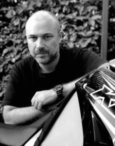

# sesion-04b

-29-08-2025

Día de la presentación de proyectos no pude poner mucha atención en las exposiciones de mis compañeros, ya que estaba nervioso porque me tocaba presentar casi al final, en la penúltima posición.

## Encargo

Investigar la poesía y el trabajo de las poetas Allison Parrish, Nick Montfort y Martín Gubbins.

### Martín Gubbins

Martín Gubbins (Santiago, 1971) es un poeta, artista visual y sonoro chileno. Su trabajo cruza poesía, artes visuales, sonido y performance, explorando nuevas formas de lenguaje.

### Relevancia

- Figura clave de la poesía experimental en Chile y Latinoamérica.

- Fundador del Foro de Escritores y del Festival Poesía y Música PM.

- Autor de la bandera chilena negra, que se convirtió en símbolo del estallido social de 2019.

### Obras destacadas

- Libros: Álbum (2005), Escalas (2011), Alfabeto (2017), Caminos Australes (2019).

- Discos de poesía sonora: Bastallaga (2011), Feedback (2014).

---

### Nick Montfort

Nick Montfort es un poeta, programador y profesor en el MIT, reconocido como uno de los principales referentes en literatura generada por computadora y ficción interactiva. Su trabajo une arte, código y medios digitales, explorando nuevas formas de escritura y narrativa.

### Relevancia de Nick Montfort

- Pionero en la literatura electrónica y la poesía generativa.

- Autor influyente en el estudio de la ficción interactiva y en la investigación sobre plataformas digitales.

- Ha inspirado la creación y el análisis crítico de obras que combinan programación y arte.

### Algunas de sus obras destacadas

- Twisty Little Passages (2003) → estudio fundamental sobre ficción interactiva.

- Racing the Beam (2009, con Ian Bogost) → análisis del Atari 2600.

- 10 PRINT CHR$(205.5+RND(1)); : GOTO 10 (2012) → libro colectivo sobre código y cultura.

---

### Allison Parrish

Allison Parrish es una poeta, programadora creativa y profesora en la NYU (ITP), conocida por explorar la relación entre lenguaje y computación.

### Relevancia de Allison Parrish

- Referente en poesía computacional y literatura electrónica.

- Elegida “Mejor creadora de bots de poesía” por The Village Voice (2016).

- Ganó el Maverick Award de la Electronic Literature Organization (2024).

### Obras destacadas de Allison Parrish

- @Everyword (2007–2014) → bot que tuiteó todas las palabras del inglés, luego publicado en libro.

- Rewordable (2017) → juego de mesa de palabras.

- Articulations (2018) → poesía generada algorítmicamente.

- Compasses (2021) → zine poético premiado en Ars Electronica.

### Bibliografía

Martín Gubbins

<https://www.faadworkshop.com/martin-gubbins>

<https://www.ilposto.cl/artistas-de-la-coleccion/martin-gubbins>

<https://martingubbins.cl/obra>

Nick Montfort

<https://nickm-com.translate.goog/me.html?_x_tr_sl=en&_x_tr_tl=es&_x_tr_hl=es&_x_tr_pto=tc>

<https://cmsw.mit.edu/profile/nick-montfort>

<https://www.poetryfoundation.org/poets/nick-montfort>

Allison Parrish

<https://www-decontextualize-com.translate.goog/?_x_tr_sl=en&_x_tr_tl=es&_x_tr_hl=es&_x_tr_pto=tc>

<https://tisch.nyu.edu/about/directory/itp/853082171.html>

<https://www.temporal-communities.de/fellows/parrish/index.html>

<https://itp.nyu.edu/ima/news-allison-parrish-itp-faculty-announced-as-winner-of-the-elo-mav>
