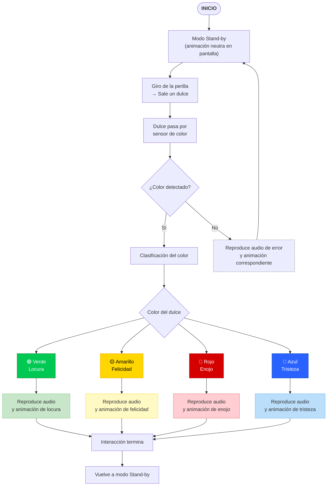

# sesion-07b

-26-09-2025

## Apuntes de clase

Para comenzar con el proyecto, primero debemos crear un **pseudocódigo** que describa las acciones principales que queremos implementar.  
Esto servirá como **base de desarrollo** y guía para la estructura del código.

---

### Inicio del proyecto

Para iniciar el proyecto, se definen los archivos base que organizarán las diferentes partes del código.  
**Ejemplo de estructura:**

- `creditos.ino` → Información del proyecto y autores.  
- `cableado.ino` → Conexiones de pines y diagramas.  
- `sensorColor.ino` → Lectura y manejo del sensor de color.  
- `sensoresActuadores.ino` → Control general de sensores y actuadores.  

---

#### Proyecto: Dispensador de Dulces Emocionales

¿De qué se trata nuestro proyecto?

El proyecto consiste en un **dispensador de dulces de colores**, donde **cada color representa una emoción** y al mismo tiempo **reproduce un audio** correspondiente a esa emoción.  
El objetivo es **crear una experiencia interactiva y expresiva**, combinando color, sonido y animación.

---

Significado de los colores y audios

| Color | Emoción | Audio representativo |
|:------|:---------|:---------------------|
| 🟢 Verde | **Locura** | “Si el dulce sale envenenado no es mi culpa.” *(ejemplo)* |
| 🟡 Amarillo | **Felicidad** | “Ten tu dulce, que tengas bonito día.” *(ejemplo)* |
| 🔴 Rojo | **Enojo** | “Toma tu dulce y ándate.” *(ejemplo)* |
| 🔵 Azul | **Tristeza** | “No te lleves mi dulcesito, por favor.” *(ejemplo)* |

---

Diseño del dispensador

El dispensador tiene **forma de monstruo**, lo que le da una apariencia lúdica y expresiva.  
Además, incorpora una **pantalla** que muestra **animaciones vinculadas a las emociones** de los colores.

- En **modo standby**, la pantalla muestra una animación neutra o de espera.  
- Cuando **cae un dulce**, la animación cambia para reflejar **la emoción asociada al color** detectado.

---

Objetivo general

Crear una instalación interactiva que combine **hardware (sensores y actuadores)**, **diseño visual**, **audio emocional** y **programación creativa**, para explorar cómo la tecnología puede expresar emociones a través de la forma, el color y el sonido.

---

##### Encargo 14

Diagrama de flujo del proyecto



---

###### Codigo Base Sensor Color
 - https://cursos.mcielectronics.cl/2022/12/26/interfaz-del-sensor-de-color-tcs230-tcs3200-con-arduino

```cpp
// Define color sensor pins
#define S0 4
#define S1 5
#define S2 6
#define S3 7
#define sensorOut 8

// Variables for Color Pulse Width Measurements
int redPW = 0;
int greenPW = 0;
int bluePW = 0;

void setup() {
	// Set S0 - S3 as outputs
	pinMode(S0, OUTPUT);
	pinMode(S1, OUTPUT);
	pinMode(S2, OUTPUT);
	pinMode(S3, OUTPUT);

	// Set Pulse Width scaling to 20%
	digitalWrite(S0,HIGH);
	digitalWrite(S1,LOW);

	// Set Sensor output as input
	pinMode(sensorOut, INPUT);

	// Setup Serial Monitor
	Serial.begin(9600);
}

void loop() {
	// Read Red Pulse Width
	redPW = getRedPW();
	// Delay to stabilize sensor
	delay(200);

	// Read Green Pulse Width
	greenPW = getGreenPW();
	// Delay to stabilize sensor
	delay(200);

	// Read Blue Pulse Width
	bluePW = getBluePW();
	// Delay to stabilize sensor
	delay(200);

	// Print output to Serial Monitor
	Serial.print("Red PW = ");
	Serial.print(redPW);
	Serial.print(" - Green PW = ");
	Serial.print(greenPW);
	Serial.print(" - Blue PW = ");
	Serial.println(bluePW);
}


// Function to read Red Pulse Widths
int getRedPW() {
	// Set sensor to read Red only
	digitalWrite(S2,LOW);
	digitalWrite(S3,LOW);
	// Define integer to represent Pulse Width
	int PW;
	// Read the output Pulse Width
	PW = pulseIn(sensorOut, LOW);
	// Return the value
	return PW;
}

// Function to read Green Pulse Widths
int getGreenPW() {
	// Set sensor to read Green only
	digitalWrite(S2,HIGH);
	digitalWrite(S3,HIGH);
	// Define integer to represent Pulse Width
	int PW;
	// Read the output Pulse Width
	PW = pulseIn(sensorOut, LOW);
	// Return the value
	return PW;
}

// Function to read Blue Pulse Widths
int getBluePW() {
	// Set sensor to read Blue only
	digitalWrite(S2,LOW);
	digitalWrite(S3,HIGH);
	// Define integer to represent Pulse Width
	int PW;
	// Read the output Pulse Width
	PW = pulseIn(sensorOut, LOW);
	// Return the value
	return PW;
}
```
---

###### Detección de colores

Para que el sensor pueda **reconocer diferentes colores**, se utilizan una serie de condiciones `if` que comparan los valores de frecuencia (ancho de pulso) obtenidos por cada canal: **rojo**, **verde** y **azul**.  

Cada color tiene una **combinación característica de frecuencias**, y al aproximarse a esos valores, el sistema identifica de qué color se trata.

---

Código de detección de color

```cpp
// --- DETECCIÓN DE COLORES ---
if (cercaDe(rojoPW, 302) && cercaDe(verdePW, 128) && cercaDe(azulPW, 235)) {
  Serial.println("Detecté VERDE");
}
else if (cercaDe(rojoPW, 297) && cercaDe(verdePW, 136) && cercaDe(azulPW, 247)) {
  Serial.println("Detecté AMARILLO");
}
else if (cercaDe(rojoPW, 455) && cercaDe(verdePW, 333) && cercaDe(azulPW, 274)) {
  Serial.println("Detecté ROJO");
}
else if (cercaDe(rojoPW, 266) && cercaDe(verdePW, 384) && cercaDe(azulPW, 162)) {
  Serial.println("Detecté AZUL");
}
else {
  Serial.println("No detecto nada");
}
```

####### Explicación del funcionamiento

- **`rojoPW`, `verdePW`, `azulPW`** → Son los valores de frecuencia medidos por el sensor de color en cada canal (**Red**, **Green**, **Blue**).  
- **`cercaDe(valor, referencia)`** → Es una función auxiliar que compara si el valor leído está dentro de un rango aceptable respecto a una referencia.  
- Cada bloque `if` representa una **combinación aproximada de frecuencias** que corresponde a un color detectado.  

Si ninguna condición se cumple, el programa imprime **"No detecto nada"**, indicando que **no se reconoció ningún color válido**.
