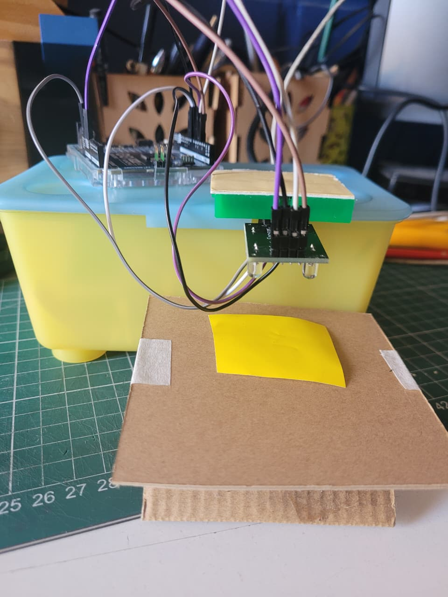
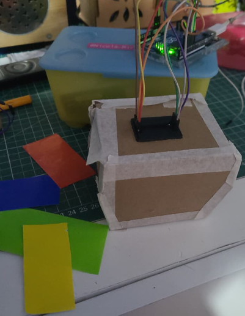

# sesion-08a

-30-09-2025

##  Trabajo en clases
Avance en el proyecto N°2



###  Calibración y estabilidad del sensor de color

Durante las primeras pruebas, los **valores de frecuencia** entregados por el sensor eran **muy altos** y **variaban según la luz ambiental**, lo que hacía que el sistema fuera **demasiado sensible** e inestable.

Para solucionar este problema:

- Se diseñó un **protector impreso en 3D** ([modelo obtenido desde una fuente externa](https://cults3d.com/es/modelo-3d/artilugios/color-sensor-for-smars)) que cubre el sensor y evita la entrada de luz externa.  
- Luego se realizaron **pruebas en un espacio oscuro**, lo que permitió obtener **lecturas más estables y precisas**.



Durante las pruebas, notamos que los valores de frecuencia del sensor eran muy altos y resultaba difícil diferenciar los colores. Para solucionarlo, decidimos limitar el valor máximo mediante una función que nos ayudó a implementar un amigo [@adrianalessandro](https://github.com/adrianalessandro).

```cpp
// Función de normalización
// Convierte el valor leído en un rango de 0 a 300
int normalizar(int valor, int maximoEntrada) {
  if (valor > maximoEntrada) valor = maximoEntrada;   // limitar al máximo
  return (valor * 300) / maximoEntrada;               // escalar proporcionalmente
```

Con la configuración anterior, los colores amarillo y verde daban valores casi iguales, lo que dificultaba su diferenciación. Por eso, decidimos reducir aún más el valor máximo a 10, logrando así obtener mediciones mucho más estables.

```cpp
// Función de normalización
// Convierte el valor leído en un rango de 0 a 300
int normalizar(int valor, int maximoEntrada) {
  if (valor > maximoEntrada) valor = maximoEntrada;   // limitar al máximo
  return (valor * 10) / maximoEntrada;               // escalar proporcionalmente
```

Por último, ordenamos el código para que fuera más claro y fácil de entender.

```cpp
// Pines del sensor
#define S0 2
#define S1 3
#define S2 4
#define S3 5
#define salidaSensorOut 6
#define OE 7   // Pin para activar/desactivar el sensor

// Variables para medir el ancho de pulso (valores de colores)
int rojoPW = 0;
int verdePW = 0;
int azulPW = 0;

// Función de normalización
// Convierte el valor leído en un rango de 0 a 10
int normalizar(int valor, int maximoEntrada) {
  if (valor > maximoEntrada) valor = maximoEntrada;   // limitar al máximo
  return (valor * 10) / maximoEntrada;               // escalar proporcionalmente
}

void setup() {
  pinMode(S0, OUTPUT);
  pinMode(S1, OUTPUT);
  pinMode(S2, OUTPUT);
  pinMode(S3, OUTPUT);
  pinMode(OE, OUTPUT);

  // Escala de frecuencia al 20%
  digitalWrite(S0, HIGH);
  digitalWrite(S1, LOW);

  // Activar el sensor
  digitalWrite(OE, LOW);

  pinMode(salidaSensorOut, INPUT);

  Serial.begin(9600);
}

void loop() {
  // Leer valores de cada color (normalizados)
  rojoPW = leerRojo();
  delay(100);

  verdePW = leerVerde();
  delay(100);

  azulPW = leerAzul();
  delay(100);

  // Mostrar lecturas
  Serial.print("Rojo = ");
  Serial.print(rojoPW);
  Serial.print("  Verde = ");
  Serial.print(verdePW);
  Serial.print("  Azul = ");
  Serial.println(azulPW);

  // DETECCIÓN DE COLORES
  if (cercaDe(rojoPW, 3) && cercaDe(verdePW, 1) && cercaDe(azulPW, 2)) {
    Serial.println("Detecté VERDE");
  }
  else if (cercaDe(rojoPW, 2) && cercaDe(verdePW, 1) && cercaDe(azulPW, 1)) {
    Serial.println("Detecté AMARILLO");
  }
  else if (cercaDe(rojoPW, 4) && cercaDe(verdePW, 3) && cercaDe(azulPW, 2)) {
    Serial.println("Detecté ROJO");
  }
  else if (cercaDe(rojoPW, 2) && cercaDe(verdePW, 3) && cercaDe(azulPW, 1)) {
    Serial.println("Detecté AZUL");
  }
  else {
    Serial.println("No detecto nada");
  }

  delay(200);
}

// Funciones de lectura con normalización
int leerRojo() {
  digitalWrite(S2, LOW);
  digitalWrite(S3, LOW);
  int valor = pulseIn(salidaSensorOut, LOW);
  return normalizar(valor, 2000);  // Ajusta 2000 al máximo real de tu sensor
}

int leerVerde() {
  digitalWrite(S2, HIGH);
  digitalWrite(S3, HIGH);
  int valor = pulseIn(salidaSensorOut, LOW);
  return normalizar(valor, 2000);
}

int leerAzul() {
  digitalWrite(S2, LOW);
  digitalWrite(S3, HIGH);
  int valor = pulseIn(salidaSensorOut, LOW);
  return normalizar(valor, 2000);
}

// Función auxiliar para comparación aproximada
bool cercaDe(int valor, int objetivo) {
  return abs(valor - objetivo) <= 1;
}
```
