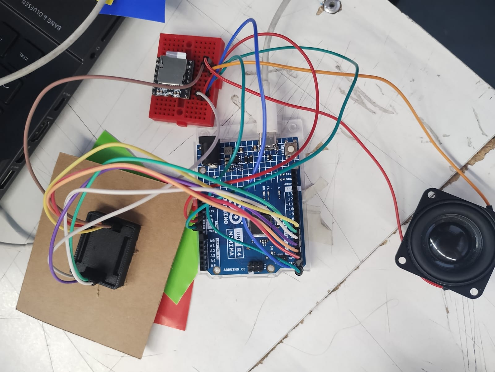

# sesion-09a

En clase, junto a **Miguel**, conectamos el **sensor de color** y el **DFPlayer** en un mismo Arduino utilizando la **protoboard**.



Logramos realizar la conexión correctamente, pero en el código tuvimos problemas para **sincronizar la detección de colores** con la **reproducción de los audios**.

Finalmente, lo solucionamos **declarando la variable** `colorDetectado = readColor;`, lo que permitió vincular correctamente la lectura del color con el audio correspondiente.

```cpp
colorDetectado = readColor;

if (colorDetectado == 1) {
  myDFPlayer.playFolder(1, 1);
  Serial.print("Rojo detectado");
  // Rojo
} else if (colorDetectado == 2) {
  myDFPlayer.playFolder(2, 2);
  Serial.print("Azul detectado");
  // Azul
} else if (colorDetectado == 3) {
  myDFPlayer.playFolder(3, 3);
  Serial.print("Amarillo detectado");
  // Amarillo
} else if (colorDetectado == 4) {
  myDFPlayer.playFolder(4, 4);
  Serial.print("Verde detectado");
  // Verde
}

Clase 9a: 07/10 MÁQUINAS COMPUTACIONALES

Nota: iniciamos Viendo un ejemplo en arduino de nuestro grupo y como pasarlo a c++ ( Tomaron el ejemplo de Vania Paredes integrante de nuestro grupo para mostrar como deberia ordenarse el código.

## Trabajo en clases

Lo primero que hicimos fue ver en qué íbamos hasta ahora: una recopilación de logros y fracasos, para así buscar soluciones juntas. Millaray nos mostró el primer prototipo de nuestro "robot contador de datos curiosos", el cual nos pareció muy tierno. Pasamos el código que teníamos para hacer funcionar el módulo reproductor junto con el servo motor al computador de Vania. Ordenamos los códigos antes de pasarlos, quitando cosas que no eran necesarias y poniéndoles una descripción a cada acción. Así, prueba tras prueba, mis compañeras lograron encontrar la forma de unir parte del código para que pudiera generar la acción.

En paralelo, fuimos resolviendo ciertas cosas del prototipo físico, como qué cosas queríamos añadirle, qué no nos convencía, cómo solucionábamos que la bocina tuviera un lugar dentro del robot y cómo hacíamos funcionar el motor DC para que este vibrara (como nos lo habíamos planteado anteriormente). Entonces sacamos papel y lápiz y manos a la obra: dibujamos posibles ejemplos de cómo debería ir incorporado.

Buscamos cuánto resistía el motor, lo cual, según AFEL y sus especificaciones, podía llegar a resistir de 3V a 6V, por lo cual determinamos que tal vez sería necesario que la carcasa del robot no tuviera tanto peso. Teniendo en cuenta lo que queríamos lograr, planteamos que la vibración se generara en la plataforma, mediante una estructura base que subiera y bajara a diferentes velocidades para dar el efecto deseado.

Luego pasamos a considerar que el cuerpo del robot podía llegar a ser muy pequeño, y aún nos faltaba incorporar la bocina y el motor DC. Nos dimos cuenta de que dentro del prototipo faltaría un espacio que podría ser un sacado para que el motor quedara fijo y no se moviera, porque eso podía cambiar la dirección del brazo, lo cual no queríamos que se interpretara de una forma rara.

A la base le pondremos el codo pegado al cuerpo para que solo se mueva el antebrazo, por la misma razón anterior. Valentina nos comentó que también tenía el vibrador del joystick, que tal vez podríamos usar en vez del motor DC, así que decidimos que íbamos a probar ambas opciones y ver qué sucedía. Sin embargo, según los parámetros, no nos convencía, así que decidimos probar otro y aumentar la distancia, ya que esta podía influir mucho en el resultado.
