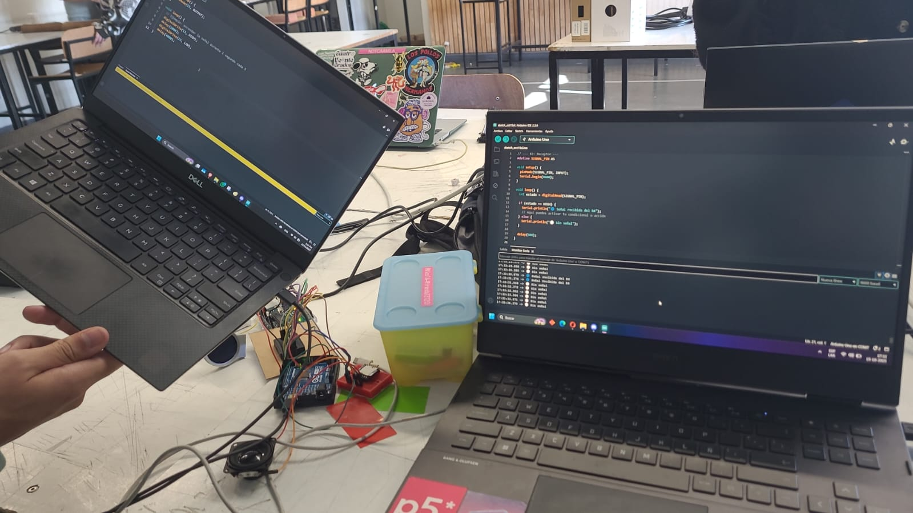
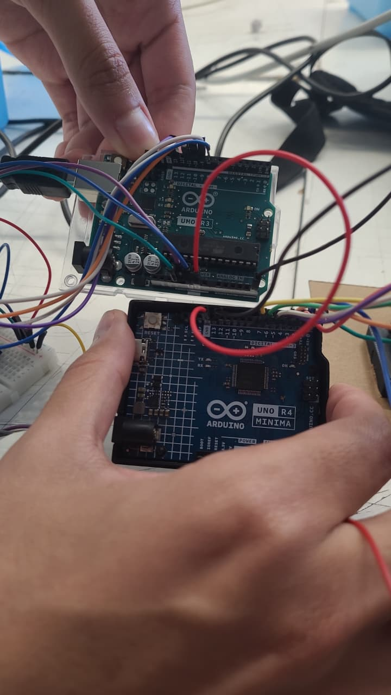

# sesion-09b

Durante la clase con **Missa**, intentamos **conectar la pantalla al Arduino R3**, ya que en el **Arduino R4** no fue posible hacerlo.

Después trabajamos en **conectar el sensor de color y el módulo de audio** a la pantalla en el **Arduino R3**, pero no se logró debido a **problemas con las conexiones USB y el cableado**.


Más tarde, **@SebastianSaez1003** nos ayudó a establecer la **comunicación entre los dos Arduinos**:  
- Un **Arduino R4** conectado desde su **pin 13** hacia el **pin A5 del Arduino R3**.  
- Ambos Arduinos conectados a **GND común** para compartir referencia de voltaje.




Finalmente, programamos el sistema para que **el Arduino R4 envíe una señal desde el pin 13** cuando el **audio comienza a reproducirse**, y **desactive la señal** cuando el audio finaliza.  
De esta forma, la pantalla en el R3 **se enciende o apaga sincronizadamente con el audio**.

**Código:**
```cpp
// Señal enviada desde el Arduino R4 al R3
digitalWrite(13, HIGH);  // Enciende la pantalla al iniciar el audio
// ...
digitalWrite(13, LOW);   // Apaga la pantalla al finalizar el audio
