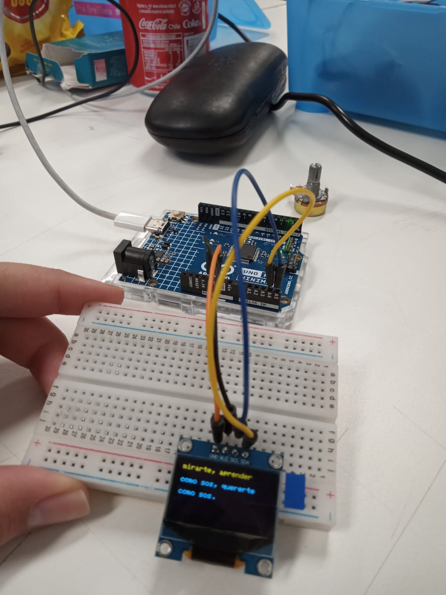

# sesion-04a ⋆˚꩜｡

## Bitácora – Clase sobre Potenciómetro

### Potenciómetro ⋆˙⟡

+ El valor mínimo que entrega es **0** y el máximo es **1023**.
  
+ Se **escribe en digital** y se **lee en analógico**.

────୨ৎ────

## Observación en clases ᯓ★

.☘︎ ݁˖ En esta sesión trabajamos con un código al que integramos un fragmento del poema de Mario Benedetti *“Táctica y estrategia”*.  

El objetivo era lograr que, mediante el uso de un **potenciómetro**, pudiéramos navegar o desplazarnos en la lectura del poema en la pantalla.

┆ Durante la clase enfrentamos algunas dificultades:  

+ Dudas sobre si el código contenía errores.
  
+ Incertidumbre respecto a la correcta colocación de los cables en la protoboard.
  
+ Identificación de los pines adecuados para conectar la pantalla y el potenciómetro.  

Finalmente, logramos resolver los problemas y alcanzamos el resultado esperado. Como grupo, cada integrante ha investigado qué hacer y qué códigos usar para trabajar con imágenes y texto, siempre manteniendo una dinámica de conversación y retroalimentación constante. Esto nos ha permitido avanzar de manera sólida en equipo.

**｡𖦹°‧ Fragmento del poema utilizado:**  

<https://www.poemas-del-alma.com/tactica-y-estrategia.htm>

────୨ৎ────

### Código utilizado en clase

```cpp
// declarar valor
// inicializar 0

int valorPot;

void setup() {
    Serial.begin(9600);
}

void loop() {
    // leer el valor analógico
    valorPot = analogRead(A0);

}
```

### Código hecho por nosotras

```cpp
#include <Wire.h>
#include <Adafruit_GFX.h>
#include <Adafruit_SSD1306.h>

// Esta es la configuración de la pantalla
#define SCREEN_WIDTH 128 // Ancho de la pantalla OLED
#define SCREEN_HEIGHT 64 // Alto de la pantalla OLED
Adafruit_SSD1306 display(SCREEN_WIDTH, SCREEN_HEIGHT, &Wire, -1);

// Declaro Pin del potenciómetro
#define POT_PIN A0  

// Poema de Mario Benedetti – Fragmento de “Táctica y estrategia”
const char* poema[] = {
  "Mi tactica es",
  "mirarte, aprender",
  "como sos, quererte",
  "como sos.",
  "",
  "Mi estrategia es",
  "que un dia cualquiera",
  "no se como ni se",
  "con que pretexto,",
  "por fin me necesites."
};


const int numLineas = sizeof(poema) / sizeof(poema[0]);

// Variables de scroll
int offset = 0;  

void setup() {
  // Aquí Inicia la pantalla
  if (!display.begin(SSD1306_SWITCHCAPVCC, 0x3C)) {
    for (;;); // Si falla, quedara en bucle/loop
  }
  display.clearDisplay();
  display.setTextSize(1);      
  display.setTextColor(SSD1306_WHITE);
}

void loop() {
  // Leer valor del potenciómetro (0 - 1023)
  int valorPot = analogRead(POT_PIN);

  // Mapeo del valor a rango de líneas posibles
   // "numLineas - 4" porque en 64px caben aprox 4 líneas de texto tamaño 1
  offset = map(valorPot, 0, 1023, 0, numLineas - 4); 
 
  // Limpiar pantalla
  display.clearDisplay();
  display.setCursor(0, 0);

  // Mostrar 4 líneas del poema según el offset
  for (int i = 0; i < 4; i++) {
    int linea = offset + i;
    if (linea < numLineas) {
      // Espaciado de 16 px para que sea legible
      display.setCursor(0, i * 16);
      display.println(poema[linea]);
    }
  }
// Pequeño retardo para suavizar la lectura
  display.display();
  delay(100); 

}
```

### Imágenes del avance ⋆. 𐙚 ̊



