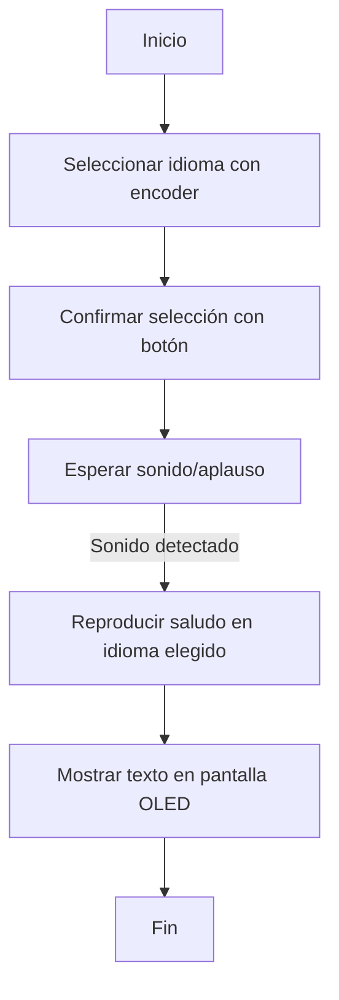

# sesion-07b ૮₍ ´ ꒳ `₎ა

## Programación ✶⋆.˚
+ **Próxima visita**: Cynthia Shuffer.  
+ **Cuidado con voltajes**:  
  + Vcc = voltaje positivo de alimentación.  
+ **Importancia de leer descripciones** y hacerse preguntas para comprender cada componente.  

## Referentes / Personajes ˙ . ꒷🍙 . 𖦹˙— 🐈‍⬛
+ [Rafael Benguria](https://es.wikipedia.org/wiki/Rafael_Benguria): inspiración del profe Aarón para “hacer el ridículo” y enseñar mejor.  

## Apuntes técnicos ☕︎₊⊹
+ Lo primero en código: **configurar un sensor creando una función** (en otra pestaña).  
+ Definir parámetros → pines, distancias mínimas/máximas, etc.  
+ Funciones pueden llamar a otras funciones en diferentes pestañas.  
+ **En pseudocódigo**:  
  + Se escriben funciones vacías → luego se completan con variables simples.  
  + “Murciélagos” (`{ }`) en lugar de punto y coma.  
+ Ejemplo: **sensor ultrasónico HC-SR04** → mide distancias.  

## Requisitos entrega final ୭˚. ᵎᵎ
+ Código **corto y limpio** (sin necesidad de deslizar).  
+ El resto en **otras pestañas**.  
+ Documentar: *qué se hizo* y *quién lo hizo*.  

──── ୨୧ ────

# Encargos – Clase 7B ૮₍ ´• ˕ •` ₎ა

## ✦ Encargo 7b-1
**Tarea:** Cada integrante debe hacer un **diagrama de flujo** (dibujado o con Mermaid.js) y subirlo a su README.  

### Ejemplo en Mermaid.js ˙𐃷˙

────୨ৎ────

## ✦ Encargo 7b-2
**Tarea:** Documentar el funcionamiento de los sensores, incluyendo **instrucciones de conexión y configuración**.  
Cada persona del grupo debe subir a su README el **proyecto completo de Arduino como carpeta**, asegurándose de que:  

+  Compile sin problemas.  
+  Muestre en consola los datos de los sensores.  

˙ . ꒷ 🪼 . 𖦹˙—

### Sensores utilizados ૮꒰˶ - ˕ -꒱ა

#### 1. Encoder rotativo KY-040 (con botón)  
+ **Función:** navegar por el menú y confirmar selección.  
+ **Conexión:** utiliza pines digitales (CLK, DT y SW) + alimentación (VCC, GND).  
+ **Referencia:** [Ficha técnica – Afel](https://afel.cl/products/encoder-rotatorio-ky-040-360-grados)  

#### 2. Pantalla OLED LCD 1.3" 128x64  
+ **Función:** mostrar el menú de idiomas y los saludos.  
+ **Conexión:** protocolo I2C (SDA, SCL + VCC, GND).  
+ **Referencia:** [Ficha técnica – Afel](https://afel.cl/products/pantalla-lcd-oled-1-3-128x64-caracteres-azules)  

#### 3. Sensor de sonido digital  
+ **Función:** detectar un ruido/aplauso para activar el saludo.  
+ **Conexión:** salida digital al Arduino (DO) + VCC y GND.  
+ **Referencia:** [Ficha técnica – Afel](https://afel.cl/products/sensor-sonido-digital)  

#### 4. Módulo reproductor MP3 DFPlayer Mini  
+ **Función:** reproducir audios de saludos según idioma seleccionado.  
+ **Conexión:** UART (TX, RX) + tarjeta microSD con archivos de audio + VCC y GND.  
+ **Referencia:** [Ficha técnica – Afel](https://afel.cl/products/modulo-reproductor-mp3-dfplayer-mini)  

୭˚. ᵎᵎ Subiré un zip con los codigós, los cuales ya fueron pasados por el arduino y ya no hay errores.

### Tabla de Conexiones Arduino ↔ Componentes 🎧ྀི♪⋆.✮

| Componente                         | Pin Arduino | Pin Componente | Descripción                                   |
|------------------------------------|-------------|----------------|-----------------------------------------------|
| **Encoder KY-040**                 | 2 (digital) | CLK            | Señal de reloj (giros)                        |
|                                    | 3 (digital) | DT             | Señal de datos (dirección de giro)            |
|                                    | 4 (digital) | SW             | Botón de selección                            |
|                                    | 5V          | VCC            | Alimentación                                  |
|                                    | GND         | GND            | Tierra                                        |
| **Pantalla OLED 1.3" (I2C)**       | A4 (SDA)    | SDA            | Comunicación I2C – datos                      |
|                                    | A5 (SCL)    | SCL            | Comunicación I2C – reloj                      |
|                                    | 5V          | VCC            | Alimentación                                  |
|                                    | GND         | GND            | Tierra                                        |
| **Sensor de Sonido Digital**       | 6 (digital) | DO             | Salida digital (detección de ruido/aplauso)   |
|                                    | 5V          | VCC            | Alimentación                                  |
|                                    | GND         | GND            | Tierra                                        |
| **Módulo Reproductor MP3 DFPlayer**| 7 (digital) | TX             | Comunicación serial (transmisión)             |
|                                    | 8 (digital) | RX             | Comunicación serial (recepción)               |
|                                    | 5V          | VCC            | Alimentación                                  |
|                                    | GND         | GND            | Tierra                                        |

