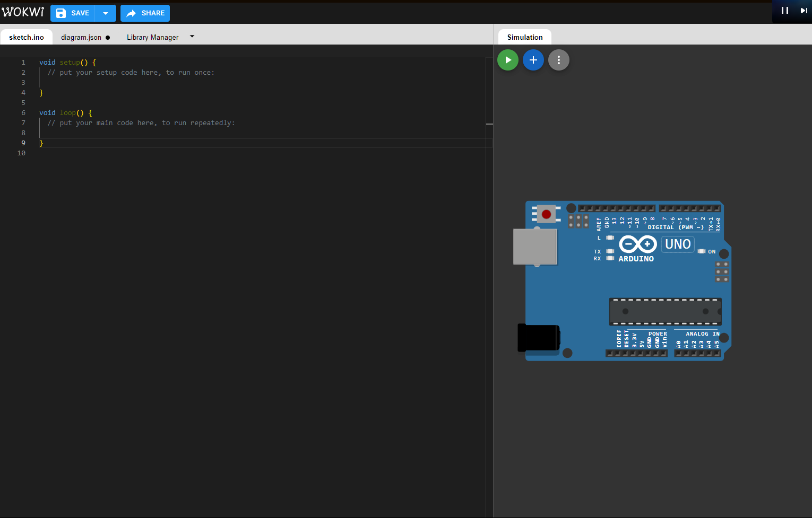
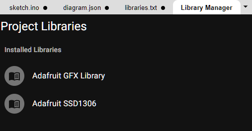
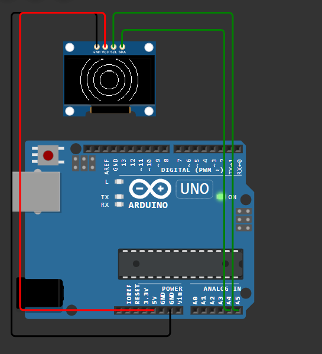

# sesion-03b

## Clase Online

Debido a las lluvias, la clase se realizó vía Zoom. Me metí tarde y tuve que ponerme al corriente.

### Apuntes

[Trabajamos en la página WOKWI](https://wokwi.com/projects/new/arduino-uno)

- Wokwi es una página para trabajar proyectos de Arduino en el compu. Sirve para simular circuito sin tener las piezas de verdad.



- La pantalla OLED que vamos a usar tiene cuatro pines principales. GND (tierra), VCC (energía) 5v. SCL y SDA, para la comunicación con el Arduino usando I²C.

- Instalar bibliotecas Adafruit GFX Library y Adafruit SSD1306



- Se mostró cómo poner imágenes en la pantalla usando un conversor de imágenes a código.

- Imagen a codigo [image2cpp](https://javl.github.io/image2cpp)

````CPP
#include <Wire.h>
#include <Adafruit_GFX.h>
#include <Adafruit_SSD1306.h>

#define SCREEN_WIDTH 128
#define SCREEN_HEIGHT 64
#define OLED_RESET -1
Adafruit_SSD1306 pantallita(SCREEN_WIDTH, SCREEN_HEIGHT, &Wire, OLED_RESET);

int contador = 0;

const unsigned  char rafita [] PROGMEM = {

  // 'rafita_2025', 128x64px
0xff, 0xff, 0xff, 0xff, 0xff, 0x81, 0xff, 0xff, 0xff, 0xff, 0xff, 0xff, 0xff, 0xff, 0xff, 0xff, 
0xff, 0xff, 0xff, 0xff, 0xf8, 0x00, 0x3f, 0xff, 0xff, 0xff, 0xff, 0xff, 0xff, 0xff, 0xff, 0xff, 
0xff, 0xff, 0xff, 0xff, 0xe0, 0x00, 0x07, 0xff, 0xff, 0xff, 0xff, 0xff, 0xff, 0xff, 0xff, 0xff, 
0xff, 0xff, 0xff, 0xff, 0x80, 0xff, 0x01, 0xff, 0xff, 0xff, 0xff, 0xff, 0xff, 0xff, 0xff, 0xff, 
0xff, 0xff, 0xff, 0xff, 0x07, 0xff, 0xe0, 0xff, 0xff, 0xff, 0xff, 0xff, 0xff, 0xff, 0xff, 0xff, 
0xff, 0xff, 0xff, 0xfe, 0x1f, 0xff, 0xf8, 0x3f, 0xff, 0xff, 0xff, 0xff, 0xf9, 0xff, 0xff, 0xff, 
0xff, 0xff, 0xff, 0xfc, 0x3f, 0xff, 0xfe, 0x0f, 0xff, 0xff, 0xff, 0xff, 0xe0, 0x7f, 0xff, 0xff, 
0xff, 0xff, 0xff, 0xf8, 0x7f, 0xff, 0xff, 0x07, 0xff, 0xff, 0xff, 0xff, 0xc0, 0x7f, 0xff, 0xff, 
0xff, 0xff, 0xff, 0xc0, 0xff, 0xff, 0xff, 0xc3, 0xff, 0xff, 0xff, 0xff, 0xc6, 0x3f, 0xff, 0xff, 
0xff, 0xff, 0xff, 0x80, 0xff, 0xff, 0xff, 0xf1, 0xff, 0xff, 0xff, 0xff, 0xc6, 0x3f, 0xff, 0xff, 
0xff, 0xff, 0xff, 0x0d, 0xff, 0xff, 0xff, 0xf8, 0xff, 0xff, 0xff, 0xff, 0xcf, 0x1f, 0xff, 0xff, 
0xff, 0xff, 0xfe, 0x1d, 0xff, 0xff, 0xff, 0xf8, 0x7f, 0xff, 0xff, 0xff, 0x8f, 0x1f, 0xff, 0xff, 
0xff, 0xff, 0xfc, 0x7b, 0xff, 0xff, 0xf7, 0xfc, 0x7f, 0xff, 0xff, 0xff, 0x8f, 0x1f, 0xff, 0xff, 
0xff, 0xff, 0xfc, 0x7b, 0xff, 0xff, 0xf7, 0xfe, 0x3f, 0xfe, 0x00, 0x1f, 0x0f, 0x3f, 0xff, 0xff, 
0xff, 0xff, 0xfc, 0xfb, 0xff, 0xff, 0xf7, 0xfe, 0x3f, 0xe0, 0x00, 0x03, 0x1e, 0x3f, 0xff, 0xff, 
0xff, 0xff, 0xf8, 0xfb, 0xff, 0xff, 0xf7, 0xfe, 0x3e, 0x00, 0x00, 0x00, 0x1e, 0x3f, 0xff, 0xff, 
0xff, 0xff, 0xf8, 0xfb, 0x3f, 0xff, 0xf7, 0xff, 0x00, 0x03, 0xff, 0xf0, 0x3c, 0x7f, 0xff, 0xff, 
0xff, 0xff, 0xf9, 0xfb, 0x3f, 0xff, 0xf7, 0xff, 0x00, 0x1f, 0xff, 0xfc, 0x7c, 0x7f, 0xff, 0xff, 
0xff, 0xff, 0xf1, 0xfb, 0xff, 0xf3, 0xf7, 0xff, 0x01, 0xff, 0xff, 0xfe, 0x78, 0xff, 0xff, 0xff, 
0xff, 0xff, 0xf1, 0xfb, 0xff, 0xf3, 0xf3, 0xff, 0x7f, 0xff, 0xff, 0xff, 0xb0, 0xff, 0xff, 0xff, 
0xff, 0xff, 0xf1, 0xfb, 0xff, 0xff, 0xfb, 0xff, 0x7f, 0xff, 0xff, 0xff, 0xc1, 0xff, 0xff, 0xff, 
0xff, 0xff, 0xf1, 0xff, 0xc3, 0xff, 0xfb, 0xff, 0x7f, 0xff, 0xff, 0xff, 0xe3, 0xff, 0xff, 0xff, 
0xff, 0xff, 0xf9, 0xf7, 0xc3, 0xff, 0xfd, 0xff, 0x7f, 0xff, 0xff, 0xff, 0xf1, 0xff, 0xff, 0xff, 
0xff, 0xff, 0xf8, 0xf7, 0xe7, 0xff, 0xfd, 0xfe, 0xff, 0xff, 0xff, 0xff, 0xf1, 0xff, 0xff, 0xff, 
0xff, 0xff, 0xfc, 0x07, 0xff, 0xff, 0xfe, 0x79, 0xff, 0xff, 0xff, 0xff, 0xf8, 0xff, 0xff, 0xff, 
0xff, 0xff, 0xfc, 0x07, 0xff, 0xff, 0xff, 0x03, 0xff, 0xff, 0xff, 0xff, 0xf8, 0xff, 0xff, 0xff, 
0xff, 0xff, 0xff, 0x87, 0xbf, 0xff, 0xff, 0xff, 0xff, 0xff, 0xff, 0xff, 0xf8, 0xff, 0xff, 0xff, 
0xff, 0xff, 0xff, 0xe3, 0xc0, 0x7f, 0xff, 0xff, 0xff, 0xff, 0xff, 0xff, 0xfc, 0xff, 0xff, 0xff, 
0xff, 0xff, 0xff, 0xe1, 0xff, 0xff, 0xff, 0xff, 0xff, 0xff, 0xff, 0xff, 0xfc, 0xff, 0xff, 0xff, 
0xff, 0xff, 0xff, 0xf1, 0xff, 0xff, 0xff, 0xff, 0xff, 0xff, 0xff, 0xff, 0xfc, 0xff, 0xff, 0xff, 
0xff, 0xff, 0xff, 0xf8, 0xff, 0xff, 0xff, 0xff, 0xff, 0xff, 0xff, 0xff, 0xfc, 0xff, 0xff, 0xff, 
0xff, 0xff, 0xff, 0xf8, 0x3f, 0xff, 0xff, 0xff, 0xff, 0xff, 0xff, 0xff, 0xfc, 0xff, 0xff, 0xff, 
0xff, 0xff, 0xff, 0xfc, 0x03, 0xff, 0xff, 0xff, 0xff, 0xff, 0xff, 0xff, 0xf8, 0xff, 0xff, 0xff, 
0xff, 0xff, 0xff, 0xff, 0x00, 0x1f, 0xff, 0xff, 0xff, 0xff, 0xff, 0xff, 0xf8, 0xff, 0xff, 0xff, 
0xff, 0xff, 0xff, 0xff, 0xe0, 0x3f, 0xff, 0xff, 0xff, 0xff, 0xff, 0xff, 0xf8, 0xff, 0xff, 0xff, 
0xff, 0xff, 0xff, 0xff, 0xfe, 0x3f, 0xff, 0xff, 0xff, 0xff, 0xff, 0xff, 0xf9, 0xff, 0xff, 0xff, 
0xff, 0xff, 0xff, 0xff, 0xff, 0x1f, 0xff, 0xff, 0xff, 0xff, 0xff, 0xff, 0xf1, 0xff, 0xff, 0xff, 
0xff, 0xff, 0xff, 0xff, 0xff, 0x1f, 0xff, 0xff, 0xff, 0xff, 0xff, 0xff, 0xf0, 0xff, 0xff, 0xff, 
0xff, 0xff, 0xff, 0xff, 0xfe, 0x1f, 0xff, 0xff, 0xff, 0xff, 0xff, 0xff, 0xf8, 0xff, 0xff, 0xff, 
0xff, 0xff, 0xff, 0xff, 0xfc, 0x1f, 0xff, 0xff, 0xff, 0xff, 0xff, 0xff, 0xfc, 0x7f, 0xff, 0xff, 
0xff, 0xff, 0xff, 0xff, 0xf8, 0x6f, 0xff, 0xff, 0xff, 0xff, 0xff, 0xbf, 0xfc, 0x7f, 0xff, 0xff, 
0xff, 0xff, 0xff, 0xff, 0xe0, 0xf7, 0xff, 0xff, 0xff, 0xff, 0xff, 0xbf, 0xfe, 0x3f, 0xff, 0xff, 
0xff, 0xff, 0xff, 0xff, 0x81, 0xf3, 0xff, 0xff, 0xff, 0xff, 0xff, 0xbf, 0xff, 0x1f, 0xff, 0xff, 
0xff, 0xff, 0xff, 0xff, 0x03, 0xf9, 0xff, 0xff, 0xff, 0xff, 0xff, 0xbf, 0xff, 0x1f, 0xff, 0xff, 
0xff, 0xff, 0xff, 0xfe, 0x3f, 0xfc, 0xff, 0xff, 0xff, 0xff, 0xff, 0xdf, 0xff, 0x9f, 0xff, 0xff, 
0xff, 0xff, 0xff, 0xfe, 0x3f, 0xfe, 0x7f, 0xff, 0xff, 0xff, 0xff, 0xdf, 0xff, 0x8f, 0xff, 0xff, 
0xff, 0xff, 0xff, 0xfe, 0x77, 0xff, 0x1f, 0xff, 0x7f, 0xff, 0xff, 0x8f, 0xff, 0x8f, 0xff, 0xff, 
0xff, 0xff, 0xff, 0xfe, 0x2f, 0xff, 0x0f, 0xfe, 0x7f, 0xff, 0xfe, 0x77, 0xff, 0x8f, 0xff, 0xff, 
0xff, 0xff, 0xff, 0xfe, 0x1c, 0xfe, 0x07, 0xfe, 0xff, 0xff, 0xf1, 0xf3, 0xff, 0x8f, 0xff, 0xff, 
0xff, 0xff, 0xff, 0xfe, 0x19, 0xfc, 0x0f, 0xfe, 0xff, 0xf0, 0x0f, 0xf8, 0xff, 0xcf, 0xff, 0xff, 
0xff, 0xff, 0xff, 0xff, 0x0b, 0xf8, 0x0f, 0xfe, 0x00, 0x00, 0x0f, 0xf8, 0xff, 0x8f, 0xff, 0xff, 
0xff, 0xff, 0xff, 0xff, 0x83, 0xf0, 0x1f, 0xfc, 0x00, 0x00, 0x0f, 0xf8, 0xdb, 0x8f, 0xff, 0xff, 
0xff, 0xff, 0xff, 0xff, 0xc0, 0x00, 0x1f, 0xfc, 0x00, 0x7f, 0xc7, 0xf8, 0xdb, 0x8f, 0xff, 0xff, 
0xff, 0xff, 0xff, 0xff, 0xe0, 0x00, 0x3f, 0xfc, 0x7f, 0xff, 0xc7, 0xf8, 0x5b, 0x8f, 0xff, 0xff, 
0xff, 0xff, 0xff, 0xff, 0xf8, 0x08, 0x7f, 0xf8, 0xff, 0xff, 0xc7, 0xfc, 0x4d, 0x1f, 0xff, 0xff, 
0xff, 0xff, 0xff, 0xff, 0xff, 0xf8, 0xef, 0xf8, 0xff, 0xff, 0x8f, 0xfc, 0x08, 0x3f, 0xff, 0xff, 
0xff, 0xff, 0xff, 0xff, 0xff, 0xf8, 0xdf, 0xf1, 0xff, 0xff, 0x8d, 0xb8, 0x00, 0x7f, 0xff, 0xff, 
0xff, 0xff, 0xff, 0xff, 0xff, 0xf8, 0xb9, 0xf1, 0xff, 0xff, 0x8d, 0xb8, 0x00, 0xff, 0xff, 0xff, 
0xff, 0xff, 0xff, 0xff, 0xff, 0xf8, 0x37, 0xe3, 0xff, 0xff, 0xcd, 0xb0, 0xff, 0xff, 0xff, 0xff, 
0xff, 0xff, 0xff, 0xff, 0xff, 0xfc, 0x37, 0xc7, 0xff, 0xff, 0xc5, 0x81, 0xff, 0xff, 0xff, 0xff, 
0xff, 0xff, 0xff, 0xff, 0xff, 0xfe, 0x0f, 0x07, 0xff, 0xff, 0xc0, 0x03, 0xff, 0xff, 0xff, 0xff, 
0xff, 0xff, 0xff, 0xff, 0xff, 0xff, 0x00, 0x0f, 0xff, 0xff, 0xe0, 0x07, 0xff, 0xff, 0xff, 0xff, 
0xff, 0xff, 0xff, 0xff, 0xff, 0xff, 0x80, 0x3f, 0xff, 0xff, 0xf8, 0x3f, 0xff, 0xff, 0xff, 0xff, 
0xff, 0xff, 0xff, 0xff, 0xff, 0xff, 0xf0, 0xff, 0xff, 0xff, 0xff, 0xff, 0xff, 0xff, 0xff, 0xff
};

const unsigned char akrilla [] PROGMEM = {
  // 'akrilla', 128x64px
0xff, 0xc0, 0x00, 0x00, 0x00, 0x01, 0x00, 0x00, 0x00, 0x0f, 0x80, 0x00, 0x03, 0xff, 0xff, 0xe0, 
0xff, 0xc0, 0x00, 0x00, 0x00, 0x00, 0x00, 0x00, 0x00, 0x0e, 0x80, 0x00, 0x03, 0xff, 0xff, 0xe0, 
0xff, 0xc0, 0x00, 0x00, 0x00, 0x02, 0x00, 0x00, 0x00, 0x1f, 0x80, 0x00, 0x07, 0xff, 0xff, 0xf0, 
0xff, 0x80, 0x00, 0x00, 0x00, 0x00, 0x00, 0x00, 0x00, 0x1b, 0xa0, 0x00, 0x07, 0xff, 0xff, 0xf0, 
0xff, 0x80, 0x00, 0x00, 0x00, 0x00, 0x00, 0x00, 0x00, 0x1f, 0x60, 0x00, 0x07, 0xff, 0xff, 0xf0, 
0xff, 0x80, 0x00, 0x00, 0x00, 0x00, 0x00, 0x00, 0x00, 0x1f, 0x60, 0x00, 0x07, 0xff, 0xff, 0xf0, 
0xff, 0x00, 0x00, 0x00, 0x00, 0x00, 0x00, 0x00, 0x00, 0x3f, 0x70, 0x00, 0x07, 0xff, 0xff, 0xf0, 
0xff, 0x00, 0x00, 0x00, 0x00, 0x00, 0x00, 0x00, 0x00, 0x3f, 0xf0, 0x00, 0x07, 0xff, 0xff, 0xf0, 
0xff, 0x00, 0x00, 0x00, 0x00, 0x00, 0x00, 0x00, 0x00, 0x7e, 0xf0, 0x00, 0x0f, 0xff, 0xff, 0xf0, 
0xff, 0x00, 0x00, 0x00, 0x00, 0x00, 0x00, 0x00, 0x00, 0x7e, 0xf8, 0x00, 0x0f, 0xff, 0xff, 0xf8, 
0xff, 0x00, 0x00, 0x00, 0x00, 0x00, 0x00, 0x00, 0x00, 0x7f, 0xf8, 0x00, 0x0f, 0xff, 0xff, 0xf8, 
0xfe, 0x00, 0x00, 0x00, 0x00, 0x00, 0x00, 0x00, 0x00, 0x7f, 0xf8, 0x00, 0x0f, 0xff, 0xff, 0xf8, 
0xfe, 0x00, 0x00, 0x00, 0x00, 0x00, 0x00, 0x00, 0x00, 0xff, 0xfc, 0x00, 0x0f, 0xff, 0xff, 0xf8, 
0xfe, 0x00, 0x00, 0x00, 0x00, 0x00, 0x00, 0x00, 0x00, 0xff, 0xfc, 0x00, 0x0f, 0xff, 0xff, 0xf8, 
0xfe, 0x00, 0x00, 0x00, 0x00, 0x00, 0x00, 0x00, 0x01, 0xff, 0xfc, 0x00, 0x0f, 0xff, 0xff, 0xf8, 
0xfe, 0x00, 0x00, 0x00, 0x00, 0x00, 0x00, 0x00, 0x00, 0xff, 0xfc, 0x00, 0x0f, 0xff, 0xff, 0xf8, 
0xfe, 0x00, 0x00, 0x00, 0x00, 0x00, 0x00, 0x00, 0x01, 0xff, 0xfc, 0x00, 0x0f, 0xff, 0xff, 0xf8, 
0xfc, 0x00, 0x00, 0x00, 0x00, 0x00, 0x00, 0x00, 0x01, 0xff, 0xfe, 0x00, 0x0f, 0xff, 0xff, 0xf8, 
0xfc, 0x00, 0x00, 0x00, 0x00, 0x00, 0x00, 0x00, 0x01, 0xf7, 0xfe, 0x00, 0x0f, 0xff, 0xff, 0xf8, 
0xfc, 0x00, 0x00, 0x00, 0x40, 0x00, 0x00, 0x00, 0x01, 0xff, 0xfe, 0x00, 0x0f, 0xff, 0xff, 0xfc, 
0xfc, 0x00, 0x00, 0x00, 0x00, 0x00, 0x00, 0x00, 0x01, 0xff, 0xfe, 0x00, 0x1f, 0xff, 0xff, 0xfc, 
0xfc, 0x00, 0x02, 0x00, 0x00, 0x00, 0x00, 0x00, 0x09, 0xef, 0xfe, 0x00, 0x1f, 0xff, 0xff, 0xfc, 
0xfc, 0x00, 0x00, 0x00, 0x00, 0x00, 0x08, 0x00, 0x01, 0xcf, 0xfe, 0x00, 0x1f, 0xff, 0xff, 0xfc, 
0xfc, 0x00, 0x00, 0x00, 0x40, 0x00, 0x00, 0x00, 0x01, 0xcf, 0xfe, 0x00, 0x1f, 0xff, 0xff, 0xfc, 
0xfc, 0x00, 0x00, 0x00, 0x00, 0x00, 0x00, 0x00, 0x01, 0xcf, 0xfe, 0x00, 0x1f, 0xff, 0xff, 0xfc, 
0xfc, 0x00, 0x00, 0x00, 0x00, 0x00, 0x00, 0x00, 0x01, 0xdf, 0xfe, 0x00, 0x1f, 0xff, 0xff, 0xfc, 
0xfc, 0x00, 0x00, 0x00, 0x00, 0x00, 0x00, 0x00, 0x01, 0xff, 0xfe, 0x00, 0x1f, 0xff, 0xff, 0xfc, 
0xf8, 0x00, 0x00, 0x00, 0x00, 0x00, 0x00, 0x00, 0x01, 0xff, 0xfe, 0x00, 0x1f, 0xff, 0xff, 0xfc, 
0xf8, 0x00, 0x00, 0x00, 0x00, 0x00, 0x00, 0x00, 0x01, 0xff, 0xfe, 0x00, 0x1f, 0xff, 0xff, 0xfc, 
0xf8, 0x00, 0x00, 0x00, 0x00, 0x00, 0x00, 0x00, 0x09, 0xff, 0xfe, 0x00, 0x1f, 0xff, 0xff, 0xfc, 
0xf8, 0x00, 0x00, 0x00, 0x00, 0x00, 0x00, 0x00, 0x0b, 0xff, 0xfe, 0x00, 0x1f, 0xff, 0xff, 0xfe, 
0xf8, 0x00, 0x00, 0x00, 0x00, 0x00, 0x00, 0x00, 0x47, 0xff, 0xfe, 0x00, 0x1f, 0xff, 0xff, 0xfe, 
0xf8, 0x00, 0x00, 0x00, 0x00, 0x00, 0x00, 0x00, 0x42, 0xff, 0xfe, 0x00, 0x1f, 0xff, 0xff, 0xfe, 
0xf8, 0x00, 0x00, 0x00, 0x00, 0x00, 0x00, 0x00, 0x02, 0xff, 0xfe, 0x00, 0x1f, 0xff, 0xff, 0xfe, 
0xf8, 0x00, 0x00, 0x00, 0x00, 0x00, 0x00, 0x00, 0x02, 0xff, 0xfe, 0x00, 0x1f, 0xff, 0xff, 0xfe, 
0xf8, 0x00, 0x00, 0x00, 0x00, 0x00, 0x00, 0x00, 0x42, 0xff, 0xfe, 0x00, 0x1f, 0xff, 0xff, 0xfe, 
0xf8, 0x00, 0x00, 0x00, 0x00, 0x00, 0x00, 0x00, 0x43, 0xff, 0xfe, 0x00, 0x1f, 0xff, 0xff, 0xfe, 
0xf8, 0x00, 0x20, 0x00, 0x00, 0x00, 0x00, 0x00, 0xe3, 0xff, 0xfe, 0x00, 0x1f, 0xff, 0xff, 0xfe, 
0xf8, 0x00, 0x00, 0x00, 0x00, 0x00, 0x00, 0x00, 0xe2, 0xff, 0xfe, 0x00, 0x1f, 0xff, 0xff, 0xfe, 
0xf8, 0x00, 0x00, 0x00, 0x00, 0x00, 0x00, 0x00, 0xf3, 0xff, 0xfe, 0x00, 0x1f, 0xff, 0xff, 0xfe, 
0xf8, 0x00, 0x00, 0x00, 0x00, 0x00, 0x00, 0x00, 0xf3, 0xff, 0xfe, 0x00, 0x1f, 0xff, 0xff, 0xfe, 
0xf8, 0x00, 0x00, 0x00, 0x00, 0x00, 0x00, 0x00, 0xf3, 0xff, 0xfe, 0x00, 0x1f, 0xff, 0xff, 0xfe, 
0xf8, 0x00, 0x00, 0x00, 0x00, 0x00, 0x00, 0x01, 0xf5, 0xff, 0xfe, 0x00, 0x1f, 0xff, 0xff, 0xfe, 
0xf8, 0x00, 0x00, 0x00, 0x00, 0x00, 0x00, 0x01, 0xf3, 0xff, 0xfe, 0x40, 0x1f, 0xff, 0xff, 0xff, 
0xf8, 0x00, 0x00, 0x00, 0x00, 0x00, 0x00, 0x03, 0xfb, 0xff, 0xfe, 0x40, 0x1f, 0xff, 0xff, 0xff, 
0xf8, 0x00, 0x00, 0x00, 0x00, 0x00, 0x00, 0x03, 0xff, 0xff, 0xfe, 0x40, 0x1f, 0xff, 0xff, 0xff, 
0xf8, 0x00, 0x00, 0x00, 0x00, 0x00, 0x00, 0x03, 0xff, 0xff, 0xfe, 0x40, 0x1f, 0xff, 0xff, 0xff, 
0xf8, 0x00, 0x00, 0x00, 0x00, 0x00, 0x00, 0x03, 0xff, 0xff, 0xff, 0xe0, 0x0f, 0xff, 0xff, 0xff, 
0xf8, 0x00, 0x00, 0x00, 0x00, 0x00, 0x00, 0x07, 0xff, 0xff, 0xfd, 0xe0, 0x1f, 0xff, 0xff, 0xff, 
0xf8, 0x00, 0x00, 0x00, 0x00, 0x00, 0x00, 0x07, 0xff, 0xff, 0xfd, 0xe0, 0x1f, 0xff, 0xff, 0xff, 
0xf8, 0x00, 0x00, 0x00, 0x00, 0x00, 0x00, 0x07, 0xff, 0xff, 0xff, 0xc0, 0x1f, 0xff, 0xff, 0xff, 
0xf8, 0x00, 0x00, 0x00, 0x00, 0x00, 0x00, 0x0f, 0xff, 0xff, 0xff, 0xe0, 0x1f, 0xff, 0xff, 0xff, 
0xf8, 0x00, 0x00, 0x00, 0x00, 0x00, 0x00, 0x0f, 0xff, 0xff, 0xfb, 0xe0, 0x1f, 0xff, 0xff, 0xff, 
0xf8, 0x00, 0x00, 0x00, 0x00, 0x00, 0x00, 0x0f, 0xff, 0xff, 0xfb, 0xe0, 0x1f, 0xff, 0xff, 0xff, 
0xfc, 0x00, 0x00, 0x00, 0x00, 0x00, 0x00, 0x1f, 0xff, 0xff, 0xfb, 0xe0, 0x1f, 0xff, 0xff, 0xff, 
0xfc, 0x00, 0x00, 0x00, 0x00, 0x00, 0x00, 0x1f, 0xff, 0xff, 0xff, 0xe0, 0x1f, 0xff, 0xff, 0xff, 
0xfc, 0x00, 0x00, 0x00, 0x00, 0x00, 0x00, 0x1f, 0xff, 0xff, 0xff, 0xf0, 0x1f, 0xff, 0xff, 0xff, 
0xfc, 0x00, 0x00, 0x00, 0x00, 0x00, 0x00, 0x1f, 0xff, 0xff, 0xff, 0xf0, 0x1f, 0xff, 0xff, 0xff, 
0xfc, 0x00, 0x00, 0x00, 0x00, 0x00, 0x00, 0x3f, 0xff, 0xff, 0xff, 0xf0, 0x1d, 0xff, 0xff, 0xff, 
0xff, 0x00, 0x00, 0x00, 0x00, 0x00, 0x00, 0x3f, 0xff, 0xff, 0xff, 0xf0, 0x0f, 0xff, 0xff, 0xff, 
0xff, 0x80, 0x00, 0x00, 0x00, 0x00, 0x00, 0x7f, 0xff, 0xff, 0xff, 0xf8, 0x0f, 0xff, 0xff, 0xff, 
0xfe, 0x80, 0x00, 0x00, 0x00, 0x00, 0x00, 0x7f, 0xff, 0xff, 0xff, 0xf8, 0x0f, 0xff, 0xff, 0xff, 
0xff, 0x00, 0x00, 0x00, 0x00, 0x00, 0x00, 0x7f, 0xff, 0xff, 0xff, 0xf8, 0x0f, 0xff, 0xff, 0xff, 
0xff, 0x80, 0x00, 0x00, 0x00, 0x00, 0x00, 0x7f, 0xff, 0xff, 0xff, 0xf8, 0x0f, 0xff, 0xff, 0xff
};

void setup() {
  if(!pantallita.begin(SSD1306_SWITCHCAPVCC, 0x3C)) {
    Serial.println(F("No se encontró la pantalla SSD1306"));
    for(;;);
  }
  pantallita.clearDisplay();
  pantallita.setTextColor(SSD1306_WHITE);
}

void loop() {
  pantallita.clearDisplay(); // Limpiamos toda la pantalla
  
  // dibujar akrilla
  pantallita.drawBitmap(0, 0, akrilla, 128, 64, WHITE);

  delay(1000);

  pantallita.display(); // Actualiza la pantalla

  pantallita.clearDisplay();

  pantallita.drawBitmap(0, 0, rafita, 128, 64, WHITE);

   delay(1000);

  pantallita.display(); // Actualiza la pantalla
}
````

## Documentar aprendizajes y dificultades del trabajo con pantallas y displays SSD1306 con simulador Wokwi



````CPP
// experimentacion basada en proyectos de p5js 
#include <Wire.h>
#include <Adafruit_GFX.h>
#include <Adafruit_SSD1306.h>

#define SCREEN_WIDTH 128
#define SCREEN_HEIGHT 64
#define OLED_RESET    -1

// Crear una instancia del objeto de la pantalla
Adafruit_SSD1306 display(SCREEN_WIDTH, SCREEN_HEIGHT, &Wire, OLED_RESET);

// Variable para la animación
int zoom = 0;

void setup() {
  Serial.begin(9600);

  if(!display.begin(SSD1306_SWITCHCAPVCC, 0x3C)) {
    Serial.println(F("No se encontró la pantalla SSD1306"));
    for(;;);
  }

  display.clearDisplay();
  display.display();
}

void loop() {
  display.clearDisplay();

  int centerX = SCREEN_WIDTH / 2;
  int centerY = SCREEN_HEIGHT / 2;

  // Dibujar varios círculos, como un eco
  for (int i = 0; i < 4; i++) {   // cantidad de círculos
    int current_radius = zoom - i * 10; // separación entre los círculos
    if (current_radius > 0) {
      display.drawCircle(centerX, centerY, current_radius, SSD1306_WHITE);
    }
  }

  display.display();

  // Incrementar el radio
  zoom += 2;

  // Reiniciar cuando llegue al límite
  if (zoom > SCREEN_HEIGHT) {  
    zoom = 0;
  }

  delay(30);  // Ajusta para la velocidad
}
````

### Avance PROYECTO 01

### 1. Haiku a binario

- Convertir un haiku a binario.

- Ejemplo: Haiku: "CEREBRO FUNDIDO"

- Binario: 01000011 01000101 01010010 01000101 01000010 01010010 01001111 00100000 01000110 01010101 01001110 01000100 01001001 01000100 01001111 

#### 2. Imagen en Arduino

- Mostrar una imagen o patrón en pantalla OLED, diseño relacionado con el haiku.

#### 3. Haiku en binario y representación visual en píxeles. Primero el poema en binario y, a continuación, imagen representativa.

#### 4. Buzzer que “lee” el binario. Reproduce cada bit con un sonido:

- 1 → tono alto

- 0 → tono bajo

- Mostrar simultáneamente el binario en pantalla.

#### 5. Haiku binario + visual + traducción con botón

- Pantalla OLED muestra el haiku en binario y cambia a una imagen con potenciometro

- Pulsando un botón, cambia a la versión en texto normal.

- Permite alternar entre visualización binaria y texto legible.
