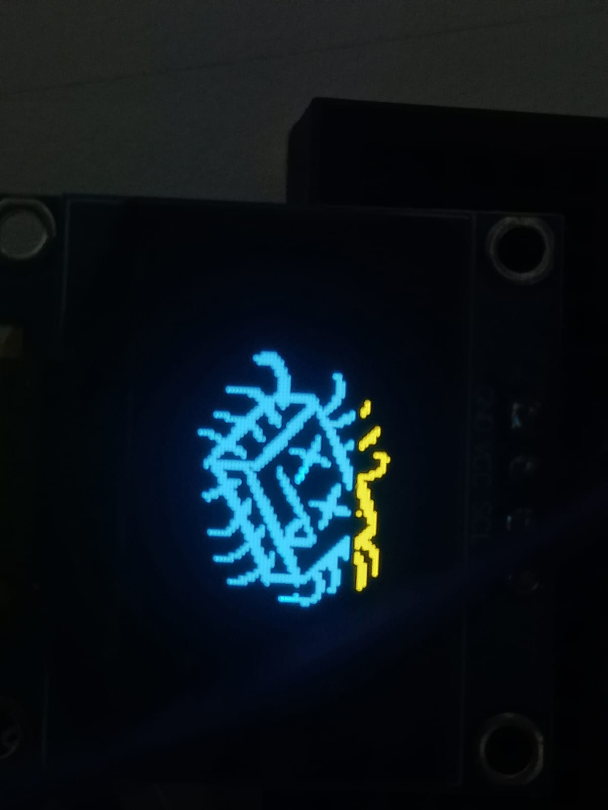
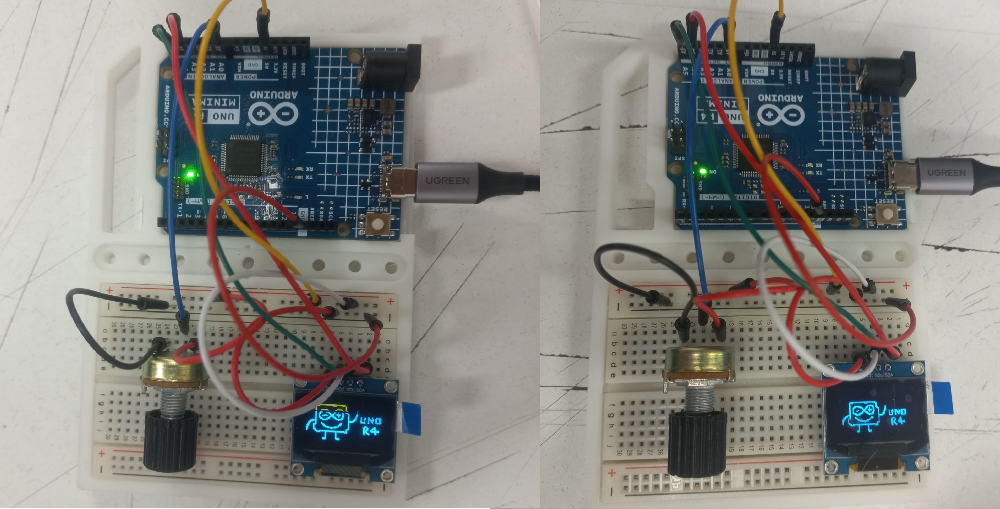
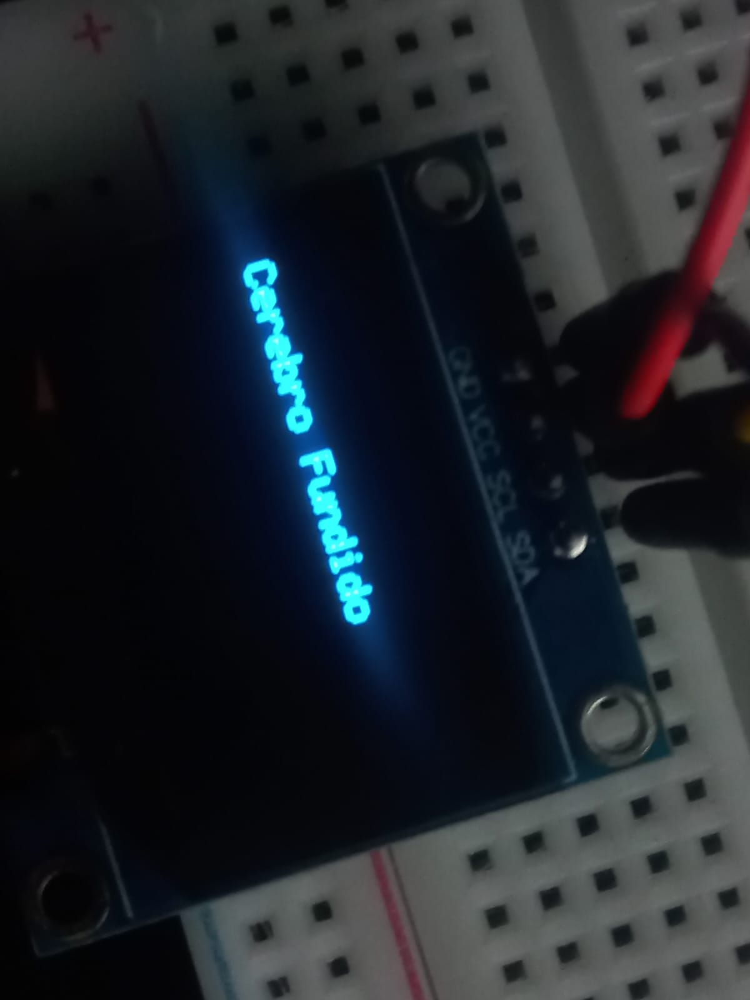
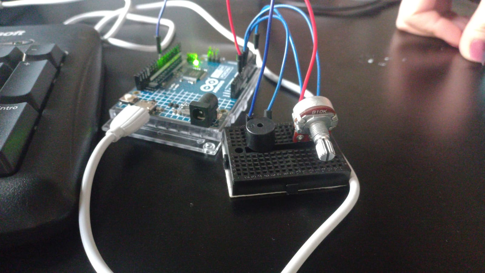

# sesion-04a
## PREPARACION PROYECTO 1

Continuamos trabajando en el proyecto ya con las tareas designadas. llegue un poco tarde por problemas en Metro San Pablo. Intentar salir más temprano. 

- Fran: función traducción binario

- Milla: Dibujo y potenciómetro

- J: imagen en código y scroll vertical.

- Josefa: buzzer


----------


### Proyecto HAIKU

Nuestra idea es crear un haiku que se pueda leer en una pantalla OLED de 128 × 64 y mostrarlo en dos Arduinos. En el primero, se mostrará el haiku en código binario junto con imágenes representativas de cada verso (tres en total), de manera que se pueda leer el poema de arriba hacia abajo. El segundo Arduino mostrará una versión más sencilla del primero, en la que el poema se muestra en texto normal, y al igual que en el primero, se podrá ir leyendo de arriba hacia abajo usando el potenciómetro. Como extra, tenemos pensado hacer que un buzzer reproduzca el poema.

### Haiku

El haiku es un poema de origen japonés. Es breve, de tres líneas. Hay distintas reglas de escritura; la que elegimos cuenta con tres versos: la primera línea tiene 5 sílabas, la segunda 7 y la tercera 5. Normalmente habla de la naturaleza o de un sentimiento, y busca transmitir mucho con pocas palabras. En nuestro caso, quisimos alejarnos un poco de eso y hacerlo relacionado con lo que estamos haciendo y bien sencillito.


````cpp
Poema
- Codigo Arduino
- OLED ya encendido
- Cerebro fundido
````


 

### Trabajo en clases

- De momento tenemos el código separado por funciones.
  
- Con Millarai estuvimos viendo cómo mostrar las imágenes del Arduino en la pantalla OLED de 128 × 64. Ordenamos el código usando una plantilla que vimos en clases. En este código aparecían dos imágenes en la pantalla.
  
- Durante la clase, Misaa pasó por nuestra zona de trabajo y nos recomendó centralizar el proyecto: quizá no hacer tanto y enfocarnos en algo que realmente funcione.
  
- Tenemos de momento listo un codigo el cual puede mostrar las 3 iamgenes del haiku que hicimos, de modo que elpotenciometro al girarse va cambiando las iamgenes
  
- input es el potenciómetro, que le dice al Arduino en qué posición está girado. El Arduino lee ese valor y decide qué imagen mostrar. El output es la pantalla OLED, donde se muestran las imágenes según la posición del potenciómetro. Así, al girar el potenciómetro, el Arduino recibe la señal y cambia la imagen que aparece en la pantalla.
  
- Durante la clase, se nos recomendó ajustar lo que se muestra en pantalla para que la parte superior no aparezca amarilla. Por ello, modificamos el tamaño de las imágenes directamente en Paint y luego las subimos a [image2cpp](https://javl.github.io/image2cpp), bajando un poco las imágenes para evitar la aparición de la línea amarilla en la parte superior."


 


````cpp

#include <Wire.h>
#include <Adafruit_GFX.h>
#include <Adafruit_SSD1306.h>

#define SCREEN_WIDTH 128
#define SCREEN_HEIGHT 64
#define OLED_RESET -1
Adafruit_SSD1306 pantallita(SCREEN_WIDTH, SCREEN_HEIGHT, &Wire, OLED_RESET);

int contador = 0;

const unsigned  char rafita [] PROGMEM = {

  // 'rafita_2025', 128x64px
0xff, 0xff, 0xff, 0xff, 0xff, 0x81, 0xff, 0xff, 0xff, 0xff, 0xff, 0xff, 0xff, 0xff, 0xff, 0xff, 
0xff, 0xff, 0xff, 0xff, 0xf8, 0x00, 0x3f, 0xff, 0xff, 0xff, 0xff, 0xff, 0xff, 0xff, 0xff, 0xff, 
0xff, 0xff, 0xff, 0xff, 0xe0, 0x00, 0x07, 0xff, 0xff, 0xff, 0xff, 0xff, 0xff, 0xff, 0xff, 0xff, 
0xff, 0xff, 0xff, 0xff, 0x80, 0xff, 0x01, 0xff, 0xff, 0xff, 0xff, 0xff, 0xff, 0xff, 0xff, 0xff, 
0xff, 0xff, 0xff, 0xff, 0x07, 0xff, 0xe0, 0xff, 0xff, 0xff, 0xff, 0xff, 0xff, 0xff, 0xff, 0xff, 
0xff, 0xff, 0xff, 0xfe, 0x1f, 0xff, 0xf8, 0x3f, 0xff, 0xff, 0xff, 0xff, 0xf9, 0xff, 0xff, 0xff, 
0xff, 0xff, 0xff, 0xfc, 0x3f, 0xff, 0xfe, 0x0f, 0xff, 0xff, 0xff, 0xff, 0xe0, 0x7f, 0xff, 0xff, 
0xff, 0xff, 0xff, 0xf8, 0x7f, 0xff, 0xff, 0x07, 0xff, 0xff, 0xff, 0xff, 0xc0, 0x7f, 0xff, 0xff, 
0xff, 0xff, 0xff, 0xc0, 0xff, 0xff, 0xff, 0xc3, 0xff, 0xff, 0xff, 0xff, 0xc6, 0x3f, 0xff, 0xff, 
0xff, 0xff, 0xff, 0x80, 0xff, 0xff, 0xff, 0xf1, 0xff, 0xff, 0xff, 0xff, 0xc6, 0x3f, 0xff, 0xff, 
0xff, 0xff, 0xff, 0x0d, 0xff, 0xff, 0xff, 0xf8, 0xff, 0xff, 0xff, 0xff, 0xcf, 0x1f, 0xff, 0xff, 
0xff, 0xff, 0xfe, 0x1d, 0xff, 0xff, 0xff, 0xf8, 0x7f, 0xff, 0xff, 0xff, 0x8f, 0x1f, 0xff, 0xff, 
0xff, 0xff, 0xfc, 0x7b, 0xff, 0xff, 0xf7, 0xfc, 0x7f, 0xff, 0xff, 0xff, 0x8f, 0x1f, 0xff, 0xff, 
0xff, 0xff, 0xfc, 0x7b, 0xff, 0xff, 0xf7, 0xfe, 0x3f, 0xfe, 0x00, 0x1f, 0x0f, 0x3f, 0xff, 0xff, 
0xff, 0xff, 0xfc, 0xfb, 0xff, 0xff, 0xf7, 0xfe, 0x3f, 0xe0, 0x00, 0x03, 0x1e, 0x3f, 0xff, 0xff, 
0xff, 0xff, 0xf8, 0xfb, 0xff, 0xff, 0xf7, 0xfe, 0x3e, 0x00, 0x00, 0x00, 0x1e, 0x3f, 0xff, 0xff, 
0xff, 0xff, 0xf8, 0xfb, 0x3f, 0xff, 0xf7, 0xff, 0x00, 0x03, 0xff, 0xf0, 0x3c, 0x7f, 0xff, 0xff, 
0xff, 0xff, 0xf9, 0xfb, 0x3f, 0xff, 0xf7, 0xff, 0x00, 0x1f, 0xff, 0xfc, 0x7c, 0x7f, 0xff, 0xff, 
0xff, 0xff, 0xf1, 0xfb, 0xff, 0xf3, 0xf7, 0xff, 0x01, 0xff, 0xff, 0xfe, 0x78, 0xff, 0xff, 0xff, 
0xff, 0xff, 0xf1, 0xfb, 0xff, 0xf3, 0xf3, 0xff, 0x7f, 0xff, 0xff, 0xff, 0xb0, 0xff, 0xff, 0xff, 
0xff, 0xff, 0xf1, 0xfb, 0xff, 0xff, 0xfb, 0xff, 0x7f, 0xff, 0xff, 0xff, 0xc1, 0xff, 0xff, 0xff, 
0xff, 0xff, 0xf1, 0xff, 0xc3, 0xff, 0xfb, 0xff, 0x7f, 0xff, 0xff, 0xff, 0xe3, 0xff, 0xff, 0xff, 
0xff, 0xff, 0xf9, 0xf7, 0xc3, 0xff, 0xfd, 0xff, 0x7f, 0xff, 0xff, 0xff, 0xf1, 0xff, 0xff, 0xff, 
0xff, 0xff, 0xf8, 0xf7, 0xe7, 0xff, 0xfd, 0xfe, 0xff, 0xff, 0xff, 0xff, 0xf1, 0xff, 0xff, 0xff, 
0xff, 0xff, 0xfc, 0x07, 0xff, 0xff, 0xfe, 0x79, 0xff, 0xff, 0xff, 0xff, 0xf8, 0xff, 0xff, 0xff, 
0xff, 0xff, 0xfc, 0x07, 0xff, 0xff, 0xff, 0x03, 0xff, 0xff, 0xff, 0xff, 0xf8, 0xff, 0xff, 0xff, 
0xff, 0xff, 0xff, 0x87, 0xbf, 0xff, 0xff, 0xff, 0xff, 0xff, 0xff, 0xff, 0xf8, 0xff, 0xff, 0xff, 
0xff, 0xff, 0xff, 0xe3, 0xc0, 0x7f, 0xff, 0xff, 0xff, 0xff, 0xff, 0xff, 0xfc, 0xff, 0xff, 0xff, 
0xff, 0xff, 0xff, 0xe1, 0xff, 0xff, 0xff, 0xff, 0xff, 0xff, 0xff, 0xff, 0xfc, 0xff, 0xff, 0xff, 
0xff, 0xff, 0xff, 0xf1, 0xff, 0xff, 0xff, 0xff, 0xff, 0xff, 0xff, 0xff, 0xfc, 0xff, 0xff, 0xff, 
0xff, 0xff, 0xff, 0xf8, 0xff, 0xff, 0xff, 0xff, 0xff, 0xff, 0xff, 0xff, 0xfc, 0xff, 0xff, 0xff, 
0xff, 0xff, 0xff, 0xf8, 0x3f, 0xff, 0xff, 0xff, 0xff, 0xff, 0xff, 0xff, 0xfc, 0xff, 0xff, 0xff, 
0xff, 0xff, 0xff, 0xfc, 0x03, 0xff, 0xff, 0xff, 0xff, 0xff, 0xff, 0xff, 0xf8, 0xff, 0xff, 0xff, 
0xff, 0xff, 0xff, 0xff, 0x00, 0x1f, 0xff, 0xff, 0xff, 0xff, 0xff, 0xff, 0xf8, 0xff, 0xff, 0xff, 
0xff, 0xff, 0xff, 0xff, 0xe0, 0x3f, 0xff, 0xff, 0xff, 0xff, 0xff, 0xff, 0xf8, 0xff, 0xff, 0xff, 
0xff, 0xff, 0xff, 0xff, 0xfe, 0x3f, 0xff, 0xff, 0xff, 0xff, 0xff, 0xff, 0xf9, 0xff, 0xff, 0xff, 
0xff, 0xff, 0xff, 0xff, 0xff, 0x1f, 0xff, 0xff, 0xff, 0xff, 0xff, 0xff, 0xf1, 0xff, 0xff, 0xff, 
0xff, 0xff, 0xff, 0xff, 0xff, 0x1f, 0xff, 0xff, 0xff, 0xff, 0xff, 0xff, 0xf0, 0xff, 0xff, 0xff, 
0xff, 0xff, 0xff, 0xff, 0xfe, 0x1f, 0xff, 0xff, 0xff, 0xff, 0xff, 0xff, 0xf8, 0xff, 0xff, 0xff, 
0xff, 0xff, 0xff, 0xff, 0xfc, 0x1f, 0xff, 0xff, 0xff, 0xff, 0xff, 0xff, 0xfc, 0x7f, 0xff, 0xff, 
0xff, 0xff, 0xff, 0xff, 0xf8, 0x6f, 0xff, 0xff, 0xff, 0xff, 0xff, 0xbf, 0xfc, 0x7f, 0xff, 0xff, 
0xff, 0xff, 0xff, 0xff, 0xe0, 0xf7, 0xff, 0xff, 0xff, 0xff, 0xff, 0xbf, 0xfe, 0x3f, 0xff, 0xff, 
0xff, 0xff, 0xff, 0xff, 0x81, 0xf3, 0xff, 0xff, 0xff, 0xff, 0xff, 0xbf, 0xff, 0x1f, 0xff, 0xff, 
0xff, 0xff, 0xff, 0xff, 0x03, 0xf9, 0xff, 0xff, 0xff, 0xff, 0xff, 0xbf, 0xff, 0x1f, 0xff, 0xff, 
0xff, 0xff, 0xff, 0xfe, 0x3f, 0xfc, 0xff, 0xff, 0xff, 0xff, 0xff, 0xdf, 0xff, 0x9f, 0xff, 0xff, 
0xff, 0xff, 0xff, 0xfe, 0x3f, 0xfe, 0x7f, 0xff, 0xff, 0xff, 0xff, 0xdf, 0xff, 0x8f, 0xff, 0xff, 
0xff, 0xff, 0xff, 0xfe, 0x77, 0xff, 0x1f, 0xff, 0x7f, 0xff, 0xff, 0x8f, 0xff, 0x8f, 0xff, 0xff, 
0xff, 0xff, 0xff, 0xfe, 0x2f, 0xff, 0x0f, 0xfe, 0x7f, 0xff, 0xfe, 0x77, 0xff, 0x8f, 0xff, 0xff, 
0xff, 0xff, 0xff, 0xfe, 0x1c, 0xfe, 0x07, 0xfe, 0xff, 0xff, 0xf1, 0xf3, 0xff, 0x8f, 0xff, 0xff, 
0xff, 0xff, 0xff, 0xfe, 0x19, 0xfc, 0x0f, 0xfe, 0xff, 0xf0, 0x0f, 0xf8, 0xff, 0xcf, 0xff, 0xff, 
0xff, 0xff, 0xff, 0xff, 0x0b, 0xf8, 0x0f, 0xfe, 0x00, 0x00, 0x0f, 0xf8, 0xff, 0x8f, 0xff, 0xff, 
0xff, 0xff, 0xff, 0xff, 0x83, 0xf0, 0x1f, 0xfc, 0x00, 0x00, 0x0f, 0xf8, 0xdb, 0x8f, 0xff, 0xff, 
0xff, 0xff, 0xff, 0xff, 0xc0, 0x00, 0x1f, 0xfc, 0x00, 0x7f, 0xc7, 0xf8, 0xdb, 0x8f, 0xff, 0xff, 
0xff, 0xff, 0xff, 0xff, 0xe0, 0x00, 0x3f, 0xfc, 0x7f, 0xff, 0xc7, 0xf8, 0x5b, 0x8f, 0xff, 0xff, 
0xff, 0xff, 0xff, 0xff, 0xf8, 0x08, 0x7f, 0xf8, 0xff, 0xff, 0xc7, 0xfc, 0x4d, 0x1f, 0xff, 0xff, 
0xff, 0xff, 0xff, 0xff, 0xff, 0xf8, 0xef, 0xf8, 0xff, 0xff, 0x8f, 0xfc, 0x08, 0x3f, 0xff, 0xff, 
0xff, 0xff, 0xff, 0xff, 0xff, 0xf8, 0xdf, 0xf1, 0xff, 0xff, 0x8d, 0xb8, 0x00, 0x7f, 0xff, 0xff, 
0xff, 0xff, 0xff, 0xff, 0xff, 0xf8, 0xb9, 0xf1, 0xff, 0xff, 0x8d, 0xb8, 0x00, 0xff, 0xff, 0xff, 
0xff, 0xff, 0xff, 0xff, 0xff, 0xf8, 0x37, 0xe3, 0xff, 0xff, 0xcd, 0xb0, 0xff, 0xff, 0xff, 0xff, 
0xff, 0xff, 0xff, 0xff, 0xff, 0xfc, 0x37, 0xc7, 0xff, 0xff, 0xc5, 0x81, 0xff, 0xff, 0xff, 0xff, 
0xff, 0xff, 0xff, 0xff, 0xff, 0xfe, 0x0f, 0x07, 0xff, 0xff, 0xc0, 0x03, 0xff, 0xff, 0xff, 0xff, 
0xff, 0xff, 0xff, 0xff, 0xff, 0xff, 0x00, 0x0f, 0xff, 0xff, 0xe0, 0x07, 0xff, 0xff, 0xff, 0xff, 
0xff, 0xff, 0xff, 0xff, 0xff, 0xff, 0x80, 0x3f, 0xff, 0xff, 0xf8, 0x3f, 0xff, 0xff, 0xff, 0xff, 
0xff, 0xff, 0xff, 0xff, 0xff, 0xff, 0xf0, 0xff, 0xff, 0xff, 0xff, 0xff, 0xff, 0xff, 0xff, 0xff
};

const unsigned char akrilla [] PROGMEM = {
  // 'akrilla', 128x64px
0xff, 0xc0, 0x00, 0x00, 0x00, 0x01, 0x00, 0x00, 0x00, 0x0f, 0x80, 0x00, 0x03, 0xff, 0xff, 0xe0, 
0xff, 0xc0, 0x00, 0x00, 0x00, 0x00, 0x00, 0x00, 0x00, 0x0e, 0x80, 0x00, 0x03, 0xff, 0xff, 0xe0, 
0xff, 0xc0, 0x00, 0x00, 0x00, 0x02, 0x00, 0x00, 0x00, 0x1f, 0x80, 0x00, 0x07, 0xff, 0xff, 0xf0, 
0xff, 0x80, 0x00, 0x00, 0x00, 0x00, 0x00, 0x00, 0x00, 0x1b, 0xa0, 0x00, 0x07, 0xff, 0xff, 0xf0, 
0xff, 0x80, 0x00, 0x00, 0x00, 0x00, 0x00, 0x00, 0x00, 0x1f, 0x60, 0x00, 0x07, 0xff, 0xff, 0xf0, 
0xff, 0x80, 0x00, 0x00, 0x00, 0x00, 0x00, 0x00, 0x00, 0x1f, 0x60, 0x00, 0x07, 0xff, 0xff, 0xf0, 
0xff, 0x00, 0x00, 0x00, 0x00, 0x00, 0x00, 0x00, 0x00, 0x3f, 0x70, 0x00, 0x07, 0xff, 0xff, 0xf0, 
0xff, 0x00, 0x00, 0x00, 0x00, 0x00, 0x00, 0x00, 0x00, 0x3f, 0xf0, 0x00, 0x07, 0xff, 0xff, 0xf0, 
0xff, 0x00, 0x00, 0x00, 0x00, 0x00, 0x00, 0x00, 0x00, 0x7e, 0xf0, 0x00, 0x0f, 0xff, 0xff, 0xf0, 
0xff, 0x00, 0x00, 0x00, 0x00, 0x00, 0x00, 0x00, 0x00, 0x7e, 0xf8, 0x00, 0x0f, 0xff, 0xff, 0xf8, 
0xff, 0x00, 0x00, 0x00, 0x00, 0x00, 0x00, 0x00, 0x00, 0x7f, 0xf8, 0x00, 0x0f, 0xff, 0xff, 0xf8, 
0xfe, 0x00, 0x00, 0x00, 0x00, 0x00, 0x00, 0x00, 0x00, 0x7f, 0xf8, 0x00, 0x0f, 0xff, 0xff, 0xf8, 
0xfe, 0x00, 0x00, 0x00, 0x00, 0x00, 0x00, 0x00, 0x00, 0xff, 0xfc, 0x00, 0x0f, 0xff, 0xff, 0xf8, 
0xfe, 0x00, 0x00, 0x00, 0x00, 0x00, 0x00, 0x00, 0x00, 0xff, 0xfc, 0x00, 0x0f, 0xff, 0xff, 0xf8, 
0xfe, 0x00, 0x00, 0x00, 0x00, 0x00, 0x00, 0x00, 0x01, 0xff, 0xfc, 0x00, 0x0f, 0xff, 0xff, 0xf8, 
0xfe, 0x00, 0x00, 0x00, 0x00, 0x00, 0x00, 0x00, 0x00, 0xff, 0xfc, 0x00, 0x0f, 0xff, 0xff, 0xf8, 
0xfe, 0x00, 0x00, 0x00, 0x00, 0x00, 0x00, 0x00, 0x01, 0xff, 0xfc, 0x00, 0x0f, 0xff, 0xff, 0xf8, 
0xfc, 0x00, 0x00, 0x00, 0x00, 0x00, 0x00, 0x00, 0x01, 0xff, 0xfe, 0x00, 0x0f, 0xff, 0xff, 0xf8, 
0xfc, 0x00, 0x00, 0x00, 0x00, 0x00, 0x00, 0x00, 0x01, 0xf7, 0xfe, 0x00, 0x0f, 0xff, 0xff, 0xf8, 
0xfc, 0x00, 0x00, 0x00, 0x40, 0x00, 0x00, 0x00, 0x01, 0xff, 0xfe, 0x00, 0x0f, 0xff, 0xff, 0xfc, 
0xfc, 0x00, 0x00, 0x00, 0x00, 0x00, 0x00, 0x00, 0x01, 0xff, 0xfe, 0x00, 0x1f, 0xff, 0xff, 0xfc, 
0xfc, 0x00, 0x02, 0x00, 0x00, 0x00, 0x00, 0x00, 0x09, 0xef, 0xfe, 0x00, 0x1f, 0xff, 0xff, 0xfc, 
0xfc, 0x00, 0x00, 0x00, 0x00, 0x00, 0x08, 0x00, 0x01, 0xcf, 0xfe, 0x00, 0x1f, 0xff, 0xff, 0xfc, 
0xfc, 0x00, 0x00, 0x00, 0x40, 0x00, 0x00, 0x00, 0x01, 0xcf, 0xfe, 0x00, 0x1f, 0xff, 0xff, 0xfc, 
0xfc, 0x00, 0x00, 0x00, 0x00, 0x00, 0x00, 0x00, 0x01, 0xcf, 0xfe, 0x00, 0x1f, 0xff, 0xff, 0xfc, 
0xfc, 0x00, 0x00, 0x00, 0x00, 0x00, 0x00, 0x00, 0x01, 0xdf, 0xfe, 0x00, 0x1f, 0xff, 0xff, 0xfc, 
0xfc, 0x00, 0x00, 0x00, 0x00, 0x00, 0x00, 0x00, 0x01, 0xff, 0xfe, 0x00, 0x1f, 0xff, 0xff, 0xfc, 
0xf8, 0x00, 0x00, 0x00, 0x00, 0x00, 0x00, 0x00, 0x01, 0xff, 0xfe, 0x00, 0x1f, 0xff, 0xff, 0xfc, 
0xf8, 0x00, 0x00, 0x00, 0x00, 0x00, 0x00, 0x00, 0x01, 0xff, 0xfe, 0x00, 0x1f, 0xff, 0xff, 0xfc, 
0xf8, 0x00, 0x00, 0x00, 0x00, 0x00, 0x00, 0x00, 0x09, 0xff, 0xfe, 0x00, 0x1f, 0xff, 0xff, 0xfc, 
0xf8, 0x00, 0x00, 0x00, 0x00, 0x00, 0x00, 0x00, 0x0b, 0xff, 0xfe, 0x00, 0x1f, 0xff, 0xff, 0xfe, 
0xf8, 0x00, 0x00, 0x00, 0x00, 0x00, 0x00, 0x00, 0x47, 0xff, 0xfe, 0x00, 0x1f, 0xff, 0xff, 0xfe, 
0xf8, 0x00, 0x00, 0x00, 0x00, 0x00, 0x00, 0x00, 0x42, 0xff, 0xfe, 0x00, 0x1f, 0xff, 0xff, 0xfe, 
0xf8, 0x00, 0x00, 0x00, 0x00, 0x00, 0x00, 0x00, 0x02, 0xff, 0xfe, 0x00, 0x1f, 0xff, 0xff, 0xfe, 
0xf8, 0x00, 0x00, 0x00, 0x00, 0x00, 0x00, 0x00, 0x02, 0xff, 0xfe, 0x00, 0x1f, 0xff, 0xff, 0xfe, 
0xf8, 0x00, 0x00, 0x00, 0x00, 0x00, 0x00, 0x00, 0x42, 0xff, 0xfe, 0x00, 0x1f, 0xff, 0xff, 0xfe, 
0xf8, 0x00, 0x00, 0x00, 0x00, 0x00, 0x00, 0x00, 0x43, 0xff, 0xfe, 0x00, 0x1f, 0xff, 0xff, 0xfe, 
0xf8, 0x00, 0x20, 0x00, 0x00, 0x00, 0x00, 0x00, 0xe3, 0xff, 0xfe, 0x00, 0x1f, 0xff, 0xff, 0xfe, 
0xf8, 0x00, 0x00, 0x00, 0x00, 0x00, 0x00, 0x00, 0xe2, 0xff, 0xfe, 0x00, 0x1f, 0xff, 0xff, 0xfe, 
0xf8, 0x00, 0x00, 0x00, 0x00, 0x00, 0x00, 0x00, 0xf3, 0xff, 0xfe, 0x00, 0x1f, 0xff, 0xff, 0xfe, 
0xf8, 0x00, 0x00, 0x00, 0x00, 0x00, 0x00, 0x00, 0xf3, 0xff, 0xfe, 0x00, 0x1f, 0xff, 0xff, 0xfe, 
0xf8, 0x00, 0x00, 0x00, 0x00, 0x00, 0x00, 0x00, 0xf3, 0xff, 0xfe, 0x00, 0x1f, 0xff, 0xff, 0xfe, 
0xf8, 0x00, 0x00, 0x00, 0x00, 0x00, 0x00, 0x01, 0xf5, 0xff, 0xfe, 0x00, 0x1f, 0xff, 0xff, 0xfe, 
0xf8, 0x00, 0x00, 0x00, 0x00, 0x00, 0x00, 0x01, 0xf3, 0xff, 0xfe, 0x40, 0x1f, 0xff, 0xff, 0xff, 
0xf8, 0x00, 0x00, 0x00, 0x00, 0x00, 0x00, 0x03, 0xfb, 0xff, 0xfe, 0x40, 0x1f, 0xff, 0xff, 0xff, 
0xf8, 0x00, 0x00, 0x00, 0x00, 0x00, 0x00, 0x03, 0xff, 0xff, 0xfe, 0x40, 0x1f, 0xff, 0xff, 0xff, 
0xf8, 0x00, 0x00, 0x00, 0x00, 0x00, 0x00, 0x03, 0xff, 0xff, 0xfe, 0x40, 0x1f, 0xff, 0xff, 0xff, 
0xf8, 0x00, 0x00, 0x00, 0x00, 0x00, 0x00, 0x03, 0xff, 0xff, 0xff, 0xe0, 0x0f, 0xff, 0xff, 0xff, 
0xf8, 0x00, 0x00, 0x00, 0x00, 0x00, 0x00, 0x07, 0xff, 0xff, 0xfd, 0xe0, 0x1f, 0xff, 0xff, 0xff, 
0xf8, 0x00, 0x00, 0x00, 0x00, 0x00, 0x00, 0x07, 0xff, 0xff, 0xfd, 0xe0, 0x1f, 0xff, 0xff, 0xff, 
0xf8, 0x00, 0x00, 0x00, 0x00, 0x00, 0x00, 0x07, 0xff, 0xff, 0xff, 0xc0, 0x1f, 0xff, 0xff, 0xff, 
0xf8, 0x00, 0x00, 0x00, 0x00, 0x00, 0x00, 0x0f, 0xff, 0xff, 0xff, 0xe0, 0x1f, 0xff, 0xff, 0xff, 
0xf8, 0x00, 0x00, 0x00, 0x00, 0x00, 0x00, 0x0f, 0xff, 0xff, 0xfb, 0xe0, 0x1f, 0xff, 0xff, 0xff, 
0xf8, 0x00, 0x00, 0x00, 0x00, 0x00, 0x00, 0x0f, 0xff, 0xff, 0xfb, 0xe0, 0x1f, 0xff, 0xff, 0xff, 
0xfc, 0x00, 0x00, 0x00, 0x00, 0x00, 0x00, 0x1f, 0xff, 0xff, 0xfb, 0xe0, 0x1f, 0xff, 0xff, 0xff, 
0xfc, 0x00, 0x00, 0x00, 0x00, 0x00, 0x00, 0x1f, 0xff, 0xff, 0xff, 0xe0, 0x1f, 0xff, 0xff, 0xff, 
0xfc, 0x00, 0x00, 0x00, 0x00, 0x00, 0x00, 0x1f, 0xff, 0xff, 0xff, 0xf0, 0x1f, 0xff, 0xff, 0xff, 
0xfc, 0x00, 0x00, 0x00, 0x00, 0x00, 0x00, 0x1f, 0xff, 0xff, 0xff, 0xf0, 0x1f, 0xff, 0xff, 0xff, 
0xfc, 0x00, 0x00, 0x00, 0x00, 0x00, 0x00, 0x3f, 0xff, 0xff, 0xff, 0xf0, 0x1d, 0xff, 0xff, 0xff, 
0xff, 0x00, 0x00, 0x00, 0x00, 0x00, 0x00, 0x3f, 0xff, 0xff, 0xff, 0xf0, 0x0f, 0xff, 0xff, 0xff, 
0xff, 0x80, 0x00, 0x00, 0x00, 0x00, 0x00, 0x7f, 0xff, 0xff, 0xff, 0xf8, 0x0f, 0xff, 0xff, 0xff, 
0xfe, 0x80, 0x00, 0x00, 0x00, 0x00, 0x00, 0x7f, 0xff, 0xff, 0xff, 0xf8, 0x0f, 0xff, 0xff, 0xff, 
0xff, 0x00, 0x00, 0x00, 0x00, 0x00, 0x00, 0x7f, 0xff, 0xff, 0xff, 0xf8, 0x0f, 0xff, 0xff, 0xff, 
0xff, 0x80, 0x00, 0x00, 0x00, 0x00, 0x00, 0x7f, 0xff, 0xff, 0xff, 0xf8, 0x0f, 0xff, 0xff, 0xff
};

void setup() {
  if(!pantallita.begin(SSD1306_SWITCHCAPVCC, 0x3C)) {
    Serial.println(F("No se encontró la pantalla SSD1306"));
    for(;;);
  }
  pantallita.clearDisplay();
  pantallita.setTextColor(SSD1306_WHITE);
}

void loop() {
  pantallita.clearDisplay(); // Limpiamos toda la pantalla
  
  // dibujar akrilla
  pantallita.drawBitmap(0, 0, akrilla, 128, 64, WHITE);

  delay(1000);

  pantallita.display(); // Actualiza la pantalla

  pantallita.clearDisplay();

  pantallita.drawBitmap(0, 0, rafita, 128, 64, WHITE);

   delay(1000);

  pantallita.display(); // Actualiza la pantalla

}

`````

----------

### Trabajo durante la Tarde

- Aproveché la tarde para ver como mostrar texto en pantalla y probar un buzzer en el arduino.


 




Prueba en texto en pantalla
````CPP
#include <Wire.h>
#include <Adafruit_SSD1306.h>
#include <Adafruit_GFX.h>

#define OLED_WIDTH 128
#define OLED_HEIGHT 64
#define OLED_ADDR   0x3C

Adafruit_SSD1306 display(OLED_WIDTH, OLED_HEIGHT);

void setup() {
  display.begin(SSD1306_SWITCHCAPVCC, OLED_ADDR);
  display.clearDisplay();

  display.setTextSize(2);
  display.setTextColor(WHITE);
  display.setCursor(0, 20); // ajusta la posición vertical para centrarlo
  display.println("Cerebro");
  display.println("fundido");

  display.display();
}

void loop() {
  // no hacemos nada, solo mostramos el texto
}
````


BUZZER
````CPP
\\https://github.com/johannpereze/cursoArduinoJohannPerezE/blob/main/Clase%2023/Active_Buzzer_Clase_23/Active_Buzzer_Clase.ino
//int buzzPin = 8;
//int number;
//String msg1 = "Por favor introduce tu número";
//int dt = 500;
//void setup() {
//  // put your setup code here, to run once:
//  Serial.begin(9600);
//  pinMode(buzzPin, OUTPUT);
//}
//
//void loop() {
//  // put your main code here, to run repeatedly:
//  Serial.println();
//  Serial.println(msg1);
//  while (Serial.available() == 0) {
//
//  }
//  number = Serial.parseInt();
//
//  if (number > 10){
//    digitalWrite(buzzPin, HIGH);
//    delay(dt);
//    digitalWrite(buzzPin, LOW);
//  }
//
//}

int buzzPin = 8;
int potVal;
int potPin = A5;

void setup() {
  // put your setup code here, to run once:
  Serial.begin(9600);
  pinMode(buzzPin, OUTPUT);
  pinMode(potPin, INPUT);
}

void loop() {
  // put your main code here, to run repeatedly:

  potVal = analogRead(potPin);
  Serial.println(potVal);

  while (potVal>1000){
    digitalWrite(buzzPin, HIGH);
    potVal = analogRead(potPin);
    Serial.println(potVal);
  }
  digitalWrite(buzzPin, LOW);

}
````

- Durante la tarde, franUDP logró terminar el código binario, pudiendo traducir de texto normal a binario. Durante el jueves, tenemos que intentar juntar los códigos.

### SCROLL
- Mateo nos entrego este recurso para el scroll vertical. El código hace que un texto wse mueva por la pantalla OLED y, cuando llega al final, vuelve a aparecer desde arriba. El delay controla la velocidad del movimiento.

````CPP
#include <Adafruit_GFX.h>
#include <Adafruit_SSD1306.h>
#include <Wire.h>

#define SCREEN_WIDTH 128
#define SCREEN_HEIGHT 64
#define OLED_RESET    -1
Adafruit_SSD1306 display(SCREEN_WIDTH, SCREEN_HEIGHT, &Wire, OLED_RESET);

String texto = "Hola! Esto es un scroll vertical en Arduino :)";
int16_t y = -8; // Comenzamos fuera de la pantalla

void setup() {
  if(!display.begin(SSD1306_SWITCHCAPVCC, 0x3C)) { 
    Serial.println(F("Error al iniciar la pantalla SSD1306"));
    for(;;);
  }

  display.clearDisplay();
  display.setTextSize(1);
  display.setTextColor(SSD1306_WHITE);
}

void loop() {
  display.clearDisplay();

  display.setCursor(0, y);
  display.print(texto);
  display.display();

  y++;  // Mueve el texto hacia abajo

  // Si el texto salió completamente de la pantalla, reinicia desde arriba
  int16_t textHeight = 8; // Altura de la fuente 1
  if (y > SCREEN_HEIGHT) {
    y = -textHeight;
  }

  delay(50); // Ajusta la velocidad del scroll
}
````
[avance proyecto](https://youtu.be/8UDNwfuX83s)

Scroll vertical con potenciometro

````CPP
// prueba de scroll vertical controlado por potenciometro. parrafo 1 de haiku, para luego pasar a la imagen de un bob esponja arduino lol.
#include <Wire.h>
#include <Adafruit_GFX.h>
#include <Adafruit_SSD1306.h>

#define SCREEN_WIDTH 128
#define SCREEN_HEIGHT 64
#define OLED_RESET -1
Adafruit_SSD1306 pantallita(SCREEN_WIDTH, SCREEN_HEIGHT, &Wire, OLED_RESET);

// imagen pasada a codigo con https://javl.github.io/image2cpp
// imagen haiku 1 
const unsigned char a[] PROGMEM = {
  0x00, 0x00, 0x00, 0x00, 0x00, 0x00, 0x00, 0x00, 0x00, 0x00, 0x00, 0x00, 0x00, 0x00, 0x00, 0x00,
  0x00, 0x00, 0x00, 0x00, 0x00, 0x00, 0x00, 0x00, 0x00, 0x00, 0x00, 0x00, 0x00, 0x00, 0x00, 0x00,
  0x00, 0x00, 0x00, 0x00, 0x00, 0x00, 0x00, 0x00, 0x00, 0x00, 0x00, 0x00, 0x00, 0x00, 0x00, 0x00,
  0x00, 0x00, 0x00, 0x00, 0x00, 0x00, 0x00, 0x00, 0x00, 0x00, 0x00, 0x00, 0x00, 0x00, 0x00, 0x00,
  0x00, 0x00, 0x00, 0x00, 0x00, 0x00, 0x00, 0x00, 0x00, 0x00, 0x00, 0x00, 0x00, 0x00, 0x00, 0x00,
  0x00, 0x00, 0x00, 0x00, 0x00, 0x00, 0x00, 0x00, 0x00, 0x00, 0x00, 0x00, 0x00, 0x00, 0x00, 0x00,
  0x00, 0x00, 0x00, 0x00, 0x00, 0x00, 0x00, 0x00, 0x00, 0x00, 0x00, 0x00, 0x00, 0x00, 0x00, 0x00,
  0x00, 0x00, 0x00, 0x00, 0x00, 0x00, 0x00, 0x00, 0x00, 0x00, 0x00, 0x00, 0x00, 0x00, 0x00, 0x00,
  0x00, 0x00, 0x00, 0x00, 0x00, 0x00, 0x00, 0x00, 0x00, 0x00, 0x00, 0x00, 0x00, 0x00, 0x00, 0x00,
  0x00, 0x00, 0x00, 0x00, 0x00, 0x00, 0x00, 0x00, 0x00, 0x00, 0x00, 0x00, 0x00, 0x00, 0x00, 0x00,
  0x00, 0x00, 0x00, 0x00, 0x00, 0x00, 0x00, 0x00, 0x00, 0x00, 0x00, 0x00, 0x00, 0x00, 0x00, 0x00,
  0x00, 0x00, 0x00, 0x00, 0x00, 0x00, 0x00, 0x00, 0x00, 0x00, 0x00, 0x00, 0x00, 0x00, 0x00, 0x00,
  0x00, 0x00, 0x00, 0x00, 0x00, 0x00, 0x00, 0x00, 0x00, 0x00, 0x00, 0x00, 0x00, 0x00, 0x00, 0x00,
  0x00, 0x00, 0x00, 0x00, 0x00, 0x00, 0x00, 0x00, 0x00, 0x00, 0x00, 0x00, 0x00, 0x00, 0x00, 0x00,
  0x00, 0x00, 0x00, 0x00, 0x00, 0x00, 0x00, 0x00, 0x00, 0x00, 0x00, 0x00, 0x00, 0x00, 0x00, 0x00,
  0x00, 0x00, 0x00, 0x00, 0x00, 0x00, 0x00, 0x00, 0x00, 0x00, 0x00, 0x00, 0x00, 0x00, 0x00, 0x00,
  0x00, 0x00, 0x00, 0x00, 0x00, 0x00, 0x00, 0x00, 0x00, 0x00, 0x00, 0x00, 0x00, 0x00, 0x00, 0x00,
  0x00, 0x00, 0x00, 0x00, 0x00, 0x00, 0x00, 0x00, 0x00, 0x00, 0x00, 0x00, 0x00, 0x00, 0x00, 0x00,
  0x00, 0x00, 0x00, 0xff, 0xff, 0xff, 0xff, 0xfe, 0x00, 0x00, 0x00, 0x00, 0x00, 0x00, 0x00, 0x00,
  0x00, 0x00, 0x01, 0xff, 0xff, 0xff, 0xff, 0xff, 0x80, 0x00, 0x00, 0x00, 0x00, 0x00, 0x00, 0x00,
  0x00, 0x00, 0x01, 0xf8, 0x00, 0x03, 0xe0, 0x1f, 0x80, 0x00, 0x00, 0x00, 0x00, 0x00, 0x00, 0x00,
  0x00, 0x00, 0x01, 0x80, 0x00, 0x00, 0x00, 0x01, 0x80, 0x00, 0x00, 0x00, 0x00, 0x00, 0x00, 0x00,
  0x00, 0x00, 0x01, 0x80, 0x00, 0x00, 0x00, 0x01, 0x80, 0x00, 0x00, 0x00, 0x00, 0x00, 0x00, 0x00,
  0x00, 0x00, 0x01, 0x80, 0x00, 0x00, 0x07, 0x81, 0x80, 0x00, 0x00, 0x00, 0x00, 0x00, 0x00, 0x00,
  0x00, 0x00, 0x01, 0x81, 0xff, 0x00, 0x3f, 0xf1, 0x80, 0x00, 0x00, 0x00, 0x00, 0x00, 0x00, 0x00,
  0x00, 0x00, 0x01, 0x83, 0xff, 0xc0, 0x70, 0x31, 0xc0, 0x06, 0x00, 0x00, 0x00, 0x00, 0x00, 0x00,
  0x00, 0x00, 0x01, 0x87, 0x87, 0xe0, 0xe4, 0x31, 0xe0, 0x06, 0x00, 0x00, 0x00, 0x00, 0x00, 0x00,
  0x00, 0x00, 0x01, 0x8e, 0x00, 0xf1, 0xc4, 0x10, 0xf0, 0x06, 0x00, 0x00, 0x00, 0x00, 0x00, 0x00,
  0x00, 0x00, 0x01, 0x8c, 0x00, 0x31, 0x84, 0x18, 0x30, 0x0e, 0x00, 0x00, 0x00, 0x00, 0x00, 0x00,
  0x00, 0x00, 0x01, 0x8c, 0x00, 0x1f, 0x1f, 0x98, 0x10, 0x0e, 0x00, 0x00, 0x00, 0x00, 0x00, 0x00,
  0x00, 0x00, 0x01, 0x88, 0x0c, 0x0e, 0x1f, 0x98, 0x10, 0x0e, 0x00, 0x00, 0x00, 0x00, 0x00, 0x00,
  0x00, 0x00, 0x01, 0x88, 0x70, 0x1f, 0x06, 0x18, 0x10, 0x0c, 0x10, 0xce, 0x23, 0xf8, 0x00, 0x00,
  0x00, 0x00, 0x01, 0x8c, 0x00, 0x33, 0xc4, 0x10, 0x10, 0x18, 0x11, 0xcf, 0x37, 0x18, 0x00, 0x00,
  0x00, 0x00, 0x01, 0x8c, 0x00, 0x71, 0xe0, 0x30, 0x10, 0x18, 0x11, 0xcf, 0xb7, 0x18, 0x00, 0x00,
  0x00, 0x00, 0x01, 0x8f, 0x01, 0xe0, 0xf0, 0x70, 0x10, 0x38, 0x11, 0x8d, 0xf7, 0x18, 0x00, 0x00,
  0x00, 0x00, 0x01, 0x87, 0xc7, 0xc0, 0x7f, 0xf0, 0x10, 0x70, 0x11, 0x8c, 0xf7, 0x18, 0x00, 0x00,
  0x00, 0x00, 0x01, 0x81, 0xff, 0x00, 0x1f, 0xc0, 0x10, 0x70, 0x10, 0x8c, 0xe7, 0x18, 0x00, 0x00,
  0x00, 0x00, 0x0f, 0x80, 0x7c, 0x00, 0x04, 0x00, 0x1f, 0xe0, 0x10, 0x8c, 0x67, 0x18, 0x00, 0x00,
  0x00, 0x00, 0x79, 0x80, 0x00, 0x00, 0x00, 0x00, 0x1f, 0x80, 0x1f, 0x8c, 0x07, 0xf0, 0x00, 0x00,
  0x00, 0x00, 0xf1, 0x80, 0x00, 0x00, 0x00, 0x00, 0x10, 0x00, 0x00, 0x00, 0x00, 0x00, 0x00, 0x00,
  0x00, 0x03, 0xc1, 0x81, 0x80, 0x00, 0x00, 0xe0, 0x10, 0x00, 0x00, 0x00, 0x00, 0x00, 0x00, 0x00,
  0x00, 0x03, 0x81, 0x81, 0xe0, 0x00, 0x01, 0xe0, 0x10, 0x00, 0x00, 0x00, 0x00, 0x00, 0x00, 0x00,
  0x00, 0x07, 0x87, 0x80, 0xf0, 0x00, 0x03, 0xc0, 0x10, 0x00, 0x00, 0xe0, 0x08, 0x00, 0x00, 0x00,
  0x00, 0x0f, 0x04, 0x00, 0x3c, 0x00, 0x0e, 0x00, 0x10, 0x00, 0x01, 0xf8, 0x1c, 0x00, 0x00, 0x00,
  0x00, 0x0e, 0x04, 0x00, 0x1f, 0xc0, 0x7c, 0x00, 0x10, 0x00, 0x03, 0x88, 0x1c, 0x00, 0x00, 0x00,
  0x00, 0x0e, 0x04, 0x00, 0x0f, 0xff, 0xf0, 0x00, 0x10, 0x00, 0x03, 0x98, 0x3c, 0x00, 0x00, 0x00,
  0x00, 0x0c, 0x04, 0x00, 0x01, 0xff, 0xe0, 0x00, 0x10, 0x00, 0x03, 0x98, 0x6c, 0x00, 0x00, 0x00,
  0x00, 0x0c, 0x04, 0x00, 0x00, 0x0e, 0x00, 0x00, 0x70, 0x00, 0x03, 0xb0, 0xef, 0xe0, 0x00, 0x00,
  0x00, 0x0c, 0x07, 0x00, 0x00, 0x00, 0x00, 0x00, 0xf0, 0x00, 0x03, 0xf0, 0xff, 0xe0, 0x00, 0x00,
  0x00, 0x0c, 0x07, 0x00, 0x00, 0x00, 0x00, 0x00, 0xc0, 0x00, 0x03, 0xf0, 0x7f, 0xe0, 0x00, 0x00,
  0x00, 0x08, 0x03, 0xcf, 0xff, 0xff, 0xff, 0xfd, 0xc0, 0x00, 0x03, 0xb8, 0x0e, 0x00, 0x00, 0x00,
  0x00, 0x00, 0x01, 0xff, 0xff, 0xff, 0xff, 0xff, 0xc0, 0x00, 0x03, 0x9e, 0x0e, 0x00, 0x00, 0x00,
  0x00, 0x00, 0x00, 0x7c, 0x0c, 0x00, 0x30, 0x07, 0xc0, 0x00, 0x03, 0x8e, 0x06, 0x00, 0x00, 0x00,
  0x00, 0x00, 0x00, 0x00, 0x0c, 0x00, 0x30, 0x00, 0x00, 0x00, 0x01, 0x04, 0x00, 0x00, 0x00, 0x00,
  0x00, 0x00, 0x00, 0x00, 0x0c, 0x00, 0x30, 0x00, 0x00, 0x00, 0x00, 0x00, 0x00, 0x00, 0x00, 0x00,
  0x00, 0x00, 0x00, 0x00, 0x0c, 0x00, 0x30, 0x00, 0x00, 0x00, 0x00, 0x00, 0x00, 0x00, 0x00, 0x00,
  0x00, 0x00, 0x00, 0x00, 0x0c, 0x00, 0x30, 0x00, 0x00, 0x00, 0x00, 0x00, 0x00, 0x00, 0x00, 0x00,
  0x00, 0x00, 0x00, 0x00, 0x0c, 0x00, 0x30, 0x00, 0x00, 0x00, 0x00, 0x00, 0x00, 0x00, 0x00, 0x00,
  0x00, 0x00, 0x00, 0x00, 0x3c, 0x00, 0x3f, 0x00, 0x00, 0x00, 0x00, 0x00, 0x00, 0x00, 0x00, 0x00,
  0x00, 0x00, 0x00, 0x00, 0x7c, 0x00, 0x3f, 0x00, 0x00, 0x00, 0x00, 0x00, 0x00, 0x00, 0x00, 0x00,
  0x00, 0x00, 0x00, 0x00, 0x78, 0x00, 0x1e, 0x00, 0x00, 0x00, 0x00, 0x00, 0x00, 0x00, 0x00, 0x00,
  0x00, 0x00, 0x00, 0x00, 0x00, 0x00, 0x00, 0x00, 0x00, 0x00, 0x00, 0x00, 0x00, 0x00, 0x00, 0x00
};

// haiku 1 en texto
String haiku = "codigo arduino";

// Variables globales
int potPin = A0;
int valorPot = 0;
int scrollSpeed = 0;
int imageY = 0; // posicion en eje y para que vaya en vertical, como navegar por una pagina web

void setup() {
  Serial.begin(9600);

  if (!pantallita.begin(SSD1306_SWITCHCAPVCC, 0x3C)) {
    Serial.println(F("No se encontró la pantalla SSD1306"));
    while (1);
  }

  pantallita.clearDisplay();
  pantallita.setTextColor(SSD1306_WHITE);
  pantallita.setTextSize(1);
}

void loop() {

  valorPot = analogRead(potPin);

  // valor del potenciómetro
  imageY = map(valorPot, 0, 1023, 0, SCREEN_HEIGHT);

  pantallita.clearDisplay();

  pantallita.setCursor(0, 0);
  pantallita.print(haiku);

  // dibujo imagen
  pantallita.drawBitmap(0, imageY + 10, a, 128, 64, 1); // Para ir posicionando la imagen. la idea es que vaya centrada.

  pantallita.display();

  delay(10);
}
````


