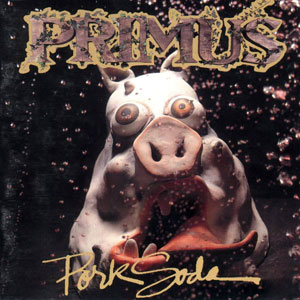

# sesion-05b

## Apuntes 

### Archivos

- .h: encabezados, prometo qué puede hacer la clase/pantalla.

- .cpp: implementación, me hago cargo de que funcione.

- #include archivo: buscar en el sistema.

- #include "archivo": buscar en la misma carpeta.

- #ifndef … #define … #endif: evita redefinir código duplicado.

- Comentar el código es importante: explica qué hace y por qué.
 
### Bibliotecas importantes

- Adafruit_GFX paragráficos generales.
  
- Adafruit_SSD1306 para pantallas OLED.

- Ambas se usan juntas (#include <Adafruit_GFX.h> y <Adafruit_SSD1306.h>).

### Clases y Objetos

----------

### Encargo 9 - Primus

Porksoda - 1993 

Integrantes: 

- Les Claypool: bajo eléctrico y voz principal

- Larry LaLonde: guitarra

- Tim Alexander: batería

Primero que nada, agradezco conocer música nueva. El álbum que escuché es Pork Soda de Primus. Principalmente lo escuché porque me llamó la atención su portada, que tiene un estilo extraño, lo que me generó curiosidad por el álbum.

El disco tiene un sonido muy particular, difícil de encasillar en un solo género: creo que combina funk rock y rock alternativo, mezclandolos con diversos elementos experimentales. Lo que más me llamó la atención fue el bajo de Les Claypool, que suena como protagonista en todas las canciones y crea grooves muy pegajosos y a veces caóticos. Las letras son raras y tuve que buscarlas para entenderlas; tienen un humor extraño porque cuentan historias exageradas y absurdas, como en My Name Is Mud, donde el protagonista hace cosas violentas pero la canción lo narra de manera casi cómica, lo que hace que cada canción sea una pequeña historia surrealista. 

La canción que más me gustó fue The Pressman, porque tiene más punch y energía. Las otras canciones me parecieron un poco menos potentes; no es algo negativo, pero suelo dar preferencia a lo que siento más enérgico. No es un álbum que normalmente escucharía, pero entiendo lo característico y único que tiene esta banda.

### Encargo 10 - Mitchel Resnick 

Vi la charla de Mitchel Resnick [Let's teach kids to code - Mitch Resnick](https://www.youtube.com/watch?v=Ok6LbV6bqaE). Lo que más me llamó la atención fue la historia de las tarjetas interactivas del Día de la Madre, porque muestra cómo los niños pueden usar la programación para expresarse y crear cosas significativas, no solo para “aprender a programar” en abstracto.

En el colegio nunca había entendido por qué nos enseñaban programas básicos para programar cuando éramos pequeños; ahora veo que aprender haciendo, experimentando y creando tiene mucho más sentido que solo memorizar instrucciones. Con otros tipos de enseñanza sí veía la utilidad, pero nunca me había parado a pensar sobre la programación de esta manera.

Me gustó cómo Resnick compara aprender a programar con aprender a leer y escribir: no todos van a ser programadores profesionales, pero las habilidades que se adquieren, como pensar de manera creativa, colaborar y perseverar, son útiles para cualquier área de la vida. También me pareció curioso que incluso su mamá pudo usar Scratch para hacer una tarjeta de cumpleaños; eso muestra que la programación puede ser accesible y divertida para cualquier edad.

Creo que su enfoque tiene mucho sentido y es motivador, porque enseña a niños (y adultos) a aprender haciendo, experimentando y resolviendo problemas en contextos significativos. No es algo que normalmente hubiera pensado sobre educación y tecnología, pero entiendo lo característico y único de este enfoque y por qué puede cambiar la manera en que las personas aprenden a expresarse con nuevas herramientas.
