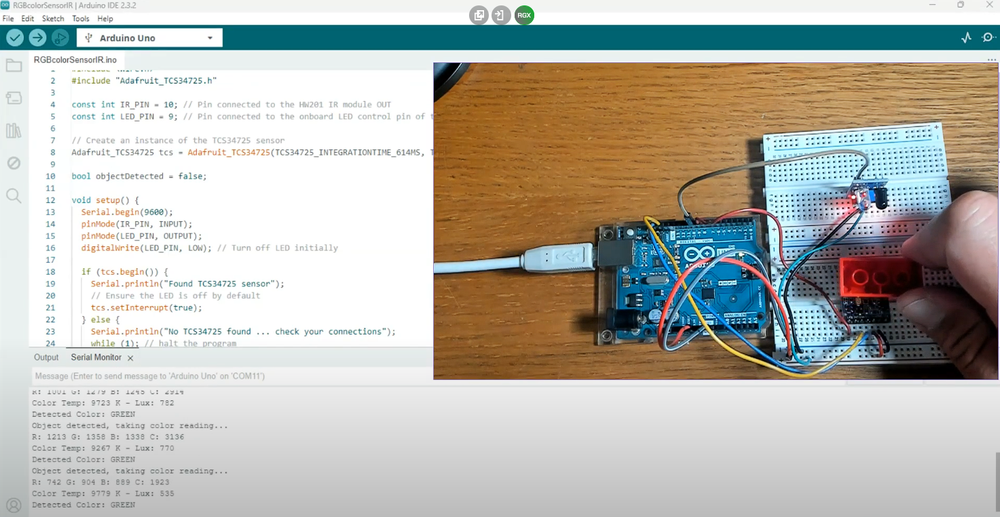
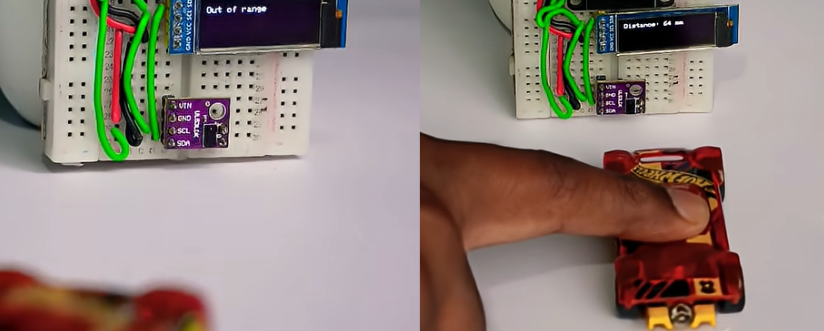

# sesion-06a

## Apuntes clase

- Falté a la clase por motivos personales, así que tuve que ponerme al día con el [video de la clase](https://www.dropbox.com/scl/fo/ehsibpioii91n7ggaj546/AO7BLMgKRYHgKI4czkODTwQ/original?dl=0&preview=sesion-06a-video-00.mp4&rlkey=kndd4mq9pdfghmp3btp2bk9pp&subfolder_nav_tracking=1) y también me comentaron cosas mis compañeros.

- En el proyecto 2 haremos algo más complejo y con sensores. Trabajaremos con grupos nuevos y podemos volver a trabajar con una sola persona con la que ya hayamos trabajado.

- [Nonsense Machines — Maywa Denki (TEDxUTokyo)](https://www.youtube.com/watch?v=jKPBD3HHU4g)

- Programación Visual y Audio

Scratch: Programación por bloques. Sirve mucho principiantes, en mi colegio lo utilizamos durante unos años.

Max/MSP: Software comercial predecesor de Pd. Programación visual para música y multimedia; MSP añade procesamiento de audio en tiempo real.

Otros entornos: TouchDesigner, vvvv, Isadora.

-----

### GitHub Actions y Automatización

Al igual que el semestre pasado, se automatizará el **proceso de revisión y limpieza del repositorio** mediante GitHub Actions, incluyendo linting de código y Markdown, para asegurar que todo cumpla con las reglas establecidas.

- Workflows: Procesos automáticos que se activan con eventos (push, pull) y se guardan en .github/workflows.

- Activación obligatoria: Presionar "I understand my workflows" en Actions. Activar.

- Linting: Limpieza automática de código y Markdown (errores de jerarquía como MD036 = -3 puntos).

- YAML: Lenguaje de configuración por indentación.

Ejecución remota: Corre en máquinas virtuales de GitHub, sin configuración local necesaria.

-----

### Proyecto 2 - Máquina Saludadora

- Entrega: 17 de octubre.

- Estética: Diseño atractivo y bien ejecutado (referente: Maywa Denki).

- Código: Limpio, ordenado y orientado a clases.

- Interacción: Intencional, nada al azar.

- Manual: Opcional, pero debe ser claro y comprensible.

-----

### Sensores 

- Detecta cambios en el ambiente o en un objeto.

- Transforma lo que detecta en una señal que se puede medir o usar.

- Funcionan como los “sentidos” de una máquina: perciben y reaccionan a estímulos.

- Podemos hacer un montón de cosas con ellos. 
  
- Acelerómetro: mide cambios en la velocidad o movimiento de un objeto.
  
- Giroscopio: detecta la orientación y rotación de un objeto.

- Luz: mide intensidad de luz en el entorno.

- Infrarrojo: detecta objetos u obstáculos usando luz invisible.

- Presión: mide fuerza aplicada sobre una superficie.

- Color: detecta colores o cambios de luz visible.

- [AFEL - Sensores](https://afel.cl)cuenta con distintos tipos de sensores, y en la página aparecen organizados por secciones, lo cual me ayuda a ver la variedad que existe.

-----

## Encargo 11

- Investigar sensores vistos en clases, cotizarlos, encontrar referentes que los usen, y describir 3 pequeñas ideas que podamos aplicar a su proyecto-02 de máquinas de saludar.

### [Sensor Color RGB TCS34725](https://afel.cl/products/sensor-color-rgb-tcs34725)

- Sensor de color que mide RGB y luz total(la cantidad de luz que recibe el sensor sin filtrar), se conecta por I2C, tiene filtro IR, LED propio y permite ajustar medición y ganancia; detecta colores con alta precisión, incluso a través de vidrios. En BMonster Laboratory, encontré este video en el cual se muestran distintos proyectos y como utilizarlo. El que más me llamó la atención fue el [Sensor del color de piezas LEGO](https://www.youtube.com/watch?v=Ey5UhCxlxi). Este detecta el color de las piezas al acercarlas, pudiendo identificar verde, azul o rojo.

- 
  
- Se me ocurre la idea de que la máquina utilice el sensor TCS34725 para detectar el color de la ropa de la persona que se acerca y, en función del color identificado, responda con un saludo personalizado. Por ejemplo, si detecta rojo, la máquina podría decir: “¡Hola! Qué color tan llamativo llevas”.
  
- Su valor es de $4.000

### [Sensor de distancia por ToF VL53L0X – Afel](https://afel.cl/products/sensor-de-distancia-por-tof-vl53l0x)

- Un sensor ToF que mide distancias de hasta 2 m.
  
- Encontré proyectos que utilizan el sensor de distancia VL53L0X, todos muy parecidos, casi todos son para medir, pero me llamó la atención este [video](https://www.youtube.com/shorts/B3Dj2yVEdvg), donde si bien sigue midiendo, el sensor detecta un "autito de juguete", lo cual encontré tierno. Se muestra cómo el sensor detecta el autito acercarse, indicando a qué distancia está y cuando está fuera de rango.

- 

- La idea para el próximo proyecto es colocar el dispositivo a la entrada de una sala para que salude automáticamente a los alumnos cada vez que alguien entre. Si detecta que entran dos personas al mismo tiempo, puede emitir el saludo dos veces o un mensaje especial para ambos. Además, el sistema puede estar acompañado de un altavoz que reproduzca el saludo de manera audible. Sería algo parecido a la escena de la película Jojo Rabbit, donde Jojo saluda a cada persona que entra a su casa. Se podrían usar variables para que el saludo sea distinto cada vez, evitando que resulte repetitivo.

- Su valor es de $5.990
