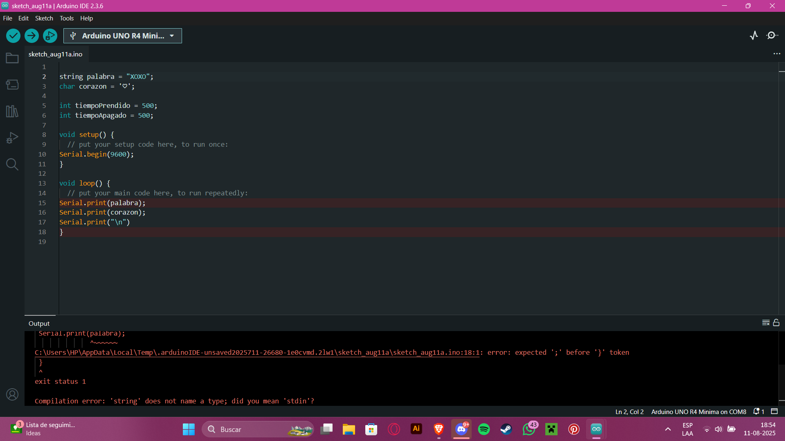
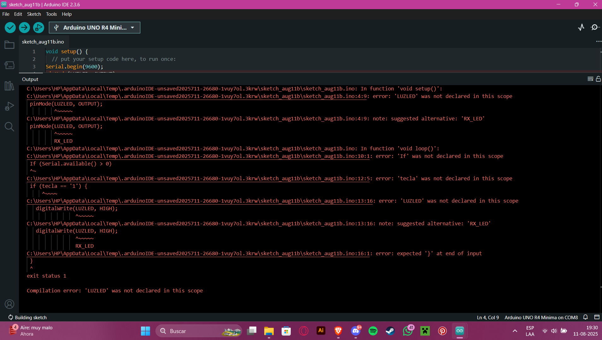

# sesion-02a

## Entrega de intentos de códigos

### CÓDIGO 1 (con error)

```cpp
//declarar palabra y caracter a utilizar
string palabra = "XOXO";
String corazon = '♡';
//tiempo de encendido y apagado
int tiempoPrendido = 500;
int tiempoApagado = 500

void setup() {
  // put your setup code here, to run once:
Serial.begin(9600);
}

void loop() {
  // loop de palabra, caracter y espacio
Serial.print(palabra);
Serial.print(corazon);
Serial.print("\n");
delay(tiempoPrendido);
delay(tiempoApagado);
}

```

### CÓDIGO 1 (sin error)

```cpp
//declarar palabra y caracter a utilizar
String palabra = "XOXO";
String corazon = "\u2661";
//tiempo de encendido y apagado
int tiempoPrendido = 500;
int tiempoApagado = 500;

void setup() {
  // put your setup code here, to run once:
Serial.begin(9600);
}

void loop() {
  // loop de palabra, caracter y espacio
Serial.print(palabra);
Serial.print(corazon);
Serial.print("\n");
delay(tiempoPrendido);
delay(tiempoApagado);
}
```

 (no se cómo colocarlo bien, ya que no me lleva a la foto)

### CÓDIGO 2

Quería realizar un código en donde al apretar la tecla 1 de mi computador, la luz Led se prendiera una vez, y al apretar la tecla 2, la luz se prendiera dos veces, pero no supe como realizarlo.

```cpp
void setup() {

Serial.begin(9600);
//pin de la luz led
pinMode(LUZLED, OUTPUT);

}

void loop() {
  // put your main code here, to run repeatedly:
If (Serial.available() > 0) 
char tecla = Serial.read();
//Para encender una vez con tecla 1
if (tecla == '1') {
  digitalWrite(LUZLED, HIGH);
  delay(1000);
  digitalWrite(LUZLED, LOW);
}
```



### CÓDIGO 3

Quería que la frase "tengo sueño" se tradujera en código morse a través de la luz led.
No se si de verdad se traduce como debe ser en morse.

```cpp
void setup() {
 pinMode(13, OUTPUT);
//frase "tengo sueño" en morse
}
//luz led traduciendo codigo morse
void loop() {
digitalWrite(13, HIGH);
delay(1000);
digitalWrite(13, LOW);
delay(500);
digitalWrite(13, HIGH);
delay(1000); 
digitalWrite(13, LOW);
delay(500);
digitalWrite(13, HIGH);
delay(1000);
digitalWrite(13, LOW);
delay(1000);
digitalWrite(13, HIGH);
delay(500);
digitalWrite(13, LOW);
delay(1000);
digitalWrite(13, HIGH);
delay(1000);
digitalWrite(13, LOW);
delay(1000);
digitalWrite(13, HIGH);
delay(500);
digitalWrite(13, LOW);
delay(500);
digitalWrite(13, HIGH);
delay(500);
digitalWrite(13, LOW);
delay(500);
digitalWrite(13, HIGH);
delay(500);
digitalWrite(13, LOW);
delay(1000);
digitalWrite(13, HIGH);
delay(500);
digitalWrite(13, LOW);
delay(1000);
digitalWrite(13, HIGH);
delay(1000);
digitalWrite(13, LOW);
delay(1000);
digitalWrite(13, HIGH);
delay(500);
digitalWrite(13, LOW);
delay(1000);
digitalWrite(13, HIGH);
delay(500);
digitalWrite(13, LOW);
delay(1000);
digitalWrite(13, HIGH);
delay(500);
digitalWrite(13, LOW);
delay(4000);
}
```
