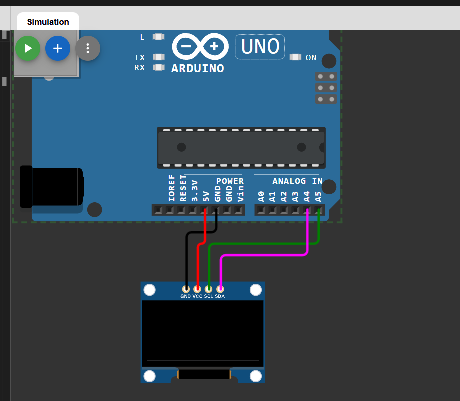

# sesion-03b
## CLASE ONLINE 22 de agosto
### ── Pantallas y Arduino.
Pantalla OLED Y TFT
⋆ Nosotros: Pantalla OLED 128 x 64.
- GND: cable principal tierra (GROUND) GND.
- VCC: Voltaje alimentación (hay que saberlo) 5V.
- SCL: signal clock (A5)
- SDA: datos (A4)
4 cables

⋆ WOKWI Y TINKERCAD: para simulaciones.

⋆ Bibliotecas: 
 - Adafruit_SSD1306
 - Adafruit-GFX

⋆ https://javl.github.io/image2cpp/
