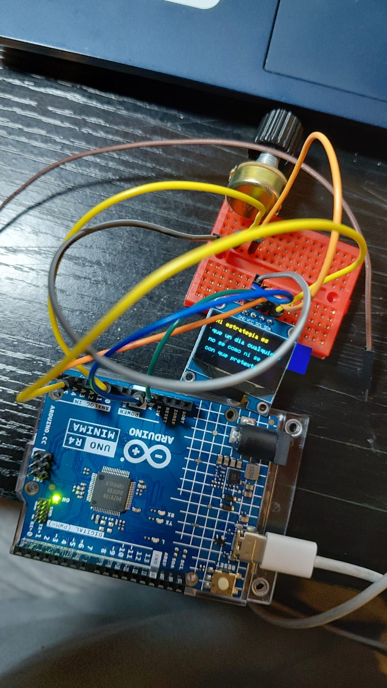

# sesion-04a
## -` ♡ ´- TRABAJO EN CLASES || PANTALLA 
             
### ── Sobre lo que aprendí al conectar una pantalla y un potenciómetro a Arduinos ──
```cpp
✩ La pantalla y el potenciómetro se pueden encajar en la Protoboard, ambas de lados
distintos separados por la división media que contiene la protoboard.
✩ El color de los cables no influye en el resultado final, pero ayuda a mantener un orden
(ejemplo: rojo para GND)
✩ A veces se pueden quemar cosas (me salió humo durante una prueba de intentar conectarlo en clases,
por suerte solo quemé un cable).
✩ GND de pantalla va con GND de Arduinos y con GND DE potenciómetro.
✩ VCC de pantalla va con 5V de Arduinos y con VCC de potenciómetro.
✩ SCL de pantalla va con A5 de Arduinos.
✩ SDA de pantalla va con A4 de Arduinos.
✩ SIG de potenciómetro va con A0 de Arduinos.
✩ La pantalla no admite carácteres de decoración, como serían "✮ ⋆ ˚｡𖦹 ⋆｡°✩"
```
#### ── CÓDIGO FINAL UTILIZADO
```cpp
#include <Wire.h>
#include <Adafruit_GFX.h>
#include <Adafruit_SSD1306.h>

// Configuración de la pantalla
#define SCREEN_WIDTH 128
#define SCREEN_HEIGHT 64
Adafruit_SSD1306 display(SCREEN_WIDTH, SCREEN_HEIGHT, &Wire, -1);

// Pin del potenciómetro
#define POT_PIN A0  

// Poema de Mario Benedetti – Fragmento de “Táctica y estrategia”
const char* poema[] = {
  "Mi tactica es",
  "mirarte, aprender",
  "como sos, quererte",
  "como sos.",
  "",
  "Mi estrategia es",
  "que un dia cualquiera",
  "no se como ni se",
  "por fin me necesites.",
  ""
};

const int numLineas = sizeof(poema) / sizeof(poema[0]);

//  Aquí las variables de scroll
int offset = 0;  

// Dibujo gatitos en código
const unsigned char PROGMEM gato [] = {
	0x00, 0x00, 0x00, 0x07, 0x7e, 0x80, 0x00, 0x00, 0x00, 0x00, 0x00, 0x3f, 0xff, 0xf0, 0x00, 0x00, 
	0x00, 0x00, 0x00, 0x3e, 0xff, 0xfe, 0x00, 0x00, 0x00, 0x00, 0x00, 0x3f, 0xff, 0xff, 0x80, 0x00, 
	0x00, 0x00, 0x00, 0x0c, 0xf3, 0xff, 0xc0, 0x00, 0x00, 0x00, 0x00, 0x00, 0x07, 0xff, 0xf0, 0x00, 
	0x00, 0x00, 0x00, 0x00, 0x0f, 0xff, 0xf8, 0x00, 0x00, 0x00, 0x00, 0x00, 0x1f, 0xff, 0xfe, 0x00, 
	0x00, 0x00, 0x00, 0x00, 0x1f, 0xff, 0xff, 0x00, 0x00, 0x00, 0x00, 0x00, 0x1f, 0xff, 0xff, 0x80, 
	0x00, 0x00, 0x00, 0x00, 0x1f, 0xff, 0xff, 0xc0, 0x00, 0x00, 0x00, 0x00, 0x0f, 0xe0, 0x03, 0xc0, 
	0x00, 0x00, 0x00, 0x00, 0x0f, 0xc0, 0x00, 0xe0, 0x00, 0x00, 0x60, 0x00, 0x07, 0xc0, 0x00, 0x70, 
	0x00, 0x00, 0x18, 0x00, 0x07, 0xc0, 0x00, 0x30, 0x00, 0x00, 0x07, 0x00, 0x07, 0xc0, 0x00, 0x08, 
	0x00, 0x00, 0x01, 0x83, 0x07, 0xc0, 0x00, 0x0c, 0x00, 0x00, 0xf8, 0x61, 0x87, 0xe0, 0x00, 0x00, 
	0x00, 0x00, 0x0f, 0x39, 0x87, 0xf0, 0x00, 0x00, 0x00, 0x00, 0x01, 0xf8, 0x0f, 0xff, 0xfe, 0x00, 
	0x00, 0x01, 0xf8, 0x30, 0x0f, 0xff, 0xff, 0x80, 0x00, 0x01, 0xff, 0xe0, 0x0f, 0xff, 0xff, 0xc0, 
	0x00, 0x00, 0x00, 0xf0, 0x0f, 0xff, 0xff, 0xe0, 0x00, 0x00, 0x00, 0x00, 0x0f, 0xff, 0xff, 0xf0, 
	0x00, 0x00, 0x00, 0x00, 0x3f, 0xff, 0xff, 0xf8, 0x00, 0x00, 0x00, 0x78, 0x3f, 0xff, 0xff, 0xfc, 
	0x00, 0x00, 0x00, 0xff, 0xff, 0xff, 0xff, 0xfc, 0x00, 0x00, 0x00, 0xff, 0xff, 0xff, 0xff, 0xfe, 
	0x80, 0x00, 0x00, 0xff, 0xff, 0xff, 0xff, 0xfe, 0x80, 0x00, 0x00, 0xff, 0xff, 0xff, 0xff, 0xff, 
	0x80, 0x00, 0x00, 0x3f, 0xff, 0xff, 0xff, 0xff, 0x80, 0x00, 0x00, 0x07, 0xff, 0xff, 0xff, 0xff, 
	0xc0, 0x00, 0x00, 0x00, 0x37, 0xff, 0xff, 0xff, 0x80, 0x00, 0x00, 0x00, 0x01, 0xff, 0xff, 0xff, 
	0xc0, 0x00, 0x00, 0x00, 0x00, 0xff, 0xff, 0xff, 0xc0, 0x00, 0x00, 0x00, 0x00, 0x7f, 0xff, 0xff, 
	0xe0, 0x00, 0x00, 0x00, 0x00, 0x7f, 0xff, 0xff, 0xe0, 0x00, 0x00, 0x00, 0xe0, 0xff, 0xff, 0xff, 
	0xf0, 0x00, 0x00, 0x01, 0xfd, 0xff, 0xff, 0xff, 0xf0, 0x00, 0x00, 0x0f, 0xff, 0xff, 0xff, 0xff, 
	0x7c, 0x00, 0x00, 0x0f, 0xff, 0xff, 0xff, 0xff, 0x7e, 0x00, 0x00, 0x0f, 0xfc, 0xff, 0xff, 0xfe, 
	0x7f, 0x00, 0x00, 0x07, 0xff, 0xff, 0xff, 0xfe, 0x3f, 0x80, 0x00, 0x0f, 0xfc, 0xff, 0xff, 0xfc, 
	0x3f, 0xf8, 0x00, 0x0f, 0xfb, 0xff, 0xff, 0xfc, 0x3f, 0xff, 0xfc, 0x0f, 0x3d, 0xff, 0xff, 0xf8, 
	0x1f, 0xff, 0xfe, 0x0f, 0xbf, 0xff, 0xff, 0xf8, 0x0f, 0xff, 0xff, 0x0f, 0xff, 0xff, 0xff, 0xf0, 
	0x07, 0xff, 0xff, 0x0f, 0xff, 0xff, 0xff, 0xf0, 0x03, 0xff, 0xff, 0x0f, 0xff, 0xff, 0xff, 0xe0, 
	0x00, 0xff, 0xfe, 0x0f, 0xff, 0xff, 0xff, 0xe0, 0x00, 0x3f, 0xfe, 0x0f, 0xff, 0xff, 0xff, 0xc0, 
	0x00, 0x0f, 0xf8, 0x07, 0xff, 0xff, 0xff, 0x80, 0x00, 0x01, 0xe0, 0x07, 0xff, 0xff, 0xff, 0x00, 
	0x00, 0x00, 0x00, 0x03, 0xff, 0xff, 0xfe, 0x00, 0x00, 0x00, 0x00, 0x07, 0xff, 0xff, 0xfc, 0x00, 
	0x00, 0x00, 0x00, 0x07, 0xff, 0xff, 0xf8, 0x00, 0x00, 0x00, 0x00, 0x0f, 0xff, 0xff, 0xe0, 0x00, 
	0x00, 0x00, 0x00, 0x1f, 0xff, 0xff, 0x80, 0x00, 0x00, 0x00, 0x00, 0x18, 0x63, 0xff, 0x00, 0x00, 
	0x00, 0x00, 0x00, 0x00, 0x61, 0xfc, 0x00, 0x00, 0x00, 0x00, 0x00, 0x00, 0xc1, 0xf0, 0x00, 0x00, 
	0x00, 0x00, 0x00, 0x00, 0xd7, 0x80, 0x00, 0x00, 0x00, 0x00, 0x00, 0x01, 0xfe, 0x00, 0x00, 0x00
};


// Este es el Loop
void setup() {
  if (!display.begin(SSD1306_SWITCHCAPVCC, 0x3C)) {
    for (;;); // Si falla, queda en loop
  }
  display.clearDisplay();
  display.setTextSize(1);
  display.setTextColor(SSD1306_WHITE);
}

void loop() {
  int valorPot = analogRead(POT_PIN);

// Mapear valor del potenciometro a rango de líneas
  offset = map(valorPot, 0, 1023, 0, numLineas - 4); 

  display.clearDisplay();

  if (offset < numLineas - 4) {
    // Mostrar 4 líneas del poema
    for (int i = 0; i < 4; i++) {
      int linea = offset + i;
      if (linea < numLineas) {
        display.setCursor(0, i * 16);
        display.println(poema[linea]);
      }
    }
  } else {
    // Para mostrar gato al cnetro al final
    display.drawBitmap(
      (SCREEN_WIDTH - 64) / 2, 
      (SCREEN_HEIGHT - 64) / 2, 
      gato, 64, 64, 1
    );
  }

  display.display();
  delay(100);
}
``` 
##### ── Pruebas en clase aún sin utilizar el potenciómetro.


###### ── Sobre otras cosas.
```cpp
✩ El valor del potenciómetro mínimo que entrega es 0 y el máximo es 1023.
✩ Utilizamos un fragmento de un poema de Mario Benedetti titulado "Táctica y estrategia"
```
[Link de donde se sacó el fragmento de poema Táctica y estrategia](https://www.poemas-del-alma.com/tactica-y-estrategia.htm)

###### ── Pruebas con pantalla y potenciómetro.


##### ── ENCARGO POESÍA Y TRABAJO

𔓘 **Allison Parrish**  
Allison Parrish es una poeta, programadora, diseñadora de juegos y profesora asistente de Artes en la Universidad de Nueva York ITP/IMA (programa de artes de medios interactivos de la Tisch School of the Arts de Nueva York NYU), lo que consiste en un programa de pregrado para explorar la tecnologia e interactividad de forma creativa en medios que van emergiendo. Es originaria de West Bountiful, Utah y actualmente vive en Brooklyn. Sus proyectos estan muy relacionados al lenguaje y cómo se organiza y es utilizado en el contexto computacional y de internet, además de dar clases de programación, computación creatividad y cultura, análisis de textos y tutoriales o talleres públicos que posteriormente publica en GitHub.

[Información de ella sacada de aquí](https://www.decontextualize.com/)

[Información sobre ITP/IMA](https://tisch.nyu.edu/itp#:~:text=Artes%20de%20Medios%20Interactivos%20(IMA%20%E2%80%93%20licenciatura),1%20de%20agosto%20de%202025.)

[EVERYWORD](https://x.com/everyword)
[Sobre EVERYWORD](https://www.decontextualize.com/2014/06/task-complete/)

[Su portafolio](https://portfolio.decontextualize.com/)
