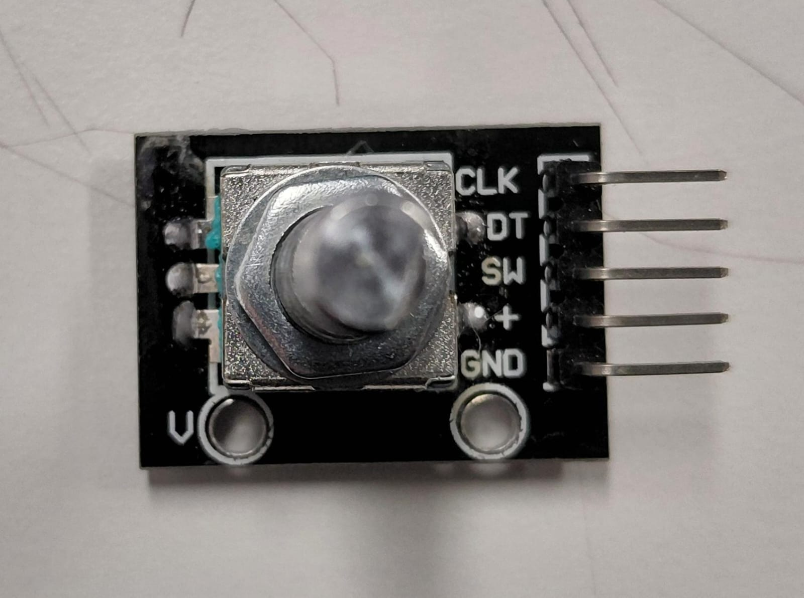
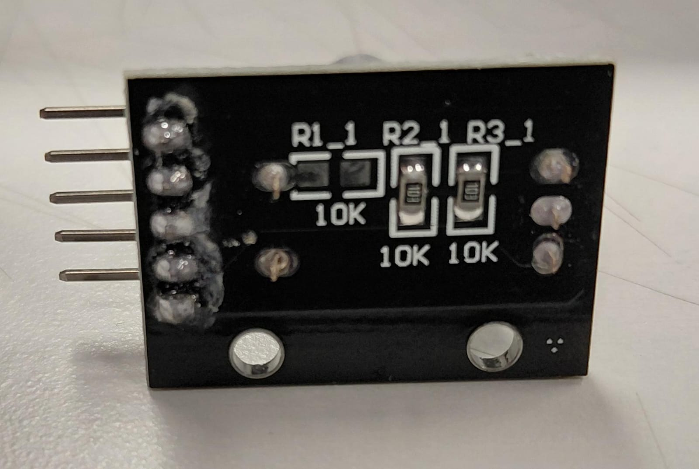
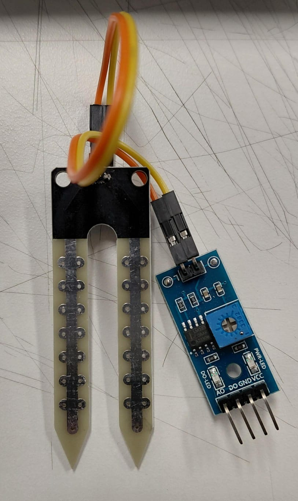

# sesion-06a
## CLASE 09.09.25 ── .✦
### A P U N T E S .ᐟ.ᐟ

✰ [SCRATCH](https://scratch.mit.edu/)

✰ [PURE DATA](https://puredata.info/)

✰ TouchDesigner también se programa pero con cajitas.

✰ [VVVV](https://vvvv.org/)

✰ Action ---> WorkFlow: flujo de trabajo, automatizar dentro del repositorio 

✰ Carpeta .github ---> markdown-lint.yml. (proceso automatizado de limpieza, depuración de estilos y detectar errores en la programación, que se cumplan las leyes de markdown)
Lint: pelusa, archivo para sacar las pelusas.

✰ [OVERLEAF](https://es.overleaf.com/) ----> utiliza LaTeX.

✰LaTeX: no es un lenguaje de programación tradicional, sino un sistema de composición tipográfica para la creación de documentos de alta calidad, especialmente en campos científicos y técnicos. Se asemeja a programar porque separa el contenido de su formato y se basa en comandos específicos que se compilan para generar un documento final, usualmente en formato PDF. [Manual de LaTeX](https://aprendeconalf.es/latex-manual/introduccion.html)

✰Los sensores los usamos como entrada a la caja negra. 

✰ [AFEL](https://afel.cl/) ------> comprar cosas para Arduino.

#### SENSORES ── .✦

- Ultrasonico: emite un sonido y cuenta cuanto se demora en volver (es bien impreciso). Medir distancias. Sensor de Ultrasonico HC-SR04, $1500 por unidad. [ultrasonico](https://afel.cl/products/sensor-de-ultrasonico-hc-sr04)

- De temperatura y humedad: detecta temperatura y humedad (para ambiente). Sensor de temperatura y humedad DHT11, $2300 por unidad. [temperatura y humedad](https://afel.cl/products/sensor-de-temperatura-y-humedad-dht11)

- De gas: adecuado para detectar la presencia de Gas LP, compuesto principalmente por Propano y Butano y Gas Natural (Metano) en el aire. Sensor de Gas LP MQ6, $2300 por unidad. [de gas](https://afel.cl/products/sensor-de-gas-lp-mq6)

- Encoder rotatorio: gira sin límite (diferente al potenciómetro), puede girar y clickearse, como para elegir opciones y presionar (ej: cosito de la lavadora). Encoder rotatorio KY-040 360 grados. $2000 por unidad. [encoder](https://afel.cl/products/encoder-rotatorio-ky-040-360-grados)

- De humedad: se usan para plantas, se puede saber si la planta esta seca y cuando hay que regar. Sensor Humedad Suelo Higrometro. $2300 por unidad.
[Sensor Humedad](https://afel.cl/products/sensor-humedad-suelo-higrometro)
ideas: una mascota interactiva utilizando una plantita de base, si la planta tiene sed, o esta sobrehidratada, o se encuentra bien, la mascota puede mostrar el estado, quizas con luces de algún tipo de color, sonidos, o una pantalla en donde se vean "expresiones", que sonría, que llore, o que hable diciendo que tiene sed y cuando se encuentra bien. Puede ayudar a personas que cuidan plantitas o para aquellas que quieren aprender y se les dificulta.
[Ejemplo de idea ya realizada 1 ](https://www.instructables.com/Interactive-Plant-Plant-Mood-Detector/)

- De lluvia: detecta gotitas de agua (es una resistencia experimental), sea lo que sea que caiga en la plaquita (incluso si toco con mi dedo) lo detecta. Sensor pasivo.
- Joystick: incluye potenciometros dentro, tene un botón también, es como los de mandos de juego.
- fotodio:
- De sonido: usan micrófono, se usan para medir intensidad de sonido o detectar si se emitió un sonido. (ejemplos: detectos de aplausos, de portazos, cada 4 aplausos quiero que mi robot salude)
idea: un robot que te juzgue.

##### Otras ideas

1. Robot que salude y comente del clima, utilizando el sensor de temperatura y humedad. Suelta frases dependiendo del clima, como "hace calor, bebe agua" o "esta frío, ponte un abrigo", etc.
2. Robot que se active al acercarse con el sensor de proximidad y lance recordatorios o datos curiosos, preguntando cosas como si ya comiste, te lavaste las manos, bebiste agua o algo sobre la fecha del día, algun dato
3. Utilizando joystick, botones y/o encoder, el robot te "juzga" dependiendo de qué tanto manipules cada sensor. Si mueves demasiado el joystick o el encoder, que diga algo como "ya basta, no soy un juguete", o si no presionass ninguno y dejas de interactuar con él, que diga algo como "me estas ignorando, como todos", o si presionas mucho un botón, que diga algo como "qure ansioso eres"
4.una mascota interactiva utilizando una plantita de base, si la planta tiene sed, o esta sobrehidratada, o se encuentra bien, la mascota puede mostrar el estado, quizas con luces de algún tipo de color, sonidos, o una pantalla en donde se vean "expresiones", que sonría, que llore, o que hable diciendo que tiene sed y cuando se encuentra bien. Puede ayudar a personas que cuidan plantitas o para aquellas que quieren aprender y se les dificulta. (muy complejo, dijeron que mejor para última entrega)
