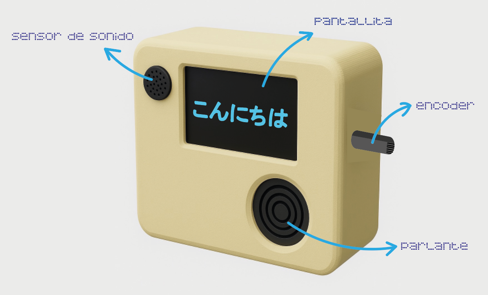

# sesion-09b

## Avances clase
- Imágenes listas agregadas al código en un .h que contiene todas
- Ver boceto para la carcasa del robot
- Terminar de elegir audios
- Ordenar el código como .h y .cpp

### Idea de carcasa
- Se debe ver la pantallita en el centro (es pequeña)
- Encoder en un costado para manejar fácilmente y que no moleste
- Siguiendo la idea de reproductor portátil. 

Imagen hecha con IA y modificada
