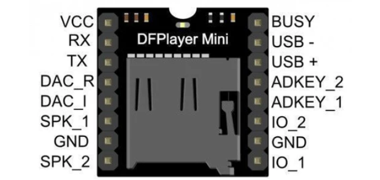
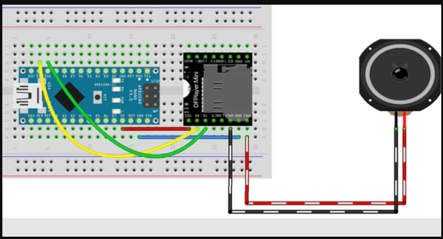

# sesion-10a
## TRABAJO EN CLASES
- Cableado con parlante y el reproductor mp3 que vieron mis compañeras. Anteriormente el grupo de tralaleros nos habia ayudado.
- https://www.taloselectronics.com/blogs/tutoriales/como-usar-dfplayer-modulo-reproductor-mp3-con-arduino

### DURANTE LA CLASE
