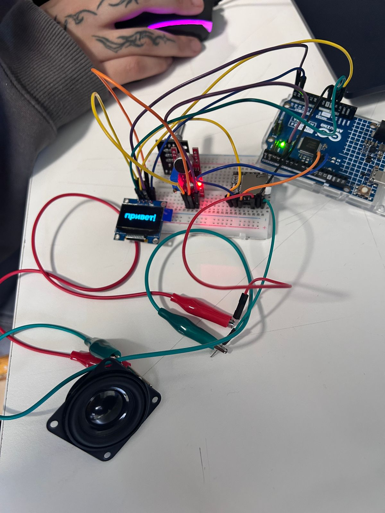
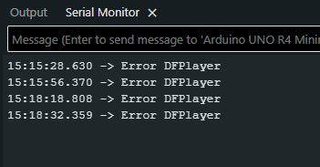

# sesion-10a

14 Octubre 2025

## Trabajo en clases

## Cableado parlante

Estoy viendo como se hacía el cableado con el parlante y el reproductor mp3. En el reproductor MP3 no dice nada, asi que tuve que buscarlo de nuevo. Anteriormente, el grupo de tralaleros nos habia ayudado, pero se me perdió el link que usé para hacer el cableado anteriormente.

De acuerdo a este link <https://www.taloselectronics.com/blogs/tutoriales/como-usar-dfplayer-modulo-reproductor-mp3-con-arduino>

El cableado del reproductor MP3 se hace así

VCC a 5V

RX a pin 11

TX a pin 10

SPK1 y SPK2 a parlante

## Problemas con sensores

Como grupo estuvimos haciendo el cableado de todos los sensores que vamos a conectar. Utilizamos una gran cantidad de cables para solo algunos de los sensores que tenemos que conectar.

Cuando teníamos listo todo el cableado de los sensores, nos dimos cuenta que la pantallita ya no encendía. Por lo que Misa nos ayudó con el cableado. Efectivamente era problema de como lo habíamos conectado todo. Nos enseñó cómo conectar los cables de manera más eficiente en la protoboard que tenemos.

Ya la pantallita funcionó, se escuchaban los audios que estaban dentro de la tarjeta SD. El problema es que el encoder se podía presionar, pero no funcionaba al momento de girarlo. No se podía navegar por las opciones en el menú.

Misa nos revisó el código, y la verdad es que no entendí muy bien que hizo, pero ahora sí se puede usar el encoder. Lo que faltaría ahora es que funcione todo el resto de las cosas. Hace poco, @Joquape consiguió que apareciera el mensaje de "Aplaude para continuar" en la pantallita después de elegir un idioma. Necesito conseguir que funcione el aplauso en esta parte del código.

## Trabajo en lab

Estoy aquí en el lab probando lo que llevamos. Hasta ahora, la pantallita conecta a veces, cuando quiere. El encoder no funcionaba, pero @sebastiansaez1003 me ayudó. Probablemente fue cableado porque solo lo moví un poquito y empezó a funcionar. Y ahora el reproductor MP3 me da error constantemente. Ya moví los cables RX y TX que estaban en los lugares incorrectos, pero aún así no logro conectarlo.

Entre tanta cosa que se intentó, terminó funcionando igual. Probablemente fue algo del cableado, pero realmente no estoy segura.

Ya siguiendo con la parte del sensor de aplausos, con @antokiaraa trabajamos en que por fin funcionara la última parte. Teníamos dos códigos separados, y fue un caos tremendo tratar de hacer que funcionara uno de los dos. Cuando llegó Aarón a la sala, nos ayudó a poder organizarnos mejor. Nos olvidamos de un código y utilizamos el que yo entendía para evitar seguir estancadas. Finalmente, terminamos por no trabajar los dos aplausos como queríamos, ya que hacer que un sensor lea algo es muy fácil. Pero filtrar esa información ya es una tarea mayor que requeriría más tiempo dentro del aprendizaje. El tiempo es algo lamentablemente algo que no tenemos en este momento. Por lo que no funciona como queríamos.

Otra parte que trabajamos fue el audio que se cortaba a la mitad cuando se reproducía. El problema fue que duraban mucho, por lo que cortamos los audios para que pudiera funcionar. Además de que descubrimos gracias a Aarón que el sensor de sonido no estaba detectando nada porque había que conectarlo a través de las patitas digitales en vez de las análogas.

Entonces, hasta ahora lo que **si funciona**:
- Pantallita
- Menú de idiomas
- Encoder (girar y pulsar)
- Sensor de sonido (solo un aplauso en vez de dos)
- Reproductor MP3 (audios de los tres idiomas)
- Mensaje de aplaude dos veces para continuar
- Imágenes de bitmap de cada idioma

Lo que **no funciona** y lo que **no alcanzamos a incorporar**:
- Loop de aplaudir para reproducir audio/mensaje y después volver al menú con el encoder
- Dos aplausos para reproducir
- Luz LED con ritmo del latido de un corazón

  Ojalá poder volver a este proyecto en el futuro y poder hacer que funcione una vez que tenga más conocimiento acerca de la programación.
