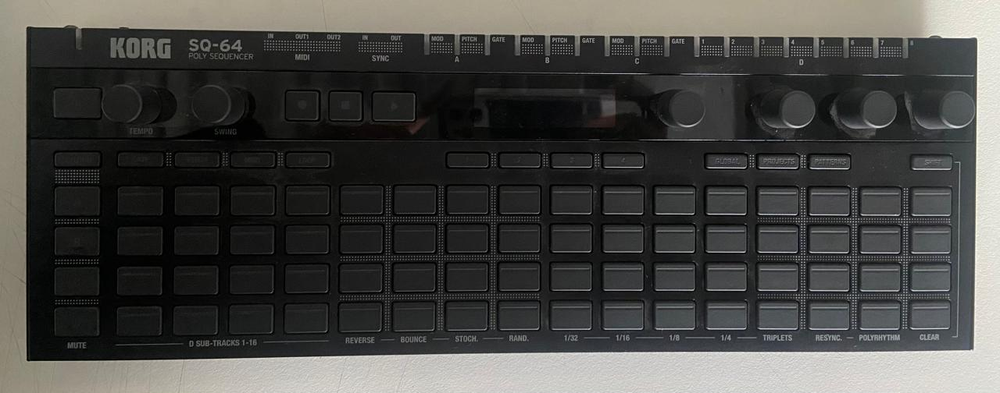
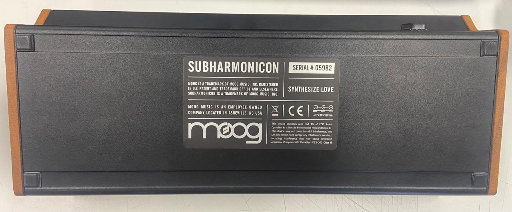
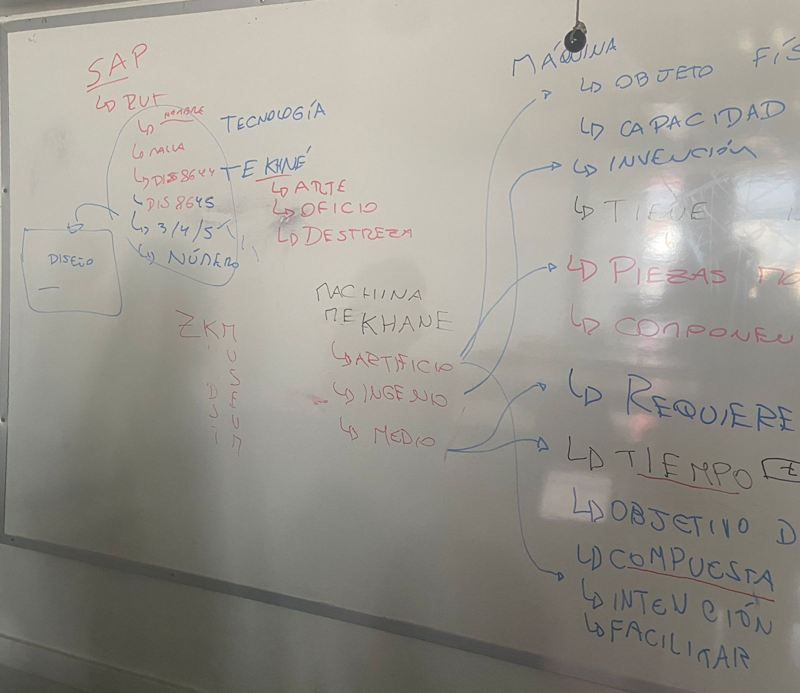
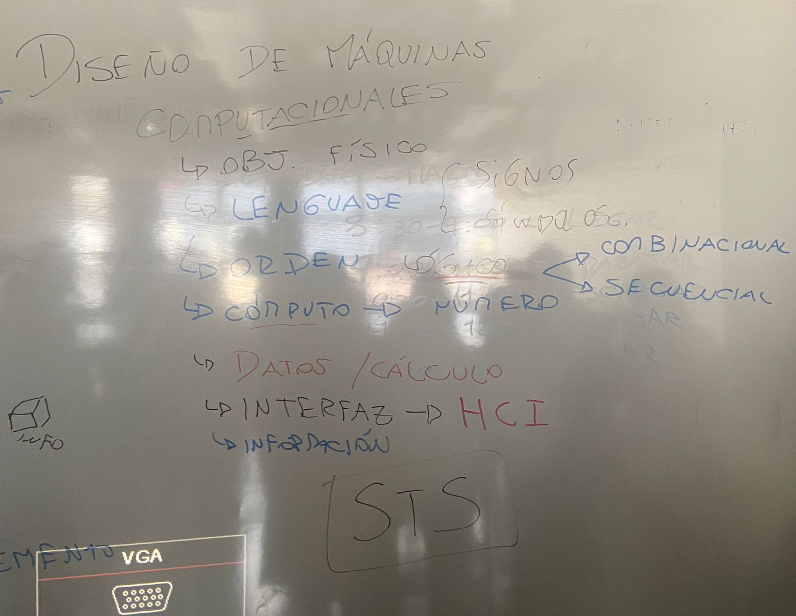

# ⋆₊˚⊹♡ Clase 01a - Primer día de clases ♡⊹˚₊⋆

Martes 5 Agosto 2025

***

## Observaciones

Este día me costó levantarme, principalmente por mi desorden del descanso y horas de dormir. Pese a ello me esforcé por ir a la clase. Al momento de llegar me di cuenta que se estaban presentando. Tras haber terminado dicha etapa se fue hzo la reflexión acerca de los terminos "máuina" y "computacional".

***

### Escaneo de bitácora y apuntes escritos del día

▼ Descripción de la imagen. Obtenido de: cita

▼ Secuenciador de pasos polifónico "Q64" - KORG. Obtenido de: creación personal. [Más información del producto.](https://www.korg.com/cl/products/dj/sq_64/)

▼ Sinetizador semi-modular análogo poliritmico "Subharmonicon" - Moog. Obtenido de: creación personal. [Más información del producto.](https://www.moogmusic.com/synthesizers/subharmonicon/)

***

### ¿Qué es una máquina?

Energía más tiempo = Potencia

### ¿Qué es un computador (computacional)?

Este semestre se busca trabajar más desde un computador, pero no por ello se va a realizar trabajos con circuitos de forma física. Para ello se usará la tecnología PCBA.
Raspberry pi RP2040,
JLCPBC

***

### Listado de conceptos

### _Herramientas, conceptos, etc_

- Lenguajes de progamación C y C++
- [Mermaid](https://mermaid.js.org/) (programa para la diagramación de textos)
- [Magister de Artes mediales](https://artes.uchile.cl/postgrados/43490/artes-mediales)
- Mechanic.design ([sitio web 1](https://mechanicaldesign101.com/) y [sitio web 2](https://www.machinedesign.com/))
- [Tiny Trainable](https://github.com/montoyamoraga/tiny-trainable-instruments)
- Computadores análogos
- [ZKM](https://en.wikipedia.org/wiki/ZKM_Center_for_Art_and_Media_Karlsruhe) (arte electrónico)
- Dev board ([video explicativo en inglés](https://www.youtube.com/watch?v=JrO2LziLXtM&ab_channel=UTSOURCE))
- [Raspberry pi RP2040](https://raspberrypi.cl/producto/raspberry-pi-rp2040/)

### _Personas_

- [Roberto Bolaño](https://es.wikipedia.org/wiki/Roberto_Bola%C3%B1o) (escritor) ["Estrella distante"](https://es.wikipedia.org/wiki/Estrella_distante).
- [Cristian Oyarzun](https://www.instagram.com/coyarzunroa/) (programador)
- [Rafael Berguña](https://www.uc.cl/universidad/premios-nacionales/rafael-benguria-donoso/) (Premio nacional de ciencias)
- [Rodrigo Cádiz](https://musica.uc.cl/docentes/rodrigo-cadiz/) y la psicoacutica
- [María José Contreras Lorenzini](https://www.mariajosecontreras.com/)
- [Tod Machover](https://www.media.mit.edu/people/tod/overview/)
- [Zach Lieberman](http://zach.li/)
- [Pete Warden](https://petewarden.com/) (blog)
- [Muriel Cooper](https://disenadorasgraficas.com/biografia/muriel-cooper/)
- [John Maeda](https://www.media.mit.edu/people/maeda/overview/)
- [Casey Reas](https://reas.com/)
- Hernando Barragán ([La historia no contada de Arduino](https://arduinohistory.github.io/))
- [Tom Igoe](https://tigoe.com/)
- [Mar Hicks](https://marhicks.com/)

***

### Tarea 01: ¿Quiénes son?

#### 1. Ada Lovelace

*Información recuperdada de:*

#### 2. Alan Turing

Matemático, informático teórico de origen británico.
Es uno de los precursores de las computadoras y de la informática. A temprana edad se interesó por la relación entre mente y materia, involucrandose con la física y mecánica cuántica. En la universidad "King's College Cambridge" se destacó en lógica y matemática. Más tarde (1936) hizo un doctorado en criptología en la Universidad de Princeton, ideando el funcionamiento de una máquina que pudiera resolver problemas traducido a operaciones mátemáticas y cuyo resultado constara en una serie de operaciones lógicas en código binario (si y no, 1 y 0, etc). 

Uno de sus hitos más grandes sería en la Segunda Guerra Mudial, fecha en la cuál los Alemanes utilizaban la máquina "Enigma" para encriptar sus mensajes (con más de 150 billones de combinaciones posibles). A partir de ello, Turing crearía en Bletchley Park (1939) una máquina llamada "Bombe", la precursora de los computadores programables, la que se encargaba de descifrar dichos mensajes y recuperar información valiosa para adelantarse a las estrategias del enemigo. 

*Información recuperdada de:*
1) https://www.cultura.gob.ar/alan-turing-el-padre-de-la-inteligencia-artificial-9162/
2) https://es.wikipedia.org/wiki/Enigma_(m%C3%A1quina)
3) https://es.wikipedia.org/wiki/Bombe

***

### Posdata

Espacio para ideas y pensamientos varios ૮₍ ´ ꒳ `₎ა

***

°˖✧◝(⁰▿⁰)◜✧˖°
