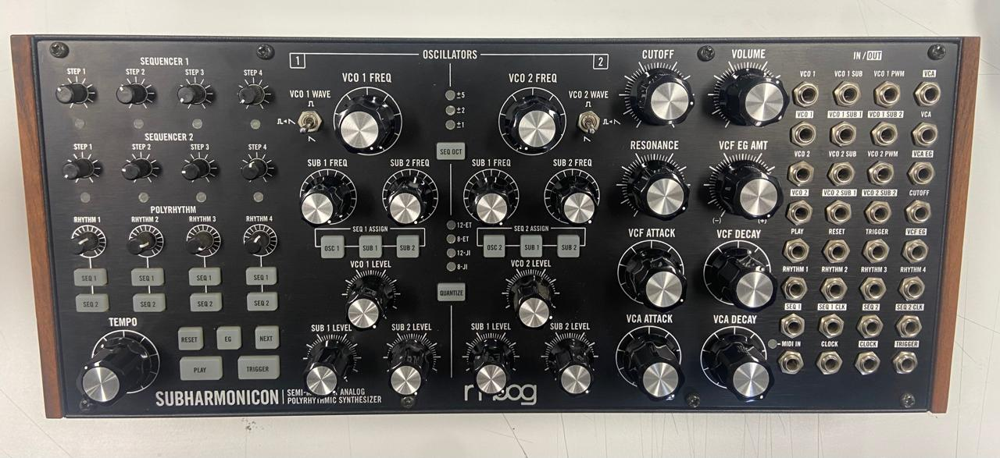

# ⋆₊˚⊹♡ Clase 01a - Primer día de clases ♡⊹˚₊⋆

Martes 5 Agosto 2025

***

## Observaciones

Este día me costó levantarme, principalmente por mi desorden del descanso y horas de dormir. Pese a ello me esforcé por ir a la clase. Al momento de llegar me di cuenta que se estaban presentando. Tras haber terminado dicha etapa se fue hzo la reflexión acerca de los terminos "máuina" y "computacional".

***

### Escaneo de bitácora y apuntes escritos del día

▼ Descripción de la imagen. Obtenido de: cita

▼ Secuenciador de pasos polifónico "Q64" - KORG. Obtenido de: creación personal. [Más información del producto.](https://www.korg.com/cl/products/dj/sq_64/)

▼ Sinetizador semi-modular análogo poliritmico "Subharmonicon" - Moog. Obtenido de: creación personal. [Más información del producto.](https://www.moogmusic.com/synthesizers/subharmonicon/)

***

### ¿Qué es una máquina?

Energía más tiempo = Potencia

### ¿Qué es un computador (computacional)?

Este semestre se busca trabajar más desde un computador, pero no por ello se va a realizar trabajos con circuitos de forma física. Para ello se usará la tecnología PCBA.
Raspberry pi RP2040,
JLCPBC

### Listado de conceptos

#### _Herramientas, conceptos, etc_

- Lenguajes de progamación C y C++
- Mermaid (programa para la diagramación de textos)
- Magister de Artes mediales
- Mechanic.design (web)
- Tiny Trainable
- Computadores análogos
- ZKM (arte electrónico)
- Dev board

#### _Personas_

- Roberto Bolaño (escritor) "Estrella distante".
- Cristian Oyarzun (programador)
- Rafael Berguña (Premio nacional de ciencias)
- Rodrio Cadiz y la psicoacutica
- María José Contreras Lorenzini
- Tod Machover
- Zach Lieberman
- Pete Warden
- Muriel Cooper
- John Maeda
- Casey Reas
- Hernando Barragan
- Tom Igoe
- Ada Lovelace
- Alan Turing
- Mar Hicks

### Tarea 01

Aún no hay apuntes

***

### Posdata

Espacio para ideas y pensamientos varios ૮₍ ´ ꒳ `₎ა

***

°˖✧◝(⁰▿⁰)◜✧˖°
