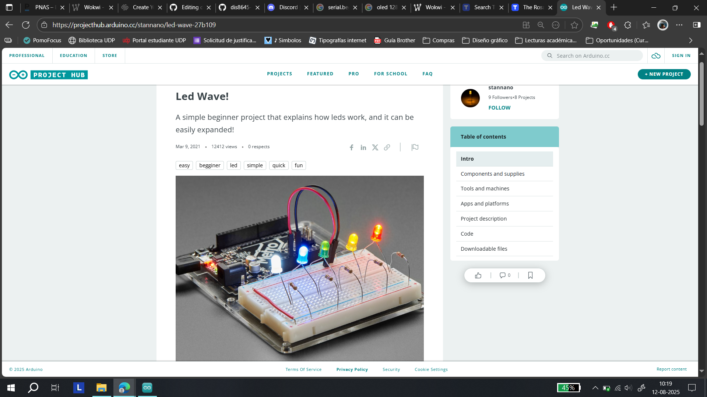
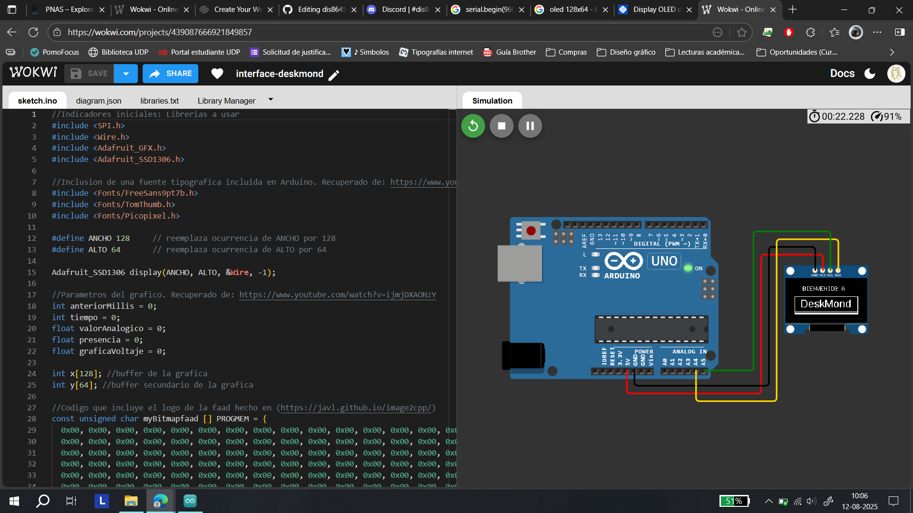

# ⋆₊˚⊹♡ Clase 01b - Introducción a github, discord, arduino IDE ♡⊹˚₊⋆

Viernes 8 Agosto 2025

***

## Observaciones

Tuve inconvenientes para llegar a la hora, dado que se les ocurrió romper una calle por la cual transitan las micros que me acercan al metro. Terminé pidiendo un auto por uber para llegar al metro más cercano e ir corriendo a la sala.

***

### Apuntes escritos de la grabación


▼ Descripción de la imagen. Obtenido de: cita

***

### ¿Qué sucedió durante la clase?

Dicho día me emocioné bastante, dado que pude recuperar un archivo de arduino que creía perdido. Lo pude abrir y quise revisar el cómo estaba construido, a la par que fui contandole a mi compañero de puesto el cómo funcionan unas secciones de código. Ante ello me distraje de la clase y lo que estaban realizando, por lo que decidí replicar proyectos pequeños que mezclaran circuitos con código y arduino.

Ante ello conseguí un [proyecto](https://projecthub.arduino.cc/stannano/led-wave-27b109) para poder crear una corrida de leds que se fueran activando de forma secuencial (primero 1, luego otro, y así).



▼ Página web del proyecto. Obtenido de: recurso propio.

En dicho lugar me dispuse a replicar el circuito, pero con menos leds (3 en vez de 5). Los colores que elegí fueron rojo, verde y azul. Tras probar la iluminación de cada uno terminé cambiando el color del led verde por uno blanco.

Tras ello me dispuse a ver el [código mostrado en la página](./codigo-arduino/led_wave.txt), copiandolo y analizando sus partes para poder replicarlo.

```cpp
int ledCount = 5;
int leds[] = {13, 12, 11, 10, 9};
int currentState[]   = {HIGH, LOW, LOW, LOW, LOW};
int currentHighLed = 0;

void setup() {
for   (int i = 0; i < ledCount; i++) {
pinMode(leds[i], OUTPUT);
}
}

void   loop() {

for (int i = 0; i < ledCount; i++) {
digitalWrite(leds[i], currentState[i]);
}
currentState[currentHighLed]   = LOW;
currentHighLed++;
if (currentHighLed >= 5) {
currentHighLed = 0;
}
currentState[currentHighLed]   = HIGH;
delay(500);
}
```

▼ Código completo del proyecto. Obtenido de: [project hub](https://projecthub.arduino.cc/stannano/led-wave-27b109)

Las primeras 5 líneas son variables de tipo "int" (número entero)(1), y estas se ven relacionadas con la cantidad de leds presentes (ledCount), las salidas de los pines que van a usar (leds[]  = {13, 12, 11, 10, 9};), si se encuentra encendido o apagado el led (currentState), y un valor que indique la intensidad de la luz (currentHighLed = 0).

A continuación se presentan procesos llevados a cabo mediante las funciones "void setup" y "void loop"(2). La primera se centra en contener "pasos" para  para iniciar el sistema, los cuales ocurren una vez de forma líneal (todo el código depende del orden). Por otra parte el "loop" o blucle contiene comandos que se ejecutan a traves del arduino hasta la última línea de código que contenga la función, para nuevamente repetirse. Cabe mencionar que mientras el arduino se encuentre funcional y cuente con energía se seguirá leyendo y actuando dicha información en bucle.

Continuando con el análisis se pueden encontrar funciones tales como:

- for (inicialización; condición; incremento) {
  // instrucciones que se repiten } (3)
  
- pinMode(número del pin [valor], OUTPUT ; (4)

- digitalWrite(número del pin [valor], currentState[HIGH O LOW]); (4)

- currentState[currentHighLed]   = LOW;
  
Links de consulta: [1. Aprender a programar](https://www.aprenderaprogramar.com/index.php?option=com_content&view=article&id=899:tipos-de-datos-en-c-declarar-variables-enteras-int-long-o-decimal-float-double-char-inicializacion-cu00510f&catid=82&Itemid=210)

[2. Proyectos con arduino](https://proyectosconarduino.com/curso/funciones-arduino-void-loop-y-void-setup/)

[3. Para arduino](https://paraarduino.com/programacion/el-bucle-for/)

[4. Programar fácil](https://programarfacil.com/blog/arduino-blog/pines-digitales-de-arduino/)

***

### Estudio de un código olvidado

Para poder volver a entender sobre como codificar en arduino es que decidí analizar un código que tenía guardado hace 2 años, para poder entenderlo y descubrir qué fue lo que programé, el cómo lo hice y qué significa cada línea.

En un comienzo quise probar si funcionaba armando un pequeño circuito con una protoboard, un [display de 28 x 64 px](https://mcielectronics.cl/shop/product/display-oled-de-128-x-64-pixeles-controlable-por-i2c-29546/) y cables dupont.

Al parecer alguna de las piezas estaban dañadas (conclusión), por lo que terminé usando un simulador online: [WOKWI](https://wokwi.com/projects/439087666921849857)



▼ Captura de WOKWI con el código y circuito simulado. Obtenido de: recurso propio.

***

### Tarea 02: ¿Qué puedo hacer con un Arduino y un computador?

Aún no hay apuntes

***

### Posdata

Espacio para ideas y pensamientos varios ૮₍ ´ ꒳ `₎ა

***

°˖✧◝(⁰▿⁰)◜✧˖°
